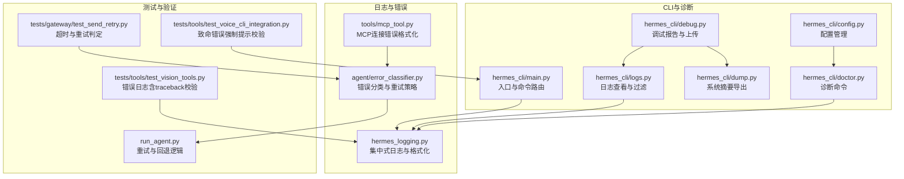
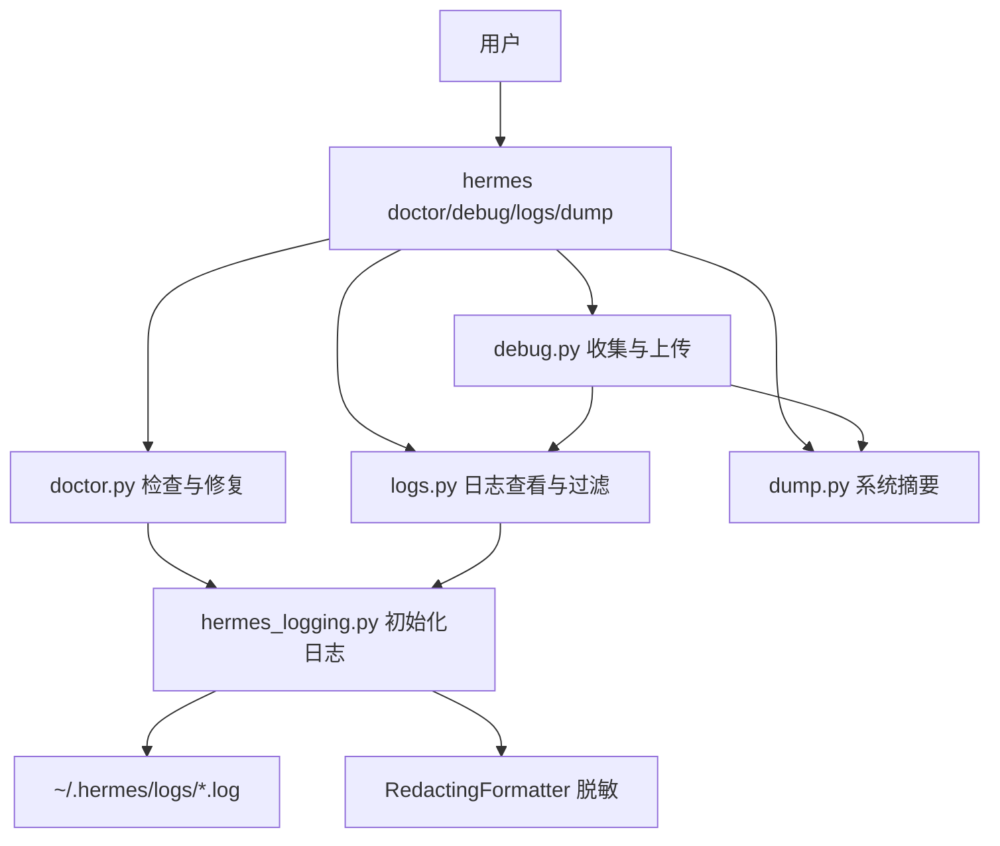
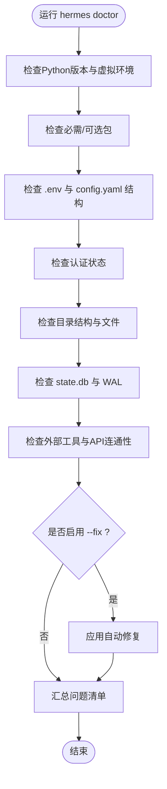
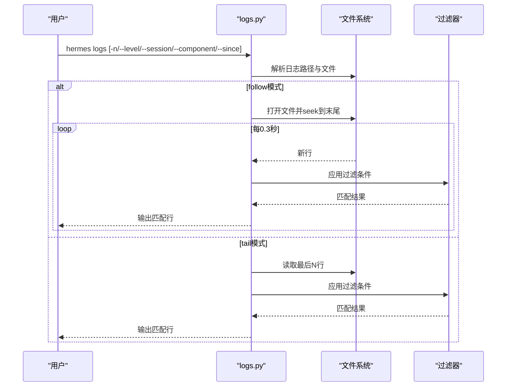
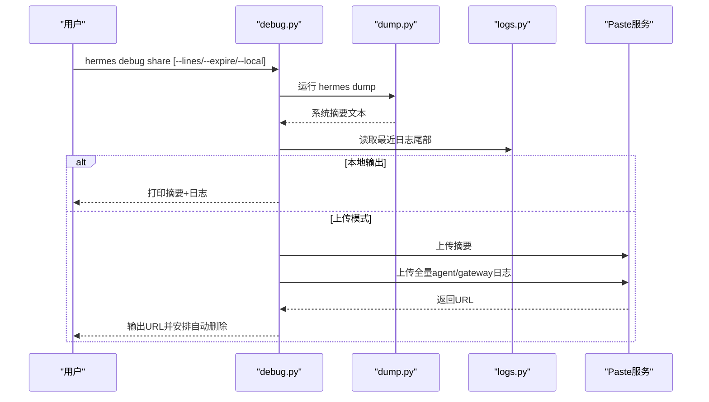
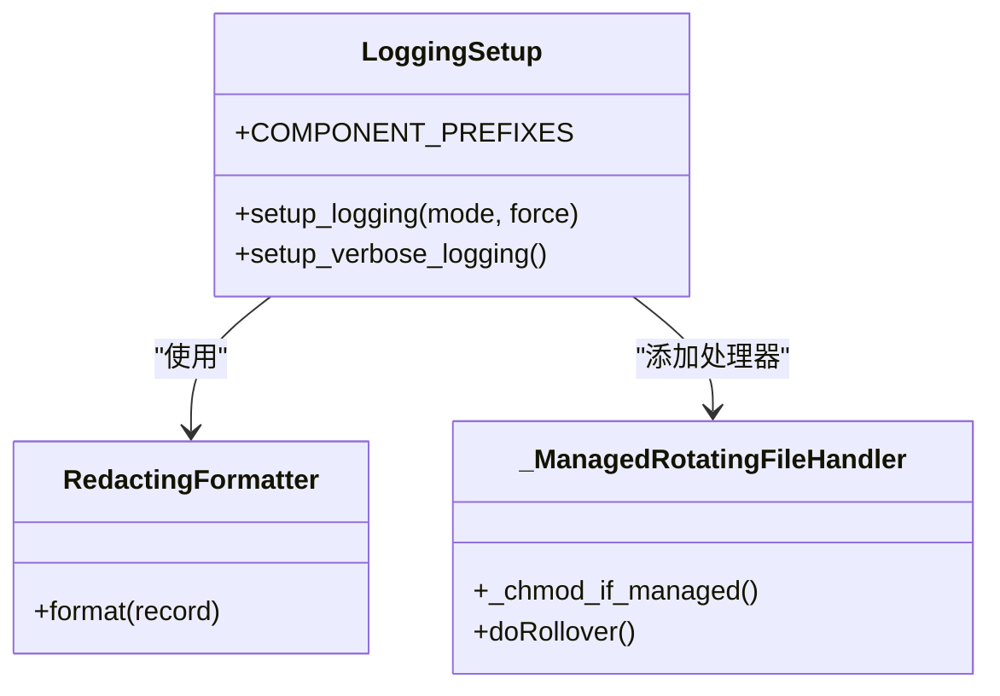
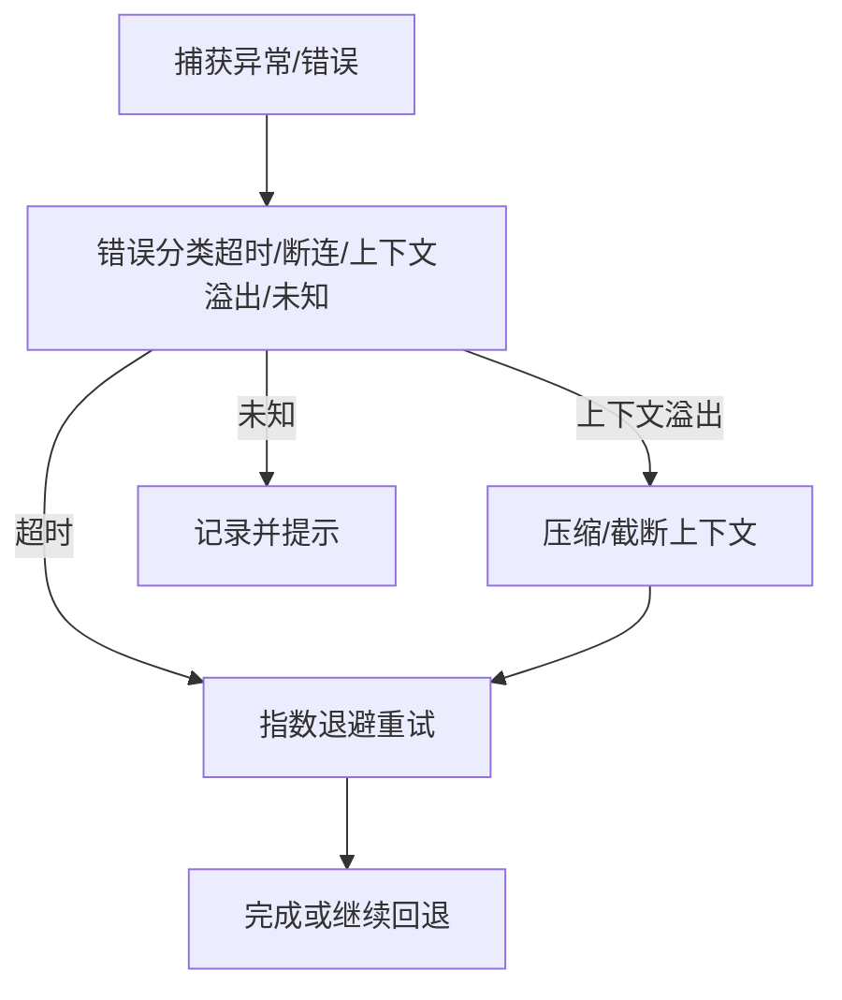
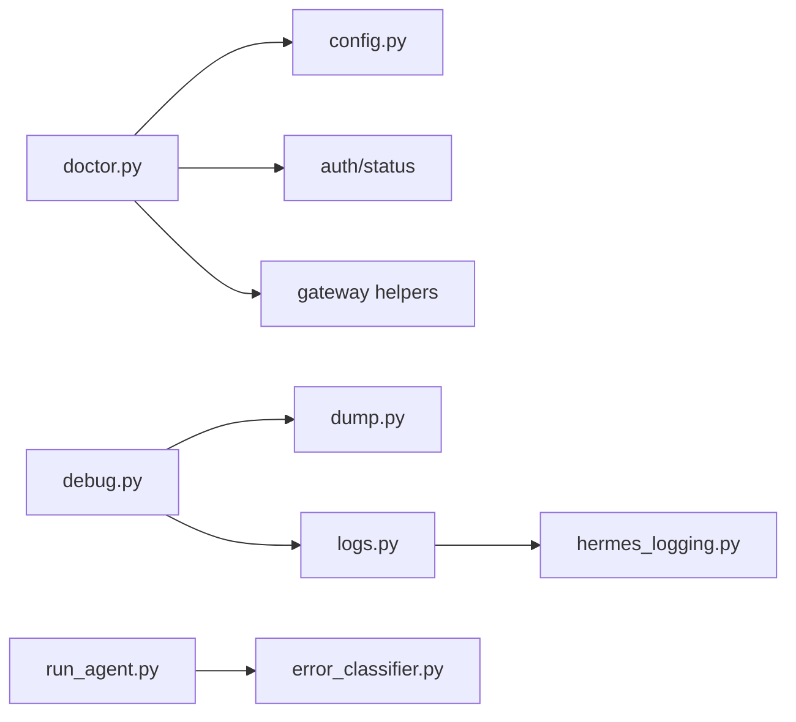
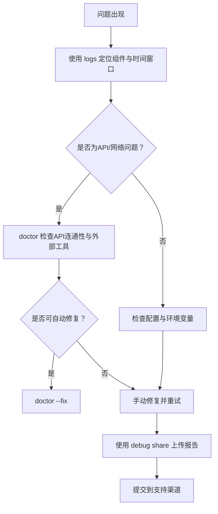

# 调试与性能分析

<cite>
**本文引用的文件**
- [hermes_cli/doctor.py](file://hermes_cli/doctor.py)
- [hermes_cli/debug.py](file://hermes_cli/debug.py)
- [hermes_cli/logs.py](file://hermes_cli/logs.py)
- [hermes_logging.py](file://hermes_logging.py)
- [hermes_cli/dump.py](file://hermes_cli/dump.py)
- [hermes_cli/main.py](file://hermes_cli/main.py)
- [hermes_cli/config.py](file://hermes_cli/config.py)
- [agent/error_classifier.py](file://agent/error_classifier.py)
- [tools/mcp_tool.py](file://tools/mcp_tool.py)
- [tests/tools/test_vision_tools.py](file://tests/tools/test_vision_tools.py)
- [tests/tools/test_voice_cli_integration.py](file://tests/tools/test_voice_cli_integration.py)
- [run_agent.py](file://run_agent.py)
- [tests/gateway/test_send_retry.py](file://tests/gateway/test_send_retry.py)
</cite>

## 目录
1. [简介](#简介)
2. [项目结构](#项目结构)
3. [核心组件](#核心组件)
4. [架构总览](#架构总览)
5. [详细组件分析](#详细组件分析)
6. [依赖分析](#依赖分析)
7. [性能考虑](#性能考虑)
8. [故障排除指南](#故障排除指南)
9. [结论](#结论)
10. [附录](#附录)

## 简介
本指南面向Hermes Agent开发者与运维人员，系统讲解调试与性能分析方法，覆盖以下主题：
- 使用hermes doctor诊断命令快速定位环境、配置与依赖问题
- 使用hermes logs与日志系统进行实时与历史日志分析
- 使用hermes debug生成并分享调试报告，便于社区支持
- 常见问题的系统化排查流程：工具执行失败、平台集成问题、性能瓶颈识别
- 性能分析方法：内存使用监控、CPU性能分析、I/O性能优化
- 使用Python调试器pdb进行代码级调试
- 错误追踪与异常处理最佳实践
- 开发工具配置建议与性能分析工具使用
- 故障排除的系统化方法与常见问题解决方案

## 项目结构
Hermes Agent的调试与性能分析能力由CLI子系统、日志系统、错误分类与重试机制、以及测试与工具模块共同构成。下图展示与调试相关的关键文件与职责：

图表来源
- [hermes_cli/doctor.py:164-534](file://hermes_cli/doctor.py#L164-L534)
- [hermes_cli/debug.py:351-478](file://hermes_cli/debug.py#L351-L478)
- [hermes_cli/logs.py:138-356](file://hermes_cli/logs.py#L138-L356)
- [hermes_logging.py:156-260](file://hermes_logging.py#L156-L260)
- [hermes_cli/dump.py:213-345](file://hermes_cli/dump.py#L213-L345)
- [hermes_cli/main.py:676-784](file://hermes_cli/main.py#L676-L784)
- [hermes_cli/config.py:1-200](file://hermes_cli/config.py#L1-L200)
- [agent/error_classifier.py:391-415](file://agent/error_classifier.py#L391-L415)
- [tools/mcp_tool.py:324-347](file://tools/mcp_tool.py#L324-L347)
- [tests/tools/test_vision_tools.py:261-288](file://tests/tools/test_vision_tools.py#L261-L288)
- [tests/tools/test_voice_cli_integration.py:450-488](file://tests/tools/test_voice_cli_integration.py#L450-L488)
- [run_agent.py:9872-10291](file://run_agent.py#L9872-L10291)
- [tests/gateway/test_send_retry.py:75-107](file://tests/gateway/test_send_retry.py#L75-L107)

章节来源
- [hermes_cli/doctor.py:164-534](file://hermes_cli/doctor.py#L164-L534)
- [hermes_cli/debug.py:351-478](file://hermes_cli/debug.py#L351-L478)
- [hermes_cli/logs.py:138-356](file://hermes_cli/logs.py#L138-L356)
- [hermes_logging.py:156-260](file://hermes_logging.py#L156-L260)
- [hermes_cli/dump.py:213-345](file://hermes_cli/dump.py#L213-L345)
- [hermes_cli/main.py:676-784](file://hermes_cli/main.py#L676-L784)
- [hermes_cli/config.py:1-200](file://hermes_cli/config.py#L1-L200)
- [agent/error_classifier.py:391-415](file://agent/error_classifier.py#L391-L415)
- [tools/mcp_tool.py:324-347](file://tools/mcp_tool.py#L324-L347)
- [tests/tools/test_vision_tools.py:261-288](file://tests/tools/test_vision_tools.py#L261-L288)
- [tests/tools/test_voice_cli_integration.py:450-488](file://tests/tools/test_voice_cli_integration.py#L450-L488)
- [run_agent.py:9872-10291](file://run_agent.py#L9872-L10291)
- [tests/gateway/test_send_retry.py:75-107](file://tests/gateway/test_send_retry.py#L75-L107)

## 核心组件
- hermes doctor：对Python版本、包依赖、配置文件、认证状态、目录结构、外部工具、API连通性等进行系统检查，并可自动修复部分问题（如创建缺失的配置文件、符号链接、SQLite WAL检查）。
- hermes logs：提供tail/follow模式的日志查看，支持按级别、会话ID、组件前缀、相对时间范围过滤；内部解析日志时间戳、级别与记录器名称，高效读取大文件尾部。
- hermes debug：收集系统摘要与最近日志，上传到paste服务或本地输出；支持删除已上传的粘贴条目。
- hermes_logging：集中式日志初始化，按组件分离日志文件（agent/gateway），统一格式化与脱敏，支持会话上下文标记，抑制第三方噪声日志。
- hermes dump：输出不含ANSI的纯文本系统摘要，包含版本、操作系统、Python/OpenAI SDK版本、模型与提供商、终端后端、API密钥状态、功能概要、配置覆盖项等。
- 配置与入口：main.py在启动早期初始化日志与网络偏好，doctor与debug命令通过独立模块实现，config.py提供配置路径与受管模式检测。

章节来源
- [hermes_cli/doctor.py:164-534](file://hermes_cli/doctor.py#L164-L534)
- [hermes_cli/logs.py:138-356](file://hermes_cli/logs.py#L138-L356)
- [hermes_cli/debug.py:351-478](file://hermes_cli/debug.py#L351-L478)
- [hermes_logging.py:156-260](file://hermes_logging.py#L156-L260)
- [hermes_cli/dump.py:213-345](file://hermes_cli/dump.py#L213-L345)
- [hermes_cli/main.py:146-164](file://hermes_cli/main.py#L146-L164)
- [hermes_cli/config.py:1-200](file://hermes_cli/config.py#L1-L200)

## 架构总览
下图展示调试与性能分析相关模块之间的交互关系与数据流：

图表来源
- [hermes_cli/doctor.py:164-534](file://hermes_cli/doctor.py#L164-L534)
- [hermes_cli/debug.py:351-478](file://hermes_cli/debug.py#L351-L478)
- [hermes_cli/logs.py:138-356](file://hermes_cli/logs.py#L138-L356)
- [hermes_logging.py:156-260](file://hermes_logging.py#L156-L260)

## 详细组件分析

### hermes doctor 诊断命令
- 功能要点
  - Python版本与虚拟环境检查
  - 必需与可选包安装状态检查
  - ~/.hermes/.env与config.yaml存在性与结构校验，必要时自动迁移与修复
  - 认证状态检查（Nous Portal、OpenAI Codex、Google Gemini OAuth）
  - 目录结构完整性（cron/sessions/logs/skills/memories等）
  - SQLite state.db与WAL大小健康检查，必要时触发checkpoint
  - 外部工具检查（git、ripgrep、docker、ssh、daytona、node/agent-browser）
  - API连通性检查（OpenRouter、Anthropic）
- 自动修复
  - 创建缺失的.env与config.yaml示例
  - 修正过时根级配置键至model段
  - 修复命令符号链接与PATH提示
  - 触发SQLite WAL checkpoint

图表来源
- [hermes_cli/doctor.py:164-534](file://hermes_cli/doctor.py#L164-L534)

章节来源
- [hermes_cli/doctor.py:164-534](file://hermes_cli/doctor.py#L164-L534)

### hermes logs 日志查看与过滤
- 功能要点
  - 支持tail与follow模式，实时输出新日志
  - 过滤条件：最小日志级别、会话ID子串、组件前缀（gateway/tools/cli等）、相对时间范围
  - 内部正则解析日志时间戳、级别与记录器名称，针对大文件采用从尾部分块读取策略
- 使用建议
  - 定位问题：先用--level WARNING+缩小范围，再按组件过滤
  - 实时观察：配合-f参数，结合--since指定窗口
  - 会话关联：使用--session过滤特定会话ID

图表来源
- [hermes_cli/logs.py:138-356](file://hermes_cli/logs.py#L138-L356)

章节来源
- [hermes_cli/logs.py:138-356](file://hermes_cli/logs.py#L138-L356)

### hermes debug 调试报告与上传
- 功能要点
  - 收集系统摘要（dump）与最近日志（agent/errors/gateway）
  - 支持上传到paste.rs或dpaste.com，或本地打印
  - 自动调度6小时后删除paste.rs粘贴条目
  - 提供删除命令以手动清理
- 隐私与安全
  - 仅上传必要信息，避免泄露敏感密钥
  - 全量日志上传时包含摘要头，便于独立分析

图表来源
- [hermes_cli/debug.py:351-478](file://hermes_cli/debug.py#L351-L478)
- [hermes_cli/dump.py:213-345](file://hermes_cli/dump.py#L213-L345)
- [hermes_cli/logs.py:219-284](file://hermes_cli/logs.py#L219-L284)

章节来源
- [hermes_cli/debug.py:351-478](file://hermes_cli/debug.py#L351-L478)
- [hermes_cli/dump.py:213-345](file://hermes_cli/dump.py#L213-L345)
- [hermes_cli/logs.py:219-284](file://hermes_cli/logs.py#L219-L284)

### hermes_logging 集中式日志系统
- 功能要点
  - 统一初始化agent.log、errors.log、gateway.log（按组件过滤）
  - 会话上下文注入，每条日志包含会话标签，便于关联
  - RedactingFormatter脱敏，抑制第三方噪声日志
  - 受管模式（NixOS）下确保日志文件权限一致
- 使用建议
  - 在启动早期调用setup_logging，保证所有模块日志生效
  - 使用--verbose开启DEBUG控制台输出，便于开发调试

图表来源
- [hermes_logging.py:156-260](file://hermes_logging.py#L156-L260)
- [hermes_logging.py:299-368](file://hermes_logging.py#L299-L368)

章节来源
- [hermes_logging.py:156-260](file://hermes_logging.py#L156-L260)
- [hermes_logging.py:299-368](file://hermes_logging.py#L299-L368)

### hermes dump 系统摘要导出
- 功能要点
  - 版本、操作系统、Python/OpenAI SDK、终端后端
  - 模型与提供商、平台配置、网关状态、技能数量、定时任务
  - API密钥状态（可选择显示明文）
  - 非默认配置覆盖项
- 使用建议
  - 将输出复制到支持渠道，便于他人复现问题
  - 与debug share配合，提供更完整的上下文

章节来源
- [hermes_cli/dump.py:213-345](file://hermes_cli/dump.py#L213-L345)

### 错误分类与重试策略
- 错误分类
  - 基于错误类型、消息模式与HTTP状态码，区分超时、断连、上下文溢出、未知等
  - 对大型会话断连优先判定为上下文溢出，避免误判为超时
- 重试与回退
  - run_agent中实现指数退避与中断感知，定期触活保持网关活跃
  - 测试用例验证超时与连接错误的可重试性判定

图表来源
- [agent/error_classifier.py:391-415](file://agent/error_classifier.py#L391-L415)
- [run_agent.py:9872-10291](file://run_agent.py#L9872-L10291)
- [tests/gateway/test_send_retry.py:75-107](file://tests/gateway/test_send_retry.py#L75-L107)

章节来源
- [agent/error_classifier.py:391-415](file://agent/error_classifier.py#L391-L415)
- [run_agent.py:9872-10291](file://run_agent.py#L9872-L10291)
- [tests/gateway/test_send_retry.py:75-107](file://tests/gateway/test_send_retry.py#L75-L107)

### MCP连接错误格式化
- 功能要点
  - 递归查找嵌套异常中的缺失资源（如文件未找到），提取可操作的简短信息
  - 用于MCP工具连接失败的用户提示

章节来源
- [tools/mcp_tool.py:324-347](file://tools/mcp_tool.py#L324-L347)

## 依赖分析
- 模块耦合
  - doctor依赖config、auth、gateway等模块进行状态检查
  - debug依赖dump与logs模块聚合信息
  - logs依赖hermes_logging的组件前缀映射
  - run_agent与error_classifier共同决定错误处理策略
- 外部依赖
  - httpx用于API连通性检查
  - sqlite3用于state.db健康检查
  - subprocess用于容器/外部工具探测

图表来源
- [hermes_cli/doctor.py:164-534](file://hermes_cli/doctor.py#L164-L534)
- [hermes_cli/debug.py:351-478](file://hermes_cli/debug.py#L351-L478)
- [hermes_cli/logs.py:138-356](file://hermes_cli/logs.py#L138-L356)
- [hermes_logging.py:156-260](file://hermes_logging.py#L156-L260)
- [run_agent.py:9872-10291](file://run_agent.py#L9872-L10291)
- [agent/error_classifier.py:391-415](file://agent/error_classifier.py#L391-L415)

章节来源
- [hermes_cli/doctor.py:164-534](file://hermes_cli/doctor.py#L164-L534)
- [hermes_cli/debug.py:351-478](file://hermes_cli/debug.py#L351-L478)
- [hermes_cli/logs.py:138-356](file://hermes_cli/logs.py#L138-L356)
- [hermes_logging.py:156-260](file://hermes_logging.py#L156-L260)
- [run_agent.py:9872-10291](file://run_agent.py#L9872-L10291)
- [agent/error_classifier.py:391-415](file://agent/error_classifier.py#L391-L415)

## 性能考虑
- 日志性能
  - 使用RotatingFileHandler限制单文件大小，减少磁盘IO压力
  - 分离gateway与agent日志，降低无关日志干扰
  - 抑制第三方噪声日志，避免CPU浪费
- I/O性能
  - logs对大文件采用分块从尾部读取策略，避免全文件扫描
  - follow模式以固定周期轮询，平衡实时性与CPU占用
- 内存与CPU
  - 建议在开发阶段使用--verbose仅在需要时开启DEBUG级别输出
  - 对于容器/远程后端，关注网络延迟与带宽，合理设置超时与重试
- 平台与外部工具
  - docker/ssh/daytona等后端的可用性与连通性直接影响性能
  - node/agent-browser用于浏览器自动化，建议安装ripgrep提升文件搜索效率

章节来源
- [hermes_logging.py:214-260](file://hermes_logging.py#L214-L260)
- [hermes_cli/logs.py:278-332](file://hermes_cli/logs.py#L278-L332)
- [hermes_cli/doctor.py:635-724](file://hermes_cli/doctor.py#L635-L724)

## 故障排除指南
- 工具执行失败
  - 使用doctor检查外部工具（git/docker/ssh/daytona/node/agent-browser）与API密钥
  - 若为MCP连接失败，参考MCP错误格式化提示定位缺失资源
- 平台集成问题
  - 检查对应平台的环境变量与令牌配置
  - 使用logs按组件过滤（如gateway）定位平台适配器问题
- 性能瓶颈识别
  - 使用logs --since与--component缩小范围
  - 关注errors.log中的警告与错误，结合dump确认配置覆盖项
  - 对大型会话断连优先考虑上下文溢出，启用压缩或截断
- 代码级调试
  - 使用Python调试器pdb在需要时插入断点
  - 在异步场景中，参考分布式调试工具简化多进程/多rank调试
- 异常处理最佳实践
  - 确保错误日志包含traceback（测试用例验证了该行为）
  - 对致命错误使用强制提示，确保用户可见
  - 对超时/连接错误进行明确的可重试性判定

图表来源
- [hermes_cli/logs.py:138-356](file://hermes_cli/logs.py#L138-L356)
- [hermes_cli/doctor.py:164-534](file://hermes_cli/doctor.py#L164-L534)
- [hermes_cli/debug.py:351-478](file://hermes_cli/debug.py#L351-L478)
- [tests/tools/test_vision_tools.py:261-288](file://tests/tools/test_vision_tools.py#L261-L288)
- [tests/tools/test_voice_cli_integration.py:450-488](file://tests/tools/test_voice_cli_integration.py#L450-L488)

章节来源
- [hermes_cli/logs.py:138-356](file://hermes_cli/logs.py#L138-L356)
- [hermes_cli/doctor.py:164-534](file://hermes_cli/doctor.py#L164-L534)
- [hermes_cli/debug.py:351-478](file://hermes_cli/debug.py#L351-L478)
- [tests/tools/test_vision_tools.py:261-288](file://tests/tools/test_vision_tools.py#L261-L288)
- [tests/tools/test_voice_cli_integration.py:450-488](file://tests/tools/test_voice_cli_integration.py#L450-L488)

## 结论
通过doctor、logs、debug与集中式日志系统的协同，Hermes Agent提供了从环境诊断到问题定位、从日志分析到报告共享的完整调试链路。配合错误分类与重试策略、测试用例对异常处理的约束，能够有效提升问题解决效率与系统稳定性。建议在日常开发与运维中常态化使用这些工具，并结合性能分析与最佳实践持续优化。

## 附录
- 开发工具配置建议
  - IDE调试：在需要时使用pdb或IDE内置调试器，关注异步与多进程场景
  - 性能分析：结合Python内置cProfile或py-spy进行CPU与火焰图分析
  - 日志级别：开发期使用--verbose，生产环境维持INFO级别并关注errors.log
- 常见问题速查
  - doctor提示缺少.env或config.yaml：使用--fix或手动创建
  - WAL过大：doctor自动建议checkpoint或手动执行
  - API连通性失败：检查OPENROUTER_API_KEY等环境变量
  - 平台无法接收消息：检查对应平台令牌与回调配置