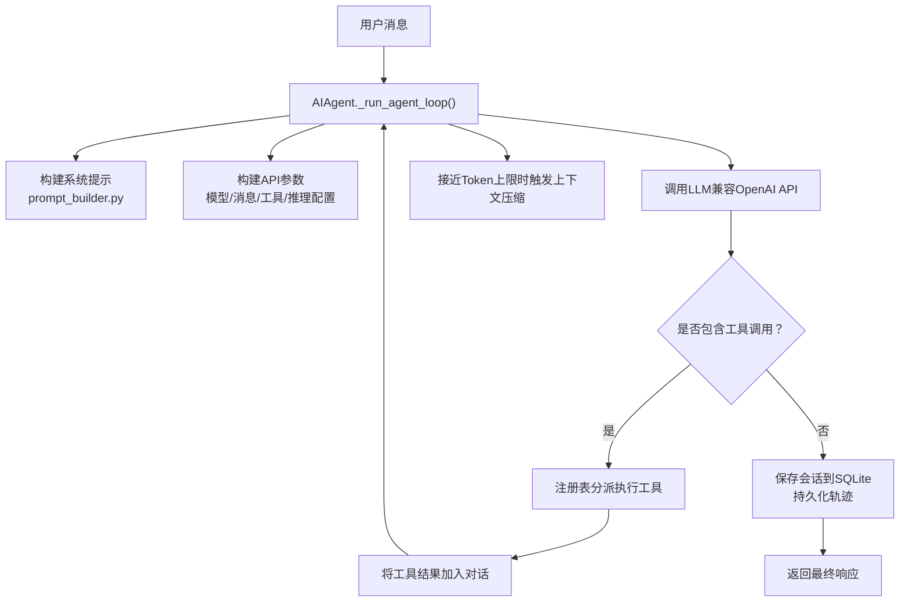
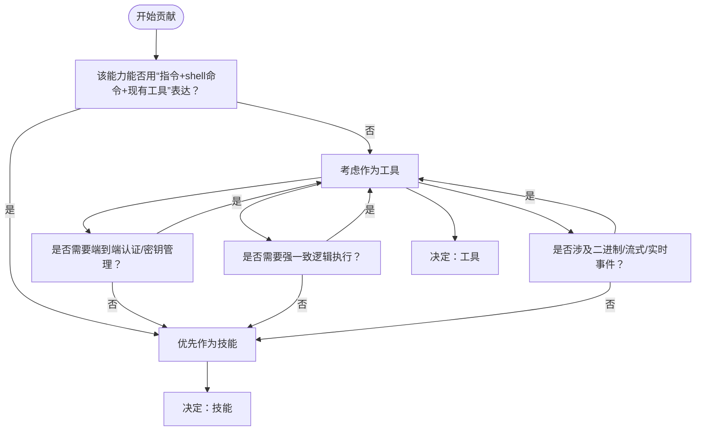

# 贡献流程

<cite>
**本文引用的文件**
- [CONTRIBUTING.md](file://CONTRIBUTING.md)
- [.github/PULL_REQUEST_TEMPLATE.md](file://.github/PULL_REQUEST_TEMPLATE.md)
- [.github/ISSUE_TEMPLATE/bug_report.yml](file://.github/ISSUE_TEMPLATE/bug_report.yml)
- [.github/ISSUE_TEMPLATE/feature_request.yml](file://.github/ISSUE_TEMPLATE/feature_request.yml)
- [SECURITY.md](file://SECURITY.md)
- [README.md](file://README.md)
- [scripts/install.sh](file://scripts/install.sh)
- [scripts/install.ps1](file://scripts/install.ps1)
- [cli-config.yaml.example](file://cli-config.yaml.example)
</cite>

## 目录
1. [简介](#简介)
2. [项目结构](#项目结构)
3. [核心组件](#核心组件)
4. [架构总览](#架构总览)
5. [详细组件分析](#详细组件分析)
6. [依赖分析](#依赖分析)
7. [性能考虑](#性能考虑)
8. [故障排查指南](#故障排查指南)
9. [结论](#结论)
10. [附录](#附录)

## 简介
本文件面向所有希望为 Hermes Agent 做出贡献的开发者，系统化梳理贡献优先级与原则、技能与工具的选择标准、分支与提交规范、PR 描述模板、代码审查与测试要求、合并标准、社区参与方式以及新贡献者入门与最佳实践。内容直接来源于仓库中的贡献指南、模板与安全策略文件，并结合项目 README 提供的社区入口进行整合。

## 项目结构
Hermes Agent 是一个以“代理内核 + 工具与技能生态”为核心的多平台智能体系统。贡献工作通常围绕以下方面展开：
- 代理内核：对话循环、上下文压缩、会话持久化、模型元数据与路由、错误分类与重试等
- 工具体系：终端执行、文件操作、网络检索、视觉分析、代码执行沙箱、浏览器自动化、定时任务等
- 技能系统：可复用的程序化记忆与工作流，支持内置与可选技能，以及 Skills Hub 分发
- 网关与平台适配：Telegram、Discord、Slack、WhatsApp、Signal、邮件等多通道接入
- CLI 与配置：交互式 TUI、命令注册、设置向导、配置文件与环境变量管理
- 安装与跨平台：Linux/macOS/Android(Termux) 的一键安装脚本，Windows 使用 PowerShell 安装器

上述结构与职责在贡献指南中已有清晰说明，便于贡献者快速定位修改范围与影响面。

章节来源
- [CONTRIBUTING.md:114-197](file://CONTRIBUTING.md#L114-L197)
- [README.md:14-179](file://README.md#L14-L179)

## 核心组件
- 代理内核与对话循环：负责构建系统提示、调用大模型、分派工具、上下文压缩与会话持久化
- 工具注册与分发：工具自注册到中央注册表，按工具集组合启用，支持平台预设
- 技能系统：通过 SKILL.md 描述触发条件、步骤、注意事项与验证方法；支持平台限定与条件激活
- 网关与平台适配：统一的消息路由、会话存储、平台特定配置与生命周期管理
- CLI 与配置：命令解析、交互回调、诊断工具、皮肤引擎、配置迁移与环境变量
- 安全与合规：危险命令审批、写入白名单、容器加固、输出脱敏、Skills Guard、代码执行沙箱等

章节来源
- [CONTRIBUTING.md:200-227](file://CONTRIBUTING.md#L200-L227)
- [CONTRIBUTING.md:302-463](file://CONTRIBUTING.md#L302-L463)
- [CONTRIBUTING.md:516-581](file://CONTRIBUTING.md#L516-L581)

## 架构总览
下图展示从用户消息到工具执行与响应返回的关键路径，体现“提示构建—模型调用—工具分派—上下文压缩—会话持久化”的闭环。

图表来源
- [CONTRIBUTING.md:204-217](file://CONTRIBUTING.md#L204-L217)

章节来源
- [CONTRIBUTING.md:200-227](file://CONTRIBUTING.md#L200-L227)

## 详细组件分析

### 贡献优先级与原则
- 优先级顺序：缺陷修复、跨平台兼容性、安全加固、性能与鲁棒性、新增技能、新增工具、文档完善
- 选择技能或工具的标准：优先技能；仅当需要端到端集成、认证流程、多组件配置或二进制/流式实时事件处理时才考虑工具
- 内置技能与可选技能：广泛适用的内置技能；官方但非通用的放入 optional-skills；专用/社区贡献的放入 Skills Hub

章节来源
- [CONTRIBUTING.md:7-18](file://CONTRIBUTING.md#L7-L18)
- [CONTRIBUTING.md:21-49](file://CONTRIBUTING.md#L21-L49)

### 技能 vs 工具：选择标准与决策流程
- 判断依据：是否可通过“指令+现有工具”表达；是否需要嵌入式认证与密钥管理；是否必须强一致逻辑执行；是否涉及二进制/流式/实时事件
- 决策流程：先问“是否应为技能”，再评估“是否应为工具”。若为工具，进一步评估是否属于“极少需要”的范畴

图表来源
- [CONTRIBUTING.md:21-49](file://CONTRIBUTING.md#L21-L49)

章节来源
- [CONTRIBUTING.md:21-49](file://CONTRIBUTING.md#L21-L49)

### 分支命名规范、PR 描述模板与提交信息格式
- 分支命名：fix/描述、feat/描述、docs/描述、test/描述、refactor/描述
- PR 描述模板：包含变更说明、动机、测试步骤、平台覆盖、关联问题
- 提交信息：遵循 Conventional Commits，类型包括 fix、feat、docs、test、refactor、chore，Scope 按模块划分（cli、gateway、tools、skills、agent、install、whatsapp、security 等）

章节来源
- [CONTRIBUTING.md:586-637](file://CONTRIBUTING.md#L586-L637)
- [.github/PULL_REQUEST_TEMPLATE.md:1-76](file://.github/PULL_REQUEST_TEMPLATE.md#L1-L76)

### 代码风格与跨平台兼容性
- 风格：PEP 8，注释强调非显而易见的意图与权衡；错误处理捕获具体异常，日志使用警告/错误级别并可带堆栈
- 跨平台：避免假设 Unix；termios/fcntl 仅限 Unix；Windows 可能以 cp1252 编码保存 .env；进程管理在 Windows 上有差异；路径分隔符使用 pathlib；安装脚本需同时维护 Linux/macOS 与 Windows 对应实现

章节来源
- [CONTRIBUTING.md:230-236](file://CONTRIBUTING.md#L230-L236)
- [CONTRIBUTING.md:516-554](file://CONTRIBUTING.md#L516-L554)

### 安全加固与风险控制
- 现有保护层：sudo 密码管道使用转义、危险命令检测与审批、Cron 提示注入扫描、写入黑名单、Skills Guard、代码执行沙箱、容器加固
- 贡献安全要点：对用户输入进行 shell 转义、解析符号链接后进行路径访问控制、不记录密钥、广泛捕获异常、在多平台测试
- 安全披露：通过 GitHub Security Advisories 或邮件私下报告，提供标题/严重性/CVSS、受影响组件/行号、环境、复现步骤、影响说明

章节来源
- [CONTRIBUTING.md:556-581](file://CONTRIBUTING.md#L556-L581)
- [SECURITY.md:1-85](file://SECURITY.md#L1-L85)

### 新增工具与技能的流程
- 新增工具：自注册到中央注册表；在 model_tools 中导入模块；必要时新增工具集并在平台预设中启用
- 新增技能：在 skills/ 或 optional-skills/ 下按类别组织；编写 SKILL.md（含前置元数据、触发条件、步骤、陷阱、验证）；平台限定与条件激活由 prompt_builder 在构建系统提示时评估

章节来源
- [CONTRIBUTING.md:239-298](file://CONTRIBUTING.md#L239-L298)
- [CONTRIBUTING.md:302-463](file://CONTRIBUTING.md#L302-L463)

### 代码审查流程、测试要求与合并标准
- 代码审查：遵循贡献指南、模板与检查清单；确保测试通过、跨平台影响评估、变更聚焦
- 测试要求：运行 pytest 全量测试；手动验证变更路径；针对文件 I/O、进程管理、终端处理在 Windows/macOS 复核
- 合并标准：遵循 Conventional Commits；PR 描述完整；无无关提交；满足平台兼容性与工具描述更新要求

章节来源
- [.github/PULL_REQUEST_TEMPLATE.md:39-76](file://.github/PULL_REQUEST_TEMPLATE.md#L39-L76)
- [CONTRIBUTING.md:596-601](file://CONTRIBUTING.md#L596-L601)

### 社区参与方式
- Discord：用于提问、展示项目与分享技能
- GitHub Discussions：用于设计提案与架构讨论
- Skills Hub：上传专业技能到注册表并与社区共享

章节来源
- [README.md:164-170](file://README.md#L164-L170)
- [CONTRIBUTING.md:650-655](file://CONTRIBUTING.md#L650-L655)

### 新贡献者入门与最佳实践
- 开发环境：克隆仓库、创建虚拟环境、安装依赖（含 all/dev）、可选安装 Node.js（浏览器工具与 WhatsApp 桥）
- 配置：创建 ~/.hermes 目录，复制示例配置，补充最小 API 密钥
- 运行：创建全局软链接，使用 hermes doctor 与聊天命令验证
- 测试：pytest tests/ -v
- 安装脚本：Linux/macOS/Android 使用 install.sh；Windows 使用 install.ps1

章节来源
- [CONTRIBUTING.md:52-111](file://CONTRIBUTING.md#L52-L111)
- [scripts/install.sh:1-200](file://scripts/install.sh#L1-L200)
- [scripts/install.ps1:1-200](file://scripts/install.ps1#L1-L200)

## 依赖分析
- 安装与运行依赖：uv、Python 3.11、Node.js（可选）、Git 子模块（可选）
- 平台与环境：Linux、macOS、Android(Termux)、WSL2（Windows 通过 WSL2 支持）
- 配置与环境变量：config.yaml 与 ~/.hermes/.env；模型提供商与密钥；工具集与平台预设

章节来源
- [CONTRIBUTING.md:54-62](file://CONTRIBUTING.md#L54-L62)
- [README.md:30-48](file://README.md#L30-L48)
- [cli-config.yaml.example:1-800](file://cli-config.yaml.example#L1-L800)

## 性能考虑
- 上下文压缩：在接近模型上下文限制时自动摘要中间轮次，保留首尾关键对话
- 重试与降级：健壮的错误处理与降级策略，避免单点失败导致代理循环崩溃
- 会话与日志：SQLite 会话数据库 + JSON 日志，便于回溯与调试

章节来源
- [CONTRIBUTING.md:11-14](file://CONTRIBUTING.md#L11-L14)
- [CONTRIBUTING.md:288-300](file://CONTRIBUTING.md#L288-L300)

## 故障排查指南
- 报告缺陷：使用 GitHub Issues 模板，提供操作系统、Python 版本、Hermes 版本、完整错误堆栈、复现步骤；可选提供根因分析与建议修复
- 功能请求：优先考虑技能而非工具；明确问题场景、解决方案、替代方案、功能类型与规模
- 安全问题：通过私有渠道报告，包含标题/严重性/CVSS、受影响组件/行号、环境、复现步骤、影响说明

章节来源
- [.github/ISSUE_TEMPLATE/bug_report.yml:1-163](file://.github/ISSUE_TEMPLATE/bug_report.yml#L1-L163)
- [.github/ISSUE_TEMPLATE/feature_request.yml:1-86](file://.github/ISSUE_TEMPLATE/feature_request.yml#L1-L86)
- [SECURITY.md:5-15](file://SECURITY.md#L5-L15)

## 结论
本贡献流程文档将 Hermes Agent 的贡献优先级、技能与工具选择、分支与提交规范、PR 模板、代码审查与测试、合并标准、社区参与与新贡献者入门进行了系统化整理。请在提交前对照贡献指南与模板，确保变更具备清晰动机、充分测试与跨平台兼容性，并通过社区渠道积极沟通协作。

## 附录

### 分支命名与提交信息示例
- 分支命名示例：fix/修复终端权限问题、feat/新增跨平台安装脚本、docs/更新贡献指南
- 提交信息示例：fix(cli): 防止 save_config_value 在字符串模型上崩溃；feat(gateway): 添加 WhatsApp 多用户会话隔离；fix(security): 防止 sudo 密码管道中的 shell 注入；test(tools): 为 file_operations 新增单元测试

章节来源
- [CONTRIBUTING.md:586-637](file://CONTRIBUTING.md#L586-L637)

### PR 描述模板要点
- 变更说明与动机
- 如何测试（缺陷复现步骤、功能使用示例）
- 测试平台
- 关联问题编号

章节来源
- [.github/PULL_REQUEST_TEMPLATE.md:1-76](file://.github/PULL_REQUEST_TEMPLATE.md#L1-L76)