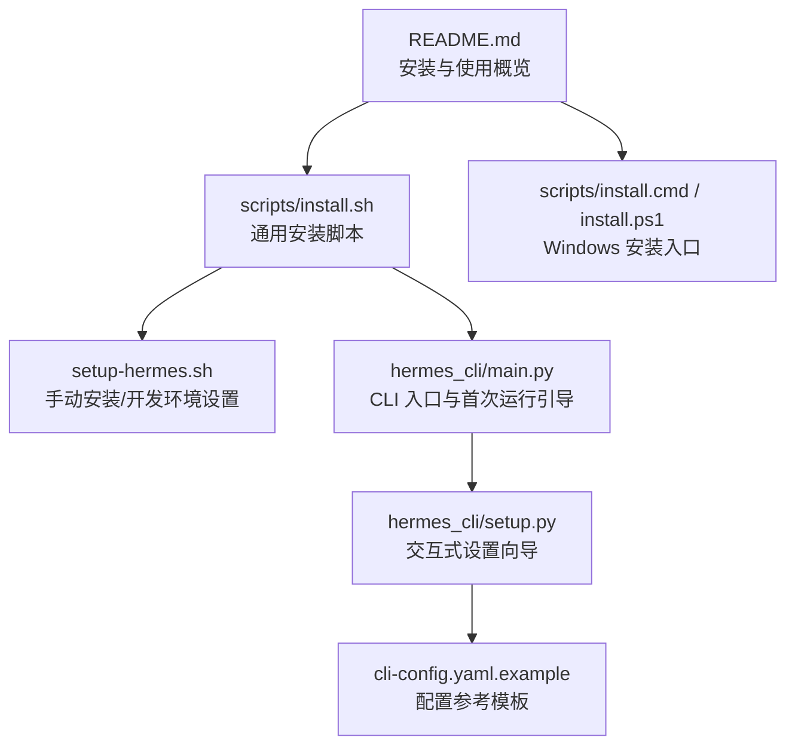
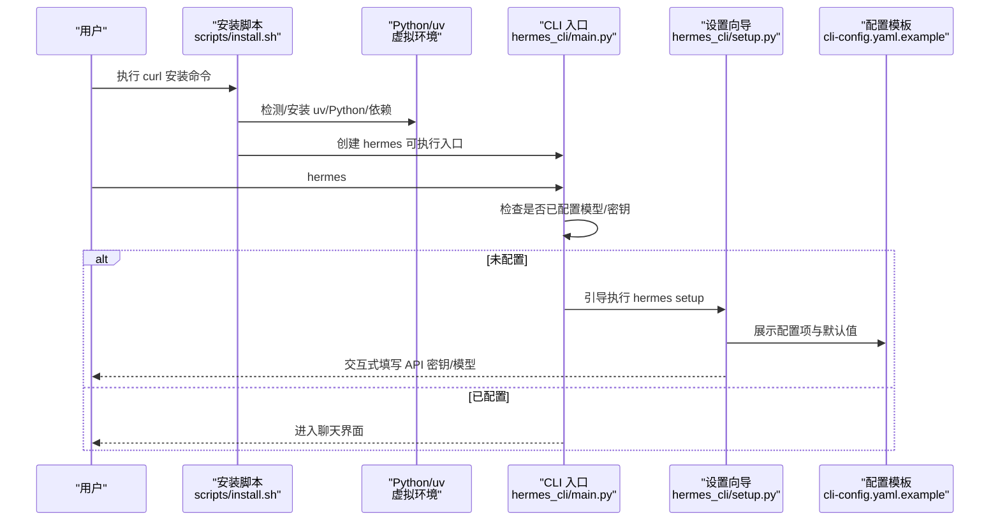
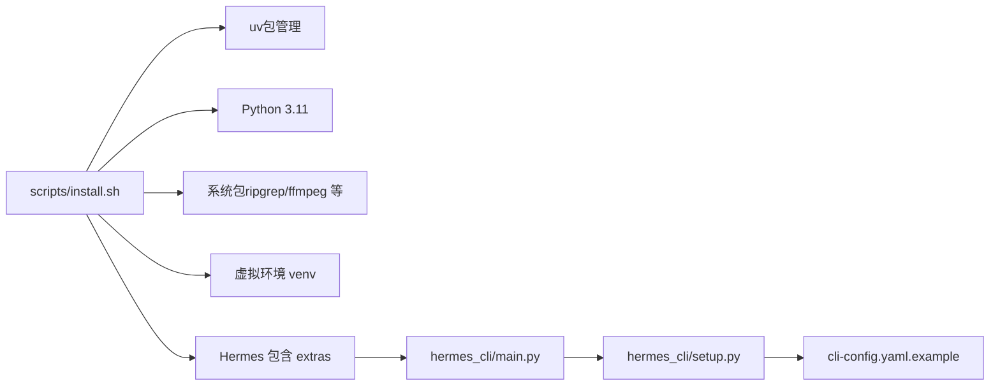

# 快速入门

<cite>
**本文引用的文件**
- [README.md](file://README.md)
- [scripts/install.sh](file://scripts/install.sh)
- [scripts/install.cmd](file://scripts/install.cmd)
- [scripts/install.ps1](file://scripts/install.ps1)
- [setup-hermes.sh](file://setup-hermes.sh)
- [hermes_cli/main.py](file://hermes_cli/main.py)
- [hermes_cli/setup.py](file://hermes_cli/setup.py)
- [cli-config.yaml.example](file://cli-config.yaml.example)
</cite>

## 目录
1. [简介](#简介)
2. [项目结构](#项目结构)
3. [核心组件](#核心组件)
4. [架构总览](#架构总览)
5. [详细组件分析](#详细组件分析)
6. [依赖关系分析](#依赖关系分析)
7. [性能考虑](#性能考虑)
8. [故障排除指南](#故障排除指南)
9. [结论](#结论)
10. [附录](#附录)

## 简介
本指南面向首次接触 Hermes Agent 的用户，帮助你在 Linux、macOS、WSL2、Android/Termux 上完成安装与首次使用。你将学会：
- 使用 curl 安装脚本进行一键安装
- 平台特定的前置条件与注意事项
- 运行 hermes setup 向导完成基础配置
- 配置模型提供商与 API 密钥
- 从启动 CLI 到进行第一次对话的完整流程
- 常见安装问题的排查与解决

## 项目结构
Hermes Agent 提供了统一的安装入口与交互式设置向导，支持多平台自动检测与依赖处理。

图示来源
- [README.md:30-63](file://README.md#L30-L63)
- [scripts/install.sh:1-120](file://scripts/install.sh#L1-L120)
- [scripts/install.cmd:1-29](file://scripts/install.cmd#L1-L29)
- [scripts/install.ps1:1-120](file://scripts/install.ps1#L1-L120)
- [setup-hermes.sh:1-60](file://setup-hermes.sh#L1-L60)
- [hermes_cli/main.py:676-784](file://hermes_cli/main.py#L676-L784)
- [hermes_cli/setup.py:1-120](file://hermes_cli/setup.py#L1-L120)
- [cli-config.yaml.example:1-60](file://cli-config.yaml.example#L1-L60)

章节来源
- [README.md:30-63](file://README.md#L30-L63)
- [scripts/install.sh:1-120](file://scripts/install.sh#L1-L120)
- [scripts/install.cmd:1-29](file://scripts/install.cmd#L1-L29)
- [scripts/install.ps1:1-120](file://scripts/install.ps1#L1-L120)
- [setup-hermes.sh:1-60](file://setup-hermes.sh#L1-L60)
- [hermes_cli/main.py:676-784](file://hermes_cli/main.py#L676-L784)
- [hermes_cli/setup.py:1-120](file://hermes_cli/setup.py#L1-L120)
- [cli-config.yaml.example:1-60](file://cli-config.yaml.example#L1-L60)

## 核心组件
- 安装脚本：自动检测系统类型、安装依赖、创建虚拟环境、安装包与可选子模块，并在完成后提示下一步操作。
- 设置向导：交互式配置模型提供商、终端后端、工具集、消息平台等；同时检查可用性并生成摘要。
- CLI 入口：首次运行时检测是否已配置模型/密钥，未配置则引导执行 setup 或提供非交互配置建议。
- 配置模板：提供模型、终端、压缩、记忆、平台工具集等配置项的参考与说明。

章节来源
- [hermes_cli/main.py:676-784](file://hermes_cli/main.py#L676-L784)
- [hermes_cli/setup.py:625-751](file://hermes_cli/setup.py#L625-L751)
- [cli-config.yaml.example:1-120](file://cli-config.yaml.example#L1-L120)

## 架构总览
下图展示了从安装到首次对话的关键流程与组件交互：

图示来源
- [scripts/install.sh:120-220](file://scripts/install.sh#L120-L220)
- [hermes_cli/main.py:676-784](file://hermes_cli/main.py#L676-L784)
- [hermes_cli/setup.py:625-751](file://hermes_cli/setup.py#L625-L751)
- [cli-config.yaml.example:1-120](file://cli-config.yaml.example#L1-L120)

## 详细组件分析

### 安装与平台支持
- Linux/macOS：推荐使用 curl 一键安装脚本，自动处理 uv、Python、依赖与可选系统包。
- Android/Termux：脚本会检测并使用 Termux 路径与依赖策略，避免不兼容的语音依赖。
- Windows：提供 PowerShell 安装脚本与 CMD 包装器；如检测到 Windows，优先使用 PowerShell 版本。

章节来源
- [README.md:30-47](file://README.md#L30-L47)
- [scripts/install.sh:125-194](file://scripts/install.sh#L125-L194)
- [scripts/install.cmd:1-29](file://scripts/install.cmd#L1-L29)
- [scripts/install.ps1:182-185](file://scripts/install.ps1#L182-L185)

### 交互式设置向导（hermes setup）
- 分步引导：模型与提供商选择、终端后端、代理设置、消息平台、工具配置等。
- 自动检查：根据当前环境与订阅状态，给出工具可用性摘要与缺失变量提示。
- 非交互模式：当无法使用交互式 TTY 时，提供基于环境变量或 config set 的替代方案。

章节来源
- [hermes_cli/setup.py:625-751](file://hermes_cli/setup.py#L625-L751)
- [hermes_cli/setup.py:344-571](file://hermes_cli/setup.py#L344-L571)
- [hermes_cli/main.py:53-67](file://hermes_cli/main.py#L53-L67)

### 首次使用流程（从启动 CLI 到第一次对话）
- 启动 CLI：输入 hermes，进入交互式聊天界面。
- 首次运行引导：若未配置模型/密钥，CLI 将提示运行 hermes setup 或提供非交互配置建议。
- 开始对话：完成设置后，即可在 CLI 中开始对话；也可通过 hermes gateway 在 Telegram/Discord 等平台与 Agent 交互。

章节来源
- [hermes_cli/main.py:676-784](file://hermes_cli/main.py#L676-L784)
- [README.md:51-63](file://README.md#L51-L63)

### 配置模板与模型提供商
- 模型配置：支持多种提供商（如 OpenRouter、Anthropic、Gemini、自定义等），可通过 provider 与 base_url/api_key 组合配置。
- 终端后端：本地、SSH、Docker、Singularity、Modal、Daytona 等，按需选择。
- 工具与平台：通过 platform_toolsets 控制各平台可用工具集；可启用/禁用 web、terminal、file、browser、vision、image_gen、tts、cronjob 等。

章节来源
- [cli-config.yaml.example:8-66](file://cli-config.yaml.example#L8-L66)
- [cli-config.yaml.example:130-219](file://cli-config.yaml.example#L130-L219)
- [cli-config.yaml.example:553-636](file://cli-config.yaml.example#L553-L636)

## 依赖关系分析
安装脚本与 CLI 的关键依赖链如下：

图示来源
- [scripts/install.sh:200-299](file://scripts/install.sh#L200-L299)
- [scripts/install.sh:489-660](file://scripts/install.sh#L489-L660)
- [hermes_cli/main.py:676-784](file://hermes_cli/main.py#L676-L784)
- [hermes_cli/setup.py:625-751](file://hermes_cli/setup.py#L625-L751)
- [cli-config.yaml.example:1-60](file://cli-config.yaml.example#L1-L60)

章节来源
- [scripts/install.sh:200-299](file://scripts/install.sh#L200-L299)
- [scripts/install.sh:489-660](file://scripts/install.sh#L489-L660)
- [hermes_cli/main.py:676-784](file://hermes_cli/main.py#L676-L784)
- [hermes_cli/setup.py:625-751](file://hermes_cli/setup.py#L625-L751)
- [cli-config.yaml.example:1-60](file://cli-config.yaml.example#L1-L60)

## 性能考虑
- 选择合适的终端后端：本地适合快速迭代，容器后端（Docker/Singularity/Modal/Daytona）适合隔离与复现。
- 合理设置上下文压缩阈值与目标比例，平衡长对话的稳定性与成本。
- 使用 ripgrep 加快文件搜索；使用 ffmpeg 支持 TTS 语音消息。
- 对于 Windows 用户，建议使用 PowerShell 安装脚本以获得最佳兼容性。

## 故障排除指南
- 未检测到交互式 TTY：当在非交互环境中运行 hermes setup/chat 时，CLI 会拒绝并提示直接在终端运行。
- Windows 平台：请使用 PowerShell 安装脚本；如使用 CMD，请通过包装器调用。
- Termux：安装脚本会自动切换到 Android 适配路径，避免不兼容的语音依赖。
- uv/Python 未找到：安装脚本会尝试自动安装 uv 与 Python 3.11；若失败，请手动安装并确保 PATH 正确。
- 系统包缺失：ripgrep 与 ffmpeg 为可选但强烈建议安装；安装脚本会尝试自动安装并在失败时提供手动安装指引。
- 首次运行无配置：CLI 会提示运行 hermes setup；若无法交互，可使用 hermes config set 或在 .env 中设置相关环境变量。

章节来源
- [hermes_cli/main.py:53-67](file://hermes_cli/main.py#L53-L67)
- [scripts/install.sh:182-185](file://scripts/install.sh#L182-L185)
- [scripts/install.cmd:18-28](file://scripts/install.cmd#L18-L28)
- [scripts/install.sh:200-255](file://scripts/install.sh#L200-L255)
- [scripts/install.sh:489-660](file://scripts/install.sh#L489-L660)
- [README.md:30-47](file://README.md#L30-L47)

## 结论
通过本快速入门，你可以在主流平台上完成 Hermes Agent 的安装与首次配置，并顺利开始与 Agent 的对话。建议在完成 setup 后，结合 cli-config.yaml.example 的注释进一步细化模型、终端后端与工具集配置，以满足你的具体工作流需求。

## 附录

### A. 一键安装步骤（Linux/macOS/Termux）
- 打开终端，执行以下命令：
  - curl -fsSL https://raw.githubusercontent.com/NousResearch/hermes-agent/main/scripts/install.sh | bash
- 安装完成后，按提示重新加载 shell 或直接运行 hermes。

章节来源
- [README.md:30-47](file://README.md#L30-L47)
- [scripts/install.sh:1-120](file://scripts/install.sh#L1-L120)

### B. Windows 安装步骤
- 使用 PowerShell（推荐）：
  - irm https://raw.githubusercontent.com/NousResearch/hermes-agent/main/scripts/install.ps1 | iex
- 或使用 CMD：
  - curl -fsSL https://raw.githubusercontent.com/NousResearch/hermes-agent/main/scripts/install.cmd -o install.cmd && install.cmd && del install.cmd

章节来源
- [scripts/install.ps1:1-120](file://scripts/install.ps1#L1-L120)
- [scripts/install.cmd:1-29](file://scripts/install.cmd#L1-L29)

### C. 首次使用：从 setup 到第一次对话
- 运行 hermes setup，按提示填写模型提供商与 API 密钥。
- 再次运行 hermes，进入交互式聊天界面。
- 如需在平台（如 Telegram/Discord）上使用，先运行 hermes gateway setup，再启动 gateway。

章节来源
- [hermes_cli/setup.py:625-751](file://hermes_cli/setup.py#L625-L751)
- [hermes_cli/main.py:676-784](file://hermes_cli/main.py#L676-L784)
- [README.md:51-63](file://README.md#L51-L63)

### D. 常用配置参考
- 模型与提供商：参考 cli-config.yaml.example 中 model 与 provider 的说明。
- 终端后端：参考 terminal.* 与容器资源限制配置。
- 工具与平台：参考 platform_toolsets 与工具集说明。

章节来源
- [cli-config.yaml.example:8-66](file://cli-config.yaml.example#L8-L66)
- [cli-config.yaml.example:130-219](file://cli-config.yaml.example#L130-L219)
- [cli-config.yaml.example:553-636](file://cli-config.yaml.example#L553-L636)