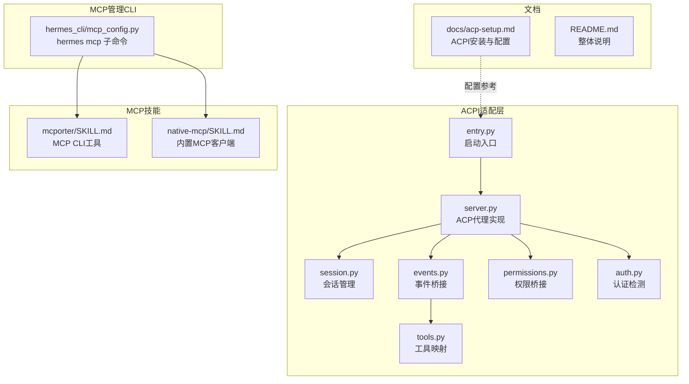
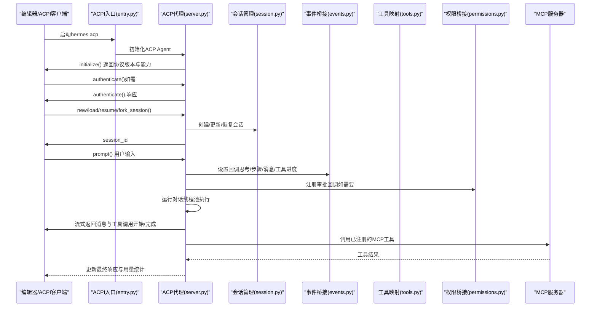
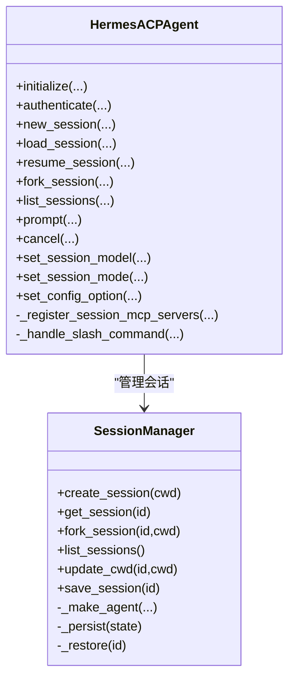
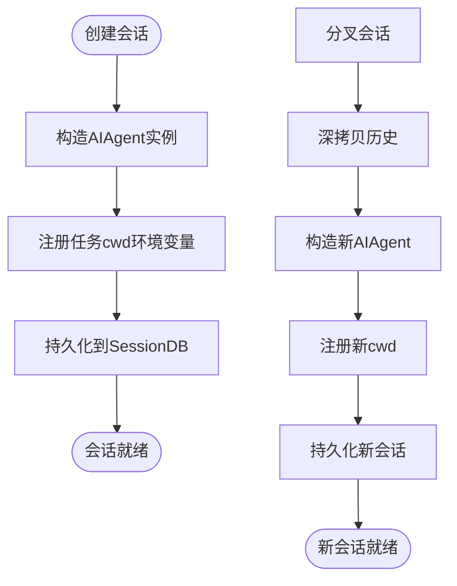
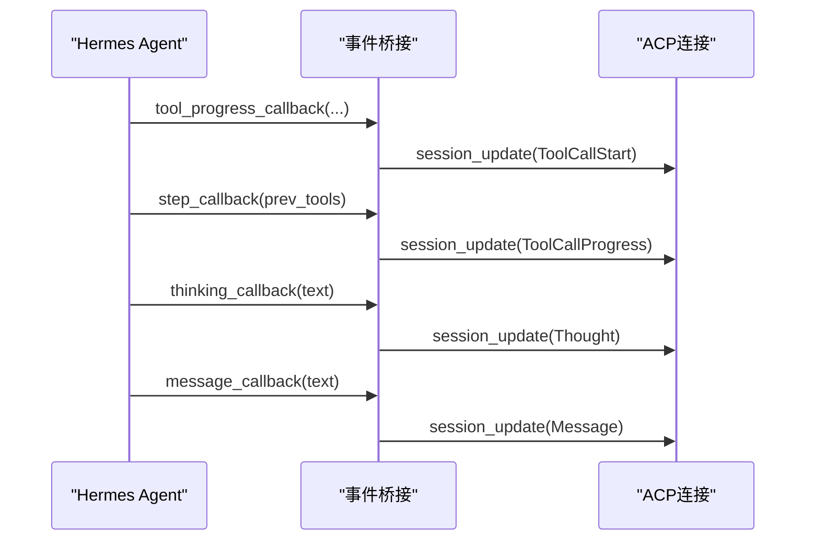
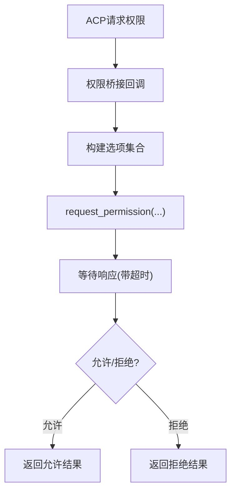
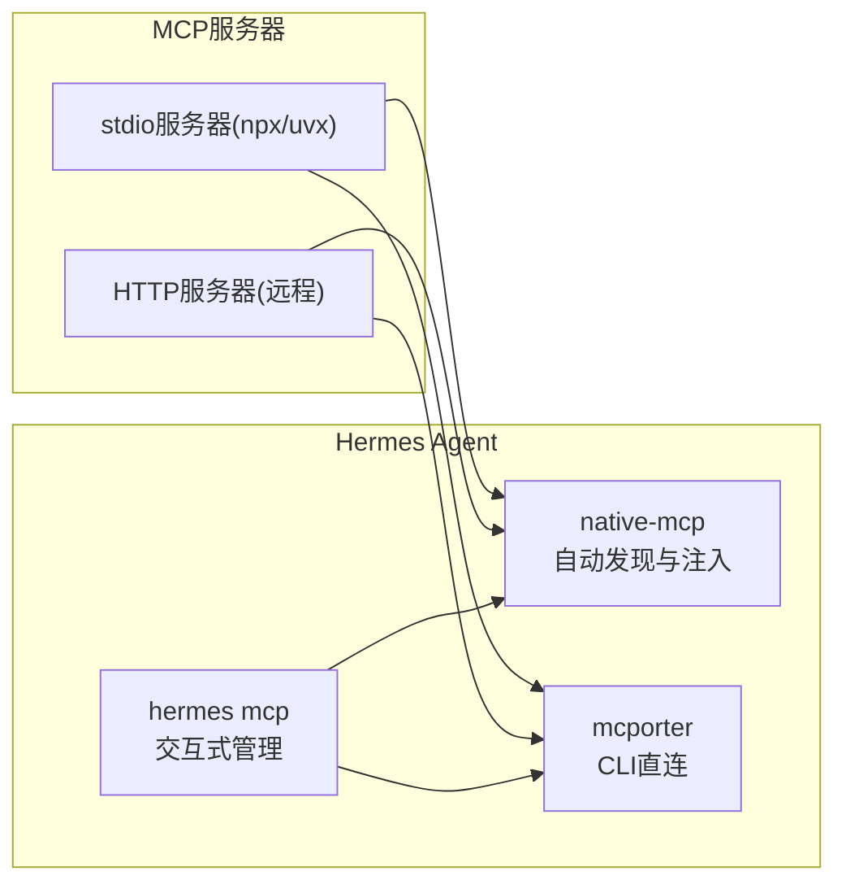
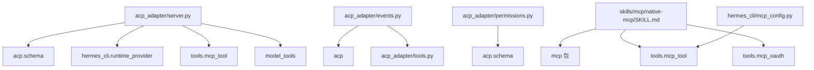

# MCP与ACPI协议集成

<cite>
**本文档引用的文件**
- [acp_adapter/__init__.py](file://acp_adapter/__init__.py)
- [acp_adapter/server.py](file://acp_adapter/server.py)
- [acp_adapter/session.py](file://acp_adapter/session.py)
- [acp_adapter/events.py](file://acp_adapter/events.py)
- [acp_adapter/tools.py](file://acp_adapter/tools.py)
- [acp_adapter/auth.py](file://acp_adapter/auth.py)
- [acp_adapter/permissions.py](file://acp_adapter/permissions.py)
- [acp_adapter/entry.py](file://acp_adapter/entry.py)
- [docs/acp-setup.md](file://docs/acp-setup.md)
- [skills/mcp/mcporter/SKILL.md](file://skills/mcp/mcporter/SKILL.md)
- [skills/mcp/native-mcp/SKILL.md](file://skills/mcp/native-mcp/SKILL.md)
- [hermes_cli/mcp_config.py](file://hermes_cli/mcp_config.py)
- [README.md](file://README.md)
</cite>

## 目录
1. [简介](#简介)
2. [项目结构](#项目结构)
3. [核心组件](#核心组件)
4. [架构总览](#架构总览)
5. [详细组件分析](#详细组件分析)
6. [依赖关系分析](#依赖关系分析)
7. [性能考量](#性能考量)
8. [故障排查指南](#故障排查指南)
9. [结论](#结论)
10. [附录](#附录)

## 简介
本文件面向Hermes Agent在MCP（Model Context Protocol）与ACPI（Agent Client Protocol）协议上的集成能力，系统化阐述协议支持、通信机制、会话管理、事件桥接、权限控制、工具映射以及与第三方MCP服务器的对接方式。文档同时覆盖mcporter与native-mcp两类MCP接入技能的配置与使用方法，并给出部署、安全与性能优化建议。

## 项目结构
围绕MCP与ACPI的集成，相关模块主要分布在以下路径：
- ACPI适配层：acp_adapter（入口、会话、事件、工具、权限、认证）
- MCP技能：skills/mcp（mcporter、native-mcp）
- MCP命令行管理：hermes_cli/mcp_config.py
- 文档与安装：docs/acp-setup.md、README.md

**图表来源**
- [acp_adapter/entry.py:58-86](file://acp_adapter/entry.py#L58-L86)
- [acp_adapter/server.py:93-729](file://acp_adapter/server.py#L93-L729)
- [acp_adapter/session.py:70-476](file://acp_adapter/session.py#L70-L476)
- [acp_adapter/events.py:1-176](file://acp_adapter/events.py#L1-L176)
- [acp_adapter/tools.py:1-215](file://acp_adapter/tools.py#L1-L215)
- [acp_adapter/permissions.py:1-78](file://acp_adapter/permissions.py#L1-L78)
- [acp_adapter/auth.py:1-25](file://acp_adapter/auth.py#L1-L25)
- [skills/mcp/mcporter/SKILL.md:1-123](file://skills/mcp/mcporter/SKILL.md#L1-L123)
- [skills/mcp/native-mcp/SKILL.md:1-357](file://skills/mcp/native-mcp/SKILL.md#L1-L357)
- [hermes_cli/mcp_config.py:1-717](file://hermes_cli/mcp_config.py#L1-L717)
- [docs/acp-setup.md:1-229](file://docs/acp-setup.md#L1-L229)
- [README.md:1-179](file://README.md#L1-L179)

**章节来源**
- [acp_adapter/__init__.py:1-2](file://acp_adapter/__init__.py#L1-L2)
- [docs/acp-setup.md:1-229](file://docs/acp-setup.md#L1-L229)
- [README.md:1-179](file://README.md#L1-L179)

## 核心组件
- ACPI适配器入口与生命周期：负责加载环境变量、配置日志、启动ACP Agent并处理连接、初始化、认证、会话管理与提示处理。
- 会话管理器：维护每个ACP会话的状态、工作目录、模型、历史记录，并持久化到共享数据库以支持重启恢复。
- 事件桥接：将Hermes Agent内部的工具进度、思考过程、步骤完成、消息流等事件转换为ACP更新通知。
- 工具映射：将Hermes工具名称映射为ACP ToolKind，并生成可展示的工具标题与位置信息。
- 权限桥接：将ACP客户端的权限请求映射为Hermes内部的审批回调，支持超时与结果映射。
- 认证辅助：检测当前运行时提供商与凭据可用性，用于ACP认证方法声明。
- MCP技能与管理：
  - mcporter：通过CLI直接发现、调用与管理MCP服务器与工具，支持HTTP与stdio两种传输。
  - native-mcp：内置MCP客户端，在Agent启动时自动连接配置的服务器，发现工具并注入为原生工具集的一部分。
  - hermes mcp 命令：交互式添加/移除/测试/配置MCP服务器，支持OAuth与HTTP头认证。

**章节来源**
- [acp_adapter/server.py:93-729](file://acp_adapter/server.py#L93-L729)
- [acp_adapter/session.py:70-476](file://acp_adapter/session.py#L70-L476)
- [acp_adapter/events.py:1-176](file://acp_adapter/events.py#L1-L176)
- [acp_adapter/tools.py:1-215](file://acp_adapter/tools.py#L1-L215)
- [acp_adapter/permissions.py:1-78](file://acp_adapter/permissions.py#L1-L78)
- [acp_adapter/auth.py:1-25](file://acp_adapter/auth.py#L1-L25)
- [skills/mcp/mcporter/SKILL.md:1-123](file://skills/mcp/mcporter/SKILL.md#L1-L123)
- [skills/mcp/native-mcp/SKILL.md:1-357](file://skills/mcp/native-mcp/SKILL.md#L1-L357)
- [hermes_cli/mcp_config.py:1-717](file://hermes_cli/mcp_config.py#L1-L717)

## 架构总览
下图展示了从编辑器（ACPI客户端）到Hermes Agent再到MCP服务器的整体链路，以及会话、事件与权限的关键交互点。

**图表来源**
- [acp_adapter/entry.py:58-86](file://acp_adapter/entry.py#L58-L86)
- [acp_adapter/server.py:217-467](file://acp_adapter/server.py#L217-L467)
- [acp_adapter/session.py:94-163](file://acp_adapter/session.py#L94-L163)
- [acp_adapter/events.py:47-175](file://acp_adapter/events.py#L47-L175)
- [acp_adapter/tools.py:104-197](file://acp_adapter/tools.py#L104-L197)
- [acp_adapter/permissions.py:26-77](file://acp_adapter/permissions.py#L26-L77)

## 详细组件分析

### ACPI适配器入口与生命周期
- 入口职责：设置日志输出至stderr、加载环境变量、导入ACP并运行Agent。
- 生命周期方法：initialize、authenticate、new_session、load_session、resume_session、fork_session、list_sessions、prompt、cancel、set_session_model、set_session_mode、set_config_option。
- 特性：
  - 协议版本协商与能力声明。
  - 基于运行时提供商的认证方法声明。
  - 会话创建/恢复/分叉与列表查询。
  - 提示处理中拦截斜杠命令（help/model/tools/context/reset/compact/version），并在需要时回写ACP消息更新。
  - 使用线程池执行同步Agent逻辑，避免阻塞事件循环。

**图表来源**
- [acp_adapter/server.py:93-729](file://acp_adapter/server.py#L93-L729)
- [acp_adapter/session.py:70-476](file://acp_adapter/session.py#L70-L476)

**章节来源**
- [acp_adapter/entry.py:58-86](file://acp_adapter/entry.py#L58-L86)
- [acp_adapter/server.py:217-729](file://acp_adapter/server.py#L217-L729)
- [acp_adapter/session.py:94-163](file://acp_adapter/session.py#L94-L163)

### 会话管理与持久化
- 会话状态：包含session_id、AIAgent实例、工作目录、当前模型、对话历史、取消事件。
- 持久化：通过SessionDB将会话元数据与消息持久化到~/.hermes/state.db，支持跨进程重启恢复。
- 工作目录绑定：为任务级环境变量（如cwd）提供注册与清理。
- Agent工厂：根据配置解析运行时提供商，构造AIAgent实例，并将打印输出重定向到stderr以保证ACP stdio传输纯净。

**图表来源**
- [acp_adapter/session.py:94-163](file://acp_adapter/session.py#L94-L163)
- [acp_adapter/session.py:273-405](file://acp_adapter/session.py#L273-L405)

**章节来源**
- [acp_adapter/session.py:58-476](file://acp_adapter/session.py#L58-L476)

### 事件桥接与工具映射
- 事件桥接：将Agent的工具进度、思考、步骤与消息回调转换为ACP更新，通过run_coroutine_threadsafe异步发送，确保主线程事件循环与工作线程解耦。
- 工具映射：建立Hermes工具名到ACP ToolKind的映射，生成人类可读的工具标题与位置信息；对补丁、写文件、终端命令等生成结构化内容块。
- 大结果截断：对过长工具结果进行截断，避免UI卡顿。

**图表来源**
- [acp_adapter/events.py:47-175](file://acp_adapter/events.py#L47-L175)
- [acp_adapter/tools.py:104-197](file://acp_adapter/tools.py#L104-L197)

**章节来源**
- [acp_adapter/events.py:1-176](file://acp_adapter/events.py#L1-L176)
- [acp_adapter/tools.py:1-215](file://acp_adapter/tools.py#L1-L215)

### 权限桥接与认证
- 权限桥接：将ACP request_permission调用映射为Hermes内部审批回调，支持allow_once、allow_always、deny等选项映射，并带超时保护。
- 认证检测：基于运行时提供商解析API密钥与提供商名称，若存在则在initialize阶段声明可用的认证方法。

**图表来源**
- [acp_adapter/permissions.py:26-77](file://acp_adapter/permissions.py#L26-L77)
- [acp_adapter/auth.py:8-25](file://acp_adapter/auth.py#L8-L25)

**章节来源**
- [acp_adapter/permissions.py:1-78](file://acp_adapter/permissions.py#L1-L78)
- [acp_adapter/auth.py:1-25](file://acp_adapter/auth.py#L1-L25)

### MCP技能与管理
- mcporter：提供CLI能力，直接列出/调用MCP服务器与工具，支持HTTP与stdio两种传输，无需配置即可连接临时服务器，适合一次性调用与调试。
- native-mcp：内置MCP客户端，启动时读取~/.hermes/config.yaml中的mcp_servers配置，自动连接并发现工具，按mcp_{server}_{tool}命名规则注入到所有平台工具集中，实现零配置工具注入。
- hermes mcp：交互式管理MCP服务器，支持添加/移除/测试/配置，支持OAuth与HTTP头认证，可选择启用/禁用特定工具。

**图表来源**
- [skills/mcp/native-mcp/SKILL.md:1-357](file://skills/mcp/native-mcp/SKILL.md#L1-L357)
- [skills/mcp/mcporter/SKILL.md:1-123](file://skills/mcp/mcporter/SKILL.md#L1-L123)
- [hermes_cli/mcp_config.py:219-408](file://hermes_cli/mcp_config.py#L219-L408)

**章节来源**
- [skills/mcp/mcporter/SKILL.md:1-123](file://skills/mcp/mcporter/SKILL.md#L1-L123)
- [skills/mcp/native-mcp/SKILL.md:1-357](file://skills/mcp/native-mcp/SKILL.md#L1-L357)
- [hermes_cli/mcp_config.py:1-717](file://hermes_cli/mcp_config.py#L1-L717)

## 依赖关系分析
- ACPI适配层依赖：
  - acp.schema：协议规范类型定义（InitializeResponse、PromptResponse、SessionCapabilities等）。
  - hermes_cli.runtime_provider：运行时提供商解析，用于认证方法声明与Agent构造。
  - tools.mcp_tool：在会话中注册外部MCP服务器。
  - model_tools：刷新工具表面（工具集变更后重新生成工具定义）。
- 事件桥接依赖：
  - acp：ACP更新构造函数（update_agent_message_text、update_agent_thought_text、start_tool_call、update_tool_call等）。
  - tools.tools：工具映射与标题生成。
- 权限桥接依赖：
  - acp.schema：PermissionOption、AllowedOutcome等类型。
- MCP技能依赖：
  - mcp包：HTTP/StreamableHTTP客户端支持（native-mcp）。
  - tools.mcp_tool与tools.mcp_oauth：MCP连接、发现与OAuth令牌管理。

**图表来源**
- [acp_adapter/server.py:11-60](file://acp_adapter/server.py#L11-L60)
- [acp_adapter/events.py:16-22](file://acp_adapter/events.py#L16-L22)
- [acp_adapter/permissions.py:10-13](file://acp_adapter/permissions.py#L10-L13)
- [skills/mcp/native-mcp/SKILL.md:30-40](file://skills/mcp/native-mcp/SKILL.md#L30-L40)
- [hermes_cli/mcp_config.py:168-173](file://hermes_cli/mcp_config.py#L168-L173)

**章节来源**
- [acp_adapter/server.py:11-60](file://acp_adapter/server.py#L11-L60)
- [acp_adapter/events.py:16-22](file://acp_adapter/events.py#L16-L22)
- [acp_adapter/permissions.py:10-13](file://acp_adapter/permissions.py#L10-L13)
- [skills/mcp/native-mcp/SKILL.md:30-40](file://skills/mcp/native-mcp/SKILL.md#L30-L40)
- [hermes_cli/mcp_config.py:168-173](file://hermes_cli/mcp_config.py#L168-L173)

## 性能考量
- 线程池执行：将同步Agent逻辑放入ThreadPoolExecutor，避免阻塞事件循环，提升并发能力。
- 事件异步发送：通过run_coroutine_threadsafe异步推送ACP更新，降低阻塞风险。
- 工具结果截断：对大文本结果进行截断，减少UI渲染压力。
- MCP连接复用：native-mcp对每个服务器维持长连接，避免频繁握手开销。
- 会话持久化：SessionDB减少重启后的重建成本，提高可用性。

[本节为通用指导，不涉及具体文件分析]

## 故障排查指南
- ACPI客户端未出现或立即崩溃
  - 检查是否安装ACP额外依赖、hermes是否在PATH、日志级别是否足够详细。
  - 参考：[docs/acp-setup.md:174-221](file://docs/acp-setup.md#L174-L221)
- “模块未找到”错误
  - 安装ACP额外依赖：pip install -e ".[acp]"
  - 参考：[docs/acp-setup.md:190-196](file://docs/acp-setup.md#L190-L196)
- 响应缓慢
  - 检查网络与提供商状态，必要时切换模型/提供商。
  - 参考：[docs/acp-setup.md:198-203](file://docs/acp-setup.md#L198-L203)
- 终端命令被拒绝
  - 检查ACPI客户端扩展的自动/手动批准设置。
  - 参考：[docs/acp-setup.md:204-208](file://docs/acp-setup.md#L204-L208)
- MCP服务器无法连接
  - 检查命令是否存在、包是否可安装、超时设置、HTTP头或OAuth配置。
  - 参考：[skills/mcp/native-mcp/SKILL.md:204-244](file://skills/mcp/native-mcp/SKILL.md#L204-L244)、[hermes_cli/mcp_config.py:219-408](file://hermes_cli/mcp_config.py#L219-L408)
- MCP工具未出现
  - 确认配置键名正确、缩进正确、查看启动日志、注意工具命名前缀。
  - 参考：[skills/mcp/native-mcp/SKILL.md:234-240](file://skills/mcp/native-mcp/SKILL.md#L234-L240)

**章节来源**
- [docs/acp-setup.md:174-221](file://docs/acp-setup.md#L174-L221)
- [skills/mcp/native-mcp/SKILL.md:204-240](file://skills/mcp/native-mcp/SKILL.md#L204-L240)
- [hermes_cli/mcp_config.py:219-408](file://hermes_cli/mcp_config.py#L219-L408)

## 结论
Hermes Agent通过ACPI适配层实现了与编辑器的无缝协作，借助会话管理、事件桥接与权限控制，提供了稳定、可观测的代理体验。结合MCP技能与管理CLI，用户可以灵活地接入本地或远程MCP服务器，实现工具生态的扩展与自动化。通过合理的配置、安全策略与性能优化，可在多平台与多场景下可靠运行。

[本节为总结性内容，不涉及具体文件分析]

## 附录
- ACPI安装与配置参考：[docs/acp-setup.md:1-229](file://docs/acp-setup.md#L1-L229)
- 项目整体说明：[README.md:1-179](file://README.md#L1-L179)
- MCP服务器管理CLI：[hermes_cli/mcp_config.py:1-717](file://hermes_cli/mcp_config.py#L1-L717)
- mcporter技能说明：[skills/mcp/mcporter/SKILL.md:1-123](file://skills/mcp/mcporter/SKILL.md#L1-L123)
- native-mcp技能说明：[skills/mcp/native-mcp/SKILL.md:1-357](file://skills/mcp/native-mcp/SKILL.md#L1-L357)