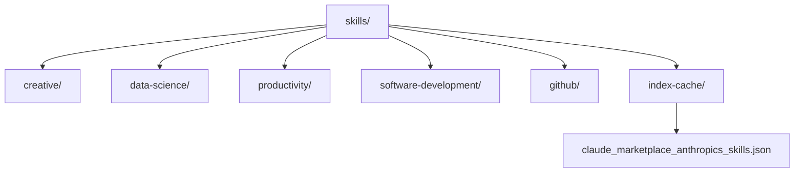
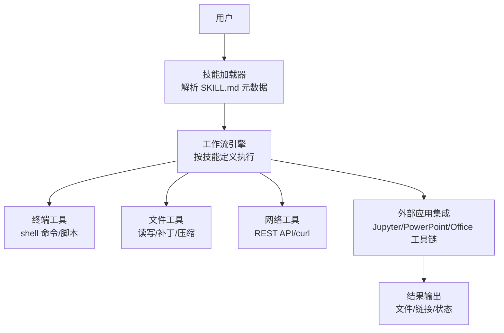
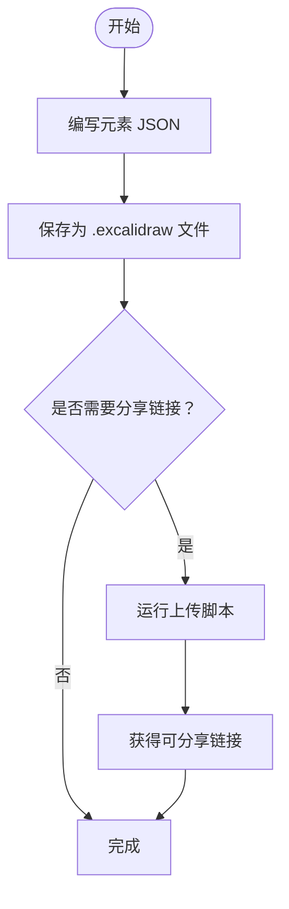
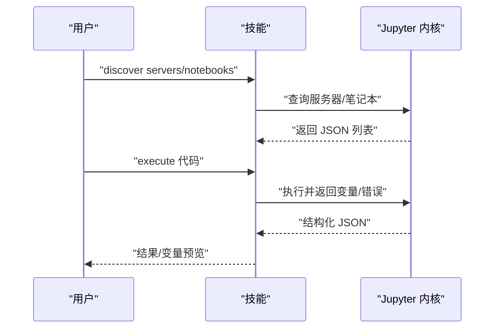
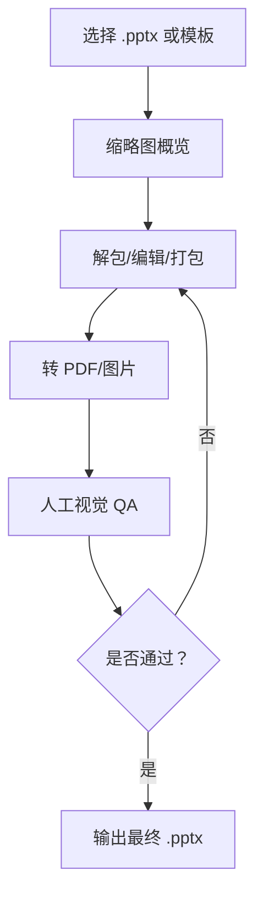
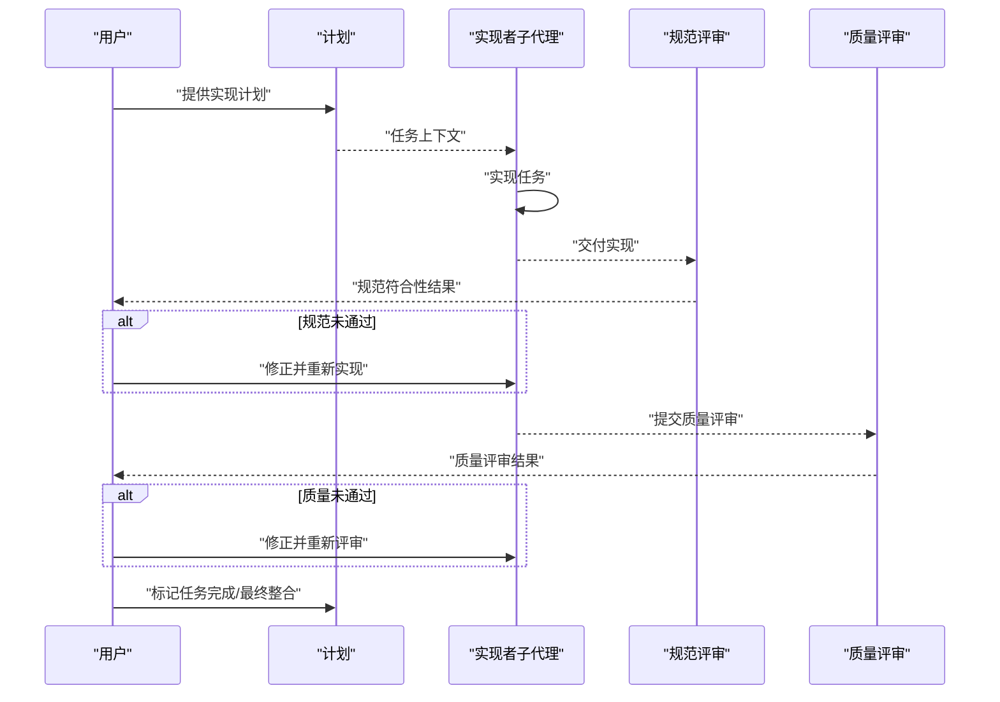
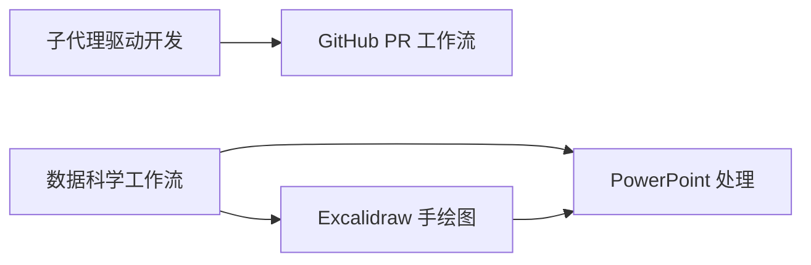

# 内置技能详解

<cite>
**本文引用的文件**
- [README.md](file://README.md)
- [skills/creative/DESCRIPTION.md](file://skills/creative/DESCRIPTION.md)
- [skills/data-science/DESCRIPTION.md](file://skills/data-science/DESCRIPTION.md)
- [skills/productivity/DESCRIPTION.md](file://skills/productivity/DESCRIPTION.md)
- [skills/github/DESCRIPTION.md](file://skills/github/DESCRIPTION.md)
- [skills/creative/excalidraw/SKILL.md](file://skills/creative/excalidraw/SKILL.md)
- [skills/software-development/subagent-driven-development/SKILL.md](file://skills/software-development/subagent-driven-development/SKILL.md)
- [skills/data-science/jupyter-live-kernel/SKILL.md](file://skills/data-science/jupyter-live-kernel/SKILL.md)
- [skills/productivity/powerpoint/SKILL.md](file://skills/productivity/powerpoint/SKILL.md)
- [skills/github/github-pr-workflow/SKILL.md](file://skills/github/github-pr-workflow/SKILL.md)
- [skills/index-cache/claude_marketplace_anthropics_skills.json](file://skills/index-cache/claude_marketplace_anthropics_skills.json)
</cite>

## 目录
1. [简介](#简介)
2. [项目结构](#项目结构)
3. [核心组件](#核心组件)
4. [架构总览](#架构总览)
5. [详细组件分析](#详细组件分析)
6. [依赖关系分析](#依赖关系分析)
7. [性能考虑](#性能考虑)
8. [故障排查指南](#故障排查指南)
9. [结论](#结论)
10. [附录](#附录)

## 简介
本文件面向使用者与开发者，系统性梳理 Hermes Agent 的“内置技能”体系，覆盖开发工具、数据科学、创意设计、生产力工具等主要领域，并对每个技能的工作原理、输入输出、依赖要求、配置与使用示例、版本管理与更新机制、定制化与扩展方法、性能优化与使用限制、以及技能组合策略进行深入说明。文中所有技术细节均以仓库中实际技能文档为依据。

## 项目结构
Hermes Agent 的技能以“技能目录 + 技能元数据 + 使用说明”的形式组织，位于 skills/ 及 optional-skills/ 目录下；同时提供索引缓存用于技能发现与分组展示。

- 技能分类与入口
  - skills/creative：创意内容生成（手绘风格图、可视化设计）
  - skills/data-science：数据科学工作流（交互式探索、Jupyter 实时内核）
  - skills/productivity：文档与演示（PowerPoint 处理、模板与布局）
  - skills/software-development：软件开发流程（子代理驱动开发、计划执行）
  - skills/github：GitHub 工作流（PR 生命周期、CI 监控与自动修复）
  - skills/index-cache/claude_marketplace_anthropics_skills.json：技能索引缓存，便于聚合与检索

**图表来源**
- [skills/creative/DESCRIPTION.md:1-4](file://skills/creative/DESCRIPTION.md#L1-L4)
- [skills/data-science/DESCRIPTION.md:1-4](file://skills/data-science/DESCRIPTION.md#L1-L4)
- [skills/productivity/DESCRIPTION.md:1-4](file://skills/productivity/DESCRIPTION.md#L1-L4)
- [skills/github/DESCRIPTION.md:1-4](file://skills/github/DESCRIPTION.md#L1-L4)
- [skills/index-cache/claude_marketplace_anthropics_skills.json:1-1](file://skills/index-cache/claude_marketplace_anthropics_skills.json#L1-L1)

**章节来源**
- [README.md:1-179](file://README.md#L1-L179)
- [skills/creative/DESCRIPTION.md:1-4](file://skills/creative/DESCRIPTION.md#L1-L4)
- [skills/data-science/DESCRIPTION.md:1-4](file://skills/data-science/DESCRIPTION.md#L1-L4)
- [skills/productivity/DESCRIPTION.md:1-4](file://skills/productivity/DESCRIPTION.md#L1-L4)
- [skills/github/DESCRIPTION.md:1-4](file://skills/github/DESCRIPTION.md#L1-L4)
- [skills/index-cache/claude_marketplace_anthropics_skills.json:1-1](file://skills/index-cache/claude_marketplace_anthropics_skills.json#L1-L1)

## 核心组件
- 技能元数据与版本
  - 每个技能通过 SKILL.md 文件声明名称、版本、作者、许可证、依赖与标签等元信息，便于统一管理与展示。
- 技能索引缓存
  - claude_marketplace_anthropics_skills.json 提供技能集合的索引，包含技能名称、描述、来源与技能清单，支持快速浏览与聚合。
- 技能加载与调用
  - 用户在会话中通过命令或直接触发技能名即可加载对应技能，技能内部定义其工作流、工具依赖与操作步骤。

**章节来源**
- [skills/creative/excalidraw/SKILL.md:1-13](file://skills/creative/excalidraw/SKILL.md#L1-L13)
- [skills/software-development/subagent-driven-development/SKILL.md:1-11](file://skills/software-development/subagent-driven-development/SKILL.md#L1-L11)
- [skills/data-science/jupyter-live-kernel/SKILL.md:1-16](file://skills/data-science/jupyter-live-kernel/SKILL.md#L1-L16)
- [skills/productivity/powerpoint/SKILL.md:1-5](file://skills/productivity/powerpoint/SKILL.md#L1-L5)
- [skills/github/github-pr-workflow/SKILL.md:1-11](file://skills/github/github-pr-workflow/SKILL.md#L1-L11)
- [skills/index-cache/claude_marketplace_anthropics_skills.json:1-1](file://skills/index-cache/claude_marketplace_anthropics_skills.json#L1-L1)

## 架构总览
Hermes Agent 的技能系统围绕“技能即服务”的理念构建：用户在对话中选择或触发技能，技能根据自身元数据与工作流执行相应任务，可能调用终端、文件工具、网络请求或外部应用（如 Jupyter、LibreOffice、PPTX 工具链）。

[此图为概念性架构示意，不直接映射到具体源码文件，故无“图表来源”]

## 详细组件分析

### 创意设计类技能
- 分类概述
  - 覆盖手绘风格图、可视化设计与创意素材生成，强调低门槛、可分享与可编辑。
- 典型技能：Excalidraw 手绘图
  - 功能特性
    - 通过标准 Excalidraw JSON 元素数组生成 .excalidraw 文件，支持上传至网站获取可分享链接。
    - 提供元素类型参考（矩形、椭圆、菱形、箭头、文本）、绑定标注、绘制顺序与尺寸规范、配色表与排版建议。
  - 输入输出
    - 输入：JSON 结构的元素数组与画布配置；输出：.excalidraw 文件与可选的分享链接。
  - 依赖要求
    - 需要 cryptography 包以支持上传脚本；可直接在浏览器打开或通过脚本上传。
  - 使用示例与最佳实践
    - 先在本地编写元素 JSON，保存为 .excalidraw 文件；随后使用终端脚本上传获取链接；遵循最小字号、元素尺寸与颜色一致性原则。
  - 版本与更新
    - 在 SKILL.md 中声明版本号，更新时注意 JSON 字段兼容性与上传脚本依赖变更。
  - 定制化与扩展
    - 可基于颜色表与布局建议扩展主题；结合模板与绑定标注实现复杂流程图与架构图。

**图表来源**
- [skills/creative/excalidraw/SKILL.md:19-54](file://skills/creative/excalidraw/SKILL.md#L19-L54)

**章节来源**
- [skills/creative/DESCRIPTION.md:1-4](file://skills/creative/DESCRIPTION.md#L1-L4)
- [skills/creative/excalidraw/SKILL.md:1-195](file://skills/creative/excalidraw/SKILL.md#L1-L195)

### 数据科学类技能
- 分类概述
  - 面向数据探索、迭代实验与中间态变量持久化的场景，提供“有状态”的 Python REPL 能力。
- 典型技能：Jupyter 实时内核（hamelnb）
  - 功能特性
    - 通过 live Jupyter kernel 提供状态持久化的交互式执行环境；适合逐步构建代码、检查中间变量与调试。
  - 输入输出
    - 输入：notebook 路径与 Python 代码；输出：结构化 JSON（含变量列表、预览、错误信息）。
  - 依赖要求
    - 需要 uv、JupyterLab、本地 Jupyter 服务器；需预先启动内核会话。
  - 使用示例与最佳实践
    - 先 discover 服务器与笔记本；再多次 execute 并 inspect variables；必要时 restart-run-all 进行端到端验证；使用 compact 标志减少 token 开销。
  - 性能与限制
    - 首次执行可能超时；内核 Python 环境需安装所需包；长任务设置足够超时时间。
  - 版本与更新
    - 通过脚本版本与依赖管理工具控制；升级时注意内核环境与 notebook 兼容性。

**图表来源**
- [skills/data-science/jupyter-live-kernel/SKILL.md:82-139](file://skills/data-science/jupyter-live-kernel/SKILL.md#L82-L139)

**章节来源**
- [skills/data-science/DESCRIPTION.md:1-4](file://skills/data-science/DESCRIPTION.md#L1-L4)
- [skills/data-science/jupyter-live-kernel/SKILL.md:1-172](file://skills/data-science/jupyter-live-kernel/SKILL.md#L1-L172)

### 生产力工具类技能
- 分类概述
  - 聚焦文档与演示制作，覆盖 .pptx 的读取、编辑、创建与质量保证流程。
- 典型技能：PowerPoint 处理
  - 功能特性
    - 支持从现有 .pptx 提取文本、生成缩略图、打包/解包 Office 文档；支持从零创建与模板编辑；提供设计建议与排版规范。
  - 输入输出
    - 输入：.pptx 文件路径或模板；输出：处理后的 .pptx 或中间产物（PDF/图片）。
  - 依赖要求
    - markitdown（文本提取与缩略图）、Pillow（网格缩略图）、pptxgenjs（从零创建）、LibreOffice（PDF 转换）、Poppler（PDF 转图片）。
  - 使用示例与最佳实践
    - 先 thumbnail 概览布局，再 unpack/edit/pack；QA 采用“生成-转图片-人工复核”的循环；避免纯文本幻灯片与低对比度元素。
  - 版本与更新
    - 依赖工具版本变化可能影响输出质量，更新时同步测试转换与渲染链路。
  - 定制化与扩展
    - 可基于颜色主题与字体搭配扩展模板；结合图标与网格布局提升视觉表达。

**图表来源**
- [skills/productivity/powerpoint/SKILL.md:19-233](file://skills/productivity/powerpoint/SKILL.md#L19-L233)

**章节来源**
- [skills/productivity/DESCRIPTION.md:1-4](file://skills/productivity/DESCRIPTION.md#L1-L4)
- [skills/productivity/powerpoint/SKILL.md:1-233](file://skills/productivity/powerpoint/SKILL.md#L1-L233)

### 开发工具类技能
- 分类概述
  - 围绕软件开发生命周期中的计划、实现、评审与调试，强调“子代理 + 双重评审”的系统化流程。
- 典型技能：子代理驱动开发
  - 功能特性
    - 将实现计划拆分为独立任务，为每项任务派发“实现者子代理”，随后依次进行“规范符合性评审”和“代码质量评审”，最终整合与提交。
  - 输入输出
    - 输入：实现计划文件；输出：逐任务的评审记录、修改与最终提交。
  - 依赖要求
    - 依赖 delegate_task、文件工具与终端工具；需要明确的评审维度与测试流程。
  - 使用示例与最佳实践
    - 一次性读取完整计划并构建待办列表；每项任务先实现后评审，严格禁止跳过任一评审环节；鼓励子代理提问并由人类提供上下文。
  - 版本与更新
    - 版本号在 SKILL.md 中声明；流程优化应保持评审顺序与维度稳定。
  - 定制化与扩展
    - 可与“测试驱动开发”“系统化调试”等技能联动，形成闭环。

**图表来源**
- [skills/software-development/subagent-driven-development/SKILL.md:35-174](file://skills/software-development/subagent-driven-development/SKILL.md#L35-L174)

**章节来源**
- [skills/software-development/subagent-driven-development/SKILL.md:1-343](file://skills/software-development/subagent-driven-development/SKILL.md#L1-L343)

### 版本管理与更新机制
- 元数据驱动
  - 每个技能在 SKILL.md 中声明 version 字段，作为版本标识；更新时应明确变更范围与兼容性。
- 索引缓存
  - claude_marketplace_anthropics_skills.json 提供技能集合索引，便于统一展示与检索；当技能新增/删除或元数据变更时，应同步更新索引。
- 依赖管理
  - 技能文档中列出的外部依赖（如 cryptography、uv、JupyterLab、pptxgenjs、LibreOffice、Poppler）需在运行环境中正确安装与配置。

**章节来源**
- [skills/creative/excalidraw/SKILL.md:4-7](file://skills/creative/excalidraw/SKILL.md#L4-L7)
- [skills/software-development/subagent-driven-development/SKILL.md:4-10](file://skills/software-development/subagent-driven-development/SKILL.md#L4-L10)
- [skills/data-science/jupyter-live-kernel/SKILL.md:9-16](file://skills/data-science/jupyter-live-kernel/SKILL.md#L9-L16)
- [skills/productivity/powerpoint/SKILL.md:226-233](file://skills/productivity/powerpoint/SKILL.md#L226-L233)
- [skills/index-cache/claude_marketplace_anthropics_skills.json:1-1](file://skills/index-cache/claude_marketplace_anthropics_skills.json#L1-L1)

### 定制化与扩展方法
- 元数据扩展
  - 在 SKILL.md 中添加 hermes.tags、related_skills 等字段，有助于技能发现与组合。
- 工作流定制
  - 子代理驱动开发可按团队规范调整评审维度与测试流程；PowerPoint 技能可引入新的设计模板与颜色方案。
- 外部集成
  - Jupyter 实时内核需确保内核环境与包版本稳定；PowerPoint 技能需维护工具链版本与转换流程。

**章节来源**
- [skills/software-development/subagent-driven-development/SKILL.md:7-10](file://skills/software-development/subagent-driven-development/SKILL.md#L7-L10)
- [skills/productivity/powerpoint/SKILL.md:51-138](file://skills/productivity/powerpoint/SKILL.md#L51-L138)
- [skills/data-science/jupyter-live-kernel/SKILL.md:34-81](file://skills/data-science/jupyter-live-kernel/SKILL.md#L34-L81)

### 技能组合使用策略与技巧
- 创意设计 + 数据科学
  - 先用 Jupyter 探索与建模，再用 Excalidraw 输出可视化草图或架构图，最后用 PowerPoint 整理成演示材料。
- 开发流程 + GitHub
  - 使用子代理驱动开发产出代码，配合 GitHub PR 工作流自动化分支、提交、PR 创建、CI 监控与合并，形成端到端流水线。
- 生产力工具 + 创意设计
  - 用 PowerPoint 设计讲稿与视觉元素，再用 Excalidraw 补充手绘风格的补充图与流程图。

[本节为通用策略说明，不直接分析具体源码文件，故无“章节来源”]

## 依赖关系分析
- 技能间耦合
  - GitHub PR 工作流与开发工具类技能存在协作关系（前者负责自动化流程，后者负责实现与评审）。
  - 创意设计与生产力工具可作为数据科学与开发流程的“可视化与展示”环节。
- 外部依赖
  - Jupyter 实时内核依赖 uv、JupyterLab 与本地内核会话；
  - PowerPoint 技能依赖 markitdown、Pillow、pptxgenjs、LibreOffice、Poppler；
  - Excalidraw 技能依赖 cryptography 以支持上传脚本。

**图表来源**
- [skills/software-development/subagent-driven-development/SKILL.md:254-274](file://skills/software-development/subagent-driven-development/SKILL.md#L254-L274)
- [skills/github/github-pr-workflow/SKILL.md:1-11](file://skills/github/github-pr-workflow/SKILL.md#L1-L11)
- [skills/data-science/jupyter-live-kernel/SKILL.md:34-81](file://skills/data-science/jupyter-live-kernel/SKILL.md#L34-L81)
- [skills/creative/excalidraw/SKILL.md:44-52](file://skills/creative/excalidraw/SKILL.md#L44-L52)
- [skills/productivity/powerpoint/SKILL.md:226-233](file://skills/productivity/powerpoint/SKILL.md#L226-L233)

**章节来源**
- [skills/software-development/subagent-driven-development/SKILL.md:254-274](file://skills/software-development/subagent-driven-development/SKILL.md#L254-L274)
- [skills/github/github-pr-workflow/SKILL.md:1-11](file://skills/github/github-pr-workflow/SKILL.md#L1-L11)
- [skills/data-science/jupyter-live-kernel/SKILL.md:34-81](file://skills/data-science/jupyter-live-kernel/SKILL.md#L34-L81)
- [skills/creative/excalidraw/SKILL.md:44-52](file://skills/creative/excalidraw/SKILL.md#L44-L52)
- [skills/productivity/powerpoint/SKILL.md:226-233](file://skills/productivity/powerpoint/SKILL.md#L226-L233)

## 性能考虑
- Jupyter 实时内核
  - 首次执行可能超时，建议重试；为长任务设置更长超时；使用 compact 标志减少输出体积。
- PowerPoint 转换
  - PDF 转图片分辨率与数量会影响性能，建议按需转换特定页码；批量 QA 时可采用子代理视角降低主观偏差。
- Excalidraw 上传
  - 上传脚本依赖 cryptography，首次安装后可重复使用；避免频繁上传以减少网络开销。

[本节为通用性能建议，不直接分析具体源码文件，故无“章节来源”]

## 故障排查指南
- Jupyter 实时内核
  - 若内核未就绪或超时：确认服务器已启动且内核会话存在；必要时重启并重试；检查内核 Python 环境是否安装所需包。
- PowerPoint 质量问题
  - 使用 markitdown 检查缺失内容与占位符；通过 PDF 转图片进行人工复核；对齐与间距不一致时优先修正视觉错位。
- Excalidraw 绘图异常
  - 检查元素绑定与容器 ID 是否正确；避免使用不受支持的属性；确保最小字号与对比度满足可读性要求。

**章节来源**
- [skills/data-science/jupyter-live-kernel/SKILL.md:140-172](file://skills/data-science/jupyter-live-kernel/SKILL.md#L140-L172)
- [skills/productivity/powerpoint/SKILL.md:141-204](file://skills/productivity/powerpoint/SKILL.md#L141-L204)
- [skills/creative/excalidraw/SKILL.md:90-121](file://skills/creative/excalidraw/SKILL.md#L90-L121)

## 结论
Hermes Agent 的内置技能以清晰的元数据与工作流为核心，覆盖从创意设计、数据科学到开发流程与生产力工具的全链路场景。通过标准化的 SKILL.md 描述、索引缓存与外部依赖管理，用户可以快速加载、组合与扩展技能，实现从探索、实现到展示的一体化智能工作流。建议在实践中持续完善评审维度、工具链版本与可视化规范，以获得更稳健的产出质量。

## 附录
- 技能索引缓存位置与用途
  - claude_marketplace_anthropics_skills.json 提供技能集合索引，便于聚合与检索。
- 快速参考
  - 创意设计：Excalidraw 手绘图
  - 数据科学：Jupyter 实时内核
  - 生产力工具：PowerPoint 处理
  - 开发工具：子代理驱动开发
  - 协同工具：GitHub PR 工作流

**章节来源**
- [skills/index-cache/claude_marketplace_anthropics_skills.json:1-1](file://skills/index-cache/claude_marketplace_anthropics_skills.json#L1-L1)