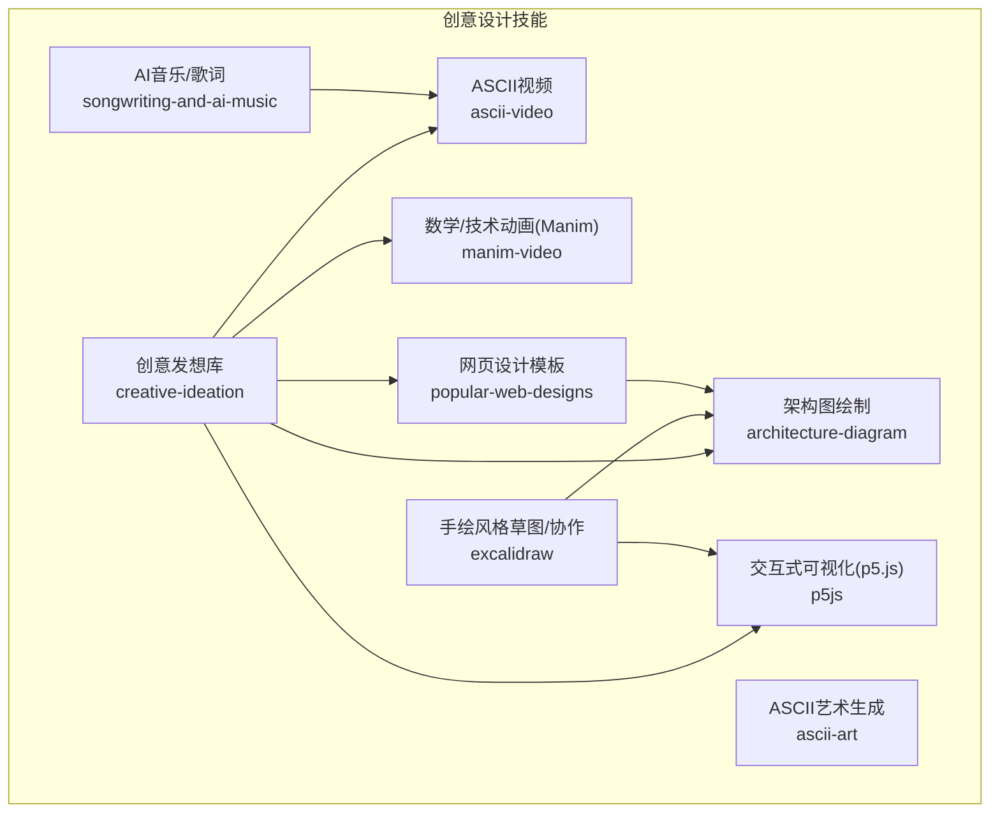
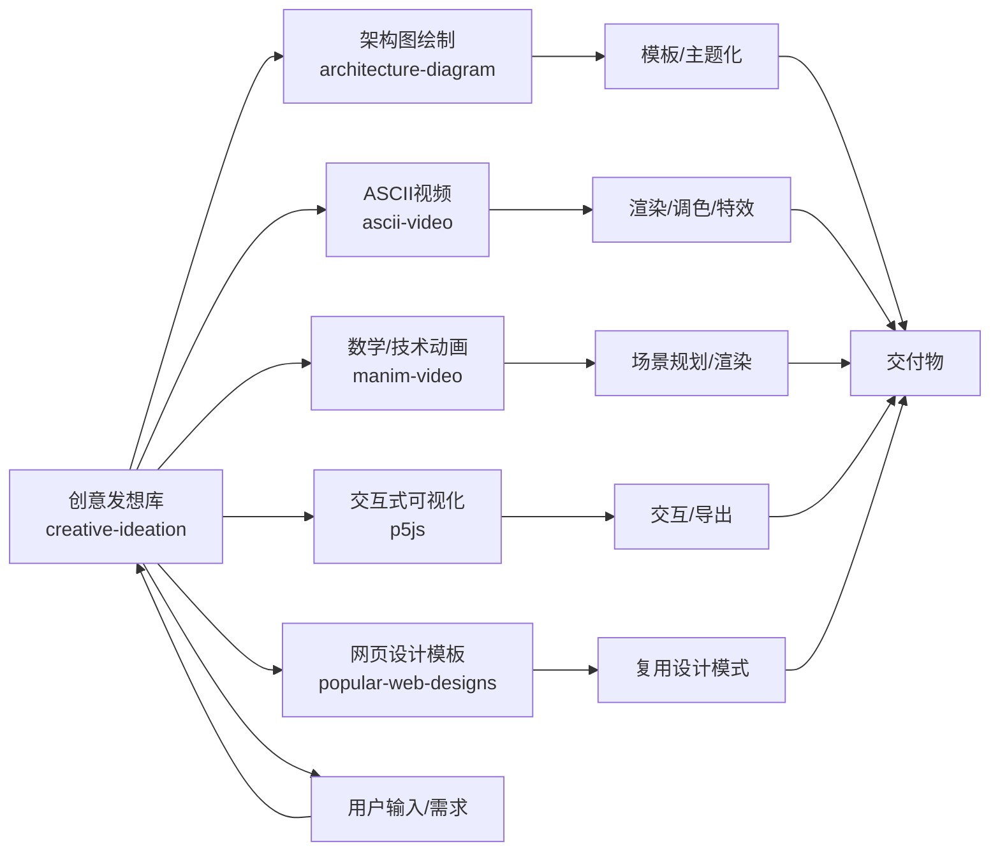
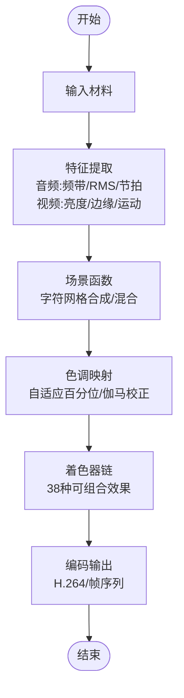
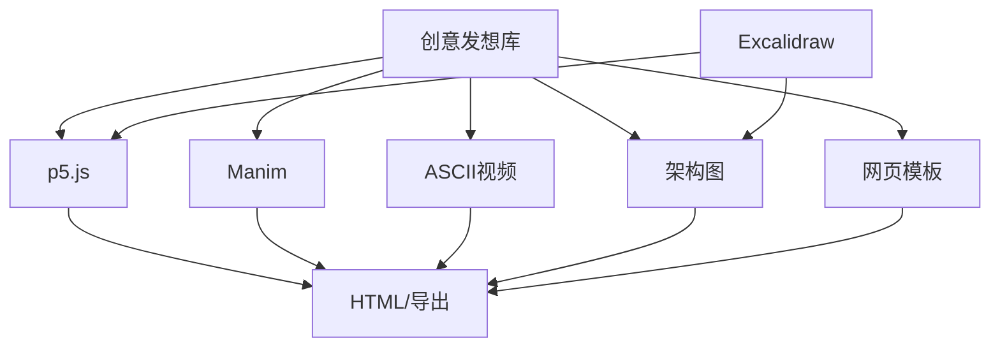

# 创意设计类

<cite>
**本文引用的文件**
- [skills/creative/DESCRIPTION.md](file://skills/creative/DESCRIPTION.md)
- [skills/creative/ascii-video/README.md](file://skills/creative/ascii-video/README.md)
- [skills/creative/manim-video/README.md](file://skills/creative/manim-video/README.md)
- [skills/creative/p5js/README.md](file://skills/creative/p5js/README.md)
- [skills/creative/architecture-diagram/SKILL.md](file://skills/creative/architecture-diagram/SKILL.md)
- [skills/creative/architecture-diagram/templates/template.html](file://skills/creative/architecture-diagram/templates/template.html)
- [skills/creative/excalidraw/SKILL.md](file://skills/creative/excalidraw/SKILL.md)
- [skills/creative/excalidraw/scripts/upload.py](file://skills/creative/excalidraw/scripts/upload.py)
- [skills/creative/popular-web-designs/SKILL.md](file://skills/creative/popular-web-designs/SKILL.md)
- [skills/creative/popular-web-designs/templates/apple.md](file://skills/creative/popular-web-designs/templates/apple.md)
- [skills/creative/songwriting-and-ai-music/SKILL.md](file://skills/creative/songwriting-and-ai-music/SKILL.md)
- [skills/creative/ascii-art/SKILL.md](file://skills/creative/ascii-art/SKILL.md)
- [skills/creative/creative-ideation/SKILL.md](file://skills/creative/creative-ideation/SKILL.md)
- [skills/creative/creative-ideation/references/full-prompt-library.md](file://skills/creative/creative-ideation/references/full-prompt-library.md)
</cite>

## 目录
1. [简介](#简介)
2. [项目结构](#项目结构)
3. [核心组件](#核心组件)
4. [架构总览](#架构总览)
5. [详细组件分析](#详细组件分析)
6. [依赖关系分析](#依赖关系分析)
7. [性能考虑](#性能考虑)
8. [故障排查指南](#故障排查指南)
9. [结论](#结论)
10. [附录](#附录)

## 简介
本文件面向Hermes Agent的创意设计类技能，系统梳理并说明以下创作能力：架构图绘制、ASCII艺术生成、ASCII视频渲染、数学与技术动画（Manim）、交互式可视化（p5.js）、网页设计模板复用、AI音乐创作与歌词写作。文档覆盖每项技能的创作流程、参数配置要点、输出格式与适用场景，并提供创意灵感与最佳实践，帮助在不同设计任务中高效组合使用这些工具。

## 项目结构
创意设计类技能集中在skills/creative目录下，每个子技能以独立目录组织，包含：
- 技能说明与工作流：SKILL.md
- 使用指南与参考文档：README.md（部分技能）
- 参考资料与分层文档：references/（部分技能）
- 模板与示例：templates/（部分技能）
- 辅助脚本：scripts/（部分技能）

图表来源
- [skills/creative/DESCRIPTION.md](file://skills/creative/DESCRIPTION.md)
- [skills/creative/architecture-diagram/SKILL.md](file://skills/creative/architecture-diagram/SKILL.md)
- [skills/creative/ascii-art/SKILL.md](file://skills/creative/ascii-art/SKILL.md)
- [skills/creative/ascii-video/README.md](file://skills/creative/ascii-video/README.md)
- [skills/creative/manim-video/README.md](file://skills/creative/manim-video/README.md)
- [skills/creative/p5js/README.md](file://skills/creative/p5js/README.md)
- [skills/creative/excalidraw/SKILL.md](file://skills/creative/excalidraw/SKILL.md)
- [skills/creative/popular-web-designs/SKILL.md](file://skills/creative/popular-web-designs/SKILL.md)
- [skills/creative/songwriting-and-ai-music/SKILL.md](file://skills/creative/songwriting-and-ai-music/SKILL.md)
- [skills/creative/creative-ideation/SKILL.md](file://skills/creative/creative-ideation/SKILL.md)

章节来源
- [skills/creative/DESCRIPTION.md](file://skills/creative/DESCRIPTION.md)

## 核心组件
- 架构图绘制：基于模板与提示工程，生成可嵌入页面的架构图，支持主题化与协作分享。
- ASCII艺术生成：从文本或图像生成字符画，强调密度与纹理层次。
- ASCII视频：将音频/视频/文本转换为彩色字符视频，具备完整的渲染管线与调优策略。
- 数学/技术动画（Manim）：从自然语言到高质量数学动画的端到端流水线。
- 交互式可视化（p5.js）：浏览器内自包含的交互式视觉作品，支持导出多种格式。
- 手绘风格草图（Excalidraw）：快速手绘草图与协作，支持上传与分享。
- 网页设计模板：复用主流产品网站的设计模式与布局，加速原型产出。
- AI音乐/歌词：结合歌词与音乐风格，生成可迭代的音频与歌词内容。

章节来源
- [skills/creative/architecture-diagram/SKILL.md](file://skills/creative/architecture-diagram/SKILL.md)
- [skills/creative/ascii-art/SKILL.md](file://skills/creative/ascii-art/SKILL.md)
- [skills/creative/ascii-video/README.md](file://skills/creative/ascii-video/README.md)
- [skills/creative/manim-video/README.md](file://skills/creative/manim-video/README.md)
- [skills/creative/p5js/README.md](file://skills/creative/p5js/README.md)
- [skills/creative/excalidraw/SKILL.md](file://skills/creative/excalidraw/SKILL.md)
- [skills/creative/popular-web-designs/SKILL.md](file://skills/creative/popular-web-designs/SKILL.md)
- [skills/creative/songwriting-and-ai-music/SKILL.md](file://skills/creative/songwriting-and-ai-music/SKILL.md)

## 架构总览
创意工具链围绕“提示工程 + 工具编排 + 渲染导出”的闭环展开。创意发想库提供提示词与风格参考；具体技能负责执行创作与渲染；输出统一通过模板或导出脚本落地。

图表来源
- [skills/creative/creative-ideation/SKILL.md](file://skills/creative/creative-ideation/SKILL.md)
- [skills/creative/architecture-diagram/SKILL.md](file://skills/creative/architecture-diagram/SKILL.md)
- [skills/creative/ascii-video/README.md](file://skills/creative/ascii-video/README.md)
- [skills/creative/manim-video/README.md](file://skills/creative/manim-video/README.md)
- [skills/creative/p5js/README.md](file://skills/creative/p5js/README.md)
- [skills/creative/popular-web-designs/SKILL.md](file://skills/creative/popular-web-designs/SKILL.md)

## 详细组件分析

### 架构图绘制（architecture-diagram）
- 创作流程
  - 输入：系统/服务/模块描述、关系与约束
  - 处理：解析语义、映射到图形元素、布局优化、主题化
  - 输出：可嵌入HTML的矢量图，支持颜色与字体定制
- 参数配置
  - 主题与配色：根据品牌或场景选择主色系
  - 布局策略：层级/树形/网格等布局选项
  - 元素样式：图标集、连接线类型、标签位置
- 输出格式
  - HTML内嵌SVG，可直接嵌入网页或文档
- 使用示例
  - 微服务架构：按服务边界拆分，标注通信协议与数据流向
  - 数据流图：从采集到存储/计算/展示的全链路
- 最佳实践
  - 先概念后细节，先主干后分支
  - 统一命名与缩写规则，避免歧义
  - 控制节点数量，必要时分图表达

章节来源
- [skills/creative/architecture-diagram/SKILL.md](file://skills/creative/architecture-diagram/SKILL.md)
- [skills/creative/architecture-diagram/templates/template.html](file://skills/creative/architecture-diagram/templates/template.html)

### ASCII艺术生成（ascii-art）
- 创作流程
  - 输入：文本、图像或关键词
  - 处理：字符集选择、密度与纹理组合、亮度映射
  - 输出：字符画（单色或多色字符）
- 参数配置
  - 字符密度：细密/适中/粗犷
  - 字符族：点阵、块元素、希腊字母、方框等
  - 颜色策略：灰度映射、色调映射、离散调色板
- 输出格式
  - 文本字符画（终端/纯文本）
  - 可选：着色字符（取决于终端支持）
- 使用示例
  - LOGO与标语：使用块元素与高对比字符
  - 科技感：使用方框与线条字符
- 最佳实践
  - 先确定主基调（科技/有机/神秘），再选字符族
  - 控制字符密度，避免信息过载

章节来源
- [skills/creative/ascii-art/SKILL.md](file://skills/creative/ascii-art/SKILL.md)

### ASCII视频（ascii-video）
- 创作流程（通用6阶段）
  - 输入 → 分析 → 场景函数 → 色调映射 → 着色器链 → 编码
- 模式
  - 视频转ASCII、音频驱动、生成式、混合、歌词/字幕、TTS旁白
- 核心能力
  - 网格系统：多密度叠加，形成纹理与深度
  - 字符调色板：24组不同质感的字符集合
  - 颜色策略：角度/距离/频率/时间/采样等多种映射
  - 效果库：21类值场、9类色调场、11类坐标变换、9类粒子系统
  - 着色器管线：38个可组合着色器，12色相预设，7情绪预设
  - 合成与过渡：20种像素混合、反馈缓冲、遮罩与转场
- 性能与硬件适配
  - 自动检测CPU/RAM/平台，按配置降级以控制时长
  - 1080p/24fps约180ms/核/帧，支持多核并行
- 输出格式
  - MP4/H.264，帧序列PNG/GIF
- 使用示例
  - 音乐可视化：按节拍/频段驱动粒子与几何
  - 教育短片：将公式/算法步骤可视化为字符动画
  - 品牌宣传：TTS旁白+歌词字幕+风格化着色
- 最佳实践
  - 先小步快跑：草稿/预览档验证节奏与效果
  - 重视色调映射：避免线性增益导致高光削波
  - 合理使用反馈缓冲：营造轨迹与氛围，注意衰减与混合

图表来源
- [skills/creative/ascii-video/README.md](file://skills/creative/ascii-video/README.md)

章节来源
- [skills/creative/ascii-video/README.md](file://skills/creative/ascii-video/README.md)

### 数学/技术动画（Manim）
- 创作流程
  - 提示工程 → 场景规划 → 代码生成 → 渲染 → 剪辑 → 迭代
- 适用场景
  - 概念解释、定理推导、算法步骤、数据故事、架构构建动画
- 输出格式
  - 高质量视频（H.264），可与其他片段拼接
- 使用示例
  - 神经网络学习过程的动态演示
  - 快速排序的逐步可视化
  - 公司业绩前后对比的动图
- 最佳实践
  - 将复杂概念拆分为清晰的场景与过渡
  - 控制动画速度与强调重点，避免信息过载

章节来源
- [skills/creative/manim-video/README.md](file://skills/creative/manim-video/README.md)

### 交互式可视化（p5.js）
- 创作流程
  - 提示工程 → 创意构思 → 代码生成 → 预览 → 导出 → 迭代
- 模式
  - 生成艺术、数据可视化、交互体验、动画/动效、3D场景、图像处理、音频驱动
- 导出格式
  - HTML（自包含）、PNG、GIF、MP4（帧序列+ffmpeg）、SVG（矢量）
- 使用示例
  - 动态粒子系统与噪声场
  - 响应鼠标/键盘/触控的交互装置
  - 数据仪表盘与自定义图表
- 最佳实践
  - 先做骨架（基础形状/颜色/布局），再加细节与交互
  - 注意性能：限制粒子数/滤镜半径，合理使用帧缓存

章节来源
- [skills/creative/p5js/README.md](file://skills/creative/p5js/README.md)

### 手绘风格草图（Excalidraw）
- 创作流程
  - 快速手绘 → 协作编辑 → 导出/分享
- 输出格式
  - 可编辑草图（Excalidraw格式）与静态图片
- 使用示例
  - 架构草图、流程图、UI线框图、头脑风暴图
- 最佳实践
  - 保持线条简洁，突出关键关系
  - 使用上传脚本进行团队共享与版本管理

章节来源
- [skills/creative/excalidraw/SKILL.md](file://skills/creative/excalidraw/SKILL.md)
- [skills/creative/excalidraw/scripts/upload.py](file://skills/creative/excalidraw/scripts/upload.py)

### 网页设计模板（popular-web-designs）
- 创作流程
  - 选择模板 → 定制内容与风格 → 生成页面 → 发布/迭代
- 适用场景
  - 快速搭建官网、产品页、营销页、博客页
- 使用示例
  - 复用Apple/Stripe/Figma等设计风格的布局与组件
- 最佳实践
  - 明确目标与受众，匹配对应模板风格
  - 保持一致性：字体、间距、色彩、按钮样式

章节来源
- [skills/creative/popular-web-designs/SKILL.md](file://skills/creative/popular-web-designs/SKILL.md)
- [skills/creative/popular-web-designs/templates/apple.md](file://skills/creative/popular-web-designs/templates/apple.md)

### AI音乐/歌词（songwriting-and-ai-music）
- 创作流程
  - 歌词主题/风格 → 生成歌词 → 配器与风格 → 渲染/导出 → 迭代
- 适用场景
  - 品牌广告曲、短视频BGM、教学/科普配乐
- 输出格式
  - 音频文件（如可用），可配合歌词文本
- 最佳实践
  - 明确情绪与风格（欢快/沉静/激昂），指导生成方向
  - 结合节奏与段落结构，提升听感连贯性

章节来源
- [skills/creative/songwriting-and-ai-music/SKILL.md](file://skills/creative/songwriting-and-ai-music/SKILL.md)

### 创意发想库（creative-ideation）
- 作用
  - 提供提示词库、风格参考与创意框架，辅助其他技能的提示工程
- 内容
  - 提示词模板、风格清单、组合策略
- 使用建议
  - 先从发想库挑选风格与结构，再进入具体技能执行

章节来源
- [skills/creative/creative-ideation/SKILL.md](file://skills/creative/creative-ideation/SKILL.md)
- [skills/creative/creative-ideation/references/full-prompt-library.md](file://skills/creative/creative-ideation/references/full-prompt-library.md)

## 依赖关系分析
- 组件耦合
  - 创意发想库为上游输入源，降低下游技能的提示工程门槛
  - Excalidraw与p5.js可作为原型与草图工具，服务于架构图与网页设计
  - Manim与ASCII视频适合技术/教育类内容，强调逻辑与节奏
- 外部依赖
  - Manim：LaTeX、ffmpeg
  - p5.js：浏览器/Node.js（导出时）、Puppeteer、ffmpeg
  - ASCII视频：NumPy、Pillow、SciPy、ffmpeg、字体（等宽）
  - 网页模板：无额外依赖，直接嵌入HTML
- 风险点
  - ffmpeg阻塞：避免长时间编码时重定向stderr
  - 字体兼容：确保字符在所选字体中可渲染
  - 性能瓶颈：ASCII视频的逐像素合成需向量化处理

图表来源
- [skills/creative/creative-ideation/SKILL.md](file://skills/creative/creative-ideation/SKILL.md)
- [skills/creative/excalidraw/SKILL.md](file://skills/creative/excalidraw/SKILL.md)
- [skills/creative/p5js/README.md](file://skills/creative/p5js/README.md)
- [skills/creative/manim-video/README.md](file://skills/creative/manim-video/README.md)
- [skills/creative/ascii-video/README.md](file://skills/creative/ascii-video/README.md)
- [skills/creative/architecture-diagram/SKILL.md](file://skills/creative/architecture-diagram/SKILL.md)
- [skills/creative/popular-web-designs/SKILL.md](file://skills/creative/popular-web-designs/SKILL.md)

## 性能考虑
- 并行与资源适配
  - 自动检测CPU/内存/平台，按配置降级，保证时长可控
  - 1080p/24fps约180ms/核/帧，多核可显著缩短时长
- 渲染瓶颈
  - ASCII视频逐像素合成是主要瓶颈，需向量化处理
  - 避免在效果函数中使用Python循环遍历行列
- I/O与编码
  - ffmpeg长时编码避免stderr管道阻塞
  - 合理设置分辨率与FPS，平衡质量与时长

章节来源
- [skills/creative/ascii-video/README.md](file://skills/creative/ascii-video/README.md)

## 故障排查指南
- ASCII视频常见问题
  - 亮度异常：使用色调映射而非线性增益
  - 渲染卡顿：确保效果函数向量化，减少Python循环
  - ffmpeg死锁：不要将stderr设为PIPE，改为文件重定向
  - 字体高度：macOS上使用字体度量而非文本边界框
  - 字体兼容：非所有Unicode字符在所有字体中可渲染，初始化时会过滤不可用字符
- p5.js导出
  - 浏览器兼容性：确保CDN加载与本地开发环境一致
  - 头/headless导出：安装Node.js、Puppeteer、ffmpeg
- Manim
  - LaTeX缺失：按技能脚本安装LaTeX与ffmpeg
- 网页模板
  - 样式不一致：检查字体、间距、配色是否与模板一致
- Excalidraw
  - 协作上传：使用提供的上传脚本进行分享与同步

章节来源
- [skills/creative/ascii-video/README.md](file://skills/creative/ascii-video/README.md)
- [skills/creative/p5js/README.md](file://skills/creative/p5js/README.md)
- [skills/creative/manim-video/README.md](file://skills/creative/manim-video/README.md)
- [skills/creative/excalidraw/SKILL.md](file://skills/creative/excalidraw/SKILL.md)
- [skills/creative/excalidraw/scripts/upload.py](file://skills/creative/excalidraw/scripts/upload.py)

## 结论
创意设计类技能覆盖从草图到成品的完整创作链路。通过创意发想库沉淀提示与风格，结合架构图、ASCII艺术、ASCII视频、Manim、p5.js、网页模板与音乐创作，可在不同场景下高效产出高质量视觉内容。建议优先从发想与草图起步，再根据目标选择合适的技能与导出格式，并严格遵循性能与质量控制建议。

## 附录
- 设计规范
  - 统一命名与缩写，避免歧义
  - 控制元素密度与对比度，确保可读性
  - 保持风格一致性（色彩、字体、间距）
- 版权注意事项
  - 使用模板与素材时遵守相应许可
  - 导出内容的版权归属与分发需遵循合规要求
- 质量控制建议
  - 先草稿后精修，分阶段验证节奏与重点
  - 对比不同色调映射与着色器组合，选择最契合的方案
  - 导出前进行预览与抽样检查，确保关键帧与转场流畅