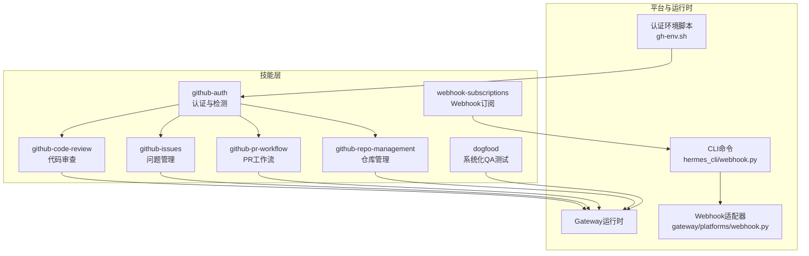
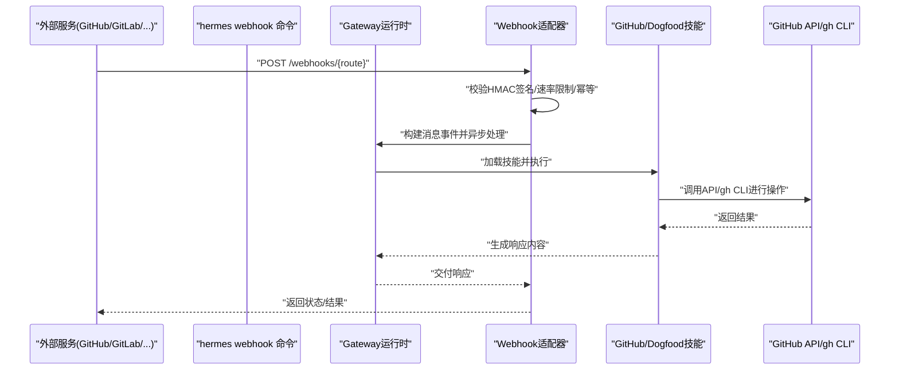
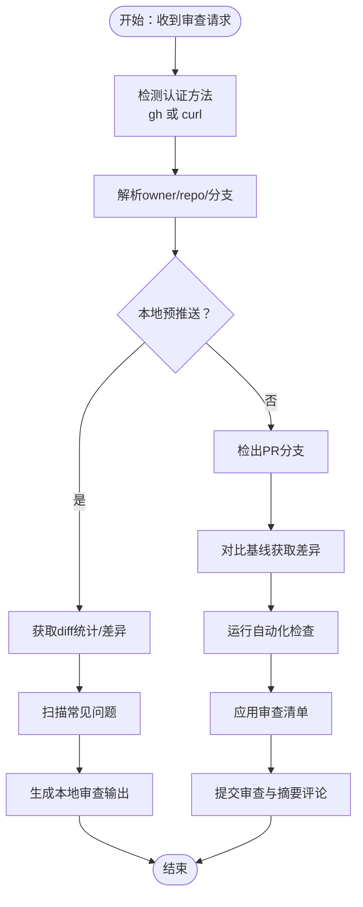
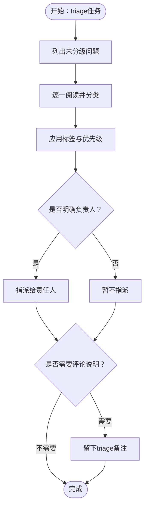
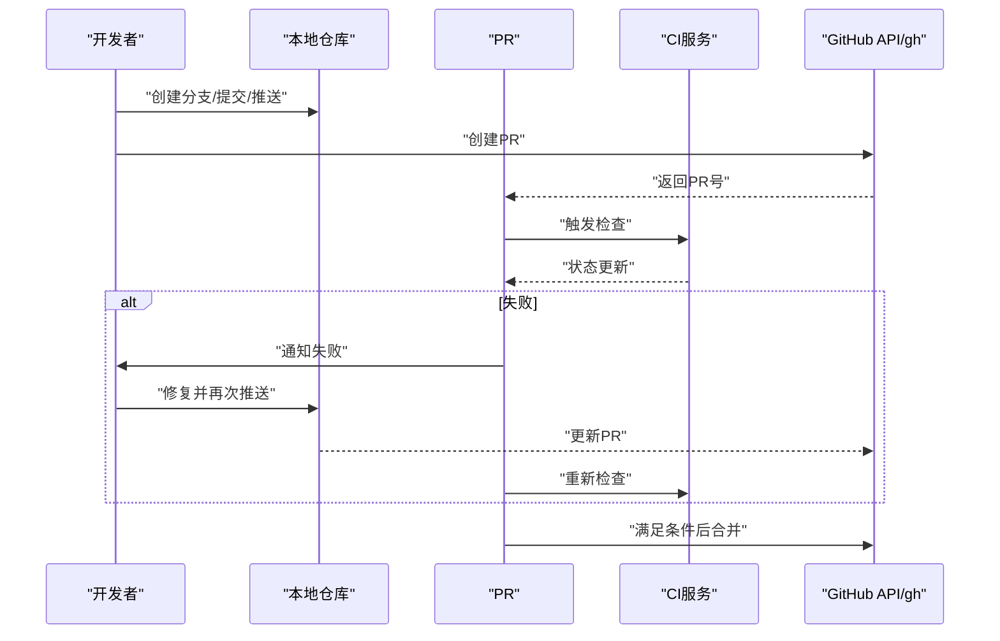
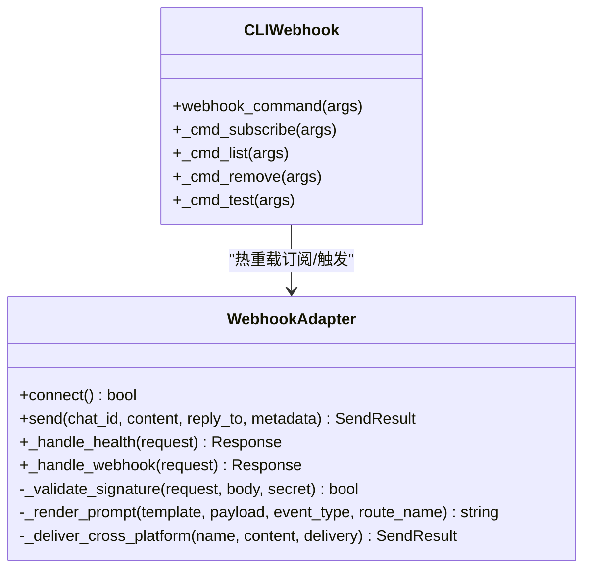
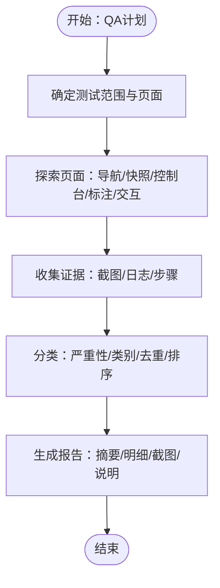
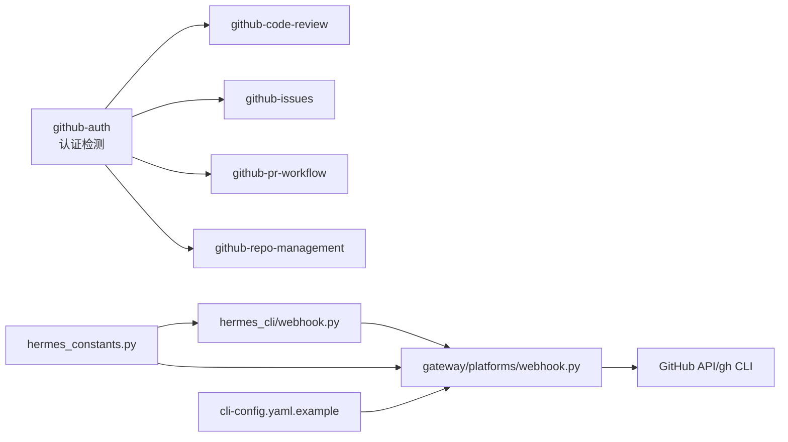

# 开发工具类

<cite>
**本文引用的文件**
- [SKILL.md](file://skills/github/github-code-review/SKILL.md)
- [SKILL.md](file://skills/github/github-issues/SKILL.md)
- [SKILL.md](file://skills/github/github-pr-workflow/SKILL.md)
- [SKILL.md](file://skills/devops/webhook-subscriptions/SKILL.md)
- [SKILL.md](file://skills/dogfood/SKILL.md)
- [webhook.py](file://gateway/platforms/webhook.py)
- [webhook.py](file://hermes_cli/webhook.py)
- [gh-env.sh](file://skills/github/github-auth/scripts/gh-env.sh)
- [SKILL.md](file://skills/github/github-auth/SKILL.md)
- [SKILL.md](file://skills/github/github-repo-management/SKILL.md)
- [review-output-template.md](file://skills/github/github-code-review/references/review-output-template.md)
- [issue-taxonomy.md](file://skills/dogfood/references/issue-taxonomy.md)
- [cli-config.yaml.example](file://cli-config.yaml.example)
- [hermes_constants.py](file://hermes_constants.py)
</cite>

## 目录
1. [简介](#简介)
2. [项目结构](#项目结构)
3. [核心组件](#核心组件)
4. [架构总览](#架构总览)
5. [详细组件分析](#详细组件分析)
6. [依赖关系分析](#依赖关系分析)
7. [性能考虑](#性能考虑)
8. [故障排查指南](#故障排查指南)
9. [结论](#结论)
10. [附录](#附录)

## 简介
本文件面向Hermes Agent的开发工具类技能，系统化梳理三类关键能力：  
- GitHub集成技能：代码审查、问题管理、PR工作流  
- 开发运维技能：Webhook订阅与事件驱动自动化  
- 内部测试技能：Dogfood系统化Web应用QA测试  

文档覆盖每项技能的使用场景、前置条件、配置要点、实际应用案例、与开发流程的集成方式、参数与权限设置、安全注意事项，并给出技能组合策略与团队协作建议。

## 项目结构
围绕开发工具类技能，仓库中主要涉及以下目录与文件：
- 技能文档：skills/github/*、skills/devops/webhook-subscriptions/SKILL.md、skills/dogfood/SKILL.md
- 平台适配器：gateway/platforms/webhook.py
- CLI管理：hermes_cli/webhook.py
- 认证辅助：skills/github/github-auth/scripts/gh-env.sh
- 配置参考：cli-config.yaml.example
- 常量与路径：hermes_constants.py

图表来源
- [webhook.py:1-673](file://gateway/platforms/webhook.py#L1-L673)
- [webhook.py:1-260](file://hermes_cli/webhook.py#L1-L260)
- [gh-env.sh:1-67](file://skills/github/github-auth/scripts/gh-env.sh#L1-L67)

章节来源
- [SKILL.md:1-481](file://skills/github/github-code-review/SKILL.md#L1-L481)
- [SKILL.md:1-370](file://skills/github/github-issues/SKILL.md#L1-L370)
- [SKILL.md:1-367](file://skills/github/github-pr-workflow/SKILL.md#L1-L367)
- [SKILL.md:1-181](file://skills/devops/webhook-subscriptions/SKILL.md#L1-L181)
- [SKILL.md:1-162](file://skills/dogfood/SKILL.md#L1-L162)

## 核心组件
- GitHub集成技能族
  - github-auth：统一检测与选择gh或curl路径，自动解析token与用户/仓库上下文
  - github-code-review：本地预推送审查与PR审查，支持结构化输出模板
  - github-issues：问题创建、搜索、标签、指派、评论、关闭/重开、链接PR
  - github-pr-workflow：分支、提交、创建PR、监控CI、自动修复失败、合并
  - github-repo-management：克隆/创建/分叉/同步、仓库信息、设置、分支保护、密钥、发布、工作流、Gist
- Webhook订阅与事件驱动
  - webhook-subscriptions：动态订阅创建、列表、删除、测试；支持HMAC签名验证、速率限制、幂等
  - CLI命令：hermes webhook subscribe/list/remove/test
  - 平台适配器：aiohttp服务端，接收外部事件，触发Agent运行，回传响应到目标平台
- 内部测试技能
  - dogfood：系统化Web应用QA，按阶段收集证据、分类严重性与类别、生成结构化报告

章节来源
- [SKILL.md:1-247](file://skills/github/github-auth/SKILL.md#L1-L247)
- [SKILL.md:1-481](file://skills/github/github-code-review/SKILL.md#L1-L481)
- [SKILL.md:1-370](file://skills/github/github-issues/SKILL.md#L1-L370)
- [SKILL.md:1-367](file://skills/github/github-pr-workflow/SKILL.md#L1-L367)
- [SKILL.md:1-516](file://skills/github/github-repo-management/SKILL.md#L1-L516)
- [SKILL.md:1-181](file://skills/devops/webhook-subscriptions/SKILL.md#L1-L181)
- [webhook.py:1-673](file://gateway/platforms/webhook.py#L1-L673)
- [webhook.py:1-260](file://hermes_cli/webhook.py#L1-L260)
- [SKILL.md:1-162](file://skills/dogfood/SKILL.md#L1-L162)

## 架构总览
下图展示Webhook事件从外部服务到Hermes Agent的完整链路，以及与GitHub技能的协同：

图表来源
- [webhook.py:278-478](file://gateway/platforms/webhook.py#L278-L478)
- [webhook.py:114-260](file://hermes_cli/webhook.py#L114-L260)

章节来源
- [webhook.py:1-673](file://gateway/platforms/webhook.py#L1-L673)
- [webhook.py:1-260](file://hermes_cli/webhook.py#L1-L260)

## 详细组件分析

### GitHub代码审查技能（github-code-review）
- 使用场景
  - 本地预推送审查：快速定位潜在问题（调试语句、大文件、凭据模式、冲突标记）
  - PR审查：查看元数据、差异、文件级上下文，提交正式审查与总结评论
- 关键流程
  - 预推送：统计变更、逐文件审阅、检查常见问题、结构化输出
  - PR审查：检出PR分支、拉取差异、运行自动化检查、应用审查清单、提交审查与摘要评论
- 输出规范
  - 结构化输出模板：Critical/Warnings/Suggestions/Looks Good四段式
  - 决策标准：Approve/Changes Requested/Comment
- 与认证集成
  - 自动检测gh或curl路径，解析GITHUB_TOKEN，提取owner/repo
- 安全与权限
  - 需要repo写权限以提交审查与评论
  - 建议使用细粒度PAT并限定作用域

图表来源
- [SKILL.md:317-481](file://skills/github/github-code-review/SKILL.md#L317-L481)
- [gh-env.sh:15-67](file://skills/github/github-auth/scripts/gh-env.sh#L15-L67)

章节来源
- [SKILL.md:1-481](file://skills/github/github-code-review/SKILL.md#L1-L481)
- [review-output-template.md:1-75](file://skills/github/github-code-review/references/review-output-template.md#L1-L75)
- [gh-env.sh:1-67](file://skills/github/github-auth/scripts/gh-env.sh#L1-L67)

### GitHub问题管理技能（github-issues）
- 使用场景
  - 创建/搜索/列出/查看问题，添加/移除标签，指派人员，评论，关闭/重开，链接PR
  - 批量操作：基于标签批量关闭
- 工作流
  - triage流程：列出未分级问题、阅读与分类、应用标签与优先级、指派、必要时评论
- 与认证集成
  - 自动检测认证方法，解析用户与仓库上下文

图表来源
- [SKILL.md:300-328](file://skills/github/github-issues/SKILL.md#L300-L328)

章节来源
- [SKILL.md:1-370](file://skills/github/github-issues/SKILL.md#L1-L370)
- [gh-env.sh:1-67](file://skills/github/github-auth/scripts/gh-env.sh#L1-L67)

### GitHub PR工作流技能（github-pr-workflow）
- 使用场景
  - 分支创建、提交、推送、创建PR、监控CI、自动修复失败、合并
- 关键点
  - CI监控：结合gh checks与curl status/check-runs
  - 自动修复循环：诊断失败→读日志→修复→推送→再检查
  - 合并策略：squash/merge/rebase，可启用Auto-Merge（GraphQL）

图表来源
- [SKILL.md:151-311](file://skills/github/github-pr-workflow/SKILL.md#L151-L311)

章节来源
- [SKILL.md:1-367](file://skills/github/github-pr-workflow/SKILL.md#L1-L367)

### Webhook订阅技能（webhook-subscriptions）
- 使用场景
  - 将外部事件（GitHub/GitLab/Stripe/CI/监控）转化为Hermes Agent的自动触发
- 关键能力
  - 动态订阅：hermes webhook subscribe/list/remove/test
  - 签名验证：HMAC-SHA256（GitHub/GitLab/通用）
  - 路由与提示：支持事件过滤、模板渲染、技能注入
  - 交付：日志/跨平台（Telegram/Discord/…）/GitHub评论
- 安全与配置
  - 每个路由必须配置HMAC密钥；支持全局密钥
  - 速率限制、幂等窗口、最大请求体大小
  - 订阅持久化于~/.hermes/webhook_subscriptions.json

图表来源
- [webhook.py:64-673](file://gateway/platforms/webhook.py#L64-L673)
- [webhook.py:114-260](file://hermes_cli/webhook.py#L114-L260)

章节来源
- [SKILL.md:1-181](file://skills/devops/webhook-subscriptions/SKILL.md#L1-L181)
- [webhook.py:1-673](file://gateway/platforms/webhook.py#L1-L673)
- [webhook.py:1-260](file://hermes_cli/webhook.py#L1-L260)

### Dogfood系统化QA测试技能（dogfood）
- 使用场景
  - 对Web应用进行系统化探索式QA，发现缺陷、捕获证据、生成结构化报告
- 工作流
  - 计划：确定范围、构建站点地图
  - 探索：导航、快照、控制台检查、标注交互元素、系统性测试
  - 收集：截图、记录步骤、分类严重性与类别
  - 分类：去重、排序、统计
  - 报告：模板化输出，包含摘要、明细、截图引用、测试说明
- 工具参考
  - browser_navigate、browser_snapshot、browser_click、browser_type、browser_scroll、browser_back、browser_press、browser_vision、browser_console

图表来源
- [SKILL.md:29-137](file://skills/dogfood/SKILL.md#L29-L137)
- [issue-taxonomy.md:1-110](file://skills/dogfood/references/issue-taxonomy.md#L1-L110)

章节来源
- [SKILL.md:1-162](file://skills/dogfood/SKILL.md#L1-L162)
- [issue-taxonomy.md:1-110](file://skills/dogfood/references/issue-taxonomy.md#L1-L110)

## 依赖关系分析
- 认证与上下文
  - github-auth提供统一的认证检测与上下文解析（用户、owner/repo），被其他GitHub技能复用
- Webhook平台
  - hermes_cli/webhook.py负责动态订阅的创建/查询/删除/测试
  - gateway/platforms/webhook.py提供HTTP服务端、签名验证、路由与交付
- 配置与路径
  - hermes_constants.py提供HERMES_HOME、技能目录、环境文件等路径解析
  - cli-config.yaml.example提供模型、工具集、平台工具集等配置参考

图表来源
- [gh-env.sh:1-67](file://skills/github/github-auth/scripts/gh-env.sh#L1-L67)
- [webhook.py:1-260](file://hermes_cli/webhook.py#L1-L260)
- [webhook.py:1-673](file://gateway/platforms/webhook.py#L1-L673)
- [hermes_constants.py:1-295](file://hermes_constants.py#L1-L295)
- [cli-config.yaml.example:1-890](file://cli-config.yaml.example#L1-L890)

章节来源
- [gh-env.sh:1-67](file://skills/github/github-auth/scripts/gh-env.sh#L1-L67)
- [webhook.py:1-260](file://hermes_cli/webhook.py#L1-L260)
- [webhook.py:1-673](file://gateway/platforms/webhook.py#L1-L673)
- [hermes_constants.py:1-295](file://hermes_constants.py#L1-L295)
- [cli-config.yaml.example:1-890](file://cli-config.yaml.example#L1-L890)

## 性能考虑
- Webhook适配器
  - 端口冲突检测、速率限制（每路由每分钟计数）、请求体大小限制、幂等窗口（默认1小时）
  - 动态订阅热重载采用mtime门控，避免频繁磁盘IO
- GitHub操作
  - 优先使用gh以获得更丰富的API能力；在无gh环境下通过curl + PAT实现功能降级
  - PR审查前先检出分支，减少远程API往返
- Dogfood测试
  - 控制台检查应紧随导航与交互之后，避免遗漏静默JS错误
  - 截图与报告生成建议分批处理，避免一次性生成过多媒体文件

[本节为通用指导，无需特定文件引用]

## 故障排查指南
- Webhook
  - 确认网关已启动且监听端口可用；健康检查URL可达
  - 核对HMAC密钥与签名头（GitHub使用X-Hub-Signature-256，GitLab使用X-Gitlab-Token）
  - 查看网关日志中的最近webhook条目，定位重复投递与幂等处理
  - 如需本地联调，使用内网穿透工具暴露本地端口
- GitHub认证
  - 若git push仍提示密码错误，确认使用PAT而非账户密码；确保token具备repo作用域
  - 多账户场景下，使用SSH别名或每仓库URL嵌入token
  - gh未安装时，确保GITHUB_TOKEN环境变量或~/.git-credentials中存在有效token
- Dogfood测试
  - 若浏览器工具不可用，检查所需API密钥与网络连通性
  - 控制台出现大量警告/错误时，优先修复影响核心功能的问题

章节来源
- [SKILL.md:171-181](file://skills/devops/webhook-subscriptions/SKILL.md#L171-L181)
- [SKILL.md:236-247](file://skills/github/github-auth/SKILL.md#L236-L247)
- [webhook.py:111-153](file://gateway/platforms/webhook.py#L111-L153)

## 结论
上述开发工具类技能将GitHub工程管理、Webhook事件驱动与系统化QA测试有机整合，形成从“发现问题—自动触发—执行处理—反馈闭环”的完整流水线。通过合理的认证与权限配置、严格的签名与安全策略、以及结构化的输出与报告模板，团队可在不同规模与复杂度的项目中稳定落地这些能力，并在CI/CD与日常协作中持续提升质量与效率。

[本节为总结性内容，无需特定文件引用]

## 附录

### 技能组合策略与团队协作
- 组合策略
  - 代码审查：在PR创建后自动触发github-code-review，生成摘要评论；随后由reviewer进行人工复核
  - 问题管理：使用github-issues进行需求/缺陷的统一入口，配合标签与优先级进行triage
  - PR工作流：在PR创建后自动监控CI，失败时自动修复循环，成功后再进行合并
  - Webhook：将GitHub/GitLab/CI/监控事件转化为Agent触发，实现跨系统的自动化联动
  - Dogfood：在发布前进行系统化QA，产出结构化报告，作为发布决策依据
- 团队协作
  - 明确角色分工：开发者负责实现与修复，Reviewer负责质量把关，QA负责验收测试
  - 统一规范：遵循审查清单、问题分类与严重性分级、报告模板
  - 可视化与审计：通过GitHub评论、Webhook日志与Agent轨迹日志，保留可追溯的协作证据

章节来源
- [SKILL.md:279-281](file://skills/github/github-code-review/SKILL.md#L279-L281)
- [SKILL.md:265-275](file://skills/github/github-pr-workflow/SKILL.md#L265-L275)
- [issue-taxonomy.md:1-110](file://skills/dogfood/references/issue-taxonomy.md#L1-L110)