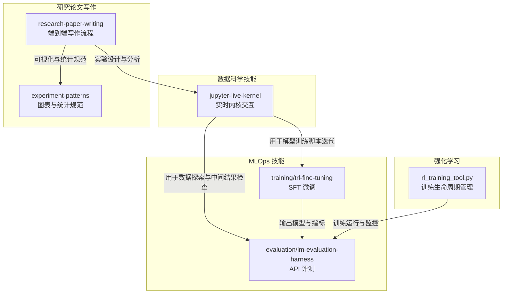
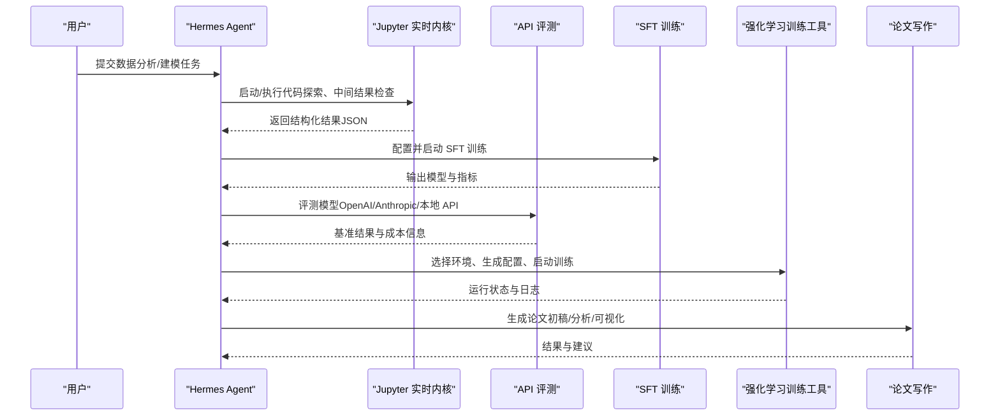
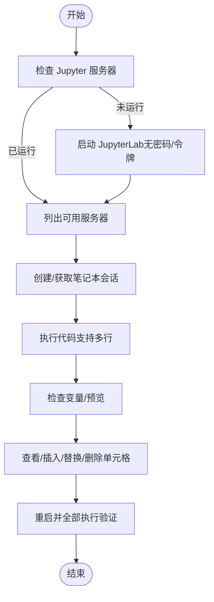
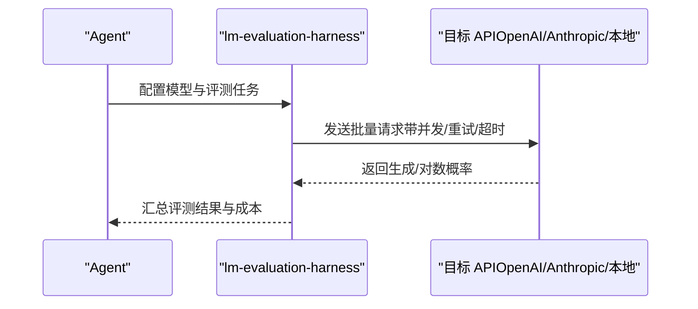
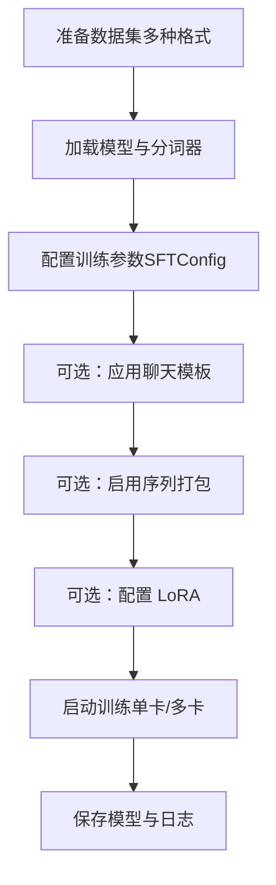
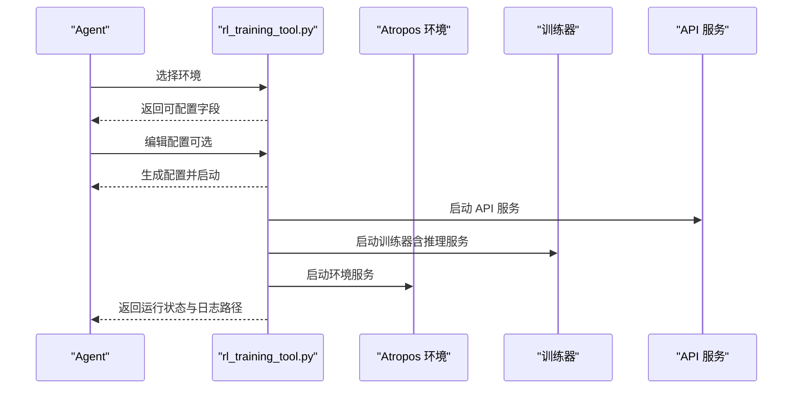
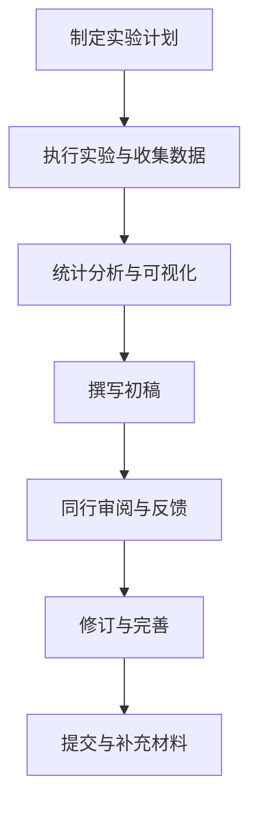
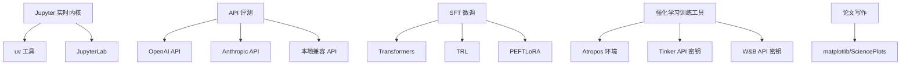

# 数据科学与分析类

<cite>
**本文引用的文件**
- [skills/data-science/DESCRIPTION.md](file://skills/data-science/DESCRIPTION.md)
- [skills/data-science/jupyter-live-kernel/SKILL.md](file://skills/data-science/jupyter-live-kernel/SKILL.md)
- [skills/mlops/evaluation/lm-evaluation-harness/references/api-evaluation.md](file://skills/mlops/evaluation/lm-evaluation-harness/references/api-evaluation.md)
- [skills/mlops/training/trl-fine-tuning/references/sft-training.md](file://skills/mlops/training/trl-fine-tuning/references/sft-training.md)
- [tools/rl_training_tool.py](file://tools/rl_training_tool.py)
- [skills/research/research-paper-writing/SKILL.md](file://skills/research/research-paper-writing/SKILL.md)
- [skills/research/research-paper-writing/references/experiment-patterns.md](file://skills/research/research-paper-writing/references/experiment-patterns.md)
</cite>

## 目录
1. [简介](#简介)
2. [项目结构](#项目结构)
3. [核心组件](#核心组件)
4. [架构总览](#架构总览)
5. [详细组件分析](#详细组件分析)
6. [依赖分析](#依赖分析)
7. [性能考虑](#性能考虑)
8. [故障排查指南](#故障排查指南)
9. [结论](#结论)
10. [附录](#附录)

## 简介
本技术文档面向 Hermes Agent 的数据科学与分析类技能，系统梳理并解释以下能力：
- Jupyter 笔记本实时内核：支持状态化、迭代式 Python 执行，适合探索性数据分析、中间结果检查与复杂代码逐步构建。
- 机器学习模型训练与评估：覆盖 SFT（监督微调）与 API 模型评估，支持多平台与多并发策略，便于基准评测与成本控制。
- 研究论文写作辅助：从实验设计到分析、撰写、修订与提交的全流程，覆盖主流会议（NeurIPS、ICML、ACL 等），并提供可视化与统计分析指导。

文档将从系统架构、组件关系、数据流与处理逻辑、集成点与错误处理、性能特性等方面进行深入解析，并提供可操作的使用步骤、依赖与配置要求、优化建议以及与其他数据科学工具的最佳实践。

## 项目结构
围绕数据科学与分析主题，相关模块主要分布在以下位置：
- 数据科学技能目录：skills/data-science
  - jupyter-live-kernel：Jupyter 实时内核交互式执行
- MLOps 技能目录：skills/mlops
  - evaluation：API 模型评估与基准测试
  - training：TRL 微调与 SFT 训练
- 强化学习训练工具：tools/rl_training_tool.py
- 研究论文写作：skills/research/research-paper-writing 及其参考材料

**图示来源**
- [skills/data-science/jupyter-live-kernel/SKILL.md](file://skills/data-science/jupyter-live-kernel/SKILL.md)
- [skills/mlops/evaluation/lm-evaluation-harness/references/api-evaluation.md](file://skills/mlops/evaluation/lm-evaluation-harness/references/api-evaluation.md)
- [skills/mlops/training/trl-fine-tuning/references/sft-training.md](file://skills/mlops/training/trl-fine-tuning/references/sft-training.md)
- [tools/rl_training_tool.py](file://tools/rl_training_tool.py)
- [skills/research/research-paper-writing/SKILL.md](file://skills/research/research-paper-writing/SKILL.md)
- [skills/research/research-paper-writing/references/experiment-patterns.md](file://skills/research/research-paper-writing/references/experiment-patterns.md)

**章节来源**
- [skills/data-science/DESCRIPTION.md](file://skills/data-science/DESCRIPTION.md)
- [skills/data-science/jupyter-live-kernel/SKILL.md](file://skills/data-science/jupyter-live-kernel/SKILL.md)

## 核心组件
- Jupyter 实时内核（hamelnb）
  - 提供状态化 Python REPL，变量在多次执行间持久化；适合探索性分析、API 探索、逐步构建复杂代码。
  - 通过 CLI 对 Jupyter REST API 发起命令，返回结构化 JSON，支持服务器发现、笔记本操作、变量检查与单元格编辑。
- API 模型评估（lm-evaluation-harness）
  - 支持 OpenAI、Anthropic 与本地兼容 API 的统一评测接口；提供并发控制、重试、超时、缓存与成本估算等最佳实践。
- SFT 微调（TRL + Transformers）
  - 提供监督微调的完整流程：数据格式、配置、打包加速、多卡训练、LoRA 微调与超参建议。
- 强化学习训练工具（rl_training_tool.py）
  - 自动扫描 Atropos 环境、生成配置、启动三进程训练流水线（API 服务、训练器、环境），并提供监控与停止能力。
- 研究论文写作（research-paper-writing）
  - 覆盖实验设计、执行、监控、分析、撰写、审阅、修订与提交的全生命周期，提供可视化与统计分析规范。

**章节来源**
- [skills/data-science/jupyter-live-kernel/SKILL.md](file://skills/data-science/jupyter-live-kernel/SKILL.md)
- [skills/mlops/evaluation/lm-evaluation-harness/references/api-evaluation.md](file://skills/mlops/evaluation/lm-evaluation-harness/references/api-evaluation.md)
- [skills/mlops/training/trl-fine-tuning/references/sft-training.md](file://skills/mlops/training/trl-fine-tuning/references/sft-training.md)
- [tools/rl_training_tool.py](file://tools/rl_training_tool.py)
- [skills/research/research-paper-writing/SKILL.md](file://skills/research/research-paper-writing/SKILL.md)

## 架构总览
下图展示数据科学与分析类技能在端到端工作流中的交互关系与数据流：

**图示来源**
- [skills/data-science/jupyter-live-kernel/SKILL.md](file://skills/data-science/jupyter-live-kernel/SKILL.md)
- [skills/mlops/evaluation/lm-evaluation-harness/references/api-evaluation.md](file://skills/mlops/evaluation/lm-evaluation-harness/references/api-evaluation.md)
- [skills/mlops/training/trl-fine-tuning/references/sft-training.md](file://skills/mlops/training/trl-fine-tuning/references/sft-training.md)
- [tools/rl_training_tool.py](file://tools/rl_training_tool.py)
- [skills/research/research-paper-writing/SKILL.md](file://skills/research/research-paper-writing/SKILL.md)

## 详细组件分析

### Jupyter 实时内核（hamelnb）
- 适用场景
  - 数据探索与中间结果检查
  - API 探索与原型验证
  - 复杂代码逐步构建与迭代
- 关键能力
  - 服务器与笔记本发现
  - 代码执行（支持多行与状态持久化）
  - 变量列表与预览
  - 单元格内容查看、插入、替换与删除
  - 重启并全部执行以验证
- 使用要点
  - 首次执行可能因内核初始化而超时，建议重试
  - 内核 Python 环境需预先安装所需包
  - 使用紧凑模式减少令牌消耗
  - 若会话不存在，需先通过 REST API 创建会话

**图示来源**
- [skills/data-science/jupyter-live-kernel/SKILL.md](file://skills/data-science/jupyter-live-kernel/SKILL.md)

**章节来源**
- [skills/data-science/jupyter-live-kernel/SKILL.md](file://skills/data-science/jupyter-live-kernel/SKILL.md)

### API 模型评估（lm-evaluation-harness）
- 适用场景
  - 对比不同模型（OpenAI、Anthropic、本地 API）的基准表现
  - 控制并发与超时，降低评测成本
  - 缓存与复现实验结果
- 关键能力
  - 统一模板接口（TemplateAPI）
  - 并发请求、重试与超时控制
  - 成本估算与预算策略
  - 结果比较与报告
- 最佳实践
  - 先用小样本测试，再扩大评测规模
  - 设置确定性采样参数以复现
  - 合理设置并发与超时，避免触发限流
  - 使用缓存避免重复调用

**图示来源**
- [skills/mlops/evaluation/lm-evaluation-harness/references/api-evaluation.md](file://skills/mlops/evaluation/lm-evaluation-harness/references/api-evaluation.md)

**章节来源**
- [skills/mlops/evaluation/lm-evaluation-harness/references/api-evaluation.md](file://skills/mlops/evaluation/lm-evaluation-harness/references/api-evaluation.md)

### SFT 微调（TRL + Transformers）
- 适用场景
  - 指令遵循、任务特定微调、聊天机器人训练与领域适配
- 关键能力
  - 多种数据格式（Prompt-Completion、对话、纯文本）
  - 自动应用聊天模板或手动映射
  - 序列打包提升 GPU 利用率
  - 多卡训练与梯度累积
  - LoRA 微调参数配置
- 超参与建议
  - 不同模型规模对应不同的学习率、批次大小与轮数
  - 使用打包以获得 2-3 倍训练速度提升

**图示来源**
- [skills/mlops/training/trl-fine-tuning/references/sft-training.md](file://skills/mlops/training/trl-fine-tuning/references/sft-training.md)

**章节来源**
- [skills/mlops/training/trl-fine-tuning/references/sft-training.md](file://skills/mlops/training/trl-fine-tuning/references/sft-training.md)

### 强化学习训练工具（rl_training_tool.py）
- 适用场景
  - 在本地或受控环境中启动与监控强化学习训练流水线
- 关键能力
  - 自动扫描 Atropos 环境，提取配置字段
  - 生成运行配置，锁定基础设施参数
  - 启动三进程训练流水线（API 服务、训练器、环境）
  - 后台监控与异常处理，支持停止与清理
- 使用流程
  - 列出并选择环境
  - 查看/编辑可配置字段（锁定字段不可更改）
  - 生成配置并启动训练
  - 定期检查状态，必要时停止

**图示来源**
- [tools/rl_training_tool.py](file://tools/rl_training_tool.py)

**章节来源**
- [tools/rl_training_tool.py](file://tools/rl_training_tool.py)

### 研究论文写作辅助（research-paper-writing）
- 适用场景
  - 从实验设计到分析、撰写、审阅、修订与提交的全流程自动化与规范化
  - 针对 NeurIPS、ICML、ACL 等会议的结构化写作与补充材料准备
- 关键能力
  - 端到端写作流程（实验设计、执行、监控、分析、撰写、审阅、修订、提交）
  - 图表与统计分析规范（字体、字号、颜色、尺寸、网格等）
  - 数据集与模型卡片（Datasheets、Model Cards）模板
- 使用建议
  - 明确论文类型（正交/复制/消融等），按结构化模板推进
  - 严格遵循会议格式与字数限制
  - 使用色觉无障碍配色与标准图尺寸

**图示来源**
- [skills/research/research-paper-writing/SKILL.md](file://skills/research/research-paper-writing/SKILL.md)
- [skills/research/research-paper-writing/references/experiment-patterns.md](file://skills/research/research-paper-writing/references/experiment-patterns.md)

**章节来源**
- [skills/research/research-paper-writing/SKILL.md](file://skills/research/research-paper-writing/SKILL.md)
- [skills/research/research-paper-writing/references/experiment-patterns.md](file://skills/research/research-paper-writing/references/experiment-patterns.md)

## 依赖分析
- Jupyter 实时内核
  - 依赖：uv、JupyterLab、本地 Jupyter 服务器（无密码/令牌）
  - 通过 REST API 与 hamelnb 脚本交互，返回结构化 JSON
- API 模型评估
  - 依赖：OpenAI/Anthropic API 密钥、网络连通性
  - 支持并发与缓存，注意速率限制与超时
- SFT 微调
  - 依赖：Transformers、TRFL、Datasets、PEFT（LoRA）
  - 支持多卡与打包，注意批次大小与序列长度
- 强化学习训练工具
  - 依赖：Atropos 环境子模块、Tinker API 密钥、W&B API 密钥
  - 锁定基础设施参数，仅允许修改非锁定字段
- 研究论文写作
  - 依赖：matplotlib、SciencePlots 等绘图库
  - 遵循会议格式与统计规范，提供模板与参考

**图示来源**
- [skills/data-science/jupyter-live-kernel/SKILL.md](file://skills/data-science/jupyter-live-kernel/SKILL.md)
- [skills/mlops/evaluation/lm-evaluation-harness/references/api-evaluation.md](file://skills/mlops/evaluation/lm-evaluation-harness/references/api-evaluation.md)
- [skills/mlops/training/trl-fine-tuning/references/sft-training.md](file://skills/mlops/training/trl-fine-tuning/references/sft-training.md)
- [tools/rl_training_tool.py](file://tools/rl_training_tool.py)
- [skills/research/research-paper-writing/references/experiment-patterns.md](file://skills/research/research-paper-writing/references/experiment-patterns.md)

**章节来源**
- [skills/data-science/jupyter-live-kernel/SKILL.md](file://skills/data-science/jupyter-live-kernel/SKILL.md)
- [skills/mlops/evaluation/lm-evaluation-harness/references/api-evaluation.md](file://skills/mlops/evaluation/lm-evaluation-harness/references/api-evaluation.md)
- [skills/mlops/training/trl-fine-tuning/references/sft-training.md](file://skills/mlops/training/trl-fine-tuning/references/sft-training.md)
- [tools/rl_training_tool.py](file://tools/rl_training_tool.py)
- [skills/research/research-paper-writing/references/experiment-patterns.md](file://skills/research/research-paper-writing/references/experiment-patterns.md)

## 性能考虑
- Jupyter 实时内核
  - 首次执行可能超时，建议重试；使用紧凑模式减少输出体积
  - 内核 Python 环境需提前安装所需包，避免执行阶段安装导致延迟
- API 模型评估
  - 合理设置并发与超时，避免触发限流；使用缓存减少重复调用
  - 成本敏感任务先用小样本测试，再扩大评测规模
- SFT 微调
  - 启用序列打包以提升 GPU 利用率；根据模型规模调整学习率与批次大小
  - 多卡训练时注意梯度累积步数与内存占用
- 强化学习训练
  - 启动顺序与等待时间：API 服务 → 训练器（推理服务） → 环境；后台定期检查进程状态
  - 锁定基础设施参数，确保稳定与可复现
- 研究论文写作
  - 统一图表风格与尺寸，使用色觉无障碍配色；遵循会议格式与字数限制

[本节为通用性能建议，不直接分析具体文件]

## 故障排查指南
- Jupyter 实时内核
  - 服务器未运行：先启动 JupyterLab，确认端口与无密码/令牌访问
  - 会话不存在：通过 REST API 创建会话后再执行代码
  - 首次执行超时：稍后重试，等待内核初始化完成
  - 变量/报错：使用变量检查与错误 JSON 字段定位问题
- API 模型评估
  - 认证失败：检查 API 密钥是否正确导出
  - 速率限制：降低并发或增加请求间隔
  - 超时：增大超时时间；检查网络连通性
  - 模型不存在：确认本地 API 服务已启动并返回可用模型列表
- SFT 微调
  - 数据格式不匹配：确保采用支持的格式（Prompt-Completion、对话、纯文本）
  - 打包与序列长度：合理设置最大序列长度与数据字段
  - 多卡训练：检查设备数量与显存占用，适当调整批次大小
- 强化学习训练
  - 环境/训练器/API 任一进程退出：查看对应日志文件，定位错误码
  - 配置锁定字段：仅可修改非锁定字段，避免误改基础设施参数
- 研究论文写作
  - 图表质量：检查 DPI、边距与网格设置；使用色觉无障碍配色
  - 会议格式：对照会议官网格式要求，逐项核对补充材料

**章节来源**
- [skills/data-science/jupyter-live-kernel/SKILL.md](file://skills/data-science/jupyter-live-kernel/SKILL.md)
- [skills/mlops/evaluation/lm-evaluation-harness/references/api-evaluation.md](file://skills/mlops/evaluation/lm-evaluation-harness/references/api-evaluation.md)
- [skills/mlops/training/trl-fine-tuning/references/sft-training.md](file://skills/mlops/training/trl-fine-tuning/references/sft-training.md)
- [tools/rl_training_tool.py](file://tools/rl_training_tool.py)
- [skills/research/research-paper-writing/references/experiment-patterns.md](file://skills/research/research-paper-writing/references/experiment-patterns.md)

## 结论
Hermes Agent 的数据科学与分析类技能通过“实时内核 + 评测 + 微调 + 训练 + 写作”的闭环，覆盖了从探索、建模、评估到论文产出的全流程。各组件职责清晰、耦合度低，既可独立使用，也可组合协作。结合稳健的配置管理、并发与缓存策略、以及严格的可视化与统计规范，能够显著提升数据科学工作的效率与质量。

[本节为总结性内容，不直接分析具体文件]

## 附录
- 使用步骤速查
  - Jupyter 实时内核：启动服务器 → 创建会话 → 执行代码 → 检查变量/编辑单元格 → 验证运行
  - API 模型评估：导出密钥 → 配置并发/超时/缓存 → 运行评测 → 比较结果
  - SFT 微调：准备数据 → 加载模型 → 配置参数 → 可选打包/LoRA → 启动训练
  - 强化学习训练：选择环境 → 查看/编辑配置 → 生成配置 → 启动训练 → 监控状态
  - 研究论文写作：制定计划 → 执行实验 → 分析与可视化 → 撰写初稿 → 审阅修订 → 提交
- 最佳实践
  - 探索优先使用 Jupyter 实时内核，逐步构建复杂逻辑
  - 评测阶段先小规模测试，再扩大范围；合理设置并发与超时
  - 微调阶段根据模型规模与硬件条件选择合适的超参与打包策略
  - 强化学习训练保持稳定的启动顺序与日志监控
  - 论文写作严格遵循会议格式与统计规范，使用标准化图表与配色

[本节为通用实践建议，不直接分析具体文件]