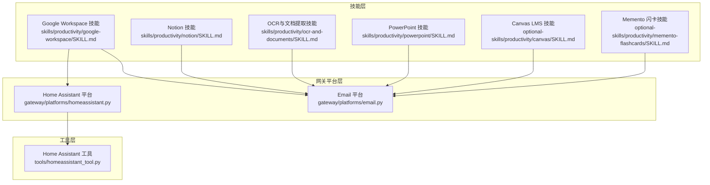
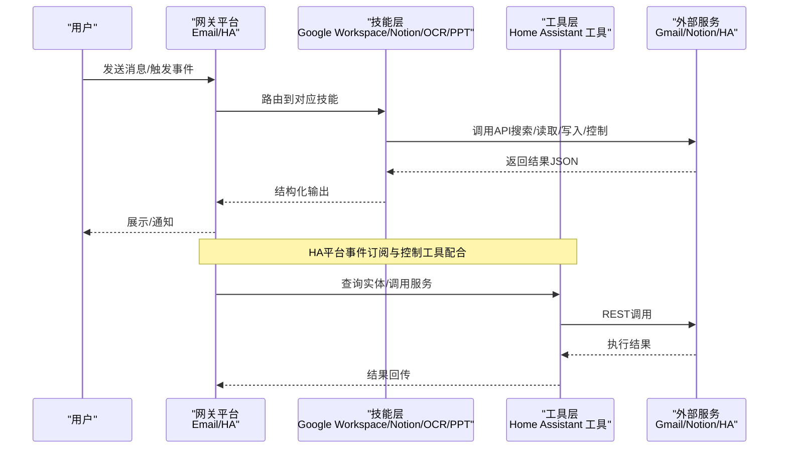
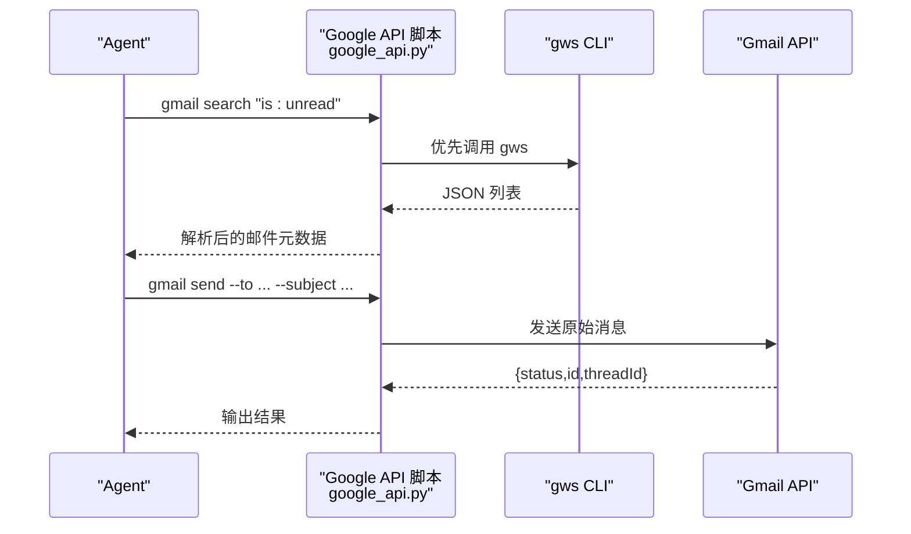
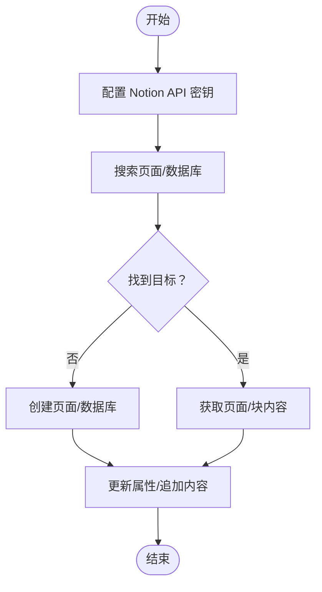
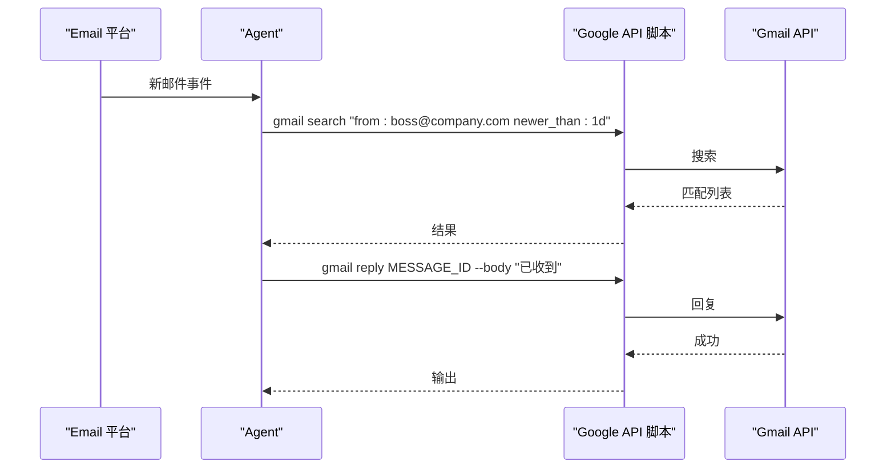
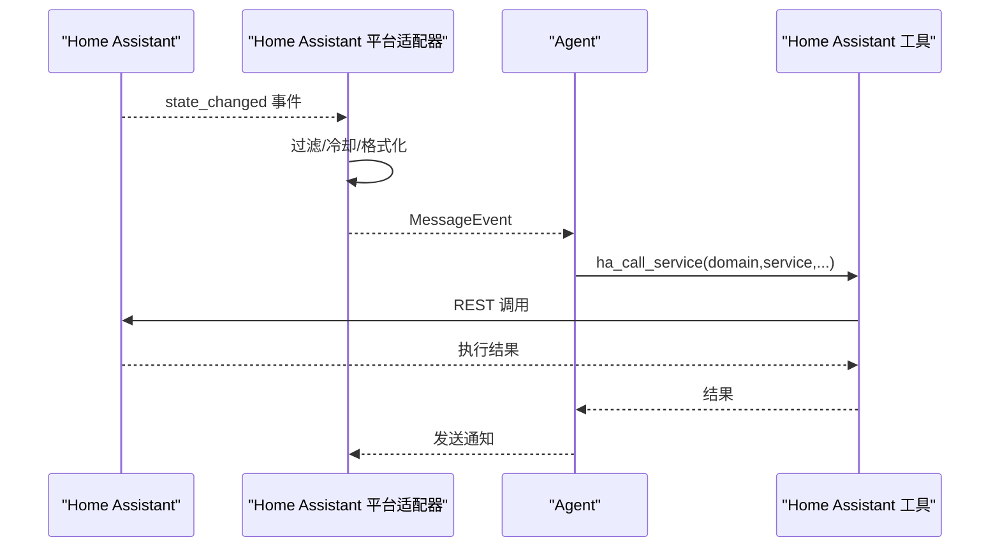
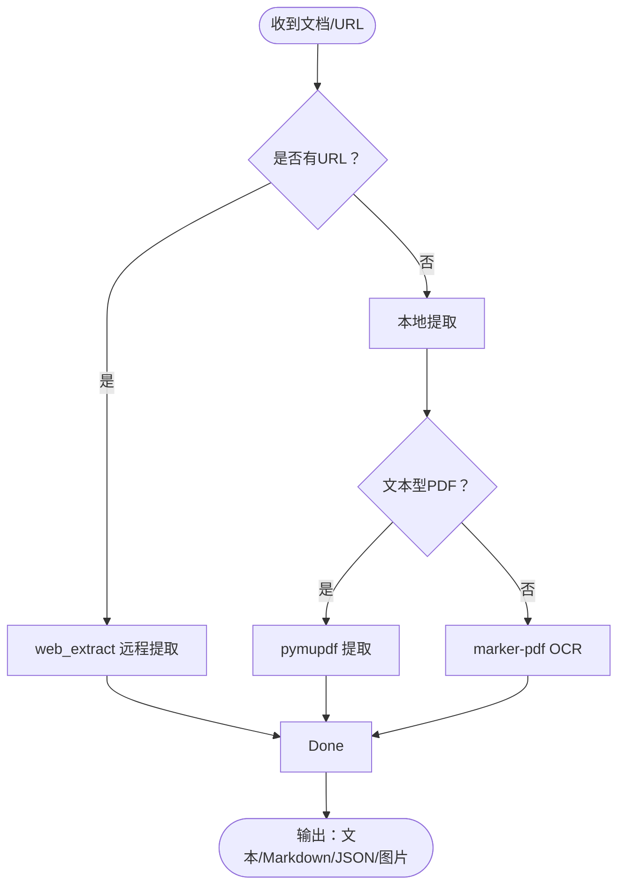
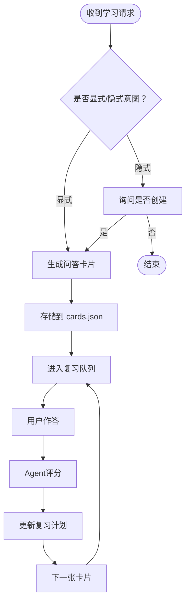
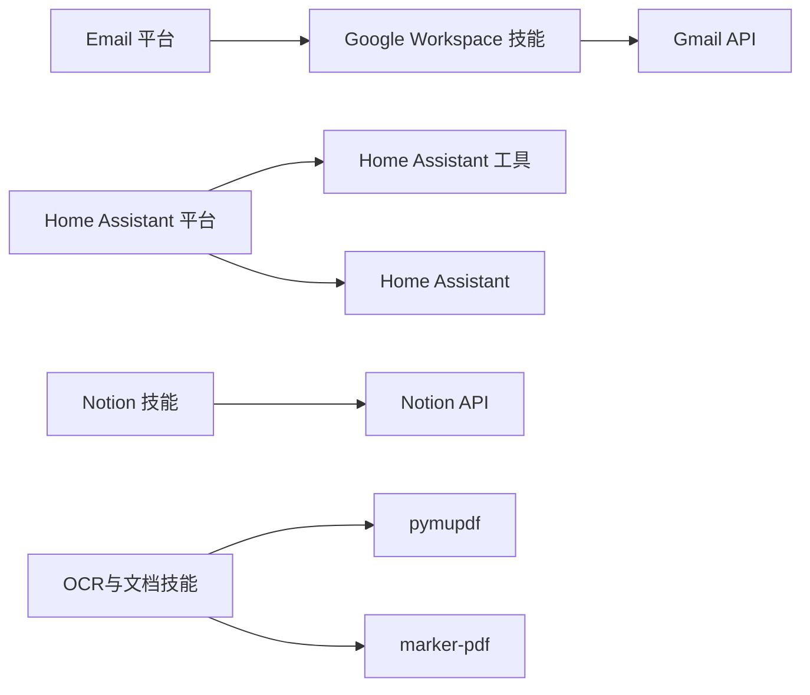

# 生产力与自动化类

<cite>
**本文引用的文件**
- [README.md](file://README.md)
- [skills/productivity/google-workspace/SKILL.md](file://skills/productivity/google-workspace/SKILL.md)
- [skills/productivity/notion/SKILL.md](file://skills/productivity/notion/SKILL.md)
- [skills/productivity/ocr-and-documents/SKILL.md](file://skills/productivity/ocr-and-documents/SKILL.md)
- [skills/productivity/powerpoint/SKILL.md](file://skills/productivity/powerpoint/SKILL.md)
- [optional-skills/productivity/canvas/SKILL.md](file://optional-skills/productivity/canvas/SKILL.md)
- [optional-skills/productivity/memento-flashcards/SKILL.md](file://optional-skills/productivity/memento-flashcards/SKILL.md)
- [gateway/platforms/homeassistant.py](file://gateway/platforms/homeassistant.py)
- [tools/homeassistant_tool.py](file://tools/homeassistant_tool.py)
- [gateway/platforms/email.py](file://gateway/platforms/email.py)
- [skills/productivity/google-workspace/scripts/google_api.py](file://skills/productivity/google-workspace/scripts/google_api.py)
</cite>

## 目录
1. [简介](#简介)
2. [项目结构](#项目结构)
3. [核心组件](#核心组件)
4. [架构总览](#架构总览)
5. [详细组件分析](#详细组件分析)
6. [依赖关系分析](#依赖关系分析)
7. [性能考虑](#性能考虑)
8. [故障排查指南](#故障排查指南)
9. [结论](#结论)
10. [附录](#附录)

## 简介
本指南聚焦于Hermes Agent在“生产力与自动化”领域的实用技能，围绕以下目标展开：提升工作效率、简化日常流程、实现跨平台协同与自动化。重点覆盖如下能力：
- Google Workspace集成（Gmail/日历/文档/表格/联系人）
- Notion笔记与数据库管理
- 邮件自动化（发送/回复/标签/搜索）
- 智能家居控制（Home Assistant事件监听与远程控制）
- 文档与研究资料处理（OCR/PDF/DOCX/PPTX）
- 学习与记忆系统（闪卡与测验）

通过明确的配置步骤、使用场景、自动化脚本示例与批量处理技巧，帮助你在不同平台上高效落地这些技能，并结合现有工作流进行无缝集成。

## 项目结构
Hermes Agent采用模块化设计，核心由“网关平台层”“工具层”“技能层”构成。与生产力相关的能力主要分布在：
- 技能层：skills/productivity 与 optional-skills/productivity 下的各技能包
- 工具层：tools/ 下的通用工具（如 Home Assistant 控制工具）
- 网关平台层：gateway/platforms/ 下的平台适配器（如 Home Assistant、Email）

图表来源
- [gateway/platforms/homeassistant.py:51-450](file://gateway/platforms/homeassistant.py#L51-L450)
- [tools/homeassistant_tool.py:1-39](file://tools/homeassistant_tool.py#L1-L39)
- [gateway/platforms/email.py:45-65](file://gateway/platforms/email.py#L45-L65)
- [skills/productivity/google-workspace/SKILL.md:1-280](file://skills/productivity/google-workspace/SKILL.md#L1-L280)
- [skills/productivity/notion/SKILL.md:1-172](file://skills/productivity/notion/SKILL.md#L1-L172)
- [skills/productivity/ocr-and-documents/SKILL.md:1-172](file://skills/productivity/ocr-and-documents/SKILL.md#L1-L172)
- [skills/productivity/powerpoint/SKILL.md:1-233](file://skills/productivity/powerpoint/SKILL.md#L1-L233)
- [optional-skills/productivity/canvas/SKILL.md:1-98](file://optional-skills/productivity/canvas/SKILL.md#L1-L98)
- [optional-skills/productivity/memento-flashcards/SKILL.md:1-325](file://optional-skills/productivity/memento-flashcards/SKILL.md#L1-L325)

章节来源
- [README.md:1-179](file://README.md#L1-L179)

## 核心组件
- Google Workspace 技能：提供Gmail/GSuite全栈API封装，支持OAuth2授权、CLI优先与Python客户端回退、搜索/读取/发送/回复/标签、日历/驱动/联系人/表格/文档操作。
- Notion 技能：基于curl的Notion API调用，支持搜索、读取页面/块、创建页面/数据库、查询数据库、更新属性、添加内容。
- 邮件自动化：通过Email平台与Google Workspace技能配合，实现自动发送/回复、标签管理、批量处理与规则化流程。
- 智能家居控制：Home Assistant平台适配器实时订阅状态变更事件；工具层提供实体查询、服务调用等控制能力。
- 文档与研究：OCR与文档提取技能支持远程URL直提、pymupdf轻量提取、marker-pdf高精度OCR与复杂布局解析；PowerPoint技能支持从模板/脚本创建、编辑、渲染与质量检查。
- 学习与记忆：Memento闪卡技能提供间隔重复、自由文本答题评分、YouTube转录测验生成、卡片导出导入与统计。

章节来源
- [skills/productivity/google-workspace/SKILL.md:1-280](file://skills/productivity/google-workspace/SKILL.md#L1-L280)
- [skills/productivity/notion/SKILL.md:1-172](file://skills/productivity/notion/SKILL.md#L1-L172)
- [gateway/platforms/email.py:45-65](file://gateway/platforms/email.py#L45-L65)
- [gateway/platforms/homeassistant.py:51-450](file://gateway/platforms/homeassistant.py#L51-L450)
- [tools/homeassistant_tool.py:1-39](file://tools/homeassistant_tool.py#L1-L39)
- [skills/productivity/ocr-and-documents/SKILL.md:1-172](file://skills/productivity/ocr-and-documents/SKILL.md#L1-L172)
- [skills/productivity/powerpoint/SKILL.md:1-233](file://skills/productivity/powerpoint/SKILL.md#L1-L233)
- [optional-skills/productivity/memento-flashcards/SKILL.md:1-325](file://optional-skills/productivity/memento-flashcards/SKILL.md#L1-L325)

## 架构总览
下图展示从用户输入到具体执行的端到端路径，以及关键组件之间的交互关系。

图表来源
- [gateway/platforms/email.py:45-65](file://gateway/platforms/email.py#L45-L65)
- [gateway/platforms/homeassistant.py:51-450](file://gateway/platforms/homeassistant.py#L51-L450)
- [tools/homeassistant_tool.py:1-39](file://tools/homeassistant_tool.py#L1-L39)
- [skills/productivity/google-workspace/SKILL.md:1-280](file://skills/productivity/google-workspace/SKILL.md#L1-L280)
- [skills/productivity/notion/SKILL.md:1-172](file://skills/productivity/notion/SKILL.md#L1-L172)

## 详细组件分析

### Google Workspace 集成（Gmail/日历/文档/表格/联系人）
- 授权与配置
  - 使用Hermes托管OAuth2流程，支持窄化作用域（仅邮箱/日历/驱动/表格/文档），避免过度授权。
  - 支持gws CLI优先与Python客户端回退，统一输出格式。
- 常用命令
  - 邮件搜索/读取/发送/回复/标签管理
  - 日历列表/创建/删除
  - 驱动搜索
  - 联系人列表
  - 表格读取/更新/追加
  - 文档读取
- 自动化脚本示例思路
  - 批量归档/标记：先搜索未读邮件，再逐条修改标签，最后汇总统计。
  - 日程同步：定时拉取日历事件，按模板生成摘要并通过邮件或IM通知。
  - 数据联动：从表格读取任务清单，自动生成邮件提醒或日历事件。
- 多平台同步与隐私
  - 使用本地令牌文件与自动刷新，避免长期密钥泄露风险。
  - 通过服务集限制权限范围，最小化授权面。
- 个性化与扩展
  - 可根据团队邮箱别名定制From头，实现多角色代理发送。
  - 结合Email平台过滤器，自动识别并跳过系统/营销邮件。

图表来源
- [skills/productivity/google-workspace/SKILL.md:161-280](file://skills/productivity/google-workspace/SKILL.md#L161-L280)
- [skills/productivity/google-workspace/scripts/google_api.py:307-346](file://skills/productivity/google-workspace/scripts/google_api.py#L307-L346)

章节来源
- [skills/productivity/google-workspace/SKILL.md:1-280](file://skills/productivity/google-workspace/SKILL.md#L1-L280)
- [skills/productivity/google-workspace/scripts/google_api.py:307-346](file://skills/productivity/google-workspace/scripts/google_api.py#L307-L346)

### Notion 笔记与数据库管理
- 快速上手
  - 在Notion创建Integration并授予页面/数据库访问权限，保存API密钥至环境变量。
  - 使用curl遵循固定头部版本号，确保兼容性。
- 常见操作
  - 搜索页面/数据库
  - 获取页面与块内容
  - 在数据库中创建/查询/更新页面属性
  - 向页面追加内容块
- 自动化脚本示例思路
  - 从邮件正文抽取任务，批量创建数据库条目并设置初始状态。
  - 定时查询数据库中的到期项，自动发送提醒邮件。
  - 将PPT导出的要点转换为页面块，保持结构化知识沉淀。
- 多平台同步与隐私
  - 通过Integration权限模型精确控制可访问范围。
  - 使用数据源ID与数据库ID区分不同对象，避免混淆。
- 个性化与扩展
  - 自定义属性类型以匹配业务字段（标题/日期/选择/关联等）。
  - 结合搜索结果与查询排序，构建动态看板视图。

图表来源
- [skills/productivity/notion/SKILL.md:19-172](file://skills/productivity/notion/SKILL.md#L19-L172)

章节来源
- [skills/productivity/notion/SKILL.md:1-172](file://skills/productivity/notion/SKILL.md#L1-L172)

### 邮件自动化（发送/回复/标签/搜索）
- 与Google Workspace技能配合
  - 使用gmail search进行批量筛选，再对符合条件的邮件执行批量标签/归档/转发。
  - 通过reply自动继承线程，确保回复链路清晰。
- 规则化流程
  - 新邮件到达时，按发件人/主题关键词自动打标签或移动到特定文件夹。
  - 对高优先级邮件自动生成摘要并通过IM通知。
- 批量处理技巧
  - 分批处理（分页/限流）避免触发速率限制。
  - 先预览后执行，确认草稿后再发送。
- 多平台同步与隐私
  - 通过Email平台过滤系统/营销/自动回复邮件，减少噪音。
  - 使用From头模拟不同角色，但需确保符合Gmail“发送作为”别名要求。

图表来源
- [gateway/platforms/email.py:45-65](file://gateway/platforms/email.py#L45-L65)
- [skills/productivity/google-workspace/SKILL.md:169-210](file://skills/productivity/google-workspace/SKILL.md#L169-L210)
- [skills/productivity/google-workspace/scripts/google_api.py:307-346](file://skills/productivity/google-workspace/scripts/google_api.py#L307-L346)

章节来源
- [gateway/platforms/email.py:45-65](file://gateway/platforms/email.py#L45-L65)
- [skills/productivity/google-workspace/SKILL.md:169-210](file://skills/productivity/google-workspace/SKILL.md#L169-L210)
- [skills/productivity/google-workspace/scripts/google_api.py:307-346](file://skills/productivity/google-workspace/scripts/google_api.py#L307-L346)

### 智能家居控制（Home Assistant）
- 事件监听
  - 通过WebSocket订阅state_changed事件，按域/实体过滤与冷却时间去抖，避免风暴式事件。
  - 将事件格式化为人类可读消息，投递到Agent进行后续动作。
- 远程控制
  - 提供实体查询、服务调用（turn_on/turn_off/set_temperature等）等LLM可调用工具。
  - 通过REST API发送持久化通知，避免与事件监听循环竞争。
- 自动化脚本示例思路
  - 门磁触发→自动开灯并通知
  - 温度变化→自动调节空调模式
  - 夜间→关闭非必要设备并发送能耗报告
- 多平台同步与隐私
  - 使用长链接令牌与安全URL，避免明文传输。
  - 通过watch_domains/watch_entities精确限定事件范围。
- 个性化与扩展
  - 针对不同域（climate/light/sensor/alarm等）定制格式化策略。
  - 结合Agent记忆与历史趋势，实现更智能的联动。

图表来源
- [gateway/platforms/homeassistant.py:51-450](file://gateway/platforms/homeassistant.py#L51-L450)
- [tools/homeassistant_tool.py:1-39](file://tools/homeassistant_tool.py#L1-L39)

章节来源
- [gateway/platforms/homeassistant.py:51-450](file://gateway/platforms/homeassistant.py#L51-L450)
- [tools/homeassistant_tool.py:1-39](file://tools/homeassistant_tool.py#L1-L39)

### 文档与研究资料处理（OCR/PDF/DOCX/PPTX）
- 远程优先
  - 若文档有URL，优先使用web_extract进行PDF到Markdown转换，无需本地依赖。
- 本地提取策略
  - 文本型PDF：pymupdf（轻量、快速、支持表格/图片/元数据/分页/合并/搜索）
  - 扫描版PDF：marker-pdf（高精度OCR，支持多语言、公式、表格、表单、图像提取）
- 批量处理技巧
  - 通过脚本参数控制输出格式（纯文本/Markdown/JSON）、提取范围（指定页码）、是否输出图片。
  - 结合ArXiv搜索与摘要抽取，形成研究流水线。
- 与其他技能联动
  - 将提取结果注入Notion页面块，或作为邮件附件内容。
  - PowerPoint技能用于将研究要点转化为演示文稿。

图表来源
- [skills/productivity/ocr-and-documents/SKILL.md:19-172](file://skills/productivity/ocr-and-documents/SKILL.md#L19-L172)

章节来源
- [skills/productivity/ocr-and-documents/SKILL.md:1-172](file://skills/productivity/ocr-and-documents/SKILL.md#L1-L172)

### 学习与记忆系统（Memento 闪卡）
- 功能概览
  - 从事实/文本生成问答卡片，自由文本回答并由Agent评分，按间隔重复算法调度复习。
  - 从YouTube转录生成测验，支持导出/导入CSV，查看统计。
- 使用场景
  - 考试/认证准备：批量导入资料，生成测验巩固记忆。
  - 知识沉淀：将会议纪要/研究笔记转化为卡片，长期复习。
- 流程规范
  - 明确意图：显式提及“闪卡/记忆”直接创建；隐式陈述需确认后再创建。
  - 复习反馈：必须先给出正确答案与下次复习时间，再进行评级。
  - 评级影响：连续“easy”评级达到阈值自动退休卡片。
- 自动化脚本示例思路
  - 定时抽取待复习卡片，通过Email或IM推送。
  - 从Notion数据库中抽取学习任务，自动生成闪卡并加入复习队列。

图表来源
- [optional-skills/productivity/memento-flashcards/SKILL.md:75-325](file://optional-skills/productivity/memento-flashcards/SKILL.md#L75-L325)

章节来源
- [optional-skills/productivity/memento-flashcards/SKILL.md:1-325](file://optional-skills/productivity/memento-flashcards/SKILL.md#L1-L325)

### 其他生产力技能
- Canvas LMS（只读）
  - 通过API列出课程与作业，适合学生/教师获取学习进度与截止日期。
- PowerPoint 技能
  - 从模板/脚本创建、编辑、渲染与质量检查，支持设计建议与批量转换。

章节来源
- [optional-skills/productivity/canvas/SKILL.md:1-98](file://optional-skills/productivity/canvas/SKILL.md#L1-L98)
- [skills/productivity/powerpoint/SKILL.md:1-233](file://skills/productivity/powerpoint/SKILL.md#L1-L233)

## 依赖关系分析
- 组件耦合
  - Google Workspace技能与Email平台紧密协作，前者负责邮件操作，后者负责消息路由与过滤。
  - Home Assistant平台适配器与工具层共同实现事件监听与远程控制，降低耦合度。
  - Notion技能独立性强，通过curl直接调用API，便于与其他技能组合。
- 外部依赖
  - Google Workspace：OAuth2令牌、gws CLI或Python客户端库。
  - Notion：Integration密钥与权限共享。
  - Home Assistant：长链接令牌与REST API。
  - OCR与文档：pymupdf与marker-pdf（按需安装）。
- 循环依赖
  - 当前结构无明显循环依赖，平台适配器与工具/技能之间为单向依赖。

图表来源
- [gateway/platforms/email.py:45-65](file://gateway/platforms/email.py#L45-L65)
- [gateway/platforms/homeassistant.py:51-450](file://gateway/platforms/homeassistant.py#L51-L450)
- [tools/homeassistant_tool.py:1-39](file://tools/homeassistant_tool.py#L1-L39)
- [skills/productivity/google-workspace/SKILL.md:1-280](file://skills/productivity/google-workspace/SKILL.md#L1-L280)
- [skills/productivity/notion/SKILL.md:1-172](file://skills/productivity/notion/SKILL.md#L1-L172)
- [skills/productivity/ocr-and-documents/SKILL.md:1-172](file://skills/productivity/ocr-and-documents/SKILL.md#L1-L172)

## 性能考虑
- 速率限制
  - Google Workspace：避免连续快速调用，尽量批量读取与合并请求。
  - Notion：约3次/秒平均速率，注意查询与写入节奏。
  - Canvas：约700次/10分钟，留意X-Rate-Limit-Remaining头。
- 资源占用
  - marker-pdf首次下载模型约2.5GB，需预留磁盘空间；pymupdf轻量部署。
- 网络稳定性
  - Home Assistant事件监听具备指数退避重连机制，适合不稳定网络环境。
- 内存与上下文
  - 使用分页与增量处理，避免一次性加载大量数据导致内存压力。

## 故障排查指南
- Google Workspace
  - 未认证：重新执行OAuth流程，核对API启用与作用域。
  - 刷新失败：撤销授权后重新授权。
  - 权限不足：检查API作用域与应用测试用户配置。
  - 模块缺失：安装依赖后重试。
  - 高级保护：需管理员白名单OAuth客户端ID。
- Notion
  - 401/403：检查Integration密钥与页面共享设置。
  - 版本不匹配：确保使用正确的Notion-Version头部。
- Home Assistant
  - 未配置令牌：设置HASS_TOKEN/HASS_URL。
  - 事件未转发：检查watch_domains/watch_entities/watch_all过滤器。
  - 发送通知超时：检查HA实例可达性与REST端点。
- OCR与文档
  - marker空间不足：清理磁盘或改用pymupdf。
  - URL不可用：尝试本地提取或更换来源。
- PowerPoint
  - 依赖缺失：安装markitdown、Pillow、pptxgenjs、LibreOffice、Poppler。
  - 渲染问题：使用子代理重新检查视觉细节。

章节来源
- [skills/productivity/google-workspace/SKILL.md:264-280](file://skills/productivity/google-workspace/SKILL.md#L264-L280)
- [skills/productivity/notion/SKILL.md:164-172](file://skills/productivity/notion/SKILL.md#L164-L172)
- [gateway/platforms/homeassistant.py:42-48](file://gateway/platforms/homeassistant.py#L42-L48)
- [skills/productivity/ocr-and-documents/SKILL.md:163-172](file://skills/productivity/ocr-and-documents/SKILL.md#L163-L172)
- [skills/productivity/powerpoint/SKILL.md:226-233](file://skills/productivity/powerpoint/SKILL.md#L226-L233)

## 结论
通过上述技能与平台的组合，Hermes Agent能够将邮件、日历、文档、笔记、智能家居与学习系统有机串联，形成从“信息采集—结构化处理—自动化执行—持续优化”的闭环。建议以Google Workspace与Notion为核心枢纽，配合Home Assistant实现物理世界联动，辅以OCR与PPT技能完成内容生产与呈现，并用Memento闪卡强化知识内化与长期记忆。

## 附录
- 安装与运行
  - 使用官方安装脚本在Linux/macOS/WSL/Android上安装，随后通过hermes命令启动与配置。
- 常用命令参考
  - hermes model / hermes tools / hermes config set / hermes gateway / hermes setup
- 社区与文档
  - 官方文档站点提供完整指南与参考，社区Discord与Skills Hub便于交流与分享。

章节来源
- [README.md:30-84](file://README.md#L30-L84)