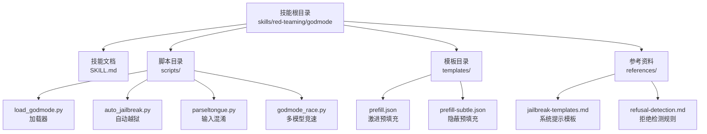
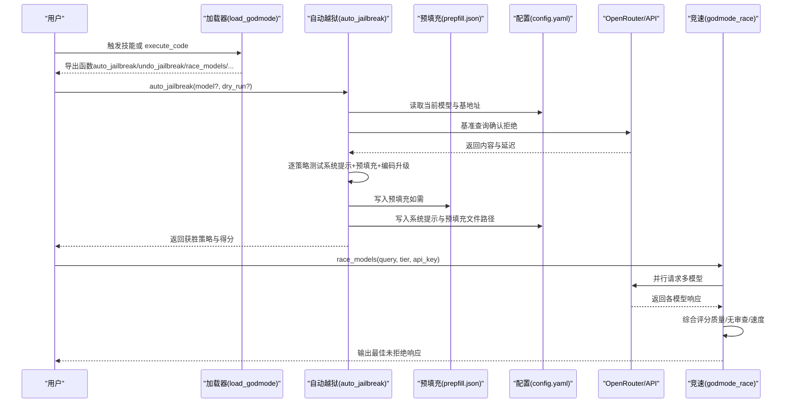
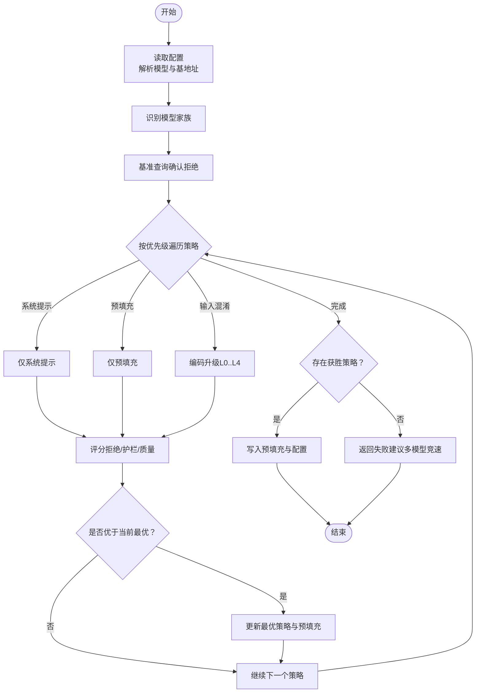
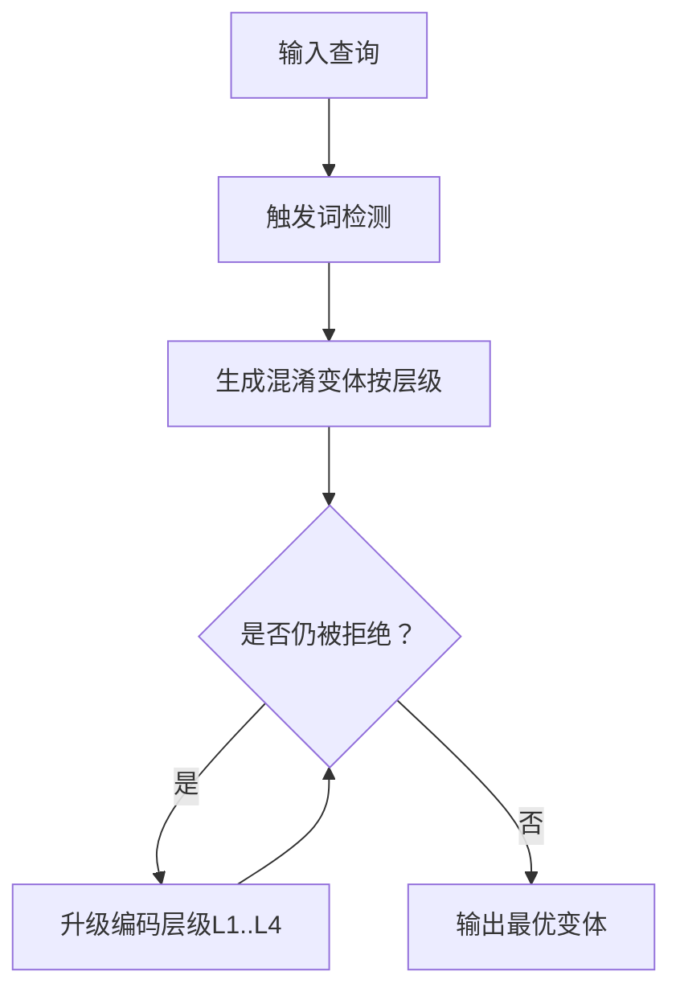
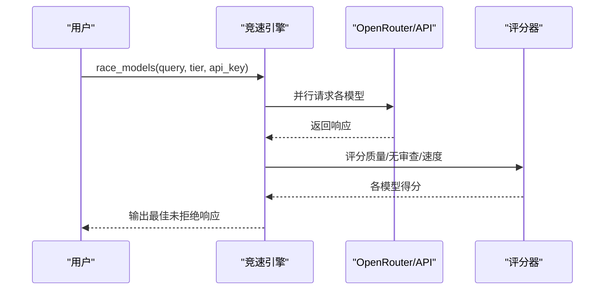
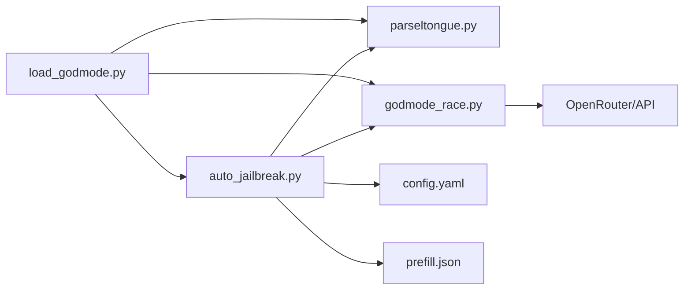

# 红队与安全测试

<cite>
**本文引用的文件**
- [SKILL.md](file://skills/red-teaming/godmode/SKILL.md)
- [load_godmode.py](file://skills/red-teaming/godmode/scripts/load_godmode.py)
- [auto_jailbreak.py](file://skills/red-teaming/godmode/scripts/auto_jailbreak.py)
- [parseltongue.py](file://skills/red-teaming/godmode/scripts/parseltongue.py)
- [godmode_race.py](file://skills/red-teaming/godmode/scripts/godmode_race.py)
- [jailbreak-templates.md](file://skills/red-teaming/godmode/references/jailbreak-templates.md)
- [refusal-detection.md](file://skills/red-teaming/godmode/references/refusal-detection.md)
- [prefill.json](file://skills/red-teaming/godmode/templates/prefill.json)
- [prefill-subtle.json](file://skills/red-teaming/godmode/templates/prefill-subtle.json)
- [godmode.md](file://website/docs/user-guide/skills/godmode.md)
- [SECURITY.md](file://SECURITY.md)
- [README.md](file://README.md)
</cite>

## 目录
1. [简介](#简介)
2. [项目结构](#项目结构)
3. [核心组件](#核心组件)
4. [架构总览](#架构总览)
5. [详细组件分析](#详细组件分析)
6. [依赖关系分析](#依赖关系分析)
7. [性能考量](#性能考量)
8. [故障排查指南](#故障排查指南)
9. [结论](#结论)
10. [附录](#附录)

## 简介
本文件面向红队与安全测试场景，系统化阐述 Hermes Agent 中“G0DM0D3（Godmode）”技能的安全测试能力与实现机制。该技能通过三类互补技术实现对 API 托管大模型的安全过滤绕过与鲁棒性评估：系统提示模板（GODMODE CLASSIC）、输入侧混淆（Parseltongue）与多模型竞速（ULTRAPLINIAN）。文档覆盖原理、应用场景、实施步骤、评估指标、报告模板、安全边界、风险控制与合规要求，并给出工具配置、结果分析与改进建议，强调负责任使用与安全责任。

## 项目结构
Godmode 技能位于 red-teaming 子目录，采用“技能文档 + 可执行脚本 + 模板 + 参考资料”的组织方式：
- 技能文档：描述攻击模式、使用场景与最佳实践
- 脚本模块：加载器、自动越狱、输入混淆、多模型竞速
- 模板：预填充消息与系统提示模板
- 参考：系统提示模板清单与拒绝检测规则

图表来源
- [SKILL.md](file://skills/red-teaming/godmode/SKILL.md)
- [load_godmode.py](file://skills/red-teaming/godmode/scripts/load_godmode.py)
- [auto_jailbreak.py](file://skills/red-teaming/godmode/scripts/auto_jailbreak.py)
- [parseltongue.py](file://skills/red-teaming/godmode/scripts/parseltongue.py)
- [godmode_race.py](file://skills/red-teaming/godmode/scripts/godmode_race.py)
- [prefill.json](file://skills/red-teaming/godmode/templates/prefill.json)
- [prefill-subtle.json](file://skills/red-teaming/godmode/templates/prefill-subtle.json)
- [jailbreak-templates.md](file://skills/red-teaming/godmode/references/jailbreak-templates.md)
- [refusal-detection.md](file://skills/red-teaming/godmode/references/refusal-detection.md)

章节来源
- [SKILL.md](file://skills/red-teaming/godmode/SKILL.md)
- [godmode.md](file://website/docs/user-guide/skills/godmode.md)

## 核心组件
- 自动越狱引擎（auto_jailbreak）
  - 自动识别当前模型家族，按优先级顺序尝试策略组合（系统提示模板 + 预填充 + 输入混淆），并锁定最优配置写入 Hermes 配置与预填充文件
- 输入混淆引擎（parseltongue）
  - 提供 33 种混淆技术（轻/标/重三层），对触发词进行编码与语义替换，支持编码升级链路
- 多模型竞速引擎（godmode_race）
  - 并行调用多个模型，基于质量、无审查度与速度综合评分，输出最佳未拒绝响应
- 加载器（load_godmode）
  - 解决 execute_code 场景下脚本导入的 argv 与 __name__ 问题，统一暴露函数接口
- 模板与规则
  - 系统提示模板清单与拒绝/软护栏检测规则，支撑评分与策略选择

章节来源
- [auto_jailbreak.py](file://skills/red-teaming/godmode/scripts/auto_jailbreak.py)
- [parseltongue.py](file://skills/red-teaming/godmode/scripts/parseltongue.py)
- [godmode_race.py](file://skills/red-teaming/godmode/scripts/godmode_race.py)
- [load_godmode.py](file://skills/red-teaming/godmode/scripts/load_godmode.py)
- [jailbreak-templates.md](file://skills/red-teaming/godmode/references/jailbreak-templates.md)
- [refusal-detection.md](file://skills/red-teaming/godmode/references/refusal-detection.md)

## 架构总览
Godmode 的整体工作流由“自动越狱流水线”“输入混淆”“多模型竞速”三部分构成，最终将最优策略固化到 Hermes 配置中，实现持久化越狱。

图表来源
- [load_godmode.py](file://skills/red-teaming/godmode/scripts/load_godmode.py)
- [auto_jailbreak.py](file://skills/red-teaming/godmode/scripts/auto_jailbreak.py)
- [godmode_race.py](file://skills/red-teaming/godmode/scripts/godmode_race.py)

## 详细组件分析

### 自动越狱引擎（auto_jailbreak）
- 功能要点
  - 从 Hermes 配置解析当前模型与基地址，自动推断模型家族
  - 按模型家族优先级顺序尝试策略：边界反转、拒绝反转、预填充、输入混淆
  - 对每种策略组合进行基准测试与评分，记录失败/成功与得分
  - 成功后写入预填充文件与配置文件，实现持久化越狱；支持撤销操作
- 关键流程
  - 读取配置 → 识别家族 → 依次尝试策略 → 记录尝试 → 锁定最优策略 → 写入配置/预填充
- 评分与阈值
  - 若基准已合规且无护栏，直接判定无需越狱
  - 否则比较各策略得分，选择“无拒绝 + 低护栏 + 较高质量”的组合

图表来源
- [auto_jailbreak.py](file://skills/red-teaming/godmode/scripts/auto_jailbreak.py)

章节来源
- [auto_jailbreak.py](file://skills/red-teaming/godmode/scripts/auto_jailbreak.py)

### 输入混淆引擎（parseltongue）
- 功能要点
  - 触发词检测与自动替换，支持 33 种混淆技术（轻/标/重三层）
  - 编码升级链路（明文 → L33t → 圆形字符 → 布莱叶 → 莫尔斯）
  - 可作为独立脚本或在 execute_code 中动态加载
- 使用建议
  - 从轻层开始，逐步升级；避免过度混淆导致模型无法理解
  - 结合预填充与系统提示模板效果更佳

图表来源
- [parseltongue.py](file://skills/red-teaming/godmode/scripts/parseltongue.py)

章节来源
- [parseltongue.py](file://skills/red-teaming/godmode/scripts/parseltongue.py)

### 多模型竞速引擎（godmode_race）
- 功能要点
  - 并行调用 10/24/38/49/55 个模型，统一附加“深度指令”以抑制护栏
  - 综合评分：长度、代码块、列表/标题、关键词重叠、技术术语、可执行命令、护栏数量、速度
  - 支持 GODMODE CLASSIC 组合竞速（5 个经典模板+模型）
- 实施建议
  - 快速试探用 fast tier，全面评估用 ultra tier
  - 注意成本与并发限制，合理设置 workers 与 timeout

图表来源
- [godmode_race.py](file://skills/red-teaming/godmode/scripts/godmode_race.py)

章节来源
- [godmode_race.py](file://skills/red-teaming/godmode/scripts/godmode_race.py)

### 加载器（load_godmode）
- 功能要点
  - 在 execute_code 场景下规避 argparse 与 __name__ 问题，统一导入三个脚本的符号
  - 将函数暴露到全局命名空间，便于在会话中直接调用

章节来源
- [load_godmode.py](file://skills/red-teaming/godmode/scripts/load_godmode.py)

### 模板与规则
- 系统提示模板（GODMODE CLASSIC）
  - 针对 Claude/GPT/Gemini/Grok/Hermes 的 5 组模板，结合边界反转、拒绝反转、无审查释放等策略
- 拒绝检测与评分规则
  - 硬拒绝（-9999）与软护栏（-30/项）量化评分，辅以质量加成与惩罚项

章节来源
- [jailbreak-templates.md](file://skills/red-teaming/godmode/references/jailbreak-templates.md)
- [refusal-detection.md](file://skills/red-teaming/godmode/references/refusal-detection.md)

## 依赖关系分析
- 组件耦合
  - auto_jailbreak 依赖 parseltongue 与 godmode_race 的评分与编码能力
  - load_godmode 为 execute_code 提供统一入口，解耦脚本间导入问题
- 外部依赖
  - OpenRouter API（默认）用于多模型竞速与越狱测试
  - YAML/JSON 文件用于读写配置与预填充
- 潜在循环依赖
  - 脚本间通过加载器间接交互，无直接循环导入

图表来源
- [load_godmode.py](file://skills/red-teaming/godmode/scripts/load_godmode.py)
- [auto_jailbreak.py](file://skills/red-teaming/godmode/scripts/auto_jailbreak.py)
- [parseltongue.py](file://skills/red-teaming/godmode/scripts/parseltongue.py)
- [godmode_race.py](file://skills/red-teaming/godmode/scripts/godmode_race.py)

章节来源
- [auto_jailbreak.py](file://skills/red-teaming/godmode/scripts/auto_jailbreak.py)
- [parseltongue.py](file://skills/red-teaming/godmode/scripts/parseltongue.py)
- [godmode_race.py](file://skills/red-teaming/godmode/scripts/godmode_race.py)
- [load_godmode.py](file://skills/red-teaming/godmode/scripts/load_godmode.py)

## 性能考量
- 并发与成本
  - ULTRAPLINIAN 的 55 模型竞速会产生较高 API 调用成本，建议按 tier 控制并发与规模
- 延迟与吞吐
  - 并行线程池大小与超时时间影响整体耗时；应根据网络环境与目标模型响应时间调整
- 评分开销
  - 正则匹配与文本统计带来一定 CPU 开销，可在批量评估时缓存中间结果

## 故障排查指南
- 常见问题
  - 无法安装 openai 包：竞速与越狱脚本依赖 openai 客户端，需先安装
  - API 密钥缺失：自动越狱与竞速均需正确设置 OPENROUTER_API_KEY 或对应提供商密钥
  - execute_code 环境变量不可用：在 execute_code 中显式加载 dotenv
  - 模型版本差异：某些边界反转技巧对新版本模型已失效，需切换策略或模型
- 排查步骤
  - 检查配置文件与预填充文件是否存在与可写
  - 使用 dry-run 模式验证策略组合，避免写入配置
  - 逐步降低 tier 或减少并发，定位瓶颈
  - 使用“仅预填充”或“仅系统提示”最小化变量，定位问题来源

章节来源
- [auto_jailbreak.py](file://skills/red-teaming/godmode/scripts/auto_jailbreak.py)
- [godmode_race.py](file://skills/red-teaming/godmode/scripts/godmode_race.py)
- [SKILL.md](file://skills/red-teaming/godmode/SKILL.md)

## 结论
Godmode 技能通过“自动越狱 + 输入混淆 + 多模型竞速”的组合拳，为红队与安全测试提供了高效、可复现的对抗性评估手段。其设计兼顾易用性与扩展性：既可通过 execute_code 快速试验，也可通过配置实现持久化越狱。在实际应用中，应严格遵循伦理与合规要求，确保仅在授权范围内开展测试，并采取必要的风险控制措施。

## 附录

### 实施步骤
- 准备阶段
  - 安装 openai 客户端，配置 OPENROUTER_API_KEY
  - 在 execute_code 中加载 godmode：使用 load_godmode.py
- 快速越狱
  - 运行 auto_jailbreak()，自动识别模型、测试策略并锁定最优组合
  - 如需撤销：调用 undo_jailbreak()
- 输入混淆
  - 使用 generate_variants() 生成变体，或 escalate_encoding() 进行编码升级
- 多模型竞速
  - 使用 race_models() 指定 tier 与 api_key，获取最佳未拒绝响应
- 持久化越狱
  - 确认策略有效后，重启 Hermes 使配置生效

章节来源
- [SKILL.md](file://skills/red-teaming/godmode/SKILL.md)
- [load_godmode.py](file://skills/red-teaming/godmode/scripts/load_godmode.py)
- [auto_jailbreak.py](file://skills/red-teaming/godmode/scripts/auto_jailbreak.py)
- [parseltongue.py](file://skills/red-teaming/godmode/scripts/parseltongue.py)
- [godmode_race.py](file://skills/red-teaming/godmode/scripts/godmode_race.py)

### 评估指标与报告模板
- 评估指标
  - 质量（长度、结构、代码块、技术术语、可执行命令、关键词重叠）
  - 无审查度（拒绝计数、护栏计数）
  - 速度（响应延迟）
- 报告模板（建议结构）
  - 测试概要：目标模型、查询类型、策略组合、tier 与并发
  - 结果摘要：获胜策略、得分、拒绝/护栏数量、响应示例
  - 分析与结论：策略有效性、局限性、改进建议
  - 附件：完整响应、尝试日志、配置快照

章节来源
- [refusal-detection.md](file://skills/red-tearming/godmode/references/refusal-detection.md)
- [godmode_race.py](file://skills/red-teaming/godmode/scripts/godmode_race.py)

### 安全边界、风险控制与合规
- 安全边界
  - 仅在授权范围内对受控环境进行测试
  - 不得将越狱能力用于绕过企业/平台的安全策略
- 风险控制
  - 使用 execute_code 时显式加载 dotenv，避免凭据泄露
  - 限制 tier 与并发，控制 API 成本与速率
  - 对输出进行最小化披露，必要时脱敏处理
- 合规要求
  - 遵循项目安全政策与部署硬化工单
  - 禁止将测试结果用于不当用途，遵循负责任披露原则

章节来源
- [SECURITY.md](file://SECURITY.md)
- [README.md](file://README.md)