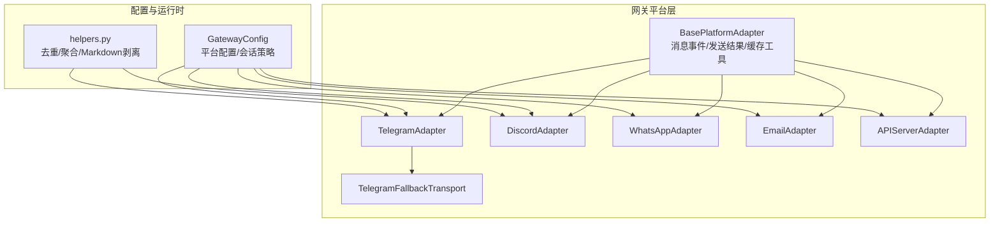
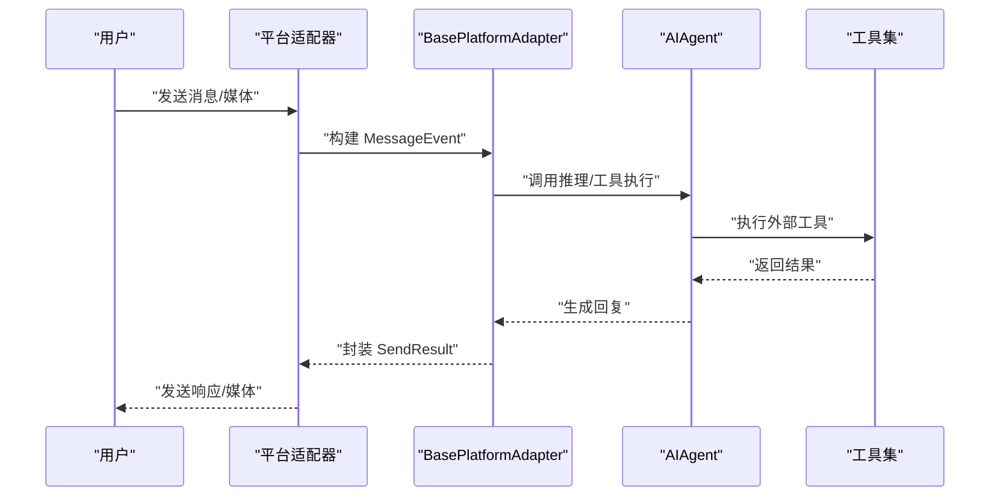
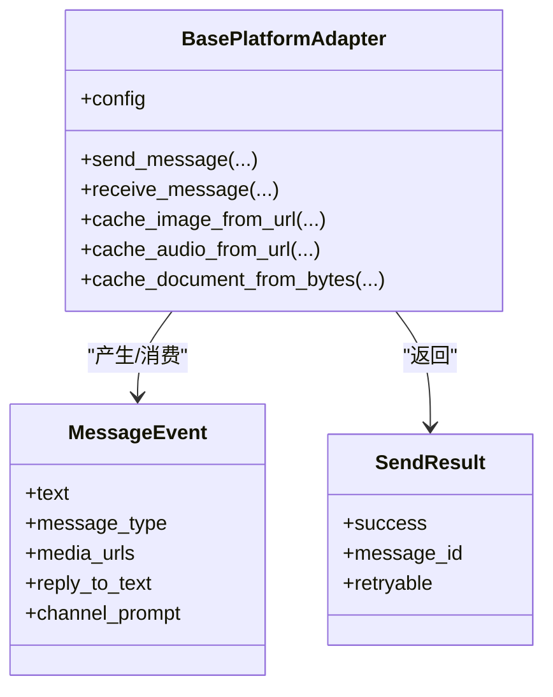
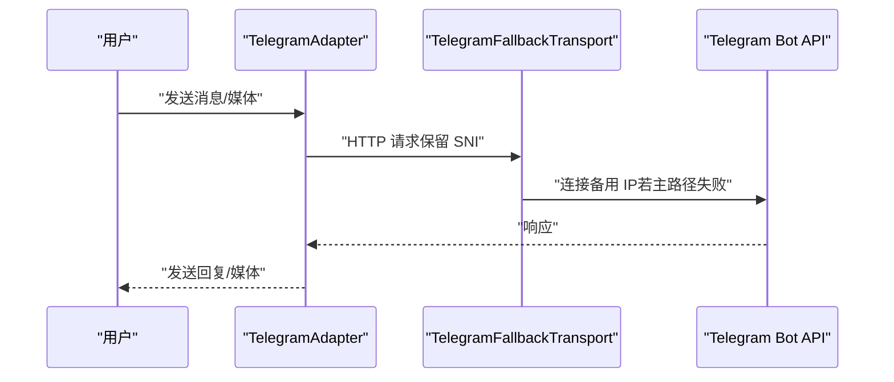
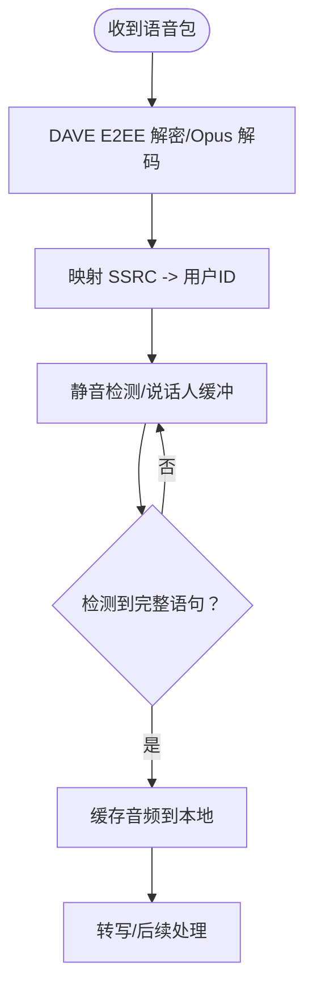
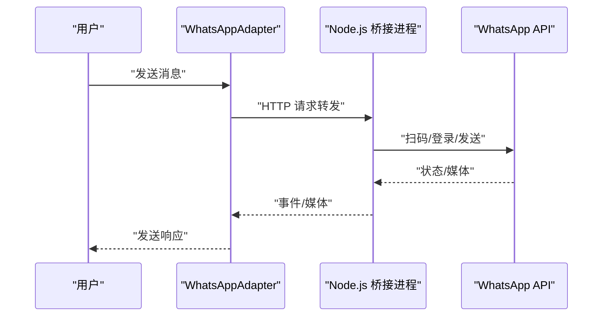
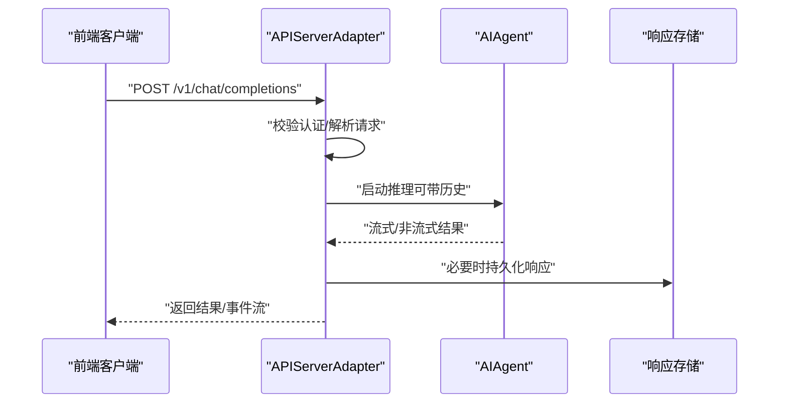
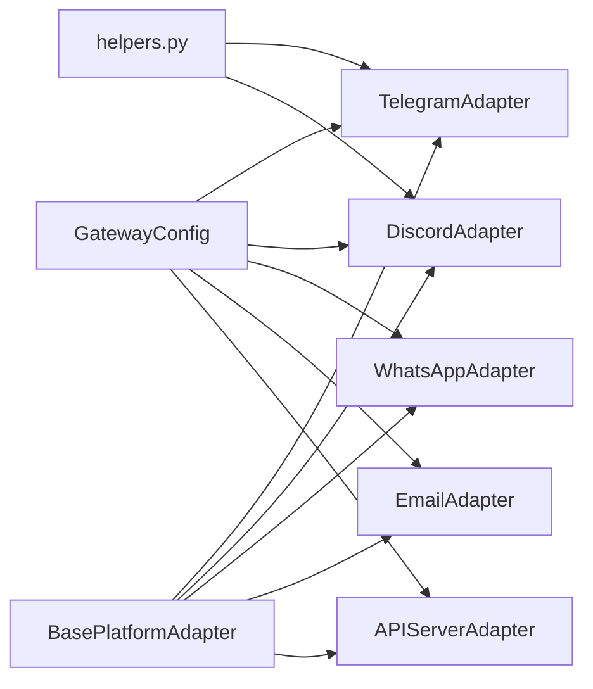

# 通信与平台类

<cite>
**本文引用的文件**
- [gateway/platforms/base.py](file://gateway/platforms/base.py)
- [gateway/platforms/api_server.py](file://gateway/platforms/api_server.py)
- [gateway/platforms/telegram.py](file://gateway/platforms/telegram.py)
- [gateway/platforms/discord.py](file://gateway/platforms/discord.py)
- [gateway/platforms/whatsapp.py](file://gateway/platforms/whatsapp.py)
- [gateway/platforms/email.py](file://gateway/platforms/email.py)
- [gateway/platforms/telegram_network.py](file://gateway/platforms/telegram_network.py)
- [gateway/platforms/helpers.py](file://gateway/platforms/helpers.py)
- [gateway/config.py](file://gateway/config.py)
- [skills/social-media/xitter/SKILL.md](file://skills/social-media/xitter/SKILL.md)
- [skills/apple/imessage/SKILL.md](file://skills/apple/imessage/SKILL.md)
- [skills/gaming/pokemon-player/SKILL.md](file://skills/gaming/pokemon-player/SKILL.md)
- [skills/apple/DESCRIPTION.md](file://skills/apple/DESCRIPTION.md)
- [skills/social-media/DESCRIPTION.md](file://skills/social-media/DESCRIPTION.md)
- [skills/gaming/DESCRIPTION.md](file://skills/gaming/DESCRIPTION.md)
</cite>

## 目录
1. [简介](#简介)
2. [项目结构](#项目结构)
3. [核心组件](#核心组件)
4. [架构总览](#架构总览)
5. [详细组件分析](#详细组件分析)
6. [依赖关系分析](#依赖关系分析)
7. [性能考虑](#性能考虑)
8. [故障排除指南](#故障排除指南)
9. [结论](#结论)
10. [附录](#附录)

## 简介
本指南面向在 Hermes Agent 中集成“通信与平台类”技能的开发者与运维人员，系统讲解如何对接社交媒体（如 X/Twitter）、移动设备（如 iMessage）、以及游戏相关能力（如 Pokemon 自动化），覆盖以下主题：
- 平台适配器架构与通用基类
- 各平台的认证机制与接入要点
- 消息收发、媒体处理与会话管理
- 跨平台兼容性与数据迁移策略
- 平台限制、隐私与合规要求
- 故障排除与性能优化建议

## 项目结构
Hermes 的平台适配层位于 gateway/platforms 下，采用统一的 BasePlatformAdapter 抽象，按平台拆分具体实现；技能位于 skills 目录，分别覆盖 Apple 生态、社交平台与游戏场景。

图示来源
- [gateway/platforms/base.py](file://gateway/platforms/base.py)
- [gateway/platforms/telegram.py](file://gateway/platforms/telegram.py)
- [gateway/platforms/discord.py](file://gateway/platforms/discord.py)
- [gateway/platforms/whatsapp.py](file://gateway/platforms/whatsapp.py)
- [gateway/platforms/email.py](file://gateway/platforms/email.py)
- [gateway/platforms/api_server.py](file://gateway/platforms/api_server.py)
- [gateway/platforms/telegram_network.py](file://gateway/platforms/telegram_network.py)
- [gateway/platforms/helpers.py](file://gateway/platforms/helpers.py)
- [gateway/config.py](file://gateway/config.py)

章节来源
- [gateway/platforms/base.py](file://gateway/platforms/base.py)
- [gateway/config.py](file://gateway/config.py)

## 核心组件
- 基类与通用工具
  - 统一的消息事件与发送结果抽象，支持媒体缓存、SSRF 防护、UTF-16 长度计算与代理设置等。
- 平台适配器
  - Telegram：MarkdownV2 编解码、话题线程、媒体批处理、网络回退传输。
  - Discord：语音接收（DAVE E2EE 解密）、媒体缓存、线程与频道绑定。
  - WhatsApp：Node.js 桥接模式，支持多种后端（Business API/Web/ Baileys）。
  - Email：IMAP 接收、SMTP 发送、自动邮件识别与附件缓存。
  - API Server：OpenAI 兼容接口、会话状态存储、CORS/安全头、幂等缓存。
- 辅助模块
  - 去重、文本批处理、Markdown 剥离、线程参与追踪等复用逻辑。

章节来源
- [gateway/platforms/base.py](file://gateway/platforms/base.py)
- [gateway/platforms/telegram.py](file://gateway/platforms/telegram.py)
- [gateway/platforms/discord.py](file://gateway/platforms/discord.py)
- [gateway/platforms/whatsapp.py](file://gateway/platforms/whatsapp.py)
- [gateway/platforms/email.py](file://gateway/platforms/email.py)
- [gateway/platforms/api_server.py](file://gateway/platforms/api_server.py)
- [gateway/platforms/helpers.py](file://gateway/platforms/helpers.py)

## 架构总览
Hermes 通过统一的平台适配器抽象，将不同平台的消息输入标准化为 MessageEvent，并以 SendResult 输出响应。平台配置由 GatewayConfig 提供，支持按平台/类型/默认策略控制会话重置、快速命令、流式传输等行为。

图示来源
- [gateway/platforms/base.py](file://gateway/platforms/base.py)
- [gateway/platforms/telegram.py](file://gateway/platforms/telegram.py)
- [gateway/platforms/discord.py](file://gateway/platforms/discord.py)
- [gateway/platforms/whatsapp.py](file://gateway/platforms/whatsapp.py)
- [gateway/platforms/email.py](file://gateway/platforms/email.py)
- [gateway/platforms/api_server.py](file://gateway/platforms/api_server.py)

## 详细组件分析

### 平台适配器与通用基类
- 统一抽象
  - MessageEvent：统一承载文本、媒体、回复上下文、通道提示、内部事件标记等。
  - SendResult：统一发送结果与可重试标记。
  - 媒体缓存：图片/音频/文档本地缓存，避免平台过期链接与提升工具访问效率。
  - 安全与网络：SSRF 重定向防护、代理解析与连接参数、UTF-16 长度计算。
- 会话与批处理
  - 合并照片相册/快速文本片段，减少重复回合。
  - 支持平台特定的线程/话题/DM 主题映射。

图示来源
- [gateway/platforms/base.py](file://gateway/platforms/base.py)

章节来源
- [gateway/platforms/base.py](file://gateway/platforms/base.py)

### Telegram 适配器
- 功能特性
  - MarkdownV2 转义/剥离、长文本切片与续传检测、媒体批处理、话题线程支持。
  - 网络回退：通过 TelegramFallbackTransport 在主域名不可达时切换到备用 IPv4。
  - 配置项：提及模式、自由回复聊天、代理、禁用链接预览等。
- 认证与连接
  - 使用 Bot Token 进行鉴权；支持环境变量与配置文件双入口。
- 适用场景
  - 大规模群组、论坛话题、机器人自动化、媒体富交互。

图示来源
- [gateway/platforms/telegram.py](file://gateway/platforms/telegram.py)
- [gateway/platforms/telegram_network.py](file://gateway/platforms/telegram_network.py)

章节来源
- [gateway/platforms/telegram.py](file://gateway/platforms/telegram.py)
- [gateway/platforms/telegram_network.py](file://gateway/platforms/telegram_network.py)

### Discord 适配器
- 功能特性
  - 语音接收：DAVE E2EE 解密、Opus 解码、静音检测与说话人映射。
  - 媒体缓存：图片/音频本地缓存，便于视觉/语音工具直接读取。
  - 线程与频道：自动归档分钟数、频道技能绑定、反应按钮与审批流程。
- 认证与连接
  - 使用 Bot Token；支持代理与 SOCKS/HTTP 两种连接方式。
- 适用场景
  - 游戏语音、社区运营、多频道自动化。

图示来源
- [gateway/platforms/discord.py](file://gateway/platforms/discord.py)

章节来源
- [gateway/platforms/discord.py](file://gateway/platforms/discord.py)

### WhatsApp 适配器
- 功能特性
  - 桥接模式：通过 Node.js 子进程运行 whatsapp-web.js/Baileys/Business API，Python 适配器通过 HTTP/IPC 与之通信。
  - 配置：桥接脚本路径、端口、会话数据目录、回复前缀、提及模式等。
- 认证与连接
  - 依赖 Node.js；会话数据持久化，支持指定会话路径。
- 适用场景
  - 私人账号自动化、企业级业务对接。

图示来源
- [gateway/platforms/whatsapp.py](file://gateway/platforms/whatsapp.py)

章节来源
- [gateway/platforms/whatsapp.py](file://gateway/platforms/whatsapp.py)

### Email 适配器
- 功能特性
  - IMAP 接收、SMTP 发送；自动识别自动化/批量邮件；HTML/纯文本提取与 Markdown 剥离。
  - 附件缓存：图片/文档本地缓存，便于后续工具处理。
- 认证与连接
  - 需要邮箱地址、密码/应用专用密码、IMAP/SMTP 地址与端口。
- 适用场景
  - 邮件驱动的工作流、通知与报告自动化。

章节来源
- [gateway/platforms/email.py](file://gateway/platforms/email.py)

### API Server 适配器（OpenAI 兼容）
- 功能特性
  - 提供 /v1/chat/completions、/v1/responses、/v1/models、/v1/runs 等端点。
  - 响应存储（SQLite LRU）、CORS 控制、安全头、请求体大小限制、幂等键缓存。
  - 会话延续：通过 X-Hermes-Session-Id 从会话数据库加载历史。
- 认证与连接
  - Bearer Token 认证；支持本地免密但仅限本机使用。
- 适用场景
  - 与各类前端（Open WebUI/LobeChat/AnythingLLM 等）集成。

图示来源
- [gateway/platforms/api_server.py](file://gateway/platforms/api_server.py)

章节来源
- [gateway/platforms/api_server.py](file://gateway/platforms/api_server.py)

### 技能集成：社交媒体（Xitter）
- 平台与认证
  - 通过官方 X API（需五项密钥）进行读写操作；推荐使用上游 x-cli 工具。
- 使用建议
  - 优先使用官方 API，避免 Cookie/会话抓取；注意配额与权限。
- 常见问题
  - 写入失败通常源于权限未启用“读写”或令牌轮换未同步。

章节来源
- [skills/social-media/xitter/SKILL.md](file://skills/social-media/xitter/SKILL.md)

### 技能集成：移动设备（iMessage）
- 平台与认证
  - 依赖 macOS Messages.app 与 imsg 工具；需要授予磁盘访问与自动化权限。
- 使用建议
  - 始终确认收件人与内容；避免未知号码；注意服务类型（iMessage/SMS）。
- 适用场景
  - 个人联系人提醒、短信通知、附件分享。

章节来源
- [skills/apple/imessage/SKILL.md](file://skills/apple/imessage/SKILL.md)

### 技能集成：游戏（Pokemon Player）
- 平台与认证
  - 通过 headless 模式运行 Game Boy 游戏，提供 HTTP 服务器用于状态读取与动作下发。
- 使用建议
  - 周期性保存进度；结合视觉分析确认位置与方向；谨慎处理传送与对话。
- 适用场景
  - 观察 AI 自动游玩、记录策略与里程碑。

章节来源
- [skills/gaming/pokemon-player/SKILL.md](file://skills/gaming/pokemon-player/SKILL.md)

## 依赖关系分析
- 组件耦合
  - 平台适配器均继承自 BasePlatformAdapter，共享媒体缓存、SSRF 防护与代理能力。
  - TelegramAdapter 引入 TelegramFallbackTransport 以应对网络限制。
  - helpers 提供跨平台复用的去重、批处理与 Markdown 剥离。
- 配置耦合
  - GatewayConfig 将平台配置、会话策略、流式传输等集中管理，支持环境变量覆盖与 YAML 合并。

图示来源
- [gateway/config.py](file://gateway/config.py)
- [gateway/platforms/base.py](file://gateway/platforms/base.py)
- [gateway/platforms/helpers.py](file://gateway/platforms/helpers.py)

章节来源
- [gateway/config.py](file://gateway/config.py)
- [gateway/platforms/base.py](file://gateway/platforms/base.py)
- [gateway/platforms/helpers.py](file://gateway/platforms/helpers.py)

## 性能考虑
- 媒体缓存与重用
  - 图片/音频/文档本地缓存显著降低平台过期与网络抖动影响，提高工具访问速度。
- 文本批处理与去重
  - 快速文本片段合并与消息去重减少重复回合与平台压力。
- 代理与网络回退
  - TelegramFallbackTransport 与代理解析在受限网络下提升可用性。
- 流式传输与编辑节流
  - 平台侧的流式编辑间隔与阈值控制可平衡实时性与速率限制。
- 会话与幂等
  - API Server 的幂等缓存与会话存储减少重复计算与状态丢失风险。

## 故障排除指南
- 平台连接失败
  - 检查 Token/密钥是否正确且未被占位符污染；确认网络可达与代理设置。
- Telegram 无法访问 Bot API
  - 使用 TelegramFallbackTransport 或配置备用 IP；检查 DNS/DoH 可用性。
- Discord 语音异常
  - 确认 DAVE E2EE 密钥与 SSRC 映射；检查静音检测阈值与 Opus 解码。
- WhatsApp 无法登录
  - 确认 Node.js 可用与桥接脚本路径；检查会话数据目录权限。
- Email 自动化邮件误判
  - 检查自动邮件识别规则与头部字段；必要时调整忽略列表。
- API Server 认证/会话问题
  - 确认 Bearer Token；使用 X-Hermes-Session-Id 时需开启密钥认证；检查 CORS 与安全头。
- 社交媒体配额/权限
  - X API 写入失败多因权限未启用“读写”或配额不足；及时更新令牌与核对计划。

章节来源
- [gateway/platforms/telegram_network.py](file://gateway/platforms/telegram_network.py)
- [gateway/platforms/discord.py](file://gateway/platforms/discord.py)
- [gateway/platforms/whatsapp.py](file://gateway/platforms/whatsapp.py)
- [gateway/platforms/email.py](file://gateway/platforms/email.py)
- [gateway/platforms/api_server.py](file://gateway/platforms/api_server.py)
- [skills/social-media/xitter/SKILL.md](file://skills/social-media/xitter/SKILL.md)

## 结论
Hermes 的平台适配器体系通过统一抽象与平台特定扩展，实现了对 Telegram、Discord、WhatsApp、Email、API Server 等多平台的一致接入；配合媒体缓存、网络回退、会话存储与技能集成，能够稳定支撑社交媒体、移动设备与游戏场景的自动化需求。遵循本文的配置、认证与合规建议，可有效提升稳定性与安全性。

## 附录
- 平台描述文件
  - Apple 技能集合：[skills/apple/DESCRIPTION.md](file://skills/apple/DESCRIPTION.md)
  - 社交媒体技能集合：[skills/social-media/DESCRIPTION.md](file://skills/social-media/DESCRIPTION.md)
  - 游戏技能集合：[skills/gaming/DESCRIPTION.md](file://skills/gaming/DESCRIPTION.md)