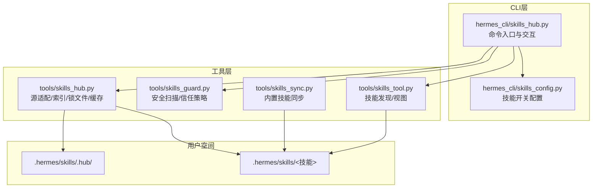
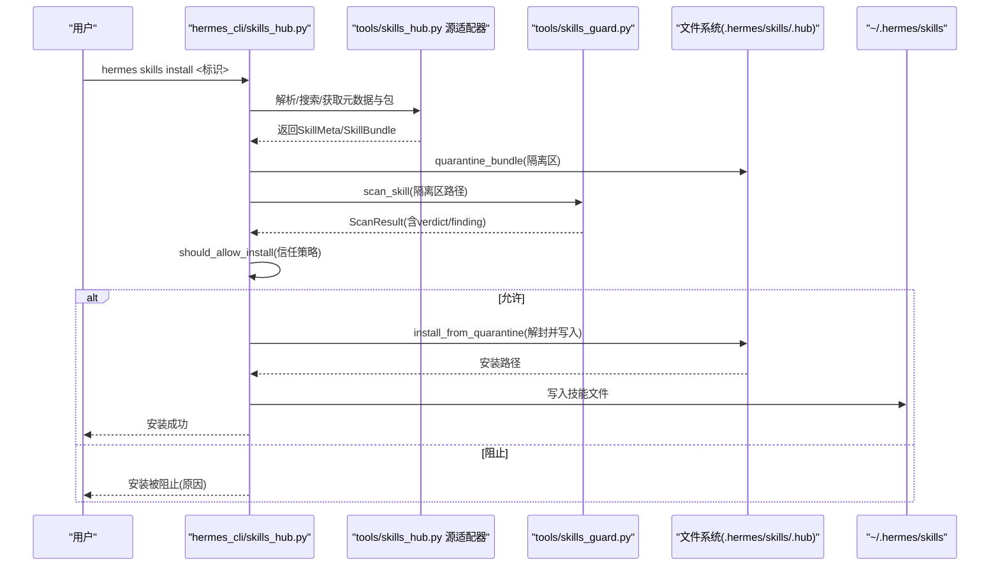
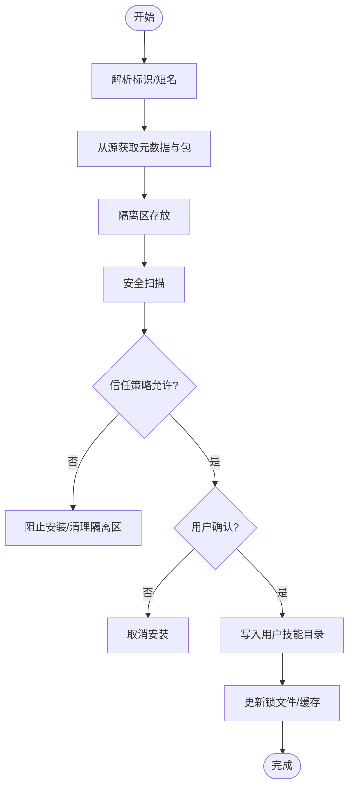
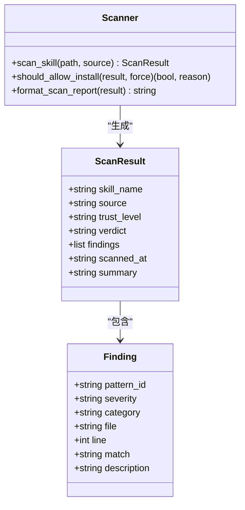
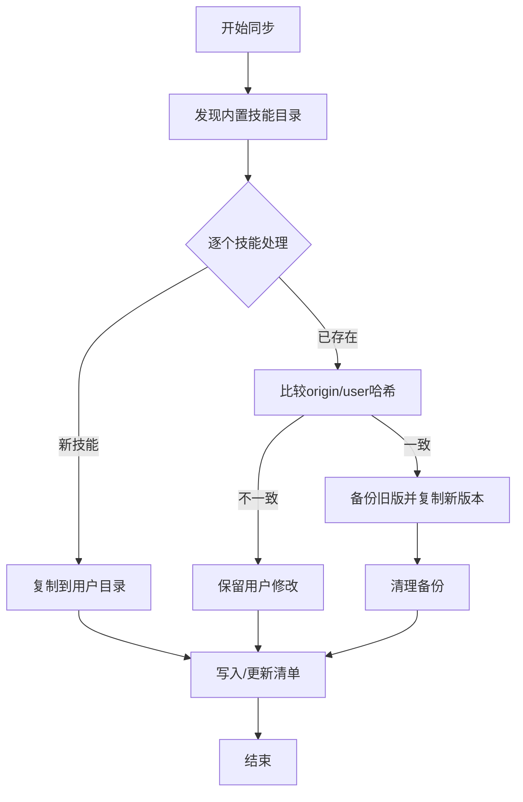
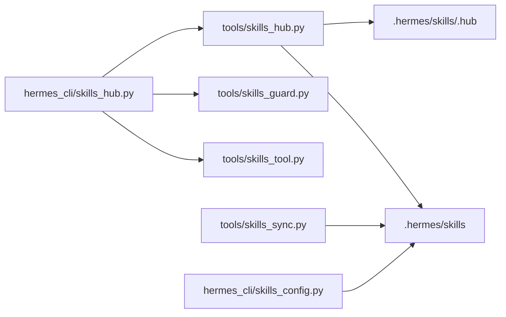

# 技能中心集成

<cite>
**本文引用的文件**
- [hermes_cli/skills_hub.py](file://hermes_cli/skills_hub.py)
- [tools/skills_hub.py](file://tools/skills_hub.py)
- [tools/skills_guard.py](file://tools/skills_guard.py)
- [tools/skills_sync.py](file://tools/skills_sync.py)
- [tools/skills_tool.py](file://tools/skills_tool.py)
- [hermes_cli/skills_config.py](file://hermes_cli/skills_config.py)
- [optional-skills/DESCRIPTION.md](file://optional-skills/DESCRIPTION.md)
- [optional-skills/autonomous-ai-agents/DESCRIPTION.md](file://optional-skills/autonomous-ai-agents/DESCRIPTION.md)
- [optional-skills/autonomous-ai-agents/blackbox/SKILL.md](file://optional-skills/autonomous-ai-agents/blackbox/SKILL.md)
</cite>

## 目录
1. [简介](#简介)
2. [项目结构](#项目结构)
3. [核心组件](#核心组件)
4. [架构总览](#架构总览)
5. [详细组件分析](#详细组件分析)
6. [依赖关系分析](#依赖关系分析)
7. [性能考量](#性能考量)
8. [故障排查指南](#故障排查指南)
9. [结论](#结论)
10. [附录](#附录)

## 简介
本文件面向希望在Hermes Agent中集成“技能中心”的开发者与运维人员，系统化阐述技能中心的工作原理、同步机制、安全扫描、发布与分享流程、依赖管理与版本兼容、离线使用与本地缓存，以及API与集成示例。内容基于仓库中的CLI实现、工具模块与官方可选技能，确保技术细节与实际代码一致。

## 项目结构
技能中心相关能力主要分布在以下模块：
- CLI入口与交互：hermes_cli/skills_hub.py
- 技能源适配与Hub状态：tools/skills_hub.py
- 安全扫描与信任策略：tools/skills_guard.py
- 内置技能同步与去重：tools/skills_sync.py
- 技能发现与视图：tools/skills_tool.py
- 技能开关配置：hermes_cli/skills_config.py
- 官方可选技能说明与样例：optional-skills/DESCRIPTION.md 及子目录

图表来源
- [hermes_cli/skills_hub.py:144-617](file://hermes_cli/skills_hub.py#L144-L617)
- [tools/skills_hub.py:46-56](file://tools/skills_hub.py#L46-L56)
- [tools/skills_guard.py:39-47](file://tools/skills_guard.py#L39-L47)
- [tools/skills_sync.py:35-37](file://tools/skills_sync.py#L35-L37)
- [tools/skills_tool.py:84-88](file://tools/skills_tool.py#L84-L88)

章节来源
- [hermes_cli/skills_hub.py:1-1239](file://hermes_cli/skills_hub.py#L1-L1239)
- [tools/skills_hub.py:1-3054](file://tools/skills_hub.py#L1-L3054)
- [tools/skills_guard.py:1-929](file://tools/skills_guard.py#L1-L929)
- [tools/skills_sync.py:1-317](file://tools/skills_sync.py#L1-L317)
- [tools/skills_tool.py:1-1421](file://tools/skills_tool.py#L1-L1421)
- [hermes_cli/skills_config.py:1-178](file://hermes_cli/skills_config.py#L1-L178)

## 核心组件
- 源适配器与路由：统一搜索、预览、拉取技能，支持GitHub、Well-Known、skills.sh、ClawHub等多源。
- 安全扫描与信任策略：对第三方技能进行静态规则扫描，结合信任级别决定是否允许安装。
- Hub状态与缓存：隔离安装前的“隔离区”（quarantine）、锁文件记录已装技能、审计日志、索引缓存。
- 内置技能同步：将仓库内官方可选技能复制到用户目录，并通过清单跟踪变更。
- 技能发现与视图：按平台过滤、解析frontmatter、提供最小元数据列表与全文视图。
- 技能开关配置：按全局或平台维度启用/禁用技能。

章节来源
- [tools/skills_hub.py:63-86](file://tools/skills_hub.py#L63-L86)
- [tools/skills_guard.py:39-47](file://tools/skills_guard.py#L39-L47)
- [tools/skills_sync.py:52-89](file://tools/skills_sync.py#L52-L89)
- [tools/skills_tool.py:527-601](file://tools/skills_tool.py#L527-L601)
- [hermes_cli/skills_config.py:27-47](file://hermes_cli/skills_config.py#L27-L47)

## 架构总览
技能中心采用“CLI命令 → 工具模块 → 多源适配器 → 扫描/安装 → 用户技能目录”的分层设计。安装流程在隔离区完成扫描与决策，通过锁文件与缓存保障一致性与性能。

图表来源
- [hermes_cli/skills_hub.py:310-466](file://hermes_cli/skills_hub.py#L310-L466)
- [tools/skills_hub.py:350-376](file://tools/skills_hub.py#L350-L376)
- [tools/skills_guard.py:595-640](file://tools/skills_guard.py#L595-L640)

## 详细组件分析

### 组件A：技能下载、安装与更新流程
- 下载与预览
  - 支持短名称自动解析与精确匹配；统一搜索/浏览接口来自源路由器。
  - 预览通过inspect返回元数据与上游额外信息（如仓库链接、端点）。
- 安装流程
  - 创建隔离区目录，将技能包放入隔离区。
  - 执行安全扫描，输出报告；根据信任级别与扫描结果决定是否允许安装。
  - 用户确认后写入用户技能目录，更新锁文件与提示缓存失效。
- 更新流程
  - 列出已安装技能，检查上游更新；对有更新的技能执行强制重新安装。

图表来源
- [hermes_cli/skills_hub.py:310-466](file://hermes_cli/skills_hub.py#L310-L466)
- [tools/skills_guard.py:642-677](file://tools/skills_guard.py#L642-L677)

章节来源
- [hermes_cli/skills_hub.py:144-617](file://hermes_cli/skills_hub.py#L144-L617)
- [tools/skills_hub.py:108-135](file://tools/skills_hub.py#L108-L135)

### 组件B：安全扫描与信任策略
- 扫描范围
  - 结构性检查（文件数、大小、二进制、符号链接、单文件过大）。
  - 正则模式匹配（数据外泄、注入、破坏性操作、持久化、网络、混淆、执行、路径穿越、挖矿、供应链、提权、上下文泄露等）。
  - 不可见字符检测（隐藏注入）。
- 信任与策略
  - builtin/trusted/community/agent-created五档信任。
  - 不同信任下对“安全/谨慎/危险”的容忍度不同；强制安装可覆盖部分策略。
- 报告格式
  - 包含技能名、来源、信任级别、最终判定、发现项明细与摘要。

图表来源
- [tools/skills_guard.py:56-76](file://tools/skills_guard.py#L56-L76)
- [tools/skills_guard.py:595-640](file://tools/skills_guard.py#L595-L640)
- [tools/skills_guard.py:642-713](file://tools/skills_guard.py#L642-L713)

章节来源
- [tools/skills_guard.py:39-47](file://tools/skills_guard.py#L39-L47)
- [tools/skills_guard.py:526-728](file://tools/skills_guard.py#L526-L728)

### 组件C：内置技能同步与版本兼容
- 同步逻辑
  - 读取清单（v2：name:origin_hash），新技能直接复制；已存在但未修改用户副本时可安全更新。
  - 用户自定义过的技能跳过覆盖，避免破坏个性化配置。
  - 清理已移除的内置技能条目。
- 哈希校验
  - 对技能目录递归计算MD5，用于检测变更与一致性。
- 类别描述
  - 自动复制各分类下的DESCRIPTION.md至用户目录，便于展示。

图表来源
- [tools/skills_sync.py:176-301](file://tools/skills_sync.py#L176-L301)

章节来源
- [tools/skills_sync.py:52-110](file://tools/skills_sync.py#L52-L110)
- [tools/skills_sync.py:162-174](file://tools/skills_sync.py#L162-L174)

### 组件D：技能发现与视图
- 发现
  - 递归扫描用户技能目录与外部扩展目录，排除.git/.github/.hub等。
  - 平台过滤：根据frontmatter的platforms字段限制加载。
- 视图
  - 最小元数据列表（name/description/category）以降低token消耗。
  - 全文视图按需加载，支持引用/模板/资源文件链接。

章节来源
- [tools/skills_tool.py:527-601](file://tools/skills_tool.py#L527-L601)
- [tools/skills_tool.py:647-713](file://tools/skills_tool.py#L647-L713)

### 组件E：技能发布与分享流程
- 发布前置
  - 在本地进行自我扫描，禁止危险判定的技能发布。
  - GitHub发布需要认证（环境变量/GitHub CLI/GitHub App）。
- 发布目标
  - GitHub：提交PR或走仓库约定流程（当前实现为指导性提示）。
  - ClawHub：当前未实现自动化发布，需手动提交。
- 质量与审核
  - 依赖frontmatter规范（name/description/version/license/tags等）。
  - 建议遵循“最小权限”原则与安全扫描策略。

章节来源
- [hermes_cli/skills_hub.py:730-797](file://hermes_cli/skills_hub.py#L730-L797)
- [tools/skills_guard.py:642-677](file://tools/skills_guard.py#L642-L677)

### 组件F：离线使用与本地缓存
- 离线可用
  - 已安装技能无需网络即可使用；平台过滤与环境变量收集在本地完成。
- 缓存机制
  - GitHub索引缓存（带TTL），减少重复请求。
  - Hub隔离区与锁文件保证安装一致性与可回滚。
- 依赖与版本
  - 通过frontmatter的prerequisites/required_environment_variables/setup.collect_secrets声明运行所需环境。
  - 供应链扫描关注未固定版本依赖与远程资源拉取。

章节来源
- [tools/skills_hub.py:55-56](file://tools/skills_hub.py#L55-L56)
- [tools/skills_tool.py:178-290](file://tools/skills_tool.py#L178-L290)
- [tools/skills_guard.py:381-394](file://tools/skills_guard.py#L381-L394)

### 组件G：技能开关与平台配置
- 全局与平台维度禁用列表，支持交互式选择与批量切换。
- 保存配置到用户配置文件，即时生效或在下次会话生效。

章节来源
- [hermes_cli/skills_config.py:27-47](file://hermes_cli/skills_config.py#L27-L47)
- [hermes_cli/skills_config.py:125-178](file://hermes_cli/skills_config.py#L125-L178)

## 依赖关系分析
- 模块耦合
  - CLI层仅负责参数解析与调用工具层函数，低耦合高内聚。
  - 工具层内部通过共享常量（如TRUSTED_REPOS）与数据模型（SkillMeta/SkillBundle）协作。
- 外部依赖
  - HTTP客户端用于多源API访问；GitHub认证支持多种方式。
  - 文件系统用于隔离区、锁文件、索引缓存与技能目录。

图表来源
- [hermes_cli/skills_hub.py:144-617](file://hermes_cli/skills_hub.py#L144-L617)
- [tools/skills_hub.py:46-56](file://tools/skills_hub.py#L46-L56)
- [tools/skills_sync.py:35-37](file://tools/skills_sync.py#L35-L37)
- [hermes_cli/skills_config.py:16-18](file://hermes_cli/skills_config.py#L16-L18)

章节来源
- [tools/skills_hub.py:1-146](file://tools/skills_hub.py#L1-L146)
- [tools/skills_guard.py:1-31](file://tools/skills_guard.py#L1-L31)

## 性能考量
- 并行搜索与超时控制：浏览界面对多个源并行查询，设置总体超时上限，避免长时间阻塞。
- 索引缓存：GitHub索引缓存默认1小时，显著降低重复请求开销。
- 结构性限制：对文件数量、总大小与单文件大小设限，防止异常技能影响性能。
- 安装缓存失效：安装/卸载后清空提示词缓存，确保新技能立即生效。

章节来源
- [hermes_cli/skills_hub.py:184-308](file://hermes_cli/skills_hub.py#L184-L308)
- [tools/skills_hub.py:55-56](file://tools/skills_hub.py#L55-L56)
- [tools/skills_guard.py:486-496](file://tools/skills_guard.py#L486-L496)

## 故障排查指南
- GitHub速率限制
  - 现象：无法从某些源获取技能，提示速率限制。
  - 处理：配置GITHUB_TOKEN或使用gh CLI登录，提升配额。
- 安装被阻止
  - 现象：扫描结果为危险或存在大量警示。
  - 处理：查看扫描报告，修复潜在问题或使用--force（谨慎）。
- 隔离区残留
  - 现象：安装失败后隔离区未清理。
  - 处理：由流程自动清理；若手动中断，可删除隔离区对应目录。
- 更新无效
  - 现象：执行更新后未见变化。
  - 处理：确认上游确有更新；检查锁文件与安装路径；必要时重启会话使缓存失效。

章节来源
- [hermes_cli/skills_hub.py:337-355](file://hermes_cli/skills_hub.py#L337-L355)
- [tools/skills_guard.py:642-677](file://tools/skills_guard.py#L642-L677)

## 结论
Hermes技能中心通过清晰的分层设计与严格的安装前安全扫描，实现了“可发现、可预览、可安装、可更新、可审计”的闭环。内置技能同步与平台化配置进一步提升了可用性与可维护性。建议在生产环境中：
- 强制启用安全扫描与信任策略；
- 使用隔离区与锁文件保障一致性；
- 合理利用索引缓存与并行搜索；
- 对第三方技能保持审慎，优先选择受信源。

## 附录

### 技能市场使用指南与社区参与
- 浏览与搜索
  - 使用hermes skills browse与search在多源技能库中查找。
  - 支持按源筛选与分页浏览。
- 安装与更新
  - hermes skills install <标识>安装；hermes skills update检查并更新。
  - 官方可选技能可通过browse/search定位并安装。
- 分类与描述
  - 可选技能按类别组织，类别描述文件会自动复制到用户目录。
- 社区贡献
  - 提交PR至官方仓库或使用ClawHub（当前为手动提交）。
  - 遵循frontmatter规范与安全扫描要求。

章节来源
- [hermes_cli/skills_hub.py:144-308](file://hermes_cli/skills_hub.py#L144-L308)
- [optional-skills/DESCRIPTION.md:1-25](file://optional-skills/DESCRIPTION.md#L1-L25)
- [optional-skills/autonomous-ai-agents/DESCRIPTION.md:1-3](file://optional-skills/autonomous-ai-agents/DESCRIPTION.md#L1-L3)

### 示例：官方可选技能样例
- 黑盒AI代理技能展示了完整的frontmatter与使用说明，包括前置条件、交互式与后台模式、检查点与多模型模式等。

章节来源
- [optional-skills/autonomous-ai-agents/blackbox/SKILL.md:1-144](file://optional-skills/autonomous-ai-agents/blackbox/SKILL.md#L1-L144)