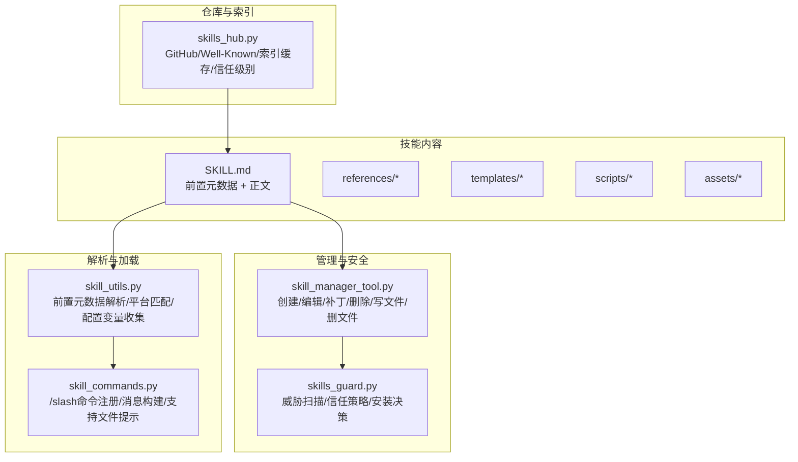
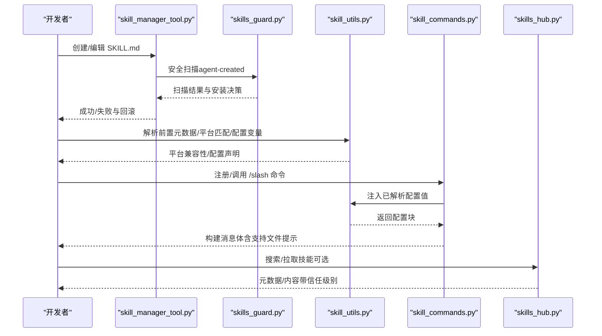
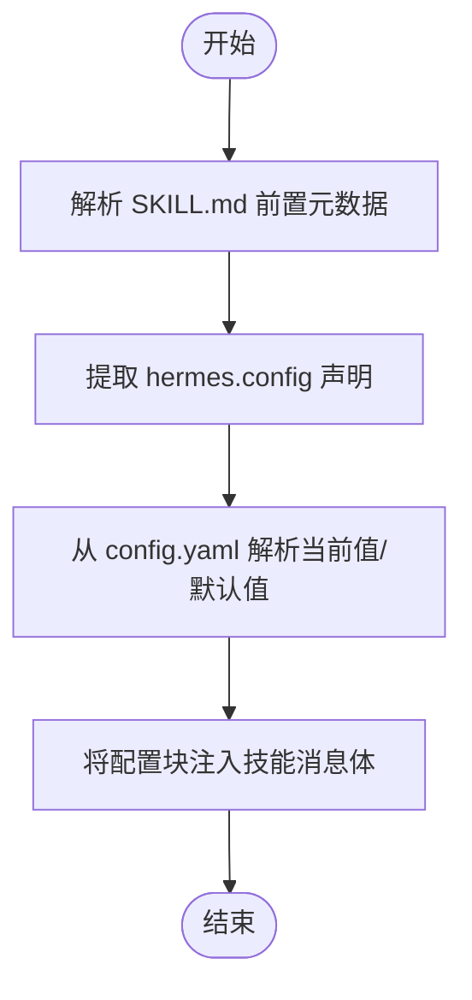
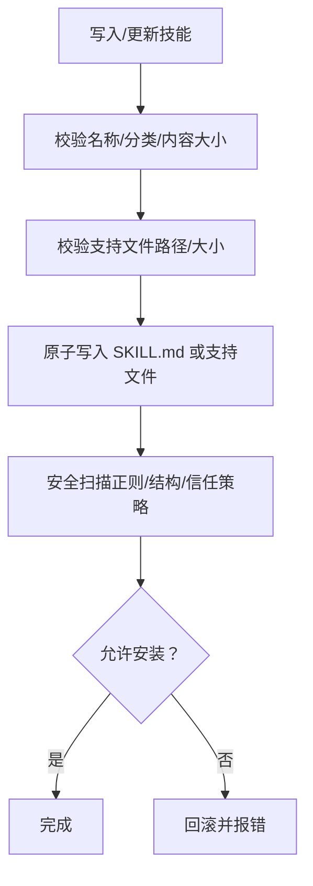
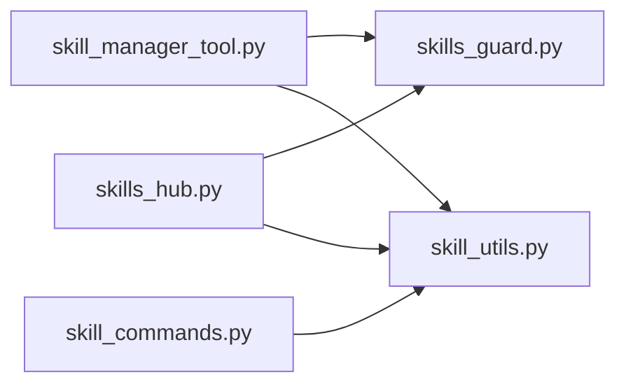

# 技能创建与开发

<cite>
**本文引用的文件**
- [skills/dogfood/SKILL.md](file://skills/dogfood/SKILL.md)
- [skills/red-teaming/godmode/SKILL.md](file://skills/red-teaming/godmode/SKILL.md)
- [optional-skills/email/agentmail/SKILL.md](file://optional-skills/email/agentmail/SKILL.md)
- [skills/devops/webhook-subscriptions/SKILL.md](file://skills/devops/webhook-subscriptions/SKILL.md)
- [tools/skill_manager_tool.py](file://tools/skill_manager_tool.py)
- [tools/skills_guard.py](file://tools/skills_guard.py)
- [agent/skill_utils.py](file://agent/skill_utils.py)
- [agent/skill_commands.py](file://agent/skill_commands.py)
- [tools/skills_hub.py](file://tools/skills_hub.py)
- [tests/tools/test_skill_manager_tool.py](file://tests/tools/test_skill_manager_tool.py)
- [tests/skills/test_telephony_skill.py](file://tests/skills/test_telephony_skill.py)
- [tests/skills/test_youtube_quiz.py](file://tests/skills/test_youtube_quiz.py)
- [website/docs/reference/optional-skills-catalog.md](file://website/docs/reference/optional-skills-catalog.md)
</cite>

## 目录
1. [简介](#简介)
2. [项目结构](#项目结构)
3. [核心组件](#核心组件)
4. [架构总览](#架构总览)
5. [详细组件分析](#详细组件分析)
6. [依赖分析](#依赖分析)
7. [性能考虑](#性能考虑)
8. [故障排查指南](#故障排查指南)
9. [结论](#结论)
10. [附录](#附录)

## 简介
本指南面向希望在 Hermes Agent 中创建与开发“技能（Skill）”的开发者，覆盖从需求分析、设计、编写、验证、安装、运行到持续迭代的全流程。文档重点围绕 SKILL.md 的编写规范（YAML 前置元数据、Markdown 正文结构与最佳实践）、技能模板使用、参数与配置声明、错误处理与安全扫描、性能优化与测试调试方法展开，并通过真实技能示例（QA 测试、红队解狱、邮件集成、Webhook 订阅等）演示从简单任务到复杂工作流的实现路径。

## 项目结构
Hermes 的技能体系由以下关键部分组成：
- 技能内容：以 SKILL.md 为核心，配合 references/templates/scripts/assets 子目录存放支持性文件
- 管理工具：提供技能的创建、编辑、补丁、删除、写入/移除支持文件的能力
- 安全扫描：对社区来源技能进行静态威胁检测与信任策略判定
- 元数据解析与平台适配：解析 SKILL.md 前置元数据，提取条件、配置变量、平台匹配等
- 命令与加载：将技能注册为 /slash 命令或会话预加载内容，注入配置与支持文件提示
- 技能仓库：支持官方、GitHub、Well-Known 等多种来源的技能索引与下载

图示来源
- [tools/skill_manager_tool.py:1-790](file://tools/skill_manager_tool.py#L1-790)
- [tools/skills_guard.py:1-800](file://tools/skills_guard.py#L1-800)
- [agent/skill_utils.py:1-466](file://agent/skill_utils.py#L1-466)
- [agent/skill_commands.py:1-378](file://agent/skill_commands.py#L1-378)
- [tools/skills_hub.py:1-800](file://tools/skills_hub.py#L1-800)

章节来源
- [tools/skill_manager_tool.py:1-790](file://tools/skill_manager_tool.py#L1-790)
- [tools/skills_guard.py:1-800](file://tools/skills_guard.py#L1-800)
- [agent/skill_utils.py:1-466](file://agent/skill_utils.py#L1-466)
- [agent/skill_commands.py:1-378](file://agent/skill_commands.py#L1-378)
- [tools/skills_hub.py:1-800](file://tools/skills_hub.py#L1-800)

## 核心组件
- SKILL.md 编写规范
  - 必须包含 YAML 前置元数据（name、description、version 等），metadata.hermes 可选但推荐用于标签、相关技能等
  - 正文采用 Markdown 结构化描述，建议包含：概述、前提条件、输入、工作流、工具参考、提示与注意事项
- 技能管理工具（skill_manager_tool）
  - 提供 create/edit/patch/delete/write_file/remove_file 等操作
  - 内置名称与分类校验、内容大小限制、路径安全检查、原子写入、安全扫描回滚
- 安全扫描（skills_guard）
  - 基于正则的威胁模式检测（数据外泄、注入、破坏性操作、持久化、网络、混淆等）
  - 信任源策略（builtin/trusted/community/agent-created）决定是否允许安装
- 元数据解析与平台适配（skill_utils）
  - 解析前置元数据，提取平台列表、条件字段、配置变量声明
  - 收集所有已启用技能的配置变量，统一前缀存储于 config.yaml
- 命令与加载（skill_commands）
  - 将技能注册为 /slash 命令，构建消息体时注入配置值与支持文件提示
  - 支持会话预加载多个技能
- 技能仓库（skills_hub）
  - GitHub/Well-Known 源适配，索引缓存与信任级别判定，批量搜索与按标识拉取

章节来源
- [tools/skill_manager_tool.py:150-202](file://tools/skill_manager_tool.py#L150-202)
- [tools/skills_guard.py:41-47](file://tools/skills_guard.py#L41-47)
- [agent/skill_utils.py:52-86](file://agent/skill_utils.py#L52-86)
- [agent/skill_commands.py:209-271](file://agent/skill_commands.py#L209-271)
- [tools/skills_hub.py:284-321](file://tools/skills_hub.py#L284-321)

## 架构总览
下图展示了从 SKILL.md 到运行时加载的关键流程：前置元数据解析、平台与条件匹配、配置变量注入、支持文件发现、安全扫描与安装、命令注册与消息构建。

图示来源
- [tools/skill_manager_tool.py:304-358](file://tools/skill_manager_tool.py#L304-358)
- [tools/skills_guard.py:595-640](file://tools/skills_guard.py#L595-640)
- [agent/skill_utils.py:52-86](file://agent/skill_utils.py#L52-86)
- [agent/skill_commands.py:91-128](file://agent/skill_commands.py#L91-128)
- [tools/skills_hub.py:322-376](file://tools/skills_hub.py#L322-376)

## 详细组件分析

### SKILL.md 编写规范与最佳实践
- 前置元数据（YAML）
  - 必填项：name、description
  - 推荐项：version、metadata.hermes.tags、metadata.hermes.related_skills
  - 元数据 hermes.config 可声明技能所需配置变量（key/description/default/prompt）
- 正文结构建议
  - 概述：简要说明用途与适用场景
  - 前提条件：列出工具/环境要求
  - 输入：明确用户提供的参数与默认值
  - 工作流：分阶段描述步骤，必要时给出代码片段占位
  - 工具参考：表格列出工具及其用途
  - 提示与注意事项：常见陷阱、边界情况、验证方法
- 示例参考
  - QA 自动化测试：[skills/dogfood/SKILL.md:1-162](file://skills/dogfood/SKILL.md#L1-L162)
  - 红队解狱：[skills/red-teaming/godmode/SKILL.md:1-404](file://skills/red-teaming/godmode/SKILL.md#L1-L404)
  - 邮件集成：[optional-skills/email/agentmail/SKILL.md:1-126](file://optional-skills/email/agentmail/SKILL.md#L1-L126)
  - Webhook 订阅：[skills/devops/webhook-subscriptions/SKILL.md:1-181](file://skills/devops/webhook-subscriptions/SKILL.md#L1-L181)

章节来源
- [skills/dogfood/SKILL.md:1-162](file://skills/dogfood/SKILL.md#L1-L162)
- [skills/red-teaming/godmode/SKILL.md:1-404](file://skills/red-teaming/godmode/SKILL.md#L1-L404)
- [optional-skills/email/agentmail/SKILL.md:1-126](file://optional-skills/email/agentmail/SKILL.md#L1-L126)
- [skills/devops/webhook-subscriptions/SKILL.md:1-181](file://skills/devops/webhook-subscriptions/SKILL.md#L1-L181)

### 技能模板使用指南
- 模板类型与结构
  - 简单任务型：如 Webhook 订阅，强调“前置设置—创建订阅—测试—交付”
  - 复杂工作流型：如 Dogfood QA，包含计划、探索、证据收集、分类与报告生成
  - 集成型：如 AgentMail，强调 MCP 服务配置与工具清单
- 模板要点
  - 明确“何时使用”“如何触发”“如何验证”
  - 使用“步骤编号 + 工具调用”的结构，便于自动化执行
  - 在“提示与注意事项”中沉淀常见坑点与规避方法

章节来源
- [skills/devops/webhook-subscriptions/SKILL.md:14-94](file://skills/devops/webhook-subscriptions/SKILL.md#L14-L94)
- [skills/dogfood/SKILL.md:29-136](file://skills/dogfood/SKILL.md#L29-L136)
- [optional-skills/email/agentmail/SKILL.md:30-68](file://optional-skills/email/agentmail/SKILL.md#L30-L68)

### 技能参数定义与配置注入
- 声明配置变量
  - 在前置元数据中通过 metadata.hermes.config 声明逻辑键、描述、默认值与提示文本
  - 系统自动在 config.yaml 中以 skills.config.* 存储，运行时注入到技能消息体
- 运行时注入
  - 加载技能时解析前置元数据，收集配置变量并从 config.yaml 解析当前值
  - 将“技能配置”块附加到消息体末尾，便于模型感知当前上下文

图示来源
- [agent/skill_utils.py:261-317](file://agent/skill_utils.py#L261-317)
- [agent/skill_utils.py:377-412](file://agent/skill_utils.py#L377-412)
- [agent/skill_commands.py:91-128](file://agent/skill_commands.py#L91-128)

章节来源
- [agent/skill_utils.py:261-317](file://agent/skill_utils.py#L261-317)
- [agent/skill_utils.py:377-412](file://agent/skill_utils.py#L377-412)
- [agent/skill_commands.py:91-128](file://agent/skill_commands.py#L91-128)

### 错误处理与安全扫描
- 名称与内容校验
  - 名称/分类合法性、长度限制、字符集限制
  - 前置元数据完整性、正文存在性、内容大小限制
- 路径与文件安全
  - 支持文件路径必须位于允许子目录且不得越界
  - 文件写入采用原子写入，失败回滚
- 安全扫描
  - 对社区来源技能进行威胁模式检测与信任策略判定
  - agent-created 来源默认“需确认”才允许安装
- 回滚机制
  - 任一步骤失败（校验/扫描/写入）均回滚，确保状态一致

图示来源
- [tools/skill_manager_tool.py:304-358](file://tools/skill_manager_tool.py#L304-358)
- [tools/skill_manager_tool.py:511-563](file://tools/skill_manager_tool.py#L511-563)
- [tools/skill_manager_tool.py:566-610](file://tools/skill_manager_tool.py#L566-610)
- [tools/skills_guard.py:595-640](file://tools/skills_guard.py#L595-640)
- [tools/skills_guard.py:642-677](file://tools/skills_guard.py#L642-677)

章节来源
- [tools/skill_manager_tool.py:111-147](file://tools/skill_manager_tool.py#L111-147)
- [tools/skill_manager_tool.py:229-254](file://tools/skill_manager_tool.py#L229-254)
- [tools/skill_manager_tool.py:511-563](file://tools/skill_manager_tool.py#L511-563)
- [tools/skills_guard.py:41-47](file://tools/skills_guard.py#L41-47)
- [tools/skills_guard.py:595-640](file://tools/skills_guard.py#L595-640)

### 性能优化技巧
- 前置元数据解析
  - 使用懒加载 YAML 解析器，避免重复导入开销
- 索引与缓存
  - 技能仓库对 GitHub/Well-Known 索引进行 TTL 缓存，减少重复请求
- 平台与禁用过滤
  - 在加载前先做平台匹配与禁用列表过滤，避免无效加载
- 建议
  - 控制 SKILL.md 与支持文件大小，避免超过字符/字节上限
  - 合理拆分长技能为 references/templates/scripts/assets，提升可维护性

章节来源
- [agent/skill_utils.py:34-46](file://agent/skill_utils.py#L34-46)
- [tools/skills_hub.py:55-56](file://tools/skills_hub.py#L55-56)
- [tools/skill_manager_tool.py:83-98](file://tools/skill_manager_tool.py#L83-L98)

### 技能测试与调试
- 单元测试与回归
  - 使用 pytest 对脚本模块进行模拟与断言，覆盖异常路径与边界条件
  - 示例：Telephony 技能保存密钥、状态更新、消息过滤；YouTube Quiz 依赖缺失与转录抓取
- 调试技巧
  - 在技能中提供“验证/测试”步骤，输出关键状态与路径
  - 使用“支持文件提示”引导用户查看 references/templates/scripts/assets 下的内容
  - 对外部服务（如 Webhook、MCP）提供健康检查与日志定位方法

章节来源
- [tests/skills/test_telephony_skill.py:29-50](file://tests/skills/test_telephony_skill.py#L29-L50)
- [tests/skills/test_telephony_skill.py:113-167](file://tests/skills/test_telephony_skill.py#L113-L167)
- [tests/skills/test_youtube_quiz.py:41-62](file://tests/skills/test_youtube_quiz.py#L41-L62)
- [tests/skills/test_youtube_quiz.py:64-115](file://tests/skills/test_youtube_quiz.py#L64-L115)
- [skills/devops/webhook-subscriptions/SKILL.md:171-181](file://skills/devops/webhook-subscriptions/SKILL.md#L171-L181)

### 从需求到发布的完整流程
- 需求分析
  - 明确目标用户、触发条件、前置条件与验收标准
- 设计与模板选择
  - 选择合适模板（简单任务/复杂工作流/集成型），填充步骤与工具
- 编写 SKILL.md
  - 完整前置元数据与正文结构，声明配置变量与平台要求
- 开发与本地验证
  - 使用 skill_manager_tool 的 create/patch/edit，结合安全扫描与最小化测试
- 发布与分发
  - 可提交至官方仓库或通过 skills_hub 的 GitHub/Well-Known 源分发
- 运行与监控
  - 注册为 /slash 命令或会话预加载，观察配置注入与支持文件提示效果

章节来源
- [tools/skill_manager_tool.py:616-675](file://tools/skill_manager_tool.py#L616-675)
- [tools/skills_hub.py:322-376](file://tools/skills_hub.py#L322-376)
- [agent/skill_commands.py:209-271](file://agent/skill_commands.py#L209-271)

## 依赖分析
- 组件耦合
  - skill_manager_tool 依赖 skills_guard 进行安全扫描；依赖 skill_utils 的路径与内容校验
  - skill_commands 依赖 skill_utils 的前置元数据解析与配置注入
  - skills_hub 依赖 GitHub/Well-Known 源与缓存机制
- 外部依赖
  - YAML 解析、HTTPX、正则表达式、时间与哈希计算
- 循环依赖
  - 未见循环导入；各模块职责清晰，通过工具函数与数据类传递信息

图示来源
- [tools/skill_manager_tool.py:49-53](file://tools/skill_manager_tool.py#L49-53)
- [agent/skill_commands.py:99-104](file://agent/skill_commands.py#L99-104)
- [tools/skills_hub.py:35-37](file://tools/skills_hub.py#L35-37)

章节来源
- [tools/skill_manager_tool.py:49-53](file://tools/skill_manager_tool.py#L49-53)
- [agent/skill_commands.py:99-104](file://agent/skill_commands.py#L99-104)
- [tools/skills_hub.py:35-37](file://tools/skills_hub.py#L35-37)

## 性能考虑
- 解析与加载
  - 前置元数据解析采用懒加载 YAML，减少模块级初始化成本
  - 技能仓库索引缓存降低频繁请求带来的延迟
- 内容与文件
  - 对 SKILL.md 与支持文件设置字符/字节上限，避免大文件影响加载性能
  - 支持文件路径严格校验，防止深层遍历与无效 IO
- 平台与条件
  - 在加载前进行平台匹配与禁用过滤，减少不必要的后续处理

章节来源
- [agent/skill_utils.py:34-46](file://agent/skill_utils.py#L34-46)
- [tools/skills_hub.py:55-56](file://tools/skills_hub.py#L55-56)
- [tools/skill_manager_tool.py:83-98](file://tools/skill_manager_tool.py#L83-L98)

## 故障排查指南
- 常见问题与定位
  - 名称/分类非法：检查字符集、长度与路径安全性
  - 前置元数据不完整：确认 YAML 闭合、必需字段齐全
  - 安全扫描阻断：根据扫描报告定位高危模式（外泄、注入、破坏性、持久化等）
  - 平台不兼容：确认 platforms 字段与当前系统匹配
  - Webhook 不生效：检查网关运行状态、签名匹配、端口可达性
- 回滚与恢复
  - 写入失败自动回滚，确保文件系统一致性
  - 删除技能后清理空目录，避免残留

章节来源
- [tools/skill_manager_tool.py:111-147](file://tools/skill_manager_tool.py#L111-147)
- [tools/skill_manager_tool.py:304-358](file://tools/skill_manager_tool.py#L304-358)
- [tools/skills_guard.py:642-677](file://tools/skills_guard.py#L642-677)
- [skills/devops/webhook-subscriptions/SKILL.md:171-181](file://skills/devops/webhook-subscriptions/SKILL.md#L171-L181)

## 结论
通过标准化的 SKILL.md 编写规范、完善的管理工具链、严格的安全扫描与信任策略、以及可扩展的仓库与命令加载机制，Hermes Agent 为技能的创建、验证、发布与运行提供了稳健的基础设施。遵循本文档的流程与最佳实践，开发者可以高效地从需求分析到最终发布，构建高质量、可维护、可复用的技能，并在复杂工作流中发挥最大价值。

## 附录

### SKILL.md 示例参考
- QA 自动化测试：[skills/dogfood/SKILL.md:1-162](file://skills/dogfood/SKILL.md#L1-L162)
- 红队解狱：[skills/red-teaming/godmode/SKILL.md:1-404](file://skills/red-teaming/godmode/SKILL.md#L1-L404)
- 邮件集成：[optional-skills/email/agentmail/SKILL.md:1-126](file://optional-skills/email/agentmail/SKILL.md#L1-L126)
- Webhook 订阅：[skills/devops/webhook-subscriptions/SKILL.md:1-181](file://skills/devops/webhook-subscriptions/SKILL.md#L1-L181)

### 参与贡献与目录
- 可选技能贡献指南：[website/docs/reference/optional-skills-catalog.md:146-154](file://website/docs/reference/optional-skills-catalog.md#L146-L154)