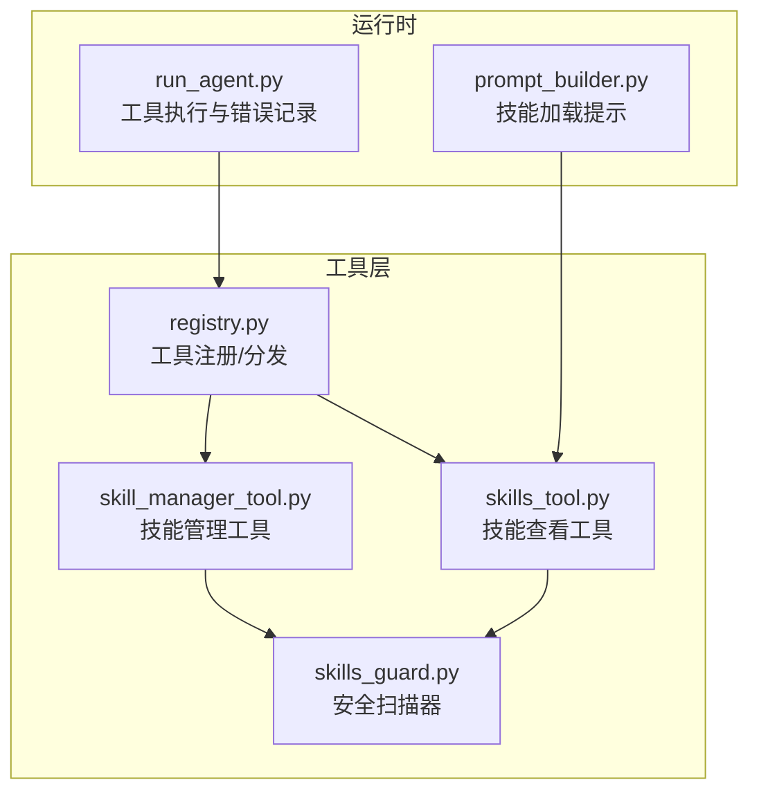
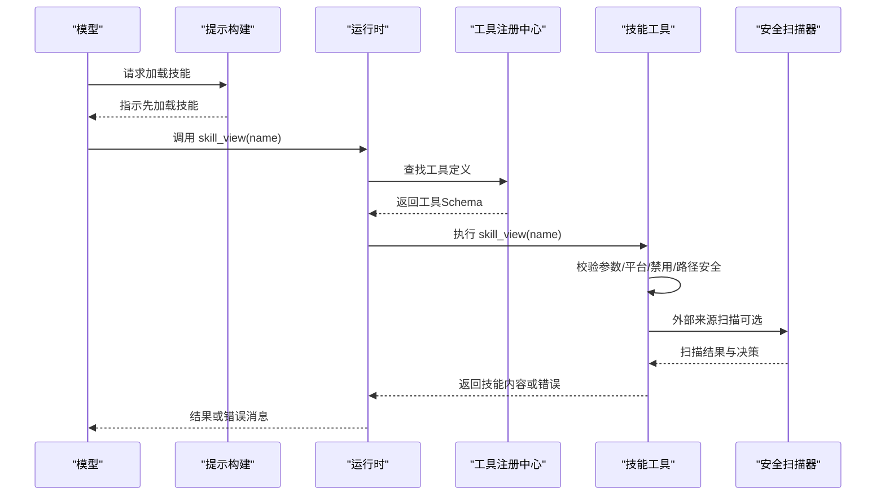
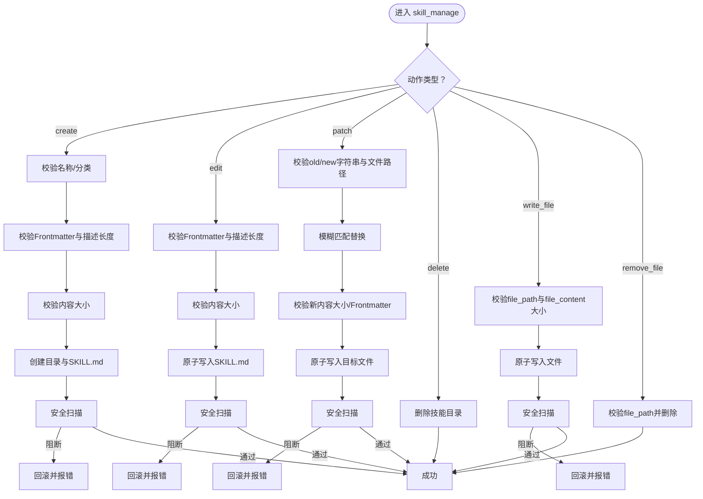
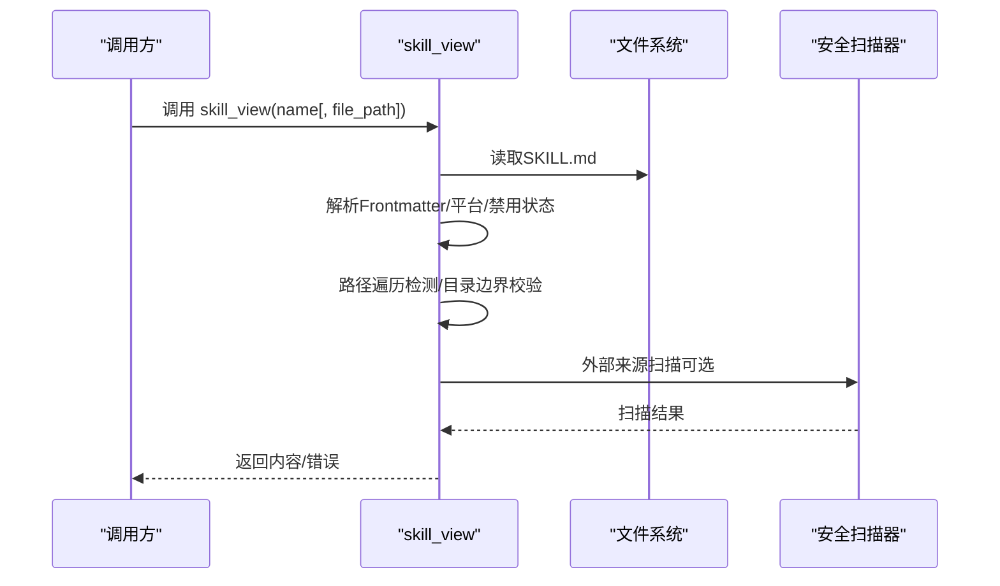
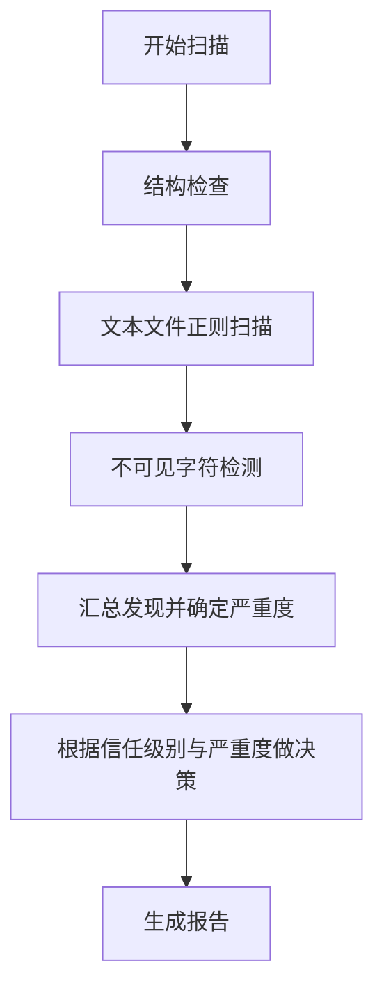
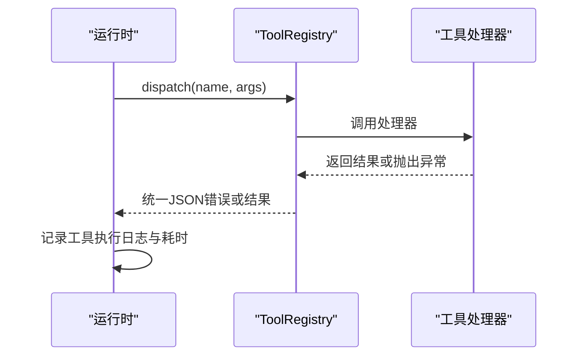
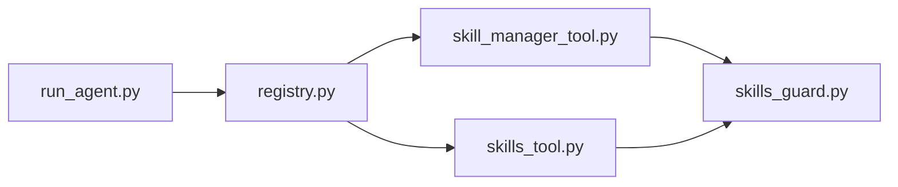

# 技能参数与错误处理

<cite>
**本文档引用的文件**
- [skill_manager_tool.py](file://tools/skill_manager_tool.py)
- [skills_tool.py](file://tools/skills_tool.py)
- [skills_guard.py](file://tools/skills_guard.py)
- [registry.py](file://tools/registry.py)
- [run_agent.py](file://run_agent.py)
- [prompt_builder.py](file://agent/prompt_builder.py)
- [test_skill_manager_tool.py](file://tests/tools/test_skill_manager_tool.py)
- [test_skills_guard.py](file://tests/tools/test_skills_guard.py)
- [test_skill_view_traversal.py](file://tests/tools/test_skill_view_traversal.py)
- [test_registry.py](file://tests/tools/test_registry.py)
</cite>

## 目录
1. [简介](#简介)
2. [项目结构](#项目结构)
3. [核心组件](#核心组件)
4. [架构总览](#架构总览)
5. [详细组件分析](#详细组件分析)
6. [依赖关系分析](#依赖关系分析)
7. [性能考虑](#性能考虑)
8. [故障排除指南](#故障排除指南)
9. [结论](#结论)

## 简介
本技术指南聚焦于Hermes Agent中“技能”（Skill）的参数规范与错误处理机制，覆盖以下关键主题：
- 技能参数定义规范：参数类型、必填性、默认值、校验规则
- 技能执行过程中的错误处理：参数校验失败、文件访问错误、安全扫描阻断等
- 错误码与错误消息参考：统一的错误返回格式与常见问题定位
- 调试技巧与性能优化：参数校验、路径安全、并发与异步处理
- 边界情况与异常输入：空输入、越界、注入检测、权限与平台兼容性

## 项目结构
围绕技能参数与错误处理的关键模块如下：
- 工具注册与分发：tools/registry.py 提供统一的工具注册、可用性检查与调用分发
- 技能管理工具：tools/skill_manager_tool.py 定义技能创建、编辑、补丁、删除、写入/删除支持文件的参数与校验
- 技能查看工具：tools/skills_tool.py 支持列出与加载技能内容，含平台匹配、禁用过滤、路径安全与注入检测
- 安全扫描器：tools/skills_guard.py 对外部来源技能进行静态扫描与安装决策
- 运行时工具执行：run_agent.py 中的工具执行流程负责捕获工具异常并记录日志
- 参数类型强制：model_tools.py 的参数类型强制逻辑对字符串参数进行类型转换
- 前端提示构建：agent/prompt_builder.py 指导模型在使用技能前先加载并遵循技能指令

**图表来源**
- [registry.py:100-320](file://tools/registry.py#L100-L320)
- [skill_manager_tool.py:616-790](file://tools/skill_manager_tool.py#L616-L790)
- [skills_tool.py:804-1421](file://tools/skills_tool.py#L804-L1421)
- [skills_guard.py:595-752](file://tools/skills_guard.py#L595-L752)
- [run_agent.py:7488-7979](file://run_agent.py#L7488-L7979)
- [prompt_builder.py:777-799](file://agent/prompt_builder.py#L777-L799)

**章节来源**
- [registry.py:1-483](file://tools/registry.py#L1-L483)
- [skill_manager_tool.py:1-790](file://tools/skill_manager_tool.py#L1-L790)
- [skills_tool.py:1-1421](file://tools/skills_tool.py#L1-L1421)
- [skills_guard.py:1-929](file://tools/skills_guard.py#L1-L929)
- [run_agent.py:7488-7979](file://run_agent.py#L7488-L7979)
- [prompt_builder.py:777-799](file://agent/prompt_builder.py#L777-L799)

## 核心组件
- 工具注册中心（ToolRegistry）
  - 统一注册工具函数及其OpenAI函数式Schema
  - 可用性检查（check_fn）与工具集（toolset）管理
  - 分发调用时捕获异常并返回统一错误格式
- 技能管理工具（skill_manage）
  - 动作：create、edit、patch、delete、write_file、remove_file
  - 参数校验：名称、分类、内容大小、文件路径合法性、原子写入
  - 安全扫描：安装后二次扫描，阻断危险技能
- 技能查看工具（skills_list、skill_view）
  - 列表与详情：元数据、前置条件、环境变量需求、关联文件
  - 平台匹配与禁用过滤、路径遍历防护、注入检测
- 安全扫描器（scan_skill、should_allow_install）
  - 正则威胁模式、不可见字符、结构限制（文件数/大小/二进制）
  - 信任源策略与安装决策（allow/ask/block）

**章节来源**
- [registry.py:176-320](file://tools/registry.py#L176-L320)
- [skill_manager_tool.py:616-790](file://tools/skill_manager_tool.py#L616-L790)
- [skills_tool.py:647-1421](file://tools/skills_tool.py#L647-L1421)
- [skills_guard.py:595-752](file://tools/skills_guard.py#L595-L752)

## 架构总览
技能参数与错误处理在系统中的交互流程如下：

**图表来源**
- [prompt_builder.py:777-799](file://agent/prompt_builder.py#L777-L799)
- [run_agent.py:7488-7979](file://run_agent.py#L7488-L7979)
- [registry.py:292-320](file://tools/registry.py#L292-L320)
- [skills_tool.py:804-1421](file://tools/skills_tool.py#L804-L1421)
- [skills_guard.py:595-752](file://tools/skills_guard.py#L595-L752)

## 详细组件分析

### 技能管理工具（skill_manage）参数与校验
- 动作与参数
  - create：name、content（必填）、category（可选）
  - edit：name、content（必填）
  - patch：name、old_string（必填）、new_string（必填）、file_path（可选，默认SKILL.md）、replace_all（布尔）
  - delete：name
  - write_file：name、file_path（必填，仅允许references/templates/scripts/assets下）、file_content（必填）
  - remove_file：name、file_path（必填）
- 参数类型与约束
  - 字符串类型：通过model_tools.py的参数类型强制进行整数/数字/布尔转换
  - 必填性：各动作对必要字段有明确要求；缺失时报错
  - 长度与范围：名称与描述长度上限、单文件大小上限、技能内容字符上限
  - 文件路径：仅允许指定子目录，禁止路径穿越，必须位于技能目录内
- 内容校验
  - YAML Frontmatter：必须以“---”开头与闭合，包含name与description，body非空
  - 内容大小：超过阈值提示拆分为多个文件
- 安全扫描
  - 安装后对技能目录进行扫描，若判定危险则回滚并返回错误
- 错误返回
  - 统一使用工具注册中心的tool_error封装JSON错误消息

**图表来源**
- [skill_manager_tool.py:616-790](file://tools/skill_manager_tool.py#L616-L790)
- [skills_guard.py:595-752](file://tools/skills_guard.py#L595-L752)
- [model_tools.py:343-384](file://model_tools.py#L343-L384)

**章节来源**
- [skill_manager_tool.py:111-202](file://tools/skill_manager_tool.py#L111-L202)
- [skill_manager_tool.py:229-266](file://tools/skill_manager_tool.py#L229-L266)
- [skill_manager_tool.py:304-509](file://tools/skill_manager_tool.py#L304-L509)
- [skill_manager_tool.py:511-610](file://tools/skill_manager_tool.py#L511-L610)
- [skills_guard.py:595-752](file://tools/skills_guard.py#L595-L752)
- [model_tools.py:343-384](file://model_tools.py#L343-L384)

### 技能查看工具（skills_list、skill_view）参数与校验
- 参数
  - skills_list：category（可选）
  - skill_view：name（必填）、file_path（可选）
- 校验与行为
  - 插件技能命名空间校验与解析
  - 平台匹配检查（platforms字段）
  - 禁用技能过滤（用户配置）
  - 路径遍历检测与目录边界校验
  - 注入检测（提示词注入模式）
  - 环境变量与凭证文件需求收集与注册
- 错误返回
  - 统一JSON错误消息，包含可用文件列表与提示

**图表来源**
- [skills_tool.py:804-1421](file://tools/skills_tool.py#L804-L1421)
- [skills_guard.py:595-752](file://tools/skills_guard.py#L595-L752)

**章节来源**
- [skills_tool.py:647-713](file://tools/skills_tool.py#L647-L713)
- [skills_tool.py:804-1421](file://tools/skills_tool.py#L804-L1421)

### 安全扫描器（scan_skill、should_allow_install）
- 扫描内容
  - 正则威胁模式（exfiltration、injection、destructive、persistence、network、obfuscation等）
  - 不可见Unicode字符检测
  - 结构检查（文件数、总大小、单文件大小、二进制文件、符号链接）
- 信任策略
  - builtin/trusted/community/agent-created四种信任级别
  - 基于信任级别与扫描结论的安装决策（allow/ask/block）
- 报告格式
  - 包含发现项、严重程度分组与最终决策说明

**图表来源**
- [skills_guard.py:595-752](file://tools/skills_guard.py#L595-L752)
- [skills_guard.py:752-929](file://tools/skills_guard.py#L752-L929)

**章节来源**
- [skills_guard.py:595-752](file://tools/skills_guard.py#L595-L752)
- [skills_guard.py:752-929](file://tools/skills_guard.py#L752-L929)

### 工具注册与错误处理（ToolRegistry、run_agent）
- 工具注册与分发
  - 注册时提供Schema、处理器、可用性检查函数
  - 分发时捕获异常并返回统一错误格式
- 运行时工具执行
  - 工具调用线程中捕获异常，记录耗时与结果摘要
  - 将错误结果写入持久化错误日志，便于UI展示

**图表来源**
- [registry.py:292-320](file://tools/registry.py#L292-L320)
- [run_agent.py:7488-7979](file://run_agent.py#L7488-L7979)

**章节来源**
- [registry.py:292-320](file://tools/registry.py#L292-L320)
- [run_agent.py:7488-7979](file://run_agent.py#L7488-L7979)

## 依赖关系分析
- 工具注册中心集中管理所有工具的Schema与处理器，避免重复维护
- 技能管理与查看工具依赖安全扫描器对外部来源进行二次把关
- 运行时在工具执行阶段统一捕获异常并记录，保证错误可见性
- 参数类型强制在工具调用前进行，减少下游处理复杂度

**图表来源**
- [registry.py:100-320](file://tools/registry.py#L100-L320)
- [skill_manager_tool.py:616-790](file://tools/skill_manager_tool.py#L616-L790)
- [skills_tool.py:804-1421](file://tools/skills_tool.py#L804-L1421)
- [skills_guard.py:595-752](file://tools/skills_guard.py#L595-L752)
- [run_agent.py:7488-7979](file://run_agent.py#L7488-L7979)

**章节来源**
- [registry.py:100-320](file://tools/registry.py#L100-L320)
- [skill_manager_tool.py:616-790](file://tools/skill_manager_tool.py#L616-L790)
- [skills_tool.py:804-1421](file://tools/skills_tool.py#L804-L1421)
- [skills_guard.py:595-752](file://tools/skills_guard.py#L595-L752)
- [run_agent.py:7488-7979](file://run_agent.py#L7488-L7979)

## 性能考虑
- 原子写入：技能内容与支持文件采用临时文件+原子替换，避免部分写入导致的不一致与重试成本
- 结构限制：通过最大文件数、总大小与单文件大小限制，降低扫描与加载开销
- 路径安全：严格的路径遍历检测与目录边界校验，避免无效IO与潜在攻击面
- 并发与异步：工具分发支持异步处理器桥接，工具执行线程内记录耗时，便于性能监控
- 类型强制：在工具调用前进行参数类型转换，减少下游处理分支判断

[本节为通用指导，无需特定文件引用]

## 故障排除指南

### 参数校验失败
- 常见原因
  - 缺少必填参数（如create缺少content、patch缺少old_string/new_string）
  - 名称/分类不符合命名规范（非法字符、超长、大小写）
  - Frontmatter格式错误（未闭合、缺少必需字段、描述过长）
  - 文件路径不合法（不在允许子目录、包含路径穿越）
- 定位方法
  - 查看工具返回的错误消息，确认具体字段与违规原因
  - 使用skills_list与skill_view核对技能是否存在与可读
- 解决方案
  - 补充或修正必填参数
  - 严格遵循命名与Frontmatter格式
  - 使用相对路径且限定在references/templates/scripts/assets下

**章节来源**
- [skill_manager_tool.py:111-202](file://tools/skill_manager_tool.py#L111-L202)
- [skill_manager_tool.py:229-266](file://tools/skill_manager_tool.py#L229-L266)
- [skills_tool.py:804-1421](file://tools/skills_tool.py#L804-L1421)

### 文件访问错误
- 常见原因
  - 技能文件编码错误（非UTF-8）
  - 目标文件不存在或被删除
  - 路径穿越或超出技能目录边界
- 定位方法
  - 检查file_path是否符合允许子目录与相对路径要求
  - 确认技能目录存在且具备读权限
- 解决方案
  - 使用正确的相对路径与允许的子目录
  - 确保文件存在后再请求读取

**章节来源**
- [skills_tool.py:1013-1112](file://tools/skills_tool.py#L1013-L1112)
- [test_skill_view_traversal.py:73-83](file://tests/tools/test_skill_view_traversal.py#L73-L83)

### 安全扫描阻断
- 常见原因
  - 外部来源技能触发高危/危险扫描结论
  - agent-created技能触发“需要确认”的危险发现
- 定位方法
  - 查看扫描报告中的发现项与严重度
  - 确认信任级别与安装策略
- 解决方案
  - 修复技能内容中的可疑模式
  - 使用--force（谨慎）或在本地CLI中手动确认
  - 将技能迁移到受信任来源或内置目录

**章节来源**
- [skills_guard.py:642-713](file://tools/skills_guard.py#L642-L713)
- [skills_guard.py:752-929](file://tools/skills_guard.py#L752-L929)
- [test_skills_guard.py:75-85](file://tests/tools/test_skills_guard.py#L75-L85)

### 工具执行异常
- 常见原因
  - 工具处理器内部异常
  - 工具可用性检查失败（check_fn）
- 定位方法
  - 查看运行时日志中的工具执行摘要与耗时
  - 检查工具注册中心的可用性检查结果
- 解决方案
  - 修复工具实现或其依赖
  - 调整环境满足check_fn要求

**章节来源**
- [run_agent.py:7488-7979](file://run_agent.py#L7488-L7979)
- [registry.py:292-320](file://tools/registry.py#L292-L320)
- [test_registry.py:199-267](file://tests/tools/test_registry.py#L199-L267)

### 参数类型与默认值
- 类型强制
  - 对字符串参数尝试转换为期望类型（integer/number/boolean/联合类型）
  - 失败时保留原字符串，避免破坏调用方意图
- 默认值
  - 工具Schema中声明的默认值由调用方在参数传入时提供
  - 未传入的可选参数按Schema与业务逻辑处理

**章节来源**
- [model_tools.py:343-384](file://model_tools.py#L343-L384)
- [skill_manager_tool.py:702-768](file://tools/skill_manager_tool.py#L702-L768)
- [skills_tool.py:1382-1399](file://tools/skills_tool.py#L1382-L1399)

### 边界情况与异常输入
- 空输入与越界
  - 空名称、空内容、空文件路径均会触发错误
  - 超长名称/描述/内容将被拒绝
- 注入检测
  - 对提示词注入模式进行检测并记录警告
- 平台与禁用
  - 不支持当前平台或被用户禁用的技能将被拒绝

**章节来源**
- [test_skill_manager_tool.py:67-137](file://tests/tools/test_skill_manager_tool.py#L67-L137)
- [skills_tool.py:968-1011](file://tools/skills_tool.py#L968-L1011)
- [skills_tool.py:510-525](file://tools/skills_tool.py#L510-L525)

## 结论
Hermes Agent的技能参数与错误处理体系通过“严格的参数校验 + 路径与注入安全 + 外部来源安全扫描 + 统一的工具注册与错误格式”，在保障安全性的同时提供了清晰的错误反馈与可观测性。实践中应：
- 严格遵循参数Schema与命名规范
- 使用相对路径与允许的子目录
- 在修改技能后关注安全扫描报告
- 利用工具注册中心与运行时日志进行问题定位与性能优化