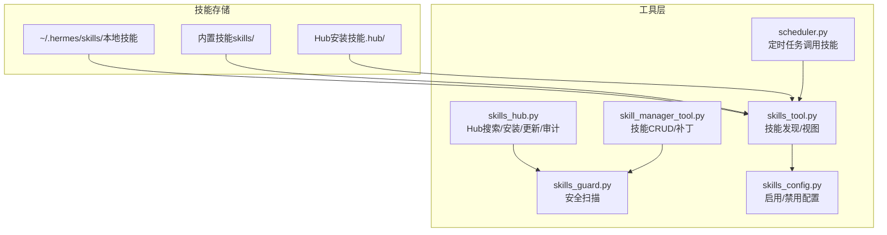
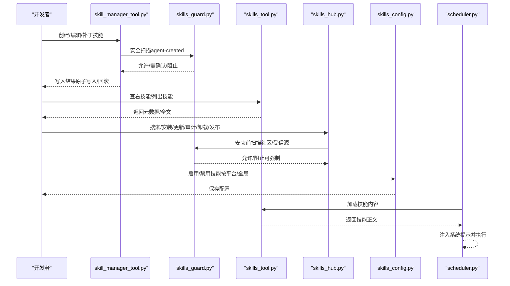
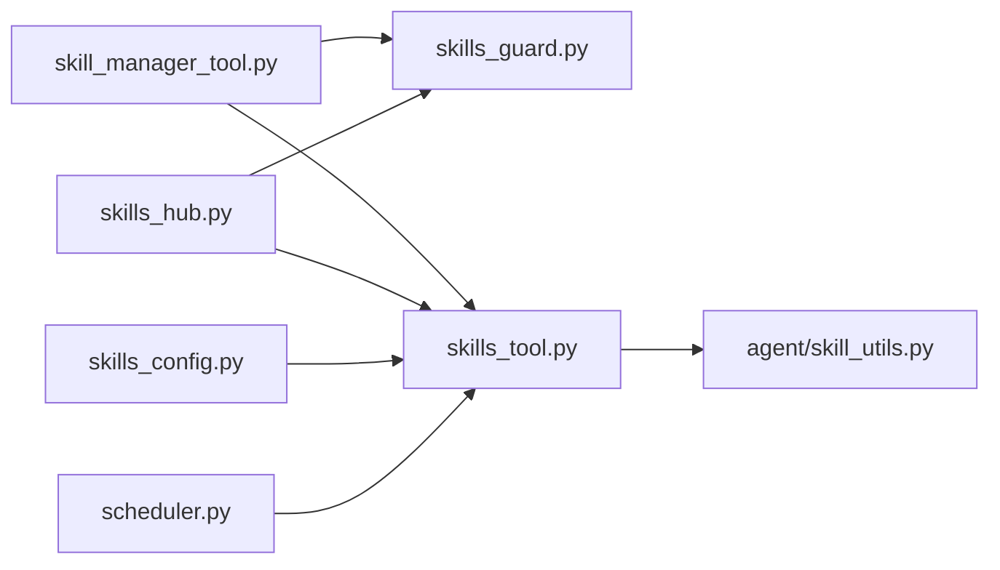

# 技能开发流程

<cite>
**本文引用的文件**
- [README.md](file://README.md)
- [skills_tool.py](file://tools/skills_tool.py)
- [skill_manager_tool.py](file://tools/skill_manager_tool.py)
- [skills_guard.py](file://tools/skills_guard.py)
- [skills_hub.py](file://hermes_cli/skills_hub.py)
- [skills_config.py](file://hermes_cli/skills_config.py)
- [scheduler.py](file://cron/scheduler.py)
- [github-auth SKILL.md](file://skills/github/github-auth/SKILL.md)
- [dogfood SKILL.md](file://skills/dogfood/SKILL.md)
- [agentmail SKILL.md](file://optional-skills/email/agentmail/SKILL.md)
- [test_skills_tool.py](file://tests/tools/test_skills_tool.py)
- [test_skill_manager_tool.py](file://tests/tools/test_skill_manager_tool.py)
- [test_skills_hub.py](file://tests/tools/test_skills_hub.py)
</cite>

## 目录
1. [简介](#简介)
2. [项目结构](#项目结构)
3. [核心组件](#核心组件)
4. [架构总览](#架构总览)
5. [详细组件分析](#详细组件分析)
6. [依赖关系分析](#依赖关系分析)
7. [性能考量](#性能考量)
8. [故障排查指南](#故障排查指南)
9. [结论](#结论)
10. [附录](#附录)

## 简介
本指南面向Hermes Agent技能开发者，系统阐述从需求分析到技能发布的完整开发周期与最佳实践。内容覆盖技能创建时机判断、命名规范、目录结构与版本管理、生命周期管理（草稿、测试、发布、维护）、触发条件与步骤编号、陷阱预防与验证步骤，并提供可直接参考的开发示例与常见问题解决方案。

## 项目结构
Hermes Agent的技能体系由“本地技能目录”“内置技能”“技能中心（Hub）”三部分构成，统一收敛于~/.hermes/skills/，并通过工具链实现发现、加载、安全扫描与发布。

图表来源
- [skills_tool.py:1-120](file://tools/skills_tool.py#L1-L120)
- [skill_manager_tool.py:1-120](file://tools/skill_manager_tool.py#L1-L120)
- [skills_guard.py:1-120](file://tools/skills_guard.py#L1-L120)
- [skills_hub.py:1-120](file://hermes_cli/skills_hub.py#L1-L120)
- [skills_config.py:1-120](file://hermes_cli/skills_config.py#L1-L120)
- [scheduler.py:543-577](file://cron/scheduler.py#L543-L577)

章节来源
- [README.md:87-108](file://README.md#L87-L108)
- [skills_tool.py:14-68](file://tools/skills_tool.py#L14-L68)

## 核心组件
- 技能发现与视图：tools/skills_tool.py提供skills_list与skill_view，支持按类别过滤、平台匹配、描述截断与外部目录扫描。
- 技能管理器：tools/skill_manager_tool.py提供create/edit/patch/delete/write_file/remove_file等操作，含名称/分类/内容校验、路径安全检查、原子写入与安全扫描回滚。
- 安全扫描：tools/skills_guard.py对技能进行威胁模式匹配、结构检查与信任策略判定，决定是否允许安装或需要人工确认。
- 技能中心：hermes_cli/skills_hub.py提供搜索、浏览、安装、更新、审计、卸载与发布能力，支持多源与缓存失效。
- 配置开关：hermes_cli/skills_config.py提供按平台/全局的技能启用/禁用配置。
- 定时调度：cron/scheduler.py在计划任务中加载技能内容并注入系统提示。

章节来源
- [skills_tool.py:527-713](file://tools/skills_tool.py#L527-L713)
- [skill_manager_tool.py:616-790](file://tools/skill_manager_tool.py#L616-L790)
- [skills_guard.py:595-713](file://tools/skills_guard.py#L595-L713)
- [skills_hub.py:310-466](file://hermes_cli/skills_hub.py#L310-L466)
- [skills_config.py:27-178](file://hermes_cli/skills_config.py#L27-L178)
- [scheduler.py:543-577](file://cron/scheduler.py#L543-L577)

## 架构总览
技能开发与运行的关键流程如下：

图表来源
- [skill_manager_tool.py:56-75](file://tools/skill_manager_tool.py#L56-L75)
- [skills_guard.py:642-677](file://tools/skills_guard.py#L642-L677)
- [skills_tool.py:647-713](file://tools/skills_tool.py#L647-L713)
- [skills_hub.py:310-466](file://hermes_cli/skills_hub.py#L310-L466)
- [skills_config.py:27-178](file://hermes_cli/skills_config.py#L27-L178)
- [scheduler.py:543-577](file://cron/scheduler.py#L543-L577)

## 详细组件分析

### 技能创建与命名规范
- 命名规则
  - 仅允许小写字母、数字、点、连字符与下划线；必须以字母或数字开头；最大长度64字符。
  - 分类（可选）为单级目录名，同样遵循上述命名规则。
- 内容要求
  - 必须包含YAML前言块，包含name与description字段；description不得超过1024字符。
  - 正文必须在前言块之后存在。
  - 单个SKILL.md字符数上限约10万字符；单个支持文件不超过1MiB。
- 路径安全
  - 支持文件仅允许写入references、templates、scripts、assets子目录，且禁止路径穿越与仅目录输入。
- 原子写入与回滚
  - 使用临时文件+替换的方式保证写入一致性；安全扫描失败时自动回滚。
- 示例参考
  - GitHub认证技能：展示检测流程、两套方法与验证步骤。
  - 系统化QA技能：明确输入、五阶段工作流、工具清单与验证要点。
  - AgentMail技能：强调前置条件、MCP配置与验证步骤。

章节来源
- [skill_manager_tool.py:111-148](file://tools/skill_manager_tool.py#L111-L148)
- [skill_manager_tool.py:150-187](file://tools/skill_manager_tool.py#L150-L187)
- [skill_manager_tool.py:229-266](file://tools/skill_manager_tool.py#L229-L266)
- [skill_manager_tool.py:268-298](file://tools/skill_manager_tool.py#L268-L298)
- [github-auth SKILL.md:1-247](file://skills/github/github-auth/SKILL.md#L1-L247)
- [dogfood SKILL.md:1-162](file://skills/dogfood/SKILL.md#L1-L162)
- [agentmail SKILL.md:1-126](file://optional-skills/email/agentmail/SKILL.md#L1-L126)

### 目录结构与版本管理
- 目录布局
  - ~/.hermes/skills/<分类>/<技能名>/SKILL.md（主指令）
  - 可选子目录：references（参考资料）、templates（模板）、scripts（脚本）、assets（资源）。
- 版本管理
  - 前言块支持version字段；Hub通过内容哈希跟踪变更，支持“已更新/待更新”检测。
  - 更新时可强制覆盖，安装后可清理系统提示缓存以即时生效。

章节来源
- [skills_tool.py:14-68](file://tools/skills_tool.py#L14-L68)
- [skills_guard.py:715-728](file://tools/skills_guard.py#L715-L728)
- [skills_hub.py:576-617](file://hermes_cli/skills_hub.py#L576-L617)

### 生命周期管理：草稿、测试、发布与维护
- 草稿创建
  - 使用skill_manage(action="create")创建新技能；建议先在本地编写并自测。
- 测试验证
  - 在交互式会话中调用技能，观察输出与工具使用情况；必要时使用patch修正。
  - 对于Hub安装的技能，可先执行安全扫描与审计。
- 正式发布
  - 本地技能可通过hermes skills publish上传至GitHub（需认证），或提交至ClawHub（当前未自动化）。
- 持续维护
  - 定期检查更新（do_check/do_update），对发现的问题及时patch并重新扫描。
  - 通过skills_config.py按平台/全局禁用/启用技能，避免误用。

章节来源
- [skills_hub.py:730-797](file://hermes_cli/skills_hub.py#L730-L797)
- [skills_hub.py:576-617](file://hermes_cli/skills_hub.py#L576-L617)
- [skills_config.py:27-178](file://hermes_cli/skills_config.py#L27-L178)

### 触发条件定义、步骤编号与验证
- 触发条件
  - 明确“何时调用此技能”，例如“复杂任务成功（多次调用）”“错误修复后”“用户纠正后的有效路径”“非平凡工作流被发现”。
- 步骤编号
  - 使用有序编号（如“步骤1/步骤2/…”）与精确命令，减少歧义。
- 陷阱预防
  - 避免硬编码凭据、避免危险命令（如rm -rf、格式化磁盘）、避免反序列化/动态执行字符串。
- 验证步骤
  - 提供可重复的验证命令与预期输出；在技能末尾给出验证清单。

章节来源
- [skill_manager_tool.py:681-701](file://tools/skill_manager_tool.py#L681-L701)
- [skills_guard.py:82-484](file://tools/skills_guard.py#L82-L484)
- [github-auth SKILL.md:236-247](file://skills/github/github-auth/SKILL.md#L236-L247)
- [dogfood SKILL.md:118-137](file://skills/dogfood/SKILL.md#L118-L137)

### 开发示例与最佳实践
- 示例一：GitHub认证
  - 包含检测流程、两种方法（git-only与gh CLI）、分步命令、身份配置与验证。
- 示例二：系统化QA测试
  - 明确五阶段流程、工具清单、截图证据与报告模板。
- 示例三：AgentMail邮箱
  - 强调前置条件、MCP配置、可用工具列表与验证步骤。
- 最佳实践
  - 始终提供验证步骤；在技能中明确“可能的陷阱”与规避方法；保持步骤编号清晰；避免一次性超长SKILL.md，使用references/templates/scripts/assets拆分。

章节来源
- [github-auth SKILL.md:1-247](file://skills/github/github-auth/SKILL.md#L1-L247)
- [dogfood SKILL.md:1-162](file://skills/dogfood/SKILL.md#L1-L162)
- [agentmail SKILL.md:1-126](file://optional-skills/email/agentmail/SKILL.md#L1-L126)

## 依赖关系分析
技能系统各模块之间的耦合与协作如下：

图表来源
- [skill_manager_tool.py:49-54](file://tools/skill_manager_tool.py#L49-L54)
- [skills_hub.py:314-318](file://hermes_cli/skills_hub.py#L314-L318)
- [skills_tool.py:527-537](file://tools/skills_tool.py#L527-L537)
- [scheduler.py:543-544](file://cron/scheduler.py#L543-L544)

章节来源
- [skills_tool.py:527-537](file://tools/skills_tool.py#L527-L537)
- [agent/skill_utils.py:432-465](file://agent/skill_utils.py#L432-L465)

## 性能考量
- 渐进披露：skills_list仅返回元数据，避免大文本传输；需要时再调用skill_view加载全文。
- 平台过滤：按操作系统平台过滤技能，减少无关技能加载。
- 缓存失效：安装/卸载/更新后清理系统提示缓存，确保新技能立即生效。
- 文件大小限制：单文件与总大小限制防止异常膨胀影响性能与安全。

章节来源
- [skills_tool.py:647-713](file://tools/skills_tool.py#L647-L713)
- [skills_guard.py:486-497](file://tools/skills_guard.py#L486-L497)
- [skills_hub.py:456-466](file://hermes_cli/skills_hub.py#L456-L466)

## 故障排查指南
- 常见问题与定位
  - 名称/分类非法：检查是否包含大写字母、特殊字符或越界。
  - 内容不合法：确认前言块闭合、包含name/description、正文存在。
  - 路径穿越/仅目录：确保file_path位于允许子目录且包含文件名。
  - 安全扫描阻断：根据扫描报告调整内容，必要时使用--force（仅在受信源且明确风险可控时）。
  - 技能未找到：确认名称正确、分类正确、路径在本地可写目录。
- 自检清单
  - 是否提供验证步骤？
  - 是否避免危险命令与硬编码凭据？
  - 是否按平台过滤并声明兼容性？
  - 是否在更新后清理缓存？

章节来源
- [test_skills_tool.py:282-314](file://tests/tools/test_skills_tool.py#L282-L314)
- [test_skill_manager_tool.py:67-486](file://tests/tools/test_skill_manager_tool.py#L67-L486)
- [skills_guard.py:642-677](file://tools/skills_guard.py#L642-L677)
- [skills_hub.py:619-685](file://hermes_cli/skills_hub.py#L619-L685)

## 结论
Hermes Agent的技能体系以“可复用的程序化记忆”为核心，通过严格的命名与结构规范、安全扫描与可信源策略、渐进披露与缓存机制，实现了从草稿到发布的高效闭环。遵循本文提供的创建时机、命名规范、目录结构、生命周期管理与最佳实践，可显著提升技能质量与安全性，降低维护成本。

## 附录
- 相关命令与入口
  - hermes skills：技能启用/禁用配置（按平台/全局）
  - hermes skills <subcommand>：搜索/浏览/安装/更新/审计/卸载/发布
  - hermes /skills：聊天界面内技能浏览与调用
- 参考示例
  - GitHub认证技能、系统化QA技能、AgentMail技能

章节来源
- [README.md:67-84](file://README.md#L67-L84)
- [skills_hub.py:144-182](file://hermes_cli/skills_hub.py#L144-L182)
- [skills_config.py:125-178](file://hermes_cli/skills_config.py#L125-L178)