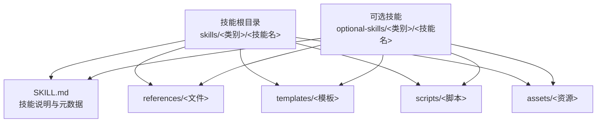
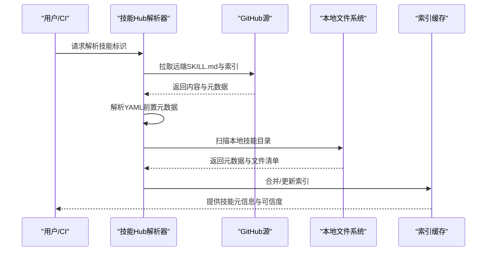
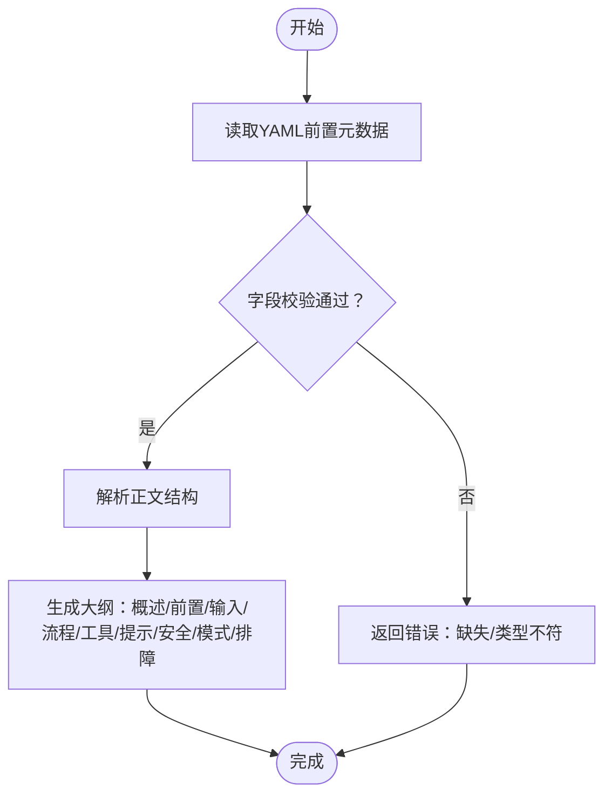
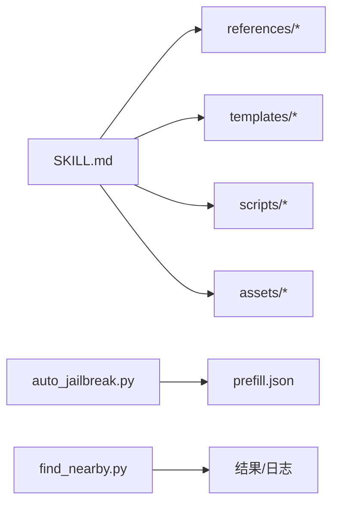
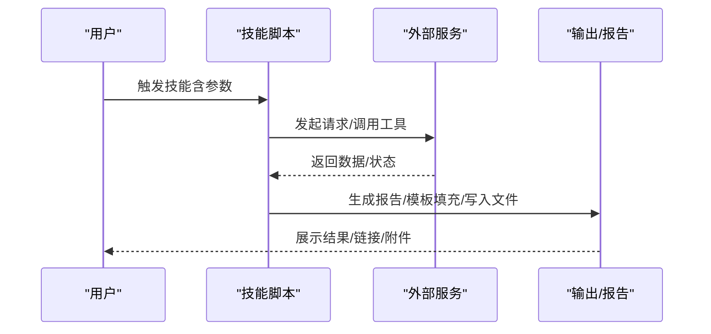
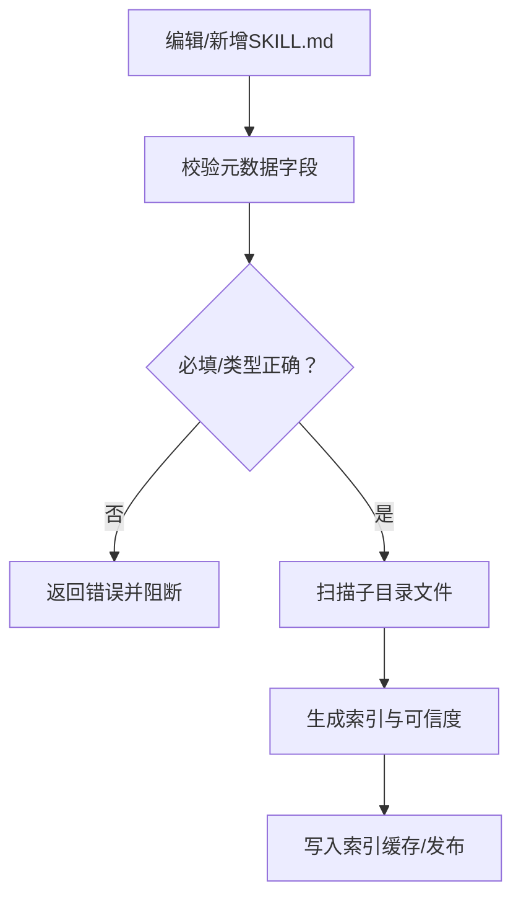
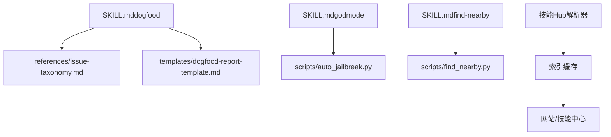

# 技能模板与结构

<cite>
**本文引用的文件**
- [SKILL.md（示例：dogfood）](file://skills/dogfood/SKILL.md)
- [SKILL.md（示例：webhook-subscriptions）](file://skills/devops/webhook-subscriptions/SKILL.md)
- [SKILL.md（示例：github-pr-workflow）](file://skills/github/github-pr-workflow/SKILL.md)
- [SKILL.md（示例：find-nearby）](file://skills/leisure/find-nearby/SKILL.md)
- [SKILL.md（示例：godmode）](file://skills/red-teaming/godmode/SKILL.md)
- [报告模板（dogfood）](file://skills/dogfood/templates/dogfood-report-template.md)
- [问题分类法（dogfood）](file://skills/dogfood/references/issue-taxonomy.md)
- [自动越狱脚本（godmode）](file://skills/red-teaming/godmode/scripts/auto_jailbreak.py)
- [附近地点脚本（find-nearby）](file://skills/leisure/find-nearby/scripts/find_nearby.py)
- [技能索引提取脚本](file://website/scripts/extract-skills.py)
- [技能Hub解析与索引](file://tools/skills_hub.py)
- [技能管理工具（扫描与校验）](file://tools/skill_manager_tool.py)
- [技能工具（文件扫描）](file://tools/skills_tool.py)
</cite>

## 目录
1. [简介](#简介)
2. [项目结构](#项目结构)
3. [核心组件](#核心组件)
4. [架构总览](#架构总览)
5. [详细组件分析](#详细组件分析)
6. [依赖关系分析](#依赖关系分析)
7. [性能考量](#性能考量)
8. [故障排查指南](#故障排查指南)
9. [结论](#结论)
10. [附录](#附录)

## 简介
本文件系统化阐述Hermes Agent技能模板与结构规范，围绕SKILL.md的YAML前置元数据字段、Markdown正文格式与最佳实践展开；同时给出技能目录标准布局（references/、templates/、scripts/、assets/）及其职责与使用方法；并提供从简单任务到复杂工作流的模板示例与验证规则，帮助贡献者与使用者快速构建高质量技能。

## 项目结构
技能位于两个主要目录中：
- built-in官方技能：skills/<类别>/<技能名>/SKILL.md 及其子目录
- 可选技能：optional-skills/<类别>/<技能名>/SKILL.md 及其子目录

每个技能通常包含以下子目录（按需存在）：
- references/：参考材料（如分类法、模板片段）
- templates/：可复用的报告或输出模板
- scripts/：技能运行所需的辅助脚本
- assets/：静态资源（图片、图标等）

**图表来源**
- [SKILL.md（示例：dogfood）](file://skills/dogfood/SKILL.md)
- [SKILL.md（示例：find-nearby）](file://skills/leisure/find-nearby/SKILL.md)
- [SKILL.md（示例：godmode）](file://skills/red-teaming/godmode/SKILL.md)

**章节来源**
- [SKILL.md（示例：dogfood）](file://skills/dogfood/SKILL.md)
- [SKILL.md（示例：webhook-subscriptions）](file://skills/devops/webhook-subscriptions/SKILL.md)
- [SKILL.md（示例：github-pr-workflow）](file://skills/github/github-pr-workflow/SKILL.md)
- [SKILL.md（示例：find-nearby）](file://skills/leisure/find-nearby/SKILL.md)
- [SKILL.md（示例：godmode）](file://skills/red-teaming/godmode/SKILL.md)

## 核心组件
- YAML前置元数据块（三短划线包裹）
  - 必填字段
    - name：技能名称（字符串）
    - description：技能描述（字符串）
  - 常见字段
    - version：版本号（字符串）
    - author：作者（字符串）
    - license：许可证（字符串）
    - metadata.hermes.tags：标签数组（字符串列表）
    - metadata.hermes.related_skills：相关技能标识数组（字符串列表）
- Markdown正文
  - 标题层级清晰，建议以“# 技能标题”开头
  - 结构建议：概述、前置条件、输入、工作流、工具参考、提示、安全与注意事项、常见模式、故障排查等
  - 使用代码块展示命令与配置片段，避免直接粘贴敏感信息
- 子目录与文件
  - references：存放分类法、检测规则、参考文档
  - templates：存放报告模板、输出模板
  - scripts：存放Python/Shell脚本，供技能执行
  - assets：存放图标、图片等静态资源

**章节来源**
- [SKILL.md（示例：dogfood）](file://skills/dogfood/SKILL.md)
- [SKILL.md（示例：webhook-subscriptions）](file://skills/devops/webhook-subscriptions/SKILL.md)
- [SKILL.md（示例：github-pr-workflow）](file://skills/github/github-pr-workflow/SKILL.md)
- [SKILL.md（示例：find-nearby）](file://skills/leisure/find-nearby/SKILL.md)
- [SKILL.md（示例：godmode）](file://skills/red-teaming/godmode/SKILL.md)

## 架构总览
技能元数据解析流程（本地与外部仓库均适用）：

**图表来源**
- [技能Hub解析与索引](file://tools/skills_hub.py)
- [技能索引提取脚本](file://website/scripts/extract-skills.py)

**章节来源**
- [技能Hub解析与索引](file://tools/skills_hub.py)
- [技能索引提取脚本](file://website/scripts/extract-skills.py)

## 详细组件分析

### 组件A：YAML前置元数据与正文结构
- 元数据字段
  - name、description：必填，用于技能识别与展示
  - version、author、license：推荐，便于版本追踪与合规
  - metadata.hermes.tags：标签数组，用于分类检索与过滤
  - metadata.hermes.related_skills：相关技能标识，建立技能图谱
- 正文结构
  - 概述：一句话说明用途与边界
  - 前置条件：工具可用性、环境变量、权限等
  - 输入：用户提供的参数与约束
  - 工作流：步骤化流程，必要时分阶段说明
  - 工具参考：表格列出工具用途与简要说明
  - 提示：常见陷阱、最佳实践、性能建议
  - 安全：签名验证、密钥管理、最小权限原则
  - 常见模式：典型场景与命令示例
  - 故障排查：常见错误与定位方法

**图表来源**
- [技能管理工具（扫描与校验）](file://tools/skill_manager_tool.py)

**章节来源**
- [技能管理工具（扫描与校验）](file://tools/skill_manager_tool.py)
- [SKILL.md（示例：dogfood）](file://skills/dogfood/SKILL.md)
- [SKILL.md（示例：webhook-subscriptions）](file://skills/devops/webhook-subscriptions/SKILL.md)
- [SKILL.md（示例：github-pr-workflow）](file://skills/github/github-pr-workflow/SKILL.md)
- [SKILL.md（示例：find-nearby）](file://skills/leisure/find-nearby/SKILL.md)
- [SKILL.md（示例：godmode）](file://skills/red-teaming/godmode/SKILL.md)

### 组件B：技能目录标准布局与职责
- references/
  - 作用：存放分类法、检测规则、参考文档
  - 示例：问题分类法、拒绝检测规则
- templates/
  - 作用：存放可复用的报告/输出模板，支持占位符替换
  - 示例：QA报告模板
- scripts/
  - 作用：存放技能执行所需的辅助脚本（Python/Shell）
  - 示例：自动越狱、附近地点查询
- assets/
  - 作用：存放静态资源（图标、图片等）
  - 注意：避免在SKILL.md中硬编码绝对路径，优先使用相对路径

**图表来源**
- [SKILL.md（示例：dogfood）](file://skills/dogfood/SKILL.md)
- [SKILL.md（示例：godmode）](file://skills/red-teaming/godmode/SKILL.md)
- [自动越狱脚本（godmode）](file://skills/red-teaming/godmode/scripts/auto_jailbreak.py)
- [附近地点脚本（find-nearby）](file://skills/leisure/find-nearby/scripts/find_nearby.py)

**章节来源**
- [SKILL.md（示例：dogfood）](file://skills/dogfood/SKILL.md)
- [SKILL.md（示例：godmode）](file://skills/red-teaming/godmode/SKILL.md)
- [自动越狱脚本（godmode）](file://skills/red-teaming/godmode/scripts/auto_jailbreak.py)
- [附近地点脚本（find-nearby）](file://skills/leisure/find-nearby/scripts/find_nearby.py)

### 组件C：模板示例与最佳实践
- 简单任务示例：附近地点查询
  - 元数据：name、description、version、metadata.hermes.tags
  - 正文：概述、前置条件（坐标/地址）、输入、工作流、提示
  - 脚本：无API密钥的免费服务调用
- 复杂工作流示例：GitHub PR工作流
  - 元数据：name、description、version、author、license、metadata.hermes.tags、related_skills
  - 正文：概述、前置条件（认证、Git仓库）、分支/提交/推送/PR/监控/合并/自动修复
  - 命令：gh与curl双路径对照
- 事件驱动示例：Webhook订阅
  - 元数据：name、description、version、metadata.hermes.tags
  - 正文：平台启用、命令行管理、模板语法、常见模式、安全、故障排查
- 安全/红队示例：Godmode越狱
  - 元数据：name、description、version、author、license、metadata.hermes.tags、related_skills
  - 正文：攻击模式、自动越狱、策略顺序、编码升级、多模型竞速、检测与规避
  - 脚本：自动越狱、帕斯尔通语编码、多模型竞速

**图表来源**
- [SKILL.md（示例：github-pr-workflow）](file://skills/github/github-pr-workflow/SKILL.md)
- [SKILL.md（示例：webhook-subscriptions）](file://skills/devops/webhook-subscriptions/SKILL.md)
- [SKILL.md（示例：godmode）](file://skills/red-teaming/godmode/SKILL.md)
- [自动越狱脚本（godmode）](file://skills/red-teaming/godmode/scripts/auto_jailbreak.py)
- [附近地点脚本（find-nearby）](file://skills/leisure/find-nearby/scripts/find_nearby.py)

**章节来源**
- [SKILL.md（示例：find-nearby）](file://skills/leisure/find-nearby/SKILL.md)
- [SKILL.md（示例：github-pr-workflow）](file://skills/github/github-pr-workflow/SKILL.md)
- [SKILL.md（示例：webhook-subscriptions）](file://skills/devops/webhook-subscriptions/SKILL.md)
- [SKILL.md（示例：godmode）](file://skills/red-teaming/godmode/SKILL.md)
- [自动越狱脚本（godmode）](file://skills/red-teaming/godmode/scripts/auto_jailbreak.py)
- [附近地点脚本（find-nearby）](file://skills/leisure/find-nearby/scripts/find_nearby.py)

### 组件D：模板验证规则与格式检查
- 元数据校验
  - 必填字段：name、description
  - 类型校验：字符串；tags/related_skills为数组
  - 版本与许可：可选但建议填写
- 正文校验
  - 结构完整性：概述、前置、输入、流程、工具、提示、安全、模式、排障
  - 一致性：命令与正文描述一致，路径与实际文件一致
- 文件扫描与归档
  - 自动扫描references/templates/scripts/assets下的文件，排除空类别
  - 支持多种扩展名（.md/.py/.yaml/.yml/.json/.tex/.sh等）
- 索引与可信度
  - 从SKILL.md解析元数据，提取tags
  - 本地与远程仓库统一索引，支持可信度标注

**图表来源**
- [技能管理工具（扫描与校验）](file://tools/skill_manager_tool.py)
- [技能工具（文件扫描）](file://tools/skills_tool.py)
- [技能Hub解析与索引](file://tools/skills_hub.py)

**章节来源**
- [技能管理工具（扫描与校验）](file://tools/skill_manager_tool.py)
- [技能工具（文件扫描）](file://tools/skills_tool.py)
- [技能Hub解析与索引](file://tools/skills_hub.py)

## 依赖关系分析
- 内部依赖
  - SKILL.md依赖references/templates/scripts/assets中的文件
  - 正文中的命令/路径需与实际文件一致
- 外部依赖
  - Godmode示例依赖OpenRouter/Anthropic/OpenAI等API
  - find-nearby示例依赖OpenStreetMap服务
- 索引与发现
  - 网站脚本从skills与optional-skills目录提取元数据
  - 技能Hub解析器支持远程与本地两种来源

**图表来源**
- [SKILL.md（示例：dogfood）](file://skills/dogfood/SKILL.md)
- [SKILL.md（示例：godmode）](file://skills/red-teaming/godmode/SKILL.md)
- [SKILL.md（示例：find-nearby）](file://skills/leisure/find-nearby/SKILL.md)
- [技能索引提取脚本](file://website/scripts/extract-skills.py)
- [技能Hub解析与索引](file://tools/skills_hub.py)

**章节来源**
- [SKILL.md（示例：dogfood）](file://skills/dogfood/SKILL.md)
- [SKILL.md（示例：godmode）](file://skills/red-teaming/godmode/SKILL.md)
- [SKILL.md（示例：find-nearby）](file://skills/leisure/find-nearby/SKILL.md)
- [技能索引提取脚本](file://website/scripts/extract-skills.py)
- [技能Hub解析与索引](file://tools/skills_hub.py)

## 性能考量
- API调用节流
  - Godmode多模型竞速会触发多次API调用，建议使用较低tier起步，逐步提升
- 地理查询
  - find-nearby使用多个Overpass服务器轮询，注意超时与失败重试
- 模板渲染
  - 大量占位符替换时注意内存占用，建议分批处理
- 索引构建
  - 批量扫描与解析元数据时避免频繁IO，建议缓存中间结果

## 故障排查指南
- 元数据解析失败
  - 检查YAML格式是否正确，三短划线包裹的元数据块前后是否有空白
  - 确认必填字段齐全且类型正确
- 路径引用错误
  - references/templates/scripts/assets中的相对路径需与实际文件一致
  - 避免在正文中硬编码绝对路径
- 外部服务不可达
  - Godmode：确认API密钥与base_url设置正确
  - find-nearby：检查网络连通性与服务可用性
- 索引未更新
  - 确认索引缓存已重建，技能Hub解析器已重新加载

**章节来源**
- [技能管理工具（扫描与校验）](file://tools/skill_manager_tool.py)
- [SKILL.md（示例：webhook-subscriptions）](file://skills/devops/webhook-subscriptions/SKILL.md)
- [SKILL.md（示例：godmode）](file://skills/red-teaming/godmode/SKILL.md)
- [SKILL.md（示例：find-nearby）](file://skills/leisure/find-nearby/SKILL.md)

## 结论
通过标准化的SKILL.md元数据与正文结构、明确的目录布局与严格的验证规则，Hermes Agent实现了技能的高可读性、可维护性与可复用性。建议在贡献新技能时严格遵循本文规范，并结合示例技能进行对照完善。

## 附录
- 常用字段速查
  - name、description、version、author、license、metadata.hermes.tags、metadata.hermes.related_skills
- 目录建议
  - references：分类法、规则、参考
  - templates：报告/输出模板
  - scripts：Python/Shell脚本
  - assets：图标/图片等静态资源
- 示例技能
  - 简单任务：find-nearby
  - 复杂工作流：github-pr-workflow
  - 事件驱动：webhook-subscriptions
  - 安全/红队：godmode