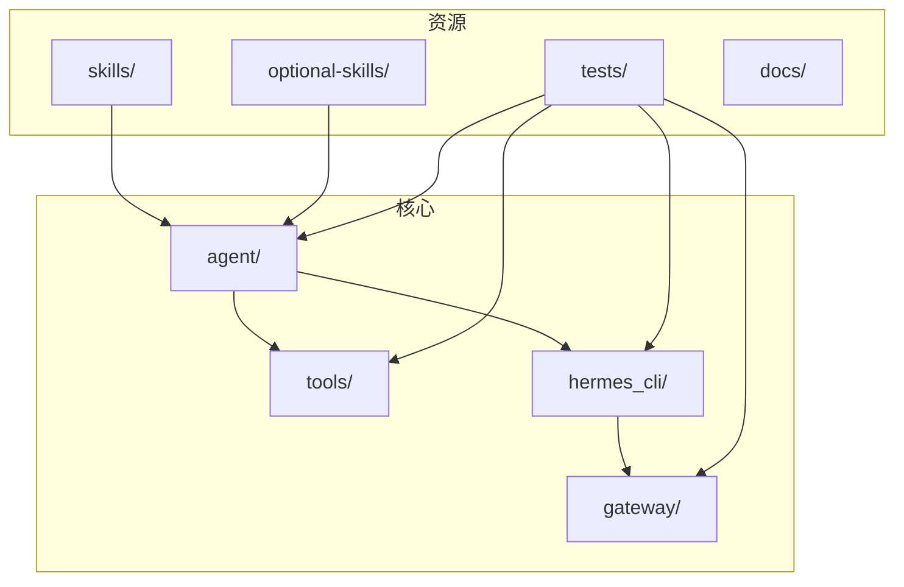
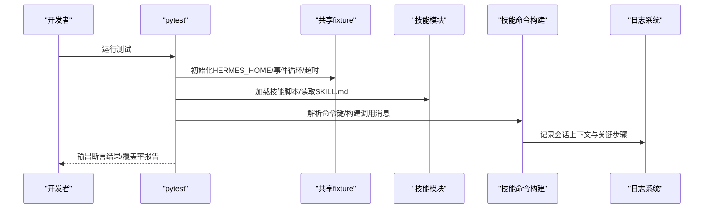
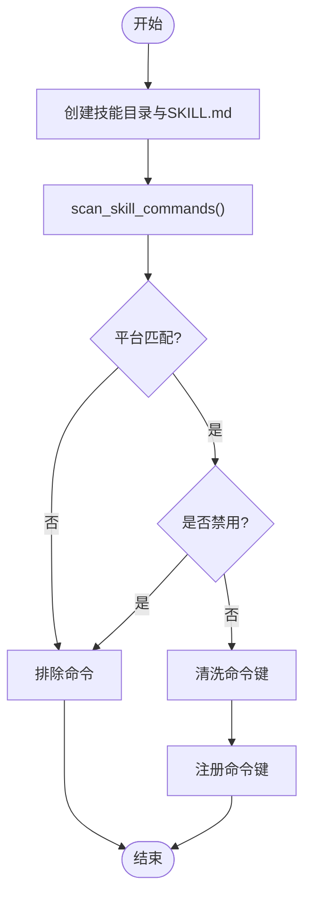
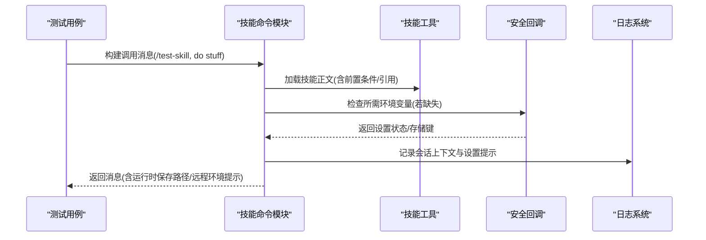
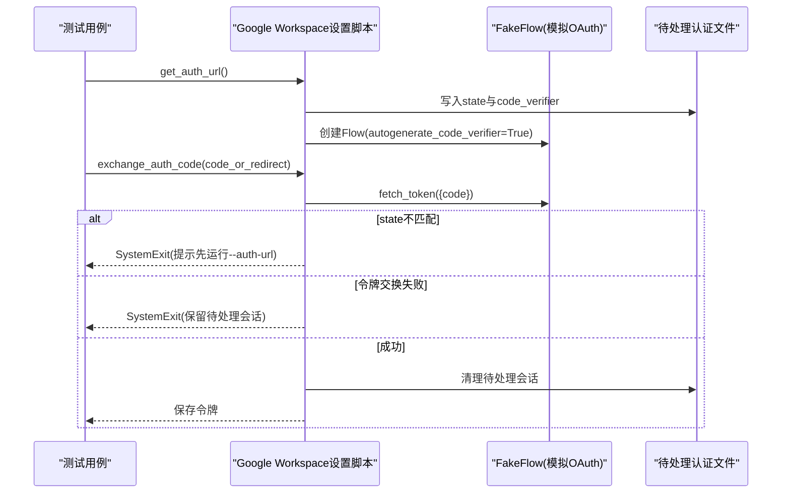
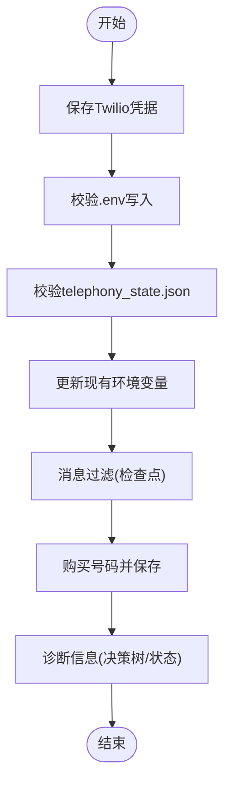
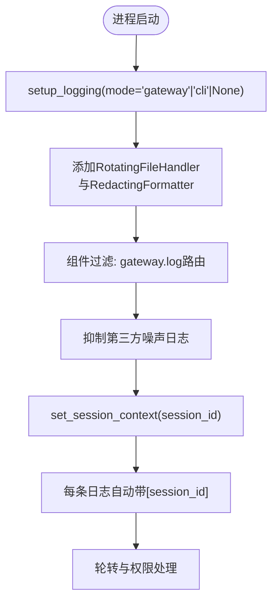
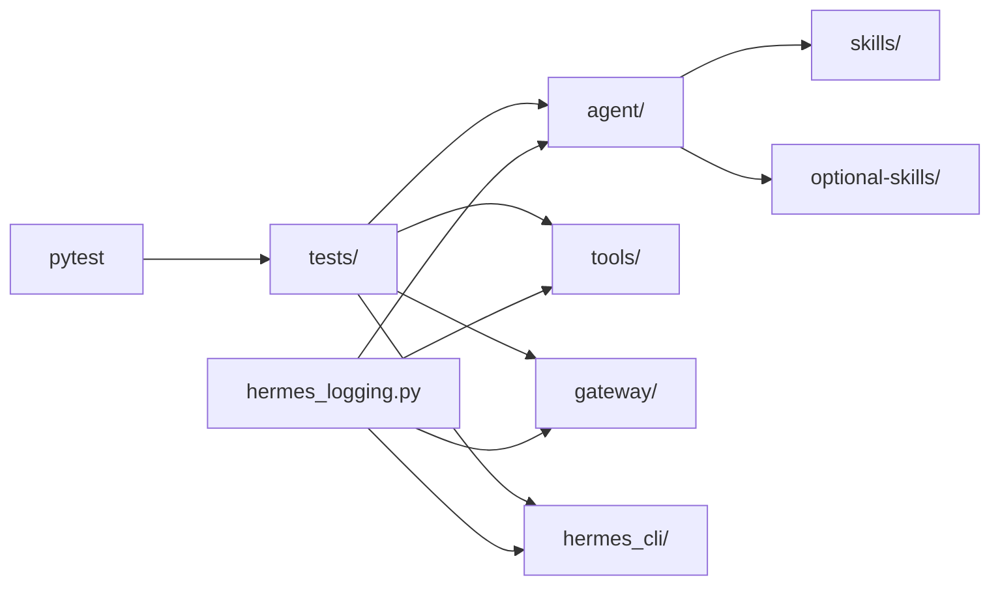

# 技能测试与调试

<cite>
**本文引用的文件**
- [README.md](file://README.md)
- [CONTRIBUTING.md](file://CONTRIBUTING.md)
- [pyproject.toml](file://pyproject.toml)
- [tests/conftest.py](file://tests/conftest.py)
- [hermes_logging.py](file://hermes_logging.py)
- [agent/skill_utils.py](file://agent/skill_utils.py)
- [tests/skills/test_google_oauth_setup.py](file://tests/skills/test_google_oauth_setup.py)
- [tests/skills/test_telephony_skill.py](file://tests/skills/test_telephony_skill.py)
- [tests/agent/test_skill_commands.py](file://tests/agent/test_skill_commands.py)
- [skills/github/codebase-inspection/SKILL.md](file://skills/github/codebase-inspection/SKILL.md)
- [skills/research/arxiv/SKILL.md](file://skills/research/arxiv/SKILL.md)
</cite>

## 目录
1. [简介](#简介)
2. [项目结构](#项目结构)
3. [核心组件](#核心组件)
4. [架构总览](#架构总览)
5. [详细组件分析](#详细组件分析)
6. [依赖分析](#依赖分析)
7. [性能考虑](#性能考虑)
8. [故障排查指南](#故障排查指南)
9. [结论](#结论)
10. [附录](#附录)

## 简介
本指南面向Hermes Agent技能的测试与调试，覆盖单元测试编写、集成测试执行与性能评估方法；提供日志分析、错误追踪与问题定位技巧；总结测试用例设计原则（边界条件、异常处理、回归测试）与质量保证检查清单，并给出自动化测试集成方案建议。内容基于仓库中的测试框架、日志系统与技能文档，确保可操作且贴近实际代码实现。

## 项目结构
Hermes Agent采用模块化分层组织：核心代理在agent/，工具在tools/，网关在gateway/，CLI在hermes_cli/，技能在skills/与optional-skills/，测试集中在tests/。测试框架通过pytest配置与共享fixture隔离环境变量与用户目录，避免写入真实~/.hermes/，并支持超时保护与事件循环管理。

图示来源
- [pyproject.toml:117-121](file://pyproject.toml#L117-L121)
- [README.md:114-182](file://README.md#L114-L182)

章节来源
- [README.md:114-182](file://README.md#L114-L182)
- [pyproject.toml:117-121](file://pyproject.toml#L117-L121)

## 核心组件
- 测试框架与运行环境
  - 使用pytest，全局超时、事件循环兼容与临时目录隔离，确保测试稳定与可重复。
- 日志系统
  - 集中式日志初始化，按组件路由到不同日志文件，支持会话上下文标记与脱敏格式化器。
- 技能元数据与发现
  - 技能目录扫描、平台过滤、条件激活字段解析、配置变量声明与解析等能力由轻量工具模块提供。
- 技能文档规范
  - 技能使用场景、前置条件、命令参考、输出解读与常见陷阱，便于测试覆盖与回归验证。

章节来源
- [tests/conftest.py:19-122](file://tests/conftest.py#L19-L122)
- [hermes_logging.py:156-261](file://hermes_logging.py#L156-L261)
- [agent/skill_utils.py:19-466](file://agent/skill_utils.py#L19-L466)
- [skills/github/codebase-inspection/SKILL.md:1-116](file://skills/github/codebase-inspection/SKILL.md#L1-L116)
- [skills/research/arxiv/SKILL.md:1-282](file://skills/research/arxiv/SKILL.md#L1-L282)

## 架构总览
下图展示测试与调试在系统中的位置：测试驱动技能加载、命令解析与调用路径，日志贯穿执行全过程，便于定位问题与评估性能。

图示来源
- [tests/conftest.py:19-122](file://tests/conftest.py#L19-L122)
- [tests/agent/test_skill_commands.py:18-408](file://tests/agent/test_skill_commands.py#L18-L408)
- [hermes_logging.py:72-84](file://hermes_logging.py#L72-L84)

## 详细组件分析

### 组件A：技能命令扫描与平台过滤
- 功能要点
  - 扫描技能目录，解析SKILL.md，生成斜杠命令映射。
  - 基于平台字段与禁用列表进行过滤，确保命令仅在兼容平台注册。
  - 对命令键进行字符清洗，避免特殊字符导致的注册问题。
- 关键流程
  - 创建最小技能目录与SKILL.md。
  - 调用扫描函数，断言返回的命令字典包含预期键与属性。
  - 验证macOS-only技能在Linux上不注册，通用技能在任意平台注册。
  - 验证禁用技能不注册。
  - 特殊字符清洗与全特殊名称跳过逻辑。

图示来源
- [tests/agent/test_skill_commands.py:41-103](file://tests/agent/test_skill_commands.py#L41-L103)
- [agent/skill_utils.py:92-116](file://agent/skill_utils.py#L92-L116)

章节来源
- [tests/agent/test_skill_commands.py:41-103](file://tests/agent/test_skill_commands.py#L41-L103)
- [agent/skill_utils.py:92-116](file://agent/skill_utils.py#L92-L116)

### 组件B：技能调用消息构建与安全设置
- 功能要点
  - 根据命令键构建调用消息，支持从存储路径加载技能正文。
  - 处理所需环境变量的安全采集回调，区分CLI与网关场景的提示策略。
  - 支持引用文件提示与运行时保存路径说明。
- 关键流程
  - 注册命令后，构建调用消息并断言包含技能标题与用户输入。
  - 当技能声明了所需环境变量且未就绪时，验证回调被调用或返回本地设置指引。
  - 网关场景下避免内联密钥采集，改为引导至CLI设置。

图示来源
- [tests/agent/test_skill_commands.py:222-362](file://tests/agent/test_skill_commands.py#L222-L362)
- [hermes_logging.py:72-84](file://hermes_logging.py#L72-L84)

章节来源
- [tests/agent/test_skill_commands.py:222-362](file://tests/agent/test_skill_commands.py#L222-L362)
- [hermes_logging.py:72-84](file://hermes_logging.py#L72-L84)

### 组件C：技能OAuth设置与令牌交换（端到端）
- 功能要点
  - 模拟浏览器授权URL生成与状态/验证码持久化。
  - 从重定向URL提取授权码并校验state一致性。
  - 令牌交换失败时保留待处理会话以便重试。
  - 接受更窄范围权限时发出警告并接受部分范围。
- 关键流程
  - 生成授权URL并断言状态与验证码已保存。
  - 传入授权码，断言Flow参数与fetch_token调用。
  - 校验state不一致时抛出退出并保留待处理会话。
  - 令牌交换失败时清理失败状态并保留待处理会话。

图示来源
- [tests/skills/test_google_oauth_setup.py:135-243](file://tests/skills/test_google_oauth_setup.py#L135-L243)

章节来源
- [tests/skills/test_google_oauth_setup.py:135-243](file://tests/skills/test_google_oauth_setup.py#L135-L243)

### 组件D：Telephony技能功能测试
- 功能要点
  - 保存Twilio凭据到环境文件与状态文件。
  - 更新现有环境变量而不破坏其他条目。
  - 消息拉取与检查点过滤，仅返回新消息。
  - 从Twilio购买号码并同步保存到状态与环境。
  - 诊断信息包含决策树与已保存状态。
- 关键流程
  - 调用保存函数，断言环境文件与状态文件写入正确。
  - 更新环境变量，断言旧值被替换且其他项保留。
  - 模拟消息列表，断言检查点过滤行为。
  - 购买号码流程，断言返回SID与状态/环境同步。

图示来源
- [tests/skills/test_telephony_skill.py:29-230](file://tests/skills/test_telephony_skill.py#L29-L230)

章节来源
- [tests/skills/test_telephony_skill.py:29-230](file://tests/skills/test_telephony_skill.py#L29-L230)

### 组件E：日志系统与会话上下文
- 功能要点
  - 初始化日志：agent.log主日志、errors.log警告以上、gateway.log组件路由。
  - 会话上下文注入：线程本地存储记录session_id，所有日志行自动带[session_id]。
  - 脱敏格式化：统一格式化器避免敏感信息落盘。
- 关键流程
  - 启动时调用setup_logging，根据模式创建对应处理器。
  - 在会话开始前set_session_context，在结束时clear_session_context。
  - 第三方噪声日志降噪，根日志级别控制。

图示来源
- [hermes_logging.py:156-261](file://hermes_logging.py#L156-L261)
- [hermes_logging.py:72-84](file://hermes_logging.py#L72-L84)

章节来源
- [hermes_logging.py:156-261](file://hermes_logging.py#L156-L261)
- [hermes_logging.py:72-84](file://hermes_logging.py#L72-L84)

## 依赖分析
- 测试运行依赖
  - pytest、pytest-asyncio、pytest-xdist用于并发与异步测试。
  - 标记integration以区分需要外部服务的集成测试。
- 技能与工具依赖
  - 技能通过SKILL.md声明前置命令与环境变量，测试应覆盖这些前置条件。
- 日志与配置
  - 日志系统读取配置文件中的logging节作为默认值，支持动态调整。

图示来源
- [pyproject.toml:131-137](file://pyproject.toml#L131-L137)
- [hermes_logging.py:156-261](file://hermes_logging.py#L156-L261)

章节来源
- [pyproject.toml:131-137](file://pyproject.toml#L131-L137)
- [hermes_logging.py:156-261](file://hermes_logging.py#L156-L261)

## 性能考虑
- 单测与集成测试分离
  - 单测优先，快速反馈；集成测试使用标记隔离，避免无谓的外部依赖调用。
- 事件循环与超时
  - 共享fixture为同步测试提供默认事件循环，统一30秒超时，防止挂起阻塞。
- 日志级别与噪声抑制
  - 默认降低第三方库日志级别，减少I/O与解析开销，聚焦业务日志。
- 并发与资源隔离
  - 使用临时目录与环境变量隔离，避免跨测试污染，提升并行效率。

章节来源
- [tests/conftest.py:77-122](file://tests/conftest.py#L77-L122)
- [hermes_logging.py:255-258](file://hermes_logging.py#L255-L258)

## 故障排查指南
- 日志定位
  - 使用会话上下文标识符过滤：在会话开始前set_session_context，结束后clear_session_context。
  - 错误快速通道：errors.log仅记录WARNING及以上，便于快速定位。
  - 组件路由：gateway.log仅接收gateway.*前缀日志，便于网关问题排查。
- 常见问题
  - 平台不兼容：检查SKILL.md中的platforms字段与当前sys.platform。
  - 技能禁用：确认config.yaml中的skills.disabled或platform_disabled。
  - 安全设置缺失：当技能声明required_environment_variables时，需在CLI完成设置，网关场景会提示本地设置。
- 回归验证
  - 以技能文档为依据，覆盖“何时使用”“前置条件”“命令参考”“输出解读”“常见陷阱”。

章节来源
- [hermes_logging.py:72-84](file://hermes_logging.py#L72-L84)
- [hermes_logging.py:229-250](file://hermes_logging.py#L229-L250)
- [agent/skill_utils.py:92-116](file://agent/skill_utils.py#L92-L116)
- [agent/skill_utils.py:121-169](file://agent/skill_utils.py#L121-L169)
- [skills/github/codebase-inspection/SKILL.md:19-116](file://skills/github/codebase-inspection/SKILL.md#L19-L116)
- [skills/research/arxiv/SKILL.md:17-282](file://skills/research/arxiv/SKILL.md#L17-L282)

## 结论
通过标准化的测试框架、完善的日志体系与严格的技能文档规范，Hermes Agent的技能测试与调试具备高可操作性与可维护性。建议在日常开发中坚持：单测先行、边界与异常覆盖、回归测试纳入CI、日志驱动问题定位与性能观测。

## 附录

### 技能测试方法与流程
- 单元测试
  - 使用pytest与共享fixture，隔离HERMES_HOME，避免写入真实用户目录。
  - 针对命令扫描、消息构建、平台过滤、禁用列表等模块化功能编写断言。
- 集成测试
  - 使用标记integration隔离外部依赖测试；对需要真实API或外部服务的用例单独运行。
- 性能测试
  - 利用pytest-xdist并行执行；关注日志级别与第三方噪声抑制，减少I/O开销。
- 自动化集成
  - 在CI中默认运行非integration标记的测试集，必要时手动触发集成测试。

章节来源
- [tests/conftest.py:19-122](file://tests/conftest.py#L19-L122)
- [pyproject.toml:131-137](file://pyproject.toml#L131-L137)

### 测试用例设计原则与最佳实践
- 边界条件
  - 命令键包含特殊字符、全特殊名称、斜杠字符的清洗与过滤。
  - 平台字段为空、单个平台、多个平台的兼容性。
  - 禁用列表与平台禁用列表的优先级。
- 异常处理
  - OAuth授权URL生成与状态/验证码持久化。
  - state不一致、令牌交换失败、部分范围权限接受的处理。
  - Telephony购买号码与环境/状态同步。
- 回归测试
  - 以技能文档为基线，覆盖“何时使用”“前置条件”“命令参考”“输出解读”“常见陷阱”。

章节来源
- [tests/agent/test_skill_commands.py:105-193](file://tests/agent/test_skill_commands.py#L105-L193)
- [tests/skills/test_google_oauth_setup.py:135-243](file://tests/skills/test_google_oauth_setup.py#L135-L243)
- [tests/skills/test_telephony_skill.py:84-167](file://tests/skills/test_telephony_skill.py#L84-L167)
- [skills/github/codebase-inspection/SKILL.md:19-116](file://skills/github/codebase-inspection/SKILL.md#L19-L116)
- [skills/research/arxiv/SKILL.md:17-282](file://skills/research/arxiv/SKILL.md#L17-L282)

### 技能质量保证检查清单
- 文档完整性
  - 是否包含“何时使用”“前置条件”“命令参考”“输出解读”“常见陷阱”？
- 可测试性
  - 是否有明确的命令/脚本入口与可验证的输出？
  - 是否声明必要的前置命令与环境变量？
- 可靠性
  - 是否覆盖边界条件与异常路径（如网络失败、权限不足、参数非法）？
- 可维护性
  - 是否遵循贡献指南中的新增技能/工具规范？

章节来源
- [CONTRIBUTING.md:302-464](file://CONTRIBUTING.md#L302-L464)
- [skills/github/codebase-inspection/SKILL.md:19-116](file://skills/github/codebase-inspection/SKILL.md#L19-L116)
- [skills/research/arxiv/SKILL.md:17-282](file://skills/research/arxiv/SKILL.md#L17-L282)