# 技能示例与最佳实践

<cite>
**本文引用的文件**
- [README.md](file://README.md)
- [CONTRIBUTING.md](file://CONTRIBUTING.md)
- [optional-skills/DESCRIPTION.md](file://optional-skills/DESCRIPTION.md)
- [skills/github/github-auth/SKILL.md](file://skills/github/github-auth/SKILL.md)
- [skills/github/github-pr-workflow/SKILL.md](file://skills/github/github-pr-workflow/SKILL.md)
- [skills/github/github-code-review/SKILL.md](file://skills/github/github-code-review/SKILL.md)
- [skills/data-science/jupyter-live-kernel/SKILL.md](file://skills/data-science/jupyter-live-kernel/SKILL.md)
- [skills/devops/webhook-subscriptions/SKILL.md](file://skills/devops/webhook-subscriptions/SKILL.md)
- [optional-skills/devops/cli/SKILL.md](file://optional-skills/devops/cli/SKILL.md)
- [optional-skills/mlops/huggingface-tokenizers/SKILL.md](file://optional-skills/mlops/huggingface-tokenizers/SKILL.md)
- [skills/productivity/google-workspace/SKILL.md](file://skills/productivity/google-workspace/SKILL.md)
- [optional-skills/mlops/accelerate/SKILL.md](file://optional-skills/mlops/accelerate/SKILL.md)
- [optional-skills/creative/meme-generation/SKILL.md](file://optional-skills/creative/meme-generation/SKILL.md)
</cite>

## 目录
1. [简介](#简介)
2. [项目结构](#项目结构)
3. [核心组件](#核心组件)
4. [架构总览](#架构总览)
5. [详细组件分析](#详细组件分析)
6. [依赖关系分析](#依赖关系分析)
7. [性能考量](#性能考量)
8. [故障排查指南](#故障排查指南)
9. [结论](#结论)
10. [附录](#附录)

## 简介
本指南面向希望系统掌握 Hermes Agent 技能编写与应用的工程师与研究者，围绕“GitHub 工作流”“数据科学任务”“DevOps 操作”“MLOps 能力”“创意生成”等典型场景，提供可复用的技能示例、最佳实践与优化建议。文档同时总结了仓库中的技能规范、安全与健壮性要求，并给出常见问题的排查路径。

## 项目结构
Hermes Agent 的技能体系由“内置技能”“可选官方技能”“社区技能”三层构成，配合统一的 SKILL.md 规范与工具链，形成“声明式能力 + 可执行脚本”的闭环。

- 内置技能（skills/）：默认激活，覆盖通用领域（如 GitHub、数据科学、DevOps、生产力、研究等）
- 可选官方技能（optional-skills/）：非默认激活，适合特定用户群体或实验性功能
- 社区技能：通过 Skills Hub 分发，便于发现与安装

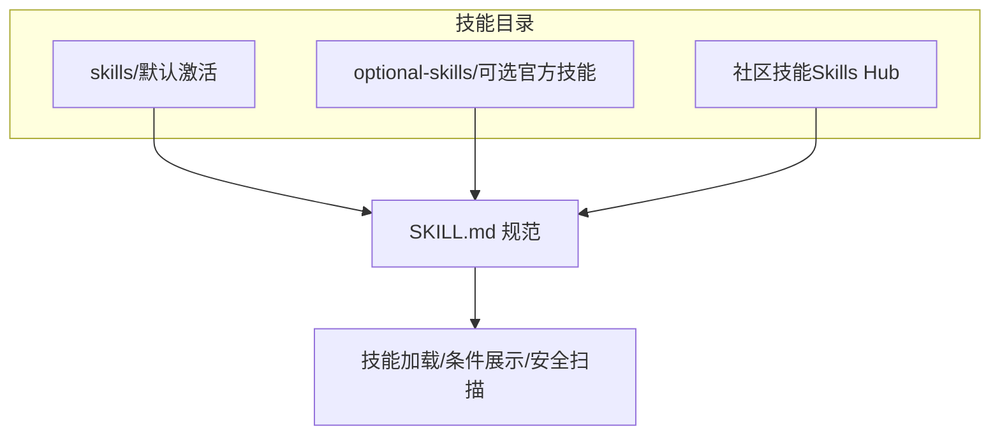

图示来源
- [CONTRIBUTING.md](file://CONTRIBUTING.md)
- [README.md](file://README.md)

章节来源
- [README.md](file://README.md)
- [CONTRIBUTING.md](file://CONTRIBUTING.md)
- [optional-skills/DESCRIPTION.md](file://optional-skills/DESCRIPTION.md)

## 核心组件
- 技能规范（SKILL.md）：定义元信息（名称、描述、版本、作者、许可证、平台限制、环境变量需求）、前置条件、流程步骤、陷阱与验证方法
- 条件激活与平台过滤：基于工具集/工具可用性与平台支持动态决定是否展示技能
- 安全与合规：技能守卫、危险命令检测、凭据注入保护、容器隔离
- 工具与后端：终端工具、文件工具、网络工具、代码执行沙箱、子代理并行执行等

章节来源
- [CONTRIBUTING.md](file://CONTRIBUTING.md)

## 架构总览
下图展示了从用户触发到技能执行的关键路径：系统提示构建时根据可用工具集筛选技能；技能加载后按流程执行；必要时调用工具或外部服务；最终返回结果并进行验证。

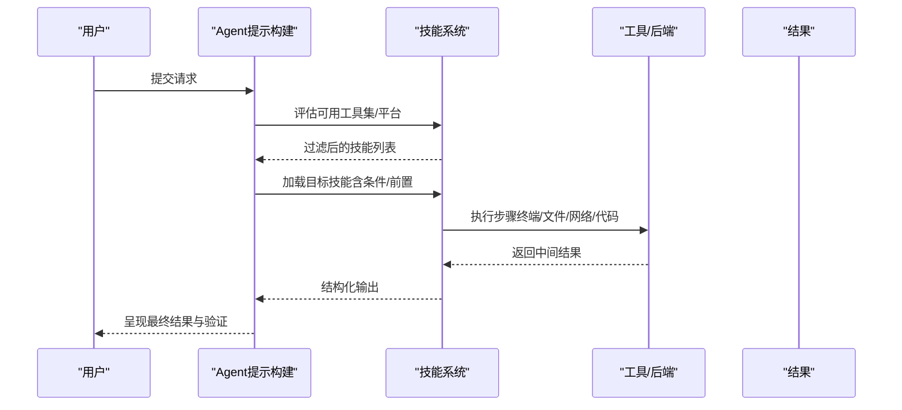

图示来源
- [CONTRIBUTING.md](file://CONTRIBUTING.md)

## 详细组件分析

### GitHub 认证与工作流（认证、PR 生命周期、代码审查）
该组合技能覆盖从认证到 PR 全生命周期的自动化，强调“gh 优先 + curl 回退”的双栈策略，确保在无 gh 的环境中仍可运行。

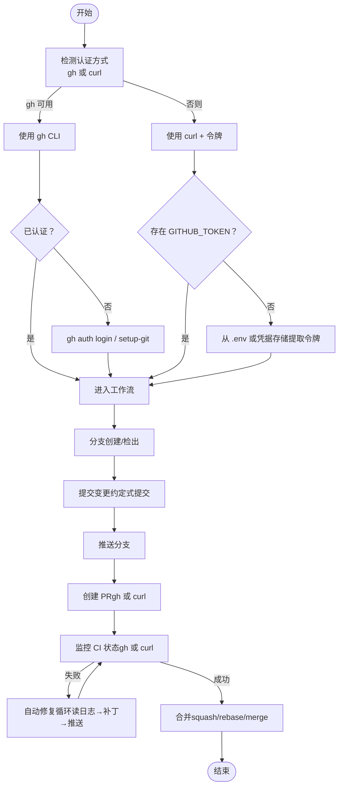

图示来源
- [skills/github/github-auth/SKILL.md](file://skills/github/github-auth/SKILL.md)
- [skills/github/github-pr-workflow/SKILL.md](file://skills/github/github-pr-workflow/SKILL.md)
- [skills/github/github-code-review/SKILL.md](file://skills/github/github-code-review/SKILL.md)

章节来源
- [skills/github/github-auth/SKILL.md](file://skills/github/github-auth/SKILL.md)
- [skills/github/github-pr-workflow/SKILL.md](file://skills/github/github-pr-workflow/SKILL.md)
- [skills/github/github-code-review/SKILL.md](file://skills/github/github-code-review/SKILL.md)

最佳实践要点
- 认证优先级：gh 优先，无 gh 时回退到 curl + 令牌
- 自动化 CI 失败诊断：先列出运行、再下载日志，限定重试次数
- 合并策略：优先 squash 以保持历史整洁；必要时启用自动合并
- 验证：创建 PR 后检查状态；合并后清理分支

### 数据科学：Jupyter 实时内核（迭代式探索）
该技能提供“有状态”的 Python REPL，适合探索性分析、中间结果检查与逐步构建复杂逻辑。

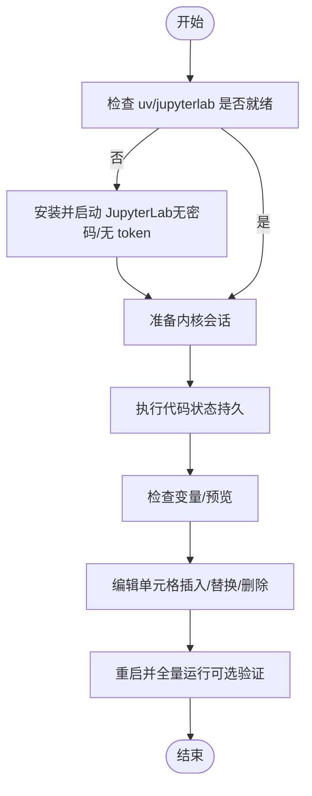

图示来源
- [skills/data-science/jupyter-live-kernel/SKILL.md](file://skills/data-science/jupyter-live-kernel/SKILL.md)

章节来源
- [skills/data-science/jupyter-live-kernel/SKILL.md](file://skills/data-science/jupyter-live-kernel/SKILL.md)

最佳实践要点
- 使用 --compact 减少输出体积
- 首次执行可能超时，适当重试
- 包管理需在 JupyterLab 环境中完成
- 参数顺序严格，flag 在子命令前

### DevOps：Webhook 订阅（事件驱动触发）
通过 webhook 平台将外部事件转化为 Agent 任务，支持多平台投递与 HMAC 校验。

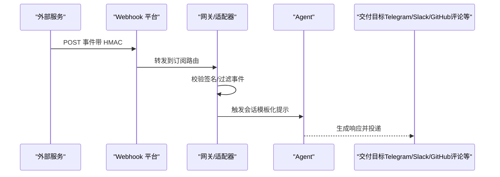

图示来源
- [skills/devops/webhook-subscriptions/SKILL.md](file://skills/devops/webhook-subscriptions/SKILL.md)

章节来源
- [skills/devops/webhook-subscriptions/SKILL.md](file://skills/devops/webhook-subscriptions/SKILL.md)

最佳实践要点
- 必须启用 webhook 平台并配置强密钥
- 使用 dotnotation 访问嵌套负载字段
- 通过测试命令验证路由与签名
- 生产环境建议使用反向代理与防火墙

### 可选技能：inference.sh CLI（AI 应用编排）
面向多模态与生成类任务，通过统一 CLI 管理 150+ 应用，强调“先搜索、后运行、解析输出”。

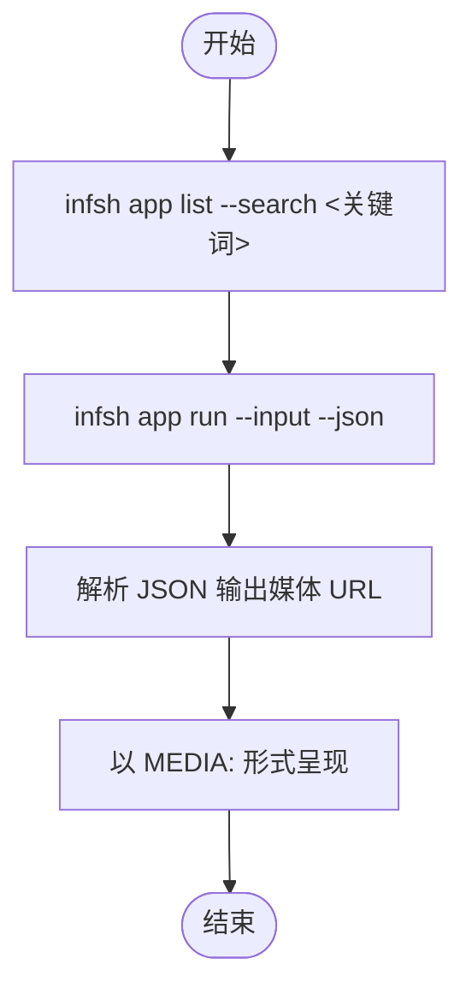

图示来源
- [optional-skills/devops/cli/SKILL.md](file://optional-skills/devops/cli/SKILL.md)

章节来源
- [optional-skills/devops/cli/SKILL.md](file://optional-skills/devops/cli/SKILL.md)

最佳实践要点
- 永远先搜索再猜测 app ID
- 使用 --json 获取机器可读输出
- 注意输入 JSON 的转义与格式
- 长耗时任务注意终端超时设置

### 可选技能：HuggingFace Tokenizers（高性能分词）
面向 NLP 研究与生产，提供 BPE/WordPiece/Unigram 等算法与对齐跟踪、批处理、多进程加速。

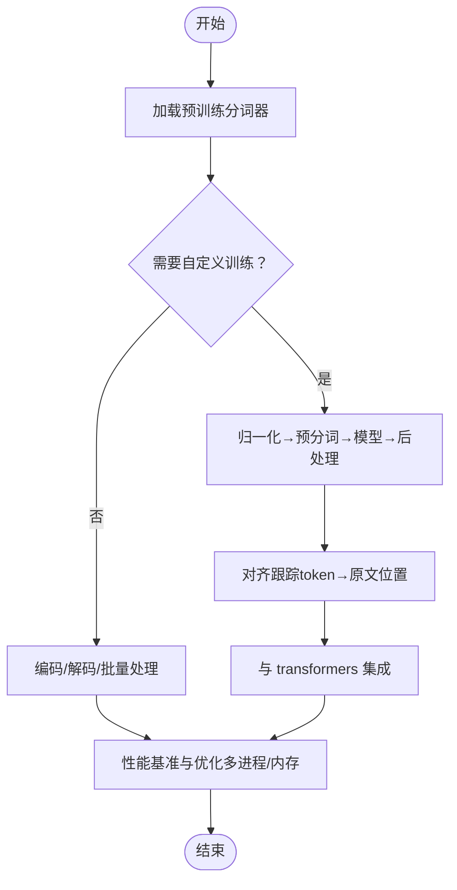

图示来源
- [optional-skills/mlops/huggingface-tokenizers/SKILL.md](file://optional-skills/mlops/huggingface-tokenizers/SKILL.md)

章节来源
- [optional-skills/mlops/huggingface-tokenizers/SKILL.md](file://optional-skills/mlops/huggingface-tokenizers/SKILL.md)

最佳实践要点
- 训练速度与吞吐量显著优于纯 Python 实现
- 对齐跟踪用于命名实体识别、问答等下游任务
- 批处理与多进程可获得 5–8× 加速

### 生产力：Google Workspace（OAuth 管理与 API 调用）
通过 Hermes 管理的 OAuth2 流程，优先使用 gws CLI，否则回退到 Python 客户端库，统一输出格式。

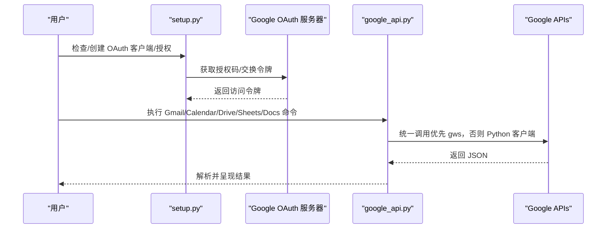

图示来源
- [skills/productivity/google-workspace/SKILL.md](file://skills/productivity/google-workspace/SKILL.md)

章节来源
- [skills/productivity/google-workspace/SKILL.md](file://skills/productivity/google-workspace/SKILL.md)

最佳实践要点
- 严格校验时间与时区（ISO 8601）
- 遵循权限范围最小化原则
- 避免高频连续调用，合理批处理

### 可选技能：HuggingFace Accelerate（分布式训练）
简化多 GPU/TPU 训练接入，统一 DDP/DeepSpeed/FSDP/Megatron 接口，支持混合精度与梯度累积。

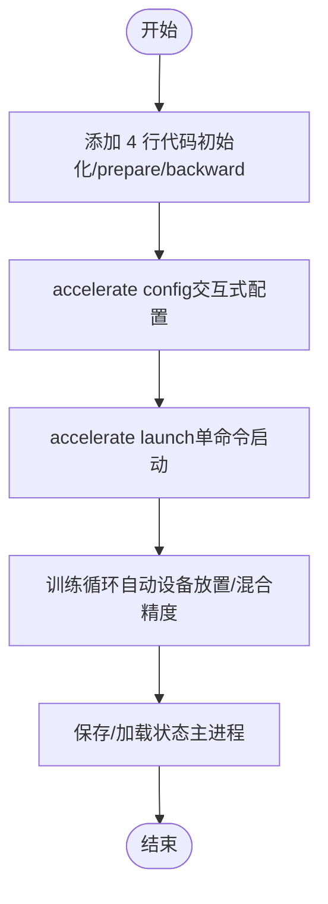

图示来源
- [optional-skills/mlops/accelerate/SKILL.md](file://optional-skills/mlops/accelerate/SKILL.md)

章节来源
- [optional-skills/mlops/accelerate/SKILL.md](file://optional-skills/mlops/accelerate/SKILL.md)

最佳实践要点
- 避免手动设备搬运，交由 Accelerator 处理
- 使用上下文管理器进行梯度累积
- 不同后端（DDP/DeepSpeed/FSDP）保持一致代码

### 创意：Meme 生成（模板与 AI 场景）
支持经典模板与 AI 场景两种模式，强调文本简洁、布局可读与可验证性。

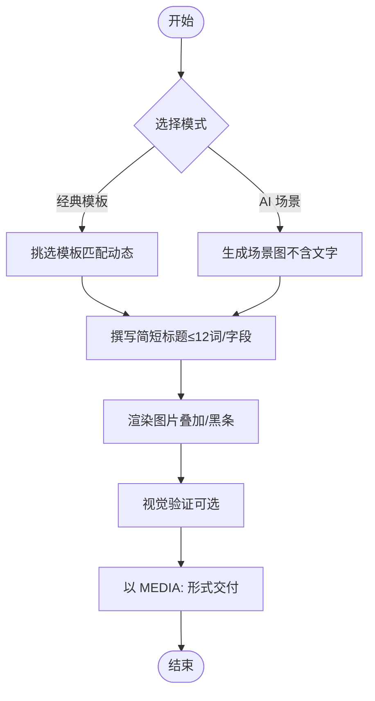

图示来源
- [optional-skills/creative/meme-generation/SKILL.md](file://optional-skills/creative/meme-generation/SKILL.md)

章节来源
- [optional-skills/creative/meme-generation/SKILL.md](file://optional-skills/creative/meme-generation/SKILL.md)

最佳实践要点
- 文本越短越好，避免长句
- 匹配模板结构而非仅主题
- 优先使用黑条模式保证可读性

## 依赖关系分析
- 技能到工具：技能通过终端/文件/网络/代码执行工具完成任务
- 工具到后端：终端工具对接本地/容器/SSH 等执行后端；网络工具对接 REST/API；代码执行工具提供沙箱
- 平台与凭据：网关平台负责消息路由与凭据注入；OAuth/令牌管理由技能或工具层处理
- 安全与合规：危险命令检测、写入白名单、技能守卫、容器加固

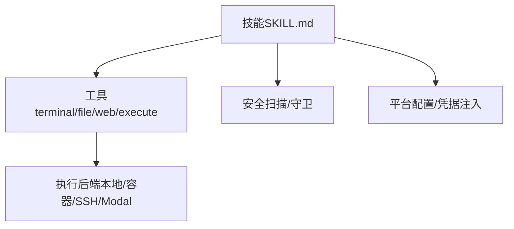

图示来源
- [CONTRIBUTING.md](file://CONTRIBUTING.md)

章节来源
- [CONTRIBUTING.md](file://CONTRIBUTING.md)

## 性能考量
- I/O 与并发
  - 尽量批处理 API 请求，减少往返次数
  - 对大文件/长耗时任务使用异步或后台执行
- 计算与内存
  - 使用多进程/分布式（如 Accelerate）提升吞吐
  - 控制输出大小（如 Jupyter 的 compact 模式）
- 网络与缓存
  - 缓存模板/令牌/中间结果，降低重复开销
  - 合理设置超时与重试策略
- 资源隔离
  - 使用沙箱与容器限制资源占用与权限

## 故障排查指南
- GitHub 相关
  - 无 gh：确认 GITHUB_TOKEN 设置或从凭据存储提取
  - CI 失败：先列出运行与日志，再按“读取→修复→推送→等待→再检查”的循环处理
  - 合并：优先 squash；启用自动合并需仓库开启相应能力
- 数据科学
  - 首次执行超时：重试一次；确认 JupyterLab 已启动且内核就绪
  - 包缺失：在 JupyterLab 环境中安装所需包
- Webhook
  - 端点不可达：检查监听地址/端口、防火墙与反向代理
  - 签名不匹配：核对服务端密钥与订阅密钥一致
- Google Workspace
  - 未认证/刷新失败：重新授权或安装依赖
  - 权限不足：确认 API 已启用且作用域正确
- 分布式训练
  - 设备放置错误：移除手动搬运，交由 Accelerator
  - 结果不一致：固定随机种子，统一后端配置

章节来源
- [skills/github/github-auth/SKILL.md](file://skills/github/github-auth/SKILL.md)
- [skills/github/github-pr-workflow/SKILL.md](file://skills/github/github-pr-workflow/SKILL.md)
- [skills/github/github-code-review/SKILL.md](file://skills/github/github-code-review/SKILL.md)
- [skills/data-science/jupyter-live-kernel/SKILL.md](file://skills/data-science/jupyter-live-kernel/SKILL.md)
- [skills/devops/webhook-subscriptions/SKILL.md](file://skills/devops/webhook-subscriptions/SKILL.md)
- [skills/productivity/google-workspace/SKILL.md](file://skills/productivity/google-workspace/SKILL.md)
- [optional-skills/mlops/accelerate/SKILL.md](file://optional-skills/mlops/accelerate/SKILL.md)

## 结论
通过标准化的 SKILL.md 规范与工具链，Hermes Agent 能够在多领域快速落地自动化能力。建议在编写新技能时遵循“清晰步骤、严谨错误处理、完善验证、安全与性能兼顾”的原则，并结合本指南中的示例与最佳实践，持续优化技能质量与用户体验。

## 附录
- 社区贡献与学习资源
  - Skills Hub：社区技能注册表，便于分享与复用
  - Discord：交流与展示渠道
  - 示例技能：GitHub 工作流、数据科学、DevOps、MLOps、创意生成等
- 贡献流程与规范
  - 优先级：缺陷修复 > 跨平台兼容 > 安全加固 > 性能与鲁棒性 > 新技能 > 新工具 > 文档
  - 技能与工具的选择：技能优先，工具用于需要定制集成与安全控制的场景

章节来源
- [README.md](file://README.md)
- [CONTRIBUTING.md](file://CONTRIBUTING.md)
- [optional-skills/DESCRIPTION.md](file://optional-skills/DESCRIPTION.md)