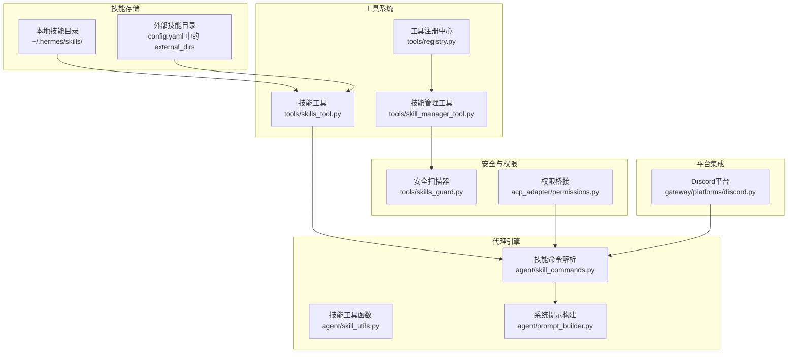
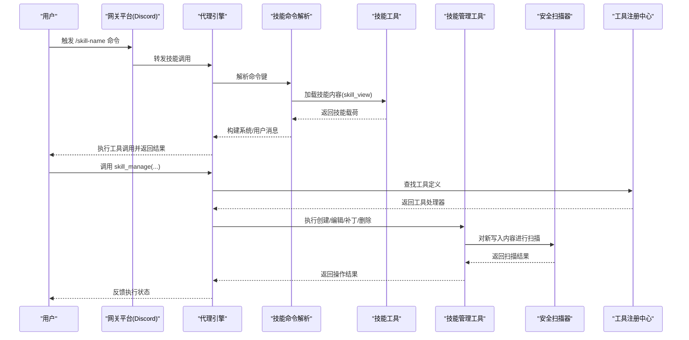
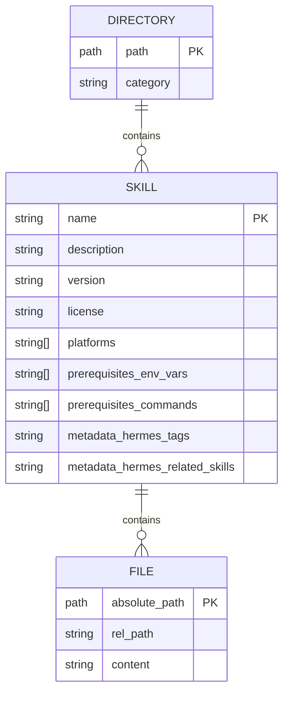
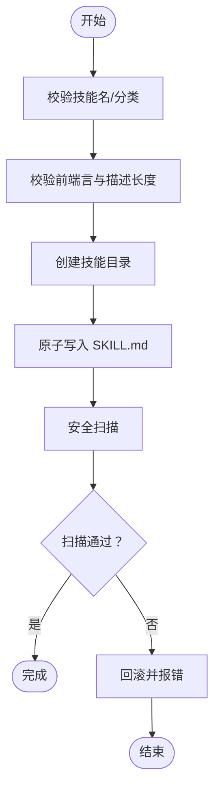
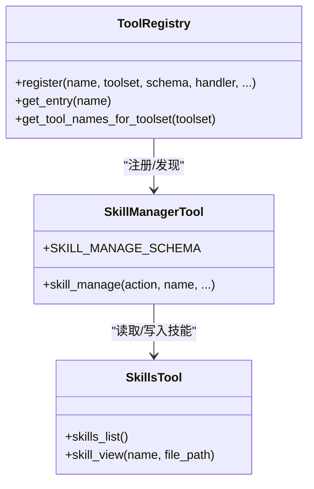
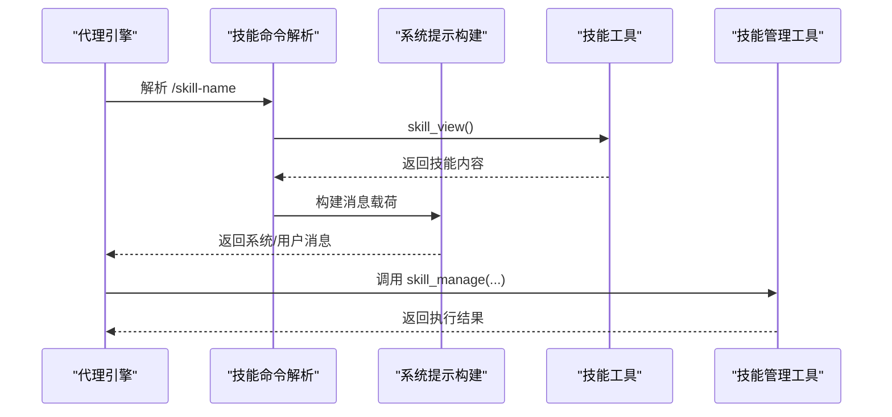
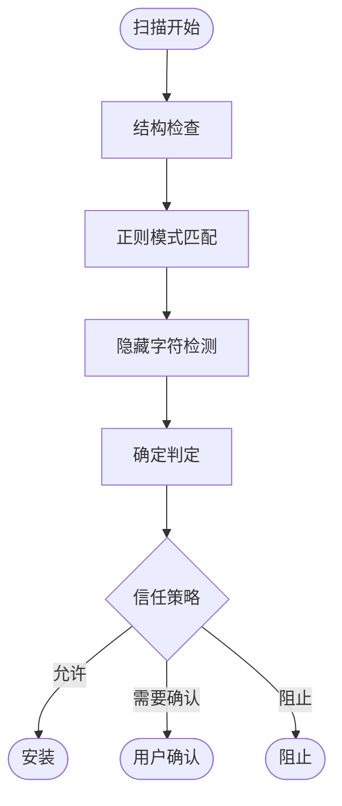
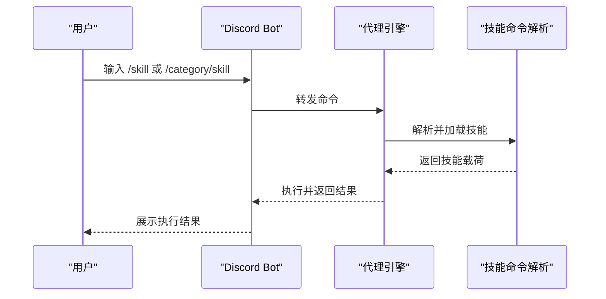
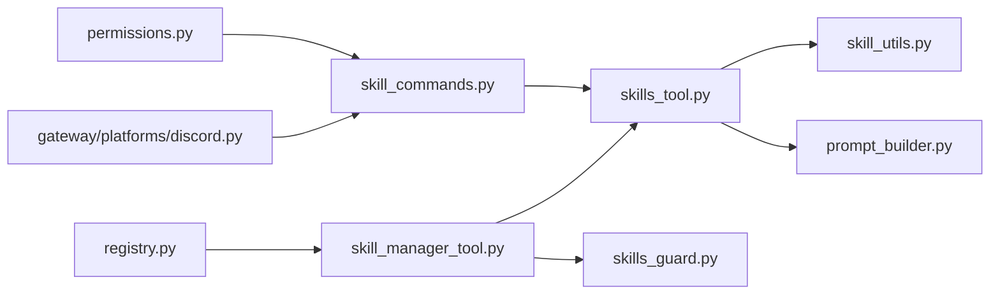

# 技能架构设计

<cite>
**本文档引用的文件**
- [skills_tool.py](file://tools/skills_tool.py)
- [skill_commands.py](file://agent/skill_commands.py)
- [skill_utils.py](file://agent/skill_utils.py)
- [skill_manager_tool.py](file://tools/skill_manager_tool.py)
- [skills_guard.py](file://tools/skills_guard.py)
- [skills_hub.py](file://tools/skills_hub.py)
- [permissions.py](file://acp_adapter/permissions.py)
- [registry.py](file://tools/registry.py)
- [prompt_builder.py](file://agent/prompt_builder.py)
- [discord.py](file://gateway/platforms/discord.py)
</cite>

## 目录
1. [简介](#简介)
2. [项目结构](#项目结构)
3. [核心组件](#核心组件)
4. [架构总览](#架构总览)
5. [详细组件分析](#详细组件分析)
6. [依赖关系分析](#依赖关系分析)
7. [性能考虑](#性能考虑)
8. [故障排除指南](#故障排除指南)
9. [结论](#结论)

## 简介
本文件面向Hermes Agent技能架构设计，系统化阐述技能系统的整体架构、目录结构、文件组织方式与数据模型；详解技能生命周期（从创建到删除）的完整流程；说明技能与工具系统的集成方式及在代理引擎中的执行机制；覆盖安全扫描、权限控制与访问管理；并提供架构图与组件关系图，解释模块间的依赖关系与交互模式。

## 项目结构
技能系统围绕以下关键目录与模块展开：
- 技能存储：`~/.hermes/skills/`（本地技能目录）
- 外部技能目录：通过配置注入的额外技能路径（支持多源共存）
- 技能内容：每个技能以独立目录存在，主文档为`SKILL.md`，可选子目录包括`references/`、`templates/`、`scripts/`、`assets/`
- 工具注册中心：统一注册与发现工具（含技能管理工具）
- 安全扫描：对社区/外部来源技能进行静态分析与信任策略判定
- 权限桥接：在ACP适配器中将危险操作请求映射为用户确认流程
- 平台集成：通过网关平台（如Discord）暴露技能命令入口

**图表来源**
- [skills_tool.py:14-27](file://tools/skills_tool.py#L14-L27)
- [registry.py:100-200](file://tools/registry.py#L100-L200)
- [skill_manager_tool.py:616-790](file://tools/skill_manager_tool.py#L616-L790)
- [skills_guard.py:595-640](file://tools/skills_guard.py#L595-L640)
- [permissions.py:26-78](file://acp_adapter/permissions.py#L26-L78)
- [skill_commands.py:209-271](file://agent/skill_commands.py#L209-L271)
- [prompt_builder.py:1-200](file://agent/prompt_builder.py#L1-L200)
- [discord.py:1930-1970](file://gateway/platforms/discord.py#L1930-L1970)

**章节来源**
- [skills_tool.py:14-27](file://tools/skills_tool.py#L14-L27)
- [skill_utils.py:174-235](file://agent/skill_utils.py#L174-L235)
- [registry.py:100-200](file://tools/registry.py#L100-L200)

## 核心组件
- 技能工具（skills_tool.py）
  - 负责技能清单与内容加载，实现渐进披露（metadata → full content → linked files）
  - 支持平台过滤、禁用列表、外部目录扫描、环境变量收集等
- 技能命令解析（skill_commands.py）
  - 将`/skill-name`命令映射到具体技能，构建消息载荷，注入技能配置与运行时注记
- 技能工具函数（skill_utils.py）
  - 提供前端言解析、平台匹配、禁用技能集合、外部目录解析、条件提取、配置变量解析等轻量工具
- 技能管理工具（skill_manager_tool.py）
  - 实现技能的创建、编辑、补丁、删除、写入/移除支持文件等操作，并内置安全扫描与原子写入
- 安全扫描器（skills_guard.py）
  - 静态正则检测威胁模式（数据外泄、提示注入、破坏性操作、持久化、网络、混淆等），结合信任策略决定安装许可
- 权限桥接（acp_adapter/permissions.py）
  - 将ACP权限请求映射为“允许一次/允许总是/拒绝”，并处理超时与错误回退
- 工具注册中心（tools/registry.py）
  - 统一注册与发现工具，避免循环导入，支持动态刷新
- 系统提示构建（agent/prompt_builder.py）
  - 扫描上下文文件，阻断潜在提示注入，构建系统提示
- 平台集成（gateway/platforms/discord.py）
  - 在Discord中生成技能分组与子命令，提供统一入口

**章节来源**
- [skills_tool.py:647-713](file://tools/skills_tool.py#L647-L713)
- [skill_commands.py:209-378](file://agent/skill_commands.py#L209-L378)
- [skill_utils.py:1-116](file://agent/skill_utils.py#L1-L116)
- [skill_manager_tool.py:304-674](file://tools/skill_manager_tool.py#L304-L674)
- [skills_guard.py:595-713](file://tools/skills_guard.py#L595-L713)
- [permissions.py:26-78](file://acp_adapter/permissions.py#L26-L78)
- [registry.py:100-200](file://tools/registry.py#L100-L200)
- [prompt_builder.py:35-74](file://agent/prompt_builder.py#L35-L74)
- [discord.py:1930-1970](file://gateway/platforms/discord.py#L1930-L1970)

## 架构总览
技能架构采用“目录即知识库”的设计，通过工具注册中心统一暴露能力，安全扫描贯穿外部来源技能的全生命周期，权限桥接保障危险操作的可控性，平台层提供多入口调用。

**图表来源**
- [discord.py:1930-1970](file://gateway/platforms/discord.py#L1930-L1970)
- [skill_commands.py:300-378](file://agent/skill_commands.py#L300-L378)
- [skills_tool.py:647-713](file://tools/skills_tool.py#L647-L713)
- [skill_manager_tool.py:616-674](file://tools/skill_manager_tool.py#L616-L674)
- [skills_guard.py:595-640](file://tools/skills_guard.py#L595-L640)
- [registry.py:176-200](file://tools/registry.py#L176-L200)

## 详细组件分析

### 技能目录结构与数据模型
- 目录布局
  - 每个技能一个目录，主文档为`SKILL.md`，支持子目录：`references/`、`templates/`、`scripts/`、`assets/`
  - 分类目录：可按领域/用途组织，如`devops/`、`mlops/`等
- 数据模型
  - 技能元数据：名称、描述、版本、许可证、平台限制、前置条件、兼容性、自定义元数据等
  - 技能内容：Markdown正文，支持YAML前端言
  - 支持文件：参考文档、模板、脚本、资源文件
- 外部目录与禁用策略
  - 通过配置注入多个技能目录，本地优先，外部次之
  - 支持按平台与全局禁用特定技能

**图表来源**
- [skills_tool.py:28-47](file://tools/skills_tool.py#L28-L47)
- [skill_utils.py:241-256](file://agent/skill_utils.py#L241-L256)

**章节来源**
- [skills_tool.py:14-27](file://tools/skills_tool.py#L14-L27)
- [skills_tool.py:433-441](file://tools/skills_tool.py#L433-L441)
- [skill_utils.py:174-235](file://agent/skill_utils.py#L174-L235)

### 技能生命周期管理
- 创建（create）
  - 校验技能名与分类合法性、前端言完整性、内容大小限制
  - 原子写入`SKILL.md`，随后进行安全扫描，失败则回滚
- 编辑（edit）
  - 全量替换`SKILL.md`，保留备份，扫描后根据结果回滚或确认
- 补丁（patch）
  - 支持在`SKILL.md`或指定支持文件内进行模糊匹配替换，确保唯一性或可选全部替换
- 删除（delete）
  - 仅允许删除本地技能目录中的技能，删除后清理空分类目录
- 写入/移除支持文件（write_file/remove_file）
  - 限定在受控子目录下，防止路径穿越，支持大小限制与原子写入

**图表来源**
- [skill_manager_tool.py:304-358](file://tools/skill_manager_tool.py#L304-L358)
- [skill_manager_tool.py:361-394](file://tools/skill_manager_tool.py#L361-L394)
- [skill_manager_tool.py:397-485](file://tools/skill_manager_tool.py#L397-L485)
- [skill_manager_tool.py:488-508](file://tools/skill_manager_tool.py#L488-L508)
- [skill_manager_tool.py:511-563](file://tools/skill_manager_tool.py#L511-L563)

**章节来源**
- [skill_manager_tool.py:304-674](file://tools/skill_manager_tool.py#L304-L674)

### 技能与工具系统的集成
- 工具注册与发现
  - 工具模块在导入时通过注册中心登记自身Schema与处理器
  - 代理引擎通过注册中心查询可用工具，避免直接导入导致的循环依赖
- 技能作为工具输入
  - 技能命令解析将`/skill-name`映射为技能载荷，注入系统提示与运行时注记
  - 支持从本地与外部目录加载技能，自动识别类别与描述
- 技能管理工具
  - 以OpenAI函数调用Schema形式暴露，便于代理自动调用
  - 操作成功后清理系统提示缓存，确保最新技能生效

**图表来源**
- [registry.py:100-200](file://tools/registry.py#L100-L200)
- [skill_manager_tool.py:770-790](file://tools/skill_manager_tool.py#L770-L790)
- [skills_tool.py:647-713](file://tools/skills_tool.py#L647-L713)

**章节来源**
- [registry.py:100-200](file://tools/registry.py#L100-L200)
- [skill_commands.py:209-378](file://agent/skill_commands.py#L209-L378)
- [skills_tool.py:647-713](file://tools/skills_tool.py#L647-L713)

### 技能在代理引擎中的执行机制
- 命令解析与消息构建
  - 将用户输入的`/skill-name`解析为技能键，加载技能内容并构建系统/用户消息
  - 注入技能配置值、设置提示、支持文件列表与运行时注记
- 系统提示构建与上下文安全
  - 扫描上下文文件（如`.hermes.md`）以阻断潜在提示注入
  - 清理前端言，仅注入人类可读正文
- 工具调用与执行
  - 代理引擎根据工具Schema调用技能管理工具，执行原子写入与安全扫描
  - 对危险命令通过ACP权限桥接进行用户确认

**图表来源**
- [skill_commands.py:300-378](file://agent/skill_commands.py#L300-L378)
- [prompt_builder.py:35-74](file://agent/prompt_builder.py#L35-L74)
- [skills_tool.py:647-713](file://tools/skills_tool.py#L647-L713)
- [skill_manager_tool.py:616-674](file://tools/skill_manager_tool.py#L616-L674)

**章节来源**
- [skill_commands.py:300-378](file://agent/skill_commands.py#L300-L378)
- [prompt_builder.py:35-74](file://agent/prompt_builder.py#L35-L74)

### 安全扫描机制、权限控制与访问管理
- 安全扫描
  - 结构检查：文件数量、总大小、单文件大小、二进制文件、符号链接边界
  - 正则检测：数据外泄、提示注入、破坏性操作、持久化、网络隧道、混淆、路径穿越、加密挖矿、供应链风险、提权、配置篡改、硬编码凭证等
  - 信任策略：内置（始终信任）、可信仓库（允许警告）、社区（需确认或阻止）、代理创建（需确认）
- 权限控制
  - ACP权限桥接将“允许一次/允许总是/拒绝”映射为代理内部批准结果
  - 超时或异常默认拒绝，确保安全回退
- 访问管理
  - 本地技能目录可修改/删除；外部目录只读
  - 支持路径遍历防护与敏感文件泄露阻断

**图表来源**
- [skills_guard.py:595-640](file://tools/skills_guard.py#L595-L640)
- [skills_guard.py:642-677](file://tools/skills_guard.py#L642-L677)
- [permissions.py:26-78](file://acp_adapter/permissions.py#L26-L78)
- [skill_manager_tool.py:56-74](file://tools/skill_manager_tool.py#L56-L74)

**章节来源**
- [skills_guard.py:595-713](file://tools/skills_guard.py#L595-L713)
- [permissions.py:26-78](file://acp_adapter/permissions.py#L26-L78)
- [skill_manager_tool.py:56-74](file://tools/skill_manager_tool.py#L56-L74)

### 平台集成与用户入口
- Discord平台
  - 自动构建技能分组与子命令，支持根级技能与按类别的子分组
  - 将技能命令映射到实际执行逻辑，提供一致的用户体验

**图表来源**
- [discord.py:1930-1970](file://gateway/platforms/discord.py#L1930-L1970)
- [skill_commands.py:209-271](file://agent/skill_commands.py#L209-L271)

**章节来源**
- [discord.py:1930-1970](file://gateway/platforms/discord.py#L1930-L1970)

## 依赖关系分析
- 组件耦合
  - 技能工具与技能命令解析紧密耦合，前者负责内容加载，后者负责消息构建
  - 技能管理工具依赖安全扫描器与路径安全工具，确保写入安全
  - 工具注册中心解耦工具实现与调用方，降低循环导入风险
- 外部依赖
  - ACP权限桥接依赖异步事件循环与权限选项映射
  - 系统提示构建依赖上下文文件扫描与正则匹配
- 潜在环路
  - 通过延迟导入与注册中心避免模块间直接循环依赖

**图表来源**
- [skills_tool.py:647-713](file://tools/skills_tool.py#L647-L713)
- [skill_utils.py:1-116](file://agent/skill_utils.py#L1-L116)
- [prompt_builder.py:1-200](file://agent/prompt_builder.py#L1-L200)
- [skill_commands.py:209-378](file://agent/skill_commands.py#L209-L378)
- [skill_manager_tool.py:304-674](file://tools/skill_manager_tool.py#L304-L674)
- [skills_guard.py:595-640](file://tools/skills_guard.py#L595-L640)
- [registry.py:100-200](file://tools/registry.py#L100-L200)
- [permissions.py:26-78](file://acp_adapter/permissions.py#L26-L78)
- [discord.py:1930-1970](file://gateway/platforms/discord.py#L1930-L1970)

**章节来源**
- [skills_tool.py:647-713](file://tools/skills_tool.py#L647-L713)
- [skill_commands.py:209-378](file://agent/skill_commands.py#L209-L378)
- [skill_manager_tool.py:304-674](file://tools/skill_manager_tool.py#L304-L674)
- [registry.py:100-200](file://tools/registry.py#L100-L200)

## 性能考虑
- 渐进披露与令牌效率
  - 列表接口仅返回最小元数据，避免一次性加载全文
- 文件扫描优化
  - 限制扫描扩展名与大小，跳过二进制文件，减少IO与CPU开销
- 原子写入与回滚
  - 使用临时文件+替换策略，避免部分写入与竞态条件
- 缓存与索引
  - 系统提示缓存在技能变更后主动清理，确保一致性与性能平衡

## 故障排除指南
- 技能未显示或加载失败
  - 检查`SKILL.md`是否包含有效前端言与描述，确认平台兼容性
  - 确认技能不在外部目录且具备写权限
- 安全扫描被阻止
  - 查看扫描报告，修正高危/警告项后重试
  - 对于代理创建的技能，扫描可能要求确认
- 权限请求超时或失败
  - 确认ACP客户端连接正常，事件循环可用
  - 默认回退为拒绝，确保不会执行危险命令
- 路径遍历与敏感文件泄露
  - 确保文件路径在受控子目录内，避免使用`..`或绝对路径
  - 上下文文件扫描会阻断潜在注入

**章节来源**
- [skills_guard.py:679-713](file://tools/skills_guard.py#L679-L713)
- [permissions.py:59-76](file://acp_adapter/permissions.py#L59-L76)
- [prompt_builder.py:55-74](file://agent/prompt_builder.py#L55-L74)

## 结论
Hermes Agent技能架构以“目录即知识库”为核心，通过工具注册中心统一暴露能力，结合安全扫描与权限桥接，确保外部来源技能的安全可控；平台层提供多入口调用，代理引擎负责消息构建与工具执行。该设计在功能完备性、安全性与可扩展性之间取得良好平衡，适合复杂场景下的技能管理与执行。