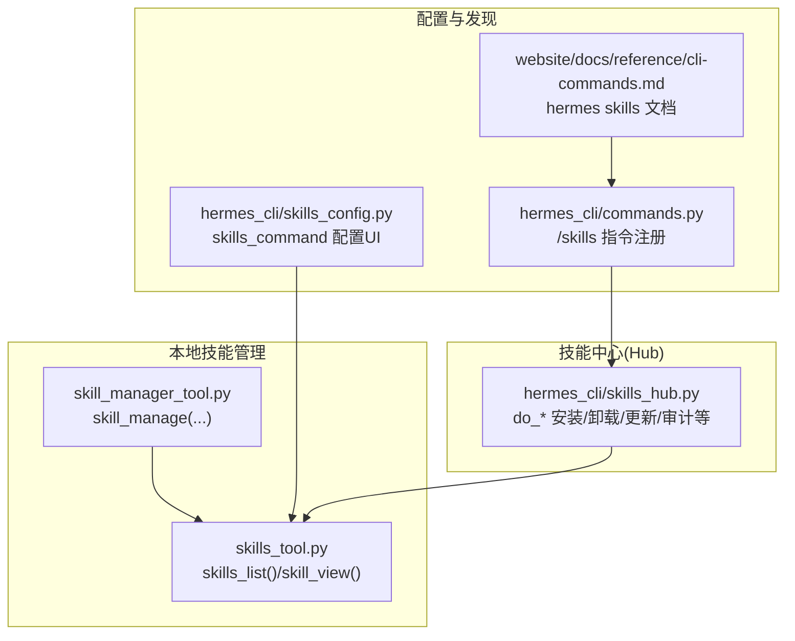
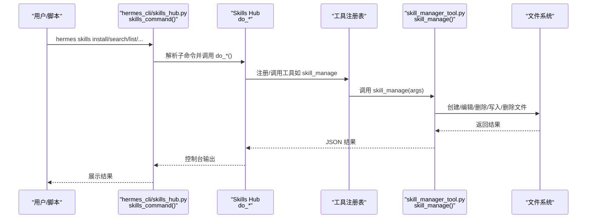
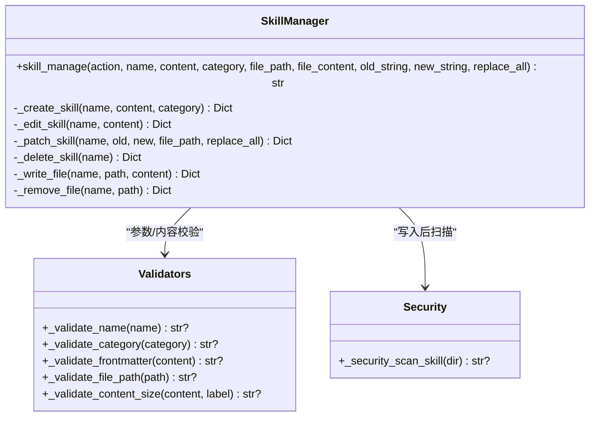
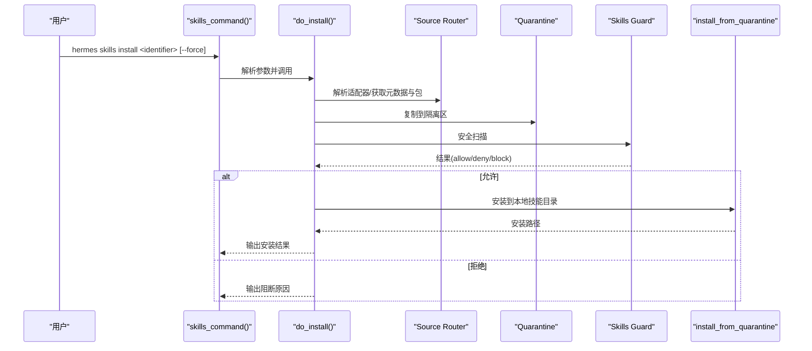
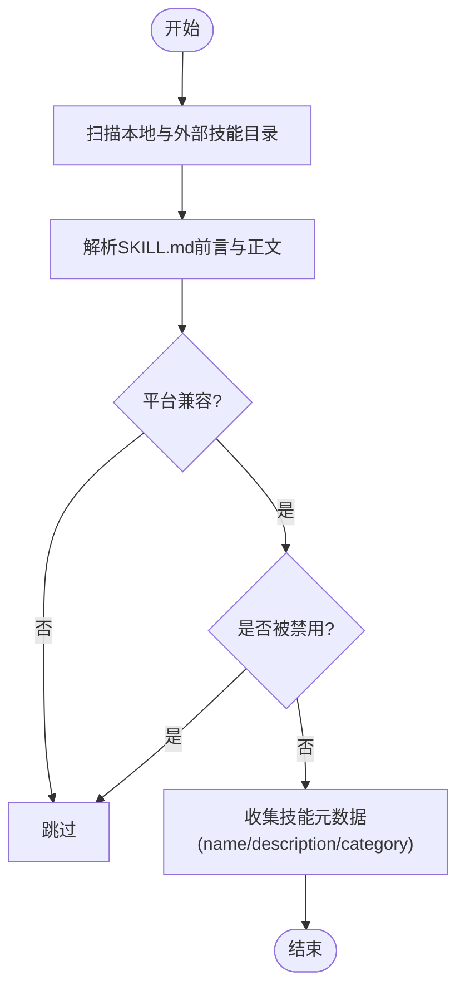
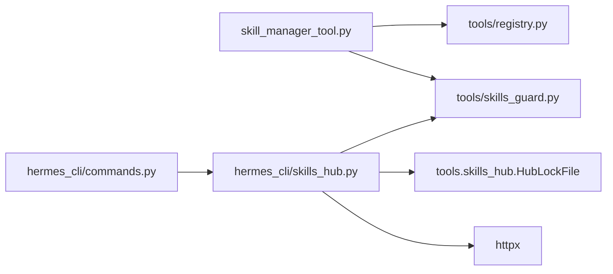

# 技能管理工具

<cite>
**本文引用的文件**
- [skill_manager_tool.py](file://tools/skill_manager_tool.py)
- [skills_tool.py](file://tools/skills_tool.py)
- [skills_hub.py](file://hermes_cli/skills_hub.py)
- [skills_config.py](file://hermes_cli/skills_config.py)
- [commands.py](file://hermes_cli/commands.py)
- [cli-commands.md](file://website/docs/reference/cli-commands.md)
- [test_skill_manager_tool.py](file://tests/tools/test_skill_manager_tool.py)
</cite>

## 目录
1. [简介](#简介)
2. [项目结构](#项目结构)
3. [核心组件](#核心组件)
4. [架构总览](#架构总览)
5. [详细组件分析](#详细组件分析)
6. [依赖分析](#依赖分析)
7. [性能考虑](#性能考虑)
8. [故障排除指南](#故障排除指南)
9. [结论](#结论)
10. [附录](#附录)

## 简介
本文件面向Hermes Agent用户与开发者，系统化讲解“技能管理工具”的使用与实现原理，重点覆盖以下内容：
- skill_manage函数的六种操作模式：create、edit、patch、delete、write_file、remove_file 的参数、行为与最佳实践
- hermes skills 命令行子命令的完整用法与选项
- 技能搜索、发现与列表管理机制
- 批量操作与自动化脚本编写思路
- 常见问题与排障建议
- 实际使用案例与操作示例

## 项目结构
技能管理涉及三个层面：
- 用户技能的本地创建、编辑与删除：由工具模块提供
- 技能的安装、卸载、更新与审计：由技能中心（Skills Hub）提供
- 技能的启用/禁用与按平台过滤：由配置模块提供

图表来源
- [skill_manager_tool.py:616-790](file://tools/skill_manager_tool.py#L616-L790)
- [skills_tool.py:647-800](file://tools/skills_tool.py#L647-L800)
- [skills_hub.py:987-1034](file://hermes_cli/skills_hub.py#L987-L1034)
- [skills_config.py:125-178](file://hermes_cli/skills_config.py#L125-L178)
- [commands.py:127-134](file://hermes_cli/commands.py#L127-L134)
- [cli-commands.md:547-592](file://website/docs/reference/cli-commands.md#L547-L592)

章节来源
- [skill_manager_tool.py:1-120](file://tools/skill_manager_tool.py#L1-L120)
- [skills_tool.py:1-120](file://tools/skills_tool.py#L1-L120)
- [skills_hub.py:1-120](file://hermes_cli/skills_hub.py#L1-L120)
- [skills_config.py:1-60](file://hermes_cli/skills_config.py#L1-L60)
- [commands.py:59-170](file://hermes_cli/commands.py#L59-L170)
- [cli-commands.md:547-592](file://website/docs/reference/cli-commands.md#L547-L592)

## 核心组件
- skill_manage：统一入口，负责校验参数、路由到具体动作，并在成功后清理提示缓存
- 技能验证与安全扫描：名称/分类/正文/文件路径合法性检查；写入后自动安全扫描
- 支持文件管理：references/templates/scripts/assets 子目录下的原子写入与删除
- 技能发现与列表：递归扫描本地与外部技能目录，支持按平台过滤与禁用列表
- Skills Hub：集中式技能仓库的搜索、浏览、安装、更新、审计与发布
- 技能配置：按平台启用/禁用技能，支持全局与平台维度

章节来源
- [skill_manager_tool.py:616-790](file://tools/skill_manager_tool.py#L616-L790)
- [skills_tool.py:527-713](file://tools/skills_tool.py#L527-L713)
- [skills_hub.py:144-286](file://hermes_cli/skills_hub.py#L144-L286)
- [skills_config.py:125-178](file://hermes_cli/skills_config.py#L125-L178)

## 架构总览
下图展示从命令到工具再到文件系统的调用链路。

图表来源
- [skills_hub.py:987-1034](file://hermes_cli/skills_hub.py#L987-L1034)
- [skill_manager_tool.py:616-790](file://tools/skill_manager_tool.py#L616-L790)

章节来源
- [skills_hub.py:987-1034](file://hermes_cli/skills_hub.py#L987-L1034)
- [skill_manager_tool.py:616-790](file://tools/skill_manager_tool.py#L616-L790)

## 详细组件分析

### skill_manage 函数详解
- 动作类型与参数
  - create：name、content（必填）、category（可选）
  - edit：name、content（必填）
  - patch：name、old_string（必填）、new_string（必填，空串可删除匹配文本）、file_path（可选，默认SKILL.md）、replace_all（布尔）
  - delete：name
  - write_file：name、file_path（必填，references/templates/scripts/assets 下）、file_content（必填）
  - remove_file：name、file_path（必填）
- 行为要点
  - 统一返回JSON字符串，包含success/error/message/path等字段
  - 成功后清理技能系统提示缓存，确保新技能立即生效
  - 写入采用原子落盘，失败时回滚
  - 安全扫描：写入后对技能目录进行扫描，若阻断则回滚并报错
- 参数校验
  - 名称/分类：仅允许小写字母、数字、点与下划线，且以字母或数字开头；长度限制
  - 正文：必须有合法YAML前言（name/description），正文非空
  - 文件路径：禁止路径穿越；必须位于允许子目录；必须是文件而非目录
  - 大小限制：单个技能正文字符数上限；支持文件字节上限
- 最佳实践
  - 使用patch进行局部修改，避免大范围重写
  - 对于多处重复内容，开启replace_all并提供足够上下文
  - 新建技能时先在本地草稿中完成前后端言与正文，再执行create
  - write_file用于添加参考文档、模板、脚本与资源文件

章节来源
- [skill_manager_tool.py:616-790](file://tools/skill_manager_tool.py#L616-L790)
- [test_skill_manager_tool.py:192-487](file://tests/tools/test_skill_manager_tool.py#L192-L487)

#### 类图：核心数据流与职责

图表来源
- [skill_manager_tool.py:304-790](file://tools/skill_manager_tool.py#L304-L790)

### hermes skills 命令行接口
- 子命令概览
  - browse：分页浏览技能源
  - search：在技能源中检索
  - install：安装技能（含安全扫描与确认）
  - inspect：预览技能而不安装
  - list：列出已安装技能（区分hub/builtin/local）
  - check/update：检查/更新上游变更
  - audit：对已安装技能重新扫描
  - uninstall：卸载技能
  - publish：发布本地技能（当前支持GitHub PR）
  - snapshot：导出/导入技能配置快照
  - tap：管理自定义技能源
  - config：交互式启用/禁用技能（按平台）
- 常用选项
  - --source：限定搜索/浏览源（如official、skills-sh、well-known、github等）
  - --limit/--size：控制分页数量
  - --force：覆盖非危险策略阻断（不覆盖dangerous）
  - --category：安装时指定分类
  - --now：立即失效提示缓存（成本更高）
  - --to/--repo：发布目标与仓库
  - --input/--output：快照导入/导出文件
- 使用示例
  - hermes skills browse
  - hermes skills search react --source skills-sh
  - hermes skills install official/migration/openclaw-migration
  - hermes skills list --source hub
  - hermes skills snapshot export hermes-snap.json

章节来源
- [cli-commands.md:547-592](file://website/docs/reference/cli-commands.md#L547-L592)
- [skills_hub.py:987-1034](file://hermes_cli/skills_hub.py#L987-L1034)
- [skills_hub.py:1040-1239](file://hermes_cli/skills_hub.py#L1040-L1239)

#### 序列图：安装流程

图表来源
- [skills_hub.py:310-466](file://hermes_cli/skills_hub.py#L310-L466)

### 技能搜索与发现机制
- 本地发现
  - 递归扫描~/.hermes/skills/及外部目录（通过配置注入）
  - 过滤条件：排除.git/.github/.hub等目录；按平台过滤；跳过禁用技能
  - 提取信息：name/description/category，描述截断至最大长度
- 技能中心
  - 支持多源并行搜索/浏览（官方、skills-sh、well-known、github、clawhub、claude-marketplace、lobehub等）
  - 浏览时去重并按信任度排序，支持分页
  - 搜索时优先目录索引，失败回退到轻量列表接口
- 平台与禁用
  - 可按平台维度禁用技能
  - 支持全局与平台维度的启用/禁用配置

章节来源
- [skills_tool.py:527-713](file://tools/skills_tool.py#L527-L713)
- [skills_hub.py:144-286](file://hermes_cli/skills_hub.py#L144-L286)
- [skills_config.py:125-178](file://hermes_cli/skills_config.py#L125-L178)

#### 流程图：技能发现与过滤

图表来源
- [skills_tool.py:527-713](file://tools/skills_tool.py#L527-L713)

### 批量操作与自动化脚本
- 批量安装/更新
  - 使用check列出待更新技能，再循环调用update
  - 或直接对特定技能名调用update
- 快照管理
  - 导出：snapshot export 导出当前安装与tap配置
  - 导入：snapshot import 一键恢复到另一环境
- 自动化建议
  - 在CI中定期运行check与update，确保技能版本最新
  - 将快照纳入版本控制，便于团队共享一致的技能配置
  - 使用--force谨慎地批量覆盖第三方技能

章节来源
- [skills_hub.py:576-617](file://hermes_cli/skills_hub.py#L576-L617)
- [skills_hub.py:896-981](file://hermes_cli/skills_hub.py#L896-L981)

## 依赖分析
- 工具注册与调度
  - skill_manage通过注册表对外暴露，供其他模块调用
- 平台与权限
  - /skills指令在不同网关平台上的可用性受配置门控
- 外部依赖
  - Skills Hub依赖HTTP客户端访问远端索引与仓库
  - 安全扫描依赖内置扫描器

图表来源
- [skill_manager_tool.py:772-790](file://tools/skill_manager_tool.py#L772-L790)
- [skills_hub.py:310-466](file://hermes_cli/skills_hub.py#L310-L466)
- [commands.py:127-134](file://hermes_cli/commands.py#L127-L134)

章节来源
- [skill_manager_tool.py:772-790](file://tools/skill_manager_tool.py#L772-L790)
- [skills_hub.py:310-466](file://hermes_cli/skills_hub.py#L310-L466)
- [commands.py:127-134](file://hermes_cli/commands.py#L127-L134)

## 性能考虑
- 列表加载
  - skills_list仅读取前言与正文片段，避免全量加载，降低token消耗
- 并发与超时
  - Skills Hub浏览时对多个源并行搜索，设置整体超时上限，防止长时间阻塞
- 缓存与提示重建
  - 成功写入后清理技能系统提示缓存，确保新技能立即生效；但频繁清理会增加成本，建议按需使用--now

章节来源
- [skills_tool.py:647-713](file://tools/skills_tool.py#L647-L713)
- [skills_hub.py:184-218](file://hermes_cli/skills_hub.py#L184-L218)
- [skill_manager_tool.py:667-674](file://tools/skill_manager_tool.py#L667-L674)

## 故障排除指南
- 常见错误与处理
  - “未知动作”：确认action为create/patch/edit/delete/write_file/remove_file之一
  - “缺少必要参数”：如create需要content，patch需要old_string/new_string，write_file需要file_path与file_content
  - “文件路径非法”：确保file_path位于references/templates/scripts/assets下，且无路径穿越
  - “技能未找到”：确认name正确，或先使用skills_list查看可用技能
  - “安全扫描阻断”：根据报告修正潜在风险后重试
  - “GitHub API速率限制”：设置GITHUB_TOKEN或登录gh CLI提升限额
- 排查步骤
  - 使用skills list确认技能状态
  - 使用skills inspect预览技能内容
  - 使用skills audit对已安装技能重新扫描
  - 使用snapshot export/import快速还原环境

章节来源
- [skill_manager_tool.py:616-790](file://tools/skill_manager_tool.py#L616-L790)
- [skills_hub.py:335-402](file://hermes_cli/skills_hub.py#L335-L402)
- [skills_hub.py:619-650](file://hermes_cli/skills_hub.py#L619-L650)

## 结论
Hermes Agent的技能管理工具提供了从本地技能创建、编辑、删除，到技能中心安装、更新、审计与发布的完整闭环。通过严格的参数校验、安全扫描与原子写入，保障了技能的可靠性与安全性。配合hermes skills命令行工具与快照功能，用户可以高效地组织、维护与自动化技能配置。

## 附录

### 命令速查与示例
- hermes skills browse
- hermes skills search <query> [--source <src>] [--limit N]
- hermes skills install <identifier> [--category <cat>] [--force] [--now]
- hermes skills inspect <identifier>
- hermes skills list [--source hub|builtin|local]
- hermes skills check [name]
- hermes skills update [name]
- hermes skills audit [name]
- hermes skills uninstall <name> [--now]
- hermes skills publish <path> [--to github] [--repo owner/repo]
- hermes skills snapshot export|import <file> [--force]
- hermes skills tap list|add|remove [repo]

章节来源
- [cli-commands.md:547-592](file://website/docs/reference/cli-commands.md#L547-L592)
- [skills_hub.py:987-1034](file://hermes_cli/skills_hub.py#L987-L1034)