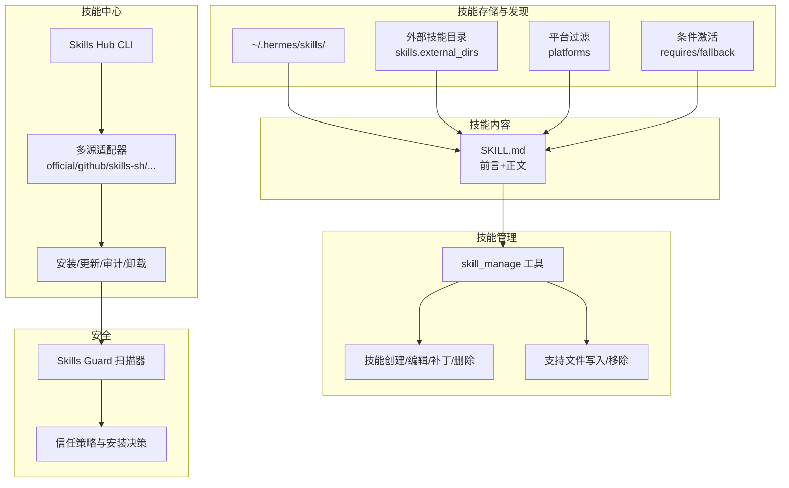
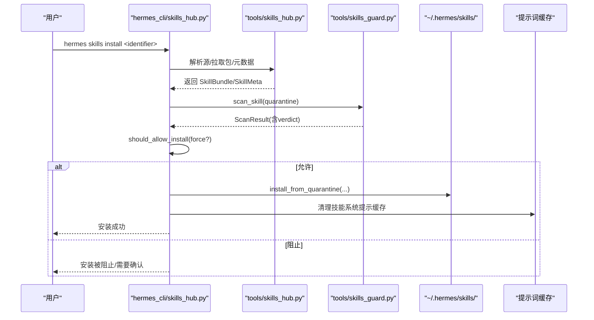
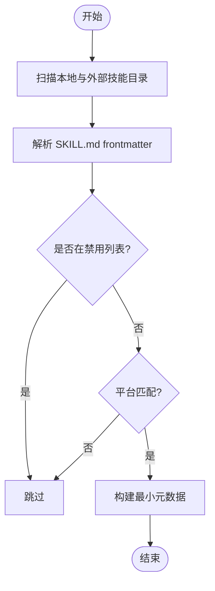
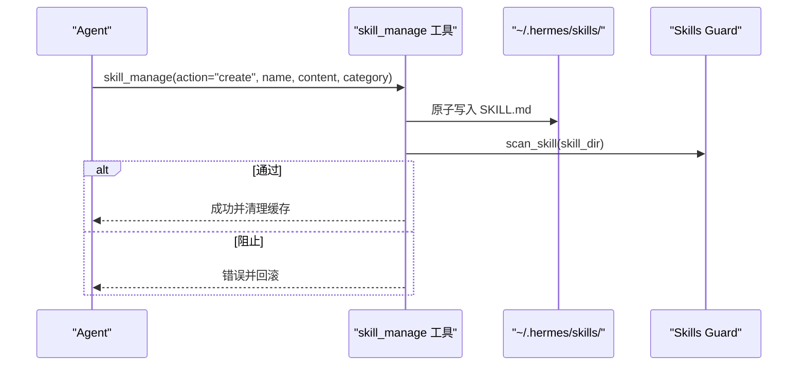
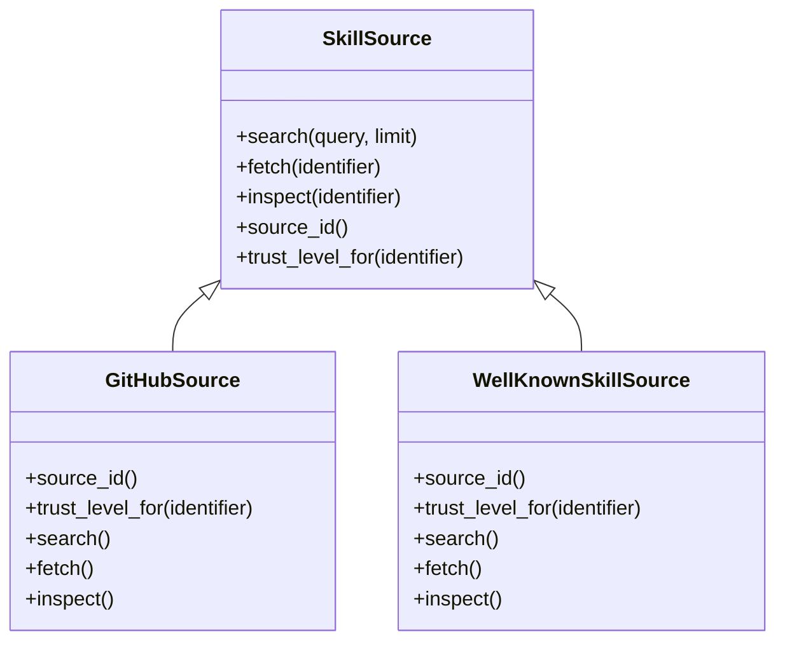
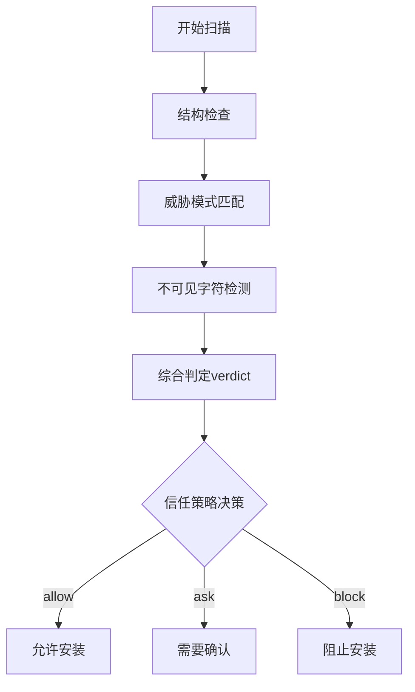
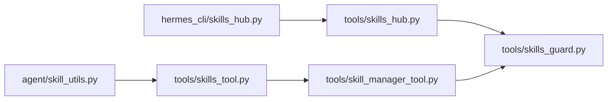

# 技能系统

<cite>
**本文引用的文件**
- [skills/index-cache/claude_marketplace_anthropics_skills.json](file://skills/index-cache/claude_marketplace_anthropics_skills.json)
- [website/docs/user-guide/features/skills.md](file://website/docs/user-guide/features/skills.md)
- [hermes_cli/skills_config.py](file://hermes_cli/skills_config.py)
- [hermes_cli/skills_hub.py](file://hermes_cli/skills_hub.py)
- [tools/skills_hub.py](file://tools/skills_hub.py)
- [tools/skills_tool.py](file://tools/skills_tool.py)
- [tools/skill_manager_tool.py](file://tools/skill_manager_tool.py)
- [agent/skill_utils.py](file://agent/skill_utils.py)
- [tools/skills_guard.py](file://tools/skills_guard.py)
- [skills/dogfood/SKILL.md](file://skills/dogfood/SKILL.md)
- [optional-skills/DESCRIPTION.md](file://optional-skills/DESCRIPTION.md)
</cite>

## 目录
1. [简介](#简介)
2. [项目结构](#项目结构)
3. [核心组件](#核心组件)
4. [架构总览](#架构总览)
5. [详细组件分析](#详细组件分析)
6. [依赖关系分析](#依赖关系分析)
7. [性能考量](#性能考量)
8. [故障排除指南](#故障排除指南)
9. [结论](#结论)
10. [附录](#附录)

## 简介
本文件系统性阐述 Hermes Agent 的技能系统：从架构设计到创建流程，从生命周期管理（创建、测试、改进、分享）到与工具系统的集成与依赖管理；并覆盖内置技能使用、技能中心集成与社区分享机制、调试与故障排除等主题。目标是帮助开发者与用户高效、安全地构建与维护技能。

## 项目结构
技能系统围绕以下关键模块协同工作：
- 技能目录与发现：本地技能目录、外部技能目录、平台过滤、条件激活字段解析
- 技能内容格式：SKILL.md 前言元数据与正文规范
- 技能管理：本地创建/编辑/补丁/删除、支持文件写入/移除
- 技能中心：多源注册表浏览/搜索/安装/更新/审计/卸载
- 安全扫描：第三方技能安装前的安全扫描与信任策略
- 配置开关：按平台禁用/启用技能集合

图示来源
- [tools/skills_tool.py:1-120](file://tools/skills_tool.py#L1-L120)
- [agent/skill_utils.py:92-116](file://agent/skill_utils.py#L92-L116)
- [tools/skill_manager_tool.py:616-675](file://tools/skill_manager_tool.py#L616-L675)
- [hermes_cli/skills_hub.py:144-182](file://hermes_cli/skills_hub.py#L144-L182)
- [tools/skills_hub.py:284-376](file://tools/skills_hub.py#L284-L376)
- [tools/skills_guard.py:41-47](file://tools/skills_guard.py#L41-L47)

章节来源
- [tools/skills_tool.py:1-120](file://tools/skills_tool.py#L1-L120)
- [agent/skill_utils.py:92-116](file://agent/skill_utils.py#L92-L116)
- [website/docs/user-guide/features/skills.md:1-60](file://website/docs/user-guide/features/skills.md#L1-L60)

## 核心组件
- 技能目录与发现
  - 单一来源真相：所有技能位于 ~/.hermes/skills/，包含本地创建、Hub 安装、内置种子技能三类来源
  - 外部目录：通过配置项 skills.external_dirs 指定只读扫描路径，本地优先
  - 平台过滤：SKILL.md frontmatter 的 platforms 字段控制在哪些操作系统可见
  - 条件激活：requires_toolsets/fallback_for_toolsets 等字段根据当前会话可用工具动态显示/隐藏
- 技能内容格式
  - SKILL.md 使用 YAML frontmatter，声明 name、description、version、platforms、metadata 等
  - metadata.hermes 支持 tags、category、config、工具集/工具依赖声明
- 技能管理工具
  - skill_manage 提供 create/edit/patch/delete/write_file/remove_file 动作
  - 写入采用原子落盘，失败回滚；安装后自动清理系统提示词缓存
- 技能中心
  - hermes_cli/skills_hub.py 提供 browse/search/inspect/install/list/check/update/audit/uninstall/publish 等命令
  - tools/skills_hub.py 提供多源适配器（official/github/skills-sh/well-known/clawhub/lobehub/claude-marketplace）
- 安全扫描
  - tools/skills_guard.py 对第三方技能进行结构检查与威胁模式匹配，结合信任级别与策略决定是否允许安装
- 配置开关
  - hermes_cli/skills_config.py 提供按全局或平台维度禁用/启用技能的能力

章节来源
- [website/docs/user-guide/features/skills.md:56-133](file://website/docs/user-guide/features/skills.md#L56-L133)
- [tools/skill_manager_tool.py:616-675](file://tools/skill_manager_tool.py#L616-L675)
- [hermes_cli/skills_hub.py:144-182](file://hermes_cli/skills_hub.py#L144-L182)
- [tools/skills_guard.py:41-47](file://tools/skills_guard.py#L41-L47)
- [hermes_cli/skills_config.py:27-47](file://hermes_cli/skills_config.py#L27-L47)

## 架构总览
技能系统遵循“渐进披露”原则：仅在需要时加载完整技能内容，以降低上下文开销。系统通过工具注册表暴露技能相关能力，并在安装/修改后触发缓存失效，确保最新状态即时生效。

图示来源
- [hermes_cli/skills_hub.py:310-466](file://hermes_cli/skills_hub.py#L310-L466)
- [tools/skills_hub.py:350-376](file://tools/skills_hub.py#L350-L376)
- [tools/skills_guard.py:642-677](file://tools/skills_guard.py#L642-L677)

## 详细组件分析

### 组件A：技能内容与发现（skills_tool 与 skill_utils）
- 发现与过滤
  - 递归扫描本地与外部技能目录，排除 .git/.github/.hub
  - 过滤已禁用技能与不兼容平台
  - 生成最小元数据列表（skills_list），仅包含 name/description/category
- 平台与条件
  - skill_matches_platform 根据 frontmatter.platforms 判断
  - extract_skill_conditions 与 extract_skill_config_vars 解析条件与配置声明
- 内容加载
  - skill_view 在需要时加载完整内容与链接文件

图示来源
- [tools/skills_tool.py:527-601](file://tools/skills_tool.py#L527-L601)
- [agent/skill_utils.py:92-116](file://agent/skill_utils.py#L92-L116)

章节来源
- [tools/skills_tool.py:527-713](file://tools/skills_tool.py#L527-L713)
- [agent/skill_utils.py:241-318](file://agent/skill_utils.py#L241-L318)

### 组件B：技能管理工具（skill_manage）
- 能力范围
  - create：创建新技能（含可选分类）
  - edit：整篇重写
  - patch：精准替换（支持模糊匹配与唯一性约束）
  - delete：删除技能
  - write_file/remove_file：对支持文件进行增删改
- 安全与合规
  - 写入采用原子落盘，失败回滚
  - 安装后清理提示词缓存，确保变更立即生效
  - agent 创建的技能同样接受安全扫描

图示来源
- [tools/skill_manager_tool.py:304-358](file://tools/skill_manager_tool.py#L304-L358)
- [tools/skill_manager_tool.py:511-563](file://tools/skill_manager_tool.py#L511-L563)
- [tools/skill_manager_tool.py:668-674](file://tools/skill_manager_tool.py#L668-L674)

章节来源
- [tools/skill_manager_tool.py:616-790](file://tools/skill_manager_tool.py#L616-L790)

### 组件C：技能中心与多源适配（skills_hub 与 hermes_cli/skills_hub）
- 多源适配器
  - official：内置官方可选技能（builtin trust）
  - github：GitHub 仓库/自定义 taps
  - skills-sh：skills.sh 目录
  - well-known：站点的 .well-known/skills/index.json
  - clawhub/lobehub/claude-marketplace：社区/市场集成
- CLI 命令
  - browse/search/inspect/install/list/check/update/audit/uninstall/publish/tap
- 安全与信任
  - 安装前扫描，基于 trust_level 与策略决定是否允许
  - 支持 --force 覆盖非危险策略阻断（dangerous 不可强制）

图示来源
- [tools/skills_hub.py:252-278](file://tools/skills_hub.py#L252-L278)
- [tools/skills_hub.py:284-415](file://tools/skills_hub.py#L284-L415)
- [tools/skills_hub.py:707-800](file://tools/skills_hub.py#L707-L800)

章节来源
- [hermes_cli/skills_hub.py:144-182](file://hermes_cli/skills_hub.py#L144-L182)
- [tools/skills_hub.py:284-415](file://tools/skills_hub.py#L284-L415)
- [tools/skills_hub.py:707-800](file://tools/skills_hub.py#L707-L800)

### 组件D：安全扫描与安装策略（skills_guard）
- 扫描范围
  - 结构检查：文件数量、总大小、单文件大小、二进制/可执行、符号链接合法性
  - 威胁模式：数据外泄、注入、破坏性操作、持久化、网络隧道、混淆、执行、路径穿越、挖矿、供应链、提权、硬编码凭据等
- 信任与策略
  - builtin/trusted/community/agent-created 四级信任
  - 不同信任级别下对 safe/caution/dangerous 的策略不同
  - --force 可覆盖非危险策略阻断，但不能绕过 dangerous

图示来源
- [tools/skills_guard.py:595-640](file://tools/skills_guard.py#L595-L640)
- [tools/skills_guard.py:642-677](file://tools/skills_guard.py#L642-L677)

章节来源
- [tools/skills_guard.py:41-47](file://tools/skills_guard.py#L41-L47)
- [tools/skills_guard.py:82-484](file://tools/skills_guard.py#L82-L484)
- [tools/skills_guard.py:642-677](file://tools/skills_guard.py#L642-L677)

### 组件E：配置与平台开关（skills_config）
- 全局禁用与平台禁用
  - skills.disabled 与 skills.platform_disabled
  - 支持交互式选择平台、按类别批量切换
- 与技能发现的协作
  - 技能发现阶段会过滤掉禁用与平台不兼容的技能

章节来源
- [hermes_cli/skills_config.py:27-47](file://hermes_cli/skills_config.py#L27-L47)
- [hermes_cli/skills_config.py:125-178](file://hermes_cli/skills_config.py#L125-L178)
- [tools/skills_tool.py:500-525](file://tools/skills_tool.py#L500-L525)

## 依赖关系分析
- 技能发现依赖
  - agent/skill_utils：平台匹配、禁用名单、外部目录解析、条件与配置提取
  - tools/skills_tool：实际扫描与元数据构建
- 技能管理依赖
  - tools/skill_manager_tool：原子写入、模糊补丁、安全扫描、缓存失效
- 技能中心依赖
  - tools/skills_hub：多源适配器、索引缓存、锁文件、审核日志
  - hermes_cli/skills_hub：命令行入口与富文本输出
- 安全依赖
  - tools/skills_guard：扫描器与信任策略

图示来源
- [agent/skill_utils.py:121-169](file://agent/skill_utils.py#L121-L169)
- [tools/skills_tool.py:527-601](file://tools/skills_tool.py#L527-L601)
- [tools/skill_manager_tool.py:56-75](file://tools/skill_manager_tool.py#L56-L75)
- [hermes_cli/skills_hub.py:144-182](file://hermes_cli/skills_hub.py#L144-L182)
- [tools/skills_hub.py:46-56](file://tools/skills_hub.py#L46-L56)

章节来源
- [agent/skill_utils.py:121-169](file://agent/skill_utils.py#L121-L169)
- [tools/skills_tool.py:527-601](file://tools/skills_tool.py#L527-L601)
- [tools/skill_manager_tool.py:56-75](file://tools/skill_manager_tool.py#L56-L75)
- [hermes_cli/skills_hub.py:144-182](file://hermes_cli/skills_hub.py#L144-L182)
- [tools/skills_hub.py:46-56](file://tools/skills_hub.py#L46-L56)

## 性能考量
- 渐进披露
  - skills_list 仅返回 name/description/category，避免一次性加载全文
  - 仅在 skill_view 时加载完整内容与链接文件
- 缓存与索引
  - GitHubSource 使用树 API 与索引缓存减少重复请求
  - Skills Hub 索引缓存与锁文件管理已安装技能状态
- I/O 与并发
  - 安装流程中并行搜索多个源，设置超时上限
  - 原子写入避免部分写导致的文件损坏与后续扫描失败

章节来源
- [website/docs/user-guide/features/skills.md:44-54](file://website/docs/user-guide/features/skills.md#L44-L54)
- [tools/skills_hub.py:458-507](file://tools/skills_hub.py#L458-L507)
- [hermes_cli/skills_hub.py:202-218](file://hermes_cli/skills_hub.py#L202-L218)

## 故障排除指南
- 安装被阻止
  - 查看扫描报告，识别危险/警告项；必要时使用 --force 覆盖（仅对非危险）
  - 官方 optional 技能 builtin trust，无第三方警告面板
- GitHub 速率限制
  - 设置 GITHUB_TOKEN 或使用 gh CLI 登录，提升至 5000/hr
- 平台不兼容
  - 检查 SKILL.md frontmatter 的 platforms 字段
- 技能未出现
  - 确认未被禁用；检查外部目录是否存在且可访问；确认本地优先级
- 缓存未刷新
  - 修改/安装后系统会清理技能系统提示缓存；如未生效，可手动重启会话

章节来源
- [hermes_cli/skills_hub.py:338-356](file://hermes_cli/skills_hub.py#L338-L356)
- [tools/skills_guard.py:642-677](file://tools/skills_guard.py#L642-L677)
- [website/docs/user-guide/features/skills.md:429-431](file://website/docs/user-guide/features/skills.md#L429-L431)
- [tools/skill_manager_tool.py:668-674](file://tools/skill_manager_tool.py#L668-L674)

## 结论
Hermes Agent 技能系统以“单一来源真相 + 渐进披露 + 多源技能中心 + 安全扫描 + 条件激活/平台过滤”为核心设计，既保证了灵活性与扩展性，又确保了安全性与一致性。通过 skill_manage 与 skills_hub 的配合，用户可以高效地创建、测试、改进与分享技能，同时借助配置开关实现细粒度的平台化管控。

## 附录

### 技能开发指南（模板与最佳实践）
- SKILL.md 规范
  - 必填：name、description
  - 可选：version、platforms、metadata.hermes.tags/category/config、prerequisites/required_environment_variables
  - 建议：When to Use、Procedure、Pitfalls、Verification 分步清晰
- 参数定义
  - metadata.hermes.config 声明 config.yaml 中的键，系统自动注入当前值
  - required_environment_variables 在加载时安全收集敏感变量
- 错误处理与性能优化
  - 使用 patch 进行局部修复，避免大篇幅 edit
  - 将长文档拆分为 references/templates/assets 子目录
  - 控制文件大小与数量，避免触发结构检查阈值
- 与工具系统集成
  - 在 Procedure 中明确调用的工具名称与参数
  - 如需条件激活，合理使用 requires_toolsets/fallback_for_toolsets
- 示例参考
  - 参考内置 dogfood 技能，学习如何组织步骤、证据与报告

章节来源
- [website/docs/user-guide/features/skills.md:56-167](file://website/docs/user-guide/features/skills.md#L56-L167)
- [skills/dogfood/SKILL.md:1-162](file://skills/dogfood/SKILL.md#L1-L162)
- [agent/skill_utils.py:261-318](file://agent/skill_utils.py#L261-L318)

### 内置技能与可选技能
- 内置技能
  - 位于 skills/ 目录，随安装复制到 ~/.hermes/skills/
- 可选技能（official）
  - optional-skills/ 下的技能不默认激活，可通过 Skills Hub 浏览/安装
  - 安装后成为本地技能，与其他来源一致

章节来源
- [optional-skills/DESCRIPTION.md:1-25](file://optional-skills/DESCRIPTION.md#L1-L25)
- [skills/index-cache/claude_marketplace_anthropics_skills.json:1-1](file://skills/index-cache/claude_marketplace_anthropics_skills.json#L1-L1)

### 技能中心与社区分享
- 浏览/搜索/安装/更新/审计/卸载/发布
- 支持多源：official/github/skills-sh/well-known/clawhub/lobehub/claude-marketplace
- 发布流程
  - 在本地验证并扫描
  - 通过 hermes skills publish <path> --to github --repo <owner/repo> 提交

章节来源
- [hermes_cli/skills_hub.py:263-284](file://hermes_cli/skills_hub.py#L263-L284)
- [hermes_cli/skills_hub.py:730-797](file://hermes_cli/skills_hub.py#L730-L797)
- [tools/skills_hub.py:284-415](file://tools/skills_hub.py#L284-L415)