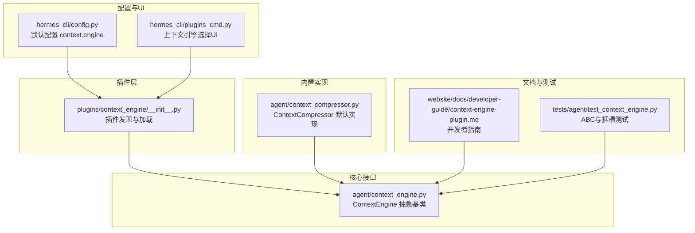
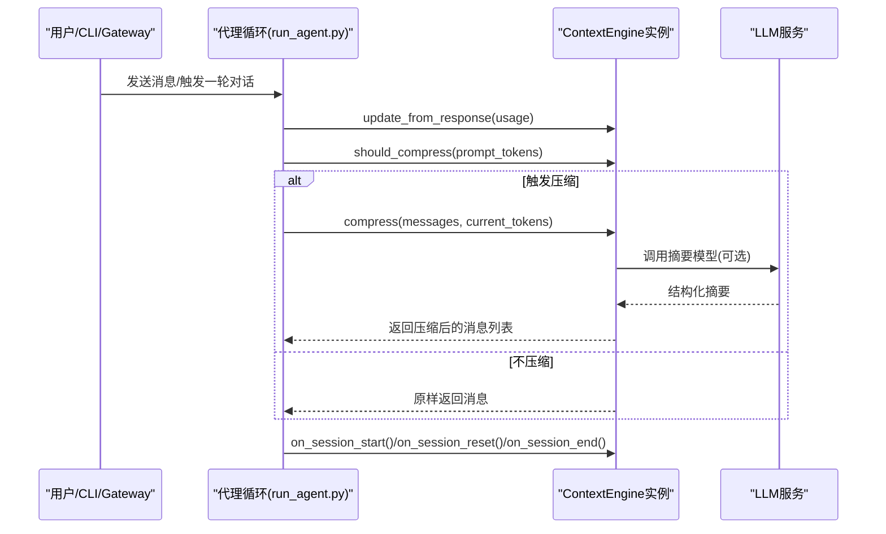
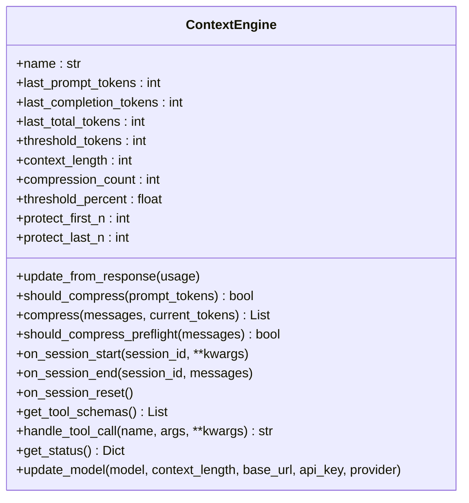
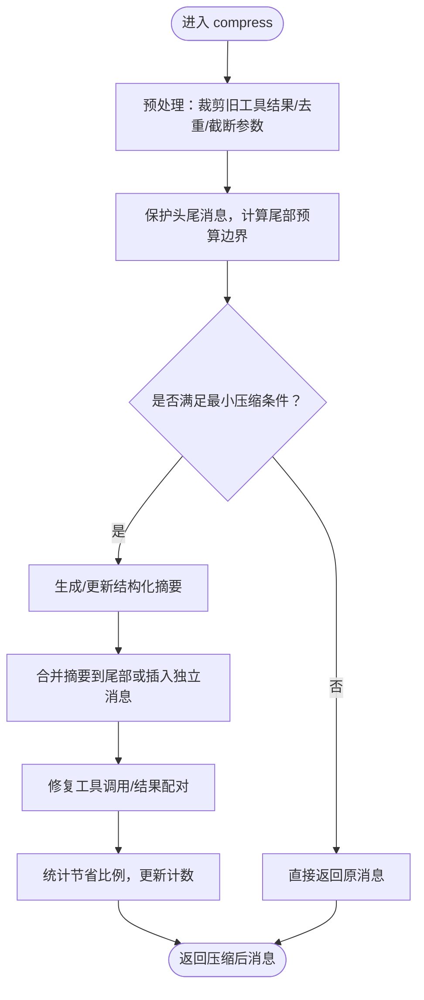
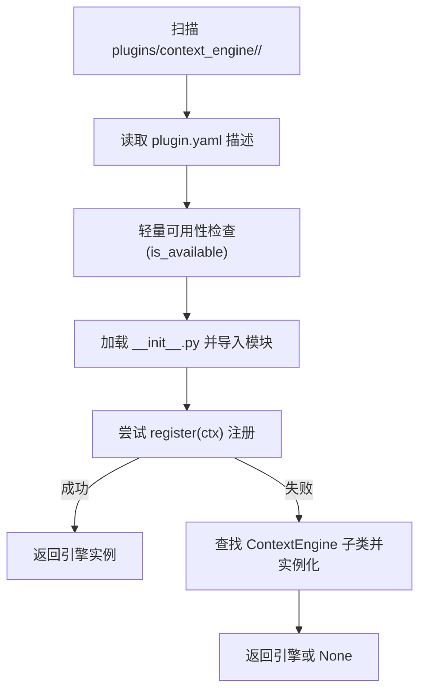
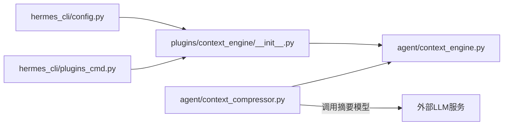

# 上下文引擎插件

<cite>
**本文引用的文件**
- [plugins/context_engine/__init__.py](file://plugins/context_engine/__init__.py)
- [agent/context_engine.py](file://agent/context_engine.py)
- [agent/context_compressor.py](file://agent/context_compressor.py)
- [hermes_cli/config.py](file://hermes_cli/config.py)
- [hermes_cli/plugins_cmd.py](file://hermes_cli/plugins_cmd.py)
- [website/docs/developer-guide/context-engine-plugin.md](file://website/docs/developer-guide/context-engine-plugin.md)
- [tests/agent/test_context_engine.py](file://tests/agent/test_context_engine.py)
</cite>

## 目录
1. [简介](#简介)
2. [项目结构](#项目结构)
3. [核心组件](#核心组件)
4. [架构总览](#架构总览)
5. [详细组件分析](#详细组件分析)
6. [依赖分析](#依赖分析)
7. [性能考虑](#性能考虑)
8. [故障排查指南](#故障排查指南)
9. [结论](#结论)
10. [附录](#附录)

## 简介
本文件面向开发者，系统化阐述 Hermes Agent 的“上下文引擎插件”设计与实现。上下文引擎负责在对话接近模型上下文窗口上限时，对历史消息进行压缩或管理，以维持长对话的连贯性与效率。默认内置引擎为 ContextCompressor（有损摘要），第三方可按统一接口开发替代引擎（如 LCM 等），通过配置启用。

- 设计目标：提供可插拔的上下文管理策略，支持多种压缩/保留/索引方案，保证代理在长会话中的稳定性与可控性。
- 核心职责：决定何时触发压缩、执行压缩、暴露工具、跟踪令牌用量、生命周期管理（会话开始/结束/重置）。
- 集成方式：通过配置选择引擎；插件目录自动发现；也可通过通用插件注册机制注入。

## 项目结构
围绕上下文引擎的关键文件与模块如下：

**图表来源**
- [plugins/context_engine/__init__.py:1-220](file://plugins/context_engine/__init__.py#L1-L220)
- [agent/context_engine.py:1-185](file://agent/context_engine.py#L1-L185)
- [agent/context_compressor.py:1-1164](file://agent/context_compressor.py#L1-L1164)
- [hermes_cli/config.py:630-642](file://hermes_cli/config.py#L630-L642)
- [hermes_cli/plugins_cmd.py:698-730](file://hermes_cli/plugins_cmd.py#L698-L730)
- [website/docs/developer-guide/context-engine-plugin.md:1-163](file://website/docs/developer-guide/context-engine-plugin.md#L1-L163)
- [tests/agent/test_context_engine.py:1-251](file://tests/agent/test_context_engine.py#L1-L251)

**章节来源**
- [plugins/context_engine/__init__.py:1-220](file://plugins/context_engine/__init__.py#L1-L220)
- [agent/context_engine.py:1-185](file://agent/context_engine.py#L1-L185)
- [agent/context_compressor.py:1-1164](file://agent/context_compressor.py#L1-L1164)
- [hermes_cli/config.py:630-642](file://hermes_cli/config.py#L630-L642)
- [hermes_cli/plugins_cmd.py:698-730](file://hermes_cli/plugins_cmd.py#L698-L730)
- [website/docs/developer-guide/context-engine-plugin.md:1-163](file://website/docs/developer-guide/context-engine-plugin.md#L1-L163)
- [tests/agent/test_context_engine.py:1-251](file://tests/agent/test_context_engine.py#L1-L251)

## 核心组件
- 抽象基类 ContextEngine
  - 定义统一接口：名称、令牌状态字段、压缩参数、生命周期钩子、工具扩展、状态展示、模型切换回调等。
  - 提供默认实现（如工具返回错误、预检开关关闭、状态计算等），便于子类按需覆盖。
- 内置引擎 ContextCompressor
  - 默认策略：先对旧工具结果进行廉价裁剪，保护头尾消息，基于预算对中间内容生成结构化摘要，迭代更新摘要，最后修复工具调用/结果配对完整性。
  - 支持阈值百分比、头尾保护数量、摘要目标比例、摘要模型覆盖、静默模式等配置。
- 插件发现与加载
  - 在 plugins/context_engine/<name>/ 下扫描目录，读取 plugin.yaml 获取描述，动态导入 __init__.py 中的 ContextEngine 实现。
  - 支持 register(ctx) 模式（通用插件注册）与目录模式两种方式。
- 配置与选择
  - hermes_cli/config.py 中提供 context.engine 字段，默认为 "compressor"。
  - hermes_cli/plugins_cmd.py 提供交互式选择器，列出可用引擎并持久化到配置。

**章节来源**
- [agent/context_engine.py:32-185](file://agent/context_engine.py#L32-L185)
- [agent/context_compressor.py:188-1164](file://agent/context_compressor.py#L188-L1164)
- [plugins/context_engine/__init__.py:33-196](file://plugins/context_engine/__init__.py#L33-L196)
- [hermes_cli/config.py:633-641](file://hermes_cli/config.py#L633-L641)
- [hermes_cli/plugins_cmd.py:698-730](file://hermes_cli/plugins_cmd.py#L698-L730)

## 架构总览
上下文引擎的运行时交互如下：

**图表来源**
- [agent/context_engine.py:65-126](file://agent/context_engine.py#L65-L126)
- [agent/context_compressor.py:305-331](file://agent/context_compressor.py#L305-L331)
- [agent/context_compressor.py:999-1164](file://agent/context_compressor.py#L999-L1164)

## 详细组件分析

### 抽象基类 ContextEngine
- 接口要点
  - 必须实现：name、update_from_response、should_compress、compress。
  - 可选扩展：should_compress_preflight、on_session_start/on_session_end/on_session_reset、get_tool_schemas/handle_tool_call、get_status、update_model。
- 状态与参数
  - 令牌状态：last_prompt_tokens、last_completion_tokens、last_total_tokens、threshold_tokens、context_length、compression_count。
  - 压缩参数：threshold_percent、protect_first_n、protect_last_n。
- 工具与状态
  - get_tool_schemas/handle_tool_call 用于向代理注入工具并分发调用。
  - get_status 用于显示/记录当前上下文占用情况。

**图表来源**
- [agent/context_engine.py:32-185](file://agent/context_engine.py#L32-L185)

**章节来源**
- [agent/context_engine.py:32-185](file://agent/context_engine.py#L32-L185)

### 内置引擎 ContextCompressor
- 初始化与配置
  - 从模型元数据解析上下文长度，计算阈值，派生摘要预算，支持摘要模型覆盖、静默模式等。
- 压缩流程
  - 预处理：对旧工具结果进行“信息性摘要”替换，去重，截断大参数，减少后续摘要负担。
  - 边界确定：保护头部与尾部，按预算回溯计算尾部边界，避免切割工具调用组。
  - 摘要生成：构造结构化提示，迭代更新摘要；失败时插入静态占位标记。
  - 合并与修复：将摘要合并到尾部或插入独立消息，修复工具调用/结果配对不一致问题。
  - 统计与防抖：记录节省比例，连续低效压缩时抑制再次压缩。
- 生命周期
  - on_session_reset 清理摘要缓存、探查状态、统计计数等。

**图表来源**
- [agent/context_compressor.py:999-1164](file://agent/context_compressor.py#L999-L1164)
- [agent/context_compressor.py:336-468](file://agent/context_compressor.py#L336-L468)
- [agent/context_compressor.py:932-994](file://agent/context_compressor.py#L932-L994)

**章节来源**
- [agent/context_compressor.py:188-1164](file://agent/context_compressor.py#L188-L1164)

### 插件发现与加载
- 目录扫描
  - 遍历 plugins/context_engine/<name>/，读取 plugin.yaml 获取描述，执行轻量可用性检查。
- 加载策略
  - 优先尝试 register(ctx) 注册；否则查找顶层继承自 ContextEngine 的类并实例化。
  - 处理相对导入，确保子模块可被正确加载。
- 错误处理
  - 记录未找到、导入失败、实例化失败等日志。

**图表来源**
- [plugins/context_engine/__init__.py:33-196](file://plugins/context_engine/__init__.py#L33-L196)

**章节来源**
- [plugins/context_engine/__init__.py:33-196](file://plugins/context_engine/__init__.py#L33-L196)

### 配置与选择
- 默认配置
  - hermes_cli/config.py 中 context.engine 默认为 "compressor"。
- 交互选择
  - hermes_cli/plugins_cmd.py 提供 UI 列表，包含内置 "compressor" 与已发现插件，保存到配置文件。

**章节来源**
- [hermes_cli/config.py:633-641](file://hermes_cli/config.py#L633-L641)
- [hermes_cli/plugins_cmd.py:698-730](file://hermes_cli/plugins_cmd.py#L698-L730)

### 开发者指南与示例
- 目录结构
  - plugins/context_engine/<name>/ 下至少包含 __init__.py 导出 ContextEngine 子类，可选 plugin.yaml。
- 实现要求
  - 必须实现 name、update_from_response、should_compress、compress。
  - 可选实现工具、状态、生命周期钩子、模型切换回调。
- 注册方式
  - 目录模式：放置于 plugins/context_engine/<name>/，由发现机制自动加载。
  - 通用插件注册：register(ctx) 中调用 ctx.register_context_engine(engine)，仅允许一个引擎注册。
- 测试参考
  - tests/agent/test_context_engine.py 展示了 ABC 合同、默认行为、StubEngine 示例、插槽注册约束等。

**章节来源**
- [website/docs/developer-guide/context-engine-plugin.md:1-163](file://website/docs/developer-guide/context-engine-plugin.md#L1-L163)
- [tests/agent/test_context_engine.py:1-251](file://tests/agent/test_context_engine.py#L1-L251)

## 依赖分析
- 组件耦合
  - ContextEngine 是抽象层，ContextCompressor 与第三方插件均实现该接口，耦合度低。
  - 插件发现模块仅依赖 __init__.py 的导出约定，不直接依赖具体实现细节。
- 外部依赖
  - ContextCompressor 使用辅助 LLM 进行摘要（通过 call_llm），并在摘要失败时进入冷却。
  - 配置与 UI 通过 hermes_cli/config.py 与 hermes_cli/plugins_cmd.py 协作完成选择与持久化。

**图表来源**
- [plugins/context_engine/__init__.py:100-196](file://plugins/context_engine/__init__.py#L100-L196)
- [agent/context_engine.py:32-185](file://agent/context_engine.py#L32-L185)
- [agent/context_compressor.py:545-756](file://agent/context_compressor.py#L545-L756)
- [hermes_cli/config.py:633-641](file://hermes_cli/config.py#L633-L641)
- [hermes_cli/plugins_cmd.py:698-730](file://hermes_cli/plugins_cmd.py#L698-L730)

**章节来源**
- [plugins/context_engine/__init__.py:100-196](file://plugins/context_engine/__init__.py#L100-L196)
- [agent/context_engine.py:32-185](file://agent/context_engine.py#L32-L185)
- [agent/context_compressor.py:545-756](file://agent/context_compressor.py#L545-L756)
- [hermes_cli/config.py:633-641](file://hermes_cli/config.py#L633-L641)
- [hermes_cli/plugins_cmd.py:698-730](file://hermes_cli/plugins_cmd.py#L698-L730)

## 性能考虑
- 预处理成本控制
  - ContextCompressor 在摘要前进行“信息性摘要”替换与去重，显著降低摘要输入规模，提升吞吐。
- 摘要预算与模型选择
  - 摘要预算与模型上下文窗口成比例，避免固定上限导致大模型摘要不足；支持摘要模型覆盖与失败回退。
- 防抖与节流
  - 连续低效压缩（节省比例低于阈值）时抑制再次压缩，避免无限循环。
- 令牌估算
  - 使用字符/令牌粗估进行边界计算，兼顾准确性与性能。

[本节为通用指导，无需特定文件来源]

## 故障排查指南
- 引擎未生效
  - 检查 hermes_cli/config.py 中 context.engine 是否设置为目标插件名。
  - 确认插件目录存在且 __init__.py 正确导出 ContextEngine 子类。
- 注册冲突
  - 通用插件注册仅允许一个上下文引擎；重复注册会被拒绝。
- 摘要失败
  - 当摘要模型不可用时，ContextCompressor 会进入冷却；可在配置中切换摘要模型或等待冷却结束。
- 工具调用异常
  - 若 handle_tool_call 返回错误，确认工具名与参数 schema 与 get_tool_schemas 一致。

**章节来源**
- [hermes_cli/config.py:633-641](file://hermes_cli/config.py#L633-L641)
- [plugins/context_engine/__init__.py:100-196](file://plugins/context_engine/__init__.py#L100-L196)
- [agent/context_compressor.py:709-756](file://agent/context_compressor.py#L709-L756)
- [tests/agent/test_context_engine.py:200-233](file://tests/agent/test_context_engine.py#L200-L233)

## 结论
上下文引擎插件体系通过统一的 ContextEngine 接口，实现了对长对话上下文的灵活管理。默认的 ContextCompressor 提供稳健的摘要压缩策略，同时允许第三方以插件形式接入更高级的上下文管理方案。通过配置驱动与自动发现机制，用户可以平滑地在不同引擎间切换，满足多样化的场景需求。

[本节为总结，无需特定文件来源]

## 附录
- 配置项
  - context.engine：字符串，选择上下文引擎名称（默认 "compressor"）。
- 生命周期事件
  - on_session_start：会话开始时加载持久状态。
  - on_session_reset：/new 或 /reset 时清理会话状态。
  - on_session_end：会话边界（退出、/reset、网关过期）时收尾。
- 输出格式
  - compress 返回 OpenAI 风格的消息列表（role/content/tool_calls 等）。
  - handle_tool_call 返回 JSON 字符串（标准错误或业务结果）。

**章节来源**
- [hermes_cli/config.py:633-641](file://hermes_cli/config.py#L633-L641)
- [agent/context_engine.py:103-148](file://agent/context_engine.py#L103-L148)
- [agent/context_compressor.py:1074-1164](file://agent/context_compressor.py#L1074-L1164)