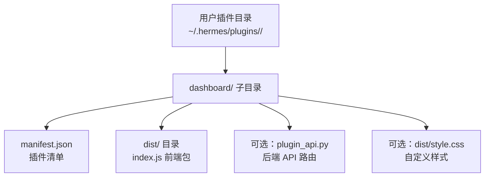
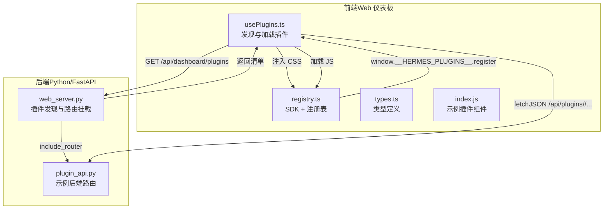
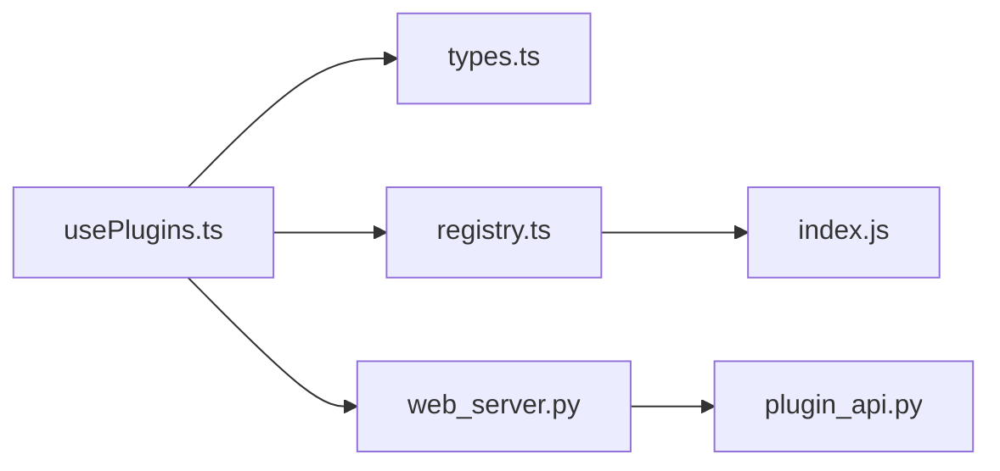

# 仪表板插件

<cite>
**本文引用的文件**
- [manifest.json](file://plugins/example-dashboard/dashboard/manifest.json)
- [plugin_api.py](file://plugins/example-dashboard/dashboard/plugin_api.py)
- [index.js](file://plugins/example-dashboard/dashboard/dist/index.js)
- [web_server.py](file://hermes_cli/web_server.py)
- [usePlugins.ts](file://web/src/plugins/usePlugins.ts)
- [registry.ts](file://web/src/plugins/registry.ts)
- [types.ts](file://web/src/plugins/types.ts)
- [dashboard-plugins.md](file://website/docs/user-guide/features/dashboard-plugins.md)
</cite>

## 目录
1. [简介](#简介)
2. [项目结构](#项目结构)
3. [核心组件](#核心组件)
4. [架构总览](#架构总览)
5. [详细组件分析](#详细组件分析)
6. [依赖关系分析](#依赖关系分析)
7. [性能考虑](#性能考虑)
8. [故障排查指南](#故障排查指南)
9. [结论](#结论)
10. [附录：开发流程与模板](#附录开发流程与模板)

## 简介
本文件系统性阐述 Hermes Agent 仪表板插件体系的架构设计、开发框架与运行机制。仪表板插件允许开发者在不修改核心源码的前提下，向 Web 仪表板添加自定义标签页（Tab），并可选地注册后端 API 路由，实现前后端一体化扩展。本文面向不同技术背景的读者，既提供高层概览，也给出代码级细节、可视化图示与实操指引。

## 项目结构
仪表板插件采用“目录内嵌式”布局：用户插件位于标准路径下，仪表板扩展以 dashboard 子目录形式存在；同一插件可同时承载 CLI/Gateway 扩展与仪表板扩展。

图表来源
- [dashboard-plugins.md:65-82](file://website/docs/user-guide/features/dashboard-plugins.md#L65-L82)

章节来源
- [dashboard-plugins.md:65-82](file://website/docs/user-guide/features/dashboard-plugins.md#L65-L82)

## 核心组件
- 插件清单（manifest.json）：描述插件元信息、导航位置、入口脚本、可选 CSS 与后端 API 文件。
- 前端 SDK 与注册表：在窗口对象上暴露统一的 SDK 与注册接口，供插件在运行时注册组件。
- 前端加载器：通过 React Hook 发现并加载插件清单、注入 CSS、动态加载 JS，并等待插件注册完成。
- 后端发现与路由挂载：扫描插件目录，解析清单，按需挂载后端 API 路由至 /api/plugins/<name>/ 前缀。
- 示例插件：演示如何使用 SDK 组件、调用后端 API 并注册标签页。

章节来源
- [manifest.json:1-14](file://plugins/example-dashboard/dashboard/manifest.json#L1-L14)
- [plugin_api.py:1-15](file://plugins/example-dashboard/dashboard/plugin_api.py#L1-L15)
- [usePlugins.ts:1-90](file://web/src/plugins/usePlugins.ts#L1-L90)
- [registry.ts:1-132](file://web/src/plugins/registry.ts#L1-L132)
- [web_server.py:2175-2249](file://hermes_cli/web_server.py#L2175-L2249)

## 架构总览
仪表板插件系统由“前端发现与加载 + 后端清单发现与路由挂载”两部分组成，二者通过统一的清单文件进行编排。

图表来源
- [usePlugins.ts:1-90](file://web/src/plugins/usePlugins.ts#L1-L90)
- [registry.ts:1-132](file://web/src/plugins/registry.ts#L1-L132)
- [types.ts:1-23](file://web/src/plugins/types.ts#L1-L23)
- [index.js:1-75](file://plugins/example-dashboard/dashboard/dist/index.js#L1-L75)
- [web_server.py:2175-2307](file://hermes_cli/web_server.py#L2175-L2307)
- [plugin_api.py:1-15](file://plugins/example-dashboard/dashboard/plugin_api.py#L1-L15)

## 详细组件分析

### 清单文件（manifest.json）
清单用于描述插件的基本信息、导航配置、资源定位与可选后端 API。

- 关键字段
  - name：插件唯一标识（小写、连字符）
  - label：导航栏显示名称
  - description/icon/version：元信息
  - tab.path：标签页 URL 路径
  - tab.position：插入位置（支持 end、after:<tab>、before:<tab>）
  - entry：前端 JS 包相对路径
  - css：可选的样式文件
  - api：可选的后端 API 路由文件

- 示例参考
  - 示例插件清单展示了最小可用配置与后端 API 字段。

章节来源
- [manifest.json:1-14](file://plugins/example-dashboard/dashboard/manifest.json#L1-L14)
- [dashboard-plugins.md:83-116](file://website/docs/user-guide/features/dashboard-plugins.md#L83-L116)

### 前端 SDK 与注册表（registry.ts）
- SDK 暴露内容
  - React 实例与常用 Hooks
  - UI 组件（Card、Button、Input 等）
  - 工具函数（时间格式化、类名合并）
  - 国际化与主题钩子
  - API 客户端与 fetchJSON（自动处理认证）

- 注册机制
  - 插件通过 window.__HERMES_PLUGINS__.register(name, Component) 注册标签页组件
  - 注册表内部维护 Map 与监听器集合，通知 UI 更新

章节来源
- [registry.ts:1-132](file://web/src/plugins/registry.ts#L1-L132)
- [dashboard-plugins.md:136-216](file://website/docs/user-guide/features/dashboard-plugins.md#L136-L216)

### 前端加载器（usePlugins.ts）
- 生命周期
  - 首次挂载时请求 /api/dashboard/plugins 获取清单
  - 对每个插件：若声明 css 则注入 <link>；随后动态注入 <script> 加载 entry
  - 等待插件在 2 秒内完成注册，否则视为加载失败但不影响其他插件
  - 监听注册事件，将已注册组件与清单映射为最终结果

- 错误处理
  - 动态脚本加载失败会记录警告日志

章节来源
- [usePlugins.ts:1-90](file://web/src/plugins/usePlugins.ts#L1-L90)
- [dashboard-plugins.md:286-295](file://website/docs/user-guide/features/dashboard-plugins.md#L286-L295)

### 类型定义（types.ts）
- PluginManifest：前端侧对清单的强类型定义
- RegisteredPlugin：清单与已注册组件的组合

章节来源
- [types.ts:1-23](file://web/src/plugins/types.ts#L1-L23)

### 后端发现与路由挂载（web_server.py）
- 插件发现
  - 扫描多个来源的 dashboard/manifest.json，去重并构建清单
  - 将内部字段剥离后返回给前端

- 资源服务
  - 提供 /dashboard-plugins/<name>/<path> 服务静态资源，路径穿越防护

- API 路由挂载
  - 若清单声明 api 字段，则导入对应 Python 文件，读取其中的 router 并挂载到 /api/plugins/<name> 前缀
  - 异常与缺失情况均进行告警与容错

章节来源
- [web_server.py:2175-2307](file://hermes_cli/web_server.py#L2175-L2307)
- [dashboard-plugins.md:312-320](file://website/docs/user-guide/features/dashboard-plugins.md#L312-L320)

### 示例插件（index.js 与 plugin_api.py）
- 前端
  - 使用 SDK 组件渲染卡片与按钮
  - 通过 SDK.fetchJSON 调用后端 API
  - 通过 window.__HERMES_PLUGINS__.register 注册组件

- 后端
  - FastAPI 路由示例，返回简单数据

章节来源
- [index.js:1-75](file://plugins/example-dashboard/dashboard/dist/index.js#L1-L75)
- [plugin_api.py:1-15](file://plugins/example-dashboard/dashboard/plugin_api.py#L1-L15)
- [dashboard-plugins.md:321-329](file://website/docs/user-guide/features/dashboard-plugins.md#L321-L329)

## 依赖关系分析

图表来源
- [usePlugins.ts:1-90](file://web/src/plugins/usePlugins.ts#L1-L90)
- [types.ts:1-23](file://web/src/plugins/types.ts#L1-L23)
- [registry.ts:1-132](file://web/src/plugins/registry.ts#L1-L132)
- [web_server.py:2175-2307](file://hermes_cli/web_server.py#L2175-L2307)
- [index.js:1-75](file://plugins/example-dashboard/dashboard/dist/index.js#L1-L75)
- [plugin_api.py:1-15](file://plugins/example-dashboard/dashboard/plugin_api.py#L1-L15)

## 性能考虑
- 资源加载
  - 前端仅在清单到达后批量注入 CSS 与 JS，避免重复加载
  - 通过缓存已加载脚本 URL 的集合，减少重复注入
- 注册超时
  - 为插件注册设置 2 秒宽限，避免阻塞整体加载
- 路由挂载
  - 后端按需导入与挂载，异常捕获确保稳定性
- 样式隔离
  - 建议使用特定类名与主题变量，避免全局样式冲突

章节来源
- [usePlugins.ts:32-65](file://web/src/plugins/usePlugins.ts#L32-L65)
- [web_server.py:2277-2307](file://hermes_cli/web_server.py#L2277-L2307)
- [dashboard-plugins.md:331-337](file://website/docs/user-guide/features/dashboard-plugins.md#L331-L337)

## 故障排查指南
- 插件未出现在导航中
  - 检查清单字段是否正确（name、label、tab.path、entry）
  - 确认后端已返回该插件清单（/api/dashboard/plugins）
  - 浏览器控制台查看脚本加载错误或注册超时
- 资源加载失败
  - 检查 /dashboard-plugins/<name>/<path> 是否可访问
  - 确保路径未发生路径穿越（后端已做校验）
- 后端 API 不可用
  - 确认清单 api 字段指向的文件存在且导出 router
  - 查看后端日志中的挂载与异常告警
- 插件样式冲突
  - 使用更具体的类名或主题变量（--color-*）

章节来源
- [usePlugins.ts:56-58](file://web/src/plugins/usePlugins.ts#L56-L58)
- [web_server.py:2239-2249](file://hermes_cli/web_server.py#L2239-L2249)
- [dashboard-plugins.md:306-311](file://website/docs/user-guide/features/dashboard-plugins.md#L306-L311)

## 结论
仪表板插件系统通过“清单驱动 + SDK 注册 + 动态加载”的方式，实现了低耦合、可扩展的前端扩展能力，并通过后端路由挂载提供了与核心系统的数据交互通道。其设计兼顾易用性与安全性（路径穿越防护、异常告警），适合快速构建仪表板增强功能。

## 附录：开发流程与模板

### 开发流程
- 创建目录与文件
  - 在 ~/.hermes/plugins/<your-plugin>/ 下创建 dashboard/ 子目录
  - 准备 manifest.json、dist/index.js（可选：dist/style.css、plugin_api.py）
- 配置清单
  - 填写 name、label、tab.path、entry 等字段
  - 如需后端 API，填写 api 字段并实现 router
- 编写前端
  - 使用 SDK 组件与工具函数构建页面
  - 通过 window.__HERMES_PLUGINS__.register 注册组件
- 编写后端（可选）
  - 导出 FastAPI 路由，挂载于 /api/plugins/<name>/ 前缀
- 验证与调试
  - 启动仪表板，刷新页面确认插件出现
  - 使用浏览器开发者工具检查网络与控制台输出
  - 必要时触发重新扫描：GET /api/dashboard/plugins/rescan

章节来源
- [dashboard-plugins.md:11-63](file://website/docs/user-guide/features/dashboard-plugins.md#L11-L63)
- [dashboard-plugins.md:286-337](file://website/docs/user-guide/features/dashboard-plugins.md#L286-L337)

### 清单字段参考
- name、label、description、icon、version
- tab.path、tab.position
- entry、css、api

章节来源
- [dashboard-plugins.md:83-116](file://website/docs/user-guide/features/dashboard-plugins.md#L83-L116)

### 前端模板要点
- 使用 SDK 组件与 hooks
- 通过 fetchJSON 调用后端 API
- 调用 window.__HERMES_PLUGINS__.register 注册组件

章节来源
- [dashboard-plugins.md:136-216](file://website/docs/user-guide/features/dashboard-plugins.md#L136-L216)
- [index.js:1-75](file://plugins/example-dashboard/dashboard/dist/index.js#L1-L75)

### 后端模板要点
- 导入 FastAPI 路由器
- 导出名为 router 的实例
- 路由挂载前缀为 /api/plugins/<name>

章节来源
- [dashboard-plugins.md:217-241](file://website/docs/user-guide/features/dashboard-plugins.md#L217-L241)
- [plugin_api.py:1-15](file://plugins/example-dashboard/dashboard/plugin_api.py#L1-L15)