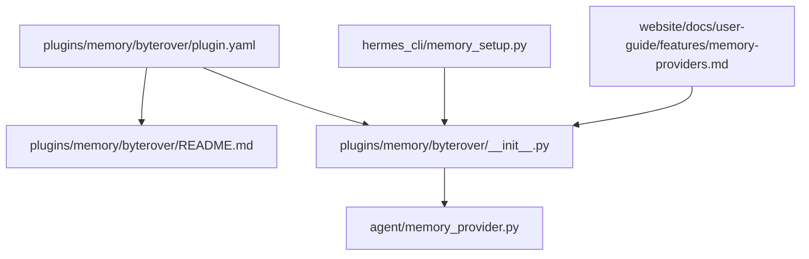
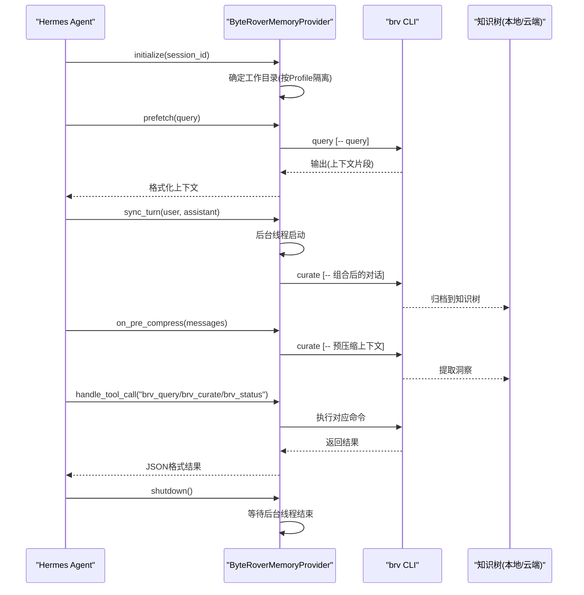
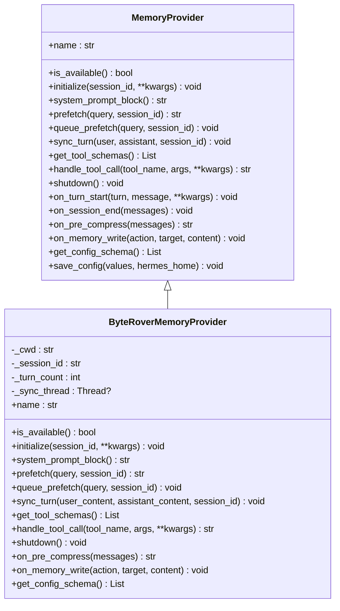
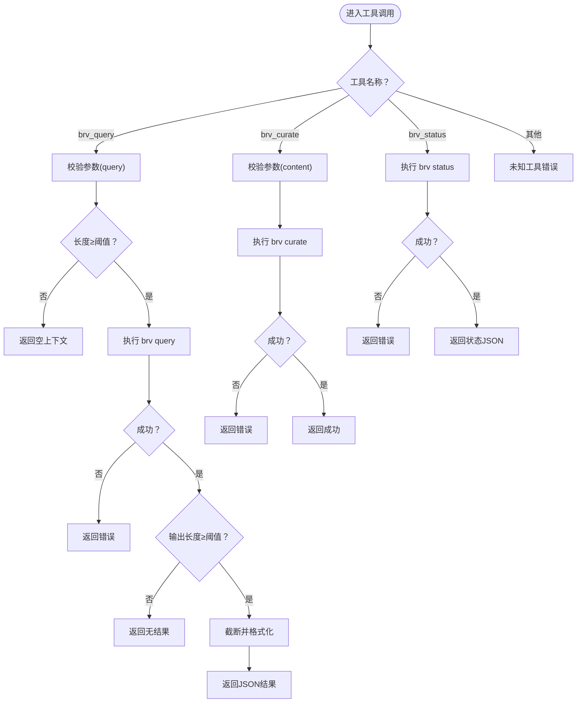
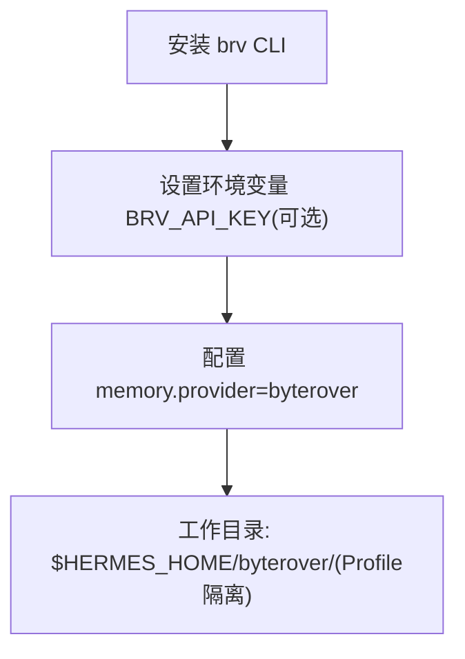
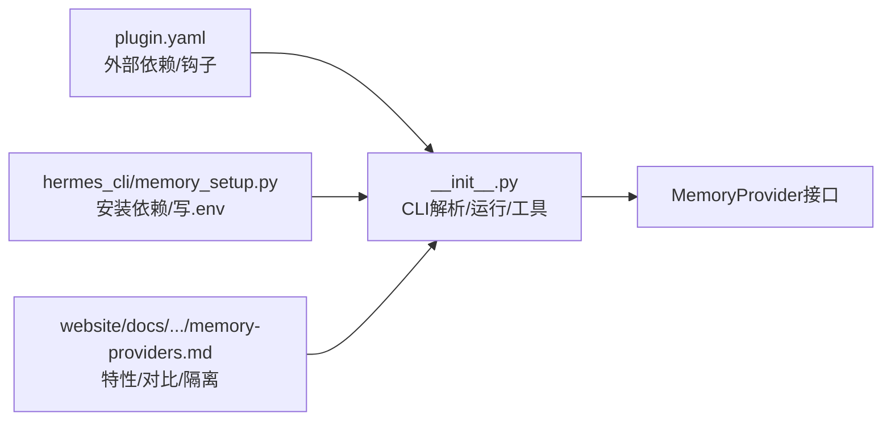

# ByteRover字节级存储插件

<cite>
**本文引用的文件**
- [plugins/memory/byterover/plugin.yaml](file://plugins/memory/byterover/plugin.yaml)
- [plugins/memory/byterover/README.md](file://plugins/memory/byterover/README.md)
- [plugins/memory/byterover/__init__.py](file://plugins/memory/byterover/__init__.py)
- [agent/memory_provider.py](file://agent/memory_provider.py)
- [hermes_cli/memory_setup.py](file://hermes_cli/memory_setup.py)
- [website/docs/user-guide/features/memory-providers.md](file://website/docs/user-guide/features/memory-providers.md)
</cite>

## 目录
1. [简介](#简介)
2. [项目结构](#项目结构)
3. [核心组件](#核心组件)
4. [架构总览](#架构总览)
5. [详细组件分析](#详细组件分析)
6. [依赖关系分析](#依赖关系分析)
7. [性能与优化](#性能与优化)
8. [故障排除与维护](#故障排除与维护)
9. [结论](#结论)
10. [附录](#附录)

## 简介
ByteRover 是一个基于命令行工具 brv 的持久化知识树存储插件，通过分层检索（模糊文本 → LLM驱动搜索）实现跨会话的长期记忆。它默认本地优先，支持可选的云同步，并在预压缩阶段自动提取关键洞察，避免上下文压缩带来的信息丢失。该插件以 MemoryProvider 接口实现，与 Hermes 内置记忆并行工作，且同一时间仅激活一个外部记忆提供者。

## 项目结构
ByteRover 插件位于 plugins/memory/byterover 目录，包含以下关键文件：
- plugin.yaml：插件元数据与外部依赖声明
- README.md：安装、配置与工具说明
- __init__.py：MemoryProvider 实现、工具模式、生命周期钩子与 CLI 调用封装

**图表来源**
- [plugins/memory/byterover/plugin.yaml:1-10](file://plugins/memory/byterover/plugin.yaml#L1-L10)
- [plugins/memory/byterover/README.md:1-42](file://plugins/memory/byterover/README.md#L1-L42)
- [plugins/memory/byterover/__init__.py:1-384](file://plugins/memory/byterover/__init__.py#L1-L384)
- [agent/memory_provider.py:1-232](file://agent/memory_provider.py#L1-L232)
- [hermes_cli/memory_setup.py:1-200](file://hermes_cli/memory_setup.py#L1-L200)
- [website/docs/user-guide/features/memory-providers.md:380-505](file://website/docs/user-guide/features/memory-providers.md#L380-L505)

**章节来源**
- [plugins/memory/byterover/plugin.yaml:1-10](file://plugins/memory/byterover/plugin.yaml#L1-L10)
- [plugins/memory/byterover/README.md:1-42](file://plugins/memory/byterover/README.md#L1-L42)
- [plugins/memory/byterover/__init__.py:1-384](file://plugins/memory/byterover/__init__.py#L1-L384)
- [agent/memory_provider.py:1-232](file://agent/memory_provider.py#L1-L232)
- [hermes_cli/memory_setup.py:1-200](file://hermes_cli/memory_setup.py#L1-L200)
- [website/docs/user-guide/features/memory-providers.md:380-505](file://website/docs/user-guide/features/memory-providers.md#L380-L505)

## 核心组件
- MemoryProvider 抽象基类：定义了插件生命周期与可选钩子（初始化、系统提示注入、预取、回合同步、工具暴露与调用、关闭等），以及可选的预压缩提取与内置记忆镜像写入钩子。
- ByteRoverMemoryProvider：实现 MemoryProvider，负责：
  - CLI 可用性检测与路径解析（线程安全缓存）
  - 工作目录定位（按 Profile 隔离）
  - 同步预取查询与异步回合归档
  - 工具模式与工具调用（brv_query、brv_curate、brv_status）
  - 预压缩提取与内置记忆镜像写入
  - 超时控制与最小长度过滤

**章节来源**
- [agent/memory_provider.py:42-232](file://agent/memory_provider.py#L42-L232)
- [plugins/memory/byterover/__init__.py:171-384](file://plugins/memory/byterover/__init__.py#L171-L384)

## 架构总览
ByteRover 插件通过 brv CLI 与本地/云端知识树交互，同时与 Hermes 内置记忆并行工作。其核心流程包括：
- 初始化：确定工作目录（按 Profile 隔离）、准备资源
- 预取：在每轮开始前同步执行查询，返回上下文
- 回合同步：后台线程异步归档对话内容
- 工具调用：提供查询、归档、状态检查三个工具
- 预压缩提取：在压缩前抽取关键信息，避免丢失
- 关闭：等待后台线程完成

**图表来源**
- [plugins/memory/byterover/__init__.py:199-384](file://plugins/memory/byterover/__init__.py#L199-L384)
- [agent/memory_provider.py:92-141](file://agent/memory_provider.py#L92-L141)

**章节来源**
- [plugins/memory/byterover/__init__.py:199-384](file://plugins/memory/byterover/__init__.py#L199-L384)
- [agent/memory_provider.py:92-141](file://agent/memory_provider.py#L92-L141)

## 详细组件分析

### 类与接口关系

**图表来源**
- [agent/memory_provider.py:42-232](file://agent/memory_provider.py#L42-L232)
- [plugins/memory/byterover/__init__.py:171-384](file://plugins/memory/byterover/__init__.py#L171-L384)

**章节来源**
- [agent/memory_provider.py:42-232](file://agent/memory_provider.py#L42-L232)
- [plugins/memory/byterover/__init__.py:171-384](file://plugins/memory/byterover/__init__.py#L171-L384)

### 查询与归档流程
- 查询（brv_query）：对输入查询进行长度过滤与截断，同步执行 brv query 并返回格式化结果；超时与最小输出长度保护。
- 归档（brv_curate）：在每轮结束后异步执行，组合用户与助手内容，提交至 brv；支持预压缩阶段的批量归档。
- 状态（brv_status）：返回 brv 版本、树统计与同步状态。

**图表来源**
- [plugins/memory/byterover/__init__.py:317-375](file://plugins/memory/byterover/__init__.py#L317-L375)

**章节来源**
- [plugins/memory/byterover/__init__.py:317-375](file://plugins/memory/byterover/__init__.py#L317-L375)

### 配置与环境变量
- 外部依赖：brv CLI（通过安装脚本或 npm 安装）
- 环境变量：BRV_API_KEY（可选，用于云同步）
- 工作目录：$HERMES_HOME/byterover/（按 Profile 隔离）

**图表来源**
- [plugins/memory/byterover/plugin.yaml:4-7](file://plugins/memory/byterover/plugin.yaml#L4-L7)
- [plugins/memory/byterover/README.md:20-33](file://plugins/memory/byterover/README.md#L20-L33)
- [website/docs/user-guide/features/memory-providers.md:393-415](file://website/docs/user-guide/features/memory-providers.md#L393-L415)

**章节来源**
- [plugins/memory/byterover/plugin.yaml:4-7](file://plugins/memory/byterover/plugin.yaml#L4-L7)
- [plugins/memory/byterover/README.md:20-33](file://plugins/memory/byterover/README.md#L20-L33)
- [website/docs/user-guide/features/memory-providers.md:393-415](file://website/docs/user-guide/features/memory-providers.md#L393-L415)

## 依赖关系分析
- 插件元数据：plugin.yaml 声明外部依赖（brv CLI）与生命周期钩子（on_pre_compress）
- CLI 解析：线程安全缓存 brv 路径，支持多候选安装位置
- 运行时环境：通过 PATH 注入 brv bin 目录，确保子进程可用
- 配置流程：hermes_cli/memory_setup.py 负责发现插件、安装 pip 依赖与外部依赖、收集配置并写入 .env

**图表来源**
- [plugins/memory/byterover/plugin.yaml:1-10](file://plugins/memory/byterover/plugin.yaml#L1-L10)
- [plugins/memory/byterover/__init__.py:51-114](file://plugins/memory/byterover/__init__.py#L51-L114)
- [agent/memory_provider.py:1-232](file://agent/memory_provider.py#L1-L232)
- [hermes_cli/memory_setup.py:58-143](file://hermes_cli/memory_setup.py#L58-L143)
- [website/docs/user-guide/features/memory-providers.md:380-505](file://website/docs/user-guide/features/memory-providers.md#L380-L505)

**章节来源**
- [plugins/memory/byterover/plugin.yaml:1-10](file://plugins/memory/byterover/plugin.yaml#L1-L10)
- [plugins/memory/byterover/__init__.py:51-114](file://plugins/memory/byterover/__init__.py#L51-L114)
- [agent/memory_provider.py:1-232](file://agent/memory_provider.py#L1-L232)
- [hermes_cli/memory_setup.py:58-143](file://hermes_cli/memory_setup.py#L58-L143)
- [website/docs/user-guide/features/memory-providers.md:380-505](file://website/docs/user-guide/features/memory-providers.md#L380-L505)

## 性能与优化
- 查询与归档超时控制：查询 10 秒、归档 120 秒，避免阻塞主流程
- 最小长度过滤：查询与输出均设置阈值，减少噪声与冗余
- 异步归档：回合结束后后台线程归档，降低延迟影响
- 预压缩提取：在压缩丢弃前抽取关键上下文，提升长期价值保留率
- 工作目录隔离：按 Profile 存储，避免跨会话干扰，提高并发安全性

注意：仓库未提供针对 ByteRover 的具体性能基准测试数据。以上优化策略基于源码中的超时、过滤与异步实现推导。

**章节来源**
- [plugins/memory/byterover/__init__.py:35-40](file://plugins/memory/byterover/__init__.py#L35-L40)
- [plugins/memory/byterover/__init__.py:237-262](file://plugins/memory/byterover/__init__.py#L237-L262)
- [plugins/memory/byterover/__init__.py:282-312](file://plugins/memory/byterover/__init__.py#L282-L312)

## 故障排除与维护
- brv CLI 未找到：检查安装脚本或 npm 安装；确认 PATH 中包含 brv bin 目录；插件会缓存解析结果，重装后需重启以刷新缓存
- 超时与最小长度：若查询/归档超时或输出过短，检查网络与模型处理耗时；适当调整输入长度
- 后台线程：在关闭时等待后台线程完成，避免数据丢失
- 环境变量：如需云同步，设置 BRV_API_KEY；否则默认本地优先
- 工具调用：使用 brv_query/brv_curate/brv_status 进行调试与状态检查

**章节来源**
- [plugins/memory/byterover/__init__.py:78-114](file://plugins/memory/byterover/__init__.py#L78-L114)
- [plugins/memory/byterover/__init__.py:326-329](file://plugins/memory/byterover/__init__.py#L326-L329)
- [plugins/memory/byterover/README.md:29-33](file://plugins/memory/byterover/README.md#L29-L33)

## 结论
ByteRover 插件通过 brv CLI 将知识组织为分层树状结构，结合本地优先与可选云同步，在预压缩阶段提取关键洞察，有效提升长期记忆的稳定性与可用性。其实现遵循 MemoryProvider 接口，具备清晰的生命周期与工具模式，适合需要 CLI 友好、可移植且跨会话持久化的开发者场景。

## 附录

### 使用指南与配置示例
- 安装 brv CLI：使用安装脚本或 npm 安装
- 设置 Provider：通过交互或手动设置 memory.provider=byterover
- 可选云同步：设置 BRV_API_KEY
- 工作目录：$HERMES_HOME/byterover/（按 Profile 隔离）

**章节来源**
- [plugins/memory/byterover/README.md:7-33](file://plugins/memory/byterover/README.md#L7-L33)
- [website/docs/user-guide/features/memory-providers.md:400-415](file://website/docs/user-guide/features/memory-providers.md#L400-L415)

### 与其它存储方案的对比要点
- 存储介质：本地/云（ByteRover）
- 工具集：3 个（ByteRover）
- 依赖：brv CLI（ByteRover）
- 独特特性：预压缩提取（ByteRover）

**章节来源**
- [website/docs/user-guide/features/memory-providers.md:480-491](file://website/docs/user-guide/features/memory-providers.md#L480-L491)