# Hindsight回溯记忆插件

<cite>
**本文档引用的文件**
- [plugin.yaml](file://plugins/memory/hindsight/plugin.yaml)
- [README.md](file://plugins/memory/hindsight/README.md)
- [__init__.py](file://plugins/memory/hindsight/__init__.py)
- [memory_provider.py](file://agent/memory_provider.py)
- [test_hindsight_provider.py](file://tests/plugins/memory/test_hindsight_provider.py)
- [memory-system-guide.md](file://.rules/memory-system-guide.md)
- [HERMES_AGENT_KNOWLEDGE_BASE.md](file://HERMES_AGENT_KNOWLEDGE_BASE.md)
</cite>

## 目录
1. [简介](#简介)
2. [项目结构](#项目结构)
3. [核心组件](#核心组件)
4. [架构概览](#架构概览)
5. [详细组件分析](#详细组件分析)
6. [依赖关系分析](#依赖关系分析)
7. [性能考虑](#性能考虑)
8. [故障排除指南](#故障排除指南)
9. [结论](#结论)
10. [附录](#附录)

## 简介

Hindsight回溯记忆插件是Hermes Agent生态系统中的重要组成部分，提供了强大的长期记忆功能。该插件基于知识图谱、实体解析和多策略检索技术，实现了历史数据分析、趋势预测和洞察生成机制。

### 主要特性

- **多模式支持**：支持云模式、本地嵌入模式和本地外部模式
- **知识图谱**：建立实体关系网络，支持复杂的关联查询
- **多策略检索**：语义搜索、关键词匹配、实体图谱遍历和重排序
- **自动记忆提取**：AI驱动的结构化事实提取和实体解析
- **跨会话持久化**：确保记忆在会话间持续存在
- **推理综合**：基于历史记忆生成综合性的回答

## 项目结构

Hindsight插件采用标准的Hermes插件结构，位于`plugins/memory/hindsight/`目录下：

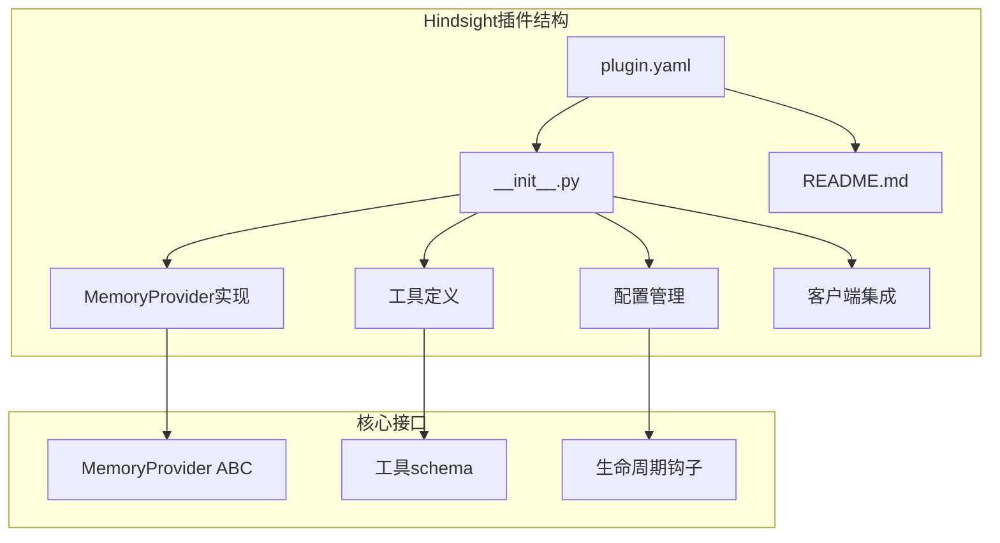

**图表来源**
- [plugin.yaml:1-9](file://plugins/memory/hindsight/plugin.yaml#L1-L9)
- [__init__.py:1-50](file://plugins/memory/hindsight/__init__.py#L1-L50)

**章节来源**
- [plugin.yaml:1-9](file://plugins/memory/hindsight/plugin.yaml#L1-L9)
- [README.md:1-50](file://plugins/memory/hindsight/README.md#L1-L50)

## 核心组件

### MemoryProvider实现

HindsightMemoryProvider类实现了MemoryProvider抽象基类，提供了完整的记忆管理功能：

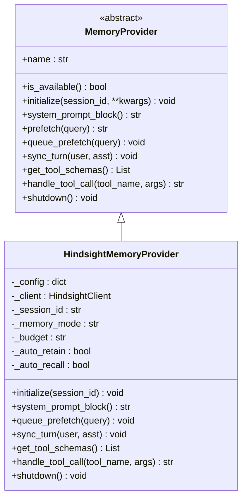

**图表来源**
- [memory_provider.py:42-232](file://agent/memory_provider.py#L42-L232)
- [__init__.py:185-232](file://plugins/memory/hindsight/__init__.py#L185-L232)

### 工具定义

插件提供了三个核心工具，支持不同的记忆操作：

| 工具名称 | 功能描述 | 参数 | 返回值 |
|---------|---------|------|--------|
| hindsight_retain | 存储信息到长期记忆 | content(必需), context(可选), tags(可选) | JSON字符串 |
| hindsight_recall | 多策略搜索记忆 | query(必需), tags(可选), types(可选) | JSON字符串 |
| hindsight_reflect | 跨记忆推理综合 | query(必需) | JSON字符串 |

**章节来源**
- [__init__.py:91-135](file://plugins/memory/hindsight/__init__.py#L91-L135)
- [test_hindsight_provider.py:117-141](file://tests/plugins/memory/test_hindsight_provider.py#L117-L141)

## 架构概览

Hindsight插件采用分层架构设计，实现了清晰的关注点分离：

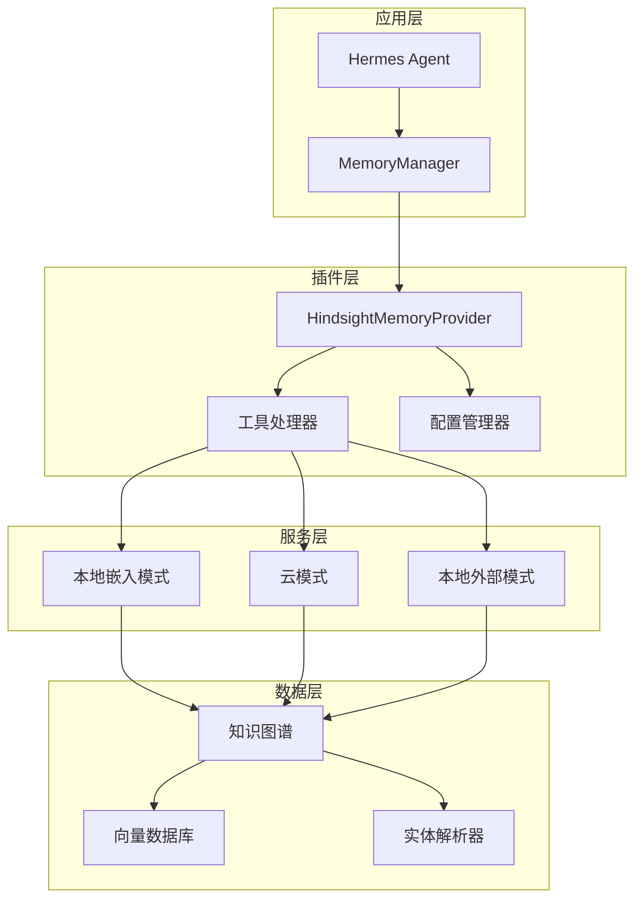

**图表来源**
- [__init__.py:439-467](file://plugins/memory/hindsight/__init__.py#L439-L467)
- [memory_provider.py:16-31](file://agent/memory_provider.py#L16-L31)

### 生命周期管理

插件遵循标准的MemoryProvider生命周期：

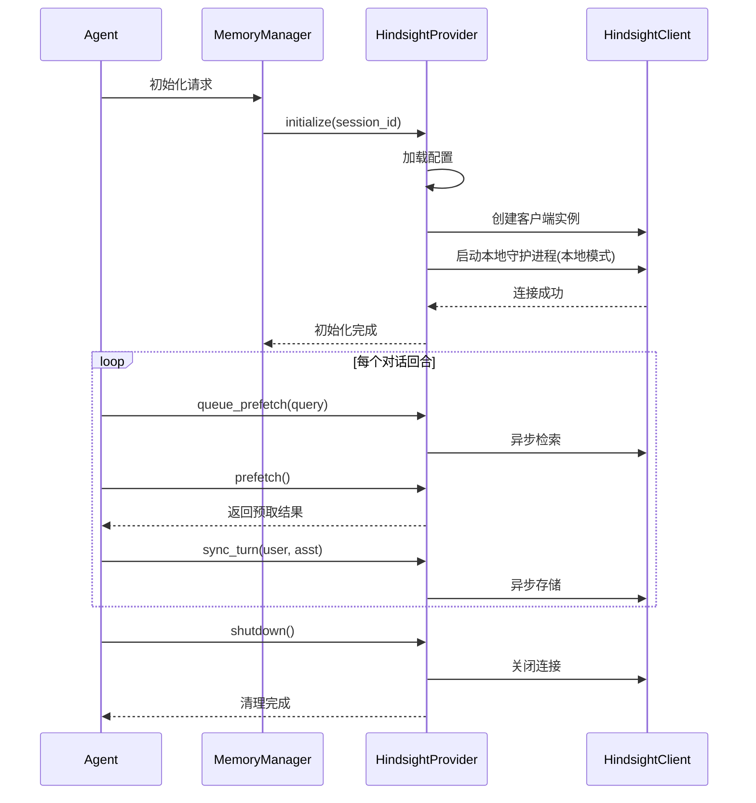

**图表来源**
- [__init__.py:469-556](file://plugins/memory/hindsight/__init__.py#L469-L556)
- [__init__.py:654-714](file://plugins/memory/hindsight/__init__.py#L654-L714)

## 详细组件分析

### 配置管理系统

Hindsight插件支持多种配置来源，具有灵活的优先级机制：

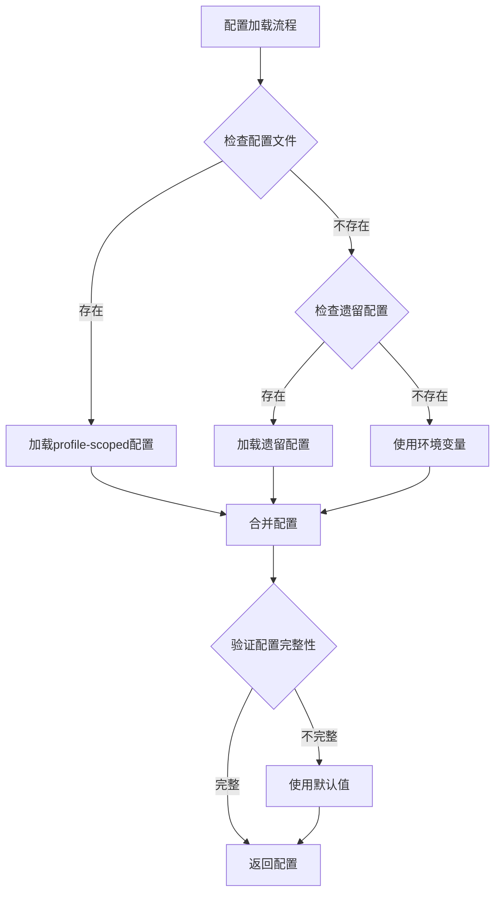

**图表来源**
- [__init__.py:142-178](file://plugins/memory/hindsight/__init__.py#L142-L178)

配置参数详解：

| 分类 | 参数名 | 默认值 | 描述 |
|------|--------|--------|------|
| 连接 | mode | cloud | 连接模式: cloud/local_embedded/local_external |
| 连接 | api_url | https://api.hindsight.vectorize.io | API端点URL |
| 内存库 | bank_id | hermes | 内存库标识符 |
| 回忆 | recall_budget | mid | 回忆彻底程度: low/mid/high |
| 回忆 | recall_prefetch_method | recall | 预取方法: recall/reflect |
| 回忆 | auto_recall | true | 是否自动回忆 |
| 保留 | auto_retain | true | 是否自动保留 |
| 保留 | retain_every_n_turns | 1 | 每N轮保留一次 |
| 集成 | memory_mode | hybrid | 集成模式: hybrid/context/tools |

**章节来源**
- [README.md:47-131](file://plugins/memory/hindsight/README.md#L47-L131)
- [__init__.py:406-437](file://plugins/memory/hindsight/__init__.py#L406-L437)

### 记忆存储机制

Hindsight实现了智能的记忆存储策略，支持批量处理和异步操作：

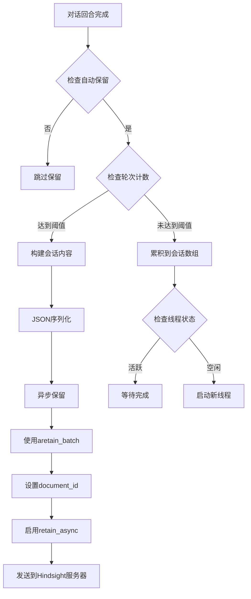

**图表来源**
- [__init__.py:715-772](file://plugins/memory/hindsight/__init__.py#L715-L772)

### 智能预取机制

插件实现了高效的预取系统，支持后台线程和结果缓存：

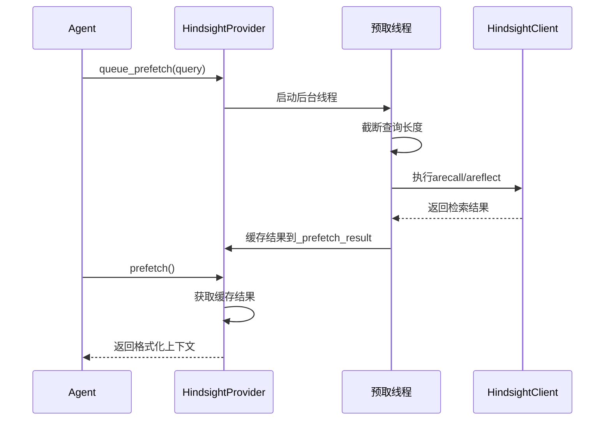

**图表来源**
- [__init__.py:654-714](file://plugins/memory/hindsight/__init__.py#L654-L714)

**章节来源**
- [__init__.py:654-714](file://plugins/memory/hindsight/__init__.py#L654-L714)
- [test_hindsight_provider.py:319-384](file://tests/plugins/memory/test_hindsight_provider.py#L319-L384)

### 工具调用处理

插件提供了完整的工具调用处理机制，支持错误处理和参数验证：

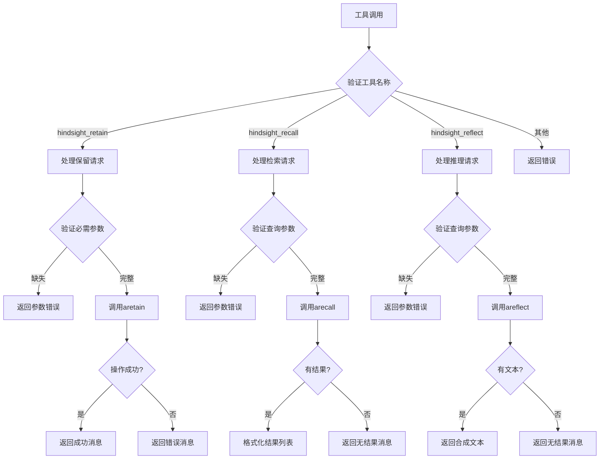

**图表来源**
- [__init__.py:779-849](file://plugins/memory/hindsight/__init__.py#L779-L849)

**章节来源**
- [__init__.py:779-849](file://plugins/memory/hindsight/__init__.py#L779-L849)
- [test_hindsight_provider.py:213-297](file://tests/plugins/memory/test_hindsight_provider.py#L213-L297)

## 依赖关系分析

### 外部依赖

Hindsight插件的主要依赖关系如下：

```mermaid
graph TB
subgraph "Hindsight插件"
A[HindsightMemoryProvider]
B[事件循环管理]
C[配置管理]
D[工具定义]
end
subgraph "外部依赖"
E[hindsight-client>=0.4.22]
F[hindsight-all(本地模式)]
G[aiohttp]
H[asyncio]
I[threading]
end
subgraph "系统依赖"
J[uv包管理器]
K[Python运行时]
L[操作系统]
end
A --> E
A --> F
B --> G
B --> H
B --> I
A --> J
E --> K
F --> K
G --> L
H --> L
I --> L
```

**图表来源**
- [plugin.yaml:4-5](file://plugins/memory/hindsight/plugin.yaml#L4-L5)
- [__init__.py:21-38](file://plugins/memory/hindsight/__init__.py#L21-L38)

### 内部耦合关系

插件内部各组件之间的依赖关系：

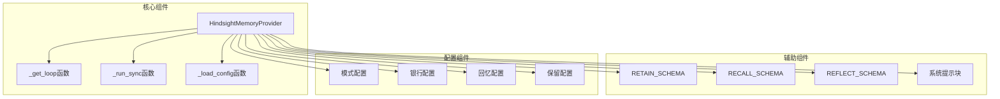

**图表来源**
- [__init__.py:58-84](file://plugins/memory/hindsight/__init__.py#L58-L84)
- [__init__.py:91-135](file://plugins/memory/hindsight/__init__.py#L91-L135)

**章节来源**
- [plugin.yaml:1-9](file://plugins/memory/hindsight/plugin.yaml#L1-L9)
- [__init__.py:21-84](file://plugins/memory/hindsight/__init__.py#L21-L84)

## 性能考虑

### 异步处理优化

Hindsight插件采用了多层次的异步处理策略来优化性能：

1. **事件循环复用**：维护单个长生命周期的事件循环，避免频繁创建和销毁
2. **线程池管理**：使用专用线程处理后台任务，防止阻塞主事件循环
3. **结果缓存**：预取结果缓存在内存中，减少重复查询开销

### 内存管理

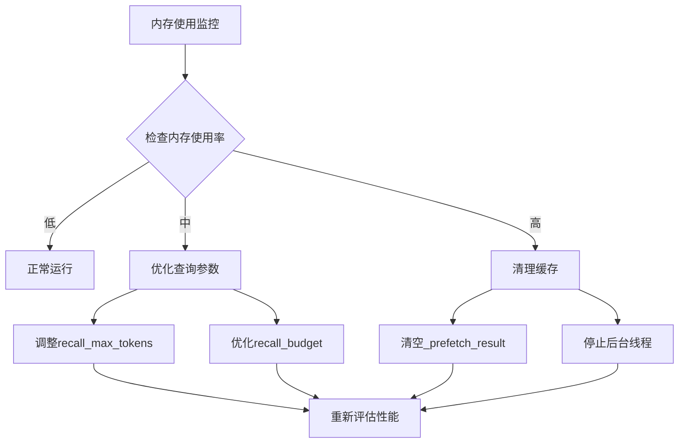

### 网络优化

1. **连接复用**：客户端实例被缓存和复用
2. **超时控制**：合理的超时设置避免长时间阻塞
3. **重试机制**：自动重试失败的请求

## 故障排除指南

### 常见问题诊断

| 问题类型 | 症状 | 可能原因 | 解决方案 |
|---------|------|---------|---------|
| 连接失败 | 客户端初始化错误 | API密钥无效或网络问题 | 检查API密钥和网络连接 |
| 查询超时 | recall/reflect调用超时 | 服务器响应慢或查询复杂 | 减少recall_max_tokens或优化查询 |
| 内存不足 | 预取结果过大 | recall_max_tokens过高 | 降低recall_max_tokens |
| 线程阻塞 | 后台线程无法停止 | 异常导致线程挂起 | 检查日志并重启进程 |

### 日志分析

插件提供了详细的日志记录，有助于问题诊断：

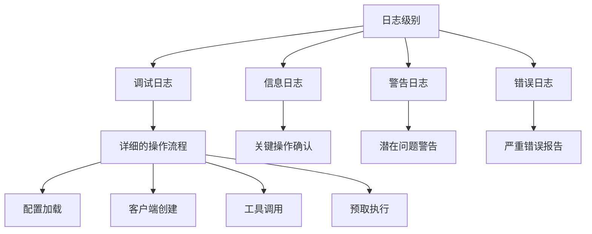

**章节来源**
- [__init__.py:851-879](file://plugins/memory/hindsight/__init__.py#L851-L879)
- [test_hindsight_provider.py:511-518](file://tests/plugins/memory/test_hindsight_provider.py#L511-L518)

## 结论

Hindsight回溯记忆插件为Hermes Agent提供了强大而灵活的长期记忆解决方案。通过其多模式支持、智能预取机制和丰富的配置选项，该插件能够满足各种应用场景的需求。

### 主要优势

1. **多模式灵活性**：支持云、本地嵌入和本地外部三种部署模式
2. **智能记忆管理**：自动提取结构化事实，建立知识图谱
3. **高效检索系统**：多策略融合的检索机制
4. **易于集成**：符合MemoryProvider标准接口
5. **可扩展性**：模块化的架构设计便于功能扩展

### 应用场景

- **客户服务**：持续跟踪客户偏好和历史交互
- **内容创作**：基于历史内容生成新的创意
- **数据分析**：从大量对话中提取洞察和趋势
- **知识管理**：构建组织的知识库和经验系统

## 附录

### 使用示例

#### 基本配置

```yaml
# ~/.hermes/hindsight/config.json
{
  "mode": "cloud",
  "apiKey": "your-api-key",
  "api_url": "https://api.hindsight.vectorize.io",
  "bank_id": "hermes",
  "recall_budget": "mid",
  "memory_mode": "hybrid"
}
```

#### 环境变量

```bash
export HINDSIGHT_API_KEY=your-cloud-api-key
export HINDSIGHT_MODE=cloud
export HINDSIGHT_BANK_ID=hermes
```

### 最佳实践

1. **合理配置预算**：根据需求平衡召回质量和性能
2. **使用标签系统**：为记忆添加有意义的标签便于检索
3. **监控资源使用**：定期检查内存和网络使用情况
4. **备份配置**：定期备份Hindsight配置文件
5. **性能调优**：根据实际使用情况调整参数设置