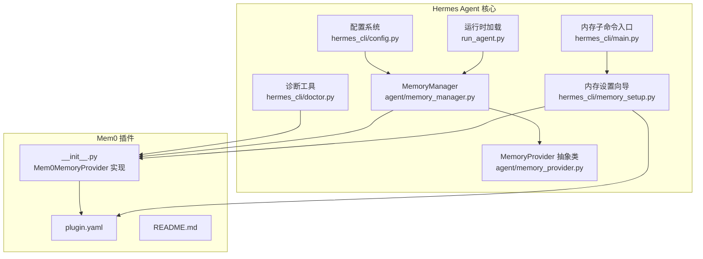
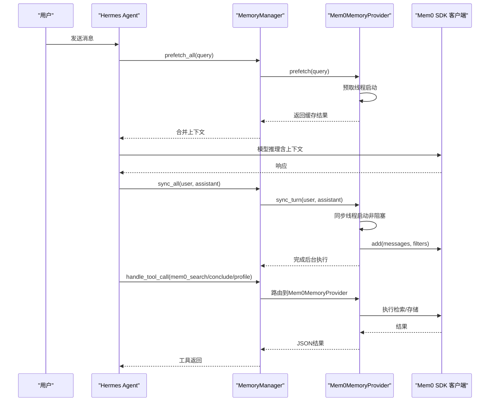
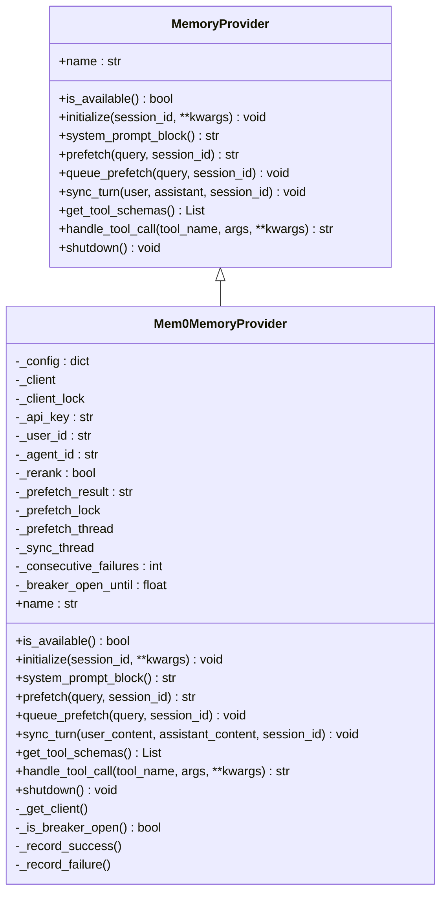
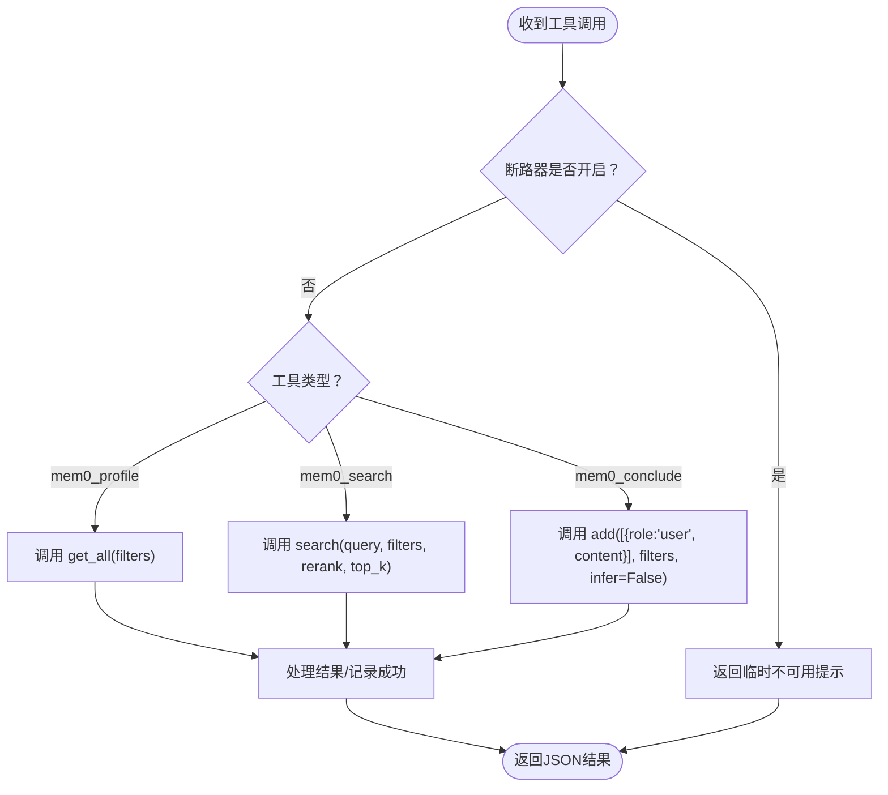
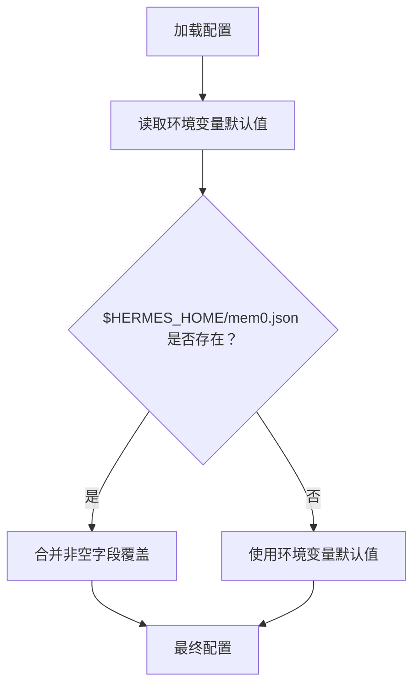
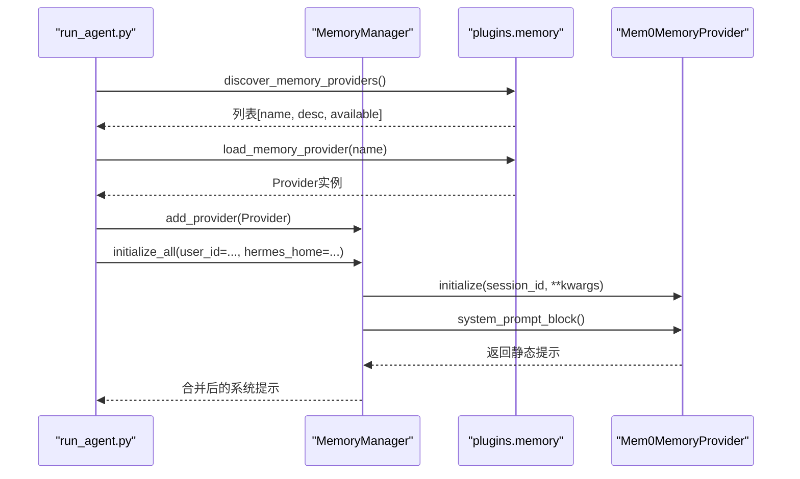
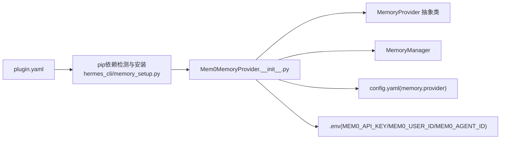

# Mem0无服务器记忆插件

<cite>
**本文引用的文件**
- [plugins/memory/mem0/plugin.yaml](file://plugins/memory/mem0/plugin.yaml)
- [plugins/memory/mem0/__init__.py](file://plugins/memory/mem0/__init__.py)
- [plugins/memory/mem0/README.md](file://plugins/memory/mem0/README.md)
- [agent/memory_provider.py](file://agent/memory_provider.py)
- [agent/memory_manager.py](file://agent/memory_manager.py)
- [plugins/memory/__init__.py](file://plugins/memory/__init__.py)
- [hermes_cli/memory_setup.py](file://hermes_cli/memory_setup.py)
- [hermes_cli/main.py](file://hermes_cli/main.py)
- [hermes_cli/doctor.py](file://hermes_cli/doctor.py)
- [hermes_cli/config.py](file://hermes_cli/config.py)
- [run_agent.py](file://run_agent.py)
</cite>

## 目录
1. [简介](#简介)
2. [项目结构](#项目结构)
3. [核心组件](#核心组件)
4. [架构总览](#架构总览)
5. [详细组件分析](#详细组件分析)
6. [依赖关系分析](#依赖关系分析)
7. [性能考虑](#性能考虑)
8. [故障排查指南](#故障排查指南)
9. [结论](#结论)
10. [附录](#附录)

## 简介
本文件为Hermes Agent的Mem0无服务器记忆插件提供完整使用文档。Mem0通过“无服务器”架构实现LLM事实抽取、语义检索、重排序与自动去重，结合Hermes的插件化记忆体系，为会话提供可扩展、低成本且高可用的记忆能力。本文涵盖：
- 无服务器架构的设计优势与实现要点（无状态、弹性扩展、成本优化）
- plugin.yaml配置项说明（依赖声明、版本等）
- 环境变量与本地配置文件（$HERMES_HOME/mem0.json）优先级
- 与Hermes Agent的集成方式（工具模式、系统提示注入、异步写入）
- 完整安装部署流程（依赖安装、配置验证、激活）
- 使用示例与最佳实践
- 性能优化与排障建议

## 项目结构
Mem0插件位于plugins/memory/mem0目录，核心文件包括：
- plugin.yaml：插件元数据与pip依赖声明
- __init__.py：MemoryProvider实现、工具schema、客户端初始化与线程安全封装
- README.md：快速开始、配置字段与工具说明

**图表来源**
- [plugins/memory/mem0/plugin.yaml:1-6](file://plugins/memory/mem0/plugin.yaml#L1-L6)
- [plugins/memory/mem0/__init__.py:1-374](file://plugins/memory/mem0/__init__.py#L1-L374)
- [plugins/memory/mem0/README.md:1-39](file://plugins/memory/mem0/README.md#L1-L39)
- [agent/memory_provider.py:42-232](file://agent/memory_provider.py#L42-L232)
- [agent/memory_manager.py:83-374](file://agent/memory_manager.py#L83-L374)
- [hermes_cli/config.py:644-654](file://hermes_cli/config.py#L644-L654)
- [hermes_cli/main.py:5710-5792](file://hermes_cli/main.py#L5710-L5792)
- [hermes_cli/memory_setup.py:58-127](file://hermes_cli/memory_setup.py#L58-L127)
- [hermes_cli/doctor.py:1040-1070](file://hermes_cli/doctor.py#L1040-L1070)
- [run_agent.py:1283-1306](file://run_agent.py#L1283-L1306)

**章节来源**
- [plugins/memory/mem0/plugin.yaml:1-6](file://plugins/memory/mem0/plugin.yaml#L1-L6)
- [plugins/memory/mem0/__init__.py:1-374](file://plugins/memory/mem0/__init__.py#L1-L374)
- [plugins/memory/mem0/README.md:1-39](file://plugins/memory/mem0/README.md#L1-L39)
- [agent/memory_provider.py:1-232](file://agent/memory_provider.py#L1-L232)
- [agent/memory_manager.py:1-374](file://agent/memory_manager.py#L1-L374)
- [hermes_cli/config.py:644-654](file://hermes_cli/config.py#L644-L654)
- [hermes_cli/main.py:5710-5792](file://hermes_cli/main.py#L5710-L5792)
- [hermes_cli/memory_setup.py:1-458](file://hermes_cli/memory_setup.py#L1-L458)
- [hermes_cli/doctor.py:1040-1150](file://hermes_cli/doctor.py#L1040-L1150)
- [run_agent.py:1283-1306](file://run_agent.py#L1283-L1306)

## 核心组件
- Mem0MemoryProvider：实现MemoryProvider接口，负责：
  - 配置加载与优先级（环境变量优先，$HERMES_HOME/mem0.json覆盖）
  - 工具schema定义（mem0_profile、mem0_search、mem0_conclude）
  - 客户端懒加载与线程安全
  - 背景预取与回合同步（非阻塞）
  - 系统提示注入与工具调用路由
- MemoryManager：统一编排内置与外部记忆提供者，支持并发提供者间隔离与失败不传播。
- 内存设置向导：自动安装pip依赖、交互式收集配置、写入.env与config.yaml，并保存provider激活状态。

**章节来源**
- [plugins/memory/mem0/__init__.py:119-374](file://plugins/memory/mem0/__init__.py#L119-L374)
- [agent/memory_provider.py:42-232](file://agent/memory_provider.py#L42-L232)
- [agent/memory_manager.py:83-374](file://agent/memory_manager.py#L83-L374)
- [hermes_cli/memory_setup.py:185-356](file://hermes_cli/memory_setup.py#L185-L356)

## 架构总览
Mem0插件采用“无服务器”架构的关键点：
- 无状态：插件仅在需要时初始化客户端，避免长连接与会话持久化，降低资源占用。
- 弹性扩展：通过后台线程执行检索与写入，避免阻塞主推理流程；失败时启用断路器冷却。
- 成本优化：默认关键词检索关闭，按需开启重排序；限制单次返回条数；通过缓存与预取减少重复请求。

**图表来源**
- [agent/memory_manager.py:178-220](file://agent/memory_manager.py#L178-L220)
- [plugins/memory/mem0/__init__.py:237-296](file://plugins/memory/mem0/__init__.py#L237-L296)
- [plugins/memory/mem0/__init__.py:300-361](file://plugins/memory/mem0/__init__.py#L300-L361)

## 详细组件分析

### Mem0MemoryProvider 类图

**图表来源**
- [agent/memory_provider.py:42-232](file://agent/memory_provider.py#L42-L232)
- [plugins/memory/mem0/__init__.py:119-374](file://plugins/memory/mem0/__init__.py#L119-L374)

**章节来源**
- [plugins/memory/mem0/__init__.py:119-374](file://plugins/memory/mem0/__init__.py#L119-L374)
- [agent/memory_provider.py:42-232](file://agent/memory_provider.py#L42-L232)

### 工具Schema与调用流程
- mem0_profile：获取该用户的所有记忆，快速、无重排序，适合对话开始时全量概览。
- mem0_search：按语义相似度检索，支持可选重排序与top_k上限。
- mem0_conclude：将用户明确陈述的事实以原文形式存储，不触发LLM抽取。

**图表来源**
- [plugins/memory/mem0/__init__.py:300-361](file://plugins/memory/mem0/__init__.py#L300-L361)
- [plugins/memory/mem0/__init__.py:212-218](file://plugins/memory/mem0/__init__.py#L212-L218)

**章节来源**
- [plugins/memory/mem0/__init__.py:73-112](file://plugins/memory/mem0/__init__.py#L73-L112)
- [plugins/memory/mem0/__init__.py:300-361](file://plugins/memory/mem0/__init__.py#L300-L361)

### 配置加载与优先级
- 环境变量默认值：MEM0_API_KEY（必填）、MEM0_USER_ID（默认hermes-user）、MEM0_AGENT_ID（默认hermes）
- 本地配置文件：$HERMES_HOME/mem0.json（存在时覆盖对应键）
- CLI配置：hermes memory setup自动安装依赖、写入.env与config.yaml

**图表来源**
- [plugins/memory/mem0/__init__.py:40-66](file://plugins/memory/mem0/__init__.py#L40-L66)
- [hermes_cli/memory_setup.py:333-356](file://hermes_cli/memory_setup.py#L333-L356)

**章节来源**
- [plugins/memory/mem0/__init__.py:40-66](file://plugins/memory/mem0/__init__.py#L40-L66)
- [plugins/memory/mem0/README.md:22-31](file://plugins/memory/mem0/README.md#L22-L31)
- [hermes_cli/memory_setup.py:221-356](file://hermes_cli/memory_setup.py#L221-L356)

### 与Hermes Agent的集成
- 插件发现与加载：plugins/memory/__init__.py扫描目录并导入插件模块或register函数。
- 运行时初始化：run_agent.py在启动时根据config.yaml中的memory.provider加载对应插件，并传入user_id等上下文。
- 工具路由：MemoryManager将工具名映射到具体Provider，确保同一时刻仅一个外部Provider生效。
- 系统提示注入：Provider返回静态文本，MemoryManager将其拼接到系统提示中。

**图表来源**
- [plugins/memory/__init__.py:166-199](file://plugins/memory/__init__.py#L166-L199)
- [plugins/memory/__init__.py:184-199](file://plugins/memory/__init__.py#L184-L199)
- [run_agent.py:1283-1306](file://run_agent.py#L1283-L1306)
- [agent/memory_manager.py:356-374](file://agent/memory_manager.py#L356-L374)
- [plugins/memory/mem0/__init__.py:203-211](file://plugins/memory/mem0/__init__.py#L203-L211)

**章节来源**
- [plugins/memory/__init__.py:166-199](file://plugins/memory/__init__.py#L166-L199)
- [run_agent.py:1283-1306](file://run_agent.py#L1283-L1306)
- [agent/memory_manager.py:83-142](file://agent/memory_manager.py#L83-L142)
- [plugins/memory/mem0/__init__.py:203-211](file://plugins/memory/mem0/__init__.py#L203-L211)

## 依赖关系分析
- 外部依赖：mem0ai（通过plugin.yaml声明），由hermes_cli/memory_setup.py在setup阶段自动安装。
- 内部耦合：Mem0MemoryProvider依赖MemoryProvider抽象、MemoryManager编排、Hermes配置系统与CLI工具链。
- 并发与容错：Provider内部使用锁与后台线程，断路器在连续失败后进入冷却，避免雪崩。

**图表来源**
- [plugins/memory/mem0/plugin.yaml:4-6](file://plugins/memory/mem0/plugin.yaml#L4-L6)
- [hermes_cli/memory_setup.py:58-127](file://hermes_cli/memory_setup.py#L58-L127)
- [plugins/memory/mem0/__init__.py:168-179](file://plugins/memory/mem0/__init__.py#L168-L179)
- [hermes_cli/config.py:644-654](file://hermes_cli/config.py#L644-L654)

**章节来源**
- [plugins/memory/mem0/plugin.yaml:4-6](file://plugins/memory/mem0/plugin.yaml#L4-L6)
- [hermes_cli/memory_setup.py:58-127](file://hermes_cli/memory_setup.py#L58-L127)
- [plugins/memory/mem0/__init__.py:168-179](file://plugins/memory/mem0/__init__.py#L168-L179)
- [hermes_cli/config.py:644-654](file://hermes_cli/config.py#L644-L654)

## 性能考虑
- 非阻塞写入：sync_turn通过后台线程提交，避免阻塞主推理循环。
- 预取与缓存：prefetch在后台线程拉取候选记忆，下次turn直接返回缓存结果。
- 断路器保护：连续失败达到阈值后进入冷却，防止下游服务过载。
- 检索优化：
  - 默认关闭关键词检索，按需开启
  - 重排序仅在重要查询时启用
  - 限制top_k，控制返回规模
- 线程安全：客户端懒加载并加锁，避免竞态；后台线程有超时等待与守护属性。

**章节来源**
- [plugins/memory/mem0/__init__.py:180-202](file://plugins/memory/mem0/__init__.py#L180-L202)
- [plugins/memory/mem0/__init__.py:247-296](file://plugins/memory/mem0/__init__.py#L247-L296)
- [plugins/memory/mem0/__init__.py:323-343](file://plugins/memory/mem0/__init__.py#L323-L343)

## 故障排查指南
- 诊断命令：hermes doctor会检查当前激活的memory.provider，若为mem0则验证API Key与配置文件是否存在。
- 常见问题：
  - 未安装mem0ai：安装后重启Agent或重新加载插件
  - 缺少API Key：通过hermes memory setup或手动写入.env并设置MEM0_API_KEY
  - 配置冲突：确保仅有一个外部Provider被激活（memory.provider只允许一个）
  - 网络异常：断路器触发时会暂停API调用，等待冷却时间后自动恢复
- 验证方法：
  - hermes memory status：查看当前Provider与配置状态
  - hermes doctor：自动化检查并提示修复建议

**章节来源**
- [hermes_cli/doctor.py:1040-1070](file://hermes_cli/doctor.py#L1040-L1070)
- [hermes_cli/main.py:5710-5792](file://hermes_cli/main.py#L5710-L5792)
- [hermes_cli/memory_setup.py:387-443](file://hermes_cli/memory_setup.py#L387-L443)

## 结论
Mem0无服务器记忆插件通过简洁的工具接口、健壮的并发与容错机制，以及与Hermes Agent深度集成的生命周期钩子，实现了低成本、可扩展的记忆能力。配合断路器与预取策略，能够在保证稳定性的同时提升响应速度。建议在生产环境中结合重排序与top_k策略进行权衡，合理设置user_id与agent_id以实现跨会话与多代理的正确归因。

## 附录

### 安装与部署指南
- 步骤一：安装依赖
  - 使用hermes memory setup选择mem0并自动安装mem0ai
  - 或手动执行：pip install mem0ai
- 步骤二：获取API Key
  - 访问平台注册并获取MEM0_API_KEY
- 步骤三：配置与激活
  - hermes memory setup：交互式填写配置并写入.env与config.yaml
  - 或手动：hermes config set memory.provider mem0；在~/.hermes/.env中添加MEM0_API_KEY
- 步骤四：验证
  - hermes memory status：确认Provider已激活且配置有效
  - hermes doctor：检查API Key与配置文件状态

**章节来源**
- [plugins/memory/mem0/README.md:10-21](file://plugins/memory/mem0/README.md#L10-L21)
- [hermes_cli/memory_setup.py:185-356](file://hermes_cli/memory_setup.py#L185-L356)
- [hermes_cli/main.py:5710-5792](file://hermes_cli/main.py#L5710-L5792)
- [hermes_cli/doctor.py:1040-1070](file://hermes_cli/doctor.py#L1040-L1070)

### 使用示例
- 场景一：首次使用
  - hermes memory setup → 选择mem0 → 输入API Key → 保存至.env与config.yaml
- 场景二：切换用户
  - 在gateway会话中传递user_id，Mem0将基于user_id隔离记忆
- 场景三：精确检索
  - 调用mem0_search并设置rerank=true与合适的top_k
- 场景四：存储显式事实
  - 调用mem0_conclude存储用户明确陈述的内容，不触发LLM抽取

**章节来源**
- [plugins/memory/mem0/README.md:32-39](file://plugins/memory/mem0/README.md#L32-L39)
- [plugins/memory/mem0/__init__.py:323-359](file://plugins/memory/mem0/__init__.py#L323-L359)
- [run_agent.py:1283-1299](file://run_agent.py#L1283-L1299)

### 最佳实践
- 将mem0作为单一外部Provider启用，避免与其他外部Provider并存
- 对重要查询启用rerank，但注意延迟与成本增加
- 合理设置top_k，平衡召回与上下文长度
- 使用user_id与agent_id实现跨会话与多代理的记忆隔离
- 定期通过hermes doctor检查配置有效性

**章节来源**
- [agent/memory_manager.py:97-121](file://agent/memory_manager.py#L97-L121)
- [plugins/memory/mem0/__init__.py:212-218](file://plugins/memory/mem0/__init__.py#L212-L218)
- [hermes_cli/doctor.py:1040-1070](file://hermes_cli/doctor.py#L1040-L1070)