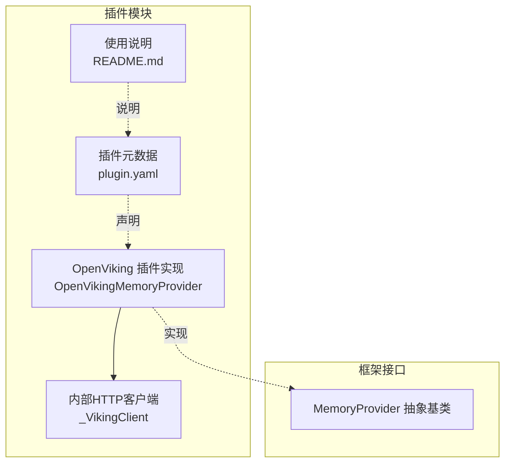
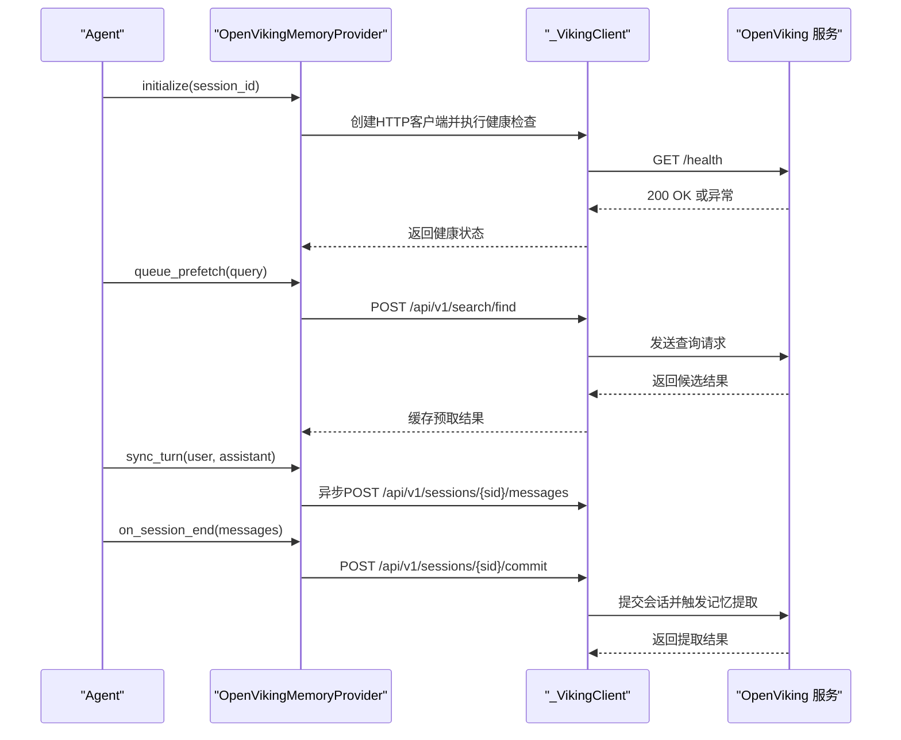
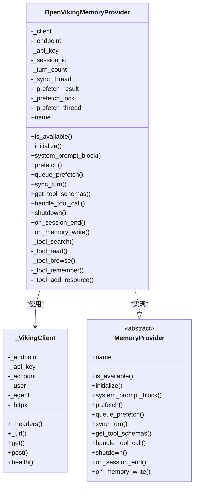
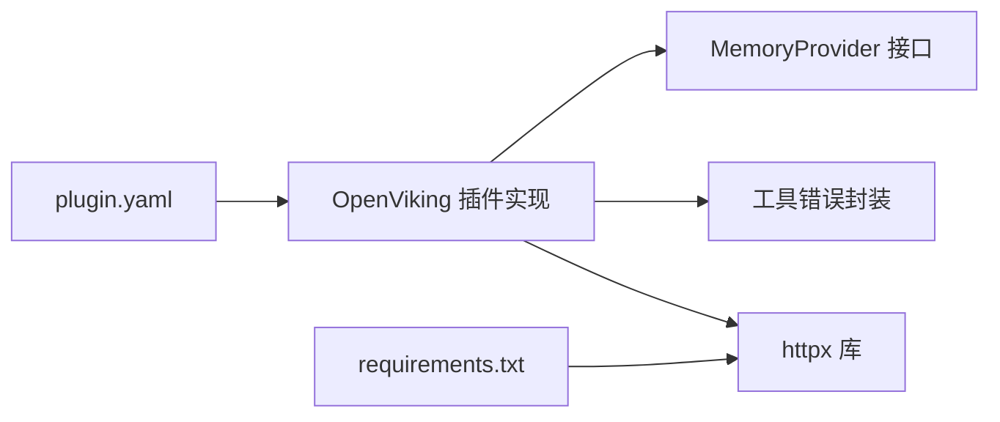

# OpenViking企业级记忆插件

<cite>
**本文档引用的文件**
- [plugins/memory/openviking/__init__.py](file://plugins/memory/openviking/__init__.py)
- [plugins/memory/openviking/plugin.yaml](file://plugins/memory/openviking/plugin.yaml)
- [plugins/memory/openviking/README.md](file://plugins/memory/openviking/README.md)
- [agent/memory_provider.py](file://agent/memory_provider.py)
- [requirements.txt](file://requirements.txt)
- [tests/plugins/memory/test_openviking_provider.py](file://tests/plugins/memory/test_openviking_provider.py)
</cite>

## 目录
1. [简介](#简介)
2. [项目结构](#项目结构)
3. [核心组件](#核心组件)
4. [架构总览](#架构总览)
5. [详细组件分析](#详细组件分析)
6. [依赖分析](#依赖分析)
7. [性能考虑](#性能考虑)
8. [安全与合规配置](#安全与合规配置)
9. [企业级部署最佳实践](#企业级部署最佳实践)
10. [监控与维护指南](#监控与维护指南)
11. [故障排查](#故障排查)
12. [结论](#结论)

## 简介
本文件面向Hermes Agent的OpenViking企业级记忆插件，系统化阐述其在企业环境中的部署与运维要点，重点覆盖以下方面：
- 高可用性：进程退出保障、会话提交兜底、异步写入与预取机制
- 安全性：API密钥注入、租户隔离头、最小权限原则
- 合规性：审计与可追溯（会话提交触发的记忆提取）、数据最小化（Tiered检索）
- 配置与集成：plugin.yaml中与安全相关的关键字段、环境变量映射
- 性能调优：线程模型、超时与重试、内容截断与缓存
- 运维监控：健康检查、日志与告警、故障定位

## 项目结构
OpenViking插件位于plugins/memory/openviking目录，核心文件包括：
- 插件实现：OpenVikingMemoryProvider类及内部HTTP客户端
- 元数据与依赖：plugin.yaml声明依赖与钩子
- 使用说明：README.md提供安装与工具说明
- 基类接口：MemoryProvider抽象类定义生命周期与钩子

**图表来源**
- [plugins/memory/openviking/__init__.py:80-131](file://plugins/memory/openviking/__init__.py#L80-L131)
- [plugins/memory/openviking/plugin.yaml:1-10](file://plugins/memory/openviking/plugin.yaml#L1-L10)
- [agent/memory_provider.py:42-232](file://agent/memory_provider.py#L42-L232)

**章节来源**
- [plugins/memory/openviking/__init__.py:1-675](file://plugins/memory/openviking/__init__.py#L1-L675)
- [plugins/memory/openviking/plugin.yaml:1-10](file://plugins/memory/openviking/plugin.yaml#L1-L10)
- [plugins/memory/openviking/README.md:1-41](file://plugins/memory/openviking/README.md#L1-L41)
- [agent/memory_provider.py:1-232](file://agent/memory_provider.py#L1-L232)

## 核心组件
- OpenVikingMemoryProvider：实现MemoryProvider接口，负责会话初始化、工具Schema暴露、工具调用处理、异步消息同步、会话结束时的记忆提取触发等。
- _VikingClient：封装对OpenViking REST API的HTTP调用，统一注入租户与认证头，支持GET/POST与健康检查。
- 工具Schema：viking_search、viking_read、viking_browse、viking_remember、viking_add_resource。
- 生命周期钩子：on_session_end用于触发自动记忆提取；on_memory_write镜像内置记忆写入。

**章节来源**
- [plugins/memory/openviking/__init__.py:255-675](file://plugins/memory/openviking/__init__.py#L255-L675)
- [agent/memory_provider.py:42-232](file://agent/memory_provider.py#L42-L232)

## 架构总览
OpenViking插件通过HTTP客户端与外部OpenViking服务交互，遵循Hermes Agent的MemoryProvider生命周期，在会话期间进行异步消息写入与背景预取，并在会话结束时触发记忆提取。

**图表来源**
- [plugins/memory/openviking/__init__.py:312-471](file://plugins/memory/openviking/__init__.py#L312-L471)
- [plugins/memory/openviking/__init__.py:531-666](file://plugins/memory/openviking/__init__.py#L531-L666)

## 详细组件分析

### OpenVikingMemoryProvider 类
- 职责：实现MemoryProvider接口，管理会话、异步写入、预取、工具调用与关闭流程。
- 关键点：
  - 初始化阶段解析环境变量并进行健康检查，失败则禁用插件。
  - 预取与同步均采用后台线程，避免阻塞主流程。
  - 会话结束时调用commit触发记忆提取，确保离线或异常退出场景下的兜底提交。

**图表来源**
- [agent/memory_provider.py:42-232](file://agent/memory_provider.py#L42-L232)
- [plugins/memory/openviking/__init__.py:255-675](file://plugins/memory/openviking/__init__.py#L255-L675)
- [plugins/memory/openviking/__init__.py:80-131](file://plugins/memory/openviking/__init__.py#L80-L131)

**章节来源**
- [plugins/memory/openviking/__init__.py:255-675](file://plugins/memory/openviking/__init__.py#L255-L675)
- [agent/memory_provider.py:42-232](file://agent/memory_provider.py#L42-L232)

### _VikingClient HTTP客户端
- 统一注入头：Content-Type、X-OpenViking-Account、X-OpenViking-User、X-OpenViking-Agent、X-API-Key（可选）。
- 健康检查：对/health端点进行短超时探测。
- 请求封装：GET/POST统一封装，统一超时控制。

**章节来源**
- [plugins/memory/openviking/__init__.py:80-131](file://plugins/memory/openviking/__init__.py#L80-L131)

### 工具Schema与调用
- viking_search：语义搜索，支持fast/deep/auto模式与作用域限制。
- viking_read：按URI读取内容，支持abstract/overview/full三级。
- viking_browse：文件系统式浏览，支持tree/list/stat。
- viking_remember：显式记忆存储，配合会话提交触发自动分类提取。
- viking_add_resource：资源入库，支持URL/路径与理由说明。

**章节来源**
- [plugins/memory/openviking/__init__.py:137-248](file://plugins/memory/openviking/__init__.py#L137-L248)
- [plugins/memory/openviking/__init__.py:500-666](file://plugins/memory/openviking/__init__.py#L500-L666)

## 依赖分析
- 内部依赖：agent.memory_provider（接口基类）、tools.registry（工具错误封装）。
- 外部依赖：httpx（HTTP客户端），在requirements.txt中可见。
- 插件声明：plugin.yaml声明pip依赖httpx与钩子on_session_end。

**图表来源**
- [plugins/memory/openviking/__init__.py:34-35](file://plugins/memory/openviking/__init__.py#L34-L35)
- [plugins/memory/openviking/plugin.yaml:4-10](file://plugins/memory/openviking/plugin.yaml#L4-L10)
- [requirements.txt](file://requirements.txt#L9)

**章节来源**
- [plugins/memory/openviking/plugin.yaml:4-10](file://plugins/memory/openviking/plugin.yaml#L4-L10)
- [requirements.txt](file://requirements.txt#L9)

## 性能考虑
- 线程模型：同步与预取均使用守护线程，避免阻塞主线程；在shutdown时等待后台线程结束。
- 超时与重试：HTTP请求统一超时控制；工具调用异常捕获后返回工具错误字符串，避免崩溃扩散。
- 内容截断：读取内容超过阈值时截断，防止上下文污染。
- 检索排序：跨桶结果按原始分数排序，兼顾召回质量与稳定性。
- 可观测性：日志记录关键事件（不可达、失败、截断等），便于定位性能瓶颈。

**章节来源**
- [plugins/memory/openviking/__init__.py:411-471](file://plugins/memory/openviking/__init__.py#L411-L471)
- [plugins/memory/openviking/__init__.py:531-666](file://plugins/memory/openviking/__init__.py#L531-L666)
- [tests/plugins/memory/test_openviking_provider.py:7-33](file://tests/plugins/memory/test_openviking_provider.py#L7-L33)

## 安全与合规配置
- 认证与授权
  - API密钥：通过环境变量OPENVIKING_API_KEY注入，若存在则在请求头中携带X-API-Key。
  - 租户隔离：通过X-OpenViking-Account、X-OpenViking-User、X-OpenViking-Agent三者组合实现多租户隔离。
  - 最小权限：仅在需要鉴权的场景下启用API密钥，本地开发可留空以进入“本地模式”。
- 数据最小化与可追溯
  - Tiered检索：支持abstract/overview/full三级，优先使用低级别摘要，减少敏感信息泄露。
  - 会话提交：on_session_end触发commit，系统自动提取6类记忆（profile、preferences、entities、events、cases、patterns），形成可审计的提取轨迹。
- 配置清单与合规
  - plugin.yaml声明了pip依赖与钩子，确保部署一致性与可审计性。
  - README.md提供了环境变量配置与工具使用说明，便于合规审查与操作手册编写。

**章节来源**
- [plugins/memory/openviking/__init__.py:94-103](file://plugins/memory/openviking/__init__.py#L94-L103)
- [plugins/memory/openviking/__init__.py:448-471](file://plugins/memory/openviking/__init__.py#L448-L471)
- [plugins/memory/openviking/plugin.yaml:1-10](file://plugins/memory/openviking/plugin.yaml#L1-L10)
- [plugins/memory/openviking/README.md:25-31](file://plugins/memory/openviking/README.md#L25-L31)

## 企业级部署最佳实践
- 集群与高可用
  - OpenViking服务端应部署为高可用集群，前端通过负载均衡器接入，确保/health端点稳定可达。
  - 客户端侧通过atexit注册的兜底提交机制，即使进程异常退出也能尽量保证会话提交。
- 负载均衡与灾备
  - 将OPENVIKING_ENDPOINT指向LB地址，结合服务端的健康检查与自动扩缩容策略，提升整体可用性。
  - 在多Agent场景下，合理设置OPENVIKING_ACCOUNT/USER/AGENT，实现租户与Agent级别的资源隔离。
- 安全加固
  - 强制开启API密钥，禁止本地模式在生产环境使用。
  - 对外暴露的网关与服务端之间启用TLS，确保传输层安全。
  - 定期轮换API密钥，限制密钥权限范围，遵循最小权限原则。

**章节来源**
- [plugins/memory/openviking/__init__.py:51-64](file://plugins/memory/openviking/__init__.py#L51-L64)
- [plugins/memory/openviking/__init__.py:321-331](file://plugins/memory/openviking/__init__.py#L321-L331)

## 监控与维护指南
- 健康检查
  - 使用/V1/health端点进行周期性探测，作为SLI指标纳入监控体系。
  - 在initialize阶段进行健康检查，失败时记录警告并禁用插件。
- 性能指标
  - 关注工具调用延迟、预取命中率、会话提交成功率、后台线程存活状态。
  - 对读取内容长度进行统计，评估是否需要调整截断阈值。
- 故障诊断
  - 查看日志中关于“不可达”、“失败”、“截断”的提示，定位问题根因。
  - 在shutdown阶段等待后台线程结束，避免资源泄漏。

**章节来源**
- [plugins/memory/openviking/__init__.py:123-131](file://plugins/memory/openviking/__init__.py#L123-L131)
- [plugins/memory/openviking/__init__.py:326-331](file://plugins/memory/openviking/__init__.py#L326-L331)
- [plugins/memory/openviking/__init__.py:519-528](file://plugins/memory/openviking/__init__.py#L519-L528)

## 故障排查
- 插件不可用
  - 确认OPENVIKING_ENDPOINT已正确设置且服务可达。
  - 若未安装httpx，插件将被禁用，需安装依赖后重启。
- 工具调用失败
  - 检查工具参数是否完整（如query、uri等）。
  - 观察返回的工具错误字符串，定位具体错误原因。
- 内容过长
  - viking_read会对超长内容进行截断，必要时缩小查询范围或降低详情级别。
- 会话未提取
  - 确保on_session_end被调用，检查commit接口返回状态。

**章节来源**
- [plugins/memory/openviking/__init__.py:273-276](file://plugins/memory/openviking/__init__.py#L273-L276)
- [plugins/memory/openviking/__init__.py:500-517](file://plugins/memory/openviking/__init__.py#L500-L517)
- [plugins/memory/openviking/__init__.py:573-600](file://plugins/memory/openviking/__init__.py#L573-L600)
- [plugins/memory/openviking/__init__.py:448-471](file://plugins/memory/openviking/__init__.py#L448-L471)

## 结论
OpenViking企业级记忆插件通过严格的生命周期管理、租户隔离与API密钥机制、以及会话提交触发的记忆提取，为企业用户提供高可用、可审计、可追溯的记忆能力。结合本文提供的配置、性能与运维建议，可在生产环境中实现稳定、安全、合规的部署与运行。