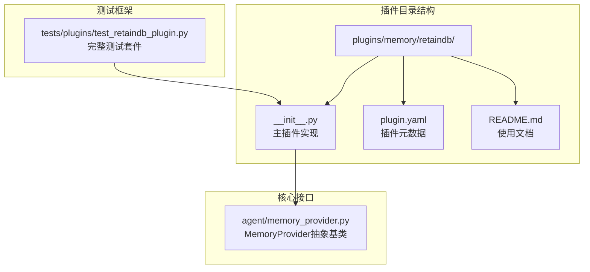
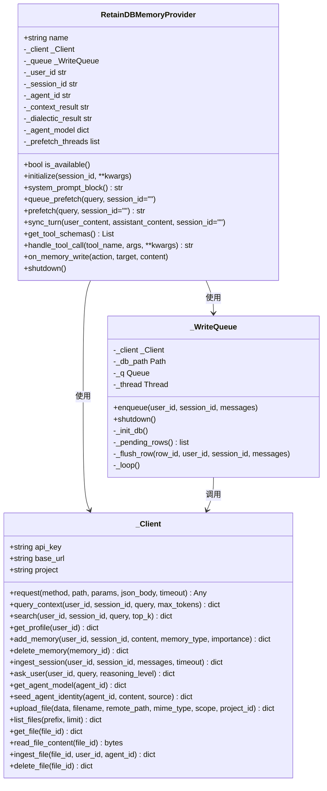
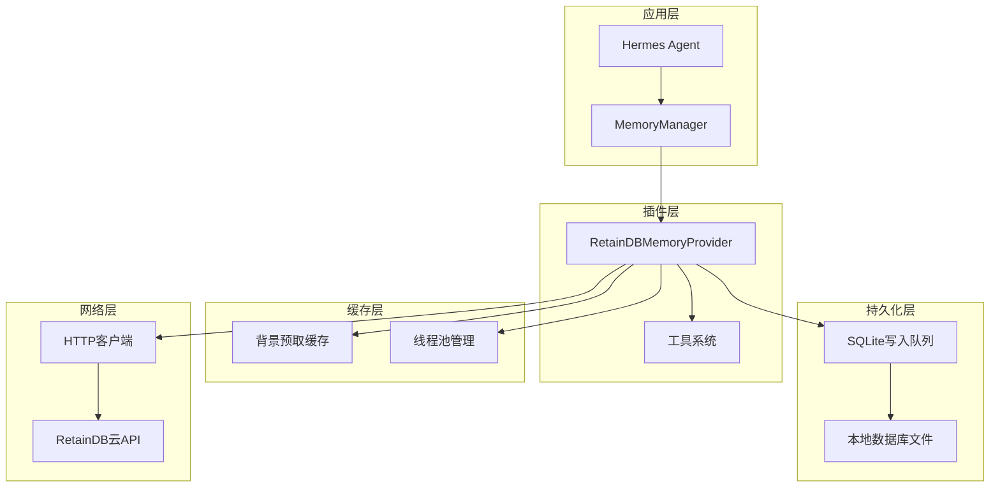
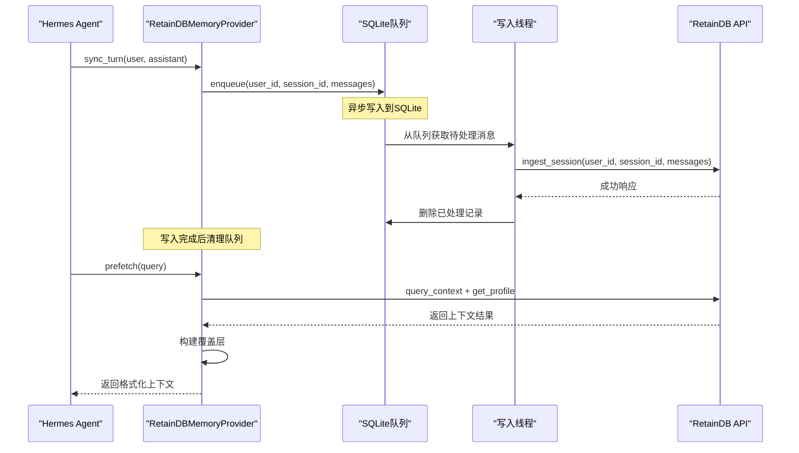
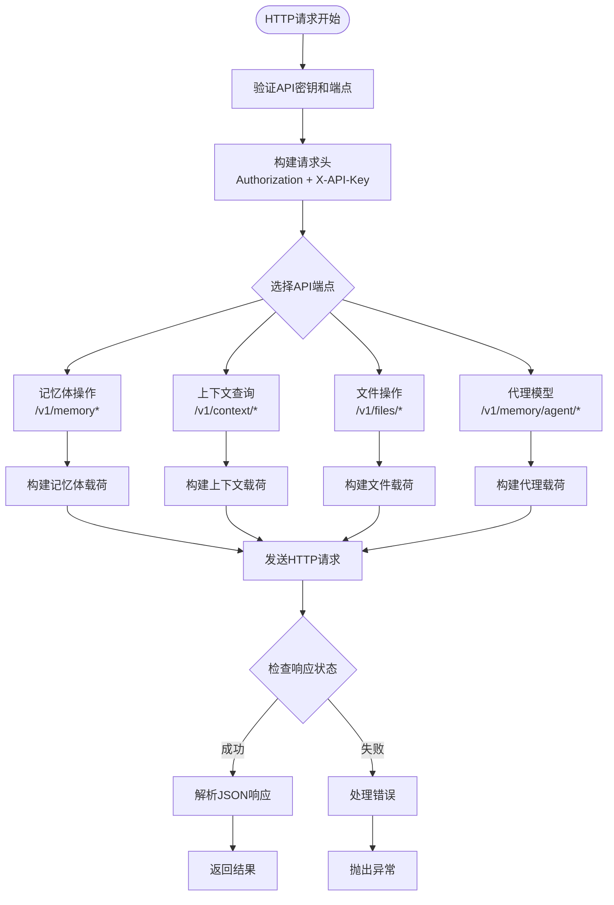
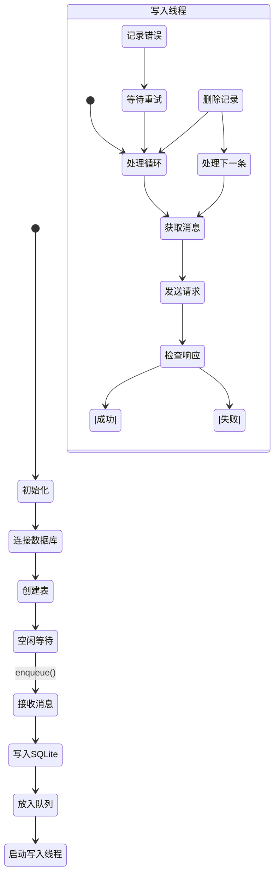
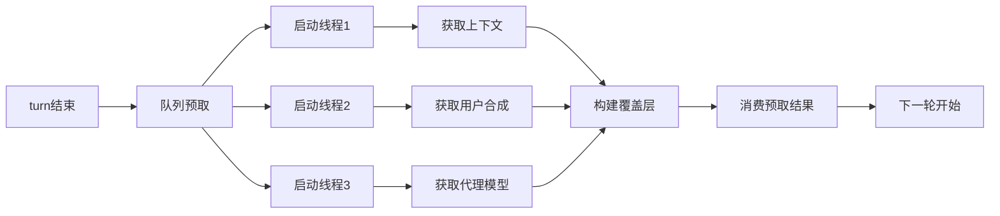
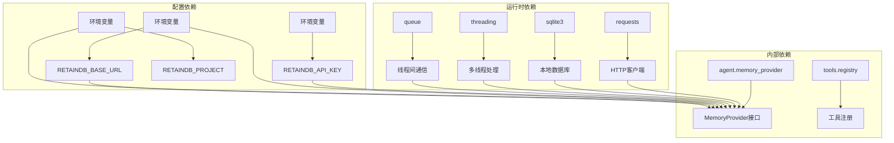
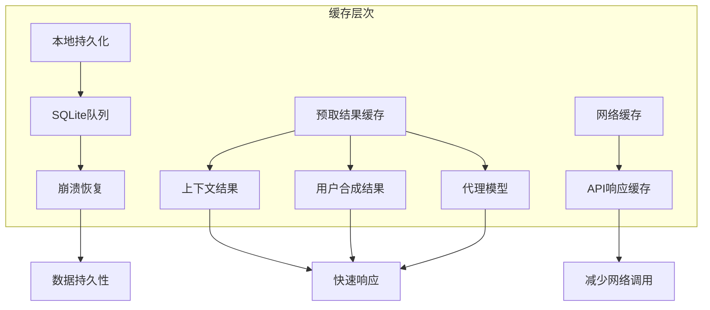
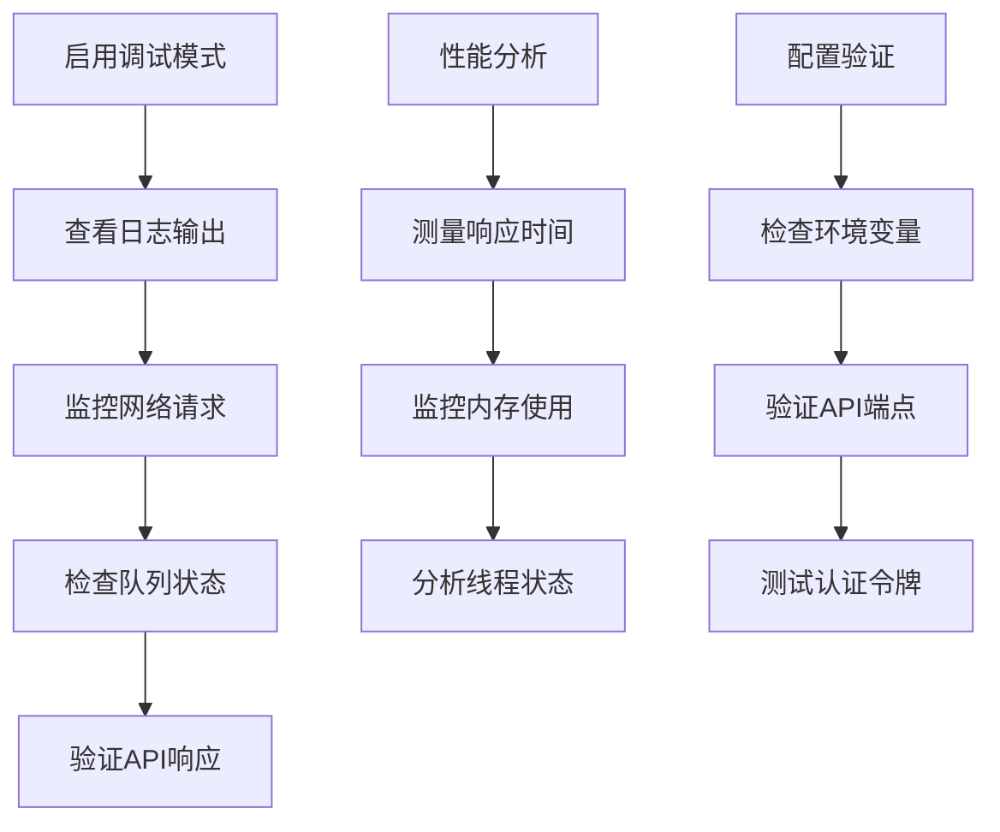

# RetainDB数据库存储插件

<cite>
**本文档引用的文件**
- [plugins/memory/retaindb/__init__.py](file://plugins/memory/retaindb/__init__.py)
- [plugins/memory/retaindb/plugin.yaml](file://plugins/memory/retaindb/plugin.yaml)
- [plugins/memory/retaindb/README.md](file://plugins/memory/retaindb/README.md)
- [tests/plugins/test_retaindb_plugin.py](file://tests/plugins/test_retaindb_plugin.py)
- [agent/memory_provider.py](file://agent/memory_provider.py)
</cite>

## 目录
1. [简介](#简介)
2. [项目结构](#项目结构)
3. [核心组件](#核心组件)
4. [架构概览](#架构概览)
5. [详细组件分析](#详细组件分析)
6. [依赖关系分析](#依赖关系分析)
7. [性能考虑](#性能考虑)
8. [故障排除指南](#故障排除指南)
9. [结论](#结论)
10. [附录](#附录)

## 简介

RetainDB是Hermes Agent的一个内存存储插件，提供云端记忆体API，支持混合搜索（向量+BM25+重排序）和7种记忆类型。该插件通过HTTP客户端与RetainDB云服务通信，同时使用SQLite持久化写入队列，确保崩溃安全和异步数据摄取。

主要特性包括：
- 正确的API路由用于所有操作
- 持久化的SQLite写入队列（崩溃安全，异步摄取）
- 语义搜索+用户档案检索
- 带去重覆盖的上下文查询
- 对话式综合（LLM驱动的用户理解，每轮预取）
- 代理自我模型（来自SOUL.md的人格和指令，每轮预取）
- 共享文件存储工具（上传、列出、读取、摄取、删除）

## 项目结构

RetainDB插件位于Hermes Agent的插件系统中，采用标准的插件目录结构：



**图表来源**
- [plugins/memory/retaindb/__init__.py:1-767](file://plugins/memory/retaindb/__init__.py#L1-L767)
- [plugins/memory/retaindb/plugin.yaml:1-8](file://plugins/memory/retaindb/plugin.yaml#L1-L8)
- [agent/memory_provider.py:1-232](file://agent/memory_provider.py#L1-L232)

**章节来源**
- [plugins/memory/retaindb/__init__.py:1-767](file://plugins/memory/retaindb/__init__.py#L1-L767)
- [plugins/memory/retaindb/plugin.yaml:1-8](file://plugins/memory/retaindb/plugin.yaml#L1-L8)
- [plugins/memory/retaindb/README.md:1-41](file://plugins/memory/retaindb/README.md#L1-L41)

## 核心组件

RetainDB插件由以下核心组件构成：

### 主要类结构



**图表来源**
- [plugins/memory/retaindb/__init__.py:179-408](file://plugins/memory/retaindb/__init__.py#L179-L408)
- [plugins/memory/retaindb/__init__.py:452-767](file://plugins/memory/retaindb/__init__.py#L452-L767)

### 配置系统

插件支持三种配置方式：

| 配置项 | 环境变量 | 默认值 | 描述 |
|--------|----------|--------|------|
| API密钥 | `RETAINDB_API_KEY` | 必需 | RetainDB访问令牌 |
| 基础URL | `RETAINDB_BASE_URL` | `https://api.retaindb.com` | API端点地址 |
| 项目标识 | `RETAINDB_PROJECT` | 自动解析 | 项目标识符 |

**章节来源**
- [plugins/memory/retaindb/__init__.py:480-485](file://plugins/memory/retaindb/__init__.py#L480-L485)
- [plugins/memory/retaindb/__init__.py:489-501](file://plugins/memory/retaindb/__init__.py#L489-L501)
- [plugins/memory/retaindb/plugin.yaml:6-7](file://plugins/memory/retaindb/plugin.yaml#L6-L7)

## 架构概览

RetainDB插件采用分层架构设计，结合云端API和本地持久化存储：



**图表来源**
- [plugins/memory/retaindb/__init__.py:452-538](file://plugins/memory/retaindb/__init__.py#L452-L538)
- [plugins/memory/retaindb/__init__.py:326-408](file://plugins/memory/retaindb/__init__.py#L326-L408)

### 数据流处理



**图表来源**
- [plugins/memory/retaindb/__init__.py:627-640](file://plugins/memory/retaindb/__init__.py#L627-L640)
- [plugins/memory/retaindb/__init__.py:542-624](file://plugins/memory/retaindb/__init__.py#L542-L624)

## 详细组件分析

### HTTP客户端组件

_HTTP客户端负责与RetainDB云服务的所有网络通信，支持多种API端点：_



**图表来源**
- [plugins/memory/retaindb/__init__.py:179-324](file://plugins/memory/retaindb/__init__.py#L179-L324)

### 写入队列组件

_写入队列提供崩溃安全的异步数据摄取机制：_



**图表来源**
- [plugins/memory/retaindb/__init__.py:330-408](file://plugins/memory/retaindb/__init__.py#L330-L408)

### 工具系统组件

_RetainDB提供10个专用工具，涵盖记忆体管理和文件操作：_

| 工具类别 | 工具名称 | 功能描述 |
|----------|----------|----------|
| 记忆体工具 | `retaindb_profile` | 获取用户稳定档案 |
| 记忆体工具 | `retaindb_search` | 语义搜索记忆体 |
| 记忆体工具 | `retaindb_context` | 当前任务相关上下文 |
| 记忆体工具 | `retaindb_remember` | 存储事实、偏好等 |
| 记忆体工具 | `retaindb_forget` | 删除特定记忆体 |
| 文件工具 | `retaindb_upload_file` | 上传文件到共享存储 |
| 文件工具 | `retaindb_list_files` | 列出存储的文件 |
| 文件工具 | `retaindb_read_file` | 读取文件内容 |
| 文件工具 | `retaindb_ingest_file` | 从文件提取记忆体 |
| 文件工具 | `retaindb_delete_file` | 删除存储的文件 |

**章节来源**
- [plugins/memory/retaindb/__init__.py:49-173](file://plugins/memory/retaindb/__init__.py#L49-L173)

### 背景预取机制

_预取机制通过多线程并行获取上下文信息：_



**图表来源**
- [plugins/memory/retaindb/__init__.py:542-624](file://plugins/memory/retaindb/__init__.py#L542-L624)

**章节来源**
- [plugins/memory/retaindb/__init__.py:542-596](file://plugins/memory/retaindb/__init__.py#L542-L596)

## 依赖关系分析

### 外部依赖

RetainDB插件的依赖关系如下：



**图表来源**
- [plugins/memory/retaindb/plugin.yaml:4-5](file://plugins/memory/retaindb/plugin.yaml#L4-L5)
- [plugins/memory/retaindb/__init__.py:21-37](file://plugins/memory/retaindb/__init__.py#L21-L37)

### 内部耦合分析

插件内部组件之间的耦合度适中，主要体现在：

1. **Provider与Client**: 通过组合关系紧密耦合，Provider直接使用Client进行API调用
2. **Provider与Queue**: 通过依赖注入，Queue作为Provider的子组件存在
3. **Queue与Client**: 单向依赖，Queue调用Client的方法
4. **工具系统**: 与MemoryProvider接口松耦合，通过工具schema暴露功能

**章节来源**
- [plugins/memory/retaindb/__init__.py:452-767](file://plugins/memory/retaindb/__init__.py#L452-L767)

## 性能考虑

### 并发控制策略

RetainDB插件采用了多层次的并发控制机制：

1. **线程本地连接缓存**: 每个线程维护独立的SQLite连接，避免连接竞争
2. **队列同步**: 使用Python内置Queue确保线程间安全通信
3. **预取线程管理**: 限制同时运行的预取线程数量，防止资源耗尽
4. **超时控制**: 所有网络请求都设置了合理的超时时间

### 缓存策略



### 性能优化建议

1. **批量处理**: 将多个小的记忆体写入合并为批量请求
2. **智能重试**: 实现指数退避算法处理临时网络故障
3. **连接池**: 考虑实现HTTP连接池复用TCP连接
4. **压缩传输**: 在上传大文件时启用压缩传输

## 故障排除指南

### 常见问题诊断

| 问题类型 | 症状 | 可能原因 | 解决方案 |
|----------|------|----------|----------|
| 认证失败 | `RetainDB not initialized` | 缺少API密钥 | 设置`RETAINDB_API_KEY`环境变量 |
| 网络超时 | 请求超时异常 | 网络连接问题 | 检查网络连接和防火墙设置 |
| 数据库锁定 | SQLite连接失败 | 多进程竞争 | 确保单实例运行或使用文件锁 |
| API限流 | 429状态码 | 请求频率过高 | 实现指数退避重试机制 |
| 内存泄漏 | 预取线程堆积 | 线程管理不当 | 实现线程池大小限制 |

### 调试工具



**章节来源**
- [tests/plugins/test_retaindb_plugin.py:347-381](file://tests/plugins/test_retaindb_plugin.py#L347-L381)
- [tests/plugins/test_retaindb_plugin.py:569-667](file://tests/plugins/test_retaindb_plugin.py#L569-L667)

## 结论

RetainDB数据库存储插件为Hermes Agent提供了强大而灵活的记忆体管理能力。通过云端API与本地持久化相结合的设计，该插件实现了高可用性、可扩展性和数据安全性。

### 主要优势

1. **混合搜索能力**: 结合向量相似度、BM25关键词匹配和重排序算法
2. **崩溃安全**: SQLite写入队列确保数据不会因意外中断而丢失
3. **异步处理**: 背景线程处理网络请求，不影响主流程性能
4. **灵活配置**: 支持多种环境变量配置，适应不同部署场景
5. **工具丰富**: 提供完整的记忆体管理和文件操作工具集

### 适用场景

- 需要跨会话持久化记忆体的应用
- 需要复杂查询和语义搜索的场景
- 对数据可靠性要求较高的生产环境
- 需要与云端记忆体服务集成的系统

## 附录

### 安装和配置指南

1. **安装依赖**:
   ```bash
   pip install requests
   ```

2. **设置环境变量**:
   ```bash
   export RETAINDB_API_KEY="your-api-key"
   export RETAINDB_BASE_URL="https://api.retaindb.com"
   export RETAINDB_PROJECT="your-project-id"
   ```

3. **在Hermes中启用**:
   ```bash
   hermes memory setup  # 选择"retaindb"
   # 或手动配置
   hermes config set memory.provider retaindb
   ```

### SQL查询示例

虽然RetainDB使用云端API而非本地SQL，但插件内部使用了以下SQLite查询：

```sql
-- 创建待处理队列表
CREATE TABLE IF NOT EXISTS pending (
    id INTEGER PRIMARY KEY AUTOINCREMENT,
    user_id TEXT, 
    session_id TEXT, 
    messages_json TEXT,
    created_at TEXT, 
    last_error TEXT
);

-- 查询待处理记录
SELECT id, user_id, session_id, messages_json 
FROM pending 
ORDER BY id ASC 
LIMIT 200;

-- 删除已处理记录
DELETE FROM pending WHERE id = ?;
```

### 维护和备份策略

1. **定期备份**:
   - 备份`.hermes/retaindb_queue.db`文件
   - 定期导出重要记忆体数据
   - 保持多个地理位置的备份副本

2. **监控指标**:
   - 监控队列长度和处理延迟
   - 跟踪API调用成功率和错误率
   - 监控磁盘空间使用情况

3. **灾难恢复**:
   - 测试备份文件的完整性和可恢复性
   - 准备应急响应流程
   - 建立数据恢复时间目标(RTO)和恢复点目标(RPO)