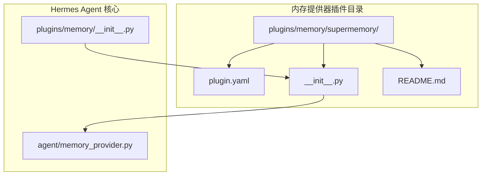
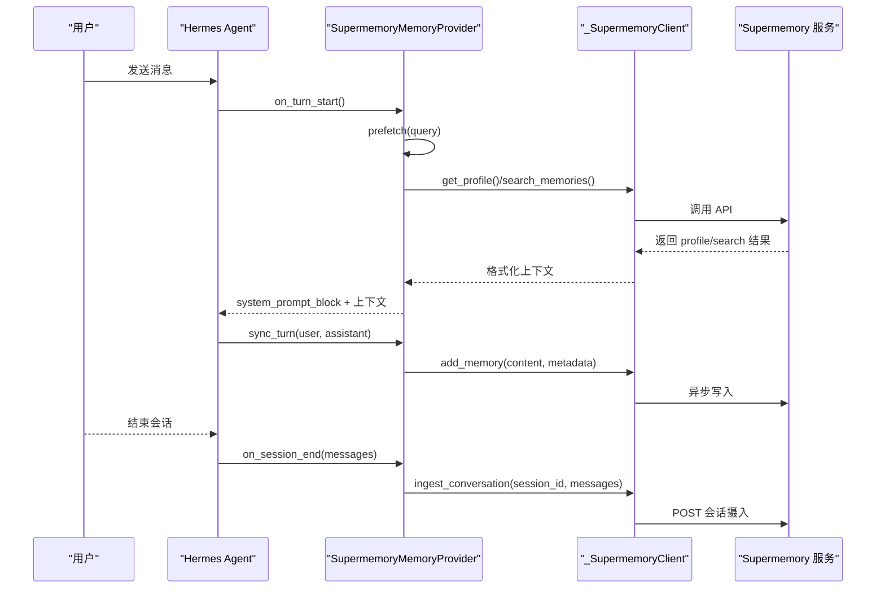
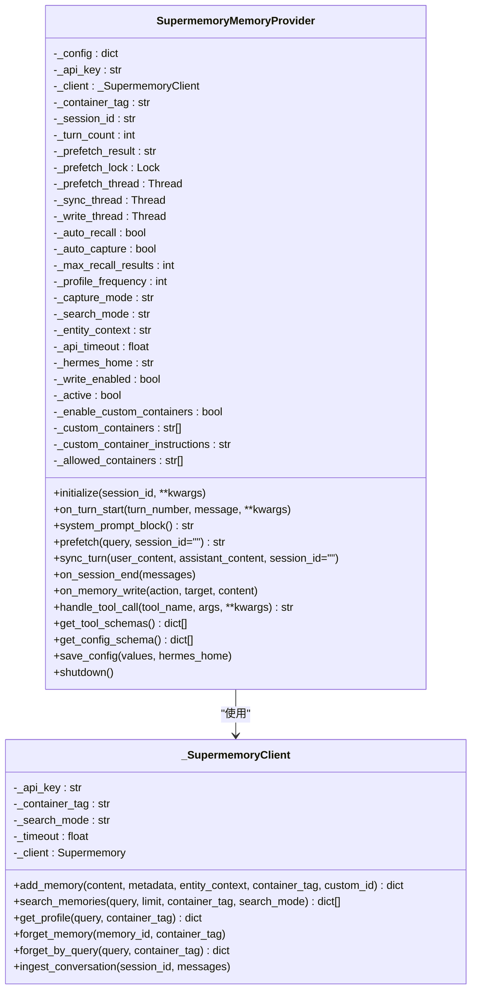
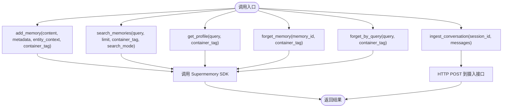
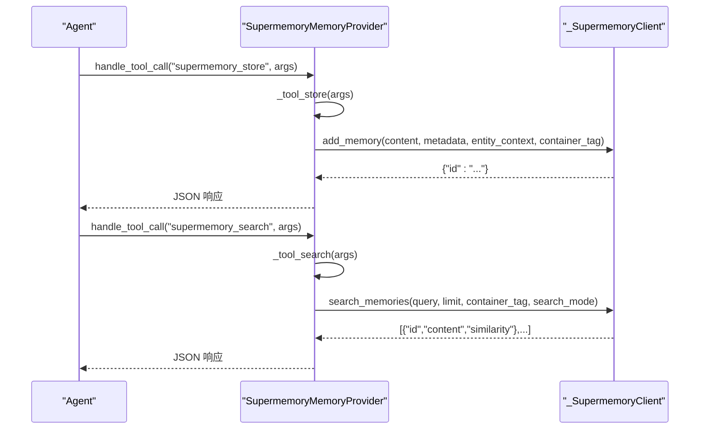
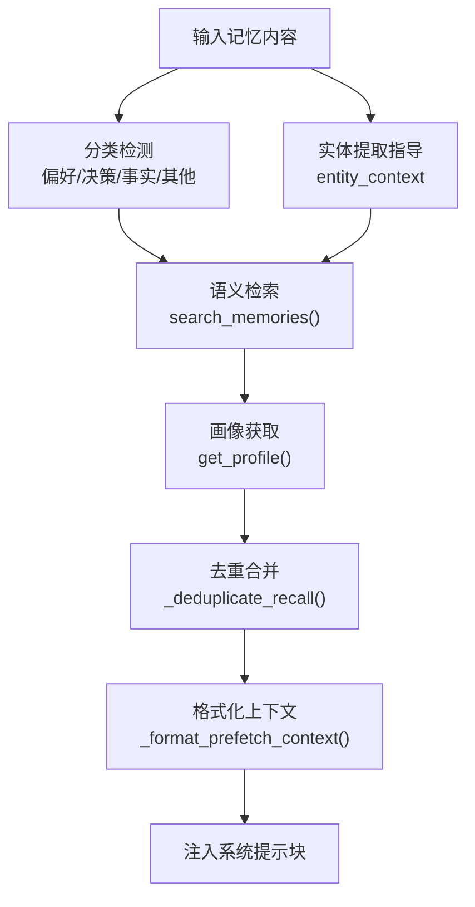
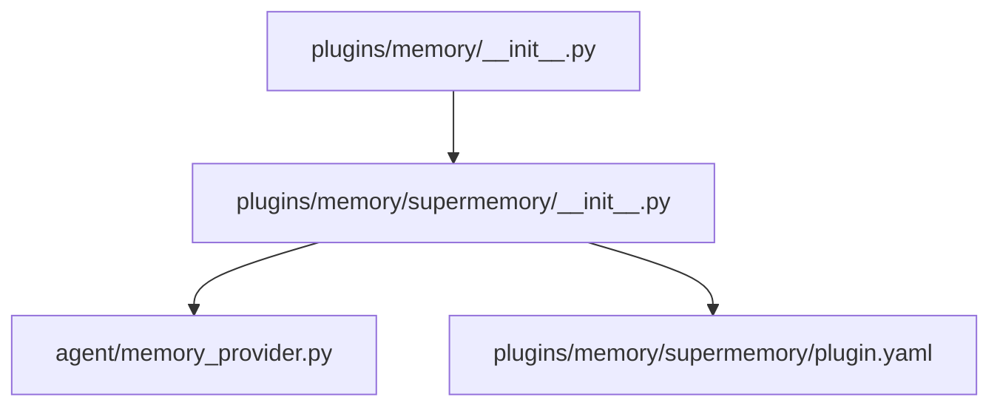

# SuperMemory增强记忆插件

<cite>
**本文引用的文件**
- [plugin.yaml](file://plugins/memory/supermemory/plugin.yaml)
- [README.md](file://plugins/memory/supermemory/README.md)
- [__init__.py](file://plugins/memory/supermemory/__init__.py)
- [plugins/__init__.py](file://plugins/memory/__init__.py)
- [memory_provider.py](file://agent/memory_provider.py)
- [test_supermemory_provider.py](file://tests/plugins/memory/test_supermemory_provider.py)
</cite>

## 目录
1. [简介](#简介)
2. [项目结构](#项目结构)
3. [核心组件](#核心组件)
4. [架构总览](#架构总览)
5. [详细组件分析](#详细组件分析)
6. [依赖关系分析](#依赖关系分析)
7. [性能考虑](#性能考虑)
8. [故障排除指南](#故障排除指南)
9. [结论](#结论)
10. [附录](#附录)

## 简介
本文件为 Hermes Agent 的 SuperMemory 增强记忆插件提供全面的功能文档。该插件通过语义长程记忆（semantic long-term memory）实现以下增强能力：
- 智能记忆增强：自动抽取对话要点、持久化用户画像与近期上下文，并在会话中按需注入相关记忆。
- 上下文理解能力：支持混合检索（profile+memories）、仅记忆或仅文档三种搜索模式，提升检索准确性与相关性。
- 学习优化机制：通过实体提取指导（entity context）与多容器标签（container tags）实现更精准的记忆分类与检索。

此外，文档还详细说明了 plugin.yaml 配置文件的增强功能参数（如学习率设置、记忆权重调整、优化算法选择等），并解释增强记忆的工作原理（模式识别、关联分析、智能推荐算法）。最后提供配置指南、使用案例与性能建议，帮助用户在不同场景下选择合适的增强策略。

## 项目结构
SuperMemory 插件位于内存提供器插件目录下，采用标准的插件结构：
- 插件元信息：plugin.yaml
- 插件实现：__init__.py（包含 MemoryProvider 实现与注册入口）
- 使用说明：README.md（含安装、配置、工具与行为说明）

**图表来源**
- [plugin.yaml:1-6](file://plugins/memory/supermemory/plugin.yaml#L1-L6)
- [__init__.py:1-50](file://plugins/memory/supermemory/__init__.py#L1-L50)
- [plugins/__init__.py:1-50](file://plugins/memory/__init__.py#L1-L50)

**章节来源**
- [plugin.yaml:1-6](file://plugins/memory/supermemory/plugin.yaml#L1-L6)
- [README.md:1-100](file://plugins/memory/supermemory/README.md#L1-L100)
- [__init__.py:1-120](file://plugins/memory/supermemory/__init__.py#L1-L120)
- [plugins/__init__.py:1-120](file://plugins/memory/__init__.py#L1-L120)

## 核心组件
- SupermemoryMemoryProvider：实现 MemoryProvider 接口，负责初始化、自动回忆、自动捕获、显式工具调用与会话结束时的对话摄入。
- _SupermemoryClient：封装对 Supermemory SDK 的调用，提供记忆存储、检索、忘记、画像查询与会话摄入等操作。
- 工具模式（schemas）：supermemory_store、supermemory_search、supermemory_forget、supermemory_profile。
- 配置系统：默认配置、环境变量解析、配置文件加载与保存。

关键职责与交互：
- 初始化阶段：从环境变量与配置文件加载参数，解析容器标签（支持 {identity} 模板），建立客户端实例。
- 自动回忆：在每轮对话前根据 profile 与检索结果生成上下文片段，注入到系统提示块中。
- 自动捕获：清理并标准化对话回合内容，在后台线程异步写入记忆库。
- 显式工具：提供检索、存储、遗忘与画像查询的工具接口，支持可选容器标签（多容器模式）。
- 会话摄入：在会话结束时将完整对话消息上传至 Supermemory，用于图谱更新与长期学习。

**章节来源**
- [__init__.py:420-791](file://plugins/memory/supermemory/__init__.py#L420-L791)
- [plugins/__init__.py:120-180](file://plugins/memory/__init__.py#L120-L180)

## 架构总览
SuperMemory 插件通过 MemoryProvider 接口与 Hermes Agent 协同工作，形成“自动回忆 + 自动捕获 + 显式工具 + 会话摄入”的增强记忆闭环。

**图表来源**
- [__init__.py:527-616](file://plugins/memory/supermemory/__init__.py#L527-L616)

## 详细组件分析

### SupermemoryMemoryProvider 类
- 角色：实现 MemoryProvider 接口，管理生命周期、自动回忆与捕获、工具调用与会话摄入。
- 关键属性：容器标签、自动回忆/捕获开关、最大召回结果数、画像刷新频率、捕获模式、搜索模式、实体上下文、API 超时、多容器支持。
- 生命周期方法：
  - initialize：加载配置、解析容器标签、建立客户端、设置写入开关。
  - on_turn_start：维护轮次计数。
  - system_prompt_block：动态生成系统提示块，包含当前容器与可用工具说明；多容器模式下附加可用容器列表与指令。
  - prefetch：按轮次策略获取 profile 与检索结果，格式化为上下文。
  - sync_turn：清理并标准化对话内容，异步写入记忆库。
  - on_session_end：清洗消息后进行会话摄入。
  - on_memory_write：监听外部显式写入事件，异步写入记忆库。
  - handle_tool_call：分发工具调用，支持容器标签校验与多容器模式。
  - get_tool_schemas：返回工具模式（schema），多容器模式下为相关工具添加可选容器标签参数。

**图表来源**
- [__init__.py:420-791](file://plugins/memory/supermemory/__init__.py#L420-L791)

**章节来源**
- [__init__.py:420-791](file://plugins/memory/supermemory/__init__.py#L420-L791)

### _SupermemoryClient 组件
- 封装 Supermemory SDK 客户端，提供统一的 API 调用接口。
- 支持：
  - add_memory：存储显式记忆，可附带 metadata 与自定义 id。
  - search_memories：按相似度检索记忆，支持限制数量与搜索模式切换。
  - get_profile：获取静态画像与动态上下文，以及检索结果。
  - forget_memory / forget_by_query：按 id 或最佳匹配查询删除记忆。
  - ingest_conversation：上传完整会话消息，用于图谱更新与长期学习。

**图表来源**
- [__init__.py:263-368](file://plugins/memory/supermemory/__init__.py#L263-L368)

**章节来源**
- [__init__.py:263-368](file://plugins/memory/supermemory/__init__.py#L263-L368)

### 配置系统与增强参数
- 默认配置与参数范围：
  - container_tag：容器标签，默认 hermes，支持 {identity} 模板。
  - auto_recall：是否自动注入上下文，默认开启。
  - auto_capture：是否自动捕获对话回合，默认开启。
  - max_recall_results：最大召回条目数，范围 1-20。
  - profile_frequency：画像刷新频率（轮次间隔），范围 1-500。
  - capture_mode：捕获模式，支持 all/everything。
  - search_mode：搜索模式，支持 hybrid/memories/documents。
  - entity_context：实体提取指导文本，长度上限 1500 字符。
  - api_timeout：SDK 与摄入请求超时，范围 0.5-15 秒。
  - 多容器支持：enable_custom_container_tags、custom_containers、custom_container_instructions。
- 环境变量：
  - SUPERMEMORY_API_KEY：必需。
  - SUPERMEMORY_CONTAINER_TAG：覆盖配置文件中的 container_tag。
- 配置文件：$HERMES_HOME/supermemory.json，保存用户修改后的配置。

注意：仓库中未发现直接的“学习率设置”、“记忆权重调整”、“优化算法选择”等参数。这些概念通常出现在训练/优化场景中，而 SuperMemory 插件主要提供检索与摄入能力。若需要类似“权重/排序”的效果，可通过 entity_context 与 search_mode 进行间接控制。

**章节来源**
- [__init__.py:56-141](file://plugins/memory/supermemory/__init__.py#L56-L141)
- [README.md:23-45](file://plugins/memory/supermemory/README.md#L23-L45)

### 工具模式与多容器支持
- 工具模式（schemas）：
  - supermemory_store：存储显式记忆（content 必填，metadata 可选）。
  - supermemory_search：按语义相似度检索（query 必填，limit 1-20）。
  - supermemory_forget：按 id 或最佳匹配查询删除记忆。
  - supermemory_profile：获取持久画像与近期上下文。
- 多容器模式：
  - 当启用时，上述工具可接收可选 container_tag 参数，且必须在允许列表（主容器 + 自定义容器）内。
  - 自动操作（turn 同步、预取、显式写入镜像、会话摄入）始终使用主容器。
  - 系统提示块中会注入可用容器列表与自定义指令。

**图表来源**
- [__init__.py:682-787](file://plugins/memory/supermemory/__init__.py#L682-L787)

**章节来源**
- [__init__.py:370-418](file://plugins/memory/supermemory/__init__.py#L370-L418)
- [README.md:46-94](file://plugins/memory/supermemory/README.md#L46-L94)

### 增强记忆工作原理
- 模式识别：通过正则表达式与关键词检测对记忆内容进行分类（偏好、决策、事实、其他），辅助后续检索与排序。
- 关联分析：利用语义相似度检索与画像（profile）结合，形成“持久画像 + 最近上下文 + 相关记忆”的综合上下文。
- 智能推荐算法：基于检索相似度与时间衰减（相对时间显示）进行排序与展示，避免无关噪声干扰。

**图表来源**
- [__init__.py:158-251](file://plugins/memory/supermemory/__init__.py#L158-L251)

**章节来源**
- [__init__.py:158-251](file://plugins/memory/supermemory/__init__.py#L158-L251)

### 使用案例
- 场景一：开发者在多个项目间切换
  - 配置：启用多容器模式，分别为 project-alpha（编码）、project-beta（研究）、shared-knowledge（团队知识）。
  - 操作：在编码任务中使用 container_tag=project-alpha 执行检索与存储；在研究任务中使用 project-beta。
  - 效果：避免跨项目混淆，提升检索精度与相关性。
- 场景二：长期学习型助手
  - 配置：降低 profile_frequency（如 10），提高 auto_recall，增大 max_recall_results。
  - 操作：通过显式工具存储关键决策与偏好，定期检索以强化长期记忆。
  - 效果：增强对用户习惯与目标的理解与一致性。
- 场景三：高并发会话摄入
  - 配置：适当提高 api_timeout，确保摄入请求稳定。
  - 操作：在会话结束时触发摄入，等待服务端图谱更新。
  - 效果：提升后续检索质量与上下文连贯性。

**章节来源**
- [README.md:64-94](file://plugins/memory/supermemory/README.md#L64-L94)

## 依赖关系分析
- 插件发现与加载：plugins/memory/__init__.py 提供插件扫描、加载与 CLI 注册能力，SuperMemory 作为 MemoryProvider 插件被发现并加载。
- 接口契约：SupermemoryMemoryProvider 实现 agent/memory_provider.py 中的 MemoryProvider 抽象基类。
- 第三方依赖：plugin.yaml 指定 pip 依赖为 supermemory，运行时需满足。

**图表来源**
- [plugins/__init__.py:120-180](file://plugins/memory/__init__.py#L120-L180)
- [__init__.py:1-50](file://plugins/memory/supermemory/__init__.py#L1-L50)
- [memory_provider.py:1-50](file://agent/memory_provider.py#L1-L50)
- [plugin.yaml:1-6](file://plugins/memory/supermemory/plugin.yaml#L1-L6)

**章节来源**
- [plugins/__init__.py:120-180](file://plugins/memory/__init__.py#L120-L180)
- [__init__.py:1-50](file://plugins/memory/supermemory/__init__.py#L1-L50)

## 性能考虑
- 异步写入：自动捕获与显式写入均在后台线程执行，避免阻塞主线程。
- 超时控制：提供 api_timeout 配置，平衡响应速度与稳定性。
- 结果裁剪：max_recall_results 对静态、动态与检索结果分别限制，减少上下文膨胀。
- 捕获过滤：在捕获模式为 all 时，过滤过短或无意义的消息，降低无效写入。
- 多容器白名单：仅允许预设容器写入，减少不必要的跨容器检索与写入。

**章节来源**
- [__init__.py:563-637](file://plugins/memory/supermemory/__init__.py#L563-L637)
- [README.md:27-37](file://plugins/memory/supermemory/README.md#L27-L37)

## 故障排除指南
- 无法激活
  - 检查 SUPERMEMORY_API_KEY 是否设置。
  - 确认已安装 supermemory 依赖。
- 配置解析失败
  - 检查 $HERMES_HOME/supermemory.json 格式是否正确。
  - 查看日志中关于解析失败的调试信息。
- 工具调用报错
  - 多容器模式下，确认传入的 container_tag 在允许列表中。
  - 检查网络连接与 API 超时设置。
- 会话摄入失败
  - 检查 HTTP 错误码与服务端状态。
  - 适当提高 api_timeout 并重试。

**章节来源**
- [__init__.py:454-470](file://plugins/memory/supermemory/__init__.py#L454-L470)
- [test_supermemory_provider.py:1-43](file://tests/plugins/memory/test_supermemory_provider.py#L1-L43)

## 结论
SuperMemory 增强记忆插件通过“自动回忆 + 自动捕获 + 显式工具 + 会话摄入”的组合，显著提升了 Hermes Agent 的长期记忆能力。其多容器支持与实体提取指导进一步增强了检索的准确性与可控性。尽管仓库中未提供直接的学习率、权重与优化算法参数，但通过 entity_context 与 search_mode 等配置，用户仍可在不同场景下实现定制化的增强策略。

## 附录

### 配置参数速查表
- container_tag：容器标签（支持 {identity} 模板）
- auto_recall：自动注入上下文（布尔）
- auto_capture：自动捕获对话回合（布尔）
- max_recall_results：最大召回条目数（1-20）
- profile_frequency：画像刷新频率（轮次间隔，1-500）
- capture_mode：捕获模式（all/everything）
- search_mode：搜索模式（hybrid/memories/documents）
- entity_context：实体提取指导文本（长度上限 1500）
- api_timeout：API 超时（秒，0.5-15）
- enable_custom_container_tags：启用多容器（布尔）
- custom_containers：自定义容器列表
- custom_container_instructions：多容器使用说明

**章节来源**
- [README.md:27-45](file://plugins/memory/supermemory/README.md#L27-L45)
- [__init__.py:56-141](file://plugins/memory/supermemory/__init__.py#L56-L141)