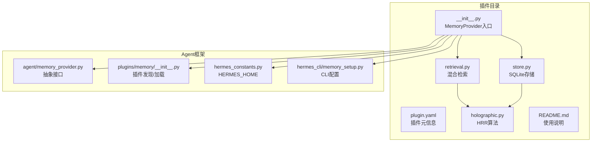
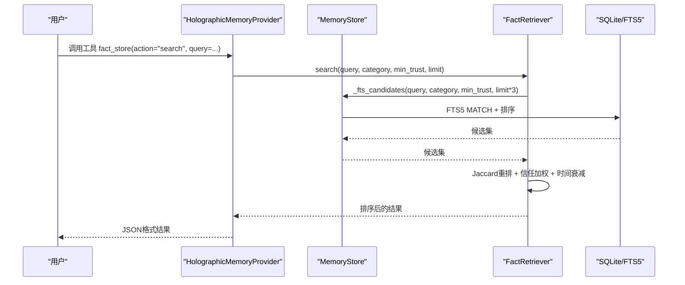
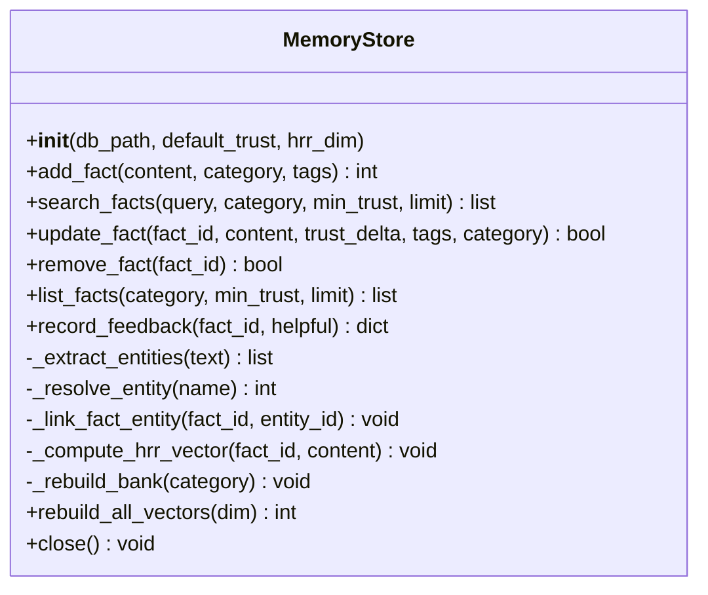
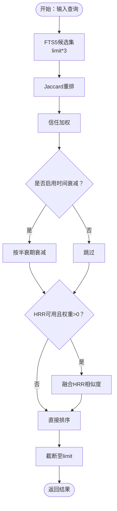
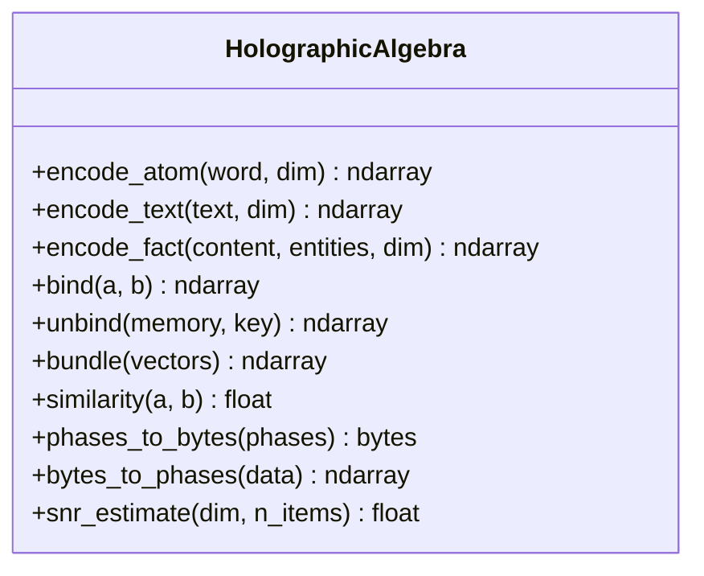
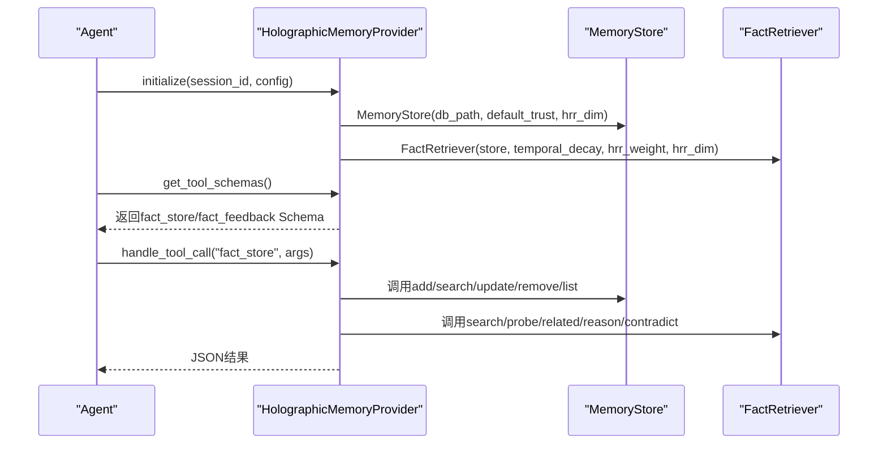
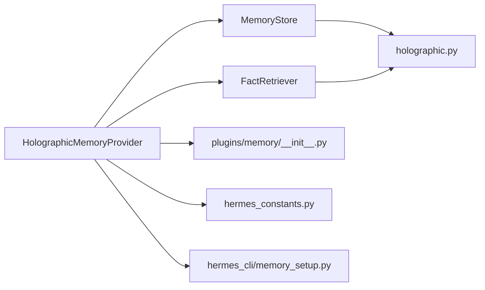

# 全息记忆插件

<cite>
**本文档引用的文件**
- [plugin.yaml](file://plugins/memory/holographic/plugin.yaml)
- [holographic.py](file://plugins/memory/holographic/holographic.py)
- [retrieval.py](file://plugins/memory/holographic/retrieval.py)
- [store.py](file://plugins/memory/holographic/store.py)
- [README.md](file://plugins/memory/holographic/README.md)
- [__init__.py](file://plugins/memory/holographic/__init__.py)
- [memory_provider.py](file://agent/memory_provider.py)
- [plugins/memory/__init__.py](file://plugins/memory/__init__.py)
- [hermes_constants.py](file://hermes_constants.py)
- [memory_setup.py](file://hermes_cli/memory_setup.py)
- [test_memory_provider.py](file://tests/agent/test_memory_provider.py)
</cite>

## 目录
1. [简介](#简介)
2. [项目结构](#项目结构)
3. [核心组件](#核心组件)
4. [架构总览](#架构总览)
5. [详细组件分析](#详细组件分析)
6. [依赖关系分析](#依赖关系分析)
7. [性能考量](#性能考量)
8. [故障排查指南](#故障排查指南)
9. [结论](#结论)
10. [附录](#附录)

## 简介
本文件面向Hermes Agent全息记忆插件（holographic）的技术文档，系统阐述其全息存储机制、分布式索引与智能检索算法，并结合实际源码解析各模块职责与交互关系。该插件通过SQLite本地存储事实（facts），内置FTS5全文检索，结合信任评分与Holographic Reduced Representations（HRR）向量空间进行组合式推理与检索，支持实体抽取、向量化、记忆银行（memory bank）聚合与会话末尾自动提取等能力。

## 项目结构
holographic插件位于plugins/memory/holographic目录，核心文件包括：
- 插件元信息：plugin.yaml
- 核心算法：holographic.py（HRR向量编码与运算）
- 存储层：store.py（SQLite事实表、实体表、FTS5触发器、记忆银行）
- 检索层：retrieval.py（关键词+BM25重排+信任加权+时间衰减+HRR语义检索）
- 插件入口与工具：__init__.py（注册MemoryProvider、工具schema、配置加载与保存）
- 使用说明：README.md
- 内存插件系统：plugins/memory/__init__.py（插件发现与加载）
- 常量与路径：hermes_constants.py（HERMES_HOME解析）
- CLI设置：hermes_cli/memory_setup.py（交互式配置）

图表来源
- [__init__.py:114-180](file://plugins/memory/holographic/__init__.py#L114-L180)
- [store.py:98-123](file://plugins/memory/holographic/store.py#L98-L123)
- [retrieval.py:22-47](file://plugins/memory/holographic/retrieval.py#L22-L47)
- [holographic.py:43-67](file://plugins/memory/holographic/holographic.py#L43-L67)
- [plugins/memory/__init__.py:122-156](file://plugins/memory/__init__.py#L122-L156)
- [hermes_constants.py:11-17](file://hermes_constants.py#L11-L17)
- [memory_provider.py](file://agent/memory_provider.py)

章节来源
- [plugin.yaml:1-6](file://plugins/memory/holographic/plugin.yaml#L1-L6)
- [README.md:1-37](file://plugins/memory/holographic/README.md#L1-L37)
- [plugins/memory/__init__.py:1-407](file://plugins/memory/__init__.py#L1-L407)

## 核心组件
- MemoryStore：SQLite事实存储、实体解析、FTS5索引、HRR向量计算与记忆银行重建
- FactRetriever：混合检索（FTS5候选→Jaccard重排→信任加权→可选时间衰减）、HRR组合式查询（probe/related/reason/contradict）
- Holographic（holographic.py）：相位向量编码、绑定/解绑、打包、相似度计算、SNR估计
- HolographicMemoryProvider（__init__.py）：实现MemoryProvider接口，注册工具schema，处理工具调用，会话结束钩子自动提取

章节来源
- [store.py:98-123](file://plugins/memory/holographic/store.py#L98-L123)
- [retrieval.py:22-47](file://plugins/memory/holographic/retrieval.py#L22-L47)
- [holographic.py:43-204](file://plugins/memory/holographic/holographic.py#L43-L204)
- [__init__.py:114-180](file://plugins/memory/holographic/__init__.py#L114-L180)

## 架构总览
全息记忆插件采用“存储层-检索层-算法层-插件接口”的分层设计：
- 存储层：SQLite事实表facts、实体表entities、关联表fact_entities、FTS5虚拟表facts_fts、记忆银行表memory_banks
- 检索层：先FTS5获取候选，再基于Jaccard相似度重排，结合信任评分与可选时间衰减，最后在有HRR可用时融合相位余弦相似度
- 算法层：HRR相位向量编码、绑定/解绑、打包、相似度计算；SNR估计用于容量预警
- 插件接口：实现MemoryProvider，暴露fact_store与fact_feedback工具，支持prefetch与会话结束自动提取

图表来源
- [__init__.py:258-344](file://plugins/memory/holographic/__init__.py#L258-L344)
- [retrieval.py:48-112](file://plugins/memory/holographic/retrieval.py#L48-L112)
- [store.py:187-236](file://plugins/memory/holographic/store.py#L187-L236)

## 详细组件分析

### 存储管理（store.py）
- 数据模型
  - facts：事实内容、分类、标签、信任评分、检索计数、创建/更新时间、HRR向量
  - entities：实体名称、类型、别名
  - fact_entities：事实-实体多对多关联
  - facts_fts：FTS5虚拟表，自动维护
  - memory_banks：按分类聚合的记忆银行（向量、维度、事实数量、更新时间）
- 初始化与迁移
  - 启动时启用WAL模式，创建表/索引/触发器；安全地为旧数据库添加hrr_vector列
- 核心操作
  - add_fact：去重插入、实体抽取与链接、HRR向量计算、重建对应分类的记忆银行
  - search_facts：FTS5全文检索，返回按rank与信任排序的结果，批量增加检索计数
  - update_fact：部分更新，支持内容变更后重新抽取实体、重建向量与记忆银行
  - remove_fact：删除事实及其关联，重建对应分类的记忆银行
  - list_facts：按信任降序浏览
  - record_feedback：记录用户反馈并异步调整信任评分
- 实体解析
  - 提取规则：多词大写短语、引号包裹术语、AKA模式
  - 解析逻辑：精确匹配→别名LIKE模糊匹配→不存在则创建
- HRR向量与记忆银行
  - 计算：对每个事实，提取其关联实体，构造content-role与entity-role的绑定向量，打包得到fact向量
  - 银行：按分类聚合所有事实向量，打包生成bank向量，记录维度与事实数量，同时做SNR估计

图表来源
- [store.py:98-575](file://plugins/memory/holographic/store.py#L98-L575)

章节来源
- [store.py:16-76](file://plugins/memory/holographic/store.py#L16-L76)
- [store.py:128-137](file://plugins/memory/holographic/store.py#L128-L137)
- [store.py:142-185](file://plugins/memory/holographic/store.py#L142-L185)
- [store.py:394-427](file://plugins/memory/holographic/store.py#L394-L427)
- [store.py:470-530](file://plugins/memory/holographic/store.py#L470-L530)

### 检索机制（retrieval.py）
- 混合检索管线
  - FTS5候选：MATCH查询，限制为limit*3，便于后续重排
  - Jaccard重排：基于查询词与事实内容/标签的词集交并比
  - 信任加权：最终得分=重排相关性×信任评分
  - 可选时间衰减：按半衰期指数衰减
  - HRR融合（可选）：当numpy可用且权重>0时，将相位余弦相似度归一化到[0,1]加入融合
- 组合式查询
  - probe：针对实体的结构性召回，先尝试按分类记忆银行，否则遍历事实向量进行解绑比较
  - related：发现与实体共享结构连接的事实（如共同出现的其他实体或内容重叠）
  - reason：多实体的向量空间交集（AND语义），要求每个实体在事实中都有结构性存在
  - contradict：基于实体重叠与内容向量相似度的潜在矛盾检测，输出矛盾分数与共享实体
- 辅助函数
  - _fts_candidates：构建FTS5查询，规范化rank到[0,1]
  - _tokenize/_jaccard_similarity：简单分词与Jaccard相似度
  - _temporal_decay：按半衰期计算时间衰减因子

图表来源
- [retrieval.py:48-112](file://plugins/memory/holographic/retrieval.py#L48-L112)
- [retrieval.py:481-542](file://plugins/memory/holographic/retrieval.py#L481-L542)

章节来源
- [retrieval.py:22-112](file://plugins/memory/holographic/retrieval.py#L22-L112)
- [retrieval.py:114-190](file://plugins/memory/holographic/retrieval.py#L114-L190)
- [retrieval.py:192-336](file://plugins/memory/holographic/retrieval.py#L192-L336)
- [retrieval.py:338-442](file://plugins/memory/holographic/retrieval.py#L338-L442)
- [retrieval.py:544-594](file://plugins/memory/holographic/retrieval.py#L544-L594)

### 全息算法（holographic.py）
- 编码与运算
  - encode_atom：基于SHA-256的确定性相位向量生成，跨进程/机器一致
  - encode_text/encode_fact：词袋打包、角色绑定（content/entity role），形成可组合的复合向量
  - bind/unbind：相位向量的卷积（相加模2π）与相关（相减模2π），实现绑定与解绑
  - bundle：复指数平均的圆周均值打包，近似正交叠加
  - similarity：相位余弦相似度，范围[-1,1]
- 序列化
  - phases_to_bytes/bytes_to_phases：向量与字节互转，用于持久化存储
- 容量预警
  - snr_estimate：基于维度与条目数估算信噪比，接近阈值时发出警告

图表来源
- [holographic.py:43-204](file://plugins/memory/holographic/holographic.py#L43-L204)

章节来源
- [holographic.py:43-177](file://plugins/memory/holographic/holographic.py#L43-L177)
- [holographic.py:179-204](file://plugins/memory/holographic/holographic.py#L179-L204)

### 插件接口与工具（__init__.py）
- MemoryProvider实现
  - initialize：从配置加载db_path、default_trust、hrr_dim、hrr_weight、temporal_decay等，实例化MemoryStore与FactRetriever
  - system_prompt_block：根据事实总数动态生成系统提示
  - prefetch：预取前N个高可信度候选
  - get_tool_schemas/handle_tool_call：注册fact_store与fact_feedback工具，路由到对应处理器
  - on_session_end：若开启auto_extract，则在会话结束时自动提取偏好与决策类内容
  - on_memory_write：镜像内置记忆写入为事实
- 工具Schema
  - fact_store：支持add/search/probe/related/reason/contradict/update/remove/list
  - fact_feedback：帮助/无帮助反馈，训练信任评分

图表来源
- [__init__.py:117-180](file://plugins/memory/holographic/__init__.py#L117-L180)
- [__init__.py:226-355](file://plugins/memory/holographic/__init__.py#L226-L355)

章节来源
- [__init__.py:114-204](file://plugins/memory/holographic/__init__.py#L114-L204)
- [__init__.py:226-355](file://plugins/memory/holographic/__init__.py#L226-L355)

## 依赖关系分析
- 外部依赖
  - SQLite：内置，无需额外安装
  - NumPy：可选，用于HRR向量运算；不可用时检索器自动降低HRR权重，保持功能可用
- 内部依赖
  - MemoryStore依赖holographic.py进行向量编码与运算
  - FactRetriever依赖MemoryStore的数据库连接与FTS5查询
  - HolographicMemoryProvider依赖MemoryStore与FactRetriever，并实现MemoryProvider接口
- 插件系统
  - plugins/memory/__init__.py负责扫描与加载插件，优先级：内置插件 > 用户插件
  - hermes_constants.py提供HERMES_HOME解析，__init__.py与memory_setup.py据此定位配置文件

图表来源
- [__init__.py:25-28](file://plugins/memory/holographic/__init__.py#L25-L28)
- [store.py:11-14](file://plugins/memory/holographic/store.py#L11-L14)
- [retrieval.py:16-19](file://plugins/memory/holographic/retrieval.py#L16-L19)
- [plugins/memory/__init__.py:122-156](file://plugins/memory/__init__.py#L122-L156)
- [hermes_constants.py:11-17](file://hermes_constants.py#L11-L17)
- [memory_setup.py:15-15](file://hermes_cli/memory_setup.py#L15-L15)

章节来源
- [plugins/memory/__init__.py:1-407](file://plugins/memory/__init__.py#L1-L407)
- [hermes_constants.py:1-200](file://hermes_constants.py#L1-L200)

## 性能考量
- 存储与索引
  - WAL模式提升并发读写性能
  - FTS5虚拟表自动维护，减少手动同步开销
  - 为facts_trust、facts_category、entities_name建立索引，加速过滤与查找
- 检索效率
  - FTS5候选集扩大至limit*3，平衡召回与重排成本
  - Jaccard相似度计算轻量，适合大规模重排
  - HRR相似度仅在numpy可用且权重>0时启用，避免不必要的计算
- 向量容量
  - SNR估计在接近容量阈值时告警，建议增大维度或减少存储条目
- 并发与锁
  - MemoryStore内部使用线程锁保护数据库操作，避免竞态

[本节为通用性能讨论，不直接分析具体文件]

## 故障排查指南
- 插件不可用
  - 检查插件是否被正确发现与加载（内置优先于用户插件）
  - 确认配置文件中memory.provider指向holographic
- HRR相关问题
  - 若未安装NumPy，HRR功能降级，检索器自动调整权重；安装NumPy恢复完整功能
  - 检查SNR告警日志，必要时增大hrr_dim或清理历史事实
- FTS5查询异常
  - 恶意查询可能导致FTS5 MATCH失败，检索器已捕获并回退为空结果
- 配置问题
  - db_path需可写目录；HERMES_HOME解析错误会导致默认路径异常
  - 使用hermes memory setup交互式配置，或直接编辑config.yaml

章节来源
- [test_memory_provider.py:380-391](file://tests/agent/test_memory_provider.py#L380-L391)
- [holographic.py:38-40](file://plugins/memory/holographic/holographic.py#L38-L40)
- [retrieval.py:520-525](file://plugins/memory/holographic/retrieval.py#L520-L525)
- [hermes_constants.py:11-17](file://hermes_constants.py#L11-L17)

## 结论
holographic插件通过SQLite+FTS5提供稳定可靠的本地事实存储，结合HRR向量空间实现了组合式推理与语义检索，具备良好的扩展性与容错能力。其分层设计使存储、检索与算法相互解耦，既满足日常检索需求，又能在复杂查询场景下提供结构化推理能力。配合CLI配置与会话自动提取，能够无缝融入Hermes Agent工作流。

[本节为总结性内容，不直接分析具体文件]

## 附录

### 配置项说明（config.yaml under plugins.hermes-memory-store）
- db_path：SQLite数据库路径，默认位于$HERMES_HOME/memory_store.db
- auto_extract：会话结束时自动提取偏好与决策类内容
- default_trust：新事实默认信任评分
- min_trust_threshold：检索最小信任过滤阈值
- temporal_decay_half_life：时间衰减半衰期（天），0表示禁用
- hrr_dim：HRR向量维度
- hrr_weight：HRR相似度在混合检索中的权重（numpy不可用时自动降为0）

章节来源
- [README.md:20-30](file://plugins/memory/holographic/README.md#L20-L30)
- [__init__.py:147-155](file://plugins/memory/holographic/__init__.py#L147-L155)
- [__init__.py:170-179](file://plugins/memory/holographic/__init__.py#L170-L179)

### 使用场景
- 结构化知识管理：通过fact_store的add/search/update/remove/list进行CRUD
- 实体驱动检索：probe按实体召回所有相关事实，related发现结构邻接
- 组合式推理：reason同时约束多个实体的结构性存在
- 冲突检测：contradict识别潜在矛盾声明
- 信任训练：fact_feedback对使用过的事实进行帮助性评价，训练信任评分

章节来源
- [__init__.py:37-89](file://plugins/memory/holographic/__init__.py#L37-L89)
- [retrieval.py:114-190](file://plugins/memory/holographic/retrieval.py#L114-L190)
- [retrieval.py:192-336](file://plugins/memory/holographic/retrieval.py#L192-L336)
- [retrieval.py:338-442](file://plugins/memory/holographic/retrieval.py#L338-L442)

### 性能基准测试建议
- 测试环境
  - 不同hrr_dim（如512、1024、2048）对检索精度与速度的影响
  - 不同limit与min_trust阈值对召回与重排成本的影响
  - 有无HRR权重对混合检索耗时的影响
- 指标
  - P@K（前K命中率）、平均检索延迟、内存占用、FTS5查询次数
  - SNR变化趋势与容量预警触发频率
- 方法
  - 使用真实对话数据生成事实集，构造不同规模的测试集
  - 在相同硬件条件下重复实验，统计均值与方差

[本节为通用性能指导，不直接分析具体文件]