# 内存插件

<cite>
**本文引用的文件**
- [plugins/memory/__init__.py](file://plugins/memory/__init__.py)
- [plugins/memory/holographic/__init__.py](file://plugins/memory/holographic/__init__.py)
- [plugins/memory/honcho/__init__.py](file://plugins/memory/honcho/__init__.py)
- [plugins/memory/mem0/__init__.py](file://plugins/memory/mem0/__init__.py)
- [plugins/memory/openviking/__init__.py](file://plugins/memory/openviking/__init__.py)
- [plugins/memory/supermemory/__init__.py](file://plugins/memory/supermemory/__init__.py)
- [plugins/memory/byterover/__init__.py](file://plugins/memory/byterover/__init__.py)
- [plugins/memory/hindsight/__init__.py](file://plugins/memory/hindsight/__init__.py)
- [plugins/memory/retaindb/__init__.py](file://plugins/memory/retaindb/__init__.py)
</cite>

## 目录
1. [简介](#简介)
2. [项目结构](#项目结构)
3. [核心组件](#核心组件)
4. [架构总览](#架构总览)
5. [详细组件分析](#详细组件分析)
6. [依赖关系分析](#依赖关系分析)
7. [性能考量](#性能考量)
8. [故障排查指南](#故障排查指南)
9. [结论](#结论)
10. [附录](#附录)

## 简介
本文件系统性阐述 Hermes Agent 内存插件体系：涵盖插件发现与加载机制、生命周期管理、与核心记忆系统的集成方式，并对八类内存插件（holographic 全息记忆、honcho 协作记忆、mem0 无服务器记忆、openviking 企业级记忆、supermemory 增强记忆、byterover 字节级存储、hindsight 回溯记忆、retaindb 数据库存储）进行特性、配置、使用场景与性能特点的深度解析。文末提供配置示例与最佳实践建议。

## 项目结构
内存插件位于 plugins/memory 目录下，每个子目录代表一个独立的 MemoryProvider 插件，均通过统一的插件发现与加载框架接入系统。核心入口负责扫描内置与用户安装的插件目录，解析 plugin.yaml 获取描述信息，按名称优先级加载并注册到核心系统。

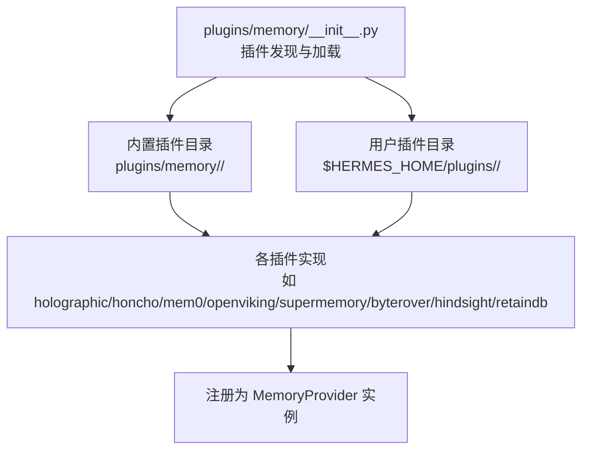

图示来源
- [plugins/memory/__init__.py:1-407](file://plugins/memory/__init__.py#L1-L407)

章节来源
- [plugins/memory/__init__.py:1-407](file://plugins/memory/__init__.py#L1-L407)

## 核心组件
- 插件发现与加载器
  - 扫描内置与用户插件目录，识别符合规范的 MemoryProvider 实现。
  - 优先级：内置插件优先于用户插件；同名冲突时内置覆盖。
  - 支持从 plugin.yaml 读取描述信息；支持 is_available 快速可用性检查。
- 插件注册上下文
  - 提供 register_memory_provider 接口，供各插件在加载后注册自身实例。
- 活动插件 CLI 命令扫描
  - 仅对当前配置启用的插件加载其 CLI 子命令定义，避免全局导入开销。

章节来源
- [plugins/memory/__init__.py:122-156](file://plugins/memory/__init__.py#L122-L156)
- [plugins/memory/__init__.py:159-182](file://plugins/memory/__init__.py#L159-L182)
- [plugins/memory/__init__.py:322-406](file://plugins/memory/__init__.py#L322-L406)

## 架构总览
内存插件遵循统一的 MemoryProvider 接口契约，核心流程包括：初始化（initialize）、预取（prefetch/queue_prefetch）、回合同步（sync_turn）、会话结束（on_session_end）、工具调用（get_tool_schemas/handle_tool_call）、内存写入镜像（on_memory_write）、关闭（shutdown）。部分插件还提供系统提示块（system_prompt_block）以引导模型行为。

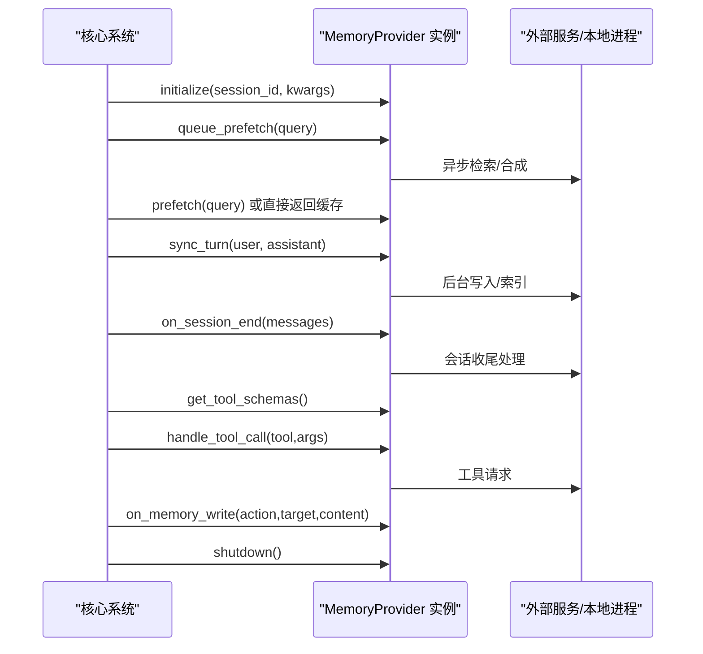

图示来源
- [plugins/memory/holographic/__init__.py:157-254](file://plugins/memory/holographic/__init__.py#L157-L254)
- [plugins/memory/honcho/__init__.py:264-402](file://plugins/memory/honcho/__init__.py#L264-L402)
- [plugins/memory/mem0/__init__.py:203-374](file://plugins/memory/mem0/__init__.py#L203-L374)
- [plugins/memory/openviking/__init__.py:312-471](file://plugins/memory/openviking/__init__.py#L312-L471)
- [plugins/memory/supermemory/__init__.py:480-644](file://plugins/memory/supermemory/__init__.py#L480-L644)
- [plugins/memory/byterover/__init__.py:199-329](file://plugins/memory/byterover/__init__.py#L199-L329)
- [plugins/memory/hindsight/__init__.py:469-772](file://plugins/memory/hindsight/__init__.py#L469-L772)
- [plugins/memory/retaindb/__init__.py:489-762](file://plugins/memory/retaindb/__init__.py#L489-L762)

## 详细组件分析

### Holographic 全息记忆
- 特性
  - 结构化事实存储、实体解析、信任评分、HRR 向量检索。
  - 提供 fact_store 与 fact_feedback 工具，支持 add/search/probe/reason/contradict/update/remove/list 等操作。
  - 支持会话结束自动抽取用户偏好与决策类内容。
- 配置
  - 通过 $HERMES_HOME/config.yaml 下的 plugins.hermes-memory-store 节点配置。
  - 关键项：db_path、auto_extract、default_trust、hrr_dim、hrr_weight、temporal_decay_half_life。
- 使用场景
  - 需要可解释、可反馈的事实型长期记忆；强调实体关联与组合推理。
- 性能特点
  - SQLite 本地存储，查询与向量计算受 hrr_dim 影响；默认最小信任阈值过滤结果。
- 生命周期与集成
  - initialize 创建 MemoryStore 与 FactRetriever；prefetch 返回检索结果；on_session_end 可触发自动抽取；on_memory_write 将内置记忆写入镜像为事实。

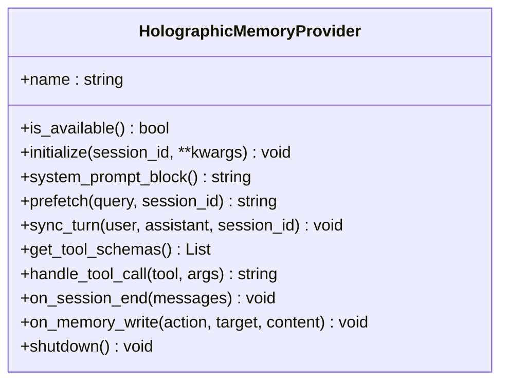

图示来源
- [plugins/memory/holographic/__init__.py:114-254](file://plugins/memory/holographic/__init__.py#L114-L254)

章节来源
- [plugins/memory/holographic/__init__.py:1-408](file://plugins/memory/holographic/__init__.py#L1-L408)

### Honcho 协作记忆
- 特性
  - AI 原生跨会话用户建模，支持对话式问答（dialectic）、语义搜索、同伴卡片、结论持久化。
  - 支持三种召回模式：context 注入、tools 仅工具、hybrid 混合。
  - 成本感知的注入频率、上下文刷新与多层推理深度控制。
- 配置
  - 通过 $HERMES_HOME/honcho.json 与环境变量（api_key/baseUrl）配置。
  - 支持 post_setup 完整设置向导。
- 使用场景
  - 需要持续的人类画像与情境理解；强调对话式推理与结论沉淀。
- 性能特点
  - 多线程后台预取与刷新；首次响应可能因队列预热而延迟；支持超时截断以控制上下文长度。

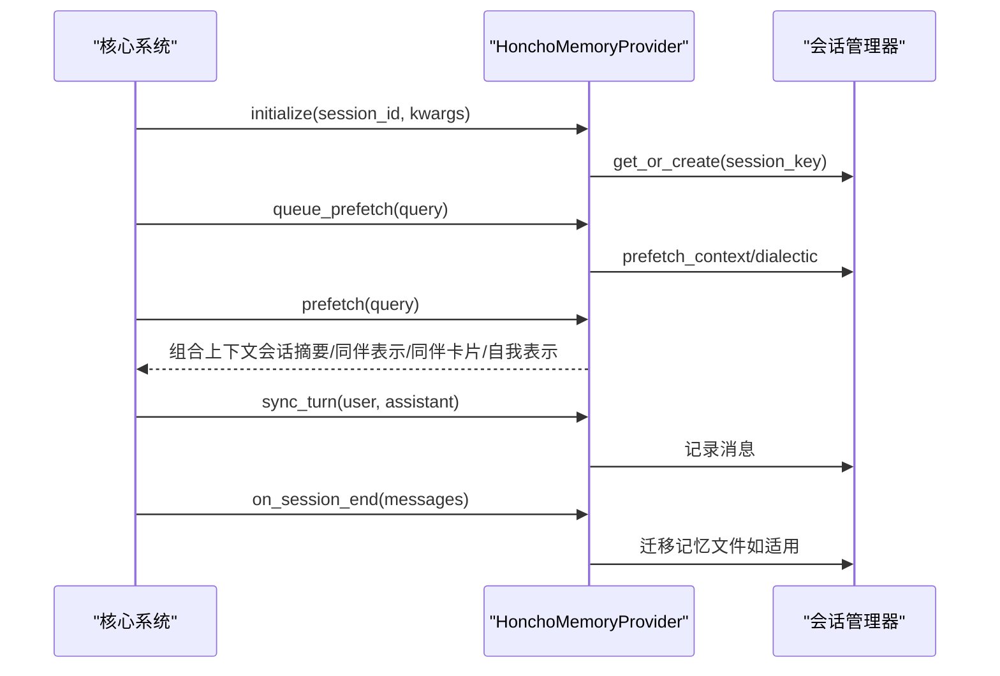

图示来源
- [plugins/memory/honcho/__init__.py:264-402](file://plugins/memory/honcho/__init__.py#L264-L402)
- [plugins/memory/honcho/__init__.py:506-612](file://plugins/memory/honcho/__init__.py#L506-L612)
- [plugins/memory/honcho/__init__.py:628-674](file://plugins/memory/honcho/__init__.py#L628-L674)

章节来源
- [plugins/memory/honcho/__init__.py:1-800](file://plugins/memory/honcho/__init__.py#L1-L800)

### Mem0 无服务器记忆
- 特性
  - 服务端事实抽取、重排（rerank）语义检索、自动去重。
  - 提供 mem0_profile/mem0_search/mem0_conclude 工具。
  - 电路断路器保护，连续失败后冷却暂停 API 调用。
- 配置
  - 通过环境变量（MEM0_API_KEY/MEM0_USER_ID/MEM0_AGENT_ID）或 $HERMES_HOME/mem0.json 配置。
- 使用场景
  - 需要高精度检索与平台化管理；强调“只存储事实”的明确性。
- 性能特点
  - 异步预取与同步回合写入；断路器避免雪崩；支持开关 rerank 控制精度与成本。

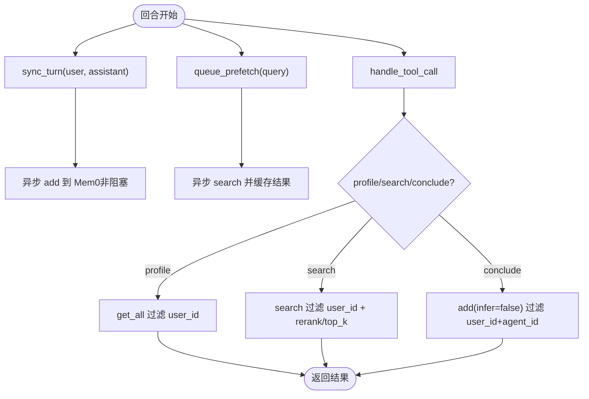

图示来源
- [plugins/memory/mem0/__init__.py:203-374](file://plugins/memory/mem0/__init__.py#L203-L374)

章节来源
- [plugins/memory/mem0/__init__.py:1-374](file://plugins/memory/mem0/__init__.py#L1-L374)

### OpenViking 企业级记忆
- 特性
  - 企业级上下文数据库，分层上下文加载（L0/L1/L2），语义搜索与层级目录检索，viking:// URI 文件系统浏览，资源入库。
  - 自动记忆抽取（6 类别），会话提交触发提取。
- 配置
  - 环境变量（OPENVIKING_ENDPOINT/OPENVIKING_API_KEY/ACCOUNT/USER/AGENT）。
- 使用场景
  - 企业知识库与工程上下文管理；需要结构化浏览与资源索引。
- 性能特点
  - 异步预取与同步回合写入；本地模式需 httpx；进程退出安全提交。

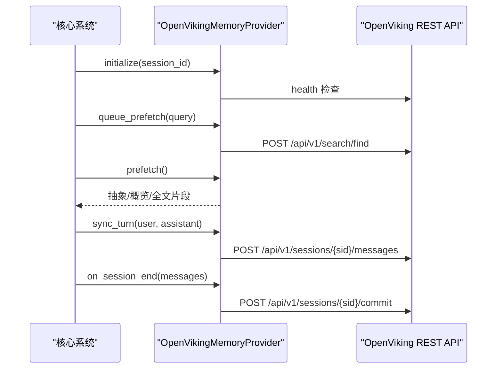

图示来源
- [plugins/memory/openviking/__init__.py:312-471](file://plugins/memory/openviking/__init__.py#L312-L471)
- [plugins/memory/openviking/__init__.py:448-496](file://plugins/memory/openviking/__init__.py#L448-L496)

章节来源
- [plugins/memory/openviking/__init__.py:1-675](file://plugins/memory/openviking/__init__.py#L1-L675)

### Supermemory 增强记忆
- 特性
  - 语义长记忆、档案检索、显式记忆工具、清理后的回合捕获、会话末尾对话摄入。
  - 多容器标签支持、实体上下文模板、搜索模式（hybrid/memories/documents）。
- 配置
  - 环境变量（SUPERMEMORY_API_KEY）与 $HERMES_HOME/supermemory.json；支持容器标签模板 {identity}。
- 使用场景
  - 需要精细记忆分类与跨容器检索；强调对话摄入与实体上下文。
- 性能特点
  - 异步写入与回合捕获；自动清洗上下文标记；支持自定义实体上下文长度限制。

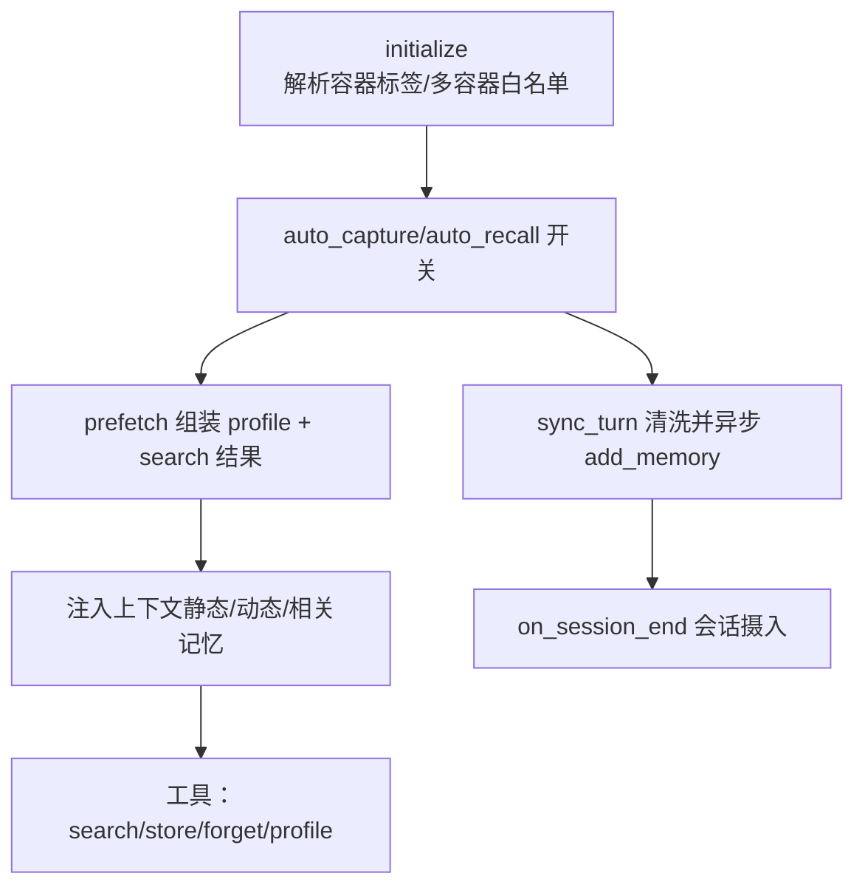

图示来源
- [plugins/memory/supermemory/__init__.py:480-644](file://plugins/memory/supermemory/__init__.py#L480-L644)
- [plugins/memory/supermemory/__init__.py:666-787](file://plugins/memory/supermemory/__init__.py#L666-L787)

章节来源
- [plugins/memory/supermemory/__init__.py:1-792](file://plugins/memory/supermemory/__init__.py#L1-L792)

### ByteRover 字节级存储
- 特性
  - 本地优先的持久化知识树，层次化上下文树，模糊文本→LLM 搜索两级检索。
  - 提供 brv_query/brv_curate/brv_status 工具；回合压缩前提取洞察。
- 配置
  - 通过环境变量（BRV_API_KEY）与本地工作目录（$HERMES_HOME/byterover）。
- 使用场景
  - 强本地化、可移植的知识树；需要结构化组织与跨会话复用。
- 性能特点
  - prefetch 同步执行确保首响应；curate 异步后台处理；最小长度过滤噪声。

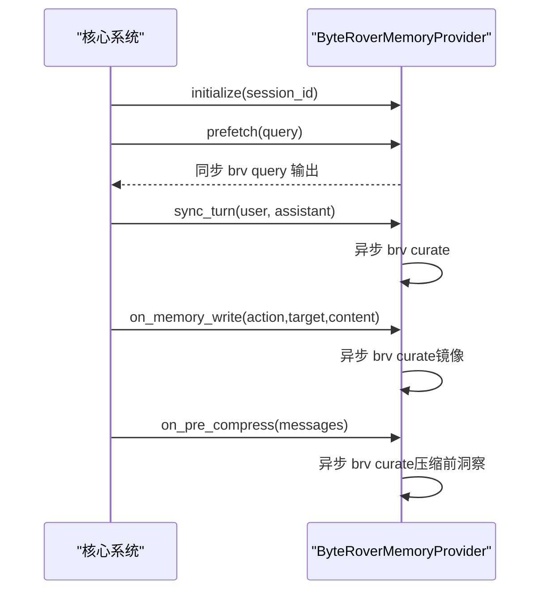

图示来源
- [plugins/memory/byterover/__init__.py:199-329](file://plugins/memory/byterover/__init__.py#L199-L329)
- [plugins/memory/byterover/__init__.py:282-312](file://plugins/memory/byterover/__init__.py#L282-L312)

章节来源
- [plugins/memory/byterover/__init__.py:1-384](file://plugins/memory/byterover/__init__.py#L1-L384)

### Hindsight 回溯记忆
- 特性
  - 知识图谱、实体解析、多策略检索；支持云（API key）与本地（embedded/external）模式。
  - 提供 hindsight_retain/hindsight_recall/hindsight_reflect 工具；事件循环复用避免泄漏。
- 配置
  - $HERMES_HOME/hindsight/config.json 或 ~/.hindsight/config.json，或环境变量（HINDSIGHT_*）。
  - post_setup 提供交互式设置向导。
- 使用场景
  - 需要跨会话知识图谱与多策略检索；强调推理合成与标签过滤。
- 性能特点
  - 异步保留与批量摄入；预算与输入长度控制；本地嵌入模式后台守护进程。

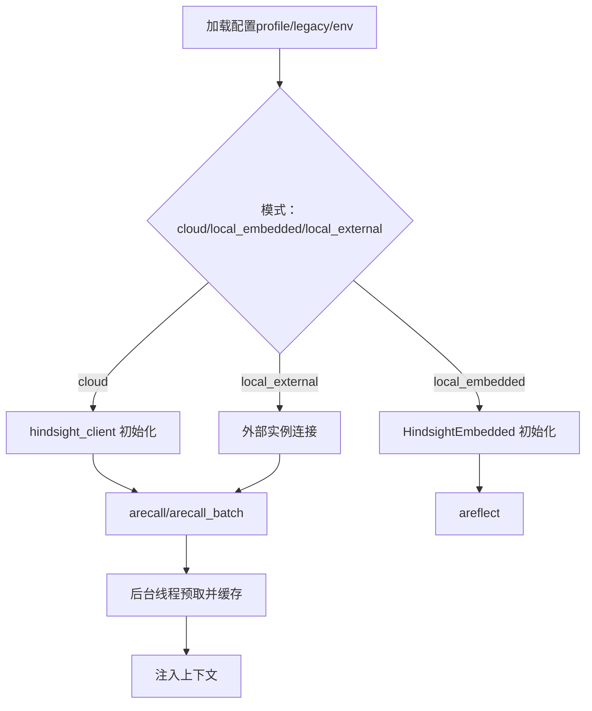

图示来源
- [plugins/memory/hindsight/__init__.py:469-772](file://plugins/memory/hindsight/__init__.py#L469-L772)

章节来源
- [plugins/memory/hindsight/__init__.py:1-884](file://plugins/memory/hindsight/__init__.py#L1-L884)

### RetainDB 数据库存储
- 特性
  - 云端 API 驱动的记忆与文件共享；持久化 SQLite 写队列（崩溃安全、异步摄入）。
  - 语义检索、用户档案、对话合成（dialectic）、代理自我模型、文件上传/列表/读取/摄入/删除。
- 配置
  - 环境变量（RETAINDB_API_KEY/RETAINDB_BASE_URL/RETAINDB_PROJECT）。
- 使用场景
  - 需要跨代理共享与文件型知识；强调写入可靠性与上下文合成。
- 性能特点
  - 异步写队列与重试；并发预取线程池；基于查询长度的推理级别自适应。

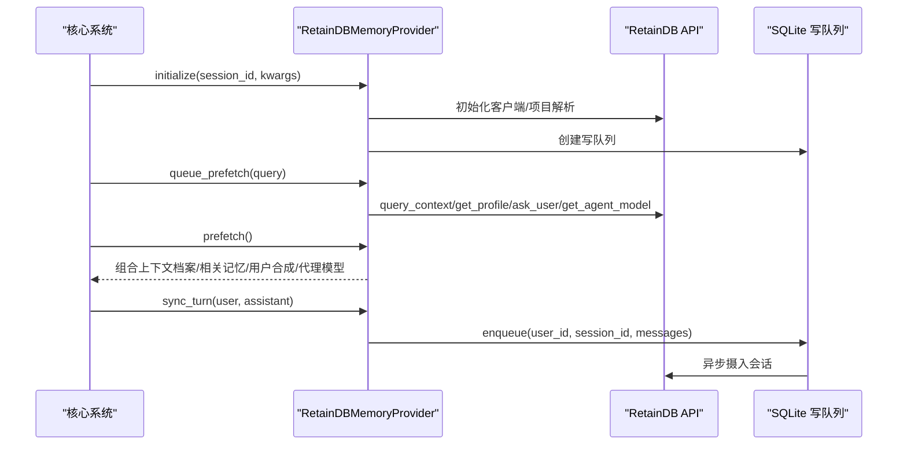

图示来源
- [plugins/memory/retaindb/__init__.py:489-762](file://plugins/memory/retaindb/__init__.py#L489-L762)

章节来源
- [plugins/memory/retaindb/__init__.py:1-767](file://plugins/memory/retaindb/__init__.py#L1-L767)

## 依赖关系分析
- 插件发现与加载
  - 依据目录命名与 __init__.py 中是否包含 register_memory_provider 或 MemoryProvider 子类判定。
  - 优先加载内置插件，再扫描用户插件；同名冲突内置优先。
- 插件内部依赖
  - 各插件根据自身能力选择外部 SDK 或本地二进制（如 brv、httpx、requests、supermemory、hindsight-client 等）。
- 与核心系统耦合
  - 严格实现 MemoryProvider 接口；通过 system_prompt_block 提示模型行为；通过工具接口暴露检索/存储能力。

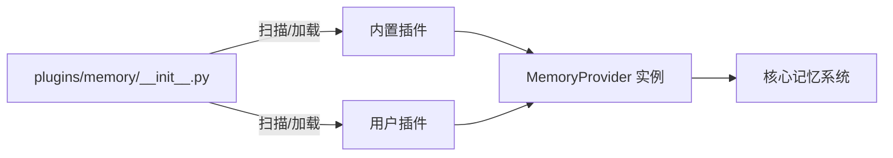

图示来源
- [plugins/memory/__init__.py:66-115](file://plugins/memory/__init__.py#L66-L115)
- [plugins/memory/__init__.py:184-284](file://plugins/memory/__init__.py#L184-L284)

章节来源
- [plugins/memory/__init__.py:1-407](file://plugins/memory/__init__.py#L1-L407)

## 性能考量
- I/O 与网络
  - 云 API 插件（Mem0/Hindsight/RetainDB/OpenViking）应关注超时与断路器策略，避免阻塞主流程。
  - 本地二进制（ByteRover）与本地嵌入（Hindsight local_embedded）需注意进程/守护启动成本与资源占用。
- 并发与线程
  - 多数插件采用后台线程执行预取与写入，避免阻塞主对话循环；注意线程数量与 join 超时。
- 上下文长度
  - Honcho/RetainDB/Supermemory 等支持上下文截断或预算控制，防止越界。
- 存储与可靠性
  - RetainDB 的 SQLite 写队列保证崩溃后重放；Mem0 的断路器避免雪崩；OpenViking 的 atexit 安全提交。

## 故障排查指南
- 插件不可用
  - 检查 is_available 返回值与依赖安装状态（如 httpx、mem0、supermemory、hindsight-client）。
- 配置错误
  - 确认配置文件路径与键名正确（honcho.json/mem0.json/supermemory.json/hindsight/config.json）；环境变量覆盖顺序。
- 网络/权限问题
  - 核对 API 密钥、基础 URL、账户/租户参数；检查防火墙与代理。
- 性能问题
  - 调整预取预算/限额；降低 rerank/top_k；启用/禁用 auto_recall/auto_retain；优化容器标签与检索类型。
- 日志定位
  - 查看插件日志输出与异常栈；关注断路器触发与重试记录。

章节来源
- [plugins/memory/mem0/__init__.py:180-202](file://plugins/memory/mem0/__init__.py#L180-L202)
- [plugins/memory/openviking/__init__.py:51-64](file://plugins/memory/openviking/__init__.py#L51-L64)
- [plugins/memory/retaindb/__init__.py:330-408](file://plugins/memory/retaindb/__init__.py#L330-L408)

## 结论
Hermes Agent 内存插件体系通过统一的发现与加载机制，将多种记忆能力以标准化接口接入核心系统。不同插件在检索策略、数据形态、部署方式与成本控制上各有侧重：从结构化事实（Holographic）、协作建模（Honcho）、平台化检索（Mem0/OpenViking）、增强语义（Supermemory）、本地知识树（ByteRover）、回溯知识图（Hindsight）到数据库驱动（RetainDB）。选择合适的插件组合与合理配置，可在准确性、成本与可维护性之间取得平衡。

## 附录
- 配置示例与最佳实践
  - Holographic
    - 在 $HERMES_HOME/config.yaml 中设置 hermes-memory-store 节点；开启 auto_extract 以自动抽取偏好与决策。
  - Honcho
    - 使用 hermes memory setup 或手动编辑 $HERMES_HOME/honcho.json；按需调整 recall_mode、注入频率与推理深度。
  - Mem0
    - 设置 MEM0_API_KEY；按需启用 rerank；利用断路器减少抖动。
  - OpenViking
    - 设置 OPENVIKING_ENDPOINT；如需认证设置 OPENVIKING_API_KEY；合理规划账户/用户/代理标识。
  - Supermemory
    - 设置 SUPERMEMORY_API_KEY；在 $HERMES_HOME/supermemory.json 中配置容器标签与实体上下文；启用多容器时限定白名单。
  - ByteRover
    - 安装 brv CLI；必要时设置 BRV_API_KEY；关注最小查询/输出长度阈值。
  - Hindsight
    - 选择 cloud/local_embedded/local_external 模式；按需配置 LLM 提供商与模型；合理设置预算与标签。
  - RetainDB
    - 设置 RETAINDB_API_KEY；可选 RETAINDB_BASE_URL/RETAINDB_PROJECT；利用写队列与文件工具提升可靠性与协作效率。