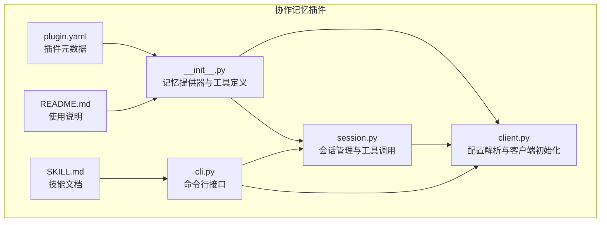
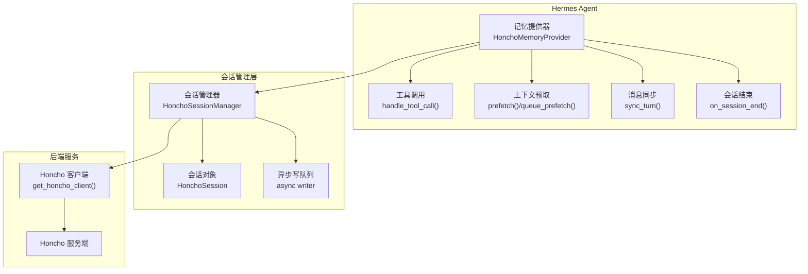
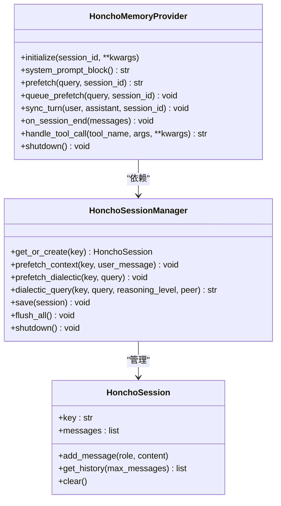
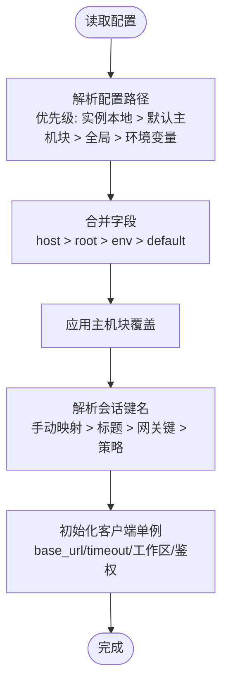
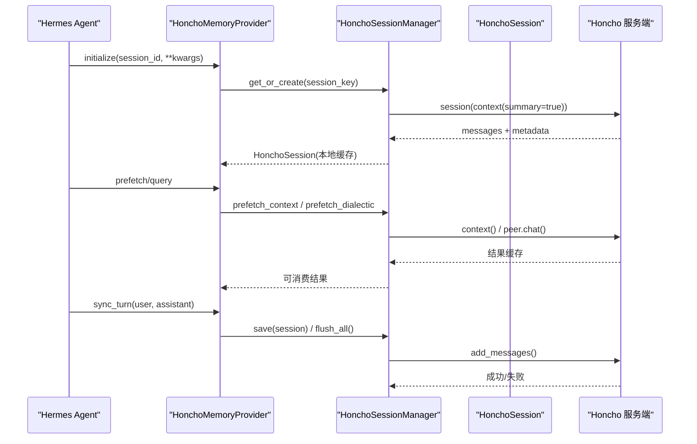
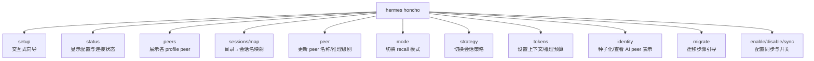
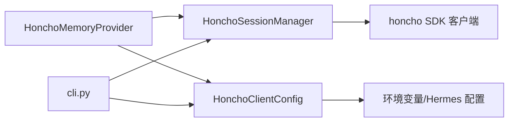

# 协作记忆插件

<cite>
**本文档引用的文件**
- [plugins/memory/honcho/__init__.py](file://plugins/memory/honcho/__init__.py)
- [plugins/memory/honcho/client.py](file://plugins/memory/honcho/client.py)
- [plugins/memory/honcho/session.py](file://plugins/memory/honcho/session.py)
- [plugins/memory/honcho/cli.py](file://plugins/memory/honcho/cli.py)
- [plugins/memory/honcho/plugin.yaml](file://plugins/memory/honcho/plugin.yaml)
- [plugins/memory/honcho/README.md](file://plugins/memory/honcho/README.md)
- [optional-skills/autonomous-ai-agents/honcho/SKILL.md](file://optional-skills/autonomous-ai-agents/honcho/SKILL.md)
- [tests/honcho_plugin/test_session.py](file://tests/honcho_plugin/test_session.py)
- [tests/honcho_plugin/test_cli.py](file://tests/honcho_plugin/test_cli.py)
</cite>

## 目录
1. [简介](#简介)
2. [项目结构](#项目结构)
3. [核心组件](#核心组件)
4. [架构总览](#架构总览)
5. [详细组件分析](#详细组件分析)
6. [依赖关系分析](#依赖关系分析)
7. [性能考虑](#性能考虑)
8. [故障排除指南](#故障排除指南)
9. [结论](#结论)
10. [附录](#附录)

## 简介
本文件为 Hermes Agent 协作记忆插件（基于 Honcho）的全面技术文档。该插件提供跨会话用户建模与对话记忆能力，支持自动上下文注入、多轮对话推理（dialectic）、语义检索、持久化结论等特性。文档围绕以下目标展开：  
- 解释 Honcho 协作记忆系统的设计理念与架构模式（分布式会话管理、团队协作机制）。  
- 深入说明 plugin.yaml 配置文件参数（服务器地址、认证配置、会话超时等）。  
- 详解 client.py 客户端实现（连接建立、请求发送、响应处理流程）。  
- 解释 session.py 会话管理功能（会话创建、状态同步、数据合并机制）。  
- 提供 cli.py 命令行接口说明（会话查询、成员管理、权限控制）。  
- 包含完整部署指南、配置示例与故障排除方法。

## 项目结构
协作记忆插件位于 plugins/memory/honcho 目录，核心文件包括：
- 插件入口与记忆提供器：__init__.py
- 客户端与配置解析：client.py
- 会话管理与工具封装：session.py
- 命令行接口：cli.py
- 插件元数据：plugin.yaml
- 使用说明与参考：README.md、SKILL.md

**图表来源**
- [plugins/memory/honcho/__init__.py:1-1055](file://plugins/memory/honcho/__init__.py#L1-L1055)
- [plugins/memory/honcho/client.py:1-677](file://plugins/memory/honcho/client.py#L1-L677)
- [plugins/memory/honcho/session.py:1-1256](file://plugins/memory/honcho/session.py#L1-L1256)
- [plugins/memory/honcho/cli.py:1-1399](file://plugins/memory/honcho/cli.py#L1-L1399)
- [plugins/memory/honcho/plugin.yaml:1-8](file://plugins/memory/honcho/plugin.yaml#L1-L8)
- [plugins/memory/honcho/README.md:1-329](file://plugins/memory/honcho/README.md#L1-L329)
- [optional-skills/autonomous-ai-agents/honcho/SKILL.md:1-429](file://optional-skills/autonomous-ai-agents/honcho/SKILL.md#L1-L429)

**章节来源**
- [plugins/memory/honcho/__init__.py:1-1055](file://plugins/memory/honcho/__init__.py#L1-L1055)
- [plugins/memory/honcho/client.py:1-677](file://plugins/memory/honcho/client.py#L1-L677)
- [plugins/memory/honcho/session.py:1-1256](file://plugins/memory/honcho/session.py#L1-L1256)
- [plugins/memory/honcho/cli.py:1-1399](file://plugins/memory/honcho/cli.py#L1-L1399)
- [plugins/memory/honcho/plugin.yaml:1-8](file://plugins/memory/honcho/plugin.yaml#L1-L8)
- [plugins/memory/honcho/README.md:1-329](file://plugins/memory/honcho/README.md#L1-L329)
- [optional-skills/autonomous-ai-agents/honcho/SKILL.md:1-429](file://optional-skills/autonomous-ai-agents/honcho/SKILL.md#L1-L429)

## 核心组件
- 记忆提供器（HonchoMemoryProvider）：实现 MemoryProvider 接口，负责会话初始化、上下文预取、工具调用、消息同步与会话结束清理。
- 客户端配置（HonchoClientConfig）：解析全局配置（$HERMES_HOME/honcho.json、~/.honcho/config.json、环境变量），生成客户端实例并决定会话键名与观察策略。
- 会话管理器（HonchoSessionManager）：维护本地会话缓存，与 Honcho 后端交互，执行上下文预取、dialectic 查询、结论写入与迁移。
- 命令行接口（cli.py）：提供 setup/status/sessions/map/peer/mode/strategy/tokens/identity/migrate 等子命令，用于配置与运维。
- 工具定义：提供 honcho_profile、honcho_search、honcho_reasoning、honcho_context、honcho_conclude 五个工具，按 recall_mode 决定是否可见。

**章节来源**
- [plugins/memory/honcho/__init__.py:186-1055](file://plugins/memory/honcho/__init__.py#L186-L1055)
- [plugins/memory/honcho/client.py:214-677](file://plugins/memory/honcho/client.py#L214-L677)
- [plugins/memory/honcho/session.py:68-1256](file://plugins/memory/honcho/session.py#L68-L1256)
- [plugins/memory/honcho/cli.py:1-1399](file://plugins/memory/honcho/cli.py#L1-L1399)

## 架构总览
协作记忆插件采用“本地缓存 + 异步写入 + 后端推理”的架构模式，结合多层上下文注入与多轮 dialectic 推理，实现跨会话的用户建模与智能上下文注入。

**图表来源**
- [plugins/memory/honcho/__init__.py:264-1055](file://plugins/memory/honcho/__init__.py#L264-L1055)
- [plugins/memory/honcho/session.py:68-452](file://plugins/memory/honcho/session.py#L68-L452)
- [plugins/memory/honcho/client.py:583-677](file://plugins/memory/honcho/client.py#L583-L677)

## 详细组件分析

### 记忆提供器（HonchoMemoryProvider）
- 初始化与懒加载：支持“工具优先”模式下的首次工具调用时初始化；支持“预热”模式在会话开始时预取上下文与 dialectic 补充。
- 上下文注入：根据 recall_mode 决定是否注入；通过 _truncate_to_budget 控制注入总量；支持 first-turn 或 every-turn 注入频率。
- 工具调用：按工具参数执行 peer card 获取/更新、语义搜索、会话上下文快照、dialectic 推理、结论写入/删除。
- 消息同步：按 write_frequency 将本地消息异步写入后端，支持 turn/session/N 轮次批量写入。
- 会话结束：确保挂起消息在会话结束时刷新。

**图表来源**
- [plugins/memory/honcho/__init__.py:186-1055](file://plugins/memory/honcho/__init__.py#L186-L1055)
- [plugins/memory/honcho/session.py:24-452](file://plugins/memory/honcho/session.py#L24-L452)

**章节来源**
- [plugins/memory/honcho/__init__.py:264-1055](file://plugins/memory/honcho/__init__.py#L264-L1055)

### 客户端配置（HonchoClientConfig）
- 配置来源优先级：$HERMES_HOME/honcho.json（实例本地）→ ~/.hermes/honcho.json（默认主机块共享）→ ~/.honcho/config.json（全局互操作）→ 环境变量。
- 关键字段：apiKey/baseUrl/environment/timeout、peerName/aiPeer/workspace、recallMode、observationMode/observation、writeFrequency、contextTokens、dialectic_*、message_max_chars、sessionStrategy/sessionPeerPrefix/sessions、init_on_session_start。
- 会话键名解析：支持手动映射、标题命令重命名、网关会话键、per-session/per-repo/per-directory/global 策略，并可选择在会话键前缀加上 peerName。
- 客户端单例：get_honcho_client 支持自托管 base_url 与超时覆盖，本地无鉴权场景自动跳过 API key。

**图表来源**
- [plugins/memory/honcho/client.py:310-578](file://plugins/memory/honcho/client.py#L310-L578)

**章节来源**
- [plugins/memory/honcho/client.py:214-578](file://plugins/memory/honcho/client.py#L214-L578)

### 会话管理（HonchoSessionManager）
- 本地缓存：以 session_key 为键缓存会话对象，避免重复创建；缓存 peer 与 session 对象。
- 观察策略：根据 granular observation 配置或 preset 设置 user/ai 的 observeMe/observeOthers；服务端配置变更会在会话初始化时同步回客户端。
- 上下文预取：后台线程预取 session.summary + peer_representation + peer_card，并缓存以便下一回合消费。
- Dialectic 补充：多轮 .chat() 推理，支持 pass 级 reasoning level 与信号强度判断提前终止。
- 结论与卡片：支持 peer card 更新、结论写入/删除、AI 自我表示获取。
- 迁移：支持将本地历史与记忆文件上传到后端作为文件附件，保留时间戳与来源元数据。

**图表来源**
- [plugins/memory/honcho/session.py:164-452](file://plugins/memory/honcho/session.py#L164-L452)
- [plugins/memory/honcho/__init__.py:506-922](file://plugins/memory/honcho/__init__.py#L506-L922)

**章节来源**
- [plugins/memory/honcho/session.py:68-1256](file://plugins/memory/honcho/session.py#L68-L1256)

### 命令行接口（cli.py）
- 子命令：setup/status/peers/sessions/map/peer/mode/strategy/tokens/identity/migrate/enable/disable/sync。
- 功能要点：
  - setup：交互式向导，支持云/本地部署、身份（peerName/aiPeer/workspace）、观察模式、写入频率、召回模式、上下文预算、dialectic cadence、会话策略等。
  - status：显示当前主机、启用状态、API key、工作区、会话键、会话策略、召回模式、上下文预算、dialectic cadence、观察开关、写入频率；并尝试连接后展示 peer 卡片与 AI 表示。
  - peers：展示各 profile 的 peer 身份。
  - sessions/map：列出/映射目录到会话名。
  - peer：查看或更新 peer 名称与 dialectic reasoning level。
  - mode/strategy/tokens：查看或设置 recall 模式、会话策略、上下文与 dialectic 预算。
  - identity：查看或从文件种子化 AI peer 的表示。
  - migrate：OpenClaw → Hermes + Honcho 的迁移步骤引导。
  - enable/disable/sync：对当前 profile 启用/禁用，或同步到所有现有 profile。

**图表来源**
- [plugins/memory/honcho/cli.py:1255-1399](file://plugins/memory/honcho/cli.py#L1255-L1399)

**章节来源**
- [plugins/memory/honcho/cli.py:1-1399](file://plugins/memory/honcho/cli.py#L1-L1399)

## 依赖关系分析
- 组件耦合：
  - HonchoMemoryProvider 依赖 HonchoSessionManager 与 HonchoClientConfig，负责上层调度与工具封装。
  - HonchoSessionManager 依赖 Honcho 客户端，负责与后端交互与本地缓存。
  - cli.py 依赖 client.py 与 session.py，用于运维与诊断。
- 外部依赖：
  - honcho-ai SDK：提供 Honcho 客户端与会话/peer API。
  - hermes_cli.config/profiles：用于读取/保存配置与活动 profile。
  - hermes_constants：获取 $HERMES_HOME 路径。

**图表来源**
- [plugins/memory/honcho/__init__.py:281-355](file://plugins/memory/honcho/__init__.py#L281-L355)
- [plugins/memory/honcho/client.py:310-492](file://plugins/memory/honcho/client.py#L310-L492)
- [plugins/memory/honcho/session.py:144-148](file://plugins/memory/honcho/session.py#L144-L148)
- [plugins/memory/honcho/cli.py:1-1399](file://plugins/memory/honcho/cli.py#L1-L1399)

**章节来源**
- [plugins/memory/honcho/__init__.py:281-355](file://plugins/memory/honcho/__init__.py#L281-L355)
- [plugins/memory/honcho/client.py:310-492](file://plugins/memory/honcho/client.py#L310-L492)
- [plugins/memory/honcho/session.py:144-148](file://plugins/memory/honcho/session.py#L144-L148)
- [plugins/memory/honcho/cli.py:1-1399](file://plugins/memory/honcho/cli.py#L1-L1399)

## 性能考虑
- 异步写入：write_frequency="async" 时使用后台队列，零阻塞、零 token 成本；turn/session/N 轮次写入可按成本控制需求调整。
- 预取与缓存：上下文与 dialectic 结果在后台线程预取并缓存，下一回合消费，避免每次请求阻塞。
- 预算控制：contextTokens 限制注入总量；dialecticMaxChars 限制注入长度；messageMaxChars 控制消息分片。
- cadence 与频率：contextCadence/dialecticCadence/injectionFrequency 降低 API 调用频次与成本。
- 信号强度短路：dialectic 多轮推理中，若首轮返回足够信号强度则提前终止后续轮次，节省成本。

[本节为通用指导，无需特定文件引用]

## 故障排除指南
- “未配置 Honcho”：运行 hermes honcho setup，确认 memory.provider 设置为 honcho，检查 API key/baseUrl 是否正确。
- “跨会话记忆未生效”：检查 writeFrequency 不是 session（仅退出时写入）；确认 saveMessages 为 true。
- “profile 未获得独立 peer”：创建 profile 时使用 --clone；对既有 profile 使用 hermes honcho sync。
- “仪表板观察设置未生效”：服务器端配置在会话初始化时同步，需重新开始会话。
- “消息被截断”：超过 messageMaxChars（默认 25k）的消息会被分片；检查工具输出或技能内容是否过大。
- “上下文注入过大”：降低 contextTokens 或减少 dialecticDepth；摘要优先被裁剪。
- “会话摘要缺失”：新会话且无历史时不会注入摘要，属预期行为。

**章节来源**
- [plugins/memory/honcho/README.md:386-408](file://plugins/memory/honcho/README.md#L386-L408)
- [optional-skills/autonomous-ai-agents/honcho/SKILL.md:386-408](file://optional-skills/autonomous-ai-agents/honcho/SKILL.md#L386-L408)

## 结论
协作记忆插件通过 Honcho 提供了面向多会话、多角色（用户/AI peer）的 AI 原生记忆体系。其架构以“本地缓存 + 异步写入 + 后端推理”为核心，结合两层上下文注入与多轮 dialectic 推理，既保证了成本可控，又实现了持续的用户建模与智能上下文增强。配合完善的 CLI 工具链与配置体系，用户可以灵活地进行部署、运维与优化。

[本节为总结性内容，无需特定文件引用]

## 附录

### plugin.yaml 参数说明
- name/version/description：插件标识与描述。
- pip_dependencies：运行所需 Python 包（honcho-ai）。
- hooks：生命周期钩子（如 on_session_end）。

**章节来源**
- [plugins/memory/honcho/plugin.yaml:1-8](file://plugins/memory/honcho/plugin.yaml#L1-L8)

### 配置文件关键参数（示例）
- apiKey/baseUrl/environment/timeout：认证与连接参数。
- peerName/aiPeer/workspace：身份与工作区。
- recallMode：hybrid/context/tools。
- observation/observationMode：观察策略。
- writeFrequency/saveMessages：写入行为。
- sessionStrategy/sessionPeerPrefix/sessions：会话策略与映射。
- dialectic_*：推理深度、动态级别、输入/输出上限。
- contextTokens/messageMaxChars：预算与限制。
- init_on_session_start：工具优先模式下的初始化时机。

**章节来源**
- [plugins/memory/honcho/README.md:116-232](file://plugins/memory/honcho/README.md#L116-L232)
- [plugins/memory/honcho/client.py:214-492](file://plugins/memory/honcho/client.py#L214-L492)

### 命令行常用操作
- hermes honcho setup：交互式配置（云/本地、身份、观察、召回、会话）。
- hermes honcho status：查看已解析配置、连接测试、peer 信息。
- hermes honcho tokens --context/--dialectic：调整上下文与推理预算。
- hermes honcho peer --user/--ai/--reasoning：更新 peer 名称与推理级别。
- hermes honcho strategy/mode：切换会话策略与召回模式。
- hermes honcho identity：种子化/查看 AI peer 表示。
- hermes honcho migrate：迁移步骤引导。

**章节来源**
- [plugins/memory/honcho/cli.py:1255-1399](file://plugins/memory/honcho/cli.py#L1255-L1399)
- [optional-skills/autonomous-ai-agents/honcho/SKILL.md:409-429](file://optional-skills/autonomous-ai-agents/honcho/SKILL.md#L409-L429)

### 测试参考
- 会话管理测试：验证会话初始化、预取、结论写入等流程。
- CLI 测试：验证 status 命令在配置错误时的行为。

**章节来源**
- [tests/honcho_plugin/test_session.py:547-575](file://tests/honcho_plugin/test_session.py#L547-L575)
- [tests/honcho_plugin/test_cli.py:1-31](file://tests/honcho_plugin/test_cli.py#L1-L31)