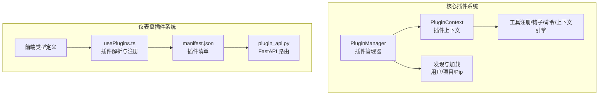
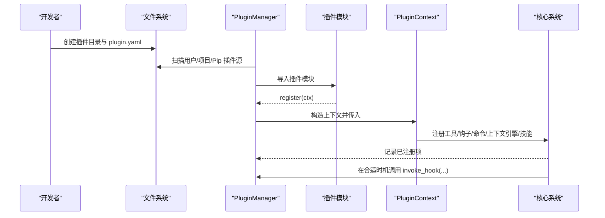
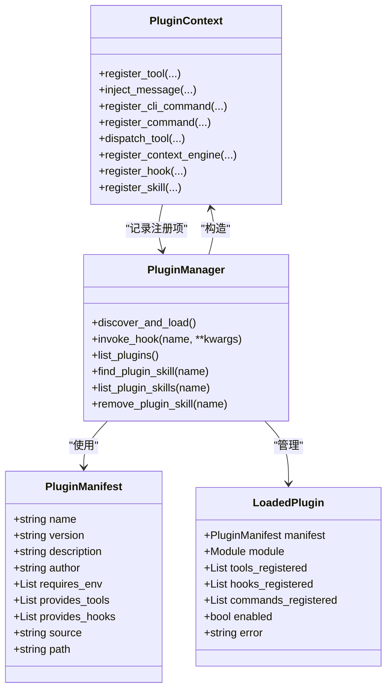
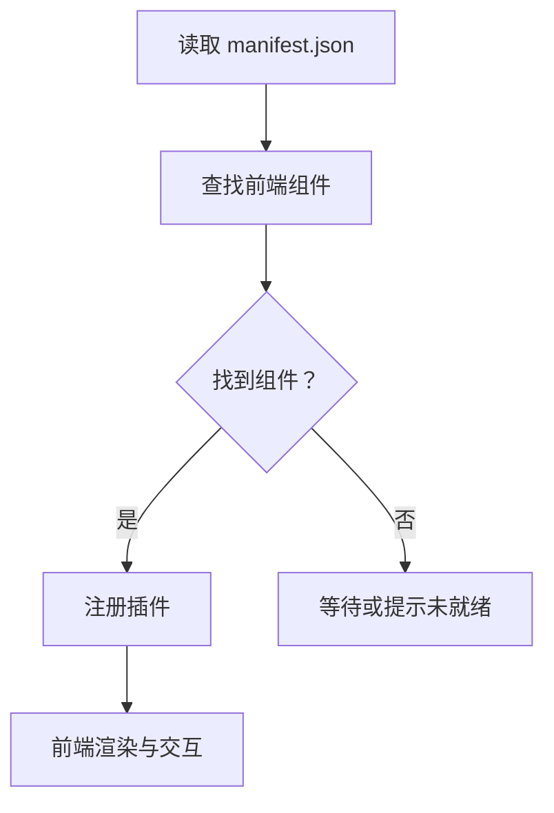
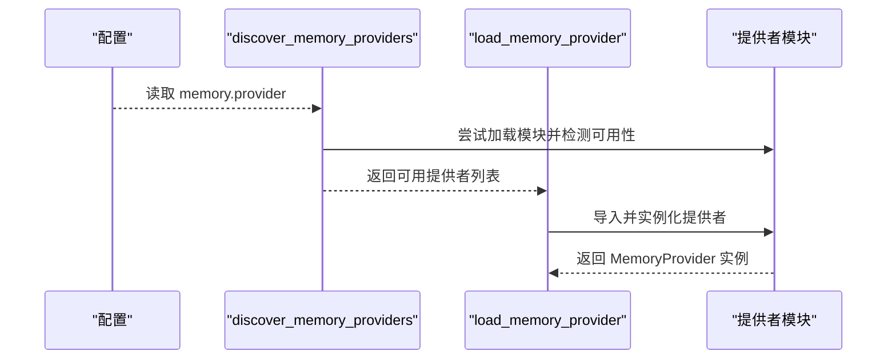
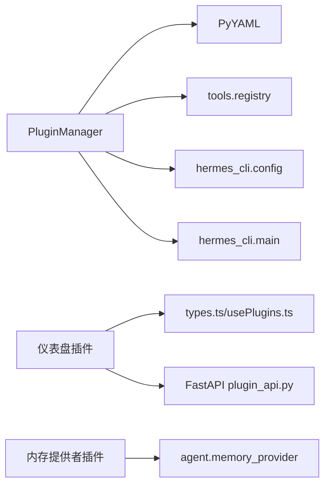

# 插件开发指南

<cite>
**本文档引用的文件**
- [hermes_cli/plugins.py](file://hermes_cli/plugins.py)
- [hermes_cli/plugins_cmd.py](file://hermes_cli/plugins_cmd.py)
- [plugins/example-dashboard/dashboard/plugin_api.py](file://plugins/example-dashboard/dashboard/plugin_api.py)
- [plugins/example-dashboard/dashboard/manifest.json](file://plugins/example-dashboard/dashboard/manifest.json)
- [plugins/memory/__init__.py](file://plugins/memory/__init__.py)
- [web/src/plugins/types.ts](file://web/src/plugins/types.ts)
- [web/src/plugins/usePlugins.ts](file://web/src/plugins/usePlugins.ts)
- [README.md](file://README.md)
</cite>

## 目录
1. [简介](#简介)
2. [项目结构](#项目结构)
3. [核心组件](#核心组件)
4. [架构总览](#架构总览)
5. [详细组件分析](#详细组件分析)
6. [依赖分析](#依赖分析)
7. [性能考虑](#性能考虑)
8. [故障排查指南](#故障排查指南)
9. [结论](#结论)
10. [附录：开发示例与模板](#附录开发示例与模板)

## 简介
本指南面向希望为 Hermes Agent 开发插件的开发者，覆盖从项目结构、接口定义、生命周期管理到注册机制、加载流程、运行时行为、调试与测试、性能优化等全链路实践。Hermes 的插件体系分为两类：
- 核心插件系统：通过 Manifest 清单与 register 上下文实现工具、钩子、命令、上下文引擎等能力注册。
- 仪表盘插件系统：基于 Web 前端的插件生态，支持在仪表盘中展示 UI 组件并通过 API 路由扩展后端能力。

## 项目结构
Hermes 插件相关的关键目录与文件如下：
- 核心插件系统
  - 插件管理器与上下文：[hermes_cli/plugins.py](file://hermes_cli/plugins.py)
  - 插件安装/更新/禁用/列表等 CLI：[hermes_cli/plugins_cmd.py](file://hermes_cli/plugins_cmd.py)
  - 内置内存提供者插件发现：[plugins/memory/__init__.py](file://plugins/memory/__init__.py)
- 仪表盘插件系统
  - 示例仪表盘插件 API：[plugins/example-dashboard/dashboard/plugin_api.py](file://plugins/example-dashboard/dashboard/plugin_api.py)
  - 示例仪表盘插件清单：[plugins/example-dashboard/dashboard/manifest.json](file://plugins/example-dashboard/dashboard/manifest.json)
  - 前端类型与注册逻辑：[web/src/plugins/types.ts](file://web/src/plugins/types.ts)、[web/src/plugins/usePlugins.ts](file://web/src/plugins/usePlugins.ts)

**图表来源**
- [hermes_cli/plugins.py:396-740](file://hermes_cli/plugins.py#L396-L740)
- [hermes_cli/plugins_cmd.py:284-595](file://hermes_cli/plugins_cmd.py#L284-L595)
- [plugins/example-dashboard/dashboard/manifest.json:1-14](file://plugins/example-dashboard/dashboard/manifest.json#L1-L14)
- [plugins/example-dashboard/dashboard/plugin_api.py:1-15](file://plugins/example-dashboard/dashboard/plugin_api.py#L1-L15)
- [web/src/plugins/types.ts:1-22](file://web/src/plugins/types.ts#L1-L22)
- [web/src/plugins/usePlugins.ts:67-90](file://web/src/plugins/usePlugins.ts#L67-L90)

**章节来源**
- [hermes_cli/plugins.py:1-120](file://hermes_cli/plugins.py#L1-L120)
- [hermes_cli/plugins_cmd.py:1-120](file://hermes_cli/plugins_cmd.py#L1-L120)
- [plugins/example-dashboard/dashboard/manifest.json:1-14](file://plugins/example-dashboard/dashboard/manifest.json#L1-L14)
- [plugins/example-dashboard/dashboard/plugin_api.py:1-15](file://plugins/example-dashboard/dashboard/plugin_api.py#L1-L15)
- [web/src/plugins/types.ts:1-22](file://web/src/plugins/types.ts#L1-L22)
- [web/src/plugins/usePlugins.ts:67-90](file://web/src/plugins/usePlugins.ts#L67-L90)

## 核心组件
- 插件管理器（PluginManager）
  - 负责扫描与加载三类插件来源：用户插件、项目插件、Pip 入口点插件；维护已加载插件状态、钩子回调集合、工具/命令/技能注册表。
- 插件上下文（PluginContext）
  - 向插件暴露注册接口：工具注册、消息注入、CLI 命令注册、Slash 命令注册、工具分发、上下文引擎注册、生命周期钩子注册、插件技能注册。
- 生命周期钩子（VALID_HOOKS）
  - 支持 pre_tool_call、post_tool_call、pre_llm_call、post_llm_call、pre_api_request、post_api_request、on_session_start、on_session_end、on_session_finalize、on_session_reset。
- 仪表盘插件清单（manifest.json）
  - 定义插件名称、标签、描述、图标、版本、标签页路径与位置、入口文件、是否包含 API 等元数据。
- 仪表盘插件 API（plugin_api.py）
  - 使用 FastAPI 提供路由，挂载于 /api/plugins/{name}/ 下，作为插件后端能力扩展点。
- 内存提供者插件发现
  - 扫描内置与用户安装的内存提供者插件，支持按名称加载与 CLI 命令注册。

**章节来源**
- [hermes_cli/plugins.py:54-65](file://hermes_cli/plugins.py#L54-L65)
- [hermes_cli/plugins.py:124-390](file://hermes_cli/plugins.py#L124-L390)
- [hermes_cli/plugins.py:396-740](file://hermes_cli/plugins.py#L396-L740)
- [plugins/example-dashboard/dashboard/manifest.json:1-14](file://plugins/example-dashboard/dashboard/manifest.json#L1-L14)
- [plugins/example-dashboard/dashboard/plugin_api.py:1-15](file://plugins/example-dashboard/dashboard/plugin_api.py#L1-L15)
- [plugins/memory/__init__.py:1-120](file://plugins/memory/__init__.py#L1-L120)

## 架构总览
Hermes 插件系统采用“发现—加载—注册—调用”的流水线式架构。核心流程：
- 发现阶段：扫描用户目录、项目目录、Pip 入口点，读取 plugin.yaml 清单。
- 加载阶段：导入模块并调用 register(ctx)，在上下文中完成工具/钩子/命令/上下文引擎/技能注册。
- 运行阶段：在代理循环中通过 invoke_hook 触发生命周期钩子；通过工具注册表执行工具；通过插件技能系统加载插件内技能。
- 仪表盘插件：前端根据 manifest 解析插件组件，后端通过 FastAPI 暴露 API 路由。

**图表来源**
- [hermes_cli/plugins.py:415-578](file://hermes_cli/plugins.py#L415-L578)
- [hermes_cli/plugins.py:528-578](file://hermes_cli/plugins.py#L528-L578)
- [hermes_cli/plugins.py:632-666](file://hermes_cli/plugins.py#L632-L666)

**章节来源**
- [hermes_cli/plugins.py:415-578](file://hermes_cli/plugins.py#L415-L578)
- [hermes_cli/plugins.py:632-666](file://hermes_cli/plugins.py#L632-L666)

## 详细组件分析

### 核心插件系统（Python）
- 插件清单（PluginManifest）
  - 字段：name、version、description、author、requires_env、provides_tools、provides_hooks、source、path。
- 已加载插件（LoadedPlugin）
  - 字段：manifest、module、tools_registered、hooks_registered、commands_registered、enabled、error。
- 插件上下文（PluginContext）
  - 工具注册：register_tool(...)，委托至全局工具注册表。
  - 消息注入：inject_message(...)，支持在空闲或运行中注入消息。
  - CLI 命令注册：register_cli_command(...)，注册 hermes 子命令。
  - Slash 命令注册：register_command(...)，注册会话内 / 命令。
  - 工具分发：dispatch_tool(...)，通过注册表调度工具。
  - 上下文引擎注册：register_context_engine(...)，替换内置压缩器。
  - 钩子注册：register_hook(...)，注册生命周期钩子。
  - 插件技能注册：register_skill(...)，注册插件内可显式加载的技能。
- 插件管理器（PluginManager）
  - discover_and_load：扫描三类来源并加载。
  - _scan_directory/_scan_entry_points：读取清单与入口点。
  - _load_plugin/_load_directory_module/_load_entrypoint_module：导入模块并调用 register。
  - invoke_hook：安全调用所有回调，收集非 None 返回值。
  - 列表与查询：list_plugins、find_plugin_skill、list_plugin_skills、remove_plugin_skill。
- CLI 插件管理（hermes plugins）
  - install/update/remove/list/enable/disable/toggle 等命令。
  - 交互式选择与配置内存提供者、上下文引擎。

**图表来源**
- [hermes_cli/plugins.py:92-118](file://hermes_cli/plugins.py#L92-L118)
- [hermes_cli/plugins.py:124-390](file://hermes_cli/plugins.py#L124-L390)
- [hermes_cli/plugins.py:396-740](file://hermes_cli/plugins.py#L396-L740)

**章节来源**
- [hermes_cli/plugins.py:92-118](file://hermes_cli/plugins.py#L92-L118)
- [hermes_cli/plugins.py:124-390](file://hermes_cli/plugins.py#L124-L390)
- [hermes_cli/plugins.py:396-740](file://hermes_cli/plugins.py#L396-L740)

### 仪表盘插件系统（Web）
- 清单（manifest.json）
  - 字段：name、label、description、icon、version、tab（path、position）、entry、has_api、source。
- API 路由（plugin_api.py）
  - 使用 FastAPI 定义路由，挂载于 /api/plugins/{name}/。
- 前端类型与注册（types.ts、usePlugins.ts）
  - 类型定义插件清单与已注册插件；usePlugins.ts 监听插件注册事件，解析清单并绑定组件。

**图表来源**
- [plugins/example-dashboard/dashboard/manifest.json:1-14](file://plugins/example-dashboard/dashboard/manifest.json#L1-L14)
- [plugins/example-dashboard/dashboard/plugin_api.py:1-15](file://plugins/example-dashboard/dashboard/plugin_api.py#L1-L15)
- [web/src/plugins/types.ts:1-22](file://web/src/plugins/types.ts#L1-L22)
- [web/src/plugins/usePlugins.ts:67-90](file://web/src/plugins/usePlugins.ts#L67-L90)

**章节来源**
- [plugins/example-dashboard/dashboard/manifest.json:1-14](file://plugins/example-dashboard/dashboard/manifest.json#L1-L14)
- [plugins/example-dashboard/dashboard/plugin_api.py:1-15](file://plugins/example-dashboard/dashboard/plugin_api.py#L1-L15)
- [web/src/plugins/types.ts:1-22](file://web/src/plugins/types.ts#L1-L22)
- [web/src/plugins/usePlugins.ts:67-90](file://web/src/plugins/usePlugins.ts#L67-L90)

### 内存提供者插件发现
- discover_memory_providers：扫描内置与用户安装目录，读取 plugin.yaml 获取描述，快速检测可用性。
- load_memory_provider：按名称加载具体提供者实例。
- _load_provider_from_dir：支持 register(ctx) 与直接类实例化两种模式。
- discover_plugin_cli_commands：仅对当前激活的内存提供者加载 CLI 子命令。

**图表来源**
- [plugins/memory/__init__.py:122-182](file://plugins/memory/__init__.py#L122-L182)
- [plugins/memory/__init__.py:184-284](file://plugins/memory/__init__.py#L184-L284)
- [plugins/memory/__init__.py:322-406](file://plugins/memory/__init__.py#L322-L406)

**章节来源**
- [plugins/memory/__init__.py:1-120](file://plugins/memory/__init__.py#L1-L120)
- [plugins/memory/__init__.py:122-182](file://plugins/memory/__init__.py#L122-L182)
- [plugins/memory/__init__.py:184-284](file://plugins/memory/__init__.py#L184-L284)
- [plugins/memory/__init__.py:322-406](file://plugins/memory/__init__.py#L322-L406)

## 依赖分析
- 插件管理器依赖
  - 工具注册表：通过 PluginContext.register_tool(...) 委托至 tools.registry。
  - 配置系统：读取禁用列表、环境变量、CLI 引用。
  - YAML 解析：读取 plugin.yaml 清单。
- 仪表盘插件依赖
  - 前端类型与注册逻辑依赖清单字段；后端 API 依赖 FastAPI。
- 内存提供者插件依赖
  - agent.memory_provider.MemoryProvider 抽象基类；按名称优先级加载。

**图表来源**
- [hermes_cli/plugins.py:40-47](file://hermes_cli/plugins.py#L40-L47)
- [hermes_cli/plugins.py:146-158](file://hermes_cli/plugins.py#L146-L158)
- [plugins/example-dashboard/dashboard/plugin_api.py:6-8](file://plugins/example-dashboard/dashboard/plugin_api.py#L6-L8)
- [plugins/memory/__init__.py:274-284](file://plugins/memory/__init__.py#L274-L284)

**章节来源**
- [hermes_cli/plugins.py:40-47](file://hermes_cli/plugins.py#L40-L47)
- [hermes_cli/plugins.py:146-158](file://hermes_cli/plugins.py#L146-L158)
- [plugins/example-dashboard/dashboard/plugin_api.py:6-8](file://plugins/example-dashboard/dashboard/plugin_api.py#L6-L8)
- [plugins/memory/__init__.py:274-284](file://plugins/memory/__init__.py#L274-L284)

## 性能考虑
- 钩子调用隔离：每个回调独立 try/except，避免单个插件异常影响核心循环。
- 工具注册去重：PluginContext 在注册时记录插件专属工具/钩子/命令，减少重复注册开销。
- 仪表盘插件懒加载：前端监听插件注册事件，仅在组件可用时解析与注册。
- 内存提供者快速可用性检查：先尝试加载并调用 is_available()，降低无效加载概率。
- 环境变量与清单解析：仅在必要时读取 YAML，避免不必要的 IO。

[本节为通用指导，无需特定文件引用]

## 故障排查指南
- 插件未被发现
  - 检查 plugin.yaml 是否存在且格式正确；确认目录名与清单 name 一致。
  - 用户插件位于 ~/.hermes/plugins/<name>/；项目插件需启用环境变量开关。
- 插件加载失败
  - 查看错误信息（LoadedPlugin.error），常见原因：缺少 register() 函数、__init__.py 缺失、入口点未找到。
- 钩子不生效
  - 确认钩子名称在 VALID_HOOKS 中；检查回调签名与返回值；注意 invoke_hook 对异常的吞吐处理。
- 仪表盘插件未显示
  - 检查 manifest.json 字段（name、entry、tab、has_api）；确认前端组件名称与清单匹配；查看 usePlugins.ts 的解析日志。
- 内存提供者不可用
  - 使用 discover_memory_providers() 检查可用性；确认配置 memory.provider 设置正确；查看 is_available() 返回值。

**章节来源**
- [hermes_cli/plugins.py:528-578](file://hermes_cli/plugins.py#L528-L578)
- [hermes_cli/plugins.py:632-666](file://hermes_cli/plugins.py#L632-L666)
- [plugins/example-dashboard/dashboard/manifest.json:1-14](file://plugins/example-dashboard/dashboard/manifest.json#L1-L14)
- [web/src/plugins/usePlugins.ts:67-90](file://web/src/plugins/usePlugins.ts#L67-L90)
- [plugins/memory/__init__.py:122-156](file://plugins/memory/__init__.py#L122-L156)

## 结论
Hermes 插件体系以清晰的清单与上下文为核心，提供了强大的工具、钩子、命令与上下文引擎扩展能力；同时通过仪表盘插件系统实现了前后端协同的可视化扩展。遵循本文档的结构规范、生命周期管理与最佳实践，可高效构建稳定、可维护的插件。

[本节为总结，无需特定文件引用]

## 附录：开发示例与模板
- 插件目录结构建议
  - plugin.yaml：必须；包含 name、version、description、author、requires_env、provides_tools、provides_hooks。
  - __init__.py：必须；包含 register(ctx) 函数。
  - 可选：plugin_api.py（仪表盘插件后端 API）、SKILL.md（插件技能文档）、config.yaml.example（示例配置）。
- 快速开始步骤
  - 在 ~/.hermes/plugins/<your-plugin>/ 下创建上述文件。
  - 在 register(ctx) 中调用 ctx.register_tool/ctx.register_hook/ctx.register_command/ctx.register_context_engine/ctx.register_skill 完成注册。
  - 重启网关或重新启动会话以使插件生效。
- 仪表盘插件模板
  - 清单字段：name、label、description、icon、version、tab（path、position）、entry（前端打包入口）、api（后端 API 文件）。
  - 后端 API：使用 FastAPI 定义路由，挂载于 /api/plugins/{name}/。
  - 前端：确保组件名称与清单一致，usePlugins.ts 会自动解析并注册。
- 内存提供者插件模板
  - 目录结构：plugins/memory/<provider>/，包含 __init__.py（实现 MemoryProvider 或 register(ctx)）。
  - 清单：plugin.yaml（可选）。
  - 配置：在 config.yaml 中设置 memory.provider 为你的提供者名称。

**章节来源**
- [hermes_cli/plugins_cmd.py:284-396](file://hermes_cli/plugins_cmd.py#L284-L396)
- [plugins/example-dashboard/dashboard/manifest.json:1-14](file://plugins/example-dashboard/dashboard/manifest.json#L1-L14)
- [plugins/example-dashboard/dashboard/plugin_api.py:1-15](file://plugins/example-dashboard/dashboard/plugin_api.py#L1-L15)
- [plugins/memory/__init__.py:1-20](file://plugins/memory/__init__.py#L1-L20)