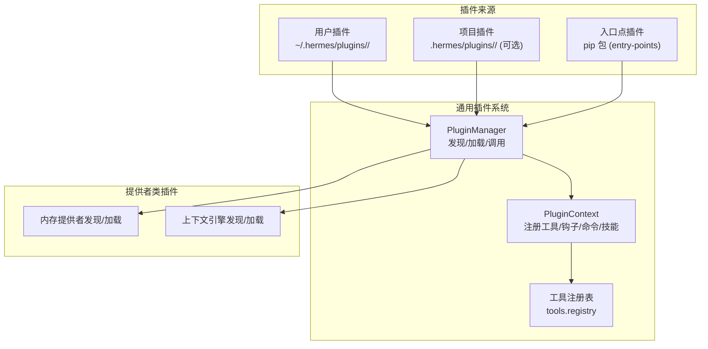
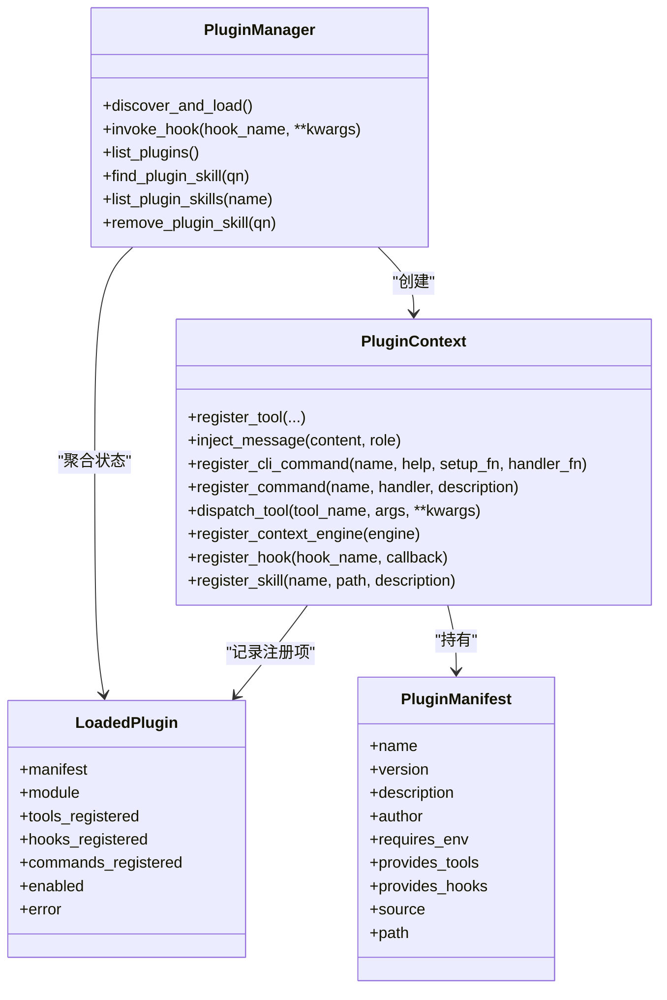
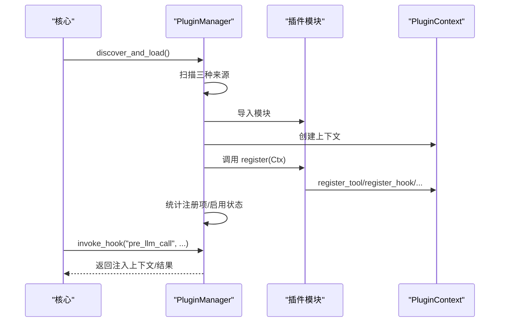
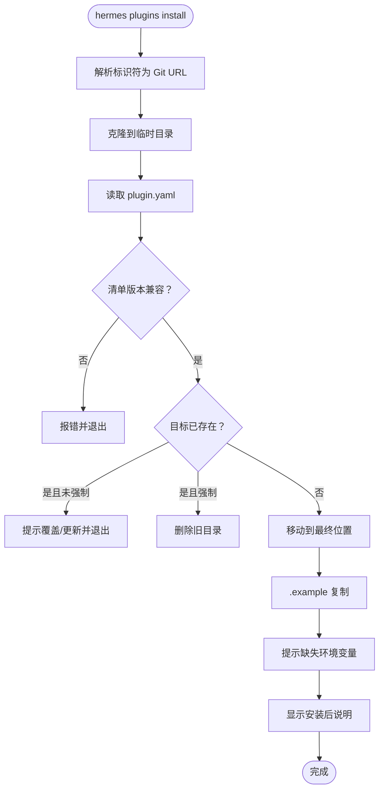
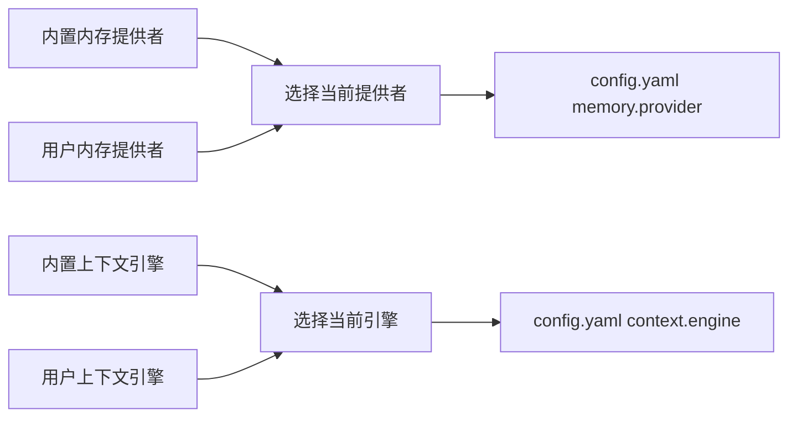
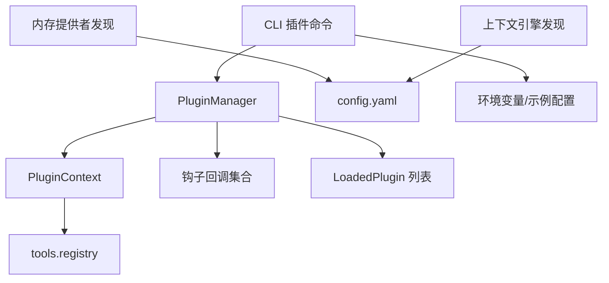

# 插件管理

<cite>
**本文引用的文件**
- [hermes_cli/plugins.py](file://hermes_cli/plugins.py)
- [hermes_cli/plugins_cmd.py](file://hermes_cli/plugins_cmd.py)
- [plugins/memory/__init__.py](file://plugins/memory/__init__.py)
- [plugins/context_engine/__init__.py](file://plugins/context_engine/__init__.py)
- [plugins/example-dashboard/dashboard/manifest.json](file://plugins/example-dashboard/dashboard/manifest.json)
- [plugins/example-dashboard/dashboard/plugin_api.py](file://plugins/example-dashboard/dashboard/plugin_api.py)
- [website/docs/user-guide/features/hooks.md](file://website/docs/user-guide/features/hooks.md)
- [run_agent.py](file://run_agent.py)
- [tests/hermes_cli/test_plugins.py](file://tests/hermes_cli/test_plugins.py)
- [tests/hermes_cli/test_plugins_cmd.py](file://tests/hermes_cli/test_plugins_cmd.py)
- [tests/agent/test_context_engine.py](file://tests/agent/test_context_engine.py)
</cite>

## 目录
1. [简介](#简介)
2. [项目结构](#项目结构)
3. [核心组件](#核心组件)
4. [架构总览](#架构总览)
5. [详细组件分析](#详细组件分析)
6. [依赖分析](#依赖分析)
7. [性能考虑](#性能考虑)
8. [故障排除指南](#故障排除指南)
9. [结论](#结论)
10. [附录](#附录)

## 简介
本文件系统性阐述 Hermes Agent 的插件管理能力，覆盖插件发现与加载、生命周期钩子、工具与命令注册、插件配置与环境变量注入、以及“提供者类”插件（内存与上下文引擎）的特殊集成。同时给出安装、更新、启用/禁用、卸载、状态查询等操作的完整命令参考与最佳实践，并提供故障排除与安全建议。

## 项目结构
Hermes 的插件体系由三部分组成：
- 用户插件：位于用户主目录下的插件树，按目录扫描并要求包含清单与入口模块。
- 项目插件：工作目录下的可选插件树，需通过环境变量开启。
- 入口点插件：通过 Python 入口点组分发的第三方包式插件。

此外，还有一套“提供者类”插件（内存提供者、上下文引擎），它们不走通用插件系统，而是独立发现与加载，但同样支持在配置中选择激活。

图表来源
- [hermes_cli/plugins.py:415-527](file://hermes_cli/plugins.py#L415-L527)
- [plugins/memory/__init__.py:66-156](file://plugins/memory/__init__.py#L66-L156)
- [plugins/context_engine/__init__.py:33-76](file://plugins/context_engine/__init__.py#L33-L76)

章节来源
- [hermes_cli/plugins.py:1-120](file://hermes_cli/plugins.py#L1-L120)
- [plugins/memory/__init__.py:1-40](file://plugins/memory/__init__.py#L1-L40)
- [plugins/context_engine/__init__.py:1-20](file://plugins/context_engine/__init__.py#L1-L20)

## 核心组件
- 插件清单与运行时状态
  - 清单字段：名称、版本、描述、作者、所需环境变量、提供的工具、提供的钩子、来源、路径。
  - 运行时状态：模块对象、已注册工具/钩子/命令、启用状态、错误信息。
- 插件上下文
  - 工具注册、消息注入、CLI 命令注册、Slash 命令注册、工具调度、上下文引擎注册、生命周期钩子注册、插件技能注册。
- 插件管理器
  - 发现与加载：扫描三种来源、解析清单、按禁用列表跳过、导入模块、调用 register、统计注册项。
  - 钩子调用：遍历回调，异常隔离，收集非空返回值；对 pre_llm_call 支持注入上下文。
  - 列表与查询：列出插件、查找插件技能、移除插件技能。
- 提供者类插件
  - 内存提供者：扫描内置与用户插件，优先内置，按配置选择当前提供者。
  - 上下文引擎：扫描内置插件目录，按配置选择当前引擎。
- CLI 插件命令
  - 安装、更新、卸载、启用、禁用、列表、交互切换、环境变量提示、示例配置复制、安装后说明展示。

章节来源
- [hermes_cli/plugins.py:92-118](file://hermes_cli/plugins.py#L92-L118)
- [hermes_cli/plugins.py:124-390](file://hermes_cli/plugins.py#L124-L390)
- [hermes_cli/plugins.py:396-712](file://hermes_cli/plugins.py#L396-L712)
- [hermes_cli/plugins_cmd.py:284-595](file://hermes_cli/plugins_cmd.py#L284-L595)
- [plugins/memory/__init__.py:122-182](file://plugins/memory/__init__.py#L122-L182)
- [plugins/context_engine/__init__.py:33-97](file://plugins/context_engine/__init__.py#L33-L97)

## 架构总览
通用插件系统与提供者类插件的协作关系如下：

图表来源
- [hermes_cli/plugins.py:396-712](file://hermes_cli/plugins.py#L396-L712)

章节来源
- [hermes_cli/plugins.py:396-712](file://hermes_cli/plugins.py#L396-L712)

## 详细组件分析

### 通用插件系统（发现、加载、钩子）
- 发现与加载
  - 用户插件：扫描用户主目录下的插件树，要求存在清单与入口模块。
  - 项目插件：当启用环境变量时扫描工作目录下的插件树。
  - 入口点插件：从 Python 入口点组读取声明的插件。
  - 加载策略：目录型插件以命名空间模块导入；入口点插件直接加载。
  - 禁用控制：读取配置中的禁用列表，跳过对应插件。
- 生命周期钩子
  - 支持钩子集合：预/后工具调用、预/后 LLM 调用、预/后 API 请求、会话开始/结束/最终化/重置。
  - pre_llm_call 可返回注入到用户消息的上下文，且不会持久化。
  - 回调异常被隔离，不影响核心循环。
- 工具与命令注册
  - 工具注册：委托给全局工具注册表，插件工具与内置工具并列。
  - Slash 命令：在会话内可用，冲突检测与去重。
  - CLI 子命令：注册 hermes 子命令，支持帮助文本与描述。
  - 技能注册：注册只读技能，按插件命名空间组织，不进入系统索引。
- 消息注入与工具调度
  - 注入消息：支持在空闲或运行中注入消息，用于桥接外部来源。
  - 工具调度：通过注册表派发，自动绑定父级代理上下文（CLI 模式）。

图表来源
- [hermes_cli/plugins.py:415-578](file://hermes_cli/plugins.py#L415-L578)
- [hermes_cli/plugins.py:632-666](file://hermes_cli/plugins.py#L632-L666)

章节来源
- [hermes_cli/plugins.py:415-578](file://hermes_cli/plugins.py#L415-L578)
- [hermes_cli/plugins.py:632-666](file://hermes_cli/plugins.py#L632-L666)
- [website/docs/user-guide/features/hooks.md:236-440](file://website/docs/user-guide/features/hooks.md#L236-L440)

### CLI 插件命令（安装、更新、启用/禁用、卸载、列表）
- 安装
  - 支持完整 URL 与 owner/repo 简写；校验清单版本兼容；复制 .example 配置；提示缺失的环境变量；显示安装后说明。
  - 若目标已存在且未强制，则提示覆盖或更新。
- 更新
  - 仅对通过 git 安装的插件有效；执行拉取并复制新增 .example 文件。
- 卸载
  - 删除插件目录。
- 启用/禁用
  - 修改配置中的禁用列表，下次会话生效。
- 列表
  - 展示名称、状态、版本、描述、来源；支持交互切换。
- 环境变量与示例配置
  - 读取清单中的 requires_env，逐项提示输入；保存至用户 .env；复制 .example 文件到真实名。

图表来源
- [hermes_cli/plugins_cmd.py:284-397](file://hermes_cli/plugins_cmd.py#L284-L397)

章节来源
- [hermes_cli/plugins_cmd.py:284-595](file://hermes_cli/plugins_cmd.py#L284-L595)
- [tests/hermes_cli/test_plugins_cmd.py:469-506](file://tests/hermes_cli/test_plugins_cmd.py#L469-L506)

### 提供者类插件（内存提供者、上下文引擎）
- 内存提供者
  - 发现顺序：内置目录优先于用户插件；同名时内置优先。
  - 加载方式：支持两种模式（register 或直接实例化），并处理相对导入。
  - CLI 命令：仅对当前激活的提供者暴露 CLI 子命令。
- 上下文引擎
  - 发现与加载：扫描内置插件目录，支持 register 或直接实例化。
  - 配置选择：通过配置项选择当前引擎，默认为内置压缩器。
- 与通用插件系统的差异
  - 不参与通用插件的启用/禁用与生命周期钩子；仅通过配置选择。

图表来源
- [plugins/memory/__init__.py:66-156](file://plugins/memory/__init__.py#L66-L156)
- [plugins/context_engine/__init__.py:33-76](file://plugins/context_engine/__init__.py#L33-L76)

章节来源
- [plugins/memory/__init__.py:122-182](file://plugins/memory/__init__.py#L122-L182)
- [plugins/context_engine/__init__.py:79-97](file://plugins/context_engine/__init__.py#L79-L97)
- [hermes_cli/plugins_cmd.py:601-733](file://hermes_cli/plugins_cmd.py#L601-L733)

### 插件技能与示例
- 插件技能
  - 通过 PluginContext.register_skill 注册，采用“插件名:技能名”的限定名。
  - 不进入系统技能索引，需显式加载。
- 示例仪表盘插件
  - 清单定义了标签、描述、图标、版本、标签页位置与入口脚本。
  - 后端 API 路由挂载在 /api/plugins/<name>/ 下。

章节来源
- [hermes_cli/plugins.py:346-390](file://hermes_cli/plugins.py#L346-L390)
- [plugins/example-dashboard/dashboard/manifest.json:1-14](file://plugins/example-dashboard/dashboard/manifest.json#L1-L14)
- [plugins/example-dashboard/dashboard/plugin_api.py:1-15](file://plugins/example-dashboard/dashboard/plugin_api.py#L1-L15)

## 依赖分析
- 插件系统内部耦合
  - PluginManager 与 PluginContext 强关联；PluginContext 依赖工具注册表与配置模块。
  - 钩子调用对异常隔离，避免单个插件影响核心循环。
- 提供者类插件与配置耦合
  - 内存提供者与上下文引擎均通过配置项选择当前实例，加载过程轻量扫描。
- CLI 与插件系统的耦合
  - CLI 插件命令负责安装/更新/启停，插件系统负责运行期发现与加载。

图表来源
- [hermes_cli/plugins.py:124-390](file://hermes_cli/plugins.py#L124-L390)
- [hermes_cli/plugins_cmd.py:284-595](file://hermes_cli/plugins_cmd.py#L284-L595)
- [plugins/memory/__init__.py:307-320](file://plugins/memory/__init__.py#L307-L320)
- [plugins/context_engine/__init__.py:307-318](file://plugins/context_engine/__init__.py#L307-L318)

章节来源
- [hermes_cli/plugins.py:124-390](file://hermes_cli/plugins.py#L124-L390)
- [hermes_cli/plugins_cmd.py:284-595](file://hermes_cli/plugins_cmd.py#L284-L595)
- [plugins/memory/__init__.py:307-320](file://plugins/memory/__init__.py#L307-L320)
- [plugins/context_engine/__init__.py:307-318](file://plugins/context_engine/__init__.py#L307-L318)

## 性能考虑
- 插件发现与加载
  - 目录扫描与 YAML 解析在启动阶段进行；入口点扫描代价较低。
  - 插件模块导入与 register 调用发生在首次发现时，后续复用模块缓存。
- 钩子调用
  - 每次调用遍历回调列表，异常隔离；pre_llm_call 的上下文注入为字符串拼接，开销可控。
- 提供者类插件
  - 发现与加载为轻量扫描，仅在需要时才真正实例化。

## 故障排除指南
- 插件未加载或被禁用
  - 检查配置中的禁用列表；确认插件目录包含清单与入口模块。
  - 查看插件错误信息与日志输出。
- 缺少 register 函数或 __init__.py
  - 插件必须提供 register 函数与入口模块；否则记录错误。
- 环境变量缺失
  - 安装时会提示缺失的环境变量；可在用户 .env 中设置。
- Git 安装失败
  - 检查 git 是否可用、网络是否可达、URL 是否正确。
- 上下文引擎冲突
  - 仅允许一个上下文引擎插件注册；重复注册会被拒绝。
- 权限与安全
  - 使用 HTTPS 或 SSH URL 安装；避免使用 http:// 或 file://。
  - 对危险工具调用可通过 pre_tool_call 阻断或审计。

章节来源
- [tests/hermes_cli/test_plugins.py:146-178](file://tests/hermes_cli/test_plugins.py#L146-L178)
- [hermes_cli/plugins_cmd.py:297-302](file://hermes_cli/plugins_cmd.py#L297-L302)
- [hermes_cli/plugins.py:295-324](file://hermes_cli/plugins.py#L295-L324)
- [website/docs/user-guide/features/hooks.md:236-440](file://website/docs/user-guide/features/hooks.md#L236-L440)

## 结论
Hermes 的插件管理以“通用插件系统 + 提供者类插件”双轨并行：前者提供强大的生命周期钩子、工具与命令扩展能力，后者则通过配置即插即用，满足内存与上下文处理的定制需求。CLI 插件命令完善了安装、更新、启停与状态查询的全链路体验。配合严格的错误隔离与安全提示，整体具备良好的可维护性与安全性。

## 附录

### 插件管理命令参考
- hermes plugins install <identifier> [--force]
  - 从 Git URL 或 owner/repo 安装插件；支持强制覆盖；安装后复制 .example 配置并提示缺失环境变量。
- hermes plugins update <name>
  - 仅对通过 git 安装的插件执行拉取更新。
- hermes plugins remove <name>
  - 删除指定插件目录。
- hermes plugins enable <name> / disable <name>
  - 修改配置中的禁用列表，下次会话生效。
- hermes plugins list
  - 列出已安装插件及其状态、版本、描述、来源。
- hermes plugins
  - 交互式切换插件启用状态与配置提供者类插件。

章节来源
- [hermes_cli/plugins_cmd.py:284-595](file://hermes_cli/plugins_cmd.py#L284-L595)

### 插件清单与配置要点
- 清单字段
  - name、version、description、author、requires_env、provides_tools、provides_hooks、manifest_version。
- 环境变量
  - 安装时自动提示缺失项并写入用户 .env；支持富格式描述与链接。
- 示例配置复制
  - 自动将 .example 文件复制为真实配置文件（若不存在）。

章节来源
- [hermes_cli/plugins_cmd.py:115-149](file://hermes_cli/plugins_cmd.py#L115-L149)
- [hermes_cli/plugins_cmd.py:151-224](file://hermes_cli/plugins_cmd.py#L151-L224)

### 生命周期钩子与使用场景
- pre_tool_call/post_tool_call：审计、计数、阻断危险工具。
- pre_llm_call/post_llm_call：注入上下文、持久化对话数据。
- on_session_start/on_session_end/on_session_finalize/on_session_reset：会话级事件处理。

章节来源
- [website/docs/user-guide/features/hooks.md:236-440](file://website/docs/user-guide/features/hooks.md#L236-L440)
- [run_agent.py:8464-8490](file://run_agent.py#L8464-L8490)
- [run_agent.py:11205-11223](file://run_agent.py#L11205-L11223)

### 安全性与权限管理最佳实践
- 安装来源
  - 优先使用 https:// 或 git@ URL；避免 http:// 与 file://。
- 环境变量
  - 将敏感凭据保存在用户 .env；避免硬编码在仓库中。
- 工具调用
  - 在 pre_tool_call 中实现阻断策略与审计日志；对高危工具单独管控。
- 上下文注入
  - 仅注入用户消息，不修改系统提示；确保提示前缀不变以复用缓存。

章节来源
- [hermes_cli/plugins_cmd.py:297-302](file://hermes_cli/plugins_cmd.py#L297-L302)
- [hermes_cli/plugins.py:640-651](file://hermes_cli/plugins.py#L640-L651)
- [website/docs/user-guide/features/hooks.md:236-440](file://website/docs/user-guide/features/hooks.md#L236-L440)