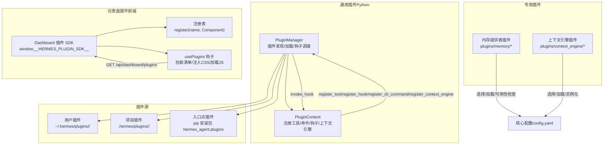
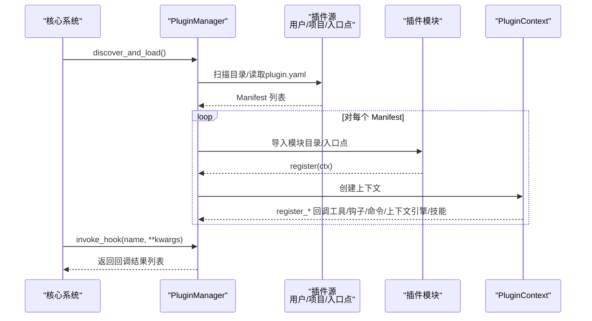
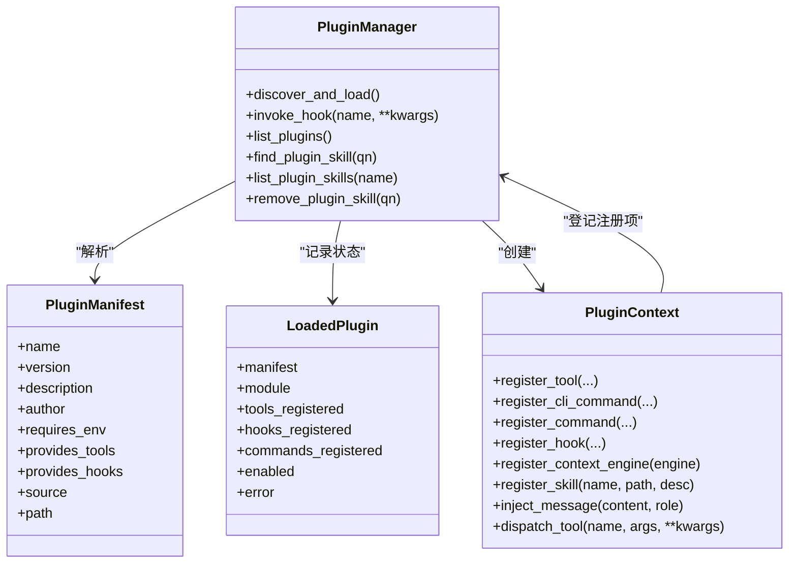
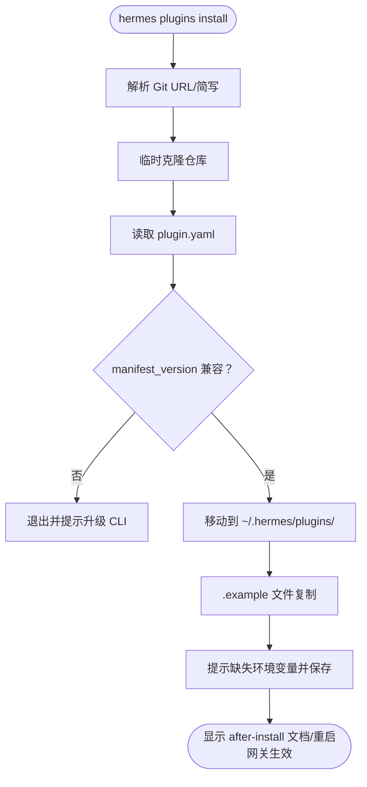
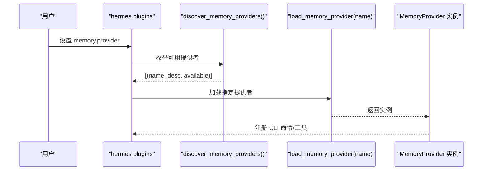
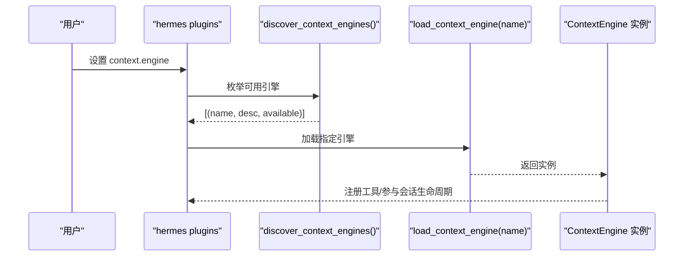
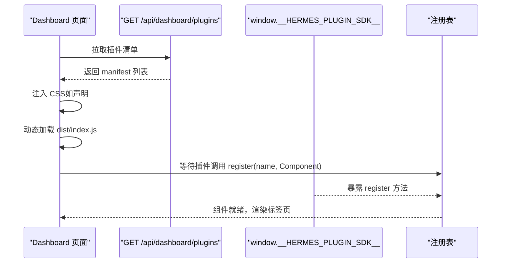
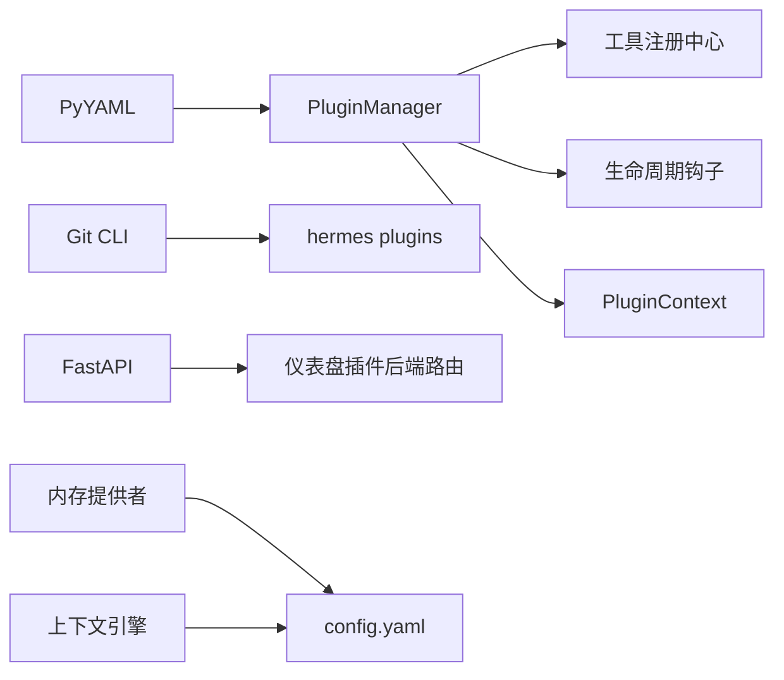

# 插件系统

<cite>
**本文引用的文件**
- [hermes_cli/plugins.py](file://hermes_cli/plugins.py)
- [hermes_cli/plugins_cmd.py](file://hermes_cli/plugins_cmd.py)
- [plugins/memory/__init__.py](file://plugins/memory/__init__.py)
- [plugins/context_engine/__init__.py](file://plugins/context_engine/__init__.py)
- [plugins/example-dashboard/dashboard/manifest.json](file://plugins/example-dashboard/dashboard/manifest.json)
- [plugins/example-dashboard/dashboard/plugin_api.py](file://plugins/example-dashboard/dashboard/plugin_api.py)
- [web/src/plugins/types.ts](file://web/src/plugins/types.ts)
- [web/src/plugins/registry.ts](file://web/src/plugins/registry.ts)
- [web/src/plugins/usePlugins.ts](file://web/src/plugins/usePlugins.ts)
- [website/docs/developer-guide/memory-provider-plugin.md](file://website/docs/developer-guide/memory-provider-plugin.md)
- [website/docs/developer-guide/context-engine-plugin.md](file://website/docs/developer-guide/context-engine-plugin.md)
- [website/docs/user-guide/features/hooks.md](file://website/docs/user-guide/features/hooks.md)
- [tests/plugins/test_retaindb_plugin.py](file://tests/plugins/test_retaindb_plugin.py)
- [tests/agent/test_context_engine.py](file://tests/agent/test_context_engine.py)
</cite>

## 目录
1. [简介](#简介)
2. [项目结构](#项目结构)
3. [核心组件](#核心组件)
4. [架构总览](#架构总览)
5. [详细组件分析](#详细组件分析)
6. [依赖关系分析](#依赖关系分析)
7. [性能考量](#性能考量)
8. [故障排查指南](#故障排查指南)
9. [结论](#结论)
10. [附录](#附录)

## 简介
本文件系统性阐述 Hermes Agent 的插件体系：插件架构设计、开发指南、生命周期与注册机制、插件管理工具、发布与分发、与核心系统的集成与依赖管理，并提供可操作的开发示例与最佳实践，以及调试与性能优化建议。

## 项目结构
Hermes 插件系统由“通用插件”“内存提供者插件”“上下文引擎插件”“仪表盘插件（前端）”四类构成，分别位于不同目录并遵循统一的发现与加载模式。

图示来源
- [hermes_cli/plugins.py:396-740](file://hermes_cli/plugins.py#L396-L740)
- [plugins/memory/__init__.py:1-220](file://plugins/memory/__init__.py#L1-L220)
- [plugins/context_engine/__init__.py:1-220](file://plugins/context_engine/__init__.py#L1-L220)
- [web/src/plugins/registry.ts:1-86](file://web/src/plugins/registry.ts#L1-L86)
- [web/src/plugins/usePlugins.ts:1-34](file://web/src/plugins/usePlugins.ts#L1-L34)

章节来源
- [hermes_cli/plugins.py:1-120](file://hermes_cli/plugins.py#L1-L120)
- [plugins/memory/__init__.py:1-50](file://plugins/memory/__init__.py#L1-L50)
- [plugins/context_engine/__init__.py:1-35](file://plugins/context_engine/__init__.py#L1-L35)
- [web/src/plugins/types.ts:1-22](file://web/src/plugins/types.ts#L1-L22)
- [web/src/plugins/registry.ts:1-86](file://web/src/plugins/registry.ts#L1-L86)
- [web/src/plugins/usePlugins.ts:1-34](file://web/src/plugins/usePlugins.ts#L1-L34)

## 核心组件
- 插件管理器（PluginManager）
  - 负责扫描三类插件源、解析 plugin.yaml、导入模块、调用 register(ctx)、维护已注册工具/钩子/命令/技能、执行生命周期钩子。
- 插件上下文（PluginContext）
  - 向插件暴露注册能力：工具、命令、钩子、上下文引擎、技能、消息注入、工具派发等。
- 专用插件发现器
  - 内存提供者插件发现器：扫描内置与用户安装目录，支持可用性检查与 CLI 命令注册。
  - 上下文引擎插件发现器：扫描内置目录，按名称加载 ContextEngine 实例。
- 仪表盘插件 SDK
  - 在浏览器端通过 window.__HERMES_PLUGIN_SDK__ 暴露 React/Hook/UI 组件，插件通过 window.__HERMES_PLUGINS__.register(name, Component) 注册标签页组件；usePlugins 钩子负责拉取清单、注入 CSS、加载 JS 并等待插件注册。

章节来源
- [hermes_cli/plugins.py:124-395](file://hermes_cli/plugins.py#L124-L395)
- [plugins/memory/__init__.py:122-220](file://plugins/memory/__init__.py#L122-L220)
- [plugins/context_engine/__init__.py:33-112](file://plugins/context_engine/__init__.py#L33-L112)
- [web/src/plugins/registry.ts:39-86](file://web/src/plugins/registry.ts#L39-L86)
- [web/src/plugins/usePlugins.ts:15-34](file://web/src/plugins/usePlugins.ts#L15-L34)

## 架构总览
通用插件与专用插件在“发现—加载—注册—调度”流程上保持一致，差异在于注册对象与配置驱动的选择。

图示来源
- [hermes_cli/plugins.py:415-579](file://hermes_cli/plugins.py#L415-L579)
- [hermes_cli/plugins.py:632-667](file://hermes_cli/plugins.py#L632-L667)

章节来源
- [hermes_cli/plugins.py:415-579](file://hermes_cli/plugins.py#L415-L579)
- [hermes_cli/plugins.py:632-667](file://hermes_cli/plugins.py#L632-L667)

## 详细组件分析

### 通用插件系统（Python）
- 发现与加载
  - 用户插件：~/.hermes/plugins/<name>/（含 plugin.yaml 与 __init__.py）
  - 项目插件：./.hermes/plugins/<name>/（需启用环境变量开关）
  - 入口点插件：pip 包声明 hermes_agent.plugins 入口点组
- Manifest 字段
  - name/version/description/author/requires_env/provides_tools/provides_hooks
- 生命周期钩子
  - pre_tool_call/post_tool_call/pre_llm_call/post_llm_call/pre_api_request/post_api_request/on_session_start/on_session_end/on_session_finalize/on_session_reset
- 注册能力
  - 工具注册：register_tool(name, toolset, schema, handler, ...)
  - CLI 命令：register_cli_command(name, help, setup_fn, handler_fn, ...)
  - slash 命令：register_command(name, handler, description)
  - 钩子注册：register_hook(hook_name, callback)
  - 上下文引擎注册：register_context_engine(engine)
  - 技能注册：register_skill(name, path, description)
  - 消息注入：inject_message(content, role)
  - 工具派发：dispatch_tool(name, args, **kwargs)

图示来源
- [hermes_cli/plugins.py:92-118](file://hermes_cli/plugins.py#L92-L118)
- [hermes_cli/plugins.py:124-395](file://hermes_cli/plugins.py#L124-L395)
- [hermes_cli/plugins.py:396-740](file://hermes_cli/plugins.py#L396-L740)

章节来源
- [hermes_cli/plugins.py:1-120](file://hermes_cli/plugins.py#L1-L120)
- [hermes_cli/plugins.py:415-579](file://hermes_cli/plugins.py#L415-L579)
- [hermes_cli/plugins.py:632-667](file://hermes_cli/plugins.py#L632-L667)

### 插件管理工具（CLI）
- hermes plugins 子命令
  - install/update/remove/list/enable/disable/toggle
  - 支持 Git URL 或 owner/repo 简写，自动克隆到 ~/.hermes/plugins/<name>/
  - 读取 plugin.yaml，支持 manifest_version 兼容性校验
  - 自动复制 *.example 配置文件，提示缺失环境变量并写入 ~/.env
  - 提供交互式 UI 以切换插件启停与选择 provider 类型（内存/上下文引擎）

图示来源
- [hermes_cli/plugins_cmd.py:284-397](file://hermes_cli/plugins_cmd.py#L284-L397)
- [hermes_cli/plugins_cmd.py:115-128](file://hermes_cli/plugins_cmd.py#L115-L128)
- [hermes_cli/plugins_cmd.py:151-225](file://hermes_cli/plugins_cmd.py#L151-L225)

章节来源
- [hermes_cli/plugins_cmd.py:284-397](file://hermes_cli/plugins_cmd.py#L284-L397)
- [hermes_cli/plugins_cmd.py:115-225](file://hermes_cli/plugins_cmd.py#L115-L225)

### 内存提供者插件（Provider Plugin）
- 设计要点
  - 单选：同一时刻仅一个内存提供者生效
  - 配置驱动：通过 config.yaml 中 memory.provider 选择
  - 可用性检查：is_available() 轻量判断（无网络调用）
  - CLI 命令：仅对当前激活的提供者注册命令
- 发现与加载
  - 先内置 plugins/memory/<name>/，后用户安装 $HERMES_HOME/plugins/<name>/（内置优先）
  - 支持两种加载路径：register(ctx) 或直接导出 MemoryProvider 子类实例
- 示例参考
  - RetainDB 插件：完整的客户端、SQLite 写队列、覆盖层格式化、后台预取与线程管理、镜像钩子等

图示来源
- [plugins/memory/__init__.py:122-182](file://plugins/memory/__init__.py#L122-L182)
- [plugins/memory/__init__.py:322-407](file://plugins/memory/__init__.py#L322-L407)

章节来源
- [plugins/memory/__init__.py:1-220](file://plugins/memory/__init__.py#L1-L220)
- [website/docs/developer-guide/memory-provider-plugin.md:1-52](file://website/docs/developer-guide/memory-provider-plugin.md#L1-L52)
- [tests/plugins/test_retaindb_plugin.py:1-120](file://tests/plugins/test_retaindb_plugin.py#L1-L120)

### 上下文引擎插件（Provider Plugin）
- 设计要点
  - 单选：同一时刻仅一个上下文引擎生效，通过 config.yaml context.engine 选择
  - 默认引擎为 built-in ContextCompressor
  - 通用插件也可注册上下文引擎（仅允许一个），否则拒绝
- 发现与加载
  - 仅扫描 plugins/context_engine/<name>/，按名称加载 ContextEngine 实例
  - 支持 register(ctx) 或直接导出 ContextEngine 子类实例

图示来源
- [plugins/context_engine/__init__.py:33-98](file://plugins/context_engine/__init__.py#L33-L98)
- [tests/agent/test_context_engine.py:197-250](file://tests/agent/test_context_engine.py#L197-L250)

章节来源
- [plugins/context_engine/__init__.py:1-220](file://plugins/context_engine/__init__.py#L1-L220)
- [website/docs/developer-guide/context-engine-plugin.md:1-190](file://website/docs/developer-guide/context-engine-plugin.md#L1-L190)
- [tests/agent/test_context_engine.py:197-250](file://tests/agent/test_context_engine.py#L197-L250)

### 仪表盘插件（前端）
- SDK 与注册
  - window.__HERMES_PLUGIN_SDK__ 暴露 React/Hook/UI 组件
  - 插件通过 window.__HERMES_PLUGINS__.register(name, Component) 注册标签页组件
- 清单与加载
  - usePlugins 钩子在挂载时 GET /api/dashboard/plugins 获取清单
  - 为声明了 css 的插件注入 <link>，再动态加载 dist/index.js
  - 等待插件调用 register 完成渲染

图示来源
- [web/src/plugins/types.ts:1-22](file://web/src/plugins/types.ts#L1-L22)
- [web/src/plugins/registry.ts:39-86](file://web/src/plugins/registry.ts#L39-L86)
- [web/src/plugins/usePlugins.ts:15-34](file://web/src/plugins/usePlugins.ts#L15-L34)
- [plugins/example-dashboard/dashboard/manifest.json:1-14](file://plugins/example-dashboard/dashboard/manifest.json#L1-L14)
- [plugins/example-dashboard/dashboard/plugin_api.py:1-15](file://plugins/example-dashboard/dashboard/plugin_api.py#L1-L15)

章节来源
- [web/src/plugins/types.ts:1-22](file://web/src/plugins/types.ts#L1-L22)
- [web/src/plugins/registry.ts:1-86](file://web/src/plugins/registry.ts#L1-L86)
- [web/src/plugins/usePlugins.ts:1-34](file://web/src/plugins/usePlugins.ts#L1-L34)
- [plugins/example-dashboard/dashboard/manifest.json:1-14](file://plugins/example-dashboard/dashboard/manifest.json#L1-L14)
- [plugins/example-dashboard/dashboard/plugin_api.py:1-15](file://plugins/example-dashboard/dashboard/plugin_api.py#L1-L15)

## 依赖关系分析
- 插件与核心系统耦合
  - 通用插件通过 PluginContext 与核心工具注册中心、会话上下文、钩子系统解耦
  - 专用插件通过配置文件（config.yaml）与核心系统耦合，实现单选策略
- 外部依赖
  - PyYAML 用于解析 plugin.yaml（可选）
  - Git 用于 CLI 安装/更新
  - FastAPI（示例）用于仪表盘插件后端路由
- 循环依赖防护
  - 插件上下文在注册时延迟导入核心模块，避免循环依赖

图示来源
- [hermes_cli/plugins.py:43-47](file://hermes_cli/plugins.py#L43-L47)
- [hermes_cli/plugins_cmd.py:312-330](file://hermes_cli/plugins_cmd.py#L312-L330)
- [plugins/example-dashboard/dashboard/plugin_api.py:6-8](file://plugins/example-dashboard/dashboard/plugin_api.py#L6-L8)

章节来源
- [hermes_cli/plugins.py:43-47](file://hermes_cli/plugins.py#L43-L47)
- [hermes_cli/plugins_cmd.py:312-330](file://hermes_cli/plugins_cmd.py#L312-L330)

## 性能考量
- 插件加载
  - 尽量在 __init__.py 中做轻量检查（如 is_available 不做网络请求），避免阻塞启动
  - 使用延迟导入与模块缓存，减少重复开销
- 钩子执行
  - 每个回调独立 try/except，避免单个插件异常影响主循环
  - 钩子返回值仅收集非空结果，减少无效处理
- 仪表盘插件
  - 仅在需要时加载 JS，避免一次性加载过多资源
  - CSS 按需注入，减少 DOM 体积
- 内存/上下文引擎
  - 专用插件通过配置单选，避免多实例竞争
  - 引擎实现中注意会话边界清理与资源回收

## 故障排查指南
- 插件未被发现
  - 确认 plugin.yaml 存在且可解析；检查 requires_env 是否满足
  - 检查插件目录命名与权限
- 插件加载失败
  - 查看日志中的 ImportError/ModuleNotFoundError
  - 确认 register(ctx) 函数存在且签名正确
- 钩子不生效
  - 确认钩子名在 VALID_HOOKS 列表内
  - 检查回调是否抛出异常导致被忽略
- 仪表盘插件不显示
  - 确认 /api/dashboard/plugins 能返回清单
  - 检查 dist/index.js 是否成功加载，插件是否调用了 register
- 内存/上下文引擎问题
  - 检查 config.yaml 中对应字段（memory.provider/context.engine）
  - 仅允许一个引擎生效，确认未重复注册

章节来源
- [hermes_cli/plugins.py:473-497](file://hermes_cli/plugins.py#L473-L497)
- [hermes_cli/plugins.py:632-667](file://hermes_cli/plugins.py#L632-L667)
- [web/src/plugins/usePlugins.ts:21-30](file://web/src/plugins/usePlugins.ts#L21-L30)
- [plugins/example-dashboard/dashboard/plugin_api.py:11-15](file://plugins/example-dashboard/dashboard/plugin_api.py#L11-L15)

## 结论
Hermes 插件系统通过统一的发现—加载—注册—调度框架，将通用插件、内存提供者插件、上下文引擎插件与仪表盘插件有机整合。开发者可通过清晰的接口与完善的 CLI 工具快速构建、分发与运维插件，同时通过配置驱动实现单选策略与安全隔离。

## 附录

### 开发流程（通用插件）
- 创建目录与清单
  - 在 ~/.hermes/plugins/<name>/ 下创建 plugin.yaml 与 __init__.py
- 编写注册函数
  - 在 __init__.py 中实现 register(ctx)，使用 ctx.register_* 完成注册
- 测试与验证
  - 使用 hermes plugins install/update/list/enable/disable 进行安装与启停
  - 通过 invoke_hook 与工具注册验证功能
- 发布与分发
  - 通过 pip 包声明 hermes_agent.plugins 入口点，或提供 Git 仓库供 CLI 安装

章节来源
- [hermes_cli/plugins.py:1-26](file://hermes_cli/plugins.py#L1-L26)
- [hermes_cli/plugins_cmd.py:284-397](file://hermes_cli/plugins_cmd.py#L284-L397)

### 开发流程（内存提供者插件）
- 目录结构
  - plugins/memory/<name>/ 下包含 __init__.py（实现 MemoryProvider 或 register(ctx)）、plugin.yaml、README.md
- 实现要点
  - 实现 is_available、initialize、工具方法等
  - 通过 discover_memory_providers/load_memory_provider 进行发现与加载
- 示例参考
  - RetainDB 插件覆盖了客户端、写队列、覆盖层格式化、后台预取、镜像钩子等

章节来源
- [website/docs/developer-guide/memory-provider-plugin.md:15-52](file://website/docs/developer-guide/memory-provider-plugin.md#L15-L52)
- [plugins/memory/__init__.py:122-182](file://plugins/memory/__init__.py#L122-L182)
- [tests/plugins/test_retaindb_plugin.py:337-567](file://tests/plugins/test_retaindb_plugin.py#L337-L567)

### 开发流程（上下文引擎插件）
- 目录结构
  - plugins/context_engine/<name>/ 下包含 __init__.py（导出 ContextEngine 子类）、plugin.yaml
- 实现要点
  - 实现 ContextEngine 接口，支持 on_session_start/update_from_response/should_compress/compress/on_session_end/on_session_reset
  - 通过 discover_context_engines/load_context_engine 进行发现与加载
- 与通用插件互操作
  - 通用插件也可通过 ctx.register_context_engine 注册引擎（仅允许一个）

章节来源
- [website/docs/developer-guide/context-engine-plugin.md:26-190](file://website/docs/developer-guide/context-engine-plugin.md#L26-L190)
- [plugins/context_engine/__init__.py:33-98](file://plugins/context_engine/__init__.py#L33-L98)
- [tests/agent/test_context_engine.py:197-250](file://tests/agent/test_context_engine.py#L197-L250)

### 开发流程（仪表盘插件）
- 清单与后端
  - manifest.json 声明 name/label/description/icon/version/tab(entry)/api
  - plugin_api.py 提供 FastAPI 路由作为插件后端接口
- 前端注册
  - 在浏览器端通过 window.__HERMES_PLUGIN_SDK__ 获取 React/Hook/UI 组件
  - 调用 window.__HERMES_PLUGINS__.register(name, Component) 注册标签页组件
- 生命周期
  - usePlugins 钩子负责拉取清单、注入 CSS、加载 JS、等待插件注册

章节来源
- [plugins/example-dashboard/dashboard/manifest.json:1-14](file://plugins/example-dashboard/dashboard/manifest.json#L1-L14)
- [plugins/example-dashboard/dashboard/plugin_api.py:1-15](file://plugins/example-dashboard/dashboard/plugin_api.py#L1-L15)
- [web/src/plugins/registry.ts:39-86](file://web/src/plugins/registry.ts#L39-L86)
- [web/src/plugins/usePlugins.ts:15-34](file://web/src/plugins/usePlugins.ts#L15-L34)

### 最佳实践
- 清晰的 plugin.yaml
  - 填充 name/version/description/author/requires_env/provides_tools/provides_hooks
- 轻量可用性检查
  - is_available 不做网络请求，避免阻塞
- 钩子幂等与健壮
  - 回调内部 try/except，避免异常中断主流程
- 配置驱动单选
  - 专用插件通过 config.yaml 单选，避免冲突
- 前端资源优化
  - 按需加载 JS/CSS，减少首屏负担

章节来源
- [hermes_cli/plugins.py:54-65](file://hermes_cli/plugins.py#L54-L65)
- [hermes_cli/plugins.py:632-667](file://hermes_cli/plugins.py#L632-L667)
- [plugins/memory/__init__.py:143-154](file://plugins/memory/__init__.py#L143-L154)
- [web/src/plugins/usePlugins.ts:15-34](file://web/src/plugins/usePlugins.ts#L15-L34)