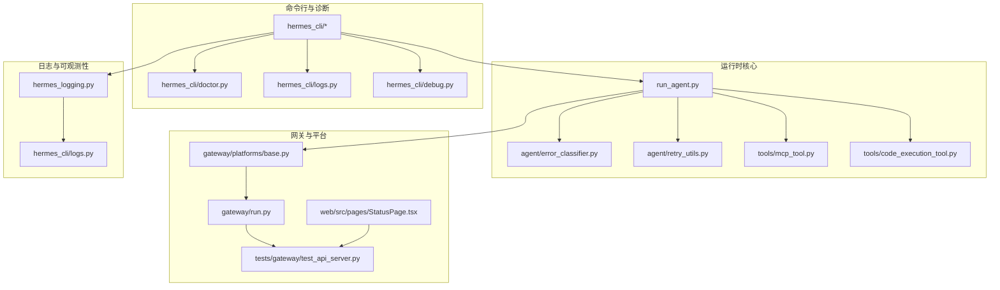
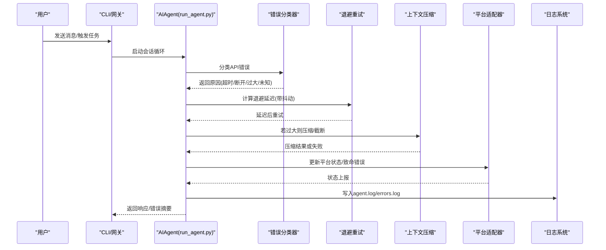
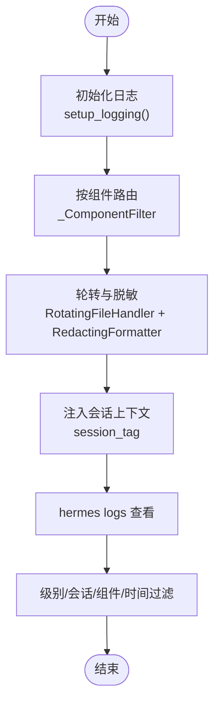
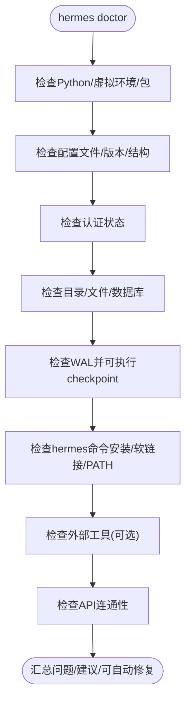
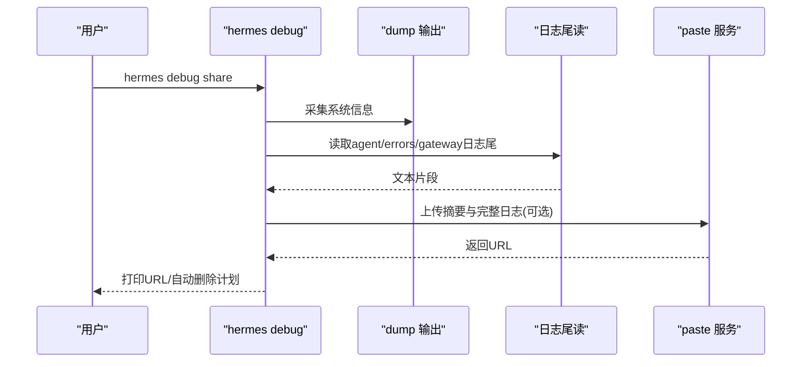
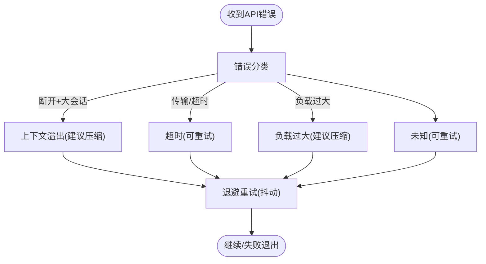
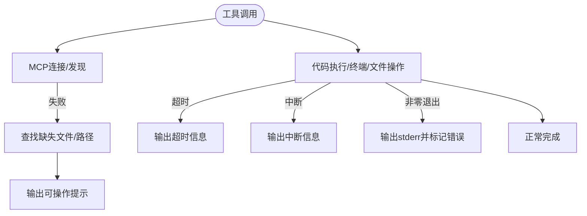
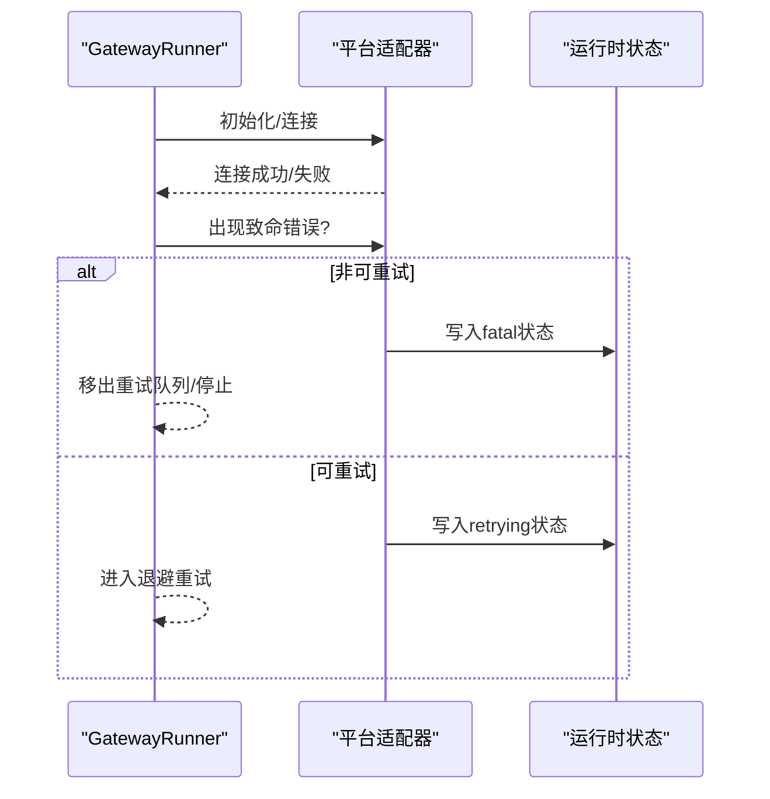
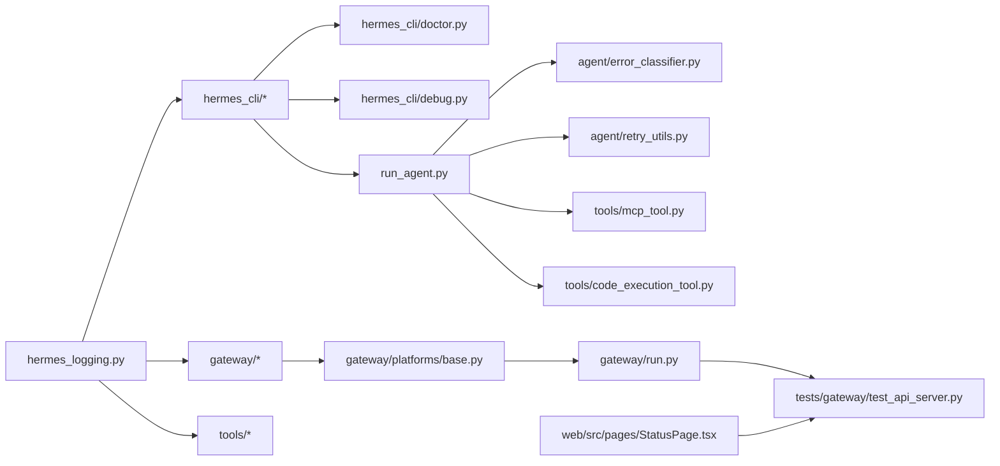

# 故障排除与常见问题

<cite>
**本文引用的文件**
- [README.md](file://README.md)
- [CONTRIBUTING.md](file://CONTRIBUTING.md)
- [hermes_logging.py](file://hermes_logging.py)
- [hermes_cli/logs.py](file://hermes_cli/logs.py)
- [hermes_cli/doctor.py](file://hermes_cli/doctor.py)
- [hermes_cli/debug.py](file://hermes_cli/debug.py)
- [run_agent.py](file://run_agent.py)
- [agent/error_classifier.py](file://agent/error_classifier.py)
- [agent/retry_utils.py](file://agent/retry_utils.py)
- [tools/mcp_tool.py](file://tools/mcp_tool.py)
- [tools/code_execution_tool.py](file://tools/code_execution_tool.py)
- [gateway/platforms/base.py](file://gateway/platforms/base.py)
- [gateway/run.py](file://gateway/run.py)
- [tests/gateway/test_api_server.py](file://tests/gateway/test_api_server.py)
- [web/src/pages/StatusPage.tsx](file://web/src/pages/StatusPage.tsx)
- [website/docs/guides/automation-templates.md](file://website/docs/guides/automation-templates.md)
- [environments/agent_loop.py](file://environments/agent_loop.py)
</cite>

## 目录
1. [简介](#简介)
2. [项目结构](#项目结构)
3. [核心组件](#核心组件)
4. [架构总览](#架构总览)
5. [详细组件分析](#详细组件分析)
6. [依赖关系分析](#依赖关系分析)
7. [性能考虑](#性能考虑)
8. [故障排除指南](#故障排除指南)
9. [结论](#结论)
10. [附录](#附录)

## 简介
本指南面向使用 Hermes Agent 的用户与运维人员，聚焦于“可操作”的故障排除与常见问题解答。内容覆盖网络连接、认证授权、工具执行、上下文压缩、平台适配器、日志分析、系统健康检查、性能诊断与优化、以及社区支持与预防性维护建议。所有建议均基于仓库中的实际实现与测试用例，确保可落地、可验证。

## 项目结构
Hermes Agent 由 CLI、网关（多平台）、工具系统、会话与内存管理、日志与调试工具等模块组成。下图展示与故障排除相关的关键路径：

图表来源
- [hermes_cli/doctor.py:164-534](file://hermes_cli/doctor.py#L164-L534)
- [hermes_cli/logs.py:138-247](file://hermes_cli/logs.py#L138-L247)
- [hermes_cli/debug.py:351-433](file://hermes_cli/debug.py#L351-L433)
- [run_agent.py:9872-10291](file://run_agent.py#L9872-L10291)
- [agent/error_classifier.py:391-415](file://agent/error_classifier.py#L391-L415)
- [agent/retry_utils.py:19-44](file://agent/retry_utils.py#L19-L44)
- [tools/mcp_tool.py:324-347](file://tools/mcp_tool.py#L324-L347)
- [tools/code_execution_tool.py:1203-1227](file://tools/code_execution_tool.py#L1203-L1227)
- [gateway/platforms/base.py:886-924](file://gateway/platforms/base.py#L886-L924)
- [gateway/run.py:2228-2251](file://gateway/run.py#L2228-L2251)
- [tests/gateway/test_api_server.py:248-308](file://tests/gateway/test_api_server.py#L248-L308)
- [web/src/pages/StatusPage.tsx:1-40](file://web/src/pages/StatusPage.tsx#L1-L40)
- [hermes_logging.py:156-260](file://hermes_logging.py#L156-L260)

章节来源
- [README.md:1-179](file://README.md#L1-L179)
- [CONTRIBUTING.md:114-198](file://CONTRIBUTING.md#L114-L198)

## 核心组件
- 日志系统：集中化日志、按组件路由、轮转与脱敏格式化，支持会话上下文注入，便于快速定位问题。
- 诊断命令（doctor）：自动检查环境、配置、认证、目录结构、外部工具、API 连通性等，支持自动修复建议。
- 调试分享（debug share）：采集系统信息与日志片段，上传到公共粘贴服务，便于社区协助。
- 错误分类与重试：对网络/超时/断开/负载过大等进行语义化分类，并采用去相关抖动的指数退避重试。
- 工具执行与 MCP：对连接失败、缺失文件等错误进行可操作提示；代码执行脚本超时/中断有明确输出。
- 平台适配器：致命错误标记与状态上报，支持非可重试错误的隔离与停止策略。
- 健康检查：/health 与 /health/detailed 接口返回运行态与平台状态，前端状态页定时拉取。

章节来源
- [hermes_logging.py:156-260](file://hermes_logging.py#L156-L260)
- [hermes_cli/doctor.py:164-534](file://hermes_cli/doctor.py#L164-L534)
- [hermes_cli/debug.py:351-433](file://hermes_cli/debug.py#L351-L433)
- [agent/error_classifier.py:391-415](file://agent/error_classifier.py#L391-L415)
- [agent/retry_utils.py:19-44](file://agent/retry_utils.py#L19-L44)
- [tools/mcp_tool.py:324-347](file://tools/mcp_tool.py#L324-L347)
- [tools/code_execution_tool.py:1203-1227](file://tools/code_execution_tool.py#L1203-L1227)
- [gateway/platforms/base.py:886-924](file://gateway/platforms/base.py#L886-L924)
- [tests/gateway/test_api_server.py:248-308](file://tests/gateway/test_api_server.py#L248-L308)
- [web/src/pages/StatusPage.tsx:1-40](file://web/src/pages/StatusPage.tsx#L1-L40)

## 架构总览
下图展示一次典型对话循环中与故障相关的处理链路，包括错误分类、重试、上下文压缩与平台状态更新。

图表来源
- [run_agent.py:9872-10291](file://run_agent.py#L9872-L10291)
- [agent/error_classifier.py:391-415](file://agent/error_classifier.py#L391-L415)
- [agent/retry_utils.py:19-44](file://agent/retry_utils.py#L19-L44)
- [gateway/platforms/base.py:886-924](file://gateway/platforms/base.py#L886-L924)
- [hermes_logging.py:156-260](file://hermes_logging.py#L156-L260)

## 详细组件分析

### 日志系统与日志分析
- 日志文件
  - agent.log：主活动日志，包含会话、工具、模型调用等。
  - errors.log：仅 WARNING+，便于快速定位问题。
  - gateway.log：仅网关组件日志（在 gateway 模式下启用）。
- 会话上下文：通过线程本地存储注入 session_tag，便于跨模块关联。
- 组件过滤：按 logger 前缀将不同组件路由到独立文件。
- 日志查看：hermes logs 支持尾读、跟随、级别过滤、会话过滤、组件过滤、相对时间范围。

图表来源
- [hermes_logging.py:156-260](file://hermes_logging.py#L156-L260)
- [hermes_cli/logs.py:138-247](file://hermes_cli/logs.py#L138-L247)

章节来源
- [hermes_logging.py:156-260](file://hermes_logging.py#L156-L260)
- [hermes_cli/logs.py:138-247](file://hermes_cli/logs.py#L138-L247)

### 诊断命令（hermes doctor）
- 自动检查项
  - Python 版本、虚拟环境、必要包、可选包
  - 配置文件存在性与版本迁移、结构校验、过时键值
  - 认证提供方登录状态（Nous Portal、OpenAI Codex、Google Gemini OAuth）
  - 目录结构（~/.hermes 下子目录、SOUL.md、memories、state.db）
  - SQLite WAL 文件大小与主动 checkpoint
  - 命令安装（hermes 可执行软链接、PATH）
  - 外部工具（git、ripgrep、docker、ssh、Daytona、Node.js/agent-browser）
  - API 连通性（OpenRouter、Anthropic 等）
- 交互式修复：支持 --fix 一键修复可自动处理的问题，并给出不可自动修复的清单。

图表来源
- [hermes_cli/doctor.py:164-534](file://hermes_cli/doctor.py#L164-L534)

章节来源
- [hermes_cli/doctor.py:164-534](file://hermes_cli/doctor.py#L164-L534)

### 调试分享（hermes debug share）
- 功能：采集系统信息与最近日志片段，上传到 paste.rs 或 dpaste.com，生成可分享链接。
- 安全：仅上传摘要与受限大小的日志，支持 6 小时自动删除。
- 使用：hermes debug share [--lines N] [--expire D] [--local]。

图表来源
- [hermes_cli/debug.py:351-433](file://hermes_cli/debug.py#L351-L433)
- [hermes_cli/dump.py:319-345](file://hermes_cli/dump.py#L319-L345)

章节来源
- [hermes_cli/debug.py:351-433](file://hermes_cli/debug.py#L351-L433)

### 错误分类与重试机制
- 错误分类：根据错误类型、状态码、消息模式判断是否为超时、断开、负载过大、未知等。
- 上下文溢出优先级：在大会话且服务器断开时，优先判定为上下文溢出并建议压缩。
- 重试策略：指数退避 + 抖动，避免“惊群效应”，并发场景下种子基于单调计数器加锁生成。

图表来源
- [agent/error_classifier.py:391-415](file://agent/error_classifier.py#L391-L415)
- [agent/retry_utils.py:19-44](file://agent/retry_utils.py#L19-L44)
- [run_agent.py:9872-10291](file://run_agent.py#L9872-L10291)

章节来源
- [agent/error_classifier.py:391-415](file://agent/error_classifier.py#L391-L415)
- [agent/retry_utils.py:19-44](file://agent/retry_utils.py#L19-L44)
- [run_agent.py:9872-10291](file://run_agent.py#L9872-L10291)

### 工具执行与 MCP 连接
- MCP 连接错误：递归查找嵌套异常中的缺失文件路径，给出可操作提示。
- 代码执行：脚本超时/中断/非零退出码均有明确输出与日志记录，避免静默失败。
- 环境层：工具执行前后的结果持久化与错误包装，便于上层统一处理。

图表来源
- [tools/mcp_tool.py:324-347](file://tools/mcp_tool.py#L324-L347)
- [tools/code_execution_tool.py:1203-1227](file://tools/code_execution_tool.py#L1203-L1227)
- [environments/agent_loop.py:441-464](file://environments/agent_loop.py#L441-L464)

章节来源
- [tools/mcp_tool.py:324-347](file://tools/mcp_tool.py#L324-L347)
- [tools/code_execution_tool.py:1203-1227](file://tools/code_execution_tool.py#L1203-L1227)
- [environments/agent_loop.py:441-464](file://environments/agent_loop.py#L441-L464)

### 平台适配器与健康检查
- 致命错误：平台适配器可设置致命错误码与消息，写入运行时状态并通知处理器。
- 重连策略：非可重试致命错误直接移出重试队列；可重试则进入“重试中”状态。
- 健康接口：/health 与 /health/detailed 返回状态、平台、运行时字段；前端 StatusPage 定时拉取。

图表来源
- [gateway/platforms/base.py:886-924](file://gateway/platforms/base.py#L886-L924)
- [gateway/run.py:2228-2251](file://gateway/run.py#L2228-L2251)
- [tests/gateway/test_api_server.py:248-308](file://tests/gateway/test_api_server.py#L248-L308)
- [web/src/pages/StatusPage.tsx:1-40](file://web/src/pages/StatusPage.tsx#L1-L40)

章节来源
- [gateway/platforms/base.py:886-924](file://gateway/platforms/base.py#L886-L924)
- [gateway/run.py:2228-2251](file://gateway/run.py#L2228-L2251)
- [tests/gateway/test_api_server.py:248-308](file://tests/gateway/test_api_server.py#L248-L308)
- [web/src/pages/StatusPage.tsx:1-40](file://web/src/pages/StatusPage.tsx#L1-L40)

## 依赖关系分析
- 日志系统被 CLI、网关、工具、批处理广泛使用，是问题定位的核心基础设施。
- doctor 依赖配置、环境变量、外部工具检测、API 可达性探测。
- run_agent 的错误分类与重试依赖第三方库（如 httpx）与内部工具注册表。
- 网关平台适配器依赖运行时状态写入与平台特定实现。

图表来源
- [hermes_logging.py:156-260](file://hermes_logging.py#L156-L260)
- [hermes_cli/doctor.py:164-534](file://hermes_cli/doctor.py#L164-L534)
- [hermes_cli/debug.py:351-433](file://hermes_cli/debug.py#L351-L433)
- [run_agent.py:9872-10291](file://run_agent.py#L9872-L10291)
- [agent/error_classifier.py:391-415](file://agent/error_classifier.py#L391-L415)
- [agent/retry_utils.py:19-44](file://agent/retry_utils.py#L19-L44)
- [tools/mcp_tool.py:324-347](file://tools/mcp_tool.py#L324-L347)
- [tools/code_execution_tool.py:1203-1227](file://tools/code_execution_tool.py#L1203-L1227)
- [gateway/platforms/base.py:886-924](file://gateway/platforms/base.py#L886-L924)
- [gateway/run.py:2228-2251](file://gateway/run.py#L2228-L2251)
- [tests/gateway/test_api_server.py:248-308](file://tests/gateway/test_api_server.py#L248-L308)
- [web/src/pages/StatusPage.tsx:1-40](file://web/src/pages/StatusPage.tsx#L1-L40)

## 性能考虑
- 日志轮转与大小限制：默认 5MB 轮转，errors.log 2MB，gateway.log 5MB，备份 3 份，减少磁盘占用与 IO 压力。
- 降噪：抑制第三方噪声日志（如 httpx、openai），降低日志体积与解析成本。
- 会话上下文：通过 session_tag 快速过滤，避免全量扫描。
- 重试抖动：退避延迟加入随机抖动，缓解并发重试风暴。
- 上下文压缩：在接近上下文上限时自动压缩，避免重复失败重试。
- 建议
  - 在高并发场景开启 --verbose 仅用于短时诊断，避免过多 DEBUG 日志。
  - 对频繁失败的工具调用，先用 hermes doctor 检查外部依赖与 API 密钥。
  - 使用 hermes logs --component tools/filter 定位工具侧瓶颈。

章节来源
- [hermes_logging.py:219-258](file://hermes_logging.py#L219-L258)
- [agent/retry_utils.py:19-44](file://agent/retry_utils.py#L19-L44)
- [run_agent.py:9872-10291](file://run_agent.py#L9872-L10291)

## 故障排除指南

### 通用排查流程
- 确认环境与配置
  - 运行 hermes doctor，关注缺失包、配置版本、过时键值、认证状态、目录结构、WAL 大小。
  - 如需自动修复，使用 hermes doctor --fix。
- 检查日志
  - hermes logs 查看最近错误；hermes logs errors 查看警告/错误；hermes logs gateway 查看网关事件。
  - 使用 --level/--session/--component/--since 过滤。
- 重现并最小化
  - 使用 hermes debug share 生成可分享报告，附带最近 200 行日志与系统信息。
- 提交问题
  - 在 GitHub Issues 中附带：操作系统、Python 版本、Hermes 版本、错误堆栈、复现步骤、日志链接。

章节来源
- [hermes_cli/doctor.py:164-534](file://hermes_cli/doctor.py#L164-L534)
- [hermes_cli/logs.py:138-247](file://hermes_cli/logs.py#L138-L247)
- [hermes_cli/debug.py:351-433](file://hermes_cli/debug.py#L351-L433)
- [CONTRIBUTING.md:640-647](file://CONTRIBUTING.md#L640-L647)

### 网络连接问题
- 症状
  - API 请求超时、连接断开、429/5xx。
- 排查
  - 使用 hermes doctor 检查 OPENROUTER_API_KEY、Anthropic 等密钥有效性与网络可达性。
  - run_agent 的错误分类会区分断开与超时；若为断开且会话较大，优先考虑上下文压缩。
  - 使用 hermes logs --level WARNING 快速定位网络错误。
- 解决
  - 调整重试参数（内部策略为抖动退避），等待上游恢复。
  - 对于代理/CDN导致的流中断，遵循提示减少单次工具输出体量。

章节来源
- [hermes_cli/doctor.py:760-800](file://hermes_cli/doctor.py#L760-L800)
- [agent/error_classifier.py:391-415](file://agent/error_classifier.py#L391-L415)
- [run_agent.py:10180-10202](file://run_agent.py#L10180-L10202)

### 认证与授权问题
- 症状
  - 401 未授权、OAuth 流程失败、Google Gemini 登录未生效。
- 排查
  - hermes doctor 检查各认证提供方登录状态与错误详情。
  - MCP OAuth 配置失败时，确认 MCP SDK 可用与服务器支持 OAuth。
- 解决
  - 重新登录或刷新令牌；检查 .env 中密钥拼写与作用域。
  - 对于 Google Gemini OAuth，确认邮箱/项目信息显示正确。

章节来源
- [hermes_cli/doctor.py:370-411](file://hermes_cli/doctor.py#L370-L411)
- [hermes_cli/mcp_config.py:275-300](file://hermes_cli/mcp_config.py#L275-L300)

### 工具执行问题
- 症状
  - 脚本超时、被中断、非零退出码、找不到可执行文件。
- 排查
  - hermes logs --component tools 查看工具侧日志。
  - 检查外部工具安装（git、ripgrep、docker、ssh、Daytona、Node.js/agent-browser）。
- 解决
  - 为长耗时脚本设置更长超时；拆分大输出以避免流中断。
  - 修复权限与路径问题；必要时使用 sudo 审批流程。

章节来源
- [tools/code_execution_tool.py:1203-1227](file://tools/code_execution_tool.py#L1203-L1227)
- [hermes_cli/doctor.py:618-724](file://hermes_cli/doctor.py#L618-L724)

### 上下文过大与压缩失败
- 症状
  - 413 负载过大、上下文长度超限、压缩尝试耗尽。
- 排查
  - run_agent 会在压缩失败时输出“最大压缩尝试次数已达到”的提示，并建议 /new 或 /compress。
  - hermes logs 查看压缩相关状态与 token 统计。
- 解决
  - 使用 /compress 主动压缩；/new 开启新会话；调整模型参数或减少上下文文件。
  - 检查是否因单次工具输出过大导致流中断，拆分输出。

章节来源
- [run_agent.py:9886-10038](file://run_agent.py#L9886-L10038)

### 平台适配器与网关
- 症状
  - 平台连接不稳定、断开、或出现致命错误。
- 排查
  - hermes logs gateway 查看平台事件；/health 与 /health/detailed 检查运行状态。
  - 前端 StatusPage 定时拉取状态，观察平台状态变化。
- 解决
  - 致命错误（如配置错误）需手动修复后重启；非致命错误自动退避重试。
  - 确保 systemd linger（Linux 用户服务常驻）已启用。

章节来源
- [gateway/platforms/base.py:886-924](file://gateway/platforms/base.py#L886-L924)
- [gateway/run.py:2228-2251](file://gateway/run.py#L2228-L2251)
- [tests/gateway/test_api_server.py:248-308](file://tests/gateway/test_api_server.py#L248-L308)
- [web/src/pages/StatusPage.tsx:1-40](file://web/src/pages/StatusPage.tsx#L1-L40)

### 日志分析与问题定位
- 快速定位
  - hermes logs --level WARNING：仅看警告/错误。
  - hermes logs --session <id>：按会话过滤。
  - hermes logs --component tools/gateway/cli：按组件过滤。
  - hermes logs --since 1h -f：从一小时前起实时跟踪。
- 常见模式
  - “Network connection lost” → 流中断，减少单次输出。
  - “Request payload too large” → 压缩或新开会话。
  - “Script timed out” → 调整超时或拆分任务。

章节来源
- [hermes_cli/logs.py:138-247](file://hermes_cli/logs.py#L138-L247)
- [run_agent.py:10180-10202](file://run_agent.py#L10180-L10202)

### 社区支持与获取帮助
- 文档与入门
  - 快速开始、CLI 使用、配置、安全、工具与技能、网关、架构等。
- 社区渠道
  - Discord、GitHub Issues、GitHub Discussions、Skills Hub。
- 提交问题
  - 包含 OS、Python 版本、Hermes 版本、完整堆栈、复现步骤、日志链接。

章节来源
- [README.md:87-108](file://README.md#L87-L108)
- [CONTRIBUTING.md:640-655](file://CONTRIBUTING.md#L640-L655)

### 预防性维护与最佳实践
- 定期运行 hermes doctor，保持配置版本最新、清理 WAL、检查外部工具。
- 控制日志规模，合理设置日志级别与轮转参数。
- 对高风险工具（sudo、文件写入、代码执行）启用审批与最小权限。
- 使用 hermes logs 的过滤能力进行日常巡检，提前发现异常。
- 通过 /health 与 StatusPage 建立自动化监控告警（参考自动化模板）。

章节来源
- [hermes_cli/doctor.py:164-534](file://hermes_cli/doctor.py#L164-L534)
- [hermes_logging.py:219-258](file://hermes_logging.py#L219-L258)
- [website/docs/guides/automation-templates.md:187-225](file://website/docs/guides/automation-templates.md#L187-L225)

## 结论
通过 doctor、logs、debug、错误分类与重试、平台健康检查等工具链，Hermes Agent 提供了从“发现问题”到“定位根因”再到“修复验证”的闭环能力。建议将 doctor 作为日常例行检查，结合 hermes logs 的过滤能力进行持续观测，并在需要时使用 debug share 快速共享上下文给社区支持。

## 附录
- 常用命令速查
  - hermes doctor：诊断环境与配置
  - hermes logs [-f] [--level/--session/--component/--since]：查看日志
  - hermes debug share：生成可分享的调试报告
  - 平台健康：/health、/health/detailed；前端 StatusPage
- 关键文件路径
  - 日志：~/.hermes/logs/{agent.log,errors.log,gateway.log}
  - 配置：~/.hermes/config.yaml、~/.hermes/.env
  - 数据库：~/.hermes/state.db（含 WAL）