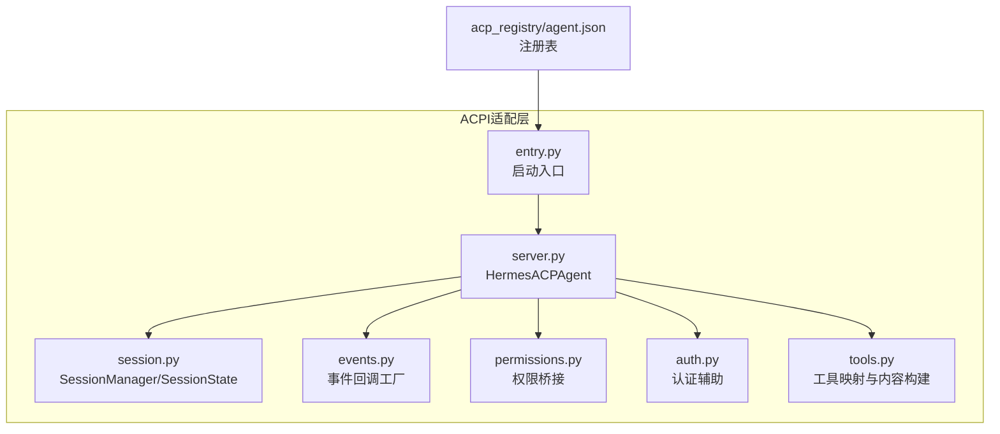
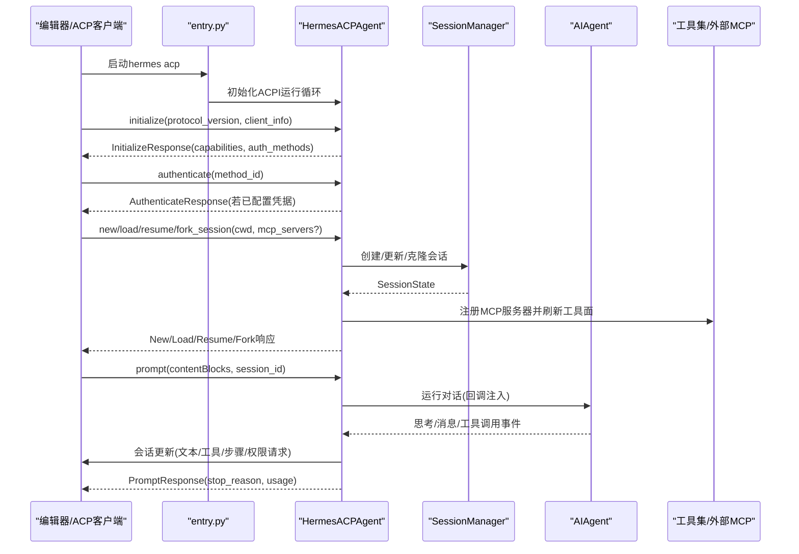
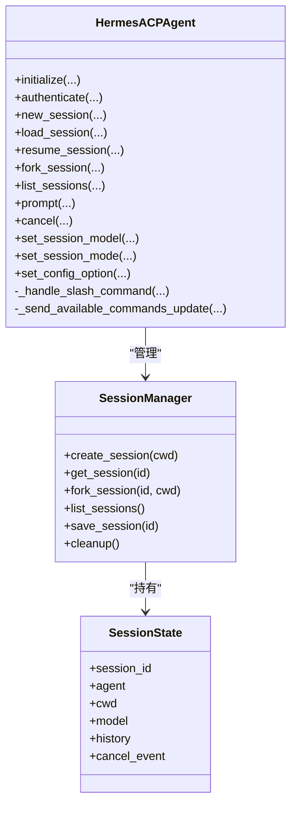
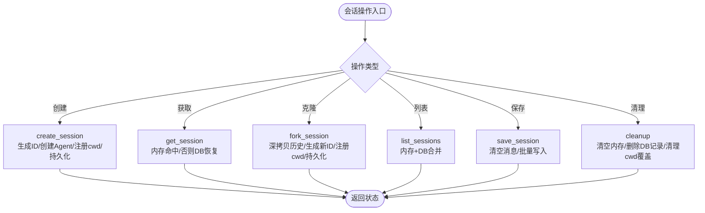
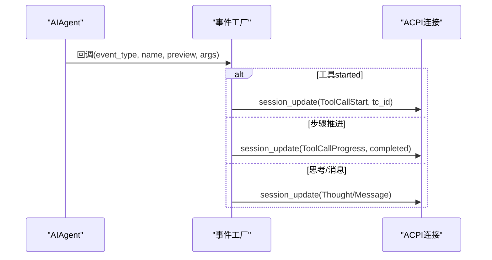
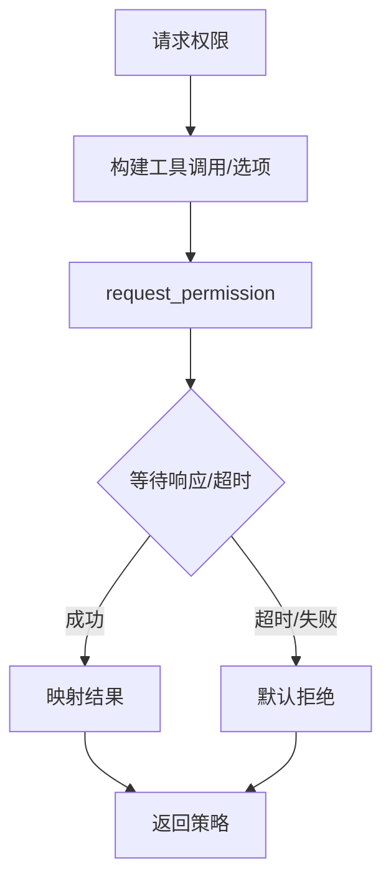
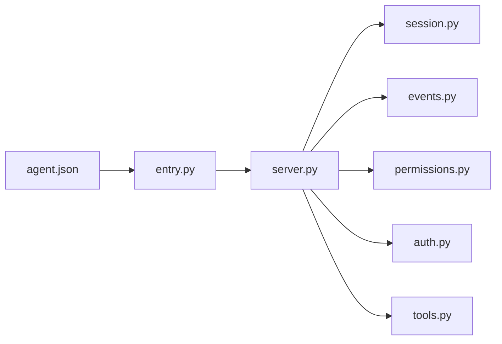

# ACPI协议架构

<cite>
**本文引用的文件**
- [acp_adapter/__init__.py](file://acp_adapter/__init__.py)
- [acp_adapter/entry.py](file://acp_adapter/entry.py)
- [acp_adapter/server.py](file://acp_adapter/server.py)
- [acp_adapter/session.py](file://acp_adapter/session.py)
- [acp_adapter/auth.py](file://acp_adapter/auth.py)
- [acp_adapter/events.py](file://acp_adapter/events.py)
- [acp_adapter/permissions.py](file://acp_adapter/permissions.py)
- [acp_adapter/tools.py](file://acp_adapter/tools.py)
- [acp_registry/agent.json](file://acp_registry/agent.json)
- [docs/acp-setup.md](file://docs/acp-setup.md)
- [tests/acp/test_server.py](file://tests/acp/test_server.py)
- [tests/acp/test_session.py](file://tests/acp/test_session.py)
- [tests/acp/test_entry.py](file://tests/acp/test_entry.py)
</cite>

## 目录
1. [简介](#简介)
2. [项目结构](#项目结构)
3. [核心组件](#核心组件)
4. [架构总览](#架构总览)
5. [详细组件分析](#详细组件分析)
6. [依赖分析](#依赖分析)
7. [性能考虑](#性能考虑)
8. [故障排除指南](#故障排除指南)
9. [结论](#结论)
10. [附录](#附录)

## 简介
本文件系统化阐述Hermes Agent的ACPI（Agent Client Protocol Interface）协议架构与实现。ACPI是面向编辑器的“应用控制协议接口”，允许Hermes以“会话”为单位在编辑器中进行对话、工具调用、文件变更与终端执行，并通过标准化事件流实时反馈。本文从设计理念、协议适配器架构、消息格式与通信机制入手，覆盖服务器实现、认证与会话管理、编辑器集成模式、协议扩展与向后兼容、客户端开发指南、测试与排错策略，以及与其他系统的集成最佳实践。

## 项目结构
围绕ACPI协议的关键模块集中在acp_adapter目录，配合注册表文件与用户文档，形成“运行入口—协议适配—会话管理—事件桥接”的完整链路。

图表来源
- [acp_adapter/entry.py:1-86](file://acp_adapter/entry.py#L1-L86)
- [acp_adapter/server.py:1-729](file://acp_adapter/server.py#L1-L729)
- [acp_adapter/session.py:1-476](file://acp_adapter/session.py#L1-L476)
- [acp_adapter/events.py:1-176](file://acp_adapter/events.py#L1-L176)
- [acp_adapter/permissions.py:1-78](file://acp_adapter/permissions.py#L1-L78)
- [acp_adapter/auth.py:1-25](file://acp_adapter/auth.py#L1-L25)
- [acp_adapter/tools.py:1-215](file://acp_adapter/tools.py#L1-L215)
- [acp_registry/agent.json:1-13](file://acp_registry/agent.json#L1-L13)

章节来源
- [acp_adapter/entry.py:1-86](file://acp_adapter/entry.py#L1-L86)
- [acp_adapter/server.py:1-729](file://acp_adapter/server.py#L1-L729)
- [acp_adapter/session.py:1-476](file://acp_adapter/session.py#L1-L476)
- [acp_adapter/events.py:1-176](file://acp_adapter/events.py#L1-L176)
- [acp_adapter/permissions.py:1-78](file://acp_adapter/permissions.py#L1-L78)
- [acp_adapter/auth.py:1-25](file://acp_adapter/auth.py#L1-L25)
- [acp_adapter/tools.py:1-215](file://acp_adapter/tools.py#L1-L215)
- [acp_registry/agent.json:1-13](file://acp_registry/agent.json#L1-L13)

## 核心组件
- 启动入口：负责日志配置、环境加载、导入运行时模块并启动ACPI服务循环。
- 协议适配器：基于ACPI框架实现的Agent，承接初始化、认证、会话生命周期、提示处理、命令广告等。
- 会话管理：维护内存态与持久态会话，支持创建、克隆、列表、恢复、清理与持久化。
- 事件桥接：将内部Agent事件转换为ACPI会话更新，包括思考文本、消息文本、工具调用开始/完成、步骤推进等。
- 权限桥接：将ACPI客户端的权限请求映射到内部审批流程，支持一次性/总是允许与拒绝。
- 认证辅助：检测当前运行时提供商与凭据，决定是否暴露认证方法。
- 工具映射：将Hermes工具名映射为ACPI工具类型，生成可读标题与位置信息，构造工具调用内容块。
- 注册表：声明命令行入口与图标，供编辑器发现与启动。

章节来源
- [acp_adapter/entry.py:58-86](file://acp_adapter/entry.py#L58-L86)
- [acp_adapter/server.py:93-729](file://acp_adapter/server.py#L93-L729)
- [acp_adapter/session.py:58-476](file://acp_adapter/session.py#L58-L476)
- [acp_adapter/events.py:27-176](file://acp_adapter/events.py#L27-L176)
- [acp_adapter/permissions.py:26-78](file://acp_adapter/permissions.py#L26-L78)
- [acp_adapter/auth.py:8-25](file://acp_adapter/auth.py#L8-L25)
- [acp_adapter/tools.py:20-215](file://acp_adapter/tools.py#L20-L215)
- [acp_registry/agent.json:1-13](file://acp_registry/agent.json#L1-L13)

## 架构总览
下图展示从编辑器到Hermes Agent的端到端交互路径，以及关键组件之间的依赖关系。

图表来源
- [acp_adapter/entry.py:58-86](file://acp_adapter/entry.py#L58-L86)
- [acp_adapter/server.py:217-467](file://acp_adapter/server.py#L217-L467)
- [acp_adapter/session.py:94-163](file://acp_adapter/session.py#L94-L163)
- [acp_adapter/events.py:47-176](file://acp_adapter/events.py#L47-L176)
- [acp_adapter/permissions.py:26-78](file://acp_adapter/permissions.py#L26-L78)
- [acp_adapter/tools.py:104-197](file://acp_adapter/tools.py#L104-L197)

## 详细组件分析

### 协议适配器（HermesACPAgent）
- 设计理念
  - 以“会话为中心”：每个任务对应一个会话ID，支持新建、加载、恢复、克隆与取消。
  - 事件驱动：将内部Agent的思考、消息、工具调用与步骤推进转化为ACPI会话更新，确保编辑器UI实时反馈。
  - 命令内省：内置斜杠命令（如帮助、模型切换、工具列表、上下文统计、重置、压缩、版本），无需LLM参与。
  - 模型与模式：支持按会话切换模型与模式，便于编辑器侧UI与行为定制。
- 关键职责
  - 生命周期：initialize、authenticate、new_session、load_session、resume_session、fork_session、list_sessions、cancel。
  - 提示处理：prompt解析文本、拦截斜杠命令、调度Agent运行、回传Usage与停止原因。
  - 命令广告：在会话响应后异步推送可用斜杠命令清单。
  - 配置选项：接受编辑器发起的配置项更新，暂存但不强制类型化。
- 数据结构与复杂度
  - 会话字典查找：O(1)平均；列表合并DB查询：O(N)。
  - 历史持久化：每次提示或状态变更写入，批量写入避免频繁IO。
- 错误处理
  - 缺失会话返回安全响应；异常捕获并记录，必要时返回错误提示文本。
  - 取消事件：设置事件标志并尝试中断Agent，保证快速响应。
- 性能影响
  - 使用线程池执行同步Agent逻辑，避免阻塞事件循环。
  - 事件发送采用run_coroutine_threadsafe，带超时保护。

图表来源
- [acp_adapter/server.py:93-729](file://acp_adapter/server.py#L93-L729)
- [acp_adapter/session.py:58-476](file://acp_adapter/session.py#L58-L476)

章节来源
- [acp_adapter/server.py:93-729](file://acp_adapter/server.py#L93-L729)
- [tests/acp/test_server.py:51-200](file://tests/acp/test_server.py#L51-L200)

### 会话管理（SessionManager/SessionState）
- 设计理念
  - 内存态+持久态双缓冲：会话在内存中快速访问，同时持久化至共享数据库，保证进程重启后可恢复。
  - 工作目录绑定：为工具执行提供cwd覆盖，确保命令与文件操作在正确路径下进行。
  - 克隆语义：fork_session深拷贝历史，保持新会话与原会话独立演进。
- 关键职责
  - 创建/获取/移除/清理：统一的生命周期管理。
  - 列表聚合：合并内存与数据库中的会话信息，便于编辑器侧展示。
  - 持久化：将模型、工作目录与消息历史写入数据库，支持跨进程恢复。
- 复杂度与一致性
  - 并发安全：使用锁保护内存态；数据库操作在事务内完成。
  - 恢复策略：缺失内存态时自动从数据库重建Agent实例与历史。
- 性能影响
  - 批量消息写入：清空后逐条追加，减少碎片。
  - 轻量信息列表：仅返回必要字段，降低网络传输与渲染压力。

图表来源
- [acp_adapter/session.py:94-476](file://acp_adapter/session.py#L94-L476)

章节来源
- [acp_adapter/session.py:58-476](file://acp_adapter/session.py#L58-L476)
- [tests/acp/test_session.py:29-200](file://tests/acp/test_session.py#L29-L200)

### 事件桥接（事件回调工厂）
- 设计理念
  - 将Agent内部事件（思考、消息、工具进度、步骤）转换为ACPI会话更新，确保编辑器UI实时可见。
  - 通过队列与唯一ID对齐同名工具的多次调用，避免乱序与错配。
- 关键职责
  - 工具进度：仅在“started”时发出ToolCallStart，并分配唯一工具调用ID。
  - 步骤推进：根据上一步工具结果，匹配并完成对应的工具调用。
  - 思考与消息：增量推送文本更新。
- 线程安全
  - 使用run_coroutine_threadsafe跨线程调度，带超时保护，失败静默记录。

图表来源
- [acp_adapter/events.py:47-176](file://acp_adapter/events.py#L47-L176)
- [acp_adapter/tools.py:104-197](file://acp_adapter/tools.py#L104-L197)

章节来源
- [acp_adapter/events.py:1-176](file://acp_adapter/events.py#L1-L176)
- [acp_adapter/tools.py:1-215](file://acp_adapter/tools.py#L1-L215)

### 权限桥接（审批回调）
- 设计理念
  - 将ACPI客户端的权限请求映射为内部审批回调，支持一次性/总是允许与拒绝。
  - 默认超时拒绝，保障交互流畅与安全边界。
- 关键职责
  - 选项映射：将ACP权限选项映射为内部结果字符串。
  - 异步等待：在事件循环中等待客户端响应，超时自动拒绝。
  - 结果回传：返回允许/拒绝策略给工具执行层。

图表来源
- [acp_adapter/permissions.py:26-78](file://acp_adapter/permissions.py#L26-L78)

章节来源
- [acp_adapter/permissions.py:1-78](file://acp_adapter/permissions.py#L1-L78)

### 认证与会话管理
- 认证机制
  - 仅当检测到有效运行时提供商与凭据时，才暴露认证方法；否则返回None表示无需认证。
- 会话管理
  - 支持编辑器工作目录随会话迁移；在std-in/std-out场景下，将人类可读输出重定向到stderr，保留stdout用于协议帧。
  - 会话持久化至共享数据库，支持跨进程恢复与搜索。

章节来源
- [acp_adapter/auth.py:8-25](file://acp_adapter/auth.py#L8-L25)
- [acp_adapter/server.py:259-262](file://acp_adapter/server.py#L259-L262)
- [acp_adapter/session.py:25-56](file://acp_adapter/session.py#L25-L56)

### 编辑器集成模式
- VS Code、Zed、JetBrains等编辑器均通过注册表或设置指向hermes命令行参数，启动ACPI服务。
- 注册表定义了命令、参数与图标，编辑器侧负责发现与启动。
- 用户文档提供了安装、配置与故障排除的完整指引。

章节来源
- [acp_registry/agent.json:1-13](file://acp_registry/agent.json#L1-L13)
- [docs/acp-setup.md:1-229](file://docs/acp-setup.md#L1-L229)

### 协议扩展与向后兼容
- 协议版本：initialize阶段协商协议版本，确保客户端与服务端兼容。
- 能力声明：明确支持会话能力（fork/list/resume）与加载会话能力，便于编辑器侧功能开关。
- 事件扩展：通过会话更新扩展点，新增事件类型时保持现有字段不变，避免破坏旧客户端。
- 配置选项：接受未知配置项，暂存但不强制类型化，保证未来扩展空间。

章节来源
- [acp_adapter/server.py:217-257](file://acp_adapter/server.py#L217-L257)
- [acp_adapter/server.py:712-729](file://acp_adapter/server.py#L712-L729)
- [tests/acp/test_server.py:78-87](file://tests/acp/test_server.py#L78-L87)

### ACPI客户端开发指南
- 启动方式
  - 通过命令行参数hermes acp或直接运行Python模块入口启动。
  - 日志输出到stderr，stdout专用于ACPI协议帧。
- 生命周期
  - initialize：声明能力与版本；authenticate：按需认证；会话操作：new/load/resume/fork；prompt：提交问题并接收增量更新。
- 事件消费
  - 订阅会话更新：思考文本、消息文本、工具调用开始/完成、步骤推进、可用命令更新。
- 审批与权限
  - 对潜在危险操作（文件/终端/Git）发起权限请求，等待用户选择一次性/总是允许或拒绝。

章节来源
- [acp_adapter/entry.py:58-86](file://acp_adapter/entry.py#L58-L86)
- [acp_adapter/server.py:217-467](file://acp_adapter/server.py#L217-L467)
- [acp_adapter/events.py:47-176](file://acp_adapter/events.py#L47-L176)
- [acp_adapter/permissions.py:26-78](file://acp_adapter/permissions.py#L26-L78)

### 协议测试方法
- 单元测试覆盖
  - initialize：协议版本、代理信息、能力声明与JSON别名校验。
  - authenticate：有/无提供商凭据下的不同响应。
  - 会话操作：新建、加载、恢复、克隆、取消、列表与清理。
  - 提示处理：斜杠命令拦截、工具调用映射、Usage回传。
- 测试要点
  - 使用MockAgent避免外部API依赖。
  - 验证事件桥接与权限桥接的异步调度与超时行为。
  - 验证会话持久化与恢复的一致性。

章节来源
- [tests/acp/test_server.py:51-200](file://tests/acp/test_server.py#L51-L200)
- [tests/acp/test_session.py:29-200](file://tests/acp/test_session.py#L29-L200)
- [tests/acp/test_entry.py:8-20](file://tests/acp/test_entry.py#L8-L20)

## 依赖分析
- 组件耦合
  - HermesACPAgent依赖SessionManager进行会话生命周期管理；依赖事件工厂与权限桥接实现UI反馈与安全控制。
  - SessionManager依赖数据库进行持久化，依赖工具注册刷新工具面。
- 外部依赖
  - ACPI库：提供协议版本、消息类型与运行循环。
  - hermes_cli/runtime_provider：解析运行时提供商与凭据。
  - tools/model_tools：动态注册MCP服务器与生成工具定义。
- 循环依赖
  - 未见循环依赖；各模块职责清晰，通过接口解耦。

图表来源
- [acp_adapter/server.py:1-729](file://acp_adapter/server.py#L1-L729)
- [acp_adapter/session.py:1-476](file://acp_adapter/session.py#L1-L476)
- [acp_adapter/events.py:1-176](file://acp_adapter/events.py#L1-L176)
- [acp_adapter/permissions.py:1-78](file://acp_adapter/permissions.py#L1-L78)
- [acp_adapter/auth.py:1-25](file://acp_adapter/auth.py#L1-L25)
- [acp_adapter/tools.py:1-215](file://acp_adapter/tools.py#L1-L215)
- [acp_adapter/entry.py:1-86](file://acp_adapter/entry.py#L1-L86)
- [acp_registry/agent.json:1-13](file://acp_registry/agent.json#L1-L13)

章节来源
- [acp_adapter/server.py:1-729](file://acp_adapter/server.py#L1-L729)
- [acp_adapter/session.py:1-476](file://acp_adapter/session.py#L1-L476)
- [acp_adapter/events.py:1-176](file://acp_adapter/events.py#L1-L176)
- [acp_adapter/permissions.py:1-78](file://acp_adapter/permissions.py#L1-L78)
- [acp_adapter/auth.py:1-25](file://acp_adapter/auth.py#L1-L25)
- [acp_adapter/tools.py:1-215](file://acp_adapter/tools.py#L1-L215)
- [acp_adapter/entry.py:1-86](file://acp_adapter/entry.py#L1-L86)
- [acp_registry/agent.json:1-13](file://acp_registry/agent.json#L1-L13)

## 性能考虑
- 线程池执行：将同步Agent逻辑放入线程池，避免阻塞事件循环，提升并发响应能力。
- 事件异步：run_coroutine_threadsafe跨线程调度，带超时保护，防止阻塞主循环。
- 持久化优化：批量写入消息，减少数据库往返；仅持久化必要元数据。
- 输出分流：std-in/std-out场景下将人类可读输出重定向到stderr，避免污染协议帧。
- 工具调用对齐：通过队列与唯一ID对齐同名工具多次调用，避免重复渲染与错配。

## 故障排除指南
- 编辑器侧
  - Agent未出现：检查注册表路径与agent.json配置；确认hermes在PATH中；重启编辑器。
  - 启动即报错：运行hermes doctor与hermes status检查配置；直接运行hermes acp查看stderr日志。
  - 模块缺失：确保安装了ACPI额外依赖。
- 运行时
  - 日志级别：设置HERMES_LOG_LEVEL=DEBUG以启用详细日志。
  - 网络与速率限制：检查API提供商状态与限额；必要时切换模型/提供商。
- 权限与安全
  - 终端命令被拒：检查编辑器ACP客户端的自动/手动批准设置。
- 会话恢复
  - 进程重启后会话丢失：确认SessionDB可用且未被清理；检查持久化字段（cwd、provider、base_url、api_mode）。

章节来源
- [docs/acp-setup.md:174-229](file://docs/acp-setup.md#L174-L229)

## 结论
Hermes Agent的ACPI适配器以“会话为中心”的设计，结合事件桥接与权限桥接，实现了编辑器友好的智能体交互体验。通过内存+持久化的会话管理、稳定的协议能力声明与灵活的工具扩展，既满足当前编辑器集成需求，又为未来协议扩展与向后兼容预留空间。建议在生产环境中关注日志与性能指标，合理配置速率限制与审批策略，确保安全与稳定。

## 附录
- 最佳实践
  - 在std-in/std-out场景下始终将人类可读输出重定向到stderr。
  - 使用线程池隔离阻塞式Agent逻辑，避免事件循环卡顿。
  - 通过SessionDB实现会话持久化，支持跨进程恢复与搜索。
  - 严格区分“已知命令”与“未知命令”，未知命令交由LLM处理，避免误拦截。
  - 对潜在危险操作（文件/终端/Git）启用权限请求与审批流程。
- 集成模式
  - 通过注册表声明命令与参数，编辑器侧自动发现与启动。
  - 支持HTTP/SSE/STDIO等多种MCP服务器接入，统一刷新工具面。
- 测试建议
  - 使用MockAgent与SessionDB进行端到端测试，覆盖初始化、认证、会话操作、提示处理与事件桥接。
  - 验证超时与异常分支，确保服务稳定性与可观测性。