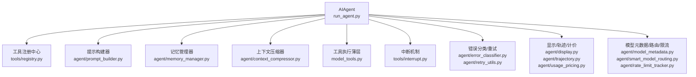
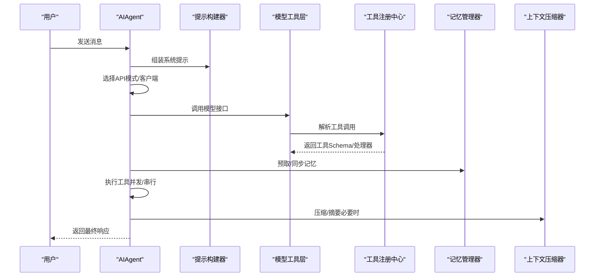
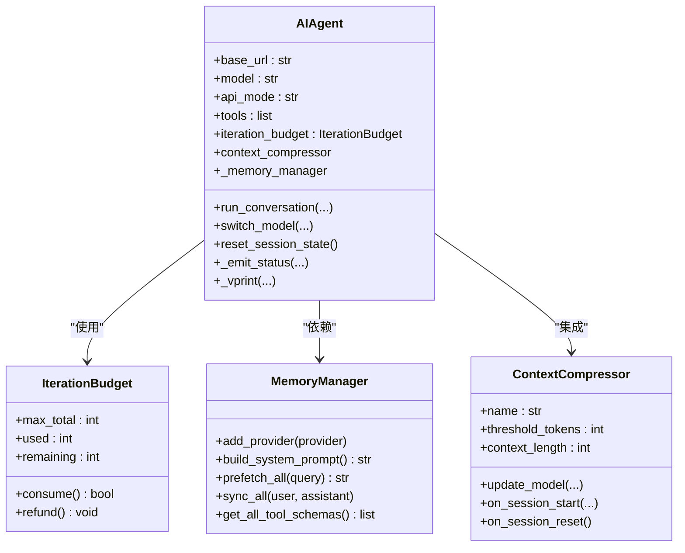
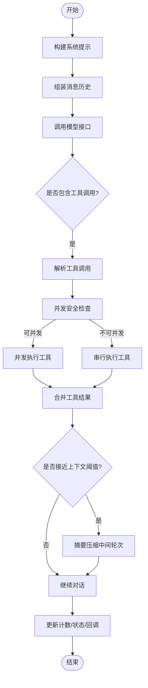
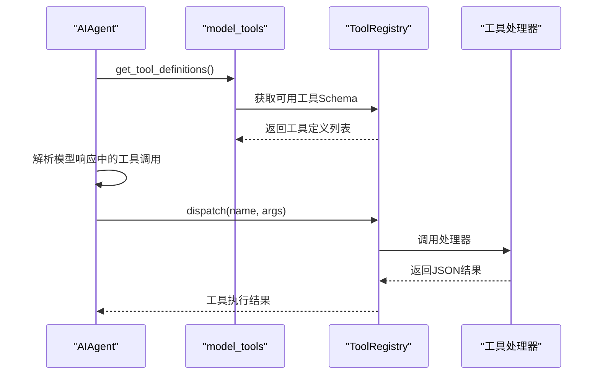
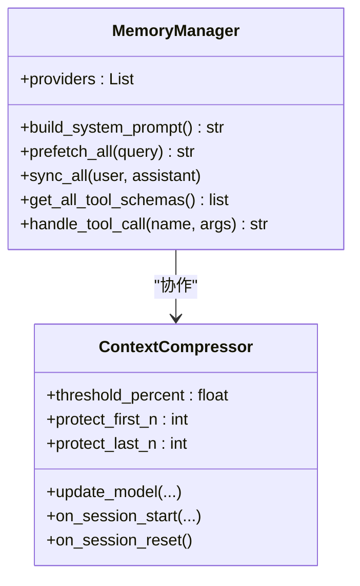
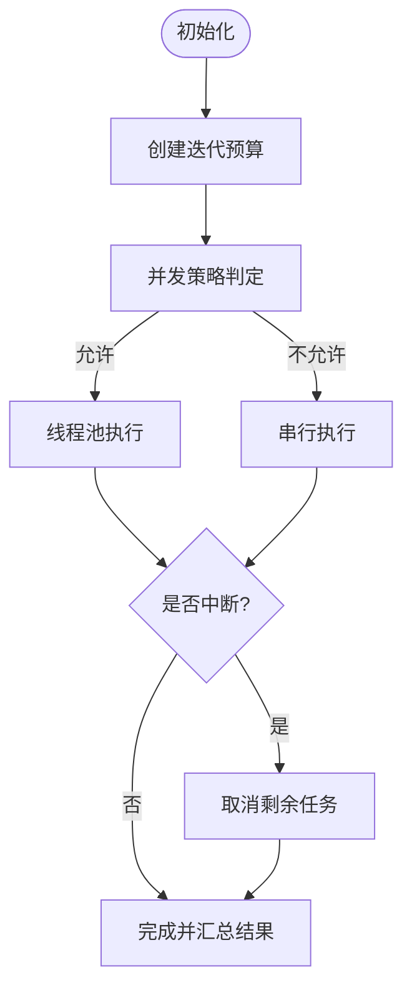

# 代理引擎架构

<cite>
**本文引用的文件**
- [run_agent.py](file://run_agent.py)
- [agent/prompt_builder.py](file://agent/prompt_builder.py)
- [agent/memory_manager.py](file://agent/memory_manager.py)
- [agent/context_compressor.py](file://agent/context_compressor.py)
- [tools/registry.py](file://tools/registry.py)
- [model_tools.py](file://model_tools.py)
- [tools/interrupt.py](file://tools/interrupt.py)
- [agent/error_classifier.py](file://agent/error_classifier.py)
- [agent/retry_utils.py](file://agent/retry_utils.py)
- [agent/display.py](file://agent/display.py)
- [agent/trajectory.py](file://agent/trajectory.py)
- [agent/usage_pricing.py](file://agent/usage_pricing.py)
- [agent/model_metadata.py](file://agent/model_metadata.py)
- [agent/auxiliary_client.py](file://agent/auxiliary_client.py)
- [agent/subdirectory_hints.py](file://agent/subdirectory_hints.py)
- [agent/prompt_caching.py](file://agent/prompt_caching.py)
- [agent/smart_model_routing.py](file://agent/smart_model_routing.py)
- [agent/rate_limit_tracker.py](file://agent/rate_limit_tracker.py)
- [agent/redact.py](file://agent/redact.py)
- [agent/skill_utils.py](file://agent/skill_utils.py)
- [agent/title_generator.py](file://agent/title_generator.py)
- [agent/nous_rate_guard.py](file://agent/nous_rate_guard.py)
- [agent/google_oauth.py](file://agent/google_oauth.py)
- [agent/copilot_acp_client.py](file://agent/copilot_acp_client.py)
- [agent/credential_pool.py](file://agent/credential_pool.py)
- [agent/skill_commands.py](file://agent/skill_commands.py)
- [agent/skill_utils.py](file://agent/skill_utils.py)
- [agent/insights.py](file://agent/insights.py)
- [agent/anthropic_adapter.py](file://agent/anthropic_adapter.py)
- [agent/bedrock_adapter.py](file://agent/bedrock_adapter.py)
- [agent/gemini_cloudcode_adapter.py](file://agent/gemini_cloudcode_adapter.py)
- [agent/google_code_assist.py](file://agent/google_code_assist.py)
- [agent/context_engine.py](file://agent/context_engine.py)
- [agent/context_references.py](file://agent/context_references.py)
- [agent/manual_compression_feedback.py](file://agent/manual_compression_feedback.py)
- [agent/models_dev.py](file://agent/models_dev.py)
- [agent/gemini_cloudcode_adapter.py](file://agent/gemini_cloudcode_adapter.py)
- [agent/google_code_assist.py](file://agent/google_code_assist.py)
- [agent/smart_model_routing.py](file://agent/smart_model_routing.py)
- [agent/rate_limit_tracker.py](file://agent/rate_limit_tracker.py)
- [agent/redact.py](file://agent/redact.py)
- [agent/skill_utils.py](file://agent/skill_utils.py)
- [agent/title_generator.py](file://agent/title_generator.py)
- [agent/nous_rate_guard.py](file://agent/nous_rate_guard.py)
- [agent/google_oauth.py](file://agent/google_oauth.py)
- [agent/copilot_acp_client.py](file://agent/copilot_acp_client.py)
- [agent/credential_pool.py](file://agent/credential_pool.py)
- [agent/skill_commands.py](file://agent/skill_commands.py)
- [agent/insights.py](file://agent/insights.py)
- [agent/anthropic_adapter.py](file://agent/anthropic_adapter.py)
- [agent/bedrock_adapter.py](file://agent/bedrock_adapter.py)
- [agent/gemini_cloudcode_adapter.py](file://agent/gemini_cloudcode_adapter.py)
- [agent/google_code_assist.py](file://agent/google_code_assist.py)
- [agent/context_engine.py](file://agent/context_engine.py)
- [agent/context_references.py](file://agent/context_references.py)
- [agent/manual_compression_feedback.py](file://agent/manual_compression_feedback.py)
- [agent/models_dev.py](file://agent/models_dev.py)
</cite>

## 目录
1. [引言](#引言)
2. [项目结构](#项目结构)
3. [核心组件](#核心组件)
4. [架构总览](#架构总览)
5. [详细组件分析](#详细组件分析)
6. [依赖分析](#依赖分析)
7. [性能考虑](#性能考虑)
8. [故障排查指南](#故障排查指南)
9. [结论](#结论)
10. [附录](#附录)

## 引言
本文件面向Hermes Agent代理引擎的架构设计与实现，围绕AIAgent类展开，系统阐述其对话循环机制、工具调用处理流程、消息管理、错误处理与状态管理，并深入解析并发安全、迭代预算控制与中断处理。同时，文档覆盖代理引擎与工具系统、记忆管理、提示构建器的交互关系，提供初始化、配置与运行过程的具体示例路径，并总结性能优化策略、内存管理与资源清理的最佳实践。

## 项目结构
Hermes Agent采用模块化分层设计：
- 核心运行时与对话循环：run_agent.py中的AIAgent类负责模型调用、工具调度、上下文压缩与会话状态维护。
- 工具系统：tools/registry.py集中注册与分发工具；model_tools.py作为工具发现与执行的薄层。
- 提示构建：agent/prompt_builder.py负责系统提示拼装（技能索引、平台提示、环境提示等）。
- 记忆管理：agent/memory_manager.py统一内置与外部插件记忆提供者。
- 上下文压缩：agent/context_compressor.py实现自动上下文压缩与摘要生成。
- 并发与中断：tools/interrupt.py提供线程级中断信号；run_agent.py内含迭代预算与并发工具批处理逻辑。
- 辅助模块：错误分类、重试、显示、轨迹、计价、元数据、路由、限流、脱敏、适配器等。

**图表来源**
- [run_agent.py:535-1160](file://run_agent.py#L535-L1160)
- [tools/registry.py:100-170](file://tools/registry.py#L100-L170)
- [agent/prompt_builder.py:1-120](file://agent/prompt_builder.py#L1-L120)
- [agent/memory_manager.py:83-150](file://agent/memory_manager.py#L83-L150)
- [agent/context_compressor.py:188-200](file://agent/context_compressor.py#L188-L200)
- [model_tools.py:1-120](file://model_tools.py#L1-L120)
- [tools/interrupt.py:1-77](file://tools/interrupt.py#L1-L77)
- [agent/error_classifier.py](file://agent/error_classifier.py)
- [agent/retry_utils.py](file://agent/retry_utils.py)
- [agent/display.py](file://agent/display.py)
- [agent/trajectory.py](file://agent/trajectory.py)
- [agent/usage_pricing.py](file://agent/usage_pricing.py)
- [agent/model_metadata.py](file://agent/model_metadata.py)
- [agent/smart_model_routing.py](file://agent/smart_model_routing.py)
- [agent/rate_limit_tracker.py](file://agent/rate_limit_tracker.py)

**章节来源**
- [run_agent.py:1-120](file://run_agent.py#L1-L120)
- [agent/prompt_builder.py:1-120](file://agent/prompt_builder.py#L1-L120)
- [agent/memory_manager.py:1-80](file://agent/memory_manager.py#L1-L80)
- [agent/context_compressor.py:1-60](file://agent/context_compressor.py#L1-L60)
- [tools/registry.py:1-80](file://tools/registry.py#L1-L80)
- [model_tools.py:1-80](file://model_tools.py#L1-L80)

## 核心组件
- AIAgent：代理引擎核心，负责初始化、对话循环、工具调度、上下文压缩、预算控制、错误处理与状态管理。
- 工具注册中心：集中注册工具Schema与处理器，支持可用性检查、异步桥接与动态刷新。
- 提示构建器：拼装系统提示，包含技能索引、平台提示、环境提示与缓存策略。
- 记忆管理器：统一内置与外部记忆提供者，提供预取、同步、工具路由与生命周期钩子。
- 上下文压缩器：基于辅助模型进行中段摘要，保护首尾上下文，按比例与预算控制摘要长度。
- 中断与并发：线程级中断信号，工具批处理并发执行与串行回退，迭代预算控制。

**章节来源**
- [run_agent.py:535-880](file://run_agent.py#L535-L880)
- [tools/registry.py:100-200](file://tools/registry.py#L100-L200)
- [agent/prompt_builder.py:580-800](file://agent/prompt_builder.py#L580-L800)
- [agent/memory_manager.py:83-150](file://agent/memory_manager.py#L83-L150)
- [agent/context_compressor.py:188-200](file://agent/context_compressor.py#L188-L200)
- [tools/interrupt.py:1-77](file://tools/interrupt.py#L1-L77)

## 架构总览
AIAgent通过“初始化—构建提示—选择API模式—模型调用—工具调度—上下文压缩—状态更新”的闭环实现智能对话与任务执行。工具系统以注册中心为核心，模型工具层负责发现与执行；记忆与上下文压缩在会话维度提供长期知识与窗口管理；并发与中断保障多线程安全与用户可控性。

**图表来源**
- [run_agent.py:1088-1110](file://run_agent.py#L1088-L1110)
- [agent/prompt_builder.py:580-800](file://agent/prompt_builder.py#L580-L800)
- [model_tools.py:196-220](file://model_tools.py#L196-L220)
- [tools/registry.py:292-310](file://tools/registry.py#L292-L310)
- [agent/memory_manager.py:178-220](file://agent/memory_manager.py#L178-L220)
- [agent/context_compressor.py:188-200](file://agent/context_compressor.py#L188-L200)

## 详细组件分析

### AIAgent类设计与职责
- 初始化阶段：解析API模式、构建客户端、加载工具、注入记忆与上下文引擎、设置日志与会话数据库、配置预算与提示缓存。
- 对话循环：构建消息历史、调用模型、解析工具调用、并发/串行执行、更新状态与计费、触发回调与进度通知。
- 错误处理：分类错误、重试与降级、模型切换、预算耗尽保护、压缩可行性检查与警告。
- 状态管理：会话计数器、活动追踪、速率限制、轨迹保存、检查点管理。

**图表来源**
- [run_agent.py:535-880](file://run_agent.py#L535-L880)
- [run_agent.py:1623-1661](file://run_agent.py#L1623-L1661)
- [run_agent.py:1662-1789](file://run_agent.py#L1662-L1789)
- [agent/memory_manager.py:83-150](file://agent/memory_manager.py#L83-L150)
- [agent/context_compressor.py:188-200](file://agent/context_compressor.py#L188-L200)

**章节来源**
- [run_agent.py:535-880](file://run_agent.py#L535-L880)
- [run_agent.py:1623-1789](file://run_agent.py#L1623-L1789)

### 对话循环机制
- 消息组装：系统提示（技能、平台、环境）、上下文文件、记忆块、用户消息与前序历史。
- API模式选择：根据提供商与模型自动推断chat_completions、codex_responses、anthropic_messages或bedrock_converse。
- 模型调用：构建请求参数（含最大输出、推理配置、提示缓存），处理响应（内容、工具调用、推理块、完成原因）。
- 工具调度：解析工具调用，按并发策略执行，串行回退，记录结果与耗时。
- 上下文压缩：接近阈值时对中间轮次进行摘要，保护首尾上下文，避免信息丢失。
- 状态更新：累计令牌、费用、API次数、活动追踪，持久化会话与轨迹。

**图表来源**
- [run_agent.py:1088-1110](file://run_agent.py#L1088-L1110)
- [run_agent.py:7472-7605](file://run_agent.py#L7472-L7605)
- [agent/context_compressor.py:188-200](file://agent/context_compressor.py#L188-L200)

**章节来源**
- [run_agent.py:7472-7605](file://run_agent.py#L7472-L7605)
- [agent/context_compressor.py:188-200](file://agent/context_compressor.py#L188-L200)

### 工具系统与执行
- 注册与发现：工具文件在导入时通过registry.register()自注册；model_tools统一发现与过滤。
- 可用性检查：按工具集要求检查环境变量与前置条件，动态启用/禁用工具集。
- 分发与执行：registry.dispatch根据名称分发到对应处理器，支持同步与异步桥接，异常捕获返回统一格式。
- 并发策略：基于工具类型与参数路径判断是否可并发，限制最大工作线程，避免竞态与冲突。

**图表来源**
- [model_tools.py:196-220](file://model_tools.py#L196-L220)
- [tools/registry.py:258-286](file://tools/registry.py#L258-L286)
- [tools/registry.py:292-310](file://tools/registry.py#L292-L310)

**章节来源**
- [model_tools.py:1-120](file://model_tools.py#L1-L120)
- [tools/registry.py:100-200](file://tools/registry.py#L100-L200)

### 记忆管理与上下文引擎
- 内置与外部记忆提供者统一管理，支持预取、同步、工具路由与生命周期钩子。
- 上下文压缩器可插拔，默认实现基于辅助模型进行摘要，保护首尾上下文，支持迭代更新与预算控制。
- 记忆块注入：从提供者输出中提取并封装为模型不可误判的上下文围栏，避免混淆。

**图表来源**
- [agent/memory_manager.py:83-150](file://agent/memory_manager.py#L83-L150)
- [agent/context_compressor.py:188-200](file://agent/context_compressor.py#L188-L200)

**章节来源**
- [agent/memory_manager.py:83-150](file://agent/memory_manager.py#L83-L150)
- [agent/context_compressor.py:188-200](file://agent/context_compressor.py#L188-L200)

### 错误处理与重试
- 错误分类：根据API响应与错误码分类，决定重试、降级或切换模型。
- 重试策略：抖动退避、指数回退、超时控制，避免雪崩。
- 失败保护：预算耗尽注入提示、压缩可行性检查、降级模型链路。

**章节来源**
- [agent/error_classifier.py](file://agent/error_classifier.py)
- [agent/retry_utils.py](file://agent/retry_utils.py)

### 并发安全、迭代预算与中断
- 并发安全：线程池执行工具，线程本地事件循环，避免“事件循环已关闭”问题；工具批处理基于工具类型与路径判定并发安全性。
- 迭代预算：每个代理独立预算，父/子代理独立计数，execute_code迭代可退款，防止无限循环。
- 中断处理：线程级中断信号，支持用户输入与外部信号中断当前工具执行，避免阻塞。

**图表来源**
- [run_agent.py:170-238](file://run_agent.py#L170-L238)
- [run_agent.py:7472-7605](file://run_agent.py#L7472-L7605)
- [tools/interrupt.py:1-77](file://tools/interrupt.py#L1-L77)

**章节来源**
- [run_agent.py:170-238](file://run_agent.py#L170-L238)
- [run_agent.py:7472-7605](file://run_agent.py#L7472-L7605)
- [tools/interrupt.py:1-77](file://tools/interrupt.py#L1-L77)

### 与工具系统、记忆管理、提示构建器的交互
- 工具系统：AIAgent在初始化时加载工具Schema，运行时解析模型响应中的工具调用并分发执行。
- 记忆管理：在每轮开始前预取记忆，在轮次结束后同步，注入记忆工具Schema到工具表面。
- 提示构建器：拼装系统提示，包含技能索引、平台提示、环境提示与缓存策略，支持缓存控制与提示稳定性。

**章节来源**
- [run_agent.py:1088-1110](file://run_agent.py#L1088-L1110)
- [agent/memory_manager.py:1309-1330](file://agent/memory_manager.py#L1309-L1330)
- [agent/prompt_builder.py:580-800](file://agent/prompt_builder.py#L580-L800)

### 代理引擎的初始化、配置与运行示例路径
- 初始化：构造函数参数包括base_url、api_key、provider、api_mode、模型名、工具延迟、工具集过滤、保存轨迹、静默模式、平台与用户ID、会话数据库、迭代预算、回退模型、凭证池、检查点等。
- 配置：通过配置文件读取记忆、技能、压缩、模型上下文长度等；自动检测Ollama上下文；设置提示缓存与推理配置。
- 运行：run_conversation入口，内部调用模型接口、解析工具调用、执行工具、压缩上下文、更新状态与回调。

**章节来源**
- [run_agent.py:552-610](file://run_agent.py#L552-L610)
- [run_agent.py:800-1120](file://run_agent.py#L800-L1120)
- [run_agent.py:1120-1180](file://run_agent.py#L1120-L1180)

## 依赖分析
- 模块耦合：AIAgent高度内聚于run_agent.py，通过工具注册中心与提示构建器解耦；记忆管理器与上下文压缩器作为可插拔组件。
- 外部依赖：OpenAI客户端、Anthropic SDK、AWS Bedrock、OpenRouter、本地模型端点；工具系统依赖异步事件循环与线程池。
- 循环依赖：工具注册中心无对工具文件的直接导入，通过动态导入与AST扫描发现工具模块，避免循环导入。

```mermaid
graph TB
RA["run_agent.py"] --> REG["tools/registry.py"]
RA --> PB["agent/prompt_builder.py"]
RA --> MM["agent/memory_manager.py"]
RA --> CC["agent/context_compressor.py"]
RA --> MT["model_tools.py"]
RA --> INT["tools/interrupt.py"]
RA --> ERR["agent/error_classifier.py"]
RA --> RET["agent/retry_utils.py"]
RA --> DIS["agent/display.py"]
RA --> TRJ["agent/trajectory.py"]
RA --> PR["agent/usage_pricing.py"]
RA --> MD["agent/model_metadata.py"]
RA --> SR["agent/smart_model_routing.py"]
RA --> RL["agent/rate_limit_tracker.py"]
```

**图表来源**
- [run_agent.py:63-98](file://run_agent.py#L63-L98)
- [tools/registry.py:1-40](file://tools/registry.py#L1-L40)
- [model_tools.py:23-33](file://model_tools.py#L23-L33)

**章节来源**
- [run_agent.py:63-98](file://run_agent.py#L63-L98)
- [tools/registry.py:1-40](file://tools/registry.py#L1-L40)
- [model_tools.py:23-33](file://model_tools.py#L23-L33)

## 性能考虑
- 工具并发：基于工具类型与路径的安全性判定，限制最大工作线程，避免过度竞争；对只读工具与路径隔离工具进行并发优化。
- 上下文压缩：按比例与预算控制摘要长度，保护首尾上下文，减少昂贵的LLM调用；辅助模型上下文需大于阈值，否则压缩失败或截断。
- 事件循环：持久化事件循环避免“事件循环已关闭”，提升异步工具执行稳定性；线程本地存储避免跨线程冲突。
- 日志与回调：静默模式抑制非必要输出，避免干扰协议流；回调粒度控制减少冗余渲染。
- 缓存与提示：提示缓存与推理配置按模型与提供商自动启用，降低重复成本。

**章节来源**
- [run_agent.py:214-338](file://run_agent.py#L214-L338)
- [run_agent.py:1895-1993](file://run_agent.py#L1895-L1993)
- [model_tools.py:39-126](file://model_tools.py#L39-L126)

## 故障排查指南
- 工具不可用：检查工具集可用性与环境变量要求；查看工具注册中心的可用工具集与需求。
- 压缩失败：确认辅助压缩模型上下文窗口大于主模型阈值；调整压缩阈值或更换更大模型。
- 中断无效：确认线程ID正确传递至set_interrupt；检查工具是否支持is_interrupted查询。
- 令牌计数异常：核对会话数据库写入与计数器重置逻辑；检查API响应头中的速率限制状态。
- 模型切换失败：核对新模型/提供商的API模式与认证；确保客户端重建成功。

**章节来源**
- [tools/registry.py:352-370](file://tools/registry.py#L352-L370)
- [run_agent.py:1895-1993](file://run_agent.py#L1895-L1993)
- [tools/interrupt.py:24-48](file://tools/interrupt.py#L24-L48)
- [run_agent.py:1623-1661](file://run_agent.py#L1623-L1661)
- [agent/rate_limit_tracker.py](file://agent/rate_limit_tracker.py)

## 结论
Hermes Agent代理引擎以AIAgent为核心，通过模块化的工具系统、记忆管理与上下文压缩，实现了高鲁棒性的对话与任务执行。并发安全、迭代预算与中断机制保障了长对话与复杂任务的可控性；提示构建与模型元数据增强了跨提供商的适配能力。遵循本文的配置与运行示例路径，结合性能优化与故障排查建议，可在多平台与多场景下稳定落地。

## 附录
- 关键实现路径参考：
  - [AIAgent初始化与配置:552-610](file://run_agent.py#L552-L610)
  - [工具定义与执行:196-220](file://model_tools.py#L196-L220)
  - [工具注册与分发:258-310](file://tools/registry.py#L258-L310)
  - [提示构建与缓存:580-800](file://agent/prompt_builder.py#L580-L800)
  - [记忆管理与工具注入:1309-1330](file://agent/memory_manager.py#L1309-L1330)
  - [上下文压缩与摘要:188-200](file://agent/context_compressor.py#L188-L200)
  - [并发与中断:7472-7605](file://run_agent.py#L7472-L7605)
  - [错误分类与重试](file://agent/error_classifier.py)
  - [迭代预算:170-238](file://run_agent.py#L170-L238)
  - [速率限制与计价](file://agent/rate_limit_tracker.py)
  - [模型元数据与路由](file://agent/model_metadata.py)
  - [智能模型路由](file://agent/smart_model_routing.py)