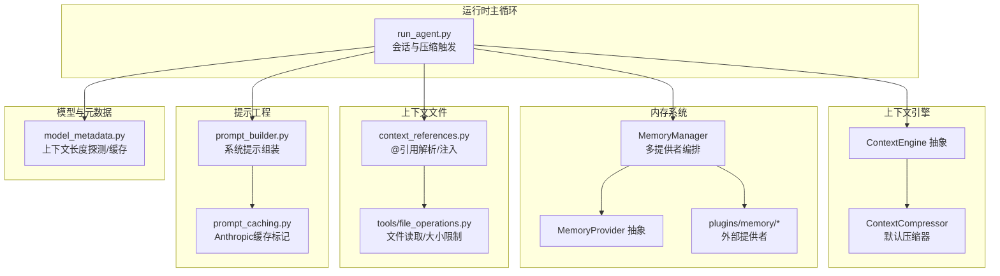
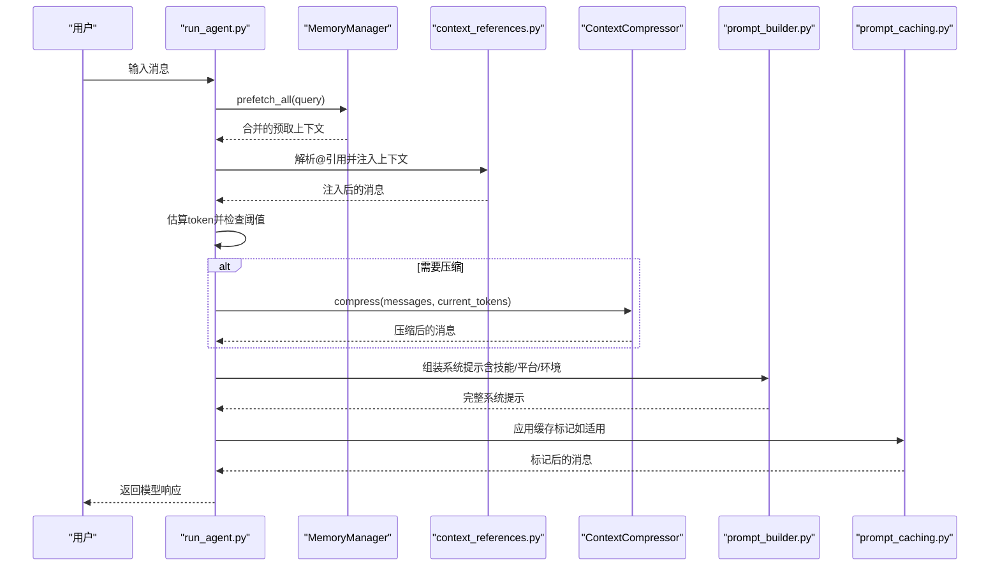
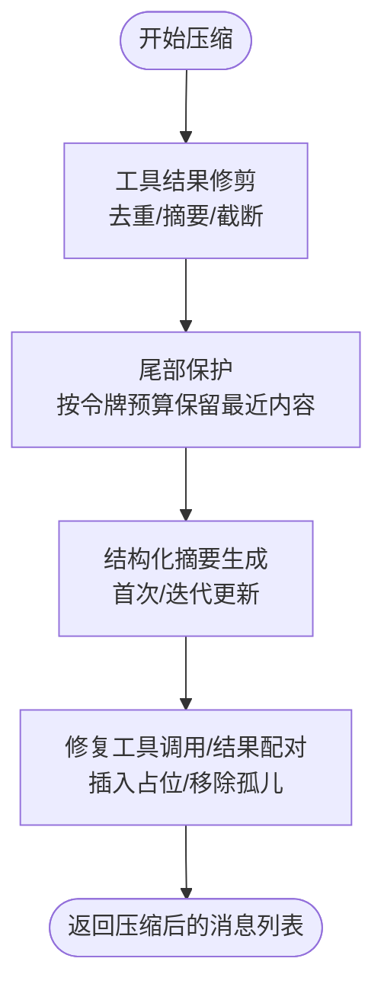
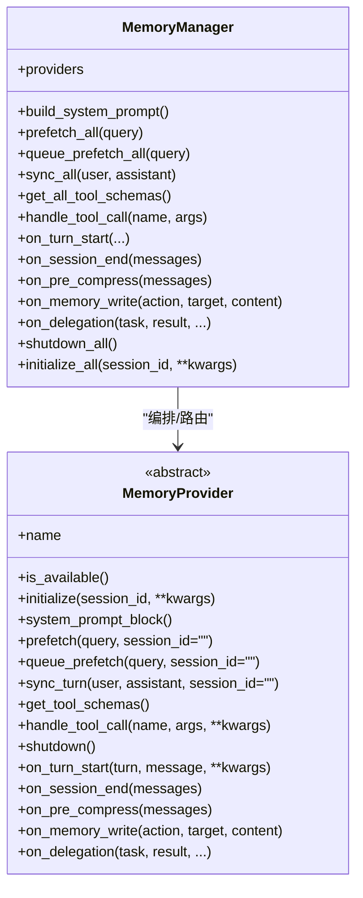
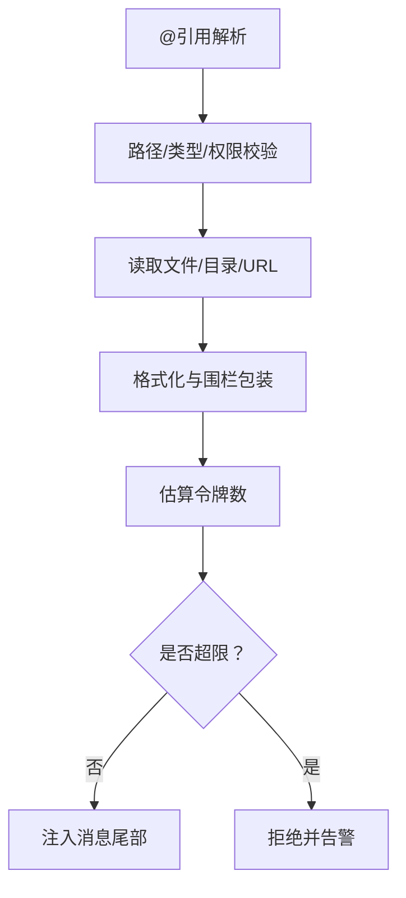
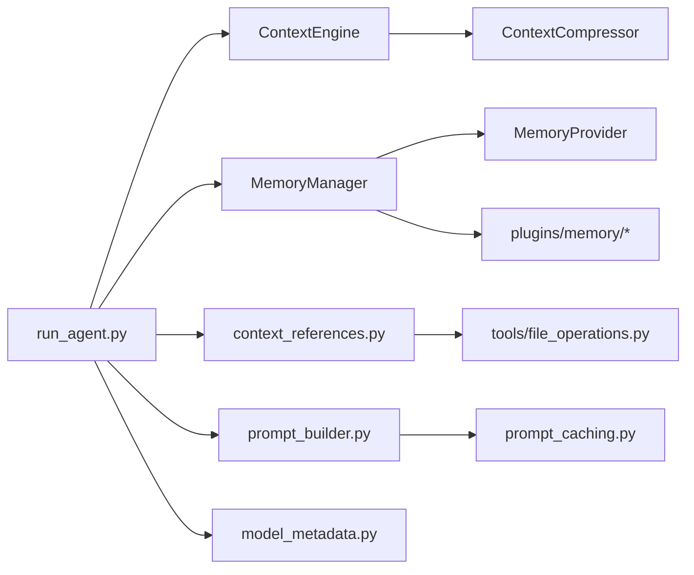

# 内存与上下文集成

<cite>
**本文引用的文件**
- [run_agent.py](file://run_agent.py)
- [context_engine.py](file://agent/context_engine.py)
- [context_compressor.py](file://agent/context_compressor.py)
- [memory_manager.py](file://agent/memory_manager.py)
- [memory_provider.py](file://agent/memory_provider.py)
- [context_references.py](file://agent/context_references.py)
- [prompt_builder.py](file://agent/prompt_builder.py)
- [prompt_caching.py](file://agent/prompt_caching.py)
- [manual_compression_feedback.py](file://agent/manual_compression_feedback.py)
- [model_metadata.py](file://agent/model_metadata.py)
- [plugins/memory/__init__.py](file://plugins/memory/__init__.py)
- [plugins/context_engine/__init__.py](file://plugins/context_engine/__init__.py)
- [website/docs/developer-guide/context-engine-plugin.md](file://website/docs/developer-guide/context-engine-plugin.md)
- [website/docs/user-guide/features/memory.md](file://website/docs/user-guide/features/memory.md)
- [plugins/memory/retaindb/__init__.py](file://plugins/memory/retaindb/__init__.py)
- [plugins/memory/holographic/__init__.py](file://plugins/memory/holographic/__init__.py)
- [plugins/memory/supermemory/plugin.yaml](file://plugins/memory/supermemory/plugin.yaml)
- [tools/file_operations.py](file://tools/file_operations.py)
- [tests/gateway/test_session_hygiene.py](file://tests/gateway/test_session_hygiene.py)
- [agent/insights.py](file://agent/insights.py)
- [agent/usage_pricing.py](file://agent/usage_pricing.py)
- [hermes_state.py](file://hermes_state.py)
</cite>

## 目录
1. [简介](#简介)
2. [项目结构](#项目结构)
3. [核心组件](#核心组件)
4. [架构总览](#架构总览)
5. [详细组件分析](#详细组件分析)
6. [依赖关系分析](#依赖关系分析)
7. [性能考量](#性能考量)
8. [故障排查指南](#故障排查指南)
9. [结论](#结论)
10. [附录](#附录)

## 简介
本文件面向Hermes Agent的“内存与上下文集成”子系统，系统化阐述以下主题：
- 记忆检索、上下文压缩与提示工程的端到端流程
- 上下文文件的解析、注入、格式转换与大小限制
- 外部与内置记忆提供者的注册、生命周期与工具桥接
- 上下文压缩算法：重要性评估、冗余检测与信息保留策略
- 内存优化策略、缓存机制与性能调优最佳实践

目标是帮助开发者与使用者在不深入源码的前提下，理解并高效使用该系统；同时为需要扩展或定制的高级用户提供可操作的参考路径。

## 项目结构
围绕“内存与上下文”的关键模块分布如下：
- 上下文引擎与压缩：agent/context_engine.py、agent/context_compressor.py
- 内存管理与提供者：agent/memory_manager.py、agent/memory_provider.py、plugins/memory/*
- 上下文文件与引用：agent/context_references.py、tools/file_operations.py
- 提示工程与缓存：agent/prompt_builder.py、agent/prompt_caching.py
- 模型元数据与预检：agent/model_metadata.py
- 插件与配置：plugins/context_engine/*、website文档

图示来源
- [run_agent.py](file://run_agent.py)
- [context_engine.py](file://agent/context_engine.py)
- [context_compressor.py](file://agent/context_compressor.py)
- [memory_manager.py](file://agent/memory_manager.py)
- [memory_provider.py](file://agent/memory_provider.py)
- [context_references.py](file://agent/context_references.py)
- [prompt_builder.py](file://agent/prompt_builder.py)
- [prompt_caching.py](file://agent/prompt_caching.py)
- [model_metadata.py](file://agent/model_metadata.py)
- [plugins/memory/__init__.py](file://plugins/memory/__init__.py)

章节来源
- [run_agent.py](file://run_agent.py)
- [context_engine.py](file://agent/context_engine.py)
- [context_compressor.py](file://agent/context_compressor.py)
- [memory_manager.py](file://agent/memory_manager.py)
- [memory_provider.py](file://agent/memory_provider.py)
- [context_references.py](file://agent/context_references.py)
- [prompt_builder.py](file://agent/prompt_builder.py)
- [prompt_caching.py](file://agent/prompt_caching.py)
- [model_metadata.py](file://agent/model_metadata.py)
- [plugins/memory/__init__.py](file://plugins/memory/__init__.py)

## 核心组件
- 上下文引擎（ContextEngine）：定义压缩触发、压缩执行、工具暴露与状态跟踪的抽象接口。默认实现为ContextCompressor。
- 上下文压缩器（ContextCompressor）：基于损失性摘要的压缩器，包含工具结果修剪、尾部保护、结构化摘要模板与迭代更新等策略。
- 内存管理器（MemoryManager）：统一编排内置与最多一个外部记忆提供者，负责系统提示拼装、预取召回、同步写入、工具路由与生命周期钩子。
- 记忆提供者（MemoryProvider）：插件化的记忆后端接口，支持初始化、系统提示块、预取、同步、工具schema与回调钩子。
- 上下文文件与引用（context_references.py、tools/file_operations.py）：解析@file/@folder/@git/@url等引用，进行安全校验、格式化与大小限制。
- 提示工程与缓存（prompt_builder.py、prompt_caching.py）：系统提示组装、技能索引、平台环境提示与Anthropic缓存标记。
- 模型元数据（model_metadata.py）：上下文长度探测、缓存、错误解析与本地服务识别，支撑预检与阈值计算。

章节来源
- [context_engine.py](file://agent/context_engine.py)
- [context_compressor.py](file://agent/context_compressor.py)
- [memory_manager.py](file://agent/memory_manager.py)
- [memory_provider.py](file://agent/memory_provider.py)
- [context_references.py](file://agent/context_references.py)
- [prompt_builder.py](file://agent/prompt_builder.py)
- [prompt_caching.py](file://agent/prompt_caching.py)
- [model_metadata.py](file://agent/model_metadata.py)

## 架构总览
Hermes Agent在每次对话回合中，按以下顺序集成内存与上下文：
1) 预取阶段：从MemoryManager聚合各提供者的预取上下文，并通过context_references注入@引用内容。
2) 压缩检查：根据当前消息粗估token数与模型上下文阈值，决定是否触发压缩。
3) 压缩执行：ContextCompressor对中间轮次进行工具结果修剪、尾部保护与结构化摘要，必要时迭代更新摘要。
4) 提示构建：prompt_builder拼装系统提示（含技能索引、平台/环境提示、内存提供者静态块），结合MemoryManager注入的记忆块。
5) 缓存标记：对Anthropic模型应用prompt_caching策略以降低输入token成本。
6) 发送请求：将最终消息序列提交给模型，更新引擎状态与token计数。

图示来源
- [run_agent.py](file://run_agent.py)
- [memory_manager.py](file://agent/memory_manager.py)
- [context_references.py](file://agent/context_references.py)
- [context_compressor.py](file://agent/context_compressor.py)
- [prompt_builder.py](file://agent/prompt_builder.py)
- [prompt_caching.py](file://agent/prompt_caching.py)

## 详细组件分析

### 上下文压缩器（ContextCompressor）
- 触发与阈值：基于模型上下文长度与阈值百分比动态计算阈值，避免频繁压缩。
- 工具结果修剪：将大体积工具输出替换为1行摘要，去重重复结果，截断长参数，减少token占用。
- 尾部保护：采用“令牌预算优先”的尾部保护策略，确保最新交互内容得到保留。
- 结构化摘要：使用模板化结构（目标、进展、决策、问题、文件、剩余工作等）生成摘要，支持首次总结与迭代更新。
- 迭代更新：在多次压缩中复用先前摘要，逐步合并新进展，提升连贯性。
- 错误处理：摘要模型不可用时进入冷却期或回退至主模型，避免无限增长。

图示来源
- [context_compressor.py](file://agent/context_compressor.py)

章节来源
- [context_compressor.py](file://agent/context_compressor.py)
- [manual_compression_feedback.py](file://agent/manual_compression_feedback.py)

### 内存管理与提供者
- MemoryManager职责
  - 注册与约束：内置提供者始终在前，最多仅允许一个外部提供者。
  - 系统提示拼装：收集各提供者的静态提示块。
  - 预取与队列：在每轮前拉取上下文，支持后台预取队列。
  - 同步与工具路由：每轮结束后异步写入，按工具名路由到对应提供者。
  - 生命周期钩子：turn开始、会话结束、压缩前、委托完成、关闭等。
- MemoryProvider接口
  - 必选：可用性检查、初始化、系统提示块、预取、队列预取、同步、工具schema、处理工具调用。
  - 可选：turn开始、会话结束、压缩前、镜像内置写入、委托观察等。
- 外部提供者发现与加载
  - 通过plugins/memory目录扫描与加载，支持内置与用户安装两种来源，内置优先覆盖。

图示来源
- [memory_manager.py](file://agent/memory_manager.py)
- [memory_provider.py](file://agent/memory_provider.py)
- [plugins/memory/__init__.py](file://plugins/memory/__init__.py)

章节来源
- [memory_manager.py](file://agent/memory_manager.py)
- [memory_provider.py](file://agent/memory_provider.py)
- [plugins/memory/__init__.py](file://plugins/memory/__init__.py)
- [website/docs/user-guide/features/memory.md](file://website/docs/user-guide/features/memory.md)

### 上下文文件处理与注入
- 引用语法：支持@file、@folder、@diff、@staged、@git、@url等，自动解析路径、行号范围与URL。
- 安全与大小限制：禁止敏感路径与二进制文件；对注入内容进行令牌预算评估，超过软/硬上限会警告或拒绝。
- 文件读取与格式化：统一编码读取，按扩展名选择代码围栏语言；目录列出受rg/fallback策略控制。
- 令牌估算：使用字符与内容块估算注入内容的token数量，用于预检与限流。

图示来源
- [context_references.py](file://agent/context_references.py)
- [tools/file_operations.py](file://tools/file_operations.py)

章节来源
- [context_references.py](file://agent/context_references.py)
- [tools/file_operations.py](file://tools/file_operations.py)

### 提示工程与缓存
- 系统提示组装：包含身份、工具使用强制、平台/环境提示、技能索引、内存指导等模块化片段。
- 技能索引缓存：两级缓存（进程内LRU + 磁盘快照），加速冷启动与跨进程复用。
- Anthropic缓存：对系统提示与最后N条非系统消息添加cache_control断点，显著降低输入token成本。

章节来源
- [prompt_builder.py](file://agent/prompt_builder.py)
- [prompt_caching.py](file://agent/prompt_caching.py)

### 模型元数据与预检
- 上下文长度探测：支持OpenRouter、models.dev、自定义端点、本地服务器（Ollama/LM Studio/llama.cpp/vLLM）探测与缓存。
- 错误解析：从API错误文本提取实际上下文限制与可用输出token，辅助动态调整策略。
- 预检与阈值：在API调用前基于历史消息粗估token，结合阈值触发压缩，避免越界。

章节来源
- [model_metadata.py](file://agent/model_metadata.py)
- [run_agent.py](file://run_agent.py)

### 上下文引擎插件化
- ContextEngine抽象：定义名称、状态字段、压缩参数、生命周期钩子与工具schema。
- 默认实现：ContextCompressor作为内置压缩引擎。
- 插件机制：支持在plugins/context_engine/<name>/中开发替代引擎，需实现相同接口并通过配置启用。

章节来源
- [context_engine.py](file://agent/context_engine.py)
- [website/docs/developer-guide/context-engine-plugin.md](file://website/docs/developer-guide/context-engine-plugin.md)

## 依赖关系分析
- 组件耦合
  - run_agent.py依赖ContextEngine接口与MemoryManager，形成“策略+编排”的解耦。
  - ContextCompressor依赖model_metadata进行阈值与预算计算，依赖auxiliary client进行摘要生成。
  - MemoryManager依赖MemoryProvider抽象，通过工具schema路由到具体提供者。
  - 上下文文件处理独立于核心逻辑，通过context_references与tools/file_operations协作。
- 外部依赖
  - 外部记忆提供者通过plugins/memory目录加载，遵循统一接口。
  - 某些提供者（如retaindb、holographic、supermemory）提供显式工具schema，增强能力。

图示来源
- [run_agent.py](file://run_agent.py)
- [context_engine.py](file://agent/context_engine.py)
- [context_compressor.py](file://agent/context_compressor.py)
- [memory_manager.py](file://agent/memory_manager.py)
- [memory_provider.py](file://agent/memory_provider.py)
- [context_references.py](file://agent/context_references.py)
- [prompt_builder.py](file://agent/prompt_builder.py)
- [prompt_caching.py](file://agent/prompt_caching.py)
- [model_metadata.py](file://agent/model_metadata.py)
- [plugins/memory/__init__.py](file://plugins/memory/__init__.py)

## 性能考量
- 压缩策略
  - 工具结果修剪与摘要模板显著降低token占用，建议在压缩前先进行结果修剪。
  - 尾部保护采用“令牌预算”而非固定消息数，更贴合实际内容密度变化。
  - 迭代摘要减少重复信息，提升后续压缩效率。
- 预检与早停
  - 使用粗估token与阈值提前判断是否需要压缩，避免不必要的摘要调用。
  - 测试显示“高估触发但安全”的早停策略在接近模型上限前即启动压缩，保障稳定性。
- 缓存与索引
  - 技能索引缓存与磁盘快照减少重复扫描与组装开销。
  - Anthropic缓存标记将稳定部分标记为可缓存，输入token成本下降约75%。
- 成本与计费
  - 通过usage_pricing与insights模块估算与记录成本，便于运营与优化。

章节来源
- [tests/gateway/test_session_hygiene.py](file://tests/gateway/test_session_hygiene.py)
- [prompt_caching.py](file://agent/prompt_caching.py)
- [agent/insights.py](file://agent/insights.py)
- [agent/usage_pricing.py](file://agent/usage_pricing.py)

## 故障排查指南
- 压缩失败或摘要模型不可用
  - 现象：摘要生成异常，进入冷却期或回退至主模型。
  - 排查：检查摘要模型可用性与配置，确认回退逻辑生效。
- 上下文过大导致压缩耗尽
  - 现象：达到最大压缩尝试次数后仍超限，提示使用/new或手动压缩。
  - 排查：检查focus_topic设置、工具输出是否过大、是否需要更大摘要预算。
- 文件注入被拒
  - 现象：@引用注入被拒绝或警告，超出软/硬上限。
  - 排查：减少注入内容、拆分引用、避免二进制文件与敏感路径。
- 记忆提供者冲突或工具冲突
  - 现象：注册多个外部提供者被拒绝；工具名冲突。
  - 排查：确保仅启用一个外部提供者；检查工具schema唯一性。
- 令牌估算偏差
  - 现象：预估与实际差异较大。
  - 排查：关注测试中的“高估触发但安全”策略，适当提高阈值或降低预估倍率。

章节来源
- [run_agent.py](file://run_agent.py)
- [context_compressor.py](file://agent/context_compressor.py)
- [context_references.py](file://agent/context_references.py)
- [memory_manager.py](file://agent/memory_manager.py)

## 结论
Hermes Agent的内存与上下文集成通过“策略（压缩器）+编排（管理器）+注入（引用）+提示（工程）+元数据（探测）”的协同，实现了在长上下文场景下的稳定与高效。默认的ContextCompressor提供了成熟的压缩策略，MemoryManager保证了多提供者的有序协作，而上下文文件注入与提示缓存则进一步提升了实用性与成本效益。对于需要深度记忆或特定领域知识的用户，可通过外部记忆提供者插件扩展能力；对于追求极致性能的团队，可基于ContextEngine插件体系开发替代压缩策略。

## 附录
- 外部记忆提供者示例
  - retaindb：显式记忆工具schema（remember/forget），支持重要性与类型标注。
  - holographic：基于存储与检索的事实管理，支持时间衰减与权重。
  - supermemory：语义长程记忆与会话注入能力。
- 相关文档
  - 用户指南：memory.md，包含容量、速度、使用场景与配置说明。
  - 开发者指南：context-engine-plugin.md，介绍如何开发上下文引擎插件。

章节来源
- [plugins/memory/retaindb/__init__.py](file://plugins/memory/retaindb/__init__.py)
- [plugins/memory/holographic/__init__.py](file://plugins/memory/holographic/__init__.py)
- [plugins/memory/supermemory/plugin.yaml](file://plugins/memory/supermemory/plugin.yaml)
- [website/docs/user-guide/features/memory.md](file://website/docs/user-guide/features/memory.md)
- [website/docs/developer-guide/context-engine-plugin.md](file://website/docs/developer-guide/context-engine-plugin.md)