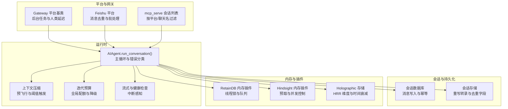
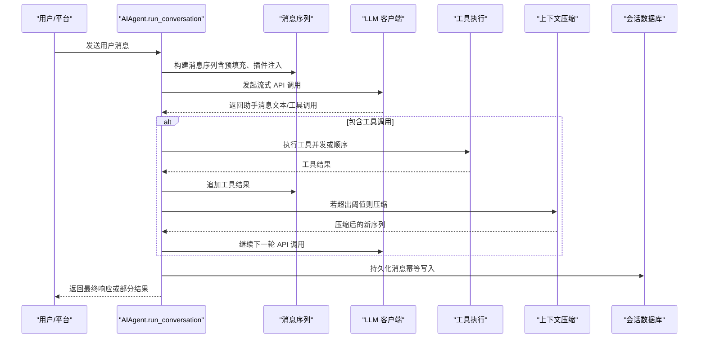
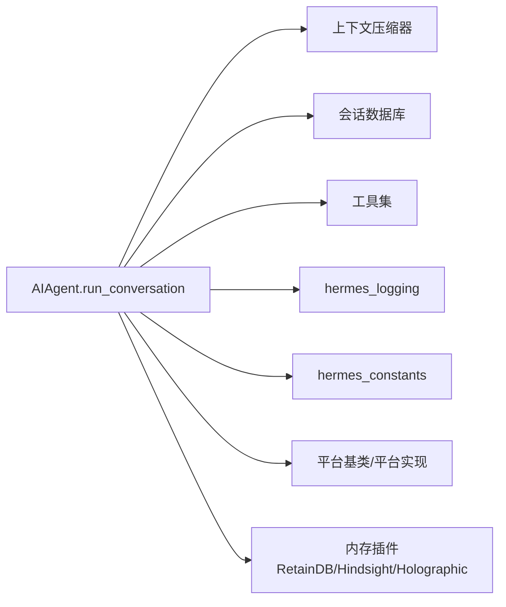

# 对话循环管理

<cite>
**本文引用的文件**
- [run_agent.py](file://run_agent.py)
- [test_413_compression.py](file://tests/run_agent/test_413_compression.py)
- [test_session.py](file://tests/gateway/test_session.py)
- [test_hermes_state.py](file://tests/test_hermes_state.py)
- [test_channel_directory.py](file://tests/gateway/test_channel_directory.py)
- [test_mem0_v2.py](file://tests/plugins/memory/test_mem0_v2.py)
- [test_hindsight_provider.py](file://tests/plugins/memory/test_hindsight_provider.py)
- [test_supermemory_provider.py](file://tests/plugins/memory/test_supermemory_provider.py)
- [test_agent_loop.py](file://tests/run_agent/test_agent_loop.py)
- [test_run_agent.py](file://tests/run_agent/test_run_agent.py)
- [test_tool_result_storage.py](file://tests/tools/test_tool_result_storage.py)
- [base.py](file://gateway/platforms/base.py)
- [feishu.py](file://gateway/platforms/feishu.py)
- [mcp_serve.py](file://mcp_serve.py)
- [agent_loop.py](file://environments/agent_loop.py)
- [hermes_state.py](file://hermes_state.py)
- [hermes_logging.py](file://hermes_logging.py)
- [hermes_constants.py](file://hermes_constants.py)
- [memory_store.db](file://plugins/memory/holographic/__init__.py)
- [retaindb/__init__.py](file://plugins/memory/retaindb/__init__.py)
- [hindsight/__init__.py](file://plugins/memory/hindsight/__init__.py)
</cite>

## 目录
1. [简介](#简介)
2. [项目结构](#项目结构)
3. [核心组件](#核心组件)
4. [架构总览](#架构总览)
5. [详细组件分析](#详细组件分析)
6. [依赖分析](#依赖分析)
7. [性能考量](#性能考量)
8. [故障排查指南](#故障排查指南)
9. [结论](#结论)
10. [附录](#附录)

## 简介
本文件系统性阐述 Hermes Agent 的对话循环管理系统，聚焦 AIAgent.run_conversation 方法的工作机理与工程实现，覆盖以下关键主题：
- 消息历史管理：消息序列构建、去重与持久化策略
- 上下文压缩：预飞行压缩、阈值触发与多轮压缩
- 迭代预算控制：全局迭代预算、配额耗尽的优雅降级
- 循环终止条件：完成、中断、错误与部分结果
- 并发安全：线程锁与竞态防护
- 历史持久化：会话数据库写入、去重与幂等
- 性能优化：请求前缀缓存、流式健康检查、ASCII 编码回退
- 错误处理：分类恢复、速率限制、413/400 上下文溢出、超时与资源回收

## 项目结构
Hermes Agent 的对话循环位于 run_agent.py 中的 AIAgent 类，围绕 run_conversation 展开。测试用例与平台层、内存插件、会话存储等模块共同构成完整的生命周期闭环。

图示来源
- [run_agent.py](file://run_agent.py)
- [base.py](file://gateway/platforms/base.py)
- [feishu.py](file://gateway/platforms/feishu.py)
- [mcp_serve.py](file://mcp_serve.py)
- [retaindb/__init__.py](file://plugins/memory/retaindb/__init__.py)
- [hindsight/__init__.py](file://plugins/memory/hindsight/__init__.py)
- [memory_store.db](file://plugins/memory/holographic/__init__.py)

章节来源
- [run_agent.py](file://run_agent.py)
- [base.py](file://gateway/platforms/base.py)
- [feishu.py](file://gateway/platforms/feishu.py)
- [mcp_serve.py](file://mcp_serve.py)

## 核心组件
- AIAgent.run_conversation：对话主循环入口，负责消息准备、API 调用、工具调用、上下文压缩、迭代预算与错误分类恢复。
- 上下文压缩器：在进入循环前进行预飞行压缩，并在运行中根据阈值与错误类型触发压缩。
- 迭代预算：全局 IterationBudget，用于限制父代与子代（子代理）共享的工具调用次数。
- 会话持久化：通过会话数据库确保消息幂等写入，避免重复写入与丢失。
- 并发与中断：RLock 保护客户端访问，线程级中断信号绑定当前执行线程，避免跨线程误伤。
- 流式与健康检查：优先使用流式接口以检测停滞流与超时，提升健壮性。

章节来源
- [run_agent.py](file://run_agent.py)

## 架构总览
对话循环从 run_conversation 开始，贯穿消息准备、API 调用、工具执行、上下文压缩、迭代预算与错误恢复，最终落盘到会话数据库。

图示来源
- [run_agent.py](file://run_agent.py)

## 详细组件分析

### AIAgent.run_conversation 工作原理
- 初始化与输入净化
  - 清理代理粘贴中的代理字符、剥离残留的记忆上下文标签，确保序列化安全。
  - 设置会话上下文日志标识，便于调试与观测。
- 预填充与系统提示缓存
  - 首次调用构建系统提示并缓存；后续继续会话复用缓存以保持前缀缓存命中。
  - 预填充消息在 API 调用时注入，不持久化。
- 预飞行上下文压缩
  - 当历史长度超过保护窗口且粗略估算超过阈值时，先进行压缩，避免首次调用即失败。
- 主循环与迭代预算
  - 在每次 API 调用前检查中断、迭代预算与配额耗尽的“宽限期”调用。
  - 记录活动状态与工具计数，支持网关超时监控与进度回调。
- 流式与健康检查
  - 默认走流式路径，具备 90 秒停滞检测与 60 秒读超时，非流式作为后备。
- 响应处理与工具调用
  - 解析 finish_reason，处理截断、推理预算耗尽、不完整思考块等特殊情况。
  - 工具调用校验与修复，无效名称自动修复，JSON 参数校验与截断检测。
- 上下文压缩与错误恢复
  - 分类错误（413、400 上下文溢出、429、长上下文门槛等），优先压缩或降低输出上限，必要时切换备用模型。
- 结果落盘与返回
  - 持久化消息序列，区分完成、中断、部分结果与失败场景，返回统一结构。

章节来源
- [run_agent.py](file://run_agent.py)

### 消息历史管理与去重机制
- 去重策略
  - 对连续的不完整助手消息，若内容、推理与加密推理项均相同，则合并，避免重复显示与存储。
  - 会话存储对“reasoning/reasoning_details/codex_reasoning_items”等字段进行序列化与还原，保证一致性。
- 序列化与持久化
  - 仅在会话数据库写入新消息，避免重复写入（基于上次写入索引追踪）。
  - 插件钩子与外部记忆预取结果注入到用户消息而非系统提示，保持系统提示稳定以维持前缀缓存。
- 会话边界与线程去重
  - 平台层按 chat_id 或 thread_id 去重，避免同一聊天的重复会话条目。

章节来源
- [run_agent.py](file://run_agent.py)
- [test_session.py](file://tests/gateway/test_session.py)
- [test_hermes_state.py](file://tests/test_hermes_state.py)
- [test_channel_directory.py](file://tests/gateway/test_channel_directory.py)

### 上下文压缩与阈值控制
- 预飞行压缩
  - 在进入主循环前，对现有历史进行粗略令牌估算，若超过阈值则先行压缩，减少首次失败概率。
- 运行中压缩
  - 针对 413（负载过大）、400 上下文溢出、长上下文门槛等错误，按策略逐步降低上下文或输出上限，最多尝试若干轮。
- 多轮压缩
  - 支持多次压缩以逐步缩小历史规模，压缩后重置相关重试计数，确保模型在新上下文中获得新鲜预算。

章节来源
- [run_agent.py](file://run_agent.py)
- [test_413_compression.py](file://tests/run_agent/test_413_compression.py)

### 迭代预算控制与循环终止
- 全局预算
  - 使用 IterationBudget 控制父代与所有子代共享的工具调用次数，配额耗尽后允许一次“宽限期”调用。
- 终止条件
  - 完成：模型 finish_reason 表示停止或工具调用结束。
  - 中断：用户发送新消息、/stop 命令或信号导致中断，立即跳出工具循环。
  - 错误：非可重试错误（如鉴权失败、模型不可用）直接回退备用模型或终止。
  - 部分结果：截断、压缩耗尽、推理预算耗尽等场景返回部分结果与错误信息。

章节来源
- [run_agent.py](file://run_agent.py)
- [test_agent_loop.py](file://tests/run_agent/test_agent_loop.py)
- [test_run_agent.py](file://tests/run_agent/test_run_agent.py)

### 并发安全与竞态防护
- 线程锁
  - 客户端访问使用 RLock，避免在流式 API 调用期间被其他线程打断。
  - 子代理管理使用 Lock 保护活跃子代列表与深度计数。
- 线程绑定中断
  - 将中断信号绑定到当前执行线程 ID，确保只影响当前线程，避免跨线程误伤。
- 内存插件并发
  - RetainDB/Hindsight 插件内部使用线程锁与后台线程，shutdown 时等待线程结束，避免资源泄漏。

章节来源
- [run_agent.py](file://run_agent.py)
- [retaindb/__init__.py](file://plugins/memory/retaindb/__init__.py)
- [hindsight/__init__.py](file://plugins/memory/hindsight/__init__.py)
- [test_supermemory_provider.py](file://tests/plugins/memory/test_supermemory_provider.py)

### 对话状态跟踪与持久化策略
- 状态跟踪
  - 记录最后活动时间戳、工具名、API 调用次数，供网关超时监控与“仍在工作”通知使用。
- 持久化
  - 会话数据库写入采用幂等策略，避免重复写入；当启动阶段创建会话失败但后续 ensure_session 成功时仍可追加消息。
  - 系统提示缓存复用，避免 Anthropic 前缀缓存失效。
- 转录与去重字段
  - reasoning、reasoning_details、codex_reasoning_items 等字段在持久化前后保持一致，确保转录一致性。

章节来源
- [run_agent.py](file://run_agent.py)
- [test_hermes_state.py](file://tests/test_hermes_state.py)

### 性能优化与内存优化
- 前缀缓存与消息规范化
  - Anthropic 提示缓存控制，减少输入成本；消息空白与工具参数 JSON 规范化以提升缓存命中率。
- 流式健康检查
  - 优先流式路径，具备停滞检测与读超时，避免长时间挂起。
- ASCII 编码回退
  - 检测 ASCII 编解码错误时，启用全载荷 ASCII 清洗并重试，保障低配置环境可用性。
- Turn 预算与工具结果裁剪
  - 工具结果按大小排序优先持久化，避免超预算导致的截断。

章节来源
- [run_agent.py](file://run_agent.py)
- [test_tool_result_storage.py](file://tests/tools/test_tool_result_storage.py)

### 错误处理策略、超时管理与资源释放
- 错误分类与恢复
  - 基于错误原因进行分类（413、400 上下文溢出、429、长上下文门槛、思考签名失效等），分别采取压缩、降低输出上限、切换备用模型、刷新凭据等策略。
- 超时与重试
  - 429 使用 Retry-After 或抖动指数回退；网络连接丢失等 SSE 断流提供可操作建议。
- 资源释放
  - 任务资源清理、会话持久化、线程关闭（插件与内存提供者）。

章节来源
- [run_agent.py](file://run_agent.py)
- [base.py](file://gateway/platforms/base.py)
- [feishu.py](file://gateway/platforms/feishu.py)

## 依赖分析
- AIAgent.run_conversation 依赖：
  - 上下文压缩器：触发压缩与阈值判断
  - 会话数据库：消息写入与系统提示缓存
  - 工具集：工具调用验证与执行
  - 日志与常量：会话上下文设置、HERMES_HOME 解析
  - 平台层：后台任务与人类延迟模拟
  - 内存插件：预取上下文与并发控制

图示来源
- [run_agent.py](file://run_agent.py)
- [hermes_logging.py](file://hermes_logging.py)
- [hermes_constants.py](file://hermes_constants.py)
- [base.py](file://gateway/platforms/base.py)
- [feishu.py](file://gateway/platforms/feishu.py)
- [retaindb/__init__.py](file://plugins/memory/retaindb/__init__.py)
- [hindsight/__init__.py](file://plugins/memory/hindsight/__init__.py)
- [memory_store.db](file://plugins/memory/holographic/__init__.py)

## 性能考量
- 请求前缀缓存：Anthropic 提示缓存控制显著降低输入成本。
- 流式健康检查：提前发现停滞与超时，避免长时间阻塞。
- ASCII 回退：在低配置环境中保障可用性。
- Turn 预算与工具结果裁剪：防止超预算导致的截断与重复写入。

## 故障排查指南
- 常见错误与对策
  - 413 负载过大：触发压缩，若无法进一步压缩则返回部分结果并提示使用 /new 或 /compress。
  - 400 上下文溢出：降低上下文或输出上限，必要时切换到较小上下文窗口模型。
  - 429/配额耗尽：尊重 Retry-After，或切换备用模型；对于 Nous 门户记录重置时间避免雪崩。
  - 推理预算耗尽：提示降低推理努力或提高最大输出令牌。
  - 思考签名失效：去除 reasoning_details 后重试一次。
  - ASCII 编码错误：启用全载荷 ASCII 清洗并重试。
- 超时与断流
  - SSE 断流：建议将大文件写入拆分为小段，或改用 execute_code。
- 资源泄漏
  - 确保插件线程在 shutdown 时 join，任务资源清理。

章节来源
- [run_agent.py](file://run_agent.py)
- [base.py](file://gateway/platforms/base.py)
- [feishu.py](file://gateway/platforms/feishu.py)
- [test_supermemory_provider.py](file://tests/plugins/memory/test_supermemory_provider.py)

## 结论
AIAgent.run_conversation 通过“预飞行压缩 + 运行中错误分类 + 迭代预算 + 流式健康检查 + 幂等持久化”的组合，实现了高鲁棒性的对话循环。其并发安全设计（RLock、线程绑定中断）与内存优化（前缀缓存、ASCII 回退、Turn 预算）在复杂场景下仍能保持稳定与高效。配合平台层与内存插件，形成从输入到落盘的完整闭环。

## 附录
- 会话列表查询与过滤
  - 支持按平台、聊天名、显示名与更新时间排序，限制数量返回。
- 会话边界与线程去重
  - 平台层按 chat_id/thread_id 去重，避免重复会话条目。

章节来源
- [mcp_serve.py](file://mcp_serve.py)
- [test_channel_directory.py](file://tests/gateway/test_channel_directory.py)