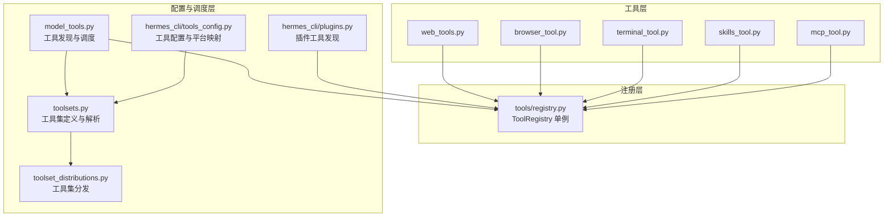
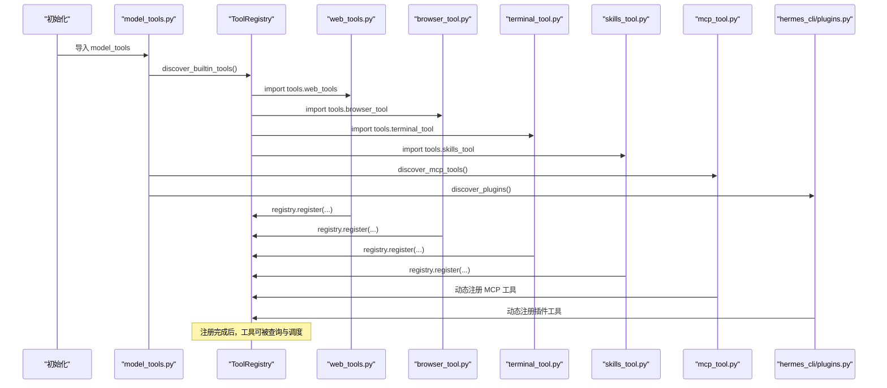
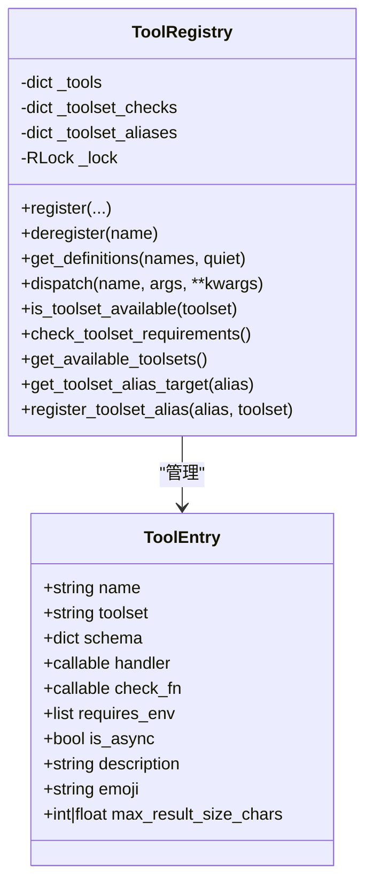
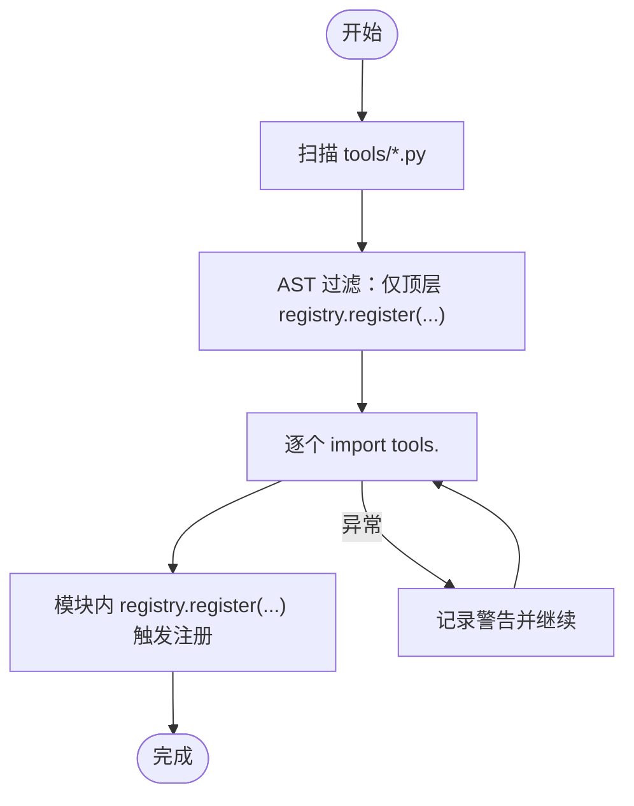
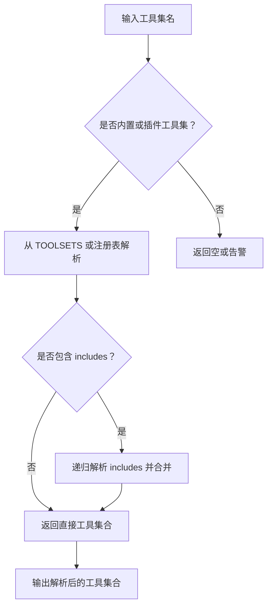
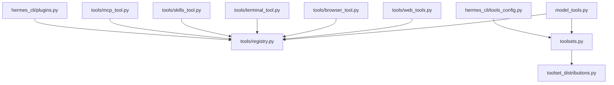

# 工具发现与注册机制

<cite>
**本文档引用的文件**
- [tools/registry.py](file://tools/registry.py)
- [model_tools.py](file://model_tools.py)
- [toolsets.py](file://toolsets.py)
- [toolset_distributions.py](file://toolset_distributions.py)
- [tools/web_tools.py](file://tools/web_tools.py)
- [tools/browser_tool.py](file://tools/browser_tool.py)
- [tools/terminal_tool.py](file://tools/terminal_tool.py)
- [tools/skills_tool.py](file://tools/skills_tool.py)
- [tools/mcp_tool.py](file://tools/mcp_tool.py)
- [hermes_cli/tools_config.py](file://hermes_cli/tools_config.py)
- [hermes_cli/plugins.py](file://hermes_cli/plugins.py)
</cite>

## 目录
1. [简介](#简介)
2. [项目结构](#项目结构)
3. [核心组件](#核心组件)
4. [架构总览](#架构总览)
5. [详细组件分析](#详细组件分析)
6. [依赖关系分析](#依赖关系分析)
7. [性能考虑](#性能考虑)
8. [故障排除指南](#故障排除指南)
9. [结论](#结论)

## 简介
本文件系统性阐述 Hermes Agent 的工具发现与注册机制，覆盖以下主题：
- 工具系统的自动发现机制：工具文件扫描、元数据解析与动态加载流程
- 工具注册表的工作原理：工具定义验证、参数提取与类型检查
- 工具集（toolset）的概念与管理：工具集过滤、启用/禁用机制
- 工具元数据结构：参数定义、返回值规范与错误处理声明
- 实战示例：如何添加新工具、修改工具元数据与处理注册异常
- 性能优化策略与缓存机制

## 项目结构
Hermes Agent 将工具发现与注册分为三层：
- 工具层：具体工具模块（如 web_tools、browser_tool、terminal_tool 等），每个模块在导入时通过注册表进行自注册
- 注册层：集中注册表（tools/registry.py），负责收集工具的 schema、处理器与可用性检查
- 配置与调度层：模型工具适配器（model_tools.py）、工具集定义（toolsets.py）、分发配置（toolset_distributions.py）以及 CLI 配置（hermes_cli/tools_config.py）

图表来源
- [tools/registry.py:100-437](file://tools/registry.py#L100-L437)
- [model_tools.py:128-147](file://model_tools.py#L128-L147)
- [toolsets.py:68-397](file://toolsets.py#L68-L397)
- [toolset_distributions.py:29-220](file://toolset_distributions.py#L29-L220)
- [hermes_cli/tools_config.py:46-111](file://hermes_cli/tools_config.py#L46-L111)
- [hermes_cli/plugins.py:473-843](file://hermes_cli/plugins.py#L473-L843)

章节来源
- [tools/registry.py:100-437](file://tools/registry.py#L100-L437)
- [model_tools.py:128-147](file://model_tools.py#L128-L147)
- [toolsets.py:68-397](file://toolsets.py#L68-L397)
- [toolset_distributions.py:29-220](file://toolset_distributions.py#L29-L220)
- [hermes_cli/tools_config.py:46-111](file://hermes_cli/tools_config.py#L46-L111)
- [hermes_cli/plugins.py:473-843](file://hermes_cli/plugins.py#L473-L843)

## 核心组件
- 工具注册表（ToolRegistry）：集中存储工具条目（ToolEntry），提供注册、反注册、查询、可用性检查与调度等能力；支持线程安全快照读取与工具集别名映射
- 模型工具适配器（model_tools）：触发工具发现（内置、MCP、插件），构建工具定义（OpenAI 格式），执行工具调用
- 工具集系统（toolsets）：定义工具集（静态与动态），支持组合、解析与校验
- 工具集分发（toolset_distributions）：为批量任务定义工具集选择概率分布
- 工具实现（web_tools、browser_tool、terminal_tool、skills_tool）：各自在导入时完成注册，提供 handler 与 schema
- MCP 工具客户端（mcp_tool）：连接外部 MCP 服务器，动态发现并注册工具
- CLI 工具配置（hermes_cli/tools_config.py）：平台到工具集的映射与交互式配置

章节来源
- [tools/registry.py:76-437](file://tools/registry.py#L76-L437)
- [model_tools.py:128-200](file://model_tools.py#L128-L200)
- [toolsets.py:401-588](file://toolsets.py#L401-L588)
- [toolset_distributions.py:223-302](file://toolset_distributions.py#L223-L302)
- [tools/web_tools.py:1-200](file://tools/web_tools.py#L1-L200)
- [tools/browser_tool.py:1-200](file://tools/browser_tool.py#L1-L200)
- [tools/terminal_tool.py:1-200](file://tools/terminal_tool.py#L1-L200)
- [tools/skills_tool.py:1-200](file://tools/skills_tool.py#L1-L200)
- [tools/mcp_tool.py:1-200](file://tools/mcp_tool.py#L1-L200)
- [hermes_cli/tools_config.py:46-111](file://hermes_cli/tools_config.py#L46-L111)

## 架构总览
工具发现与注册的端到端流程如下：

图表来源
- [model_tools.py:128-147](file://model_tools.py#L128-L147)
- [tools/registry.py:56-73](file://tools/registry.py#L56-L73)
- [tools/web_tools.py:1-200](file://tools/web_tools.py#L1-L200)
- [tools/browser_tool.py:1-200](file://tools/browser_tool.py#L1-L200)
- [tools/terminal_tool.py:1-200](file://tools/terminal_tool.py#L1-L200)
- [tools/skills_tool.py:1-200](file://tools/skills_tool.py#L1-L200)
- [tools/mcp_tool.py:1-200](file://tools/mcp_tool.py#L1-L200)
- [hermes_cli/plugins.py:473-843](file://hermes_cli/plugins.py#L473-L843)

## 详细组件分析

### 工具注册表（ToolRegistry）
- 职责
  - 收集工具的 schema、处理器、可用性检查函数、环境变量需求、是否异步、描述与表情符号等元数据
  - 提供线程安全的注册/反注册、查询、可用性检查与调度
  - 维护工具集别名映射，支持 MCP 动态刷新场景下的稳定快照读取
- 关键接口
  - register：注册工具，避免同名冲突（尤其 MCP 重载）
  - deregister：移除工具，必要时清理工具集检查与别名
  - get_definitions：按工具名集合返回 OpenAI 格式的工具定义，自动过滤不可用工具
  - dispatch：根据名称调用工具处理器，统一异常捕获与错误格式化
  - is_toolset_available/check_toolset_requirements/get_available_toolsets：工具集可用性检查与汇总
- 并发与快照
  - 使用可重入锁保护状态变更
  - 读操作返回稳定快照，避免读写竞争导致的数据不一致

图表来源
- [tools/registry.py:76-110](file://tools/registry.py#L76-L110)
- [tools/registry.py:176-253](file://tools/registry.py#L176-L253)
- [tools/registry.py:258-327](file://tools/registry.py#L258-L327)
- [tools/registry.py:329-437](file://tools/registry.py#L329-L437)

章节来源
- [tools/registry.py:76-437](file://tools/registry.py#L76-L437)

### 自动发现机制（AST 扫描与动态导入）
- 发现策略
  - 使用 AST 解析工具目录下每个 Python 文件，仅匹配模块级顶层的 registry.register(...) 调用
  - 过滤掉 __init__.py、registry.py、mcp_tool.py 等非工具文件
  - 对匹配的模块执行 importlib.import_module，触发模块内注册逻辑
- 容错与性能
  - 单个模块导入失败不会阻断整体发现
  - 仅导入“自注册”模块，避免导入辅助模块造成不必要的开销

图表来源
- [tools/registry.py:41-73](file://tools/registry.py#L41-L73)

章节来源
- [tools/registry.py:41-73](file://tools/registry.py#L41-L73)

### 工具集（toolset）系统
- 定义与解析
  - 静态定义：toolsets.py 中的 TOOLSETS 字典，包含工具集描述、直接工具列表与包含的其他工具集
  - 动态扩展：来自插件与 MCP 的工具集，通过注册表别名与工具名映射补充
  - 解析算法：递归解析 includes，去重合并，支持环依赖检测与钻石依赖去重
- 工具集可用性
  - 基于工具集的 check_fn 判断整体可用性
  - 提供工具集要求清单（环境变量、检查函数等）用于 UI 展示与诊断

图表来源
- [toolsets.py:447-497](file://toolsets.py#L447-L497)
- [toolsets.py:519-588](file://toolsets.py#L519-L588)

章节来源
- [toolsets.py:68-397](file://toolsets.py#L68-L397)
- [toolsets.py:447-588](file://toolsets.py#L447-L588)

### 工具集分发（Distributions）
- 目的：为数据生成与评测场景定义工具集的选择概率，支持多工具集同时激活
- 特性：对每个工具集给出百分比概率，采样时独立判断是否包含该工具集；若未选中任何工具集，则强制选择最高概率者以保证至少一个工具集生效

章节来源
- [toolset_distributions.py:223-288](file://toolset_distributions.py#L223-L288)

### 模型工具适配器（model_tools）
- 发现阶段
  - 导入时触发 discover_builtin_tools，随后尝试发现 MCP 与插件工具
  - 构建向后兼容常量：TOOL_TO_TOOLSET_MAP、TOOLSET_REQUIREMENTS
- 调度阶段
  - get_tool_definitions：基于启用/禁用的工具集解析工具名集合，再通过注册表生成 OpenAI 格式工具定义
  - handle_function_call：根据名称调度工具，自动桥接同步/异步处理器

章节来源
- [model_tools.py:128-200](file://model_tools.py#L128-L200)

### 具体工具实现与注册示例
- web_tools：根据配置选择后端（Firecrawl、Parallel、Tavily、Exa），提供搜索、提取、抓取等工具；注册时声明 requires_env 与 check_fn
- browser_tool：本地/云浏览器自动化，支持多种云提供商；注册时声明工具集与可用性检查
- terminal_tool：本地/容器/云沙箱命令执行，含危险命令审批与磁盘使用预警；注册时声明工具集与可用性检查
- skills_tool：技能文档管理，注册时声明工具集与可用性检查
- mcp_tool：连接外部 MCP 服务器，动态发现并注册工具，支持别名与动态刷新

章节来源
- [tools/web_tools.py:1-200](file://tools/web_tools.py#L1-L200)
- [tools/browser_tool.py:1-200](file://tools/browser_tool.py#L1-L200)
- [tools/terminal_tool.py:1-200](file://tools/terminal_tool.py#L1-L200)
- [tools/skills_tool.py:1-200](file://tools/skills_tool.py#L1-L200)
- [tools/mcp_tool.py:1-200](file://tools/mcp_tool.py#L1-L200)

### CLI 工具配置与平台映射
- CONFIGURABLE_TOOLSETS：列出可在 CLI 中勾选的工具集及其显示标签
- PLATFORMS：平台到默认工具集的映射
- 与工具集解析配合，实现按平台启用/禁用工具集

章节来源
- [hermes_cli/tools_config.py:46-111](file://hermes_cli/tools_config.py#L46-L111)

## 依赖关系分析

图表来源
- [tools/registry.py:100-437](file://tools/registry.py#L100-L437)
- [model_tools.py:128-147](file://model_tools.py#L128-L147)
- [toolsets.py:68-397](file://toolsets.py#L68-L397)
- [toolset_distributions.py:29-220](file://toolset_distributions.py#L29-L220)
- [hermes_cli/tools_config.py:46-111](file://hermes_cli/tools_config.py#L46-L111)
- [hermes_cli/plugins.py:473-843](file://hermes_cli/plugins.py#L473-L843)

章节来源
- [tools/registry.py:100-437](file://tools/registry.py#L100-L437)
- [model_tools.py:128-147](file://model_tools.py#L128-L147)
- [toolsets.py:68-397](file://toolsets.py#L68-L397)
- [toolset_distributions.py:29-220](file://toolset_distributions.py#L29-L220)
- [hermes_cli/tools_config.py:46-111](file://hermes_cli/tools_config.py#L46-L111)
- [hermes_cli/plugins.py:473-843](file://hermes_cli/plugins.py#L473-L843)

## 性能考虑
- 发现阶段
  - AST 扫描仅针对顶层注册调用，避免导入无关模块
  - 异常捕获与日志记录，确保单个模块失败不影响整体发现
- 调度阶段
  - 注册表读操作采用快照，避免锁竞争
  - 同步/异步处理器统一桥接，减少重复事件循环创建
- 缓存与复用
  - 工具结果序列化辅助函数（tool_result/tool_error）减少重复 JSON 序列化
  - MCP 与插件工具发现仅在需要时触发，避免不必要的初始化

章节来源
- [tools/registry.py:258-327](file://tools/registry.py#L258-L327)
- [model_tools.py:81-126](file://model_tools.py#L81-L126)
- [tools/registry.py:456-483](file://tools/registry.py#L456-L483)

## 故障排除指南
- 工具不可用
  - 检查工具集的 check_fn 是否返回 True；查看注册表的可用性检查结果
  - 确认 requires_env 中的环境变量是否已正确设置
- 工具名未知
  - 确认工具是否成功注册（导入路径与模块名正确）
  - 检查工具集过滤是否导致工具被排除
- MCP 工具异常
  - 确认 MCP 服务器配置与网络连通性
  - 查看动态刷新与别名映射是否正确
- 插件工具缺失
  - 确认插件清单与工具注册回调是否正确执行

章节来源
- [tools/registry.py:352-433](file://tools/registry.py#L352-L433)
- [hermes_cli/plugins.py:473-843](file://hermes_cli/plugins.py#L473-L843)

## 结论
Hermes Agent 的工具发现与注册机制通过“自注册 + 集中注册表 + 工具集解析”的架构实现了高扩展性与强健性：
- 自动发现确保新增工具无需维护清单
- 注册表提供统一的元数据管理与并发安全
- 工具集系统支持灵活组合与动态扩展
- 分发机制为评测与数据生成提供了可控的工具集选择策略
- 性能方面通过快照读取、事件循环复用与缓存优化保障了运行效率