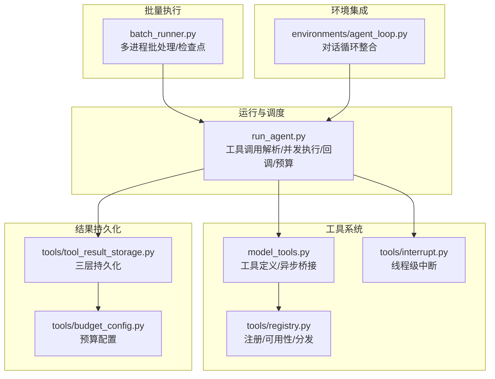
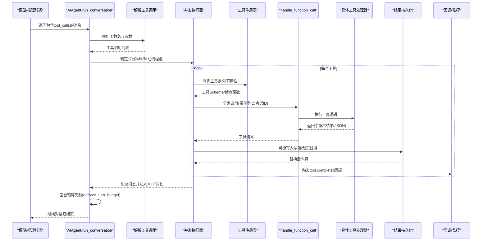
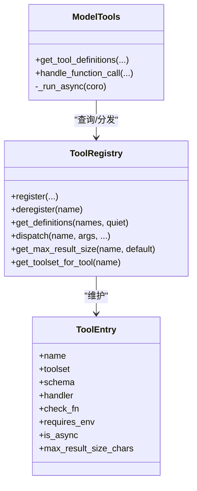
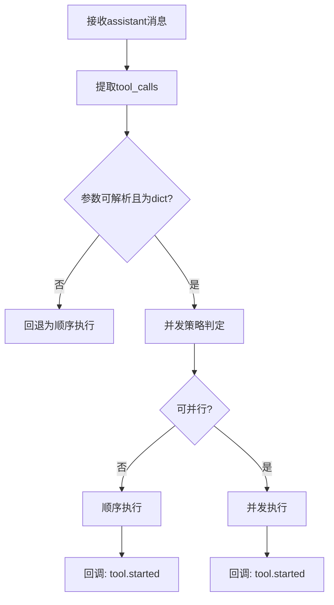
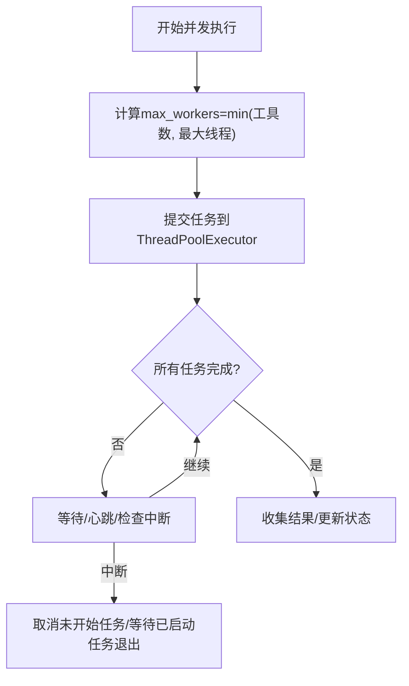
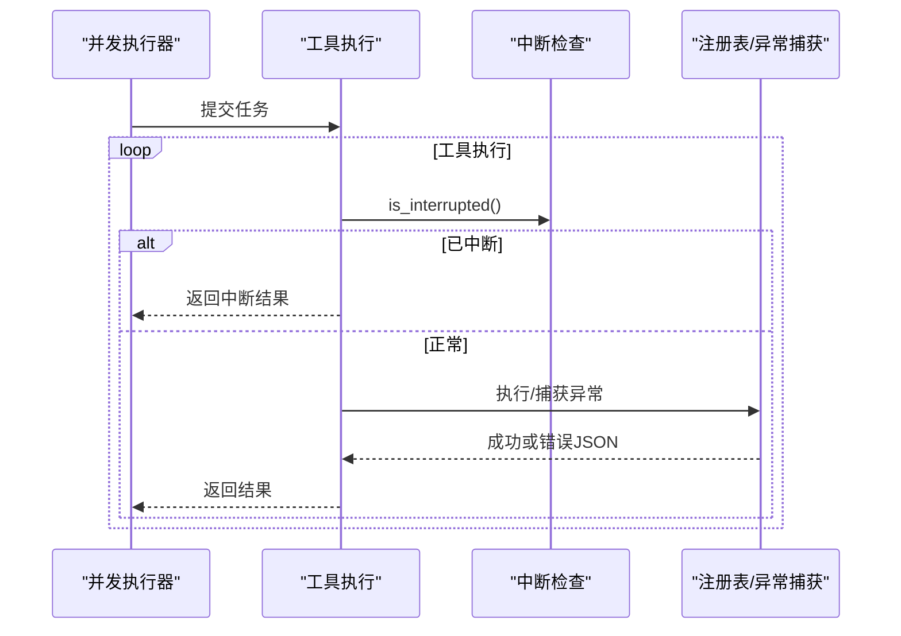
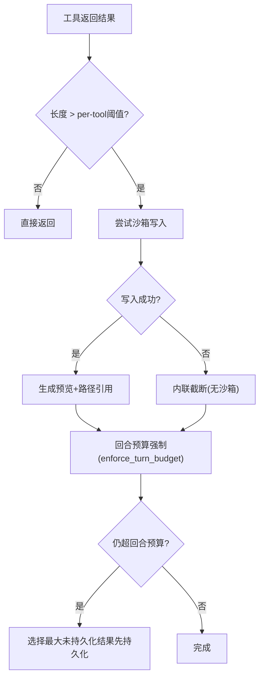
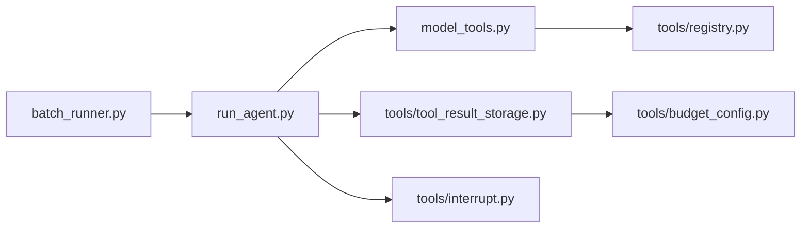

# 工具执行框架

<cite>
**本文档引用的文件**
- [run_agent.py](file://run_agent.py)
- [model_tools.py](file://model_tools.py)
- [tools/tool_result_storage.py](file://tools/tool_result_storage.py)
- [tools/budget_config.py](file://tools/budget_config.py)
- [tools/registry.py](file://tools/registry.py)
- [tools/interrupt.py](file://tools/interrupt.py)
- [batch_runner.py](file://batch_runner.py)
- [environments/agent_loop.py](file://environments/agent_loop.py)
</cite>

## 目录
1. [简介](#简介)
2. [项目结构](#项目结构)
3. [核心组件](#核心组件)
4. [架构总览](#架构总览)
5. [详细组件分析](#详细组件分析)
6. [依赖关系分析](#依赖关系分析)
7. [性能考虑](#性能考虑)
8. [故障排除指南](#故障排除指南)
9. [结论](#结论)

## 简介
本文件系统性阐述 Hermes Agent 的工具执行框架，覆盖从工具发现、参数验证、并发执行到结果处理的完整生命周期；解释并行策略（批处理、路径作用域隔离、并发安全）、错误处理与重试、超时与中断管理、结果持久化与缓存、内存与资源限制、监控与回调扩展等主题。文档以代码级可视化图示配合分层讲解，帮助读者快速理解并高效使用该框架。

## 项目结构
工具执行框架由以下模块协同构成：
- 运行器与调度：run_agent.py 提供工具调用解析、并发执行、回调通知、结果持久化与预算控制。
- 工具注册与分发：tools/registry.py 负责工具注册、可用性检查、分发与错误包装；model_tools.py 提供工具定义与异步桥接。
- 结果持久化与预算：tools/tool_result_storage.py 实现三层防御式持久化（单结果阈值、转储到沙箱、回合聚合预算）；tools/budget_config.py 定义可配置预算常量。
- 中断与并发安全：tools/interrupt.py 提供线程级中断信号；run_agent.py 在并发执行中进行路径作用域隔离与最大工作线程限制。
- 批量运行：batch_runner.py 提供多进程批量执行能力，支持检查点与统计聚合。
- 环境集成：environments/agent_loop.py 展示工具结果在对话循环中的整合与错误分类。

**图表来源**
- [run_agent.py](file://run_agent.py)
- [model_tools.py](file://model_tools.py)
- [tools/registry.py](file://tools/registry.py)
- [tools/tool_result_storage.py](file://tools/tool_result_storage.py)
- [tools/budget_config.py](file://tools/budget_config.py)
- [tools/interrupt.py](file://tools/interrupt.py)
- [batch_runner.py](file://batch_runner.py)
- [environments/agent_loop.py](file://environments/agent_loop.py)

**章节来源**
- [run_agent.py](file://run_agent.py)
- [model_tools.py](file://model_tools.py)
- [tools/registry.py](file://tools/registry.py)
- [tools/tool_result_storage.py](file://tools/tool_result_storage.py)
- [tools/budget_config.py](file://tools/budget_config.py)
- [tools/interrupt.py](file://tools/interrupt.py)
- [batch_runner.py](file://batch_runner.py)
- [environments/agent_loop.py](file://environments/agent_loop.py)

## 核心组件
- 工具注册与分发：通过 tools/registry.py 统一注册、查询与分发工具，支持异步工具自动桥接与错误格式化。
- 并发执行引擎：run_agent.py 解析工具调用、判定是否可并行、构造线程池、执行工具并汇总结果。
- 结果持久化与预算：三层防御式策略，避免上下文溢出；支持阈值覆盖与回合聚合预算。
- 中断与安全：线程级中断信号，确保跨会话隔离；路径作用域隔离防止文件冲突。
- 批量执行：batch_runner.py 多进程并行，支持检查点恢复与统计聚合。
- 回调与监控：丰富的回调钩子（开始、进度、完成），便于外部集成与可观测性。

**章节来源**
- [run_agent.py](file://run_agent.py)
- [model_tools.py](file://model_tools.py)
- [tools/registry.py](file://tools/registry.py)
- [tools/tool_result_storage.py](file://tools/tool_result_storage.py)
- [tools/budget_config.py](file://tools/budget_config.py)
- [tools/interrupt.py](file://tools/interrupt.py)
- [batch_runner.py](file://batch_runner.py)

## 架构总览
下图展示了工具执行从模型响应到结果返回的端到端流程，包含工具发现、参数校验、并发执行、结果持久化与预算控制、回调通知以及错误处理。

**图表来源**
- [run_agent.py](file://run_agent.py)
- [model_tools.py](file://model_tools.py)
- [tools/registry.py](file://tools/registry.py)
- [tools/tool_result_storage.py](file://tools/tool_result_storage.py)

**章节来源**
- [run_agent.py](file://run_agent.py)
- [model_tools.py](file://model_tools.py)
- [tools/registry.py](file://tools/registry.py)
- [tools/tool_result_storage.py](file://tools/tool_result_storage.py)

## 详细组件分析

### 工具发现与分发
- 注册与查询：tools/registry.py 提供 register/deregister/get_definitions/dispatch 等接口，支持工具集可用性检查、别名映射与工具到工具集映射。
- 异步桥接：model_tools.py 提供 _run_async 将协程在持久事件循环中运行，避免“事件循环已关闭”问题；registry.dispatch 自动桥接异步工具。
- 工具定义：get_tool_definitions 基于启用/禁用工具集过滤，输出 OpenAI 兼容的 function schema 列表。

**图表来源**
- [tools/registry.py](file://tools/registry.py)
- [model_tools.py](file://model_tools.py)

**章节来源**
- [tools/registry.py](file://tools/registry.py)
- [model_tools.py](file://model_tools.py)

### 参数验证与工具调用触发
- 参数解析：run_agent.py 对每个 tool_call 的 arguments 进行 JSON 解析，非字典参数回退为顺序执行。
- 阻断与插件策略：在顺序执行路径中，可通过插件钩子提前阻断工具调用并返回错误消息。
- 触发时机：在并发执行前，记录当前工具名称串并触达网关活动心跳；在顺序执行路径中，逐个触发 tool_progress_callback 和 tool_start_callback。

**图表来源**
- [run_agent.py](file://run_agent.py)

**章节来源**
- [run_agent.py](file://run_agent.py)

### 并发执行策略与路径作用域隔离
- 并行判定：run_agent.py 的 _should_parallelize_tool_batch 依据工具集合、只读工具白名单、路径作用域工具与路径重叠检测决定是否并行。
- 最大工作线程：限制最大并发工作线程数，避免资源争用。
- 路径作用域隔离：对 read_file/write_file/patch 等路径工具，提取绝对路径并检测重叠，避免并发写同一文件。
- 中断传播：并发执行期间定期轮询中断状态，取消未开始的任务并等待已启动任务优雅退出。

**图表来源**
- [run_agent.py](file://run_agent.py)

**章节来源**
- [run_agent.py](file://run_agent.py)

### 错误处理、重试与超时管理
- 工具异常捕获：registry.dispatch 与 run_agent 的工具执行路径均捕获异常并返回统一 JSON 错误格式。
- 终端命令破坏性检测：对可能删除/覆盖文件的命令进行检测，并在必要时进行工作目录检查点。
- 中断机制：tools/interrupt.py 提供线程级中断信号，工具可在执行中主动检查并优雅退出。
- 超时与心跳：并发执行中定期心跳，避免网关误判空闲；工具执行设置超时上限（如沙箱写入）。

**图表来源**
- [run_agent.py](file://run_agent.py)
- [tools/interrupt.py](file://tools/interrupt.py)
- [tools/registry.py](file://tools/registry.py)

**章节来源**
- [run_agent.py](file://run_agent.py)
- [tools/interrupt.py](file://tools/interrupt.py)
- [tools/registry.py](file://tools/registry.py)

### 结果持久化、缓存与内存管理
- 三层持久化：
  1) 单结果阈值：工具内部预截断；registry 记录 per-tool 阈值。
  2) 沙箱持久化：超过阈值时写入沙箱临时目录，返回预览+路径引用；失败则内联截断。
  3) 回合聚合预算：对一轮所有工具结果按大小排序，优先持久化最大结果，直至低于回合预算。
- 预算配置：tools/budget_config.py 提供默认阈值与可覆盖项，支持 per-tool 覆盖与回合预算。
- 内存与资源：通过阈值与预览控制上下文占用；并发线程数限制避免资源耗尽。

**图表来源**
- [tools/tool_result_storage.py](file://tools/tool_result_storage.py)
- [tools/budget_config.py](file://tools/budget_config.py)
- [tools/registry.py](file://tools/registry.py)

**章节来源**
- [tools/tool_result_storage.py](file://tools/tool_result_storage.py)
- [tools/budget_config.py](file://tools/budget_config.py)
- [tools/registry.py](file://tools/registry.py)

### 工具执行回调与自定义扩展
- 回调类型：tool_progress_callback(tool.started/completed, 名称, 预览, 参数, duration, is_error)、tool_start_callback、tool_complete_callback。
- 使用场景：UI 进度条、日志、指标上报、外部系统联动。
- 扩展方式：通过 AIAgent 初始化传入回调；在 run_agent.py 中触发；批量运行中也可通过回调传递工具名汇总。

**章节来源**
- [run_agent.py](file://run_agent.py)
- [batch_runner.py](file://batch_runner.py)

### 批量执行与资源限制
- 多进程批处理：batch_runner.py 使用 multiprocessing.Pool 并行处理多个提示，支持检查点与统计聚合。
- 环境隔离：每提示可指定容器镜像，运行前校验镜像可用性。
- 统计与轨迹：抽取工具使用统计、推理覆盖率，保存轨迹与元数据。

**章节来源**
- [batch_runner.py](file://batch_runner.py)

## 依赖关系分析
- 运行器依赖工具注册表与分发层，通过 model_tools 提供的 handle_function_call 与 _run_async 完成工具调用。
- 结果持久化依赖预算配置与注册表阈值，按优先级解析 per-tool 阈值。
- 并发执行依赖线程池与中断模块，保障线程级隔离与优雅退出。
- 批量执行独立于主运行器，但共享工具定义与结果持久化策略。

**图表来源**
- [run_agent.py](file://run_agent.py)
- [model_tools.py](file://model_tools.py)
- [tools/registry.py](file://tools/registry.py)
- [tools/tool_result_storage.py](file://tools/tool_result_storage.py)
- [tools/budget_config.py](file://tools/budget_config.py)
- [tools/interrupt.py](file://tools/interrupt.py)
- [batch_runner.py](file://batch_runner.py)

**章节来源**
- [run_agent.py](file://run_agent.py)
- [model_tools.py](file://model_tools.py)
- [tools/registry.py](file://tools/registry.py)
- [tools/tool_result_storage.py](file://tools/tool_result_storage.py)
- [tools/budget_config.py](file://tools/budget_config.py)
- [tools/interrupt.py](file://tools/interrupt.py)
- [batch_runner.py](file://batch_runner.py)

## 性能考虑
- 并发策略：仅对只读或路径隔离的工具并行，避免锁竞争与数据竞争；最大工作线程数限制防止资源耗尽。
- 预算控制：三层持久化降低上下文溢出风险，提升吞吐稳定性。
- I/O 与网络：异步工具通过持久事件循环复用连接，减少连接开销。
- 批量执行：多进程并行与检查点恢复，适合大规模评估与基准测试。

[本节为通用指导，无需特定文件引用]

## 故障排除指南
- 工具返回错误：查看 run_agent.py 中的工具结果解析与错误分类逻辑，确认是否为 JSON 错误对象或 exit_code 标记。
- 并发被拒：检查 _should_parallelize_tool_batch 的判定条件（参数解析、路径重叠、工具白名单）。
- 沙箱写入失败：当环境不可用时，结果会被内联截断；检查环境执行器与临时目录权限。
- 中断无效：确认线程标识正确传递至 tools/interrupt.py，工具需主动检查 is_interrupted()。
- 回合预算不足：增大回合预算或调整 per-tool 阈值；优先持久化最大结果。

**章节来源**
- [run_agent.py](file://run_agent.py)
- [environments/agent_loop.py](file://environments/agent_loop.py)
- [tools/tool_result_storage.py](file://tools/tool_result_storage.py)
- [tools/interrupt.py](file://tools/interrupt.py)

## 结论
Hermes Agent 的工具执行框架以“安全、可控、可观测”为核心设计原则：通过严格的工具发现与分发、参数验证与并发策略、三层结果持久化与预算控制、线程级中断与路径隔离、丰富的回调与批量执行能力，实现了高可靠与高性能的工具链路。结合预算配置与监控回调，用户可在不同场景下灵活调优，满足从单次交互到大规模批处理的多样化需求。