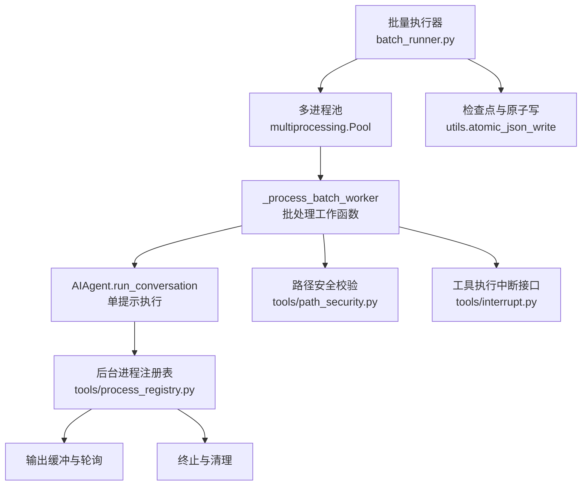
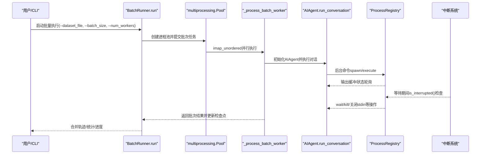
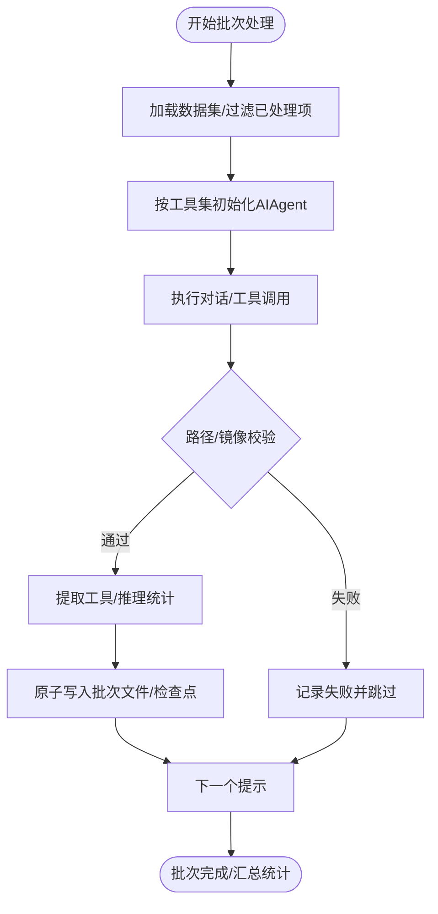
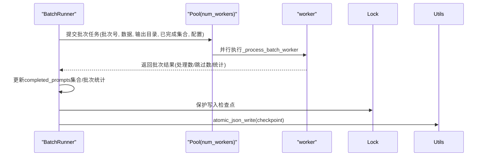
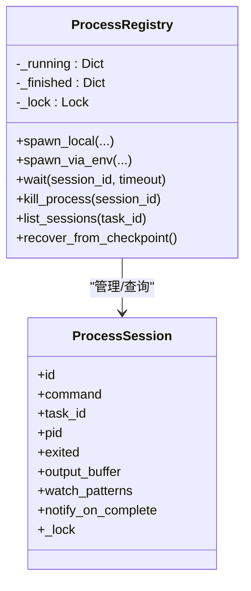
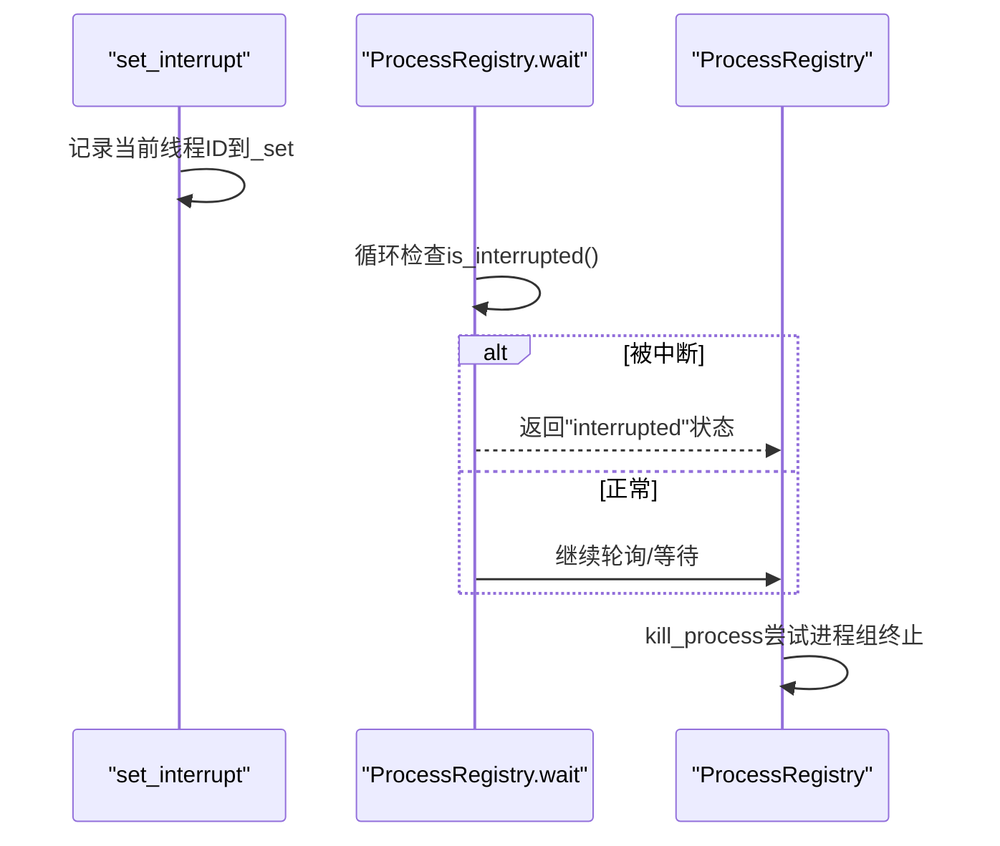
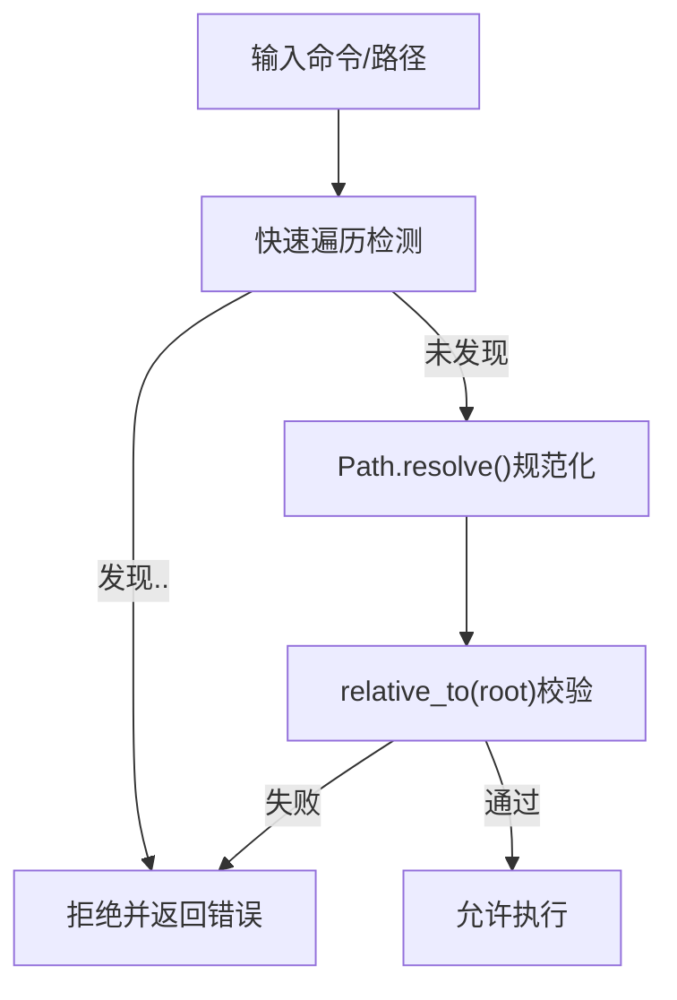
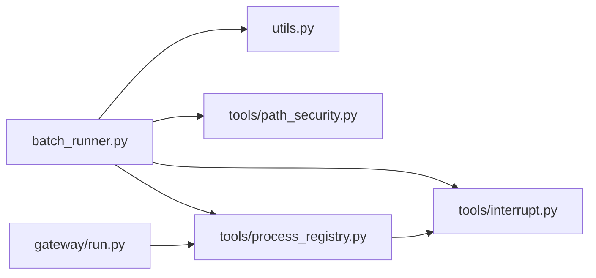

# 并发执行控制

<cite>
**本文引用的文件**
- [batch_runner.py](file://batch_runner.py)
- [tools/interrupt.py](file://tools/interrupt.py)
- [tools/process_registry.py](file://tools/process_registry.py)
- [tools/path_security.py](file://tools/path_security.py)
- [utils.py](file://utils.py)
- [tests/integration/test_checkpoint_resumption.py](file://tests/integration/test_checkpoint_resumption.py)
- [tests/tools/test_interrupt.py](file://tests/tools/test_interrupt.py)
- [tests/test_model_tools_async_bridge.py](file://tests/test_model_tools_async_bridge.py)
- [tests/run_agent/test_agent_loop.py](file://tests/run_agent/test_agent_loop.py)
- [tests/tools/test_mcp_stability.py](file://tests/tools/test_mcp_stability.py)
- [gateway/run.py](file://gateway/run.py)
</cite>

## 目录
1. [简介](#简介)
2. [项目结构](#项目结构)
3. [核心组件](#核心组件)
4. [架构总览](#架构总览)
5. [详细组件分析](#详细组件分析)
6. [依赖关系分析](#依赖关系分析)
7. [性能考虑](#性能考虑)
8. [故障排查指南](#故障排查指南)
9. [结论](#结论)
10. [附录](#附录)

## 简介
本文件面向Hermes Agent的并发执行控制系统，围绕以下目标展开：  
- 工具批处理的安全性评估：工具兼容性检查、路径作用域隔离、并发冲突检测  
- 线程池/进程池管理：最大工作线程/进程数限制、任务队列管理、资源分配策略  
- 工具执行的并发安全：共享状态保护、竞态条件避免、死锁预防  
- 中断处理系统：全局中断信号、子进程清理、优雅退出机制  
- 性能监控与资源统计：运行时指标采集、瓶颈定位方法  

文档在每个技术点后均给出“章节来源”和“图示来源”，便于追溯到具体实现。

## 项目结构
与并发执行控制直接相关的模块分布如下：
- 批量执行入口与并行调度：batch_runner.py（多进程池）
- 工具执行中断与线程隔离：tools/interrupt.py
- 后台进程生命周期与输出缓冲：tools/process_registry.py
- 路径安全校验：tools/path_security.py
- 原子写入与崩溃容错：utils.py
- 测试与验证：多个tests目录下的并发、中断、稳定性测试

**图示来源**
- [batch_runner.py:883-950](file://batch_runner.py#L883-L950)
- [tools/process_registry.py:106-142](file://tools/process_registry.py#L106-L142)
- [tools/interrupt.py:24-48](file://tools/interrupt.py#L24-L48)
- [tools/path_security.py:15-34](file://tools/path_security.py#L15-L34)
- [utils.py:60-111](file://utils.py#L60-L111)

**章节来源**
- [batch_runner.py:1-1291](file://batch_runner.py#L1-L1291)
- [tools/process_registry.py:1-1185](file://tools/process_registry.py#L1-L1185)
- [tools/interrupt.py:1-77](file://tools/interrupt.py#L1-L77)
- [tools/path_security.py:1-44](file://tools/path_security.py#L1-L44)
- [utils.py:1-197](file://utils.py#L1-L197)

## 核心组件
- 批量执行器BatchRunner：负责数据集分批、多进程并行、增量检查点、轨迹合并与统计汇总
- 多进程池Pool：通过imap_unordered实现无序结果聚合，提升吞吐
- 进程注册表ProcessRegistry：统一管理后台进程生命周期、输出缓冲、超时与中断、崩溃恢复
- 中断系统：基于线程ID的per-thread中断标记，避免跨会话误杀
- 路径安全：相对路径解析与遍历检测，防止逃逸允许目录
- 原子写：崩溃安全的JSON/YAML写入，保障检查点与统计文件一致性

**章节来源**
- [batch_runner.py:514-1291](file://batch_runner.py#L514-L1291)
- [tools/process_registry.py:106-1095](file://tools/process_registry.py#L106-L1095)
- [tools/interrupt.py:19-48](file://tools/interrupt.py#L19-L48)
- [tools/path_security.py:15-34](file://tools/path_security.py#L15-L34)
- [utils.py:60-161](file://utils.py#L60-L161)

## 架构总览
下图展示了从批量执行到工具调用、后台进程管理与中断处理的整体流程。

**图示来源**
- [batch_runner.py:883-950](file://batch_runner.py#L883-L950)
- [batch_runner.py:388-511](file://batch_runner.py#L388-L511)
- [tools/process_registry.py:700-771](file://tools/process_registry.py#L700-L771)
- [tools/interrupt.py:40-48](file://tools/interrupt.py#L40-L48)

## 详细组件分析

### 组件A：批量执行与批处理安全评估
- 工具兼容性检查：通过工具注册表动态过滤可用工具集合，结合工具集check_fn进行能力验证；在Agent初始化阶段按启用/禁用列表筛选工具集，避免不可用工具进入模型调用schema
- 路径作用域隔离：对容器镜像选择与工作目录进行显式校验，确保每条提示在独立沙箱中执行；路径安全模块提供相对化与遍历检测，防止逃逸
- 并发冲突检测：批处理按提示索引与内容双重去重；检查点采用原子写入，避免多进程同时写入导致的数据损坏；使用Lock保护关键写入段落
- 增量检查点：批次完成后即时更新已完成提示集合与批次统计，支持断点续跑

**图示来源**
- [batch_runner.py:233-386](file://batch_runner.py#L233-L386)
- [batch_runner.py:430-511](file://batch_runner.py#L430-L511)
- [batch_runner.py:700-716](file://batch_runner.py#L700-L716)
- [tools/path_security.py:15-34](file://tools/path_security.py#L15-L34)

**章节来源**
- [batch_runner.py:514-1291](file://batch_runner.py#L514-L1291)
- [tools/path_security.py:15-34](file://tools/path_security.py#L15-L34)
- [tests/integration/test_checkpoint_resumption.py:351-387](file://tests/integration/test_checkpoint_resumption.py#L351-L387)

### 组件B：线程池/进程池管理与资源分配
- 最大工作进程数：由--num_workers参数控制，传入multiprocessing.Pool构造函数
- 任务队列管理：使用imap_unordered实现无序结果聚合，减少慢任务拖累整体进度
- 资源分配策略：每个批次任务包含批次号、数据、输出目录、已完成提示集合与配置字典；worker内部顺序处理提示，避免同一批内竞争
- 增量检查点：父进程持有Lock，逐批次写入检查点，保证崩溃后可恢复

**图示来源**
- [batch_runner.py:883-950](file://batch_runner.py#L883-L950)
- [batch_runner.py:924-946](file://batch_runner.py#L924-L946)
- [utils.py:60-111](file://utils.py#L60-L111)

**章节来源**
- [batch_runner.py:883-950](file://batch_runner.py#L883-L950)
- [tests/run_agent/test_agent_loop.py:492-505](file://tests/run_agent/test_agent_loop.py#L492-L505)

### 组件C：工具执行的并发安全机制
- 共享状态保护：检查点写入使用Lock；进程注册表内部使用threading.Lock保护运行/完成映射；原子写入避免部分写入
- 竞态条件避免：批处理worker内部顺序处理提示；进程注册表的完成通知仅在首次移动到finished时入队，避免重复消息
- 死锁预防：等待后台进程时定期检查is_interrupted()；kill_process优先尝试进程组终止，回退到平台特定方式；watch模式匹配具备速率限制与过载保护

**图示来源**
- [tools/process_registry.py:106-142](file://tools/process_registry.py#L106-L142)
- [tools/process_registry.py:604-629](file://tools/process_registry.py#L604-L629)

**章节来源**
- [tools/process_registry.py:106-1095](file://tools/process_registry.py#L106-L1095)
- [tests/test_model_tools_async_bridge.py:109-160](file://tests/test_model_tools_async_bridge.py#L109-L160)

### 组件D：中断处理系统
- 全局中断信号：set_interrupt(active, thread_id)设置当前线程或指定线程的中断状态；is_interrupted()返回当前线程是否被中断
- 子进程清理：ProcessRegistry.wait在阻塞期间周期检查is_interrupted()，若中断则返回“interrupted”状态并附带输出快照；kill_process支持进程组终止
- 优雅退出：GatewayRunner在收到SIGTERM/SIGINT时记录诊断信息并触发停止流程；对MCP服务器与定时器进行有序关闭

**图示来源**
- [tools/interrupt.py:24-48](file://tools/interrupt.py#L24-L48)
- [tools/process_registry.py:700-771](file://tools/process_registry.py#L700-L771)
- [gateway/run.py:9752-9862](file://gateway/run.py#L9752-L9862)

**章节来源**
- [tools/interrupt.py:19-77](file://tools/interrupt.py#L19-L77)
- [tools/process_registry.py:700-831](file://tools/process_registry.py#L700-L831)
- [tests/tools/test_interrupt.py:168-203](file://tests/tools/test_interrupt.py#L168-L203)
- [gateway/run.py:9752-9862](file://gateway/run.py#L9752-L9862)

### 组件E：工具批处理的安全性评估算法
- 工具兼容性检查：通过工具注册表的check_fn与工具集可用性检查，确保仅向模型暴露可正常工作的工具schema
- 路径作用域隔离：validate_within_dir对路径resolve()后relative_to()校验，has_traversal_component快速检测“..”遍历
- 并发冲突检测：批处理按提示文本内容匹配已完成集合，避免索引漂移导致的重复执行；检查点采用原子写入，避免多进程同时写入

**图示来源**
- [tools/path_security.py:15-34](file://tools/path_security.py#L15-L34)

**章节来源**
- [tools/path_security.py:15-34](file://tools/path_security.py#L15-L34)
- [batch_runner.py:254-304](file://batch_runner.py#L254-L304)

## 依赖关系分析
- BatchRunner依赖multiprocessing.Pool进行并行调度，依赖utils.atomic_json_write进行检查点与统计的原子写入
- ProcessRegistry作为后台进程中心控制器，被工具链中的终端工具与MCP工具调用
- 中断系统为所有工具与进程等待提供统一的线程级中断语义
- 路径安全模块被工具执行前的环境准备与容器镜像选择逻辑调用

**图示来源**
- [batch_runner.py:883-950](file://batch_runner.py#L883-L950)
- [utils.py:60-111](file://utils.py#L60-L111)
- [tools/process_registry.py:106-142](file://tools/process_registry.py#L106-L142)
- [gateway/run.py:9752-9862](file://gateway/run.py#L9752-L9862)

**章节来源**
- [batch_runner.py:883-950](file://batch_runner.py#L883-L950)
- [tools/process_registry.py:106-1095](file://tools/process_registry.py#L106-L1095)
- [gateway/run.py:9752-9862](file://gateway/run.py#L9752-L9862)

## 性能考虑
- 并发度与吞吐：num_workers越大，吞吐越高但CPU/IO争用越强；建议根据CPU核数与I/O密集度调整
- I/O瓶颈：批处理写入轨迹与检查点均为磁盘I/O热点；使用原子写入减少碎片，但频繁写入仍需关注SSD寿命
- 进程间通信：Pool使用pickle序列化任务参数；尽量传递轻量配置，避免大对象跨进程传输
- 超时与中断：ProcessRegistry.wait对长任务设置默认超时，配合is_interrupted()避免无限等待
- 观测与采样：利用批处理统计与轨迹合并后的汇总文件进行成功率与推理覆盖率分析

[本节为通用指导，不涉及具体文件分析]

## 故障排查指南
- 检查点异常：确认atomic_json_write写入成功且未被权限问题阻断；查看utils.atomic_json_write的异常路径
- 中断无效：确认is_interrupted()在等待循环中被调用；检查set_interrupt是否针对正确线程ID
- 子进程无法终止：优先尝试进程组终止；若非本地后端，确认env.execute支持kill
- 容器镜像拉取失败：批处理在执行前对镜像进行预检；若失败，批次结果会包含错误信息
- MCP服务不稳定：测试覆盖了MCPServerTask在关闭事件触发时的瞬时连接失败场景

**章节来源**
- [utils.py:60-111](file://utils.py#L60-L111)
- [tools/process_registry.py:700-831](file://tools/process_registry.py#L700-L831)
- [batch_runner.py:254-291](file://batch_runner.py#L254-L291)
- [tests/tools/test_mcp_stability.py:267-292](file://tests/tools/test_mcp_stability.py#L267-L292)

## 结论
Hermes Agent的并发执行控制系统通过“批处理+多进程池+原子写入+进程注册表+线程级中断”的组合，实现了高吞吐、可恢复、可观察的工具批处理执行。关键安全点包括工具兼容性检查、路径作用域隔离与检查点原子写入；并发安全通过锁与一次性通知机制保障；中断与清理遵循优雅退出原则。建议在生产环境中结合num_workers与I/O策略进行调优，并持续监控轨迹与统计文件以定位瓶颈。

[本节为总结性内容，不涉及具体文件分析]

## 附录
- 并发工具调用示例路径：  
  - 批处理工作函数：[batch_runner.py:388-511](file://batch_runner.py#L388-L511)  
  - 原子写入检查点：[batch_runner.py:700-716](file://batch_runner.py#L700-L716)、[utils.py:60-111](file://utils.py#L60-L111)  
  - 等待与中断：[tools/process_registry.py:700-771](file://tools/process_registry.py#L700-L771)、[tools/interrupt.py:40-48](file://tools/interrupt.py#L40-L48)  
  - 路径安全校验：[tools/path_security.py:15-34](file://tools/path_security.py#L15-L34)  
  - 线程池大小调整：[tests/run_agent/test_agent_loop.py:492-505](file://tests/run_agent/test_agent_loop.py#L492-L505)  
  - 异步桥接与事件循环隔离：[tests/test_model_tools_async_bridge.py:109-160](file://tests/test_model_tools_async_bridge.py#L109-L160)