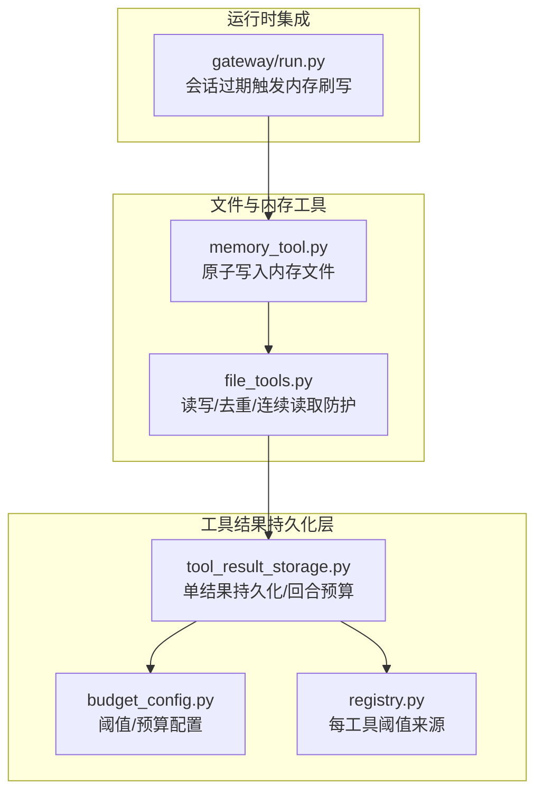
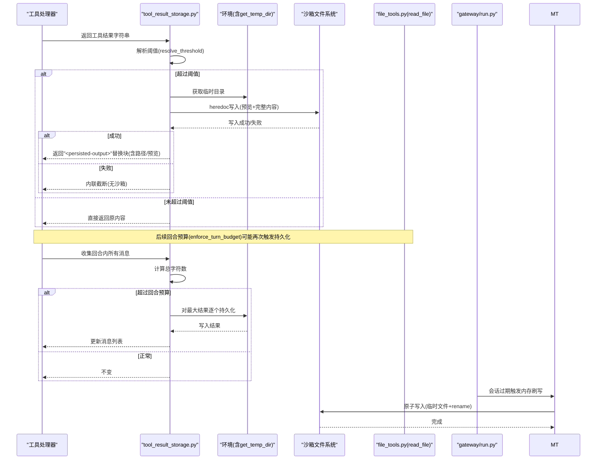
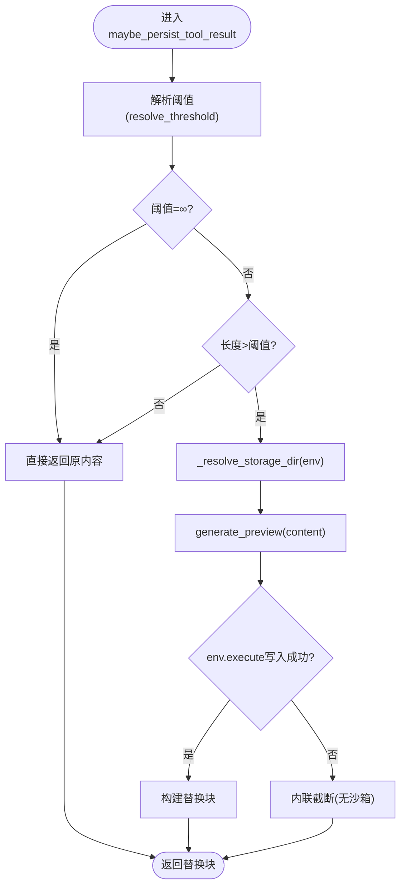
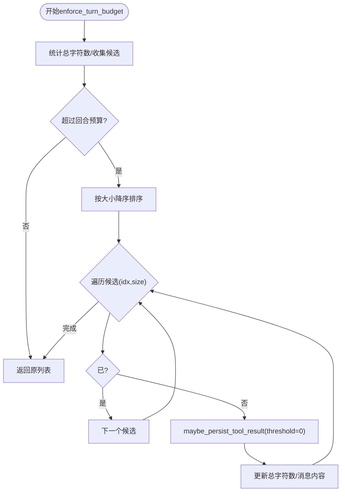
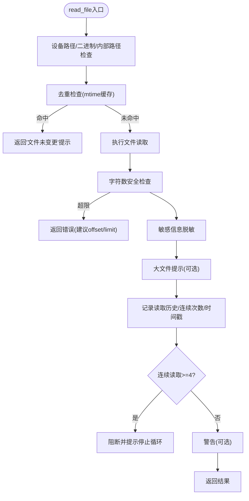
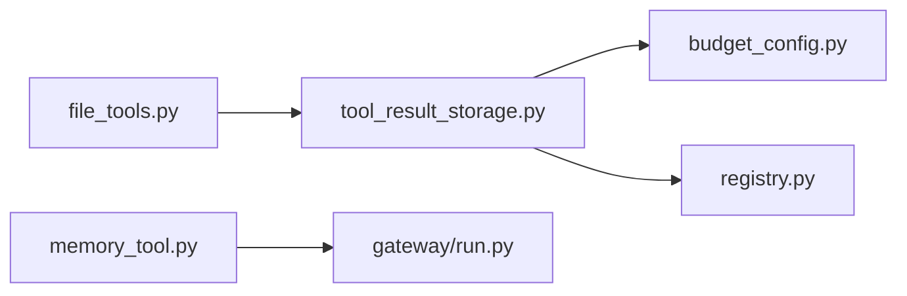

# 结果存储与持久化

<cite>
**本文引用的文件**
- [tools/tool_result_storage.py](file://tools/tool_result_storage.py)
- [tools/budget_config.py](file://tools/budget_config.py)
- [tools/registry.py](file://tools/registry.py)
- [tools/file_tools.py](file://tools/file_tools.py)
- [tests/tools/test_tool_result_storage.py](file://tests/tools/test_tool_result_storage.py)
- [tests/tools/test_budget_config.py](file://tests/tools/test_budget_config.py)
- [tests/tools/test_file_tools_live.py](file://tests/tools/test_file_tools_live.py)
- [tests/tools/test_local_tempdir.py](file://tests/tools/test_local_tempdir.py)
- [tools/memory_tool.py](file://tools/memory_tool.py)
- [gateway/run.py](file://gateway/run.py)
</cite>

## 目录
1. [简介](#简介)
2. [项目结构](#项目结构)
3. [核心组件](#核心组件)
4. [架构总览](#架构总览)
5. [详细组件分析](#详细组件分析)
6. [依赖分析](#依赖分析)
7. [性能考量](#性能考量)
8. [故障排查指南](#故障排查指南)
9. [结论](#结论)
10. [附录](#附录)

## 简介
本文件面向Hermes Agent工具结果存储与持久化系统，围绕“三层防御”策略进行系统性说明：工具内预截断、单结果持久化（落盘+预览）、回合级聚合预算控制。重点覆盖以下方面：
- 存储策略与选择逻辑：内存缓存、临时文件存储、持久化机制的协同与回退
- 大结果集处理：自动落盘、预览生成、阈值与预算控制
- 结果缓存与去重：读文件工具的去重与连续读取防护
- 序列化与反序列化：JSON封装、字符安全输出、敏感信息脱敏
- 配置与调优：阈值解析、环境临时目录、磁盘空间与清理策略
- 性能优化与数据迁移：原子写入、并发安全、会话内存刷写

## 项目结构
与结果存储与持久化直接相关的核心模块如下：
- 工具结果持久化层：tools/tool_result_storage.py
- 预算与阈值配置：tools/budget_config.py
- 工具注册中心：tools/registry.py（提供每工具最大结果大小）
- 文件工具链：tools/file_tools.py（读写文件、去重、连续读取防护）
- 内存工具（持久化到磁盘）：tools/memory_tool.py（原子写入）
- 网关会话内存刷写：gateway/run.py（会话过期时异步刷写）

**图表来源**
- [tools/tool_result_storage.py:1-227](file://tools/tool_result_storage.py#L1-L227)
- [tools/budget_config.py:1-53](file://tools/budget_config.py#L1-L53)
- [tools/registry.py:315-323](file://tools/registry.py#L315-L323)
- [tools/file_tools.py:282-450](file://tools/file_tools.py#L282-L450)
- [tools/memory_tool.py:431-460](file://tools/memory_tool.py#L431-L460)
- [gateway/run.py:2106-2132](file://gateway/run.py#L2106-L2132)

**章节来源**
- [tools/tool_result_storage.py:1-227](file://tools/tool_result_storage.py#L1-L227)
- [tools/budget_config.py:1-53](file://tools/budget_config.py#L1-L53)
- [tools/registry.py:315-323](file://tools/registry.py#L315-L323)
- [tools/file_tools.py:282-450](file://tools/file_tools.py#L282-L450)
- [tools/memory_tool.py:431-460](file://tools/memory_tool.py#L431-L460)
- [gateway/run.py:2106-2132](file://gateway/run.py#L2106-L2132)

## 核心组件
- 单结果持久化（maybe_persist_tool_result）
  - 基于工具阈值与预算配置，对超限内容执行沙箱写入，生成预览+路径引用；失败或无环境时回退为内联截断
  - 使用heredoc写入，自动选择环境临时目录，避免命令注入
- 回合级预算控制（enforce_turn_budget）
  - 统计回合内所有工具结果字符总量，按大小降序优先持久化，直至低于回合预算
- 预算与阈值配置（BudgetConfig）
  - 提供默认阈值、回合预算、预览大小，支持工具级覆盖与注册中心回退
- 注册中心（ToolRegistry）
  - 每工具最大结果大小来源于注册表，未注册工具回退到默认值
- 文件工具（read_file/patch/write_file）
  - 读文件具备去重与连续读取防护；写文件具备敏感路径阻断与原子写入提示
- 内存工具（memory_tool）
  - 原子写入（临时文件+rename），避免并发读取空文件风险
- 网关会话内存刷写（gateway/run.py）
  - 会话过期时异步刷写内存至磁盘，防止重启丢失

**章节来源**
- [tools/tool_result_storage.py:116-173](file://tools/tool_result_storage.py#L116-L173)
- [tools/tool_result_storage.py:175-226](file://tools/tool_result_storage.py#L175-L226)
- [tools/budget_config.py:23-52](file://tools/budget_config.py#L23-L52)
- [tools/registry.py:315-323](file://tools/registry.py#L315-L323)
- [tools/file_tools.py:282-450](file://tools/file_tools.py#L282-L450)
- [tools/file_tools.py:541-563](file://tools/file_tools.py#L541-L563)
- [tools/memory_tool.py:431-460](file://tools/memory_tool.py#L431-L460)
- [gateway/run.py:2106-2132](file://gateway/run.py#L2106-L2132)

## 架构总览
下图展示了从工具返回到最终落盘的关键流程，以及与文件工具、内存工具、网关的交互。

**图表来源**
- [tools/tool_result_storage.py:116-173](file://tools/tool_result_storage.py#L116-L173)
- [tools/tool_result_storage.py:175-226](file://tools/tool_result_storage.py#L175-L226)
- [tools/file_tools.py:282-450](file://tools/file_tools.py#L282-L450)
- [tools/memory_tool.py:431-460](file://tools/memory_tool.py#L431-L460)
- [gateway/run.py:2106-2132](file://gateway/run.py#L2106-L2132)

## 详细组件分析

### 单结果持久化与阈值解析
- 阈值解析优先级：固定钉住(read_file=∞) > 工具级覆盖 > 注册中心 > 默认
- 写入策略：使用heredoc在环境临时目录创建文件，自动转义与安全处理；失败或无环境时内联截断
- 预览生成：按字符上限截断，尽量停在换行处，避免破坏文本边界
- 环境临时目录：优先使用env.get_temp_dir()，否则回退到默认路径

**图表来源**
- [tools/tool_result_storage.py:116-173](file://tools/tool_result_storage.py#L116-L173)
- [tools/budget_config.py:38-48](file://tools/budget_config.py#L38-L48)
- [tools/registry.py:315-323](file://tools/registry.py#L315-L323)

**章节来源**
- [tools/tool_result_storage.py:44-57](file://tools/tool_result_storage.py#L44-L57)
- [tools/tool_result_storage.py:60-68](file://tools/tool_result_storage.py#L60-L68)
- [tools/tool_result_storage.py:78-88](file://tools/tool_result_storage.py#L78-L88)
- [tools/tool_result_storage.py:91-113](file://tools/tool_result_storage.py#L91-L113)
- [tools/tool_result_storage.py:116-173](file://tools/tool_result_storage.py#L116-L173)
- [tools/budget_config.py:12-14](file://tools/budget_config.py#L12-L14)
- [tools/budget_config.py:38-48](file://tools/budget_config.py#L38-L48)
- [tools/registry.py:315-323](file://tools/registry.py#L315-L323)

### 回合级预算控制与持久化
- 全局预算：回合内所有非持久化结果字符总数超过预算时，按大小降序优先持久化
- 已持久化结果跳过：避免重复落盘
- 阈值强制：以阈值0触发持久化，确保即使小结果也能被落盘

**图表来源**
- [tools/tool_result_storage.py:175-226](file://tools/tool_result_storage.py#L175-L226)

**章节来源**
- [tools/tool_result_storage.py:175-226](file://tools/tool_result_storage.py#L175-L226)

### 预算配置与阈值解析测试要点
- 钉住阈值优先级高于覆盖与注册中心
- 工具级覆盖优先于注册中心与默认
- 注册中心回退行为与自定义默认值传递

**章节来源**
- [tests/tools/test_budget_config.py:137-176](file://tests/tools/test_budget_config.py#L137-L176)
- [tests/tools/test_tool_result_storage.py:308-327](file://tests/tools/test_tool_result_storage.py#L308-L327)

### 文件读取工具：去重与连续读取防护
- 去重：同一(task_id, path, offset, limit)且文件未修改时，返回“文件未变更”的轻量提示，避免重复上下文传输
- 连续读取防护：连续相同读取达到阈值后阻断，防止循环读取
- 大文件提示：当文件较大且未限定范围时，建议使用offset/limit分段读取
- 敏感路径阻断：拒绝写入系统关键路径，必要时通过终端工具授权

**图表来源**
- [tools/file_tools.py:282-450](file://tools/file_tools.py#L282-L450)

**章节来源**
- [tools/file_tools.py:282-450](file://tools/file_tools.py#L282-L450)
- [tests/tools/test_file_tools_live.py:243-268](file://tests/tools/test_file_tools_live.py#L243-L268)

### 内存工具：原子写入与并发安全
- 原子写入：先写临时文件，再原子替换，避免并发读取空文件
- 异常清理：写入失败删除临时文件，抛出统一异常
- 与网关配合：会话过期时触发内存刷写，标记并持久化

**章节来源**
- [tools/memory_tool.py:431-460](file://tools/memory_tool.py#L431-L460)
- [gateway/run.py:2106-2132](file://gateway/run.py#L2106-L2132)

## 依赖分析
- 单结果持久化依赖预算配置与注册中心，形成“阈值解析链”
- 文件工具与单结果持久化共同作用于“大结果集”场景：前者负责读取与去重，后者负责落盘与预览
- 内存工具与网关协作，保障会话生命周期内的数据持久化

**图表来源**
- [tools/tool_result_storage.py:30-34](file://tools/tool_result_storage.py#L30-L34)
- [tools/budget_config.py:47-48](file://tools/budget_config.py#L47-L48)
- [tools/registry.py:315-323](file://tools/registry.py#L315-L323)
- [tools/file_tools.py:282-450](file://tools/file_tools.py#L282-L450)
- [tools/memory_tool.py:431-460](file://tools/memory_tool.py#L431-L460)
- [gateway/run.py:2106-2132](file://gateway/run.py#L2106-L2132)

**章节来源**
- [tools/tool_result_storage.py:30-34](file://tools/tool_result_storage.py#L30-L34)
- [tools/budget_config.py:47-48](file://tools/budget_config.py#L47-L48)
- [tools/registry.py:315-323](file://tools/registry.py#L315-L323)
- [tools/file_tools.py:282-450](file://tools/file_tools.py#L282-L450)
- [tools/memory_tool.py:431-460](file://tools/memory_tool.py#L431-L460)
- [gateway/run.py:2106-2132](file://gateway/run.py#L2106-L2132)

## 性能考量
- 预览截断与heredoc写入：减少上下文占用，避免模型一次性处理超大数据
- 去重与连续读取防护：降低重复传输与无效循环
- 原子写入：避免并发竞争导致的空文件读取，提升稳定性
- 环境临时目录：优先使用后端提供的临时目录，减少跨平台兼容问题
- 回合预算：在多中等结果组合超限时，优先持久化最大结果，平衡吞吐与上下文

[本节为通用指导，无需特定文件来源]

## 故障排查指南
- 写入失败或无环境
  - 现象：返回内联截断提示
  - 排查：确认环境可用、临时目录权限、磁盘空间
  - 参考：[tools/tool_result_storage.py:153-172](file://tools/tool_result_storage.py#L153-L172)
- heredoc冲突
  - 现象：写入命令包含特殊分隔符
  - 处理：自动生成唯一分隔符，避免冲突
  - 参考：[tests/tools/test_tool_result_storage.py:102-112](file://tests/tools/test_tool_result_storage.py#L102-L112)
- 临时目录不一致
  - 现象：不同平台路径差异
  - 处理：优先使用env.get_temp_dir()，Termux等平台可覆盖
  - 参考：[tests/tools/test_local_tempdir.py:7-37](file://tests/tools/test_local_tempdir.py#L7-L37)
- 读取循环与重复
  - 现象：连续相同读取被阻断
  - 处理：调整offset/limit或执行其他工具后再读取
  - 参考：[tools/file_tools.py:429-446](file://tools/file_tools.py#L429-L446)
- 内存刷写失败
  - 现象：会话过期后刷写重试
  - 处理：查看日志重试次数与最终标记
  - 参考：[gateway/run.py:2115-2128](file://gateway/run.py#L2115-L2128)

**章节来源**
- [tools/tool_result_storage.py:153-172](file://tools/tool_result_storage.py#L153-L172)
- [tests/tools/test_tool_result_storage.py:102-112](file://tests/tools/test_tool_result_storage.py#L102-L112)
- [tests/tools/test_local_tempdir.py:7-37](file://tests/tools/test_local_tempdir.py#L7-L37)
- [tools/file_tools.py:429-446](file://tools/file_tools.py#L429-L446)
- [gateway/run.py:2115-2128](file://gateway/run.py#L2115-L2128)

## 结论
Hermes Agent通过“工具内截断—单结果持久化—回合预算控制”三层策略，有效应对大结果集带来的上下文溢出风险。结合文件工具的去重与连续读取防护、内存工具的原子写入与网关的会话刷写机制，系统在保证安全性与稳定性的同时，兼顾了性能与可维护性。实际部署中应关注阈值配置、环境临时目录与磁盘空间管理，并根据业务场景调整预算参数。

[本节为总结，无需特定文件来源]

## 附录

### 配置与调优要点
- 阈值解析顺序
  - 钉住(read_file=∞) > 工具级覆盖 > 注册中心 > 默认
  - 参考：[tools/budget_config.py:38-48](file://tools/budget_config.py#L38-L48)，[tools/registry.py:315-323](file://tools/registry.py#L315-L323)
- 回合预算
  - 默认回合预算与预览大小可在BudgetConfig中调整
  - 参考：[tools/budget_config.py:23-36](file://tools/budget_config.py#L23-L36)
- 环境临时目录
  - 优先使用env.get_temp_dir()，否则回退默认路径
  - 参考：[tools/tool_result_storage.py:44-57](file://tools/tool_result_storage.py#L44-L57)，[tests/tools/test_local_tempdir.py:7-37](file://tests/tools/test_local_tempdir.py#L7-L37)

### 缓存与命中率优化
- 读文件去重
  - 基于(task_id, path, offset, limit)与mtime缓存，避免重复传输
  - 参考：[tools/file_tools.py:330-358](file://tools/file_tools.py#L330-L358)
- 连续读取防护
  - 连续相同读取≥4次阻断，防止循环
  - 参考：[tools/file_tools.py:429-446](file://tools/file_tools.py#L429-L446)

### 序列化与反序列化
- 工具返回统一为JSON字符串，确保跨工具一致性
- 读取结果包含字符数与大文件提示，便于模型按需分页
- 参考：[tools/registry.py:456-482](file://tools/registry.py#L456-L482)，[tools/file_tools.py:364-403](file://tools/file_tools.py#L364-L403)

### 存储性能优化与磁盘空间管理
- heredoc写入与预览截断减少上下文开销
- 原子写入避免并发竞争
- 会话过期触发内存刷写，防止重启丢失
- 参考：[tools/tool_result_storage.py:78-88](file://tools/tool_result_storage.py#L78-L88)，[tools/memory_tool.py:431-460](file://tools/memory_tool.py#L431-L460)，[gateway/run.py:2106-2132](file://gateway/run.py#L2106-L2132)