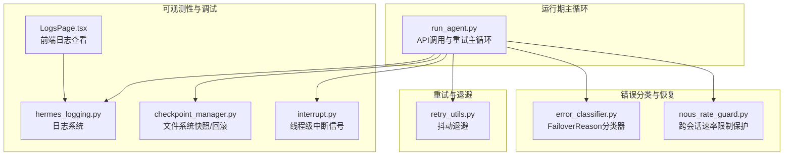
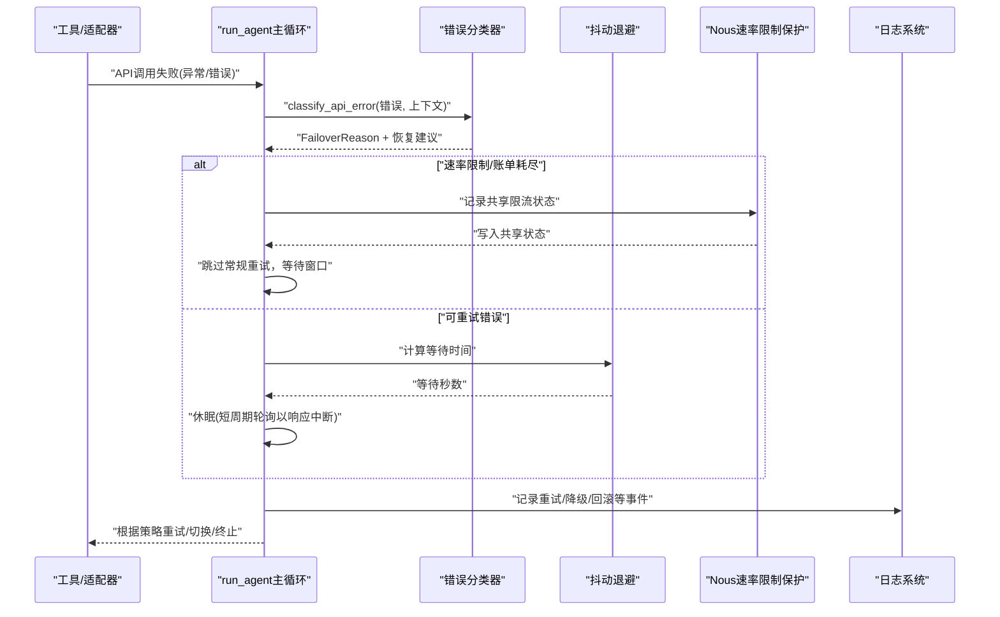
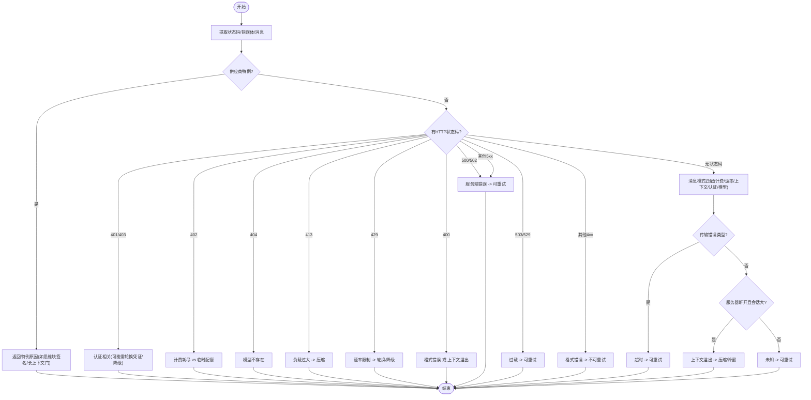
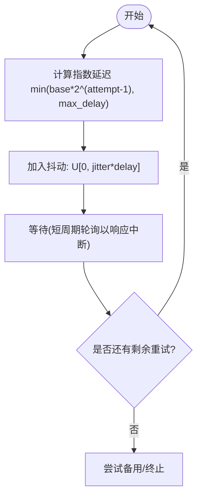
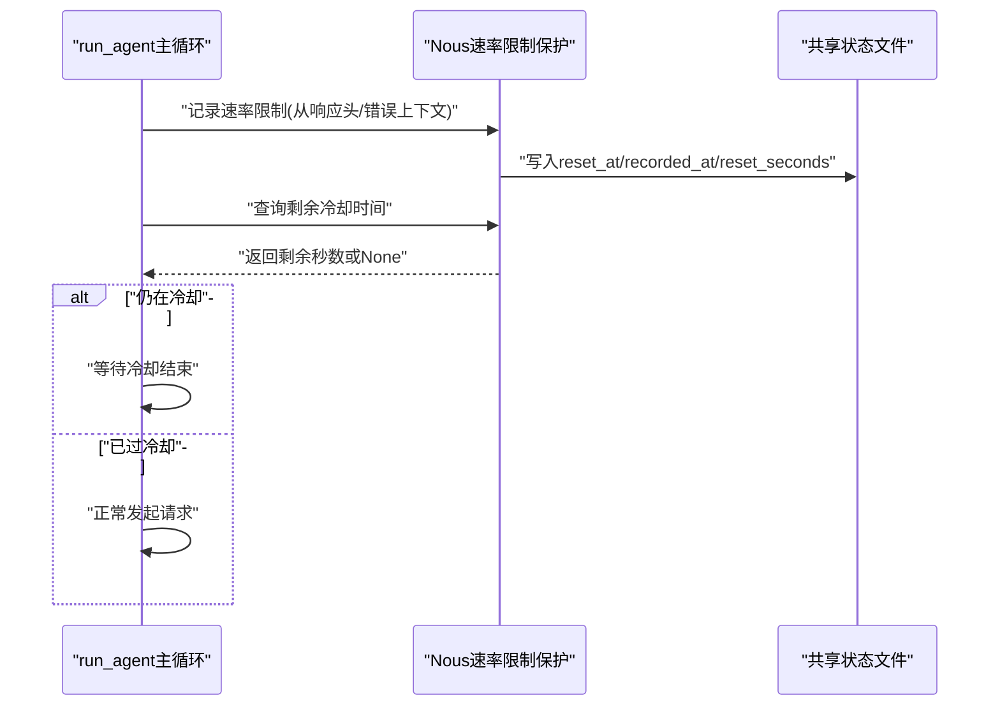
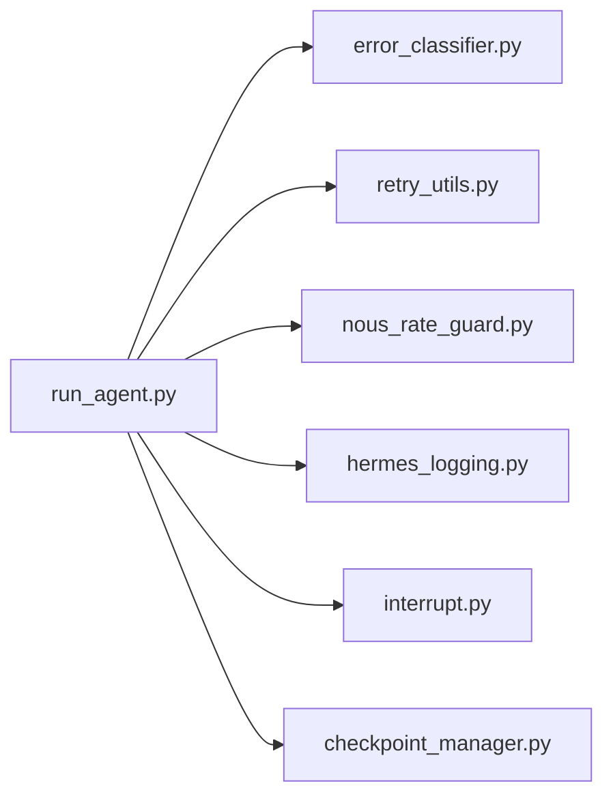

# 错误处理与恢复

<cite>
**本文引用的文件**
- [run_agent.py](file://run_agent.py)
- [error_classifier.py](file://agent/error_classifier.py)
- [retry_utils.py](file://agent/retry_utils.py)
- [nous_rate_guard.py](file://agent/nous_rate_guard.py)
- [hermes_logging.py](file://hermes_logging.py)
- [interrupt.py](file://tools/interrupt.py)
- [checkpoint_manager.py](file://tools/checkpoint_manager.py)
- [test_error_classifier.py](file://tests/agent/test_error_classifier.py)
- [test_retry_utils.py](file://tests/test_retry_utils.py)
- [LogsPage.tsx](file://web/src/pages/LogsPage.tsx)
- [main.py](file://hermes_cli/main.py)
</cite>

## 目录
1. [简介](#简介)
2. [项目结构](#项目结构)
3. [核心组件](#核心组件)
4. [架构总览](#架构总览)
5. [详细组件分析](#详细组件分析)
6. [依赖分析](#依赖分析)
7. [性能考虑](#性能考虑)
8. [故障排查指南](#故障排查指南)
9. [结论](#结论)
10. [附录](#附录)

## 简介
本文件面向Hermes Agent工具的“错误处理与恢复”主题，系统化阐述以下内容：
- 错误分类体系：API错误识别、工具执行失败检测、网络异常处理
- 重试机制设计：指数退避算法、最大重试次数、退避策略配置
- 错误恢复策略：部分失败处理、状态回滚、一致性保证
- 超时管理：请求超时设置、执行时间限制、资源清理
- 监控与可观测性：指标、日志策略、调试工具

目标是帮助开发者在不深入源码的前提下理解整体机制，并在实际问题定位与优化中快速上手。

## 项目结构
围绕错误处理与恢复的关键模块分布如下：
- 错误分类与恢复决策：agent/error_classifier.py
- 重试与退避：agent/retry_utils.py
- Nous Portal速率限制跨会话保护：agent/nous_rate_guard.py
- 会话级中断与资源清理：tools/interrupt.py、tools/checkpoint_manager.py
- 日志与调试：hermes_logging.py、web/src/pages/LogsPage.tsx、hermes_cli/main.py
- 测试用例：tests/agent/test_error_classifier.py、tests/test_retry_utils.py

图表来源
- [run_agent.py](file://run_agent.py)
- [error_classifier.py](file://agent/error_classifier.py)
- [retry_utils.py](file://agent/retry_utils.py)
- [nous_rate_guard.py](file://agent/nous_rate_guard.py)
- [hermes_logging.py](file://hermes_logging.py)
- [LogsPage.tsx](file://web/src/pages/LogsPage.tsx)
- [checkpoint_manager.py](file://tools/checkpoint_manager.py)
- [interrupt.py](file://tools/interrupt.py)

章节来源
- [run_agent.py](file://run_agent.py)
- [error_classifier.py](file://agent/error_classifier.py)
- [retry_utils.py](file://agent/retry_utils.py)
- [nous_rate_guard.py](file://agent/nous_rate_guard.py)
- [hermes_logging.py](file://hermes_logging.py)
- [LogsPage.tsx](file://web/src/pages/LogsPage.tsx)
- [checkpoint_manager.py](file://tools/checkpoint_manager.py)
- [interrupt.py](file://tools/interrupt.py)

## 核心组件
- 错误分类器（FailoverReason）：对API错误进行结构化分类，输出是否可重试、是否需要压缩上下文、是否需要轮换凭证或降级等建议。
- 重试工具（jittered_backoff）：基于指数退避并加入抖动，避免并发重试风暴；支持最大延迟与抖动比例配置。
- Nous速率限制保护：在首次遇到429时记录共享状态，后续尝试直接跳过无效重试，降低RPH消耗。
- 中断与清理：线程级中断信号，配合短睡眠轮询实现快速响应；文件系统快照/回滚保障一致性。
- 日志系统：统一的RotatingFileHandler与RedactingFormatter，按级别与组件分离日志，便于快速定位。

章节来源
- [error_classifier.py](file://agent/error_classifier.py)
- [retry_utils.py](file://agent/retry_utils.py)
- [nous_rate_guard.py](file://agent/nous_rate_guard.py)
- [interrupt.py](file://tools/interrupt.py)
- [checkpoint_manager.py](file://tools/checkpoint_manager.py)
- [hermes_logging.py](file://hermes_logging.py)

## 架构总览
下图展示了API调用失败后的典型恢复路径：分类器给出恢复建议，主循环据此选择压缩上下文、轮换凭证、降级到备用模型、或进行带抖动的指数退避重试；在特定场景（如Nous 429）直接跳过重试以避免放大效应；期间通过日志与中断机制保证可观测性与可控性。

图表来源
- [run_agent.py](file://run_agent.py)
- [error_classifier.py](file://agent/error_classifier.py)
- [retry_utils.py](file://agent/retry_utils.py)
- [nous_rate_guard.py](file://agent/nous_rate_guard.py)
- [hermes_logging.py](file://hermes_logging.py)

## 详细组件分析

### 错误分类与恢复策略
- 分类维度：认证/授权、计费/配额、服务端错误、传输超时、上下文/负载过大、模型不可用、请求格式错误、供应商特例（如Anthropic思维块签名、长上下文等级门）、未知。
- 恢复建议字段：retryable、should_compress、should_rotate_credential、should_fallback。
- 关键规则：
  - 429/配额耗尽优先考虑轮换凭证与降级；若配置了备用链路且当前池无可用凭证，则立即切换备用提供商。
  - 413/负载过大：触发压缩尝试；达到最大压缩次数后返回部分失败并保留会话。
  - 上下文溢出：区分输入过长与输出上限过高两类；前者降低context_length并压缩历史；后者仅下调max_tokens。
  - 服务器断开连接且会话较大：优先判定为上下文溢出而非瞬时超时。
  - 400通用错误且会话很大：启发式判定为上下文溢出。
  - 非重试客户端错误：在尝试备用提供商后仍无法解决则终止并记录。

图表来源
- [error_classifier.py](file://agent/error_classifier.py)

章节来源
- [error_classifier.py](file://agent/error_classifier.py)
- [run_agent.py](file://run_agent.py)
- [test_error_classifier.py](file://tests/agent/test_error_classifier.py)

### 重试机制与指数退避
- 退避策略：以base_delay为基数，第n次尝试延迟为min(base*2^(n-1), max_delay)，并在[0, jitter_ratio*delay]范围内加入均匀随机抖动，避免“惊群效应”。
- 参数配置：
  - base_delay：默认2.0s（run_agent中用于速率限制等待）
  - max_delay：默认60.0s
  - jitter_ratio：默认0.5
- 并发安全：使用全局计数器+锁生成唯一种子，结合高精度时间戳混合，确保不同调用间抖动独立。
- 最大重试次数：由调用方控制（run_agent中max_retries），超过后尝试一次主客户端重建（针对瞬态传输错误）再尝试备用提供商。

图表来源
- [retry_utils.py](file://agent/retry_utils.py)
- [run_agent.py](file://run_agent.py)

章节来源
- [retry_utils.py](file://agent/retry_utils.py)
- [test_retry_utils.py](file://tests/test_retry_utils.py)
- [run_agent.py](file://run_agent.py)

### Nous速率限制保护（跨会话）
- 触发条件：首次收到Nous Portal的429时，解析响应头中的重置时间（优先小时级RPH窗口，其次分钟级RPM，最后retry-after），写入共享状态文件。
- 使用策略：在后续尝试前检查共享状态，若仍在冷却期内则直接跳过重试，等待至冷却结束。
- 作用：显著降低“重试放大”导致的RPH超额消耗，避免多会话同时重试造成雪崩。

图表来源
- [run_agent.py](file://run_agent.py)
- [nous_rate_guard.py](file://agent/nous_rate_guard.py)

章节来源
- [run_agent.py](file://run_agent.py)
- [nous_rate_guard.py](file://agent/nous_rate_guard.py)

### 超时管理与资源清理
- 请求超时与执行时间限制：
  - run_agent中对重试等待采用短周期轮询（约0.2s），以便快速响应中断请求。
  - 对外部环境执行设置了进程级超时（例如测试中对沙箱执行设置2s超时），超时后触发取消/终止流程。
- 资源清理：
  - 线程级中断：每个会话保存其工作线程ID，工具侧通过is_interrupted()判断当前线程是否被中断，及时退出避免资源泄漏。
  - 文件系统快照/回滚：在变更前自动创建快照，失败时可回滚到上一版本，保障一致性。
  - 环境清理：在后台清理线程定期停止/终止不活跃的沙箱/容器，防止僵尸进程占用资源。

章节来源
- [run_agent.py](file://run_agent.py)
- [interrupt.py](file://tools/interrupt.py)
- [checkpoint_manager.py](file://tools/checkpoint_manager.py)
- [tests/tools/test_managed_modal_environment.py](file://tests/tools/test_managed_modal_environment.py)

### 错误监控与日志记录
- 日志文件：
  - agent.log：主活动日志（INFO+）
  - errors.log：错误与警告（WARNING+）
  - gateway.log：网关专用（INFO+，按组件过滤）
- 组件分离：通过组件过滤器将不同子系统路由到对应文件，便于分层排查。
- 会话上下文：每条日志包含会话ID，便于跨组件关联。
- 前端日志页：支持按级别、组件、行数筛选，快速定位问题。
- CLI调试：hermes debug share可收集系统信息与最近日志，便于提交给支持团队。

章节来源
- [hermes_logging.py](file://hermes_logging.py)
- [LogsPage.tsx](file://web/src/pages/LogsPage.tsx)
- [main.py](file://hermes_cli/main.py)

## 依赖分析
- 运行期主循环依赖错误分类器与重试工具，形成“分类-决策-退避”的闭环。
- Nous速率限制保护作为外部依赖，影响主循环的重试策略分支。
- 日志系统贯穿所有组件，提供统一的可观测性入口。
- 中断与快照机制为恢复提供“一致性边界”，避免部分失败导致的状态不一致。

图表来源
- [run_agent.py](file://run_agent.py)
- [error_classifier.py](file://agent/error_classifier.py)
- [retry_utils.py](file://agent/retry_utils.py)
- [nous_rate_guard.py](file://agent/nous_rate_guard.py)
- [hermes_logging.py](file://hermes_logging.py)
- [interrupt.py](file://tools/interrupt.py)
- [checkpoint_manager.py](file://tools/checkpoint_manager.py)

章节来源
- [run_agent.py](file://run_agent.py)
- [error_classifier.py](file://agent/error_classifier.py)
- [retry_utils.py](file://agent/retry_utils.py)
- [nous_rate_guard.py](file://agent/nous_rate_guard.py)
- [hermes_logging.py](file://hermes_logging.py)
- [interrupt.py](file://tools/interrupt.py)
- [checkpoint_manager.py](file://tools/checkpoint_manager.py)

## 性能考虑
- 抖动退避：通过随机抖动分散重试时间点，降低并发重试峰值，提升整体吞吐稳定性。
- 最大延迟与抖动比：合理设置max_delay与jitter_ratio，避免过长等待或抖动幅度过大。
- 速率限制保护：在高频429场景下显著减少无效重试，降低上游压力与自身RPH消耗。
- 日志级别与噪声抑制：对第三方库设置较高阈值，避免大量DEBUG/INFO刷屏影响性能。
- 快照与清理：快照采用git内部仓库隔离，避免污染用户工程；清理线程异步执行，不影响主流程。

## 故障排查指南
- 快速定位：
  - 使用hermes logs查看agent.log与errors.log，按级别筛选。
  - 在Web界面选择组件与行数，快速定位错误堆栈。
- 常见问题与处置：
  - 429/配额耗尽：检查速率限制保护状态文件，确认冷却时间；必要时轮换凭证或切换备用提供商。
  - 413/上下文过大：启用压缩尝试；若多次压缩无效，考虑新建会话或手动压缩。
  - 上下文溢出：区分输入过长与输出上限过高；前者降低context_length并压缩历史；后者下调max_tokens。
  - 认证失败：检查凭证轮换与备用提供商配置；必要时重新授权。
  - 传输超时/断开：检查网络连通性与代理设置；必要时调整超时参数。
- 调试报告：
  - 使用hermes debug share收集系统信息与日志，便于支持团队协助分析。

章节来源
- [hermes_logging.py](file://hermes_logging.py)
- [LogsPage.tsx](file://web/src/pages/LogsPage.tsx)
- [main.py](file://hermes_cli/main.py)

## 结论
Hermes Agent的错误处理与恢复机制以“结构化分类+智能退避+跨会话保护+可观测性”为核心，既保证了在复杂网络与API环境下系统的韧性，又兼顾了性能与用户体验。通过合理的参数配置与配套的监控工具，用户可以在大多数失败场景下获得稳定、可预期的恢复行为。

## 附录
- 代码示例路径（不展示具体代码，仅提供定位）：
  - 错误分类与恢复主循环：[run_agent.py](file://run_agent.py)
  - 错误分类器实现：[error_classifier.py](file://agent/error_classifier.py)
  - 抖动退避实现：[retry_utils.py](file://agent/retry_utils.py)
  - Nous速率限制保护：[nous_rate_guard.py](file://agent/nous_rate_guard.py)
  - 日志系统初始化与组件过滤：[hermes_logging.py](file://hermes_logging.py)
  - 线程级中断信号：[interrupt.py](file://tools/interrupt.py)
  - 文件系统快照/回滚：[checkpoint_manager.py](file://tools/checkpoint_manager.py)
  - 前端日志页面：[LogsPage.tsx](file://web/src/pages/LogsPage.tsx)
  - CLI调试命令：[main.py](file://hermes_cli/main.py)
- 测试用例（验证分类与退避行为）：
  - 错误分类器测试：[test_error_classifier.py](file://tests/agent/test_error_classifier.py)
  - 退避工具测试：[test_retry_utils.py](file://tests/test_retry_utils.py)