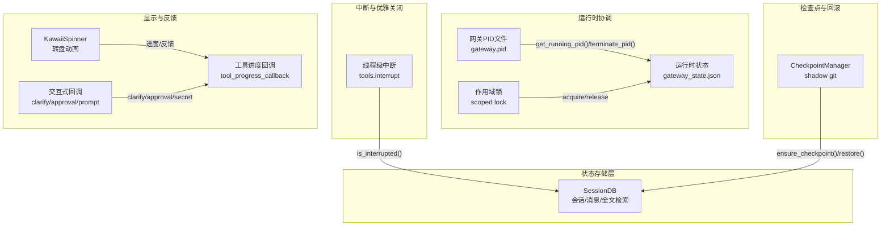
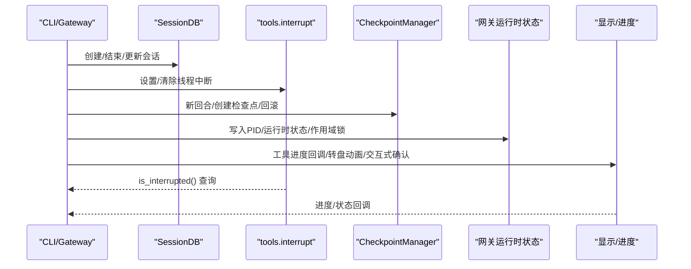
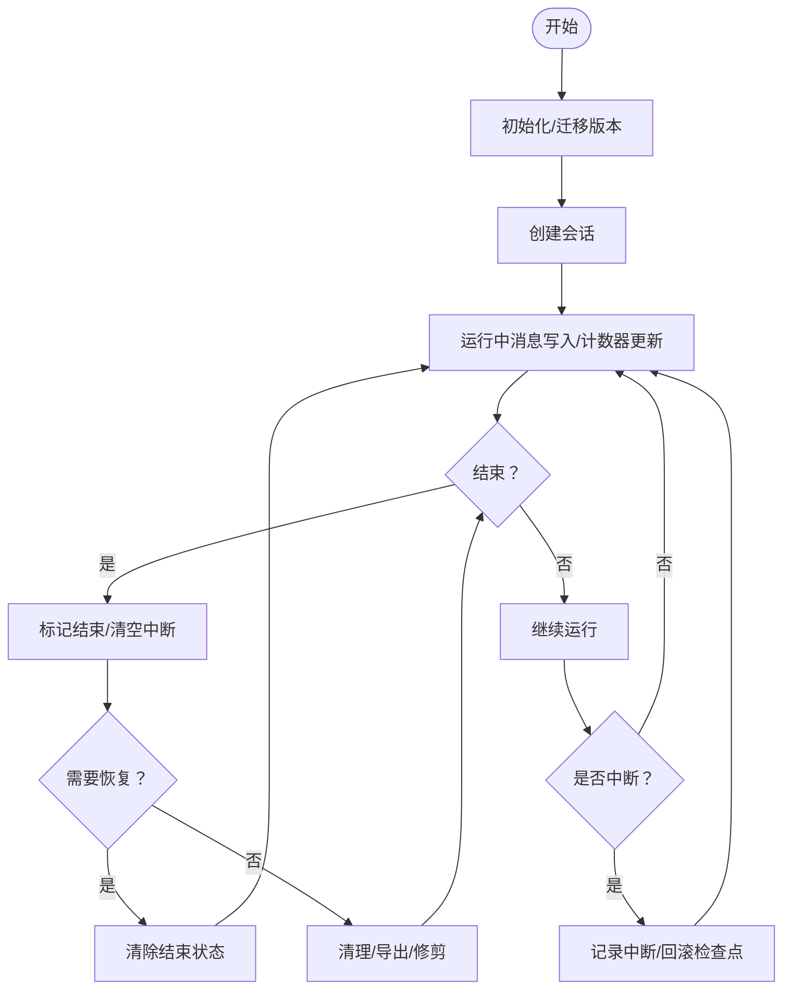
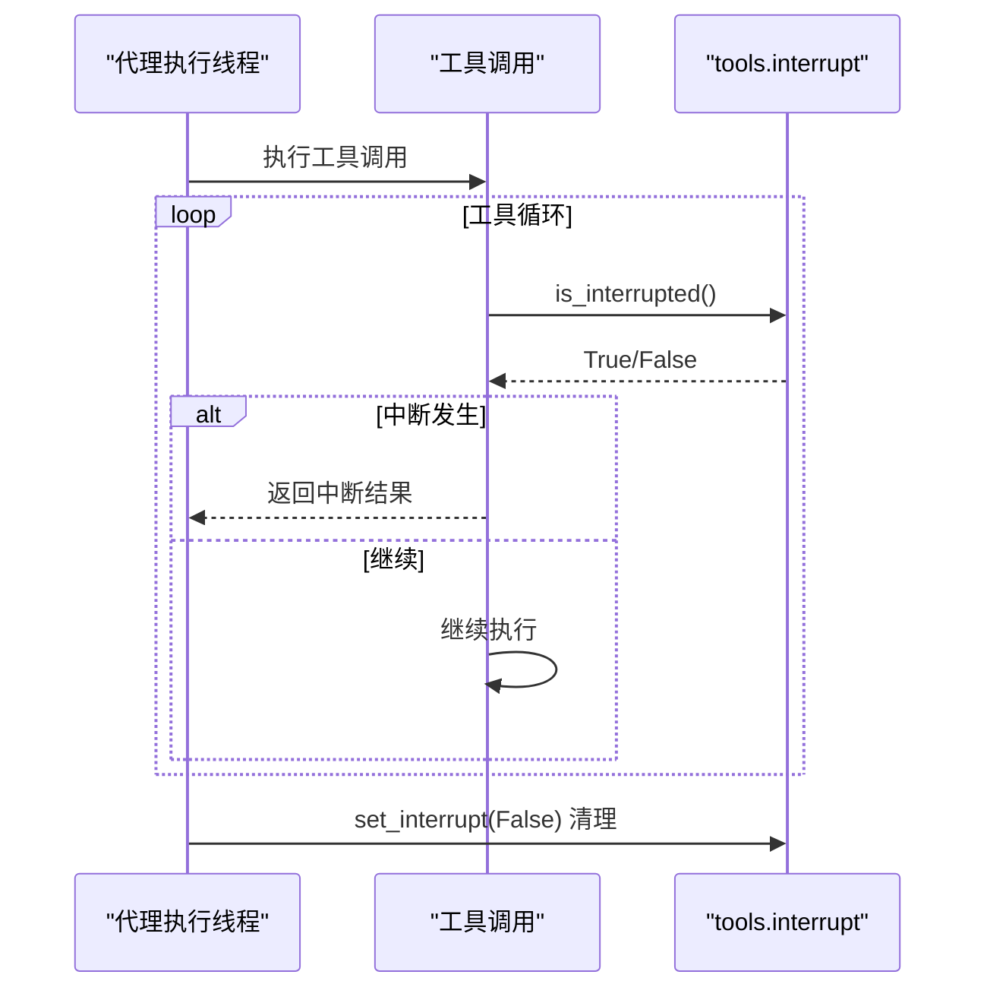
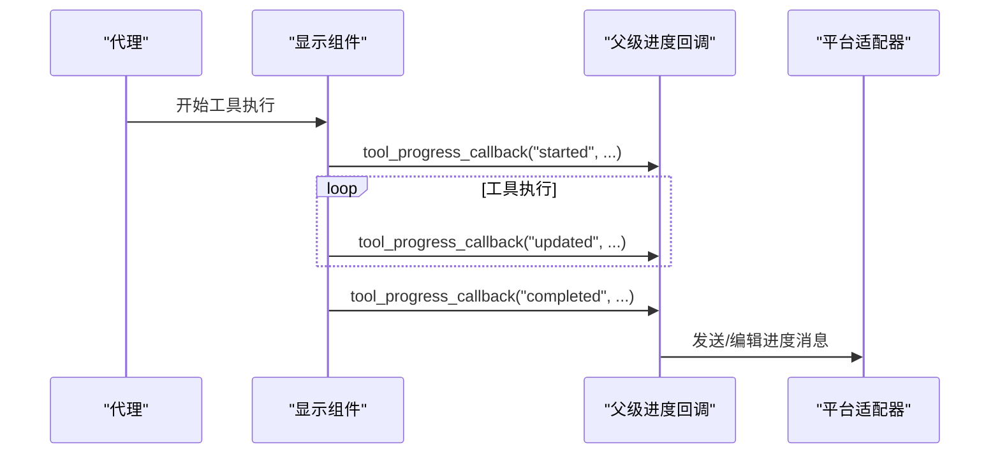
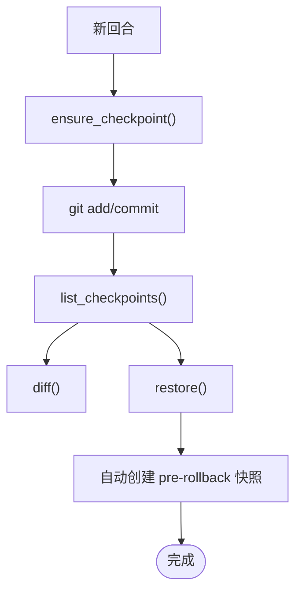
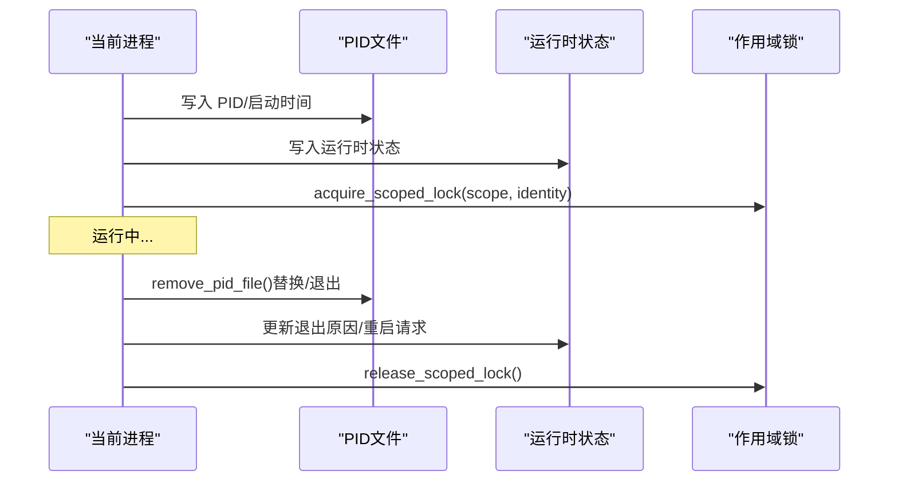

# 状态管理与控制

<cite>
**本文引用的文件**
- [hermes_state.py](file://hermes_state.py)
- [interrupt.py](file://tools/interrupt.py)
- [checkpoint_manager.py](file://tools/checkpoint_manager.py)
- [display.py](file://agent/display.py)
- [status.py](file://gateway/status.py)
- [status.py](file://hermes_cli/status.py)
- [callbacks.py](file://hermes_cli/callbacks.py)
- [run.py](file://gateway/run.py)
- [cli.py](file://cli.py)
</cite>

## 目录
1. [简介](#简介)
2. [项目结构](#项目结构)
3. [核心组件](#核心组件)
4. [架构总览](#架构总览)
5. [详细组件分析](#详细组件分析)
6. [依赖关系分析](#依赖关系分析)
7. [性能考量](#性能考量)
8. [故障排查指南](#故障排查指南)
9. [结论](#结论)

## 简介
本文件系统性阐述 Hermes Agent 的状态管理与控制系统，覆盖以下关键主题：
- 代理状态生命周期：初始化、运行、暂停、恢复、终止与状态转换
- 中断机制：线程级中断、子代理中断传播、优雅关闭
- 并发控制：线程锁、信号量与条件变量的使用策略
- 显示状态管理：进度指示、状态回调、用户交互反馈
- 状态持久化、检查点与崩溃恢复

目标是帮助开发者与运维人员理解并正确使用状态管理基础设施，确保在多平台、多会话并发场景下的稳定性与可观测性。

## 项目结构
围绕状态管理与控制的关键模块分布如下：
- 状态存储与持久化：SQLite 会话数据库（会话、消息、全文检索）
- 运行时健康与进程协调：网关 PID 文件、运行时状态、作用域锁
- 中断与优雅停止：线程级中断标记、工具侧轮询
- 检查点与回滚：基于 shadow git 的工作区快照与恢复
- 显示与反馈：CLI 转盘动画、工具预览、进度回调、交互式确认



**图表来源**
- [hermes_state.py](file://hermes_state.py)
- [interrupt.py](file://tools/interrupt.py)
- [checkpoint_manager.py](file://tools/checkpoint_manager.py)
- [display.py](file://agent/display.py)
- [status.py](file://gateway/status.py)
- [status.py](file://hermes_cli/status.py)
- [callbacks.py](file://hermes_cli/callbacks.py)
- [run.py](file://gateway/run.py)

**章节来源**
- [hermes_state.py](file://hermes_state.py)
- [gateway/status.py](file://gateway/status.py)
- [hermes_cli/status.py](file://hermes_cli/status.py)
- [tools/interrupt.py](file://tools/interrupt.py)
- [tools/checkpoint_manager.py](file://tools/checkpoint_manager.py)
- [agent/display.py](file://agent/display.py)
- [hermes_cli/callbacks.py](file://hermes_cli/callbacks.py)
- [gateway/run.py](file://gateway/run.py)

## 核心组件
- SessionDB：SQLite 会话存储，支持会话生命周期、消息写入、全文检索、标题管理、清理与导出
- 线程级中断：按线程维度记录中断状态，避免跨会话误伤
- CheckpointManager：基于 shadow git 的工作区快照与回滚
- 网关运行时状态：PID 文件、运行时状态文件、作用域锁
- 显示与反馈：转盘动画、工具预览、进度回调、交互式确认

**章节来源**
- [hermes_state.py](file://hermes_state.py)
- [tools/interrupt.py](file://tools/interrupt.py)
- [tools/checkpoint_manager.py](file://tools/checkpoint_manager.py)
- [gateway/status.py](file://gateway/status.py)
- [agent/display.py](file://agent/display.py)
- [hermes_cli/callbacks.py](file://hermes_cli/callbacks.py)

## 架构总览
下图展示状态管理与控制在系统中的交互关系：



**图表来源**
- [hermes_state.py](file://hermes_state.py)
- [tools/interrupt.py](file://tools/interrupt.py)
- [tools/checkpoint_manager.py](file://tools/checkpoint_manager.py)
- [gateway/status.py](file://gateway/status.py)
- [agent/display.py](file://agent/display.py)
- [gateway/run.py](file://gateway/run.py)

## 详细组件分析

### 会话状态与生命周期（SessionDB）
- 设计要点
  - 使用 WAL 模式提升并发读取能力；应用层重试与随机抖动缓解写竞争
  - FTS5 全文检索表自动维护，支持消息搜索与上下文提取
  - 支持会话标题唯一性约束与生成“#N”延续标题
  - 提供会话列表、消息查询、导出与清理等操作
- 关键流程
  - 初始化：建表、迁移版本、创建 FTS 触发器
  - 会话生命周期：创建、结束、重新打开、系统提示更新
  - 计数器更新：增量或绝对值更新，支持成本与用量统计
  - 搜索：安全的 FTS5 查询净化、上下文拼接
  - 清理：按时间窗口裁剪、孤儿子会话处理



**图表来源**
- [hermes_state.py](file://hermes_state.py)

**章节来源**
- [hermes_state.py](file://hermes_state.py)

### 中断机制与优雅关闭（线程级中断）
- 设计目标
  - 在同一进程中并发运行多个代理时，仅影响目标线程，避免误伤其他会话
  - 工具侧通过 is_interrupted() 轮询，实现短小、可组合的中断检测
- 实现要点
  - 线程集：以线程 ident 为键的集合，配合锁保护
  - 向后兼容：_ThreadAwareEventProxy 将事件方法映射到 per-thread 状态
  - 使用建议：在工具执行前定期检查 is_interrupted()，并在检测到中断时返回标准错误码



**图表来源**
- [tools/interrupt.py](file://tools/interrupt.py)

**章节来源**
- [tools/interrupt.py](file://tools/interrupt.py)

### 并发控制与锁策略
- 线程锁
  - SessionDB 内部使用锁保护写路径与计数器更新，避免竞态
  - 作用域锁（scoped lock）用于防止同机多实例对同一外部身份（如平台令牌）同时占用
- 信号量与条件变量
  - 代码库未直接使用信号量/条件变量；通过线程锁与队列实现串行化交互
- 关键实践
  - 写事务采用 BEGIN IMMEDIATE，失败时回滚并重试
  - 随机抖动退避降低写竞争导致的“ convoy effect”

**章节来源**
- [hermes_state.py](file://hermes_state.py)
- [gateway/status.py](file://gateway/status.py)

### 显示状态管理与用户反馈
- 转盘动画（KawaiiSpinner）
  - 支持多种帧序列与“思考/等待”表情，适配皮肤主题
  - 在非 TTY 或被 prompt_toolkit 包装时自动降级
- 工具预览与差异渲染
  - 自动生成工具调用预览，限制长度
  - 对写操作生成内联 diff，支持节流与截断
- 进度回调与平台编辑
  - 网关侧将工具进度批量合并，按平台能力选择消息编辑或新消息发送
  - CLI 状态栏显示上下文占比、耗时等指标
- 交互式回调
  - clarify：澄清问题选择或自由输入
  - approval：危险命令审批（一次/本次会话/总是/拒绝）
  - prompt_for_secret：安全输入敏感信息



**图表来源**
- [agent/display.py](file://agent/display.py)
- [gateway/run.py](file://gateway/run.py)
- [cli.py](file://cli.py)
- [hermes_cli/callbacks.py](file://hermes_cli/callbacks.py)

**章节来源**
- [agent/display.py](file://agent/display.py)
- [gateway/run.py](file://gateway/run.py)
- [cli.py](file://cli.py)
- [hermes_cli/callbacks.py](file://hermes_cli/callbacks.py)

### 状态持久化、检查点与崩溃恢复
- 状态持久化
  - SessionDB 将会话元数据、消息历史与全文索引持久化至 SQLite
  - 支持标题唯一性、父子会话链、成本与用量统计
- 检查点机制
  - 基于 shadow git 的工作区快照，按回合去重
  - 支持列出检查点、diff、回滚到任意提交
  - 回滚前自动创建“pre-rollback”快照，便于二次恢复
- 崩溃恢复
  - 网关启动时扫描 checkpoint 文件，尝试恢复进程监视器
  - 作用域锁在进程重启后自动清理或回收，避免资源占用



**图表来源**
- [tools/checkpoint_manager.py](file://tools/checkpoint_manager.py)

**章节来源**
- [tools/checkpoint_manager.py](file://tools/checkpoint_manager.py)
- [hermes_state.py](file://hermes_state.py)
- [gateway/status.py](file://gateway/status.py)

### 网关运行时状态与进程协调
- PID 文件与运行状态
  - 写入/读取 gateway.pid，校验进程存在性与启动时间
  - 写入 gateway_state.json，记录网关状态、活跃代理数、平台状态
- 作用域锁
  - 防止多实例对同一外部身份（如平台令牌）同时占用
  - 支持清理过期锁文件，保证重启后资源可用
- 终止与替换
  - 平台级终止支持强制树形杀进程（Windows）与信号终止（POSIX）



**图表来源**
- [gateway/status.py](file://gateway/status.py)

**章节来源**
- [gateway/status.py](file://gateway/status.py)

## 依赖关系分析
- 组件耦合
  - SessionDB 作为状态中心，被 CLI/Gateway 多处调用
  - tools.interrupt 与工具链解耦，仅通过 is_interrupted() 交互
  - CheckpointManager 与 SessionDB 解耦，独立管理工作区快照
  - 网关运行时状态与平台适配器通过作用域锁协作
- 外部依赖
  - SQLite（WAL/FTS5）、git（shadow repo）、操作系统信号/进程接口

```mermaid
graph LR
SDB["SessionDB"] <- --> CLI["CLI/Gateway"]
INT["tools.interrupt"] --> SDB
CP["CheckpointManager"] --> SDB
GW["网关运行时状态"] --> CLI
GW --> Plat["平台适配器"]
DISP["显示/进度"] --> CLI
CB["交互式回调"] --> CLI
```

**图表来源**
- [hermes_state.py](file://hermes_state.py)
- [tools/interrupt.py](file://tools/interrupt.py)
- [tools/checkpoint_manager.py](file://tools/checkpoint_manager.py)
- [gateway/status.py](file://gateway/status.py)
- [agent/display.py](file://agent/display.py)
- [hermes_cli/callbacks.py](file://hermes_cli/callbacks.py)

**章节来源**
- [hermes_state.py](file://hermes_state.py)
- [tools/interrupt.py](file://tools/interrupt.py)
- [tools/checkpoint_manager.py](file://tools/checkpoint_manager.py)
- [gateway/status.py](file://gateway/status.py)
- [agent/display.py](file://agent/display.py)
- [hermes_cli/callbacks.py](file://hermes_cli/callbacks.py)

## 性能考量
- 数据库并发
  - WAL 模式 + 应用层重试抖动有效缓解写竞争；定期 PASSIVE checkpoint 控制 WAL 文件增长
- I/O 与索引
  - FTS5 触发器自动维护全文索引，查询前进行输入净化，避免语法错误
- 显示与回调
  - 转盘动画在非 TTY 下降级，避免日志膨胀；进度批量合并减少平台消息压力
- 检查点
  - shadow git 隔离用户配置，避免交互式提示；文件数量上限与超大目录跳过保护

[本节为通用指导，无需特定文件引用]

## 故障排查指南
- 网关无法启动/重复占用
  - 检查 gateway.pid 是否存在且指向存活进程；必要时手动清理
  - 查看运行时状态文件 gateway_state.json，定位错误码与消息
  - 若平台作用域锁冲突，释放对应锁文件后重试
- 中断无效或误触发
  - 确认 is_interrupted() 在目标线程调用；避免跨线程误设
  - 工具侧应周期性检查并尽早返回
- 会话状态异常
  - 使用 SessionDB 的会话查询与消息导出功能核对数据一致性
  - 检查标题唯一性与父子会话链是否符合预期
- 检查点回滚失败
  - 确认提交哈希有效且存在于 shadow repo
  - 注意回滚前已创建 pre-rollback 快照，必要时再次回滚

**章节来源**
- [gateway/status.py](file://gateway/status.py)
- [tools/interrupt.py](file://tools/interrupt.py)
- [hermes_state.py](file://hermes_state.py)
- [tools/checkpoint_manager.py](file://tools/checkpoint_manager.py)

## 结论
Hermes Agent 的状态管理与控制系统通过“状态持久化 + 线程级中断 + 检查点回滚 + 可观测的运行时状态 + 友好的显示反馈”形成闭环，既满足多会话并发场景的稳定性需求，又提供了良好的可观测性与可恢复性。遵循本文档的使用建议与最佳实践，可在复杂环境中可靠地管理代理状态与控制流程。