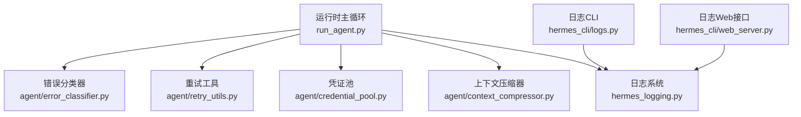
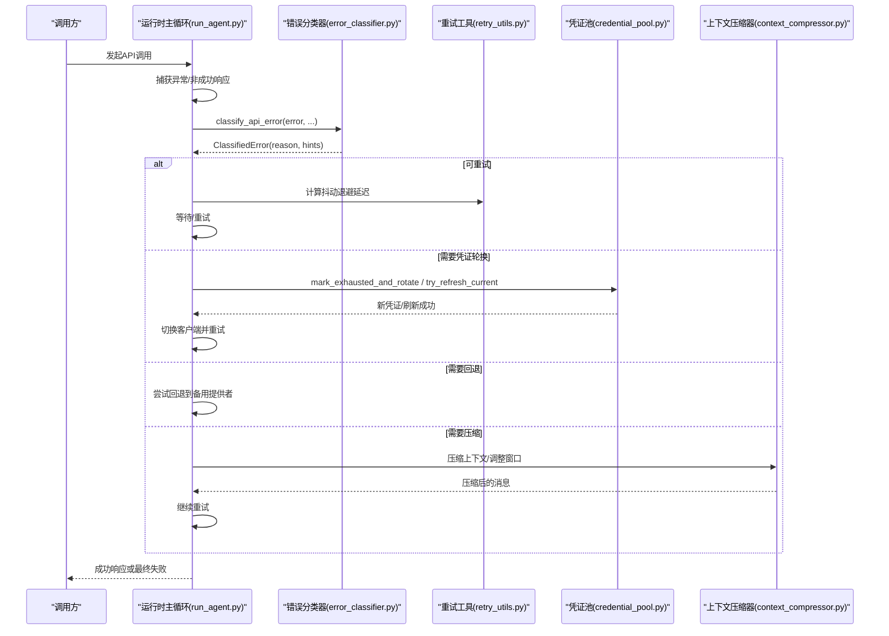
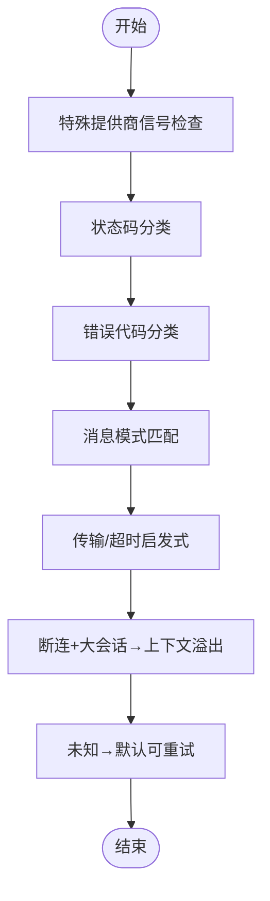
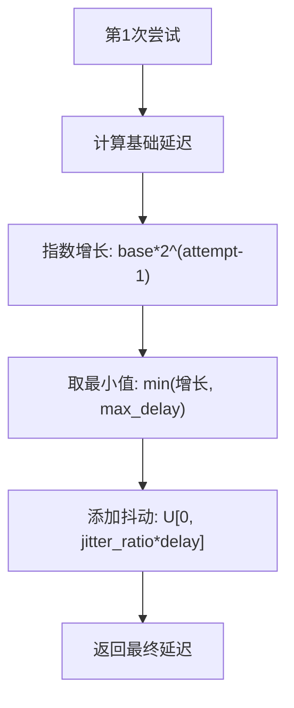
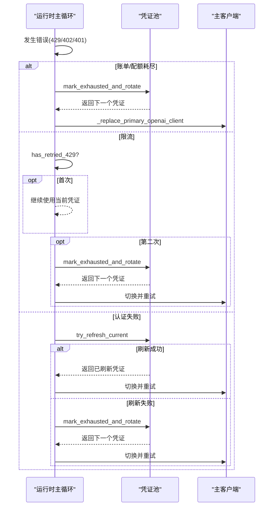
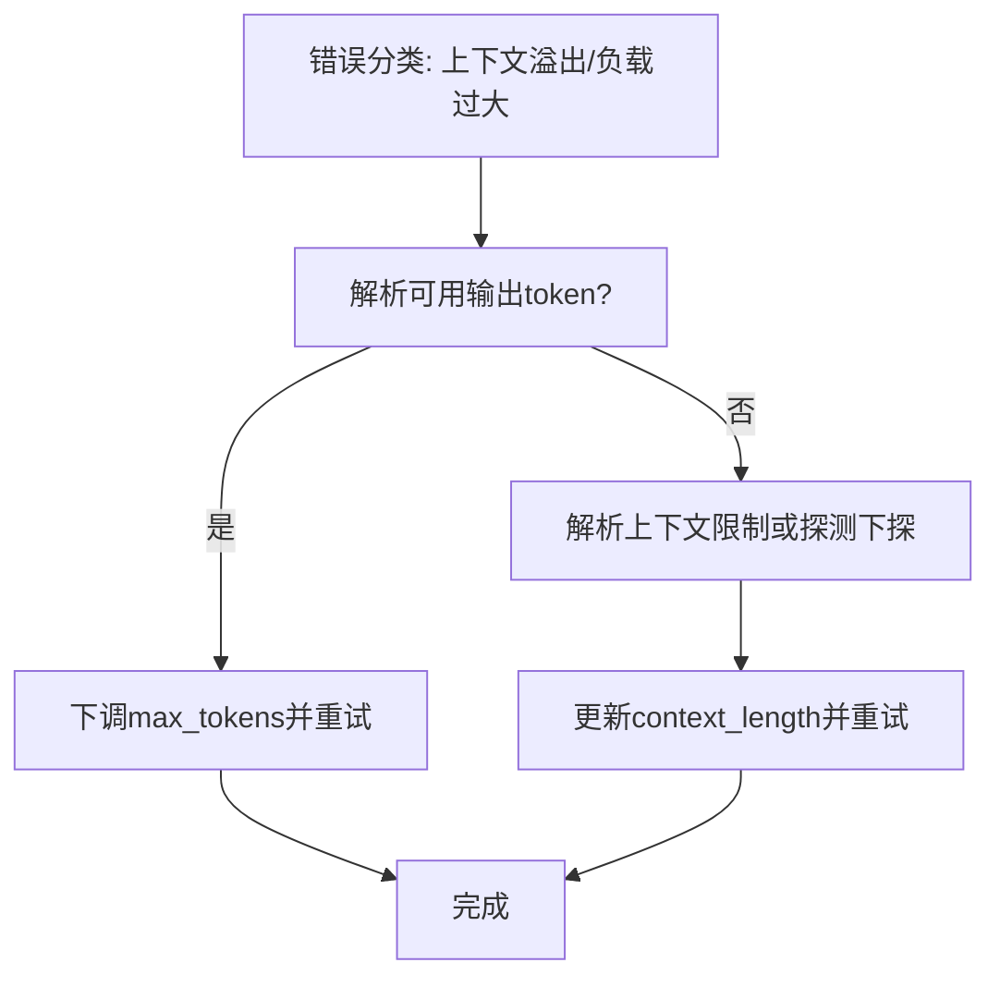
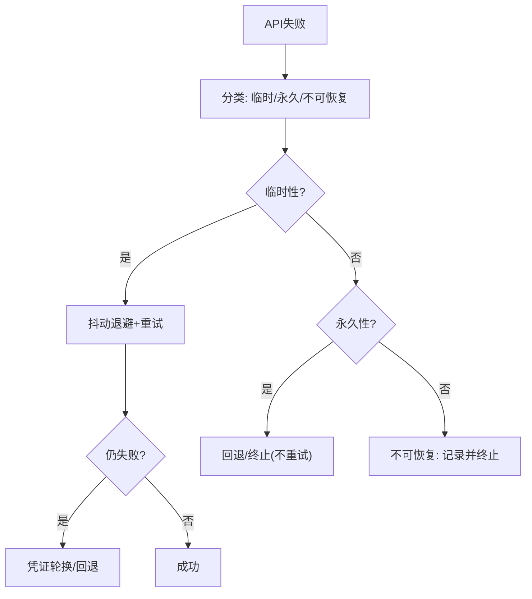
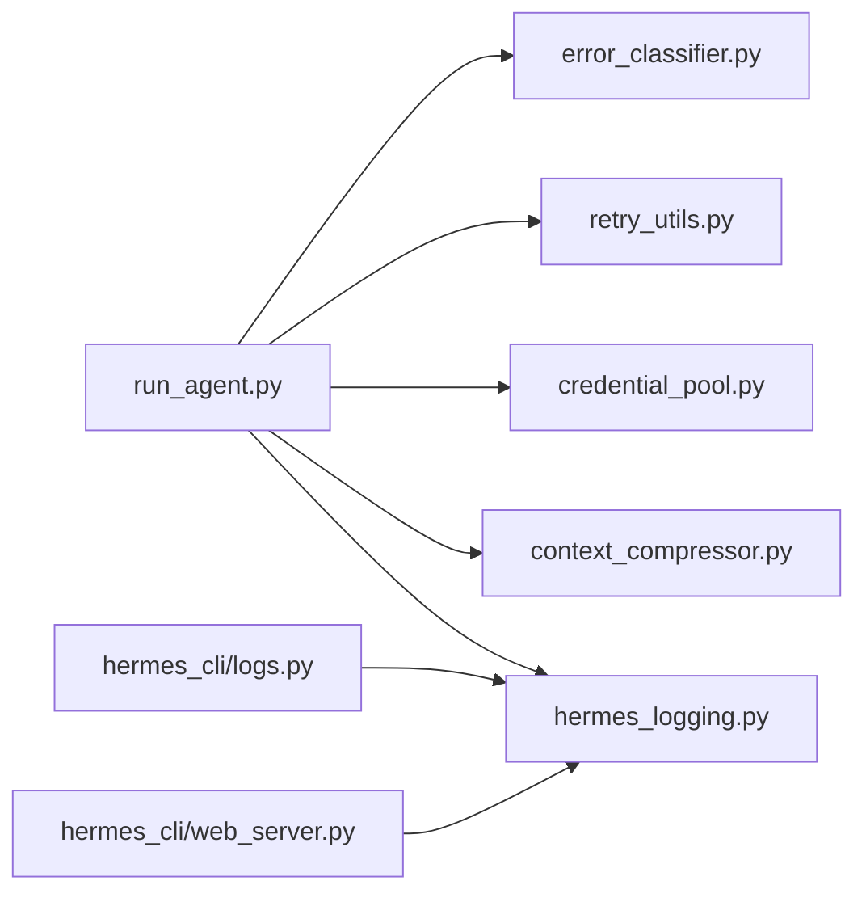

# 错误处理与恢复

<cite>
**本文引用的文件**
- [agent/error_classifier.py](file://agent/error_classifier.py)
- [agent/retry_utils.py](file://agent/retry_utils.py)
- [run_agent.py](file://run_agent.py)
- [agent/credential_pool.py](file://agent/credential_pool.py)
- [agent/context_compressor.py](file://agent/context_compressor.py)
- [hermes_logging.py](file://hermes_logging.py)
- [hermes_cli/logs.py](file://hermes_cli/logs.py)
- [hermes_cli/web_server.py](file://hermes_cli/web_server.py)
- [tests/test_retry_utils.py](file://tests/test_retry_utils.py)
- [tests/run_agent/test_413_compression.py](file://tests/run_agent/test_413_compression.py)
- [tests/run_agent/test_long_context_tier_429.py](file://tests/run_agent/test_long_context_tier_429.py)
</cite>

## 目录
1. [简介](#简介)
2. [项目结构](#项目结构)
3. [核心组件](#核心组件)
4. [架构总览](#架构总览)
5. [详细组件分析](#详细组件分析)
6. [依赖分析](#依赖分析)
7. [性能考量](#性能考量)
8. [故障排查指南](#故障排查指南)
9. [结论](#结论)
10. [附录](#附录)

## 简介
本文件系统化阐述 Hermes Agent 的错误处理与恢复体系，覆盖以下主题：
- API 错误分类机制：网络错误、认证失败、速率限制、模型错误等的识别与处理
- 重试策略：抖动退避算法、指数退避与最大重试次数控制
- 错误恢复的上下文保护：状态回滚、资源清理、一致性维护
- 不同类型错误的处理策略：临时性、永久性与不可恢复错误
- 具体代码示例路径：展示错误捕获、分类与恢复流程
- 错误日志记录、监控指标与故障诊断最佳实践

## 项目结构
围绕错误处理与恢复的关键模块如下：
- 错误分类器：统一的 API 错误分类与恢复建议生成
- 重试工具：抖动退避（decorrelated jittered backoff）
- 运行时主循环：在每次 API 调用失败后执行分类、恢复与回退
- 凭证池：同一提供商的多凭证轮换与刷新
- 上下文压缩器：针对上下文过长与负载过大进行压缩与窗口调整
- 日志与诊断：日志分层、过滤与实时查看

图表来源
- [agent/error_classifier.py:1-830](file://agent/error_classifier.py#L1-L830)
- [agent/retry_utils.py:1-58](file://agent/retry_utils.py#L1-L58)
- [run_agent.py:4900-5099](file://run_agent.py#L4900-L5099)
- [run_agent.py:9800-9999](file://run_agent.py#L9800-L9999)
- [run_agent.py:9999-10198](file://run_agent.py#L9999-L10198)
- [agent/credential_pool.py:1-200](file://agent/credential_pool.py#L1-L200)
- [agent/context_compressor.py:1-200](file://agent/context_compressor.py#L1-L200)
- [hermes_logging.py:202-237](file://hermes_logging.py#L202-L237)
- [hermes_cli/logs.py:138-170](file://hermes_cli/logs.py#L138-L170)
- [hermes_cli/web_server.py:1764-1797](file://hermes_cli/web_server.py#L1764-L1797)

章节来源
- [agent/error_classifier.py:1-830](file://agent/error_classifier.py#L1-L830)
- [agent/retry_utils.py:1-58](file://agent/retry_utils.py#L1-L58)
- [run_agent.py:4900-5099](file://run_agent.py#L4900-L5099)
- [run_agent.py:9800-10198](file://run_agent.py#L9800-L10198)
- [agent/credential_pool.py:1-200](file://agent/credential_pool.py#L1-L200)
- [agent/context_compressor.py:1-200](file://agent/context_compressor.py#L1-L200)
- [hermes_logging.py:202-237](file://hermes_logging.py#L202-L237)
- [hermes_cli/logs.py:138-170](file://hermes_cli/logs.py#L138-L170)
- [hermes_cli/web_server.py:1764-1797](file://hermes_cli/web_server.py#L1764-L1797)

## 核心组件
- 错误分类器：基于 HTTP 状态码、错误代码、消息模式与传输错误的优先级流水线，输出 FailoverReason 与恢复动作提示（是否可重试、是否压缩、是否轮换凭证、是否回退）
- 重试工具：抖动退避延迟计算，防止并发重试导致“惊群效应”
- 运行时主循环：在 API 失败时调用分类器，按分类结果执行凭证轮换、回退、压缩或终止；支持最大重试次数与超时检测
- 凭证池：同一提供商的多凭证管理，支持填充优先、轮询与随机策略，带冷却时间与刷新能力
- 上下文压缩器：对会话历史进行摘要式压缩，保护头尾消息，迭代更新摘要，维持一致性
- 日志系统：主活动日志与错误日志分离，支持按级别、组件、会话过滤与实时查看

章节来源
- [agent/error_classifier.py:24-830](file://agent/error_classifier.py#L24-L830)
- [agent/retry_utils.py:19-58](file://agent/retry_utils.py#L19-L58)
- [run_agent.py:4940-5022](file://run_agent.py#L4940-L5022)
- [run_agent.py:9827-9932](file://run_agent.py#L9827-L9932)
- [run_agent.py:9934-10153](file://run_agent.py#L9934-L10153)
- [agent/credential_pool.py:50-200](file://agent/credential_pool.py#L50-L200)
- [agent/context_compressor.py:188-200](file://agent/context_compressor.py#L188-L200)
- [hermes_logging.py:202-237](file://hermes_logging.py#L202-L237)

## 架构总览
下图展示了从 API 调用到错误分类、恢复与回退的整体流程。

图表来源
- [run_agent.py:4940-5022](file://run_agent.py#L4940-L5022)
- [run_agent.py:9827-10153](file://run_agent.py#L9827-L10153)
- [agent/error_classifier.py:242-416](file://agent/error_classifier.py#L242-L416)
- [agent/retry_utils.py:19-58](file://agent/retry_utils.py#L19-L58)
- [agent/credential_pool.py:192-200](file://agent/credential_pool.py#L192-L200)
- [agent/context_compressor.py:188-200](file://agent/context_compressor.py#L188-L200)

## 详细组件分析

### 错误分类器（API 错误分类机制）
- 分类维度
  - HTTP 状态码：401/402/403/404/413/429/500/502/503/529 等
  - 错误代码：如 resource_exhausted、rate_limit_exceeded、billing_not_active 等
  - 消息模式：包含“usage limit”“rate limit”“context length”“billing”“model not found”等关键词
  - 传输错误：连接超时、协议错误、连接中断等
  - 特定提供商信号：Anthropic thinking signature、long-context tier gate 等
- 输出结构
  - FailoverReason：决定恢复策略（认证失败、账单/配额、限流、服务器错误、超时、上下文溢出、负载过大、模型未找到、请求格式错误、特定提供商问题、未知）
  - 恢复动作提示：retryable、should_compress、should_rotate_credential、should_fallback
- 关键实现要点
  - 优先级流水线：先特殊提供商信号，再状态码细化，再错误代码，再消息模式，再传输错误与断连启发式，最后未知
  - 对 402/400 的精细区分：将“周期性配额”与“账单耗尽”区分开
  - 对“上下文溢出”的启发式判断：结合 token 数量、消息条数与断连模式

图表来源
- [agent/error_classifier.py:242-416](file://agent/error_classifier.py#L242-L416)
- [agent/error_classifier.py:420-524](file://agent/error_classifier.py#L420-L524)
- [agent/error_classifier.py:633-669](file://agent/error_classifier.py#L633-L669)
- [agent/error_classifier.py:673-759](file://agent/error_classifier.py#L673-L759)

章节来源
- [agent/error_classifier.py:24-830](file://agent/error_classifier.py#L24-L830)

### 重试策略（抖动退避与指数退避）
- 抖动退避（Decorrelated Jittered Backoff）
  - 基于指数增长的延迟，叠加随机抖动，避免多个会话同时重试
  - 使用时间戳与单调计数器作为种子，确保并发安全
- 指数退避
  - 第 n 次尝试延迟 ≈ min(base * 2^(n-1), max_delay)
- 最大重试次数控制
  - 在运行时主循环中设置上限，超过则尝试回退或终止
- 并发安全与抖动
  - 单元测试验证抖动分布、边界值与线程安全

图表来源
- [agent/retry_utils.py:19-58](file://agent/retry_utils.py#L19-L58)
- [tests/test_retry_utils.py:1-117](file://tests/test_retry_utils.py#L1-L117)

章节来源
- [agent/retry_utils.py:1-58](file://agent/retry_utils.py#L1-L58)
- [tests/test_retry_utils.py:1-117](file://tests/test_retry_utils.py#L1-L117)

### 凭证轮换与恢复（上下文保护与一致性）
- 凭证池策略
  - 同一提供商内：填充优先、轮询、随机、最少使用
  - 冷却时间：429/402 默认 1 小时，可被提供商返回的 reset_at 覆盖
- 回复路径
  - 账单/配额耗尽：立即轮换
  - 限流：首次连续失败后轮换
  - 认证失败：先尝试刷新，失败后再轮换
- 上下文保护
  - 切换凭证时重建主客户端，避免旧连接状态污染
  - 会话切换与资源清理：在压缩或轮换前后清理缓存、重置重试计数

图表来源
- [run_agent.py:4940-5022](file://run_agent.py#L4940-L5022)
- [agent/credential_pool.py:192-200](file://agent/credential_pool.py#L192-L200)

章节来源
- [run_agent.py:4940-5022](file://run_agent.py#L4940-L5022)
- [agent/credential_pool.py:1-200](file://agent/credential_pool.py#L1-L200)

### 上下文压缩与窗口调整（负载过大与上下文溢出）
- 压缩策略
  - 保护头尾消息，中间内容通过摘要模型总结
  - 工具输出预修剪，减少摘要负担
  - 迭代更新摘要，跨多次压缩保留信息
- 窗口调整
  - 对于“输出上限过大”与“输入超窗”两类错误分别处理
  - 解析可用输出 token，下调 max_tokens；否则降低 context_length 并逐步探测
- 一致性维护
  - 压缩后清空会话历史缓存，确保新消息写入新会话
  - 重置重试计数，避免压缩后立即再次触发

图表来源
- [run_agent.py:9934-10153](file://run_agent.py#L9934-L10153)
- [run_agent.py:9999-10198](file://run_agent.py#L9999-L10198)
- [agent/context_compressor.py:188-200](file://agent/context_compressor.py#L188-L200)

章节来源
- [run_agent.py:9827-10153](file://run_agent.py#L9827-L10153)
- [run_agent.py:9999-10198](file://run_agent.py#L9999-L10198)
- [agent/context_compressor.py:1-200](file://agent/context_compressor.py#L1-L200)

### 错误恢复流程（临时性/永久性/不可恢复）
- 临时性错误
  - 限流、服务器错误、超时、断连等
  - 采用抖动退避 + 凭证轮换 + 回退策略
- 永久性错误
  - 认证失败（刷新失败）、模型不存在、请求格式错误
  - 设置 retryable=False，优先回退或终止
- 不可恢复错误
  - 账单耗尽、上下文压缩与负载压缩均无法缓解
  - 记录并终止，必要时跳过持久化以避免放大错误

图表来源
- [agent/error_classifier.py:24-830](file://agent/error_classifier.py#L24-L830)
- [run_agent.py:9827-10153](file://run_agent.py#L9827-L10153)

章节来源
- [agent/error_classifier.py:24-830](file://agent/error_classifier.py#L24-L830)
- [run_agent.py:9827-10153](file://run_agent.py#L9827-L10153)

### 代码示例路径（错误捕获、分类与恢复）
- 错误分类器调用
  - [run_agent.py:4940-5022](file://run_agent.py#L4940-L5022) 中的 _recover_with_credential_pool
  - [agent/error_classifier.py:242-416](file://agent/error_classifier.py#L242-L416) 的 classify_api_error
- 抖动退避
  - [agent/retry_utils.py:19-58](file://agent/retry_utils.py#L19-L58)
  - [tests/test_retry_utils.py:1-117](file://tests/test_retry_utils.py#L1-L117)
- 上下文压缩与窗口调整
  - [run_agent.py:9934-10153](file://run_agent.py#L9934-L10153)
  - [run_agent.py:9999-10198](file://run_agent.py#L9999-L10198)
- 413 负载过大压缩
  - [tests/run_agent/test_413_compression.py:289-322](file://tests/run_agent/test_413_compression.py#L289-L322)
- 429 长上下文层级门
  - [tests/run_agent/test_long_context_tier_429.py:87-124](file://tests/run_agent/test_long_context_tier_429.py#L87-L124)

章节来源
- [run_agent.py:4940-5022](file://run_agent.py#L4940-L5022)
- [agent/error_classifier.py:242-416](file://agent/error_classifier.py#L242-L416)
- [agent/retry_utils.py:19-58](file://agent/retry_utils.py#L19-L58)
- [tests/test_retry_utils.py:1-117](file://tests/test_retry_utils.py#L1-L117)
- [run_agent.py:9934-10153](file://run_agent.py#L9934-L10153)
- [run_agent.py:9999-10198](file://run_agent.py#L9999-L10198)
- [tests/run_agent/test_413_compression.py:289-322](file://tests/run_agent/test_413_compression.py#L289-L322)
- [tests/run_agent/test_long_context_tier_429.py:87-124](file://tests/run_agent/test_long_context_tier_429.py#L87-L124)

## 依赖分析
- 组件耦合
  - 运行时主循环强依赖错误分类器与重试工具
  - 凭证池与上下文压缩器作为恢复手段被主循环调用
- 外部依赖
  - 日志系统与 CLI/Web 接口用于诊断与监控
- 潜在环路
  - 无直接循环依赖；各模块职责清晰

图表来源
- [run_agent.py:4900-5099](file://run_agent.py#L4900-L5099)
- [agent/error_classifier.py:1-830](file://agent/error_classifier.py#L1-L830)
- [agent/retry_utils.py:1-58](file://agent/retry_utils.py#L1-L58)
- [agent/credential_pool.py:1-200](file://agent/credential_pool.py#L1-L200)
- [agent/context_compressor.py:1-200](file://agent/context_compressor.py#L1-L200)
- [hermes_logging.py:202-237](file://hermes_logging.py#L202-L237)
- [hermes_cli/logs.py:138-170](file://hermes_cli/logs.py#L138-L170)
- [hermes_cli/web_server.py:1764-1797](file://hermes_cli/web_server.py#L1764-L1797)

章节来源
- [run_agent.py:4900-5099](file://run_agent.py#L4900-L5099)
- [agent/error_classifier.py:1-830](file://agent/error_classifier.py#L1-L830)
- [agent/retry_utils.py:1-58](file://agent/retry_utils.py#L1-L58)
- [agent/credential_pool.py:1-200](file://agent/credential_pool.py#L1-L200)
- [agent/context_compressor.py:1-200](file://agent/context_compressor.py#L1-L200)
- [hermes_logging.py:202-237](file://hermes_logging.py#L202-L237)
- [hermes_cli/logs.py:138-170](file://hermes_cli/logs.py#L138-L170)
- [hermes_cli/web_server.py:1764-1797](file://hermes_cli/web_server.py#L1764-L1797)

## 性能考量
- 抖动退避降低惊群效应，提升整体吞吐稳定性
- 上下文压缩与窗口探测减少重复失败重试
- 会话切换与资源清理避免状态泄漏与内存膨胀
- 日志分层与滚动策略降低磁盘与 I/O 压力

## 故障排查指南
- 日志查看
  - 主活动日志：agent.log（INFO+），错误日志：errors.log（WARNING+）
  - CLI 实时查看与过滤：支持按级别、组件、会话筛选
  - Web 接口：按组件前缀与关键字检索
- 常见场景定位
  - 413 负载过大：检查压缩尝试次数与是否达到上限
  - 上下文溢出：确认是否解析到可用输出上限或需要降低 context_length
  - 429/402：查看凭证池冷却时间与轮换策略
  - 断连/超时：确认 stale-call 超时配置与重试上限
- 诊断建议
  - 使用 hermes logs 命令快速定位最近错误
  - 结合错误分类器输出的 reason 与恢复动作提示，判断应采取的措施

章节来源
- [hermes_logging.py:202-237](file://hermes_logging.py#L202-L237)
- [hermes_cli/logs.py:138-170](file://hermes_cli/logs.py#L138-L170)
- [hermes_cli/web_server.py:1764-1797](file://hermes_cli/web_server.py#L1764-L1797)
- [run_agent.py:9827-10153](file://run_agent.py#L9827-L10153)

## 结论
Hermes Agent 的错误处理与恢复体系通过“统一分类 + 抖动退避 + 凭证轮换 + 上下文压缩 + 多级回退”的组合拳，有效提升了在复杂外部环境下的鲁棒性与用户体验。分类器提供了可扩展的错误语义，重试工具与凭证池保障了临时性错误的自愈能力，上下文压缩器与窗口调整解决了高负载与长上下文问题，日志与诊断工具则为运维与排障提供了坚实支撑。

## 附录
- 关键实现参考路径
  - [agent/error_classifier.py:242-416](file://agent/error_classifier.py#L242-L416)
  - [agent/retry_utils.py:19-58](file://agent/retry_utils.py#L19-L58)
  - [run_agent.py:4940-5022](file://run_agent.py#L4940-L5022)
  - [run_agent.py:9827-10153](file://run_agent.py#L9827-L10153)
  - [agent/credential_pool.py:192-200](file://agent/credential_pool.py#L192-L200)
  - [agent/context_compressor.py:188-200](file://agent/context_compressor.py#L188-L200)
  - [hermes_logging.py:202-237](file://hermes_logging.py#L202-L237)
  - [hermes_cli/logs.py:138-170](file://hermes_cli/logs.py#L138-L170)
  - [hermes_cli/web_server.py:1764-1797](file://hermes_cli/web_server.py#L1764-L1797)
  - [tests/test_retry_utils.py:1-117](file://tests/test_retry_utils.py#L1-L117)
  - [tests/run_agent/test_413_compression.py:289-322](file://tests/run_agent/test_413_compression.py#L289-L322)
  - [tests/run_agent/test_long_context_tier_429.py:87-124](file://tests/run_agent/test_long_context_tier_429.py#L87-L124)