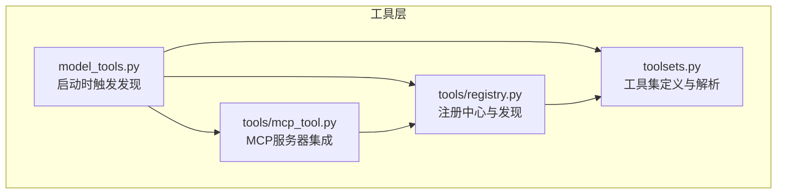
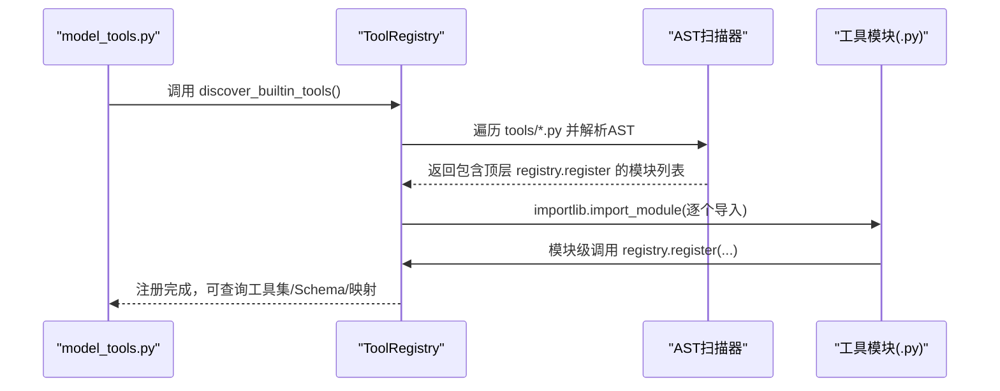
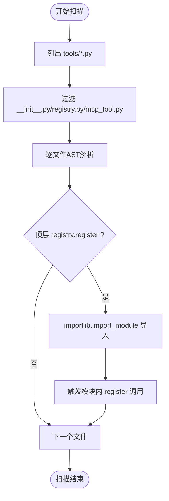
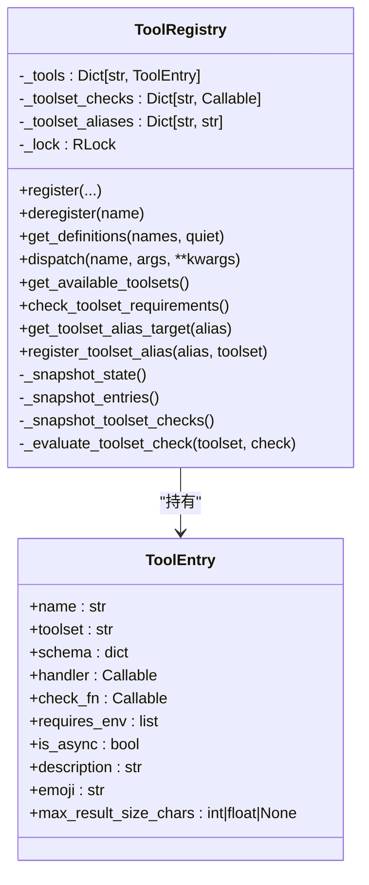
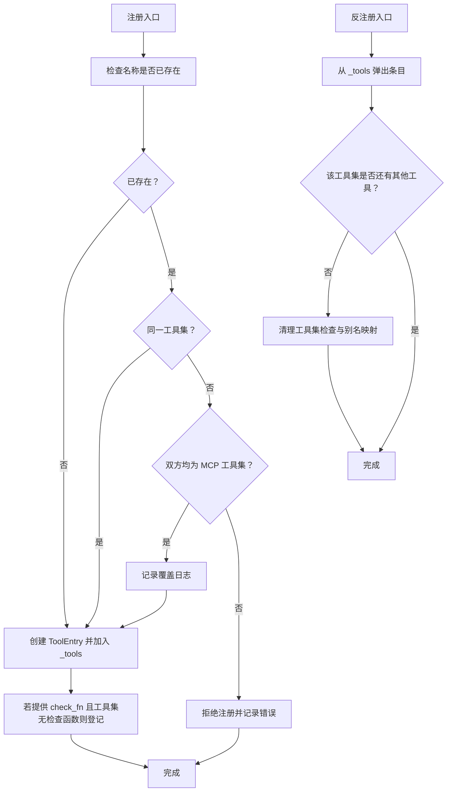
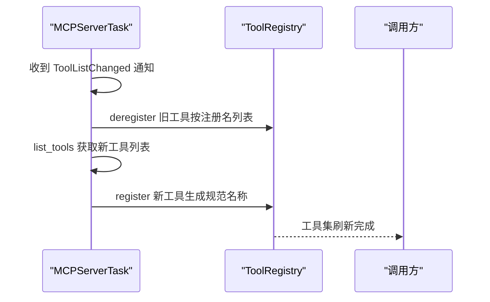
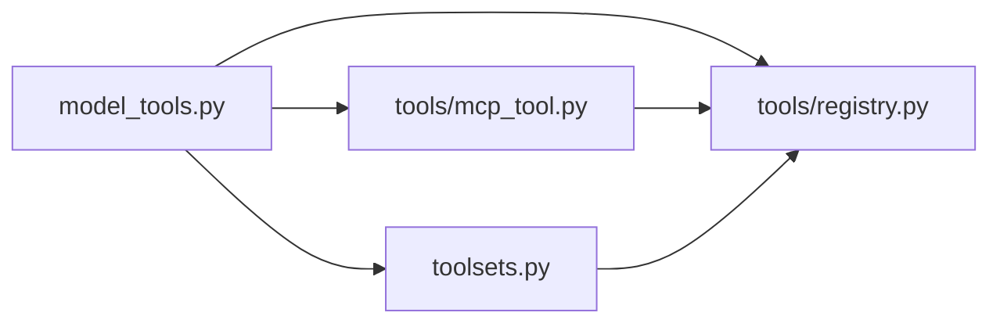

# 工具发现与注册机制

<cite>
**本文档引用的文件**
- [tools/registry.py](file://tools/registry.py)
- [model_tools.py](file://model_tools.py)
- [toolsets.py](file://toolsets.py)
- [tools/mcp_tool.py](file://tools/mcp_tool.py)
- [tests/tools/test_registry.py](file://tests/tools/test_registry.py)
- [tests/tools/test_mcp_dynamic_discovery.py](file://tests/tools/test_mcp_dynamic_discovery.py)
- [website/docs/developer-guide/tools-runtime.md](file://website/docs/developer-guide/tools-runtime.md)
</cite>

## 目录
1. [简介](#简介)
2. [项目结构](#项目结构)
3. [核心组件](#核心组件)
4. [架构总览](#架构总览)
5. [详细组件分析](#详细组件分析)
6. [依赖关系分析](#依赖关系分析)
7. [性能考量](#性能考量)
8. [故障排查指南](#故障排查指南)
9. [结论](#结论)
10. [附录](#附录)

## 简介
本文件系统化阐述 Hermes Agent 的工具发现与注册机制，重点覆盖以下方面：
- 工具自动发现算法：基于 AST 解析的模块扫描与导入流程
- 工具注册与冲突检测：名称唯一性、工具集归属与覆盖规则
- ToolEntry 元数据结构与 ToolRegistry 单例模式及线程安全设计
- 工具可用性验证、工具集检查与动态刷新（MCP）
- 工具别名系统、工具集映射与查询优化策略
- 最佳实践与常见问题解决方案

## 项目结构
围绕工具发现与注册的核心代码主要位于 tools/registry.py，并由 model_tools.py 在启动时触发发现流程；MCP 工具通过 tools/mcp_tool.py 动态接入并支持刷新；工具集定义与解析在 toolsets.py 中完成。

图表来源
- [model_tools.py:128-147](file://model_tools.py#L128-L147)
- [tools/registry.py:56-74](file://tools/registry.py#L56-L74)
- [tools/mcp_tool.py:1-100](file://tools/mcp_tool.py#L1-L100)
- [toolsets.py:1-60](file://toolsets.py#L1-L60)

章节来源
- [model_tools.py:128-147](file://model_tools.py#L128-L147)
- [website/docs/developer-guide/tools-runtime.md:45-67](file://website/docs/developer-guide/tools-runtime.md#L45-L67)

## 核心组件
- ToolEntry：封装单个工具的元数据（名称、工具集、Schema、处理器、可用性检查函数、环境要求、是否异步、描述、表情符号、最大结果大小等），采用 __slots__ 优化内存占用。
- ToolRegistry：单例注册中心，负责工具注册、反注册、可用性检查、工具集映射、别名管理、快照读取与线程安全保护。
- discover_builtin_tools：基于 AST 的自注册模块扫描与导入，仅导入包含顶层 registry.register 调用的模块。
- model_tools：在导入阶段触发内置工具发现、MCP 发现与插件发现，构建后向兼容常量与工具集映射。

章节来源
- [tools/registry.py:76-98](file://tools/registry.py#L76-L98)
- [tools/registry.py:100-110](file://tools/registry.py#L100-L110)
- [tools/registry.py:56-74](file://tools/registry.py#L56-L74)
- [model_tools.py:128-147](file://model_tools.py#L128-L147)

## 架构总览
工具发现与注册的整体流程如下：

图表来源
- [model_tools.py:128-147](file://model_tools.py#L128-L147)
- [tools/registry.py:56-74](file://tools/registry.py#L56-L74)
- [tools/registry.py:176-228](file://tools/registry.py#L176-L228)

## 详细组件分析

### 自动发现算法与 AST 解析机制
- AST 匹配规则：仅识别模块体顶层的 registry.register(...) 调用，避免辅助模块中嵌套调用被误导入。
- 扫描策略：遍历 tools/*.py，跳过 __init__.py、registry.py、mcp_tool.py，对剩余文件进行 AST 解析与匹配。
- 导入策略：对匹配成功的模块执行 importlib.import_module，触发模块内顶层 registry.register 调用，完成注册。

图表来源
- [tools/registry.py:41-54](file://tools/registry.py#L41-L54)
- [tools/registry.py:56-74](file://tools/registry.py#L56-L74)

章节来源
- [tools/registry.py:28-54](file://tools/registry.py#L28-L54)
- [tools/registry.py:56-74](file://tools/registry.py#L56-L74)
- [website/docs/developer-guide/tools-runtime.md:45-67](file://website/docs/developer-guide/tools-runtime.md#L45-L67)

### ToolEntry 元数据结构
- 字段清单：name、toolset、schema、handler、check_fn、requires_env、is_async、description、emoji、max_result_size_chars。
- 设计要点：使用 __slots__ 减少内存开销；字段初始化时从 schema 推导默认描述，便于 UI 展示。

章节来源
- [tools/registry.py:76-98](file://tools/registry.py#L76-L98)

### ToolRegistry 单例模式与线程安全
- 单例：模块级 registry = ToolRegistry()，全局共享。
- 线程安全：内部使用递归锁（RLock）保护所有写操作；读操作通过快照（snapshot）保证一致性。
- 快照策略：_snapshot_state/_snapshot_entries/_snapshot_toolset_checks 返回稳定视图，避免并发读写导致的数据竞争。

图表来源
- [tools/registry.py:100-110](file://tools/registry.py#L100-L110)
- [tools/registry.py:112-124](file://tools/registry.py#L112-L124)
- [tools/registry.py:176-228](file://tools/registry.py#L176-L228)
- [tools/registry.py:76-98](file://tools/registry.py#L76-L98)

章节来源
- [tools/registry.py:100-110](file://tools/registry.py#L100-L110)
- [tools/registry.py:112-124](file://tools/registry.py#L112-L124)
- [tests/tools/test_registry.py:427-563](file://tests/tools/test_registry.py#L427-L563)

### 工具注册流程、冲突检测与覆盖规则
- 冲突检测：若同名工具已存在且来自不同工具集，则拒绝注册；MCP 到 MCP 的覆盖例外，允许服务器刷新场景下的覆盖。
- 工具集检查：首次注册带 check_fn 的工具时，记录该工具集的检查函数；后续可用 is_toolset_available/check_toolset_requirements 查询。
- 反注册清理：deregister 会移除工具条目；当某工具集不再有剩余工具时，清理对应工具集检查与别名映射。

图表来源
- [tools/registry.py:176-228](file://tools/registry.py#L176-L228)
- [tools/registry.py:229-252](file://tools/registry.py#L229-L252)

章节来源
- [tools/registry.py:176-228](file://tools/registry.py#L176-L228)
- [tests/tools/test_mcp_dynamic_discovery.py:111-161](file://tests/tools/test_mcp_dynamic_discovery.py#L111-L161)

### 工具可用性验证与动态刷新机制
- 可用性验证：get_definitions 会按需缓存 check_fn 的执行结果，失败或抛异常时视为不可用；is_toolset_available/check_tool_availability 提供工具集粒度的可用性判断。
- 动态刷新（MCP）：MCPServerTask 支持 notifications/tools/list_changed 通知，触发 _refresh_tools 的“清空-重建”流程，确保运行时工具集与服务器一致。

图表来源
- [tests/tools/test_mcp_dynamic_discovery.py:39-98](file://tests/tools/test_mcp_dynamic_discovery.py#L39-L98)
- [tools/mcp_tool.py:1-100](file://tools/mcp_tool.py#L1-L100)
- [tools/registry.py:229-252](file://tools/registry.py#L229-L252)

章节来源
- [tools/registry.py:258-286](file://tools/registry.py#L258-L286)
- [tools/registry.py:352-433](file://tools/registry.py#L352-L433)
- [tests/tools/test_mcp_dynamic_discovery.py:39-98](file://tests/tools/test_mcp_dynamic_discovery.py#L39-L98)

### 工具别名系统、工具集映射与查询优化
- 工具集别名：register_toolset_alias 支持为工具集注册别名；get_toolset_alias_target 查询目标工具集；deregister 会在最后工具移除时清理别名。
- 工具集映射：get_tool_to_toolset_map 返回工具名到工具集的映射；get_tool_names_for_toolset 返回指定工具集下的工具名列表。
- 查询优化：get_definitions 使用快照与缓存 check_fn 结果，避免重复计算；dispatch 对异步处理器通过统一桥接函数运行，保证线程安全。

章节来源
- [tools/registry.py:151-171](file://tools/registry.py#L151-L171)
- [tools/registry.py:348-351](file://tools/registry.py#L348-L351)
- [tools/registry.py:144-149](file://tools/registry.py#L144-L149)
- [tools/registry.py:292-310](file://tools/registry.py#L292-L310)

### 工具集检查函数与可用性验证
- 工具集检查：check_fn 控制工具集可用性；_evaluate_toolset_check 将异常转为不可用，避免影响主流程。
- 工具集聚合：get_available_toolsets 组装工具集信息（可用性、工具列表、环境变量需求）；check_toolset_requirements 返回每个工具集的布尔可用性。

章节来源
- [tools/registry.py:125-134](file://tools/registry.py#L125-L134)
- [tools/registry.py:371-412](file://tools/registry.py#L371-L412)

## 依赖关系分析
- model_tools 依赖 tools/registry 与 toolsets，负责触发发现与构建后向兼容常量。
- MCP 工具通过 tools/mcp_tool 间接依赖 ToolRegistry 进行动态注册与刷新。
- 工具集定义与解析在 toolsets 中完成，支持别名与组合工具集。

图表来源
- [model_tools.py:128-147](file://model_tools.py#L128-L147)
- [tools/mcp_tool.py:1-100](file://tools/mcp_tool.py#L1-L100)
- [toolsets.py:1-60](file://toolsets.py#L1-L60)

章节来源
- [model_tools.py:128-147](file://model_tools.py#L128-L147)
- [toolsets.py:480-661](file://toolsets.py#L480-L661)

## 性能考量
- 快照读取：_snapshot_state/_snapshot_entries/_snapshot_toolset_checks 在读路径上返回稳定视图，避免并发写入干扰。
- 检查函数缓存：get_definitions 对 check_fn 的执行结果进行缓存，减少重复调用。
- 导入策略：仅导入顶层注册的模块，避免不必要的模块加载与副作用。
- 异步桥接：统一的 _run_async 桥接避免频繁创建/销毁事件循环，降低资源消耗。

## 故障排查指南
- 工具未出现
  - 检查工具模块是否包含顶层 registry.register 调用；辅助模块中的调用不会被发现。
  - 确认模块未因异常而导入失败；错误会被捕获并记录，不影响其他工具加载。
- 工具集不可用
  - 检查工具集对应的 check_fn 是否抛出异常；异常会被转换为不可用。
  - 确认环境变量满足 requires_env 要求。
- 工具名冲突
  - 同名工具已在其他工具集中注册时会被拒绝；MCP 到 MCP 的覆盖除外。
- MCP 工具刷新异常
  - 确认通知类型与 SDK 版本兼容；异常应被忽略而不触发刷新。
  - 检查 _refresh_tools 的“清空-重建”流程是否正确执行。

章节来源
- [tests/tools/test_registry.py:213-289](file://tests/tools/test_registry.py#L213-L289)
- [tests/tools/test_mcp_dynamic_discovery.py:79-109](file://tests/tools/test_mcp_dynamic_discovery.py#L79-L109)

## 结论
Hermes Agent 的工具发现与注册机制通过 AST 扫描与模块导入实现自动化，结合 ToolRegistry 的单例与快照读取保障线程安全与一致性。工具集检查、别名系统与动态刷新进一步增强了灵活性与可维护性。遵循本文最佳实践可有效避免冲突、提升可用性并简化运维。

## 附录

### 最佳实践
- 工具模块必须在模块体顶层调用 registry.register，避免在函数内部注册。
- 工具集命名建议使用语义化前缀（如 mcp-），便于 MCP 覆盖场景识别。
- 为工具集提供稳定的 check_fn，确保异常被处理而非传播崩溃。
- 使用工具集别名时保持唯一性，避免与现有工具集冲突。
- 动态刷新（MCP）场景下，确保通知类型与 SDK 版本兼容。

### 常见问题
- 问：为什么我的工具没有出现在可用工具列表？
  - 答：确认模块顶层存在 registry.register 调用；检查导入日志是否有异常。
- 问：工具集检查函数报错怎么办？
  - 答：在 check_fn 中捕获异常并返回 False；不要让异常冒泡。
- 问：如何安全地在 MCP 刷新后继续使用工具？
  - 答：依赖 _refresh_tools 的“清空-重建”流程；确保通知类型与 SDK 版本兼容。