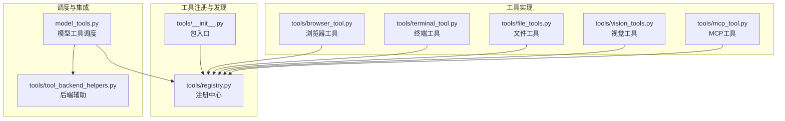
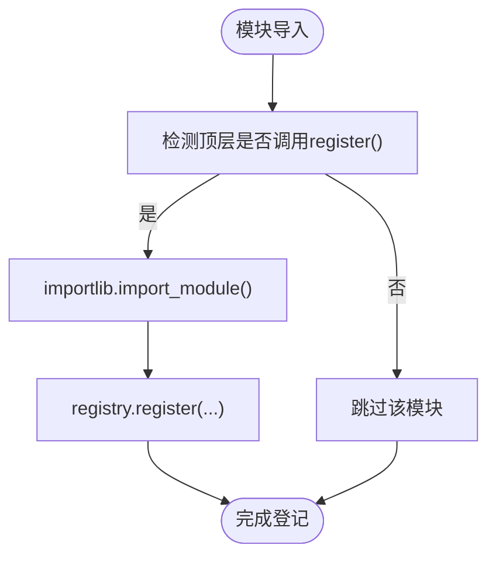
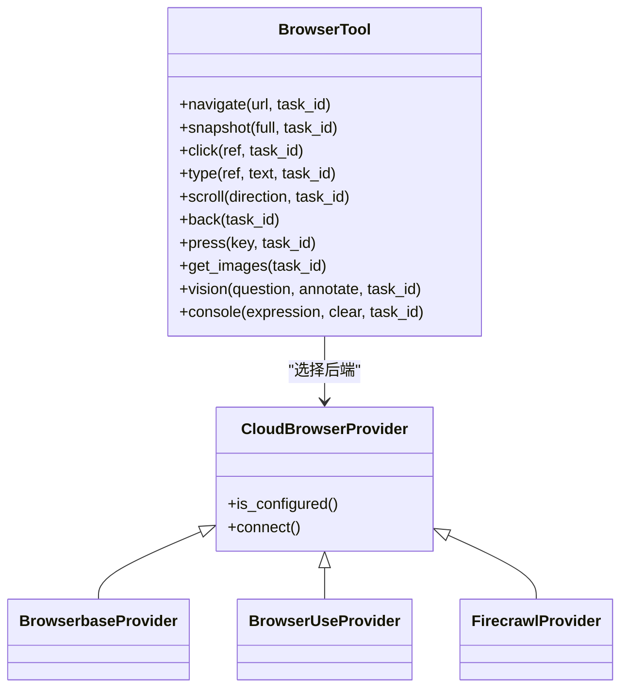
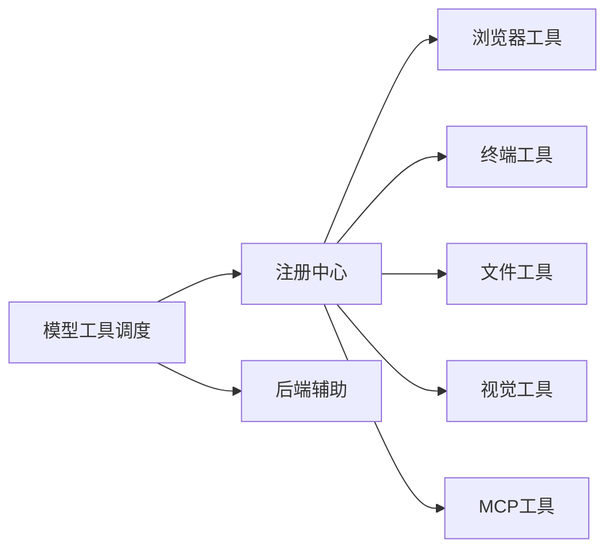

# 工具系统架构

<cite>
**本文档引用的文件**
- [tools/__init__.py](file://tools/__init__.py)
- [tools/registry.py](file://tools/registry.py)
- [tools/browser_tool.py](file://tools/browser_tool.py)
- [tools/terminal_tool.py](file://tools/terminal_tool.py)
- [tools/file_tools.py](file://tools/file_tools.py)
- [tools/vision_tools.py](file://tools/vision_tools.py)
- [tools/mcp_tool.py](file://tools/mcp_tool.py)
- [tools/tool_backend_helpers.py](file://tools/tool_backend_helpers.py)
- [model_tools.py](file://model_tools.py)
</cite>

## 目录
1. [简介](#简介)
2. [项目结构](#项目结构)
3. [核心组件](#核心组件)
4. [架构总览](#架构总览)
5. [详细组件分析](#详细组件分析)
6. [依赖关系分析](#依赖关系分析)
7. [性能考虑](#性能考虑)
8. [故障排除指南](#故障排除指南)
9. [结论](#结论)
10. [附录](#附录)

## 简介
本文件面向Hermes Agent工具系统，系统性阐述工具注册机制、自动发现与动态加载流程；解释工具分类体系、参数验证与执行管道设计；覆盖终端工具、浏览器工具、文件操作工具、视觉分析工具等架构设计；详述工具安全沙箱、并发执行控制与资源隔离机制；提供工具扩展开发指南、自定义工具创建流程与最佳实践；最后说明工具系统与代理引擎的集成模式与通信协议。

## 项目结构
工具系统位于tools目录，采用“模块即工具”的自注册模式：每个工具模块在导入时通过全局注册表进行登记，模型侧通过统一的工具调度器调用具体处理器。核心文件包括：
- 注册中心：集中管理工具元数据、可用性检查与分发
- 工具实现：浏览器、终端、文件、视觉、MCP等
- 调度层：对注册中心进行查询与分发，并负责参数类型转换、异步桥接与插件钩子



**图表来源**
- [tools/registry.py:100-437](file://tools/registry.py#L100-L437)
- [tools/__init__.py:1-26](file://tools/__init__.py#L1-L26)
- [tools/browser_tool.py:657-800](file://tools/browser_tool.py#L657-L800)
- [tools/terminal_tool.py:512-800](file://tools/terminal_tool.py#L512-L800)
- [tools/file_tools.py:695-800](file://tools/file_tools.py#L695-L800)
- [tools/vision_tools.py:748-790](file://tools/vision_tools.py#L748-L790)
- [tools/mcp_tool.py:1-120](file://tools/mcp_tool.py#L1-L120)
- [model_tools.py:1-120](file://model_tools.py#L1-L120)

**章节来源**
- [tools/__init__.py:1-26](file://tools/__init__.py#L1-L26)
- [tools/registry.py:1-120](file://tools/registry.py#L1-L120)
- [model_tools.py:1-120](file://model_tools.py#L1-L120)

## 核心组件
- 工具注册中心（ToolRegistry）
  - 单例注册表，维护工具名称到工具条目（包含模式、处理器、可用性检查、环境需求、是否异步、描述、表情符号、最大结果大小）的映射
  - 支持工具集别名注册、快照读取、并发安全（读写锁）、动态刷新（MCP）
  - 提供按工具名查询、按工具集过滤、可用性检查、分发执行、工具集元信息聚合等能力
- 工具条目（ToolEntry）
  - 封装单个工具的元数据与执行信息，支持最大结果大小限制与异步桥接
- 模型工具调度（model_tools.py）
  - 触发内置工具自动发现与MCP工具发现
  - 统一参数类型转换（数字、布尔）
  - 异步工具的事件循环桥接
  - 插件前置/后置钩子触发
  - 动态生成execute_code工具模式（仅列出可用沙箱工具）

**章节来源**
- [tools/registry.py:76-437](file://tools/registry.py#L76-L437)
- [model_tools.py:1-120](file://model_tools.py#L1-L120)
- [model_tools.py:196-316](file://model_tools.py#L196-L316)
- [model_tools.py:421-534](file://model_tools.py#L421-L534)

## 架构总览
工具系统采用“自注册 + 统一调度”的架构：
- 自动发现：工具模块导入时调用注册中心的register方法完成登记
- 可用性检查：每个工具可配置check_fn，注册中心在查询与分发前进行检查
- 执行分发：统一由注册中心dispatch，异步工具通过事件循环桥接
- 参数校验：模型工具调度层对LLM返回的字符串参数进行类型强制转换
- 插件集成：在工具调用前后触发插件钩子，支持阻断与审计

```mermaid
sequenceDiagram
participant Agent as "代理引擎"
participant MT as "模型工具调度(model_tools.py)"
participant REG as "注册中心(Registry)"
participant Tool as "工具处理器(模块)"
participant Loop as "事件循环桥接"
Agent->>MT : 请求调用函数名与参数
MT->>MT : 参数类型强制转换
MT->>REG : 查询工具可用性/分发请求
REG->>REG : 检查工具存在与可用性
REG->>Tool : 调用处理器(同步或异步)
Tool-->>REG : 返回JSON字符串结果
REG-->>MT : 返回结果
MT-->>Agent : 返回结果
Note over Tool,Loop : 异步工具通过事件循环桥接运行
```

**图表来源**
- [model_tools.py:421-534](file://model_tools.py#L421-L534)
- [tools/registry.py:292-310](file://tools/registry.py#L292-L310)
- [model_tools.py:81-126](file://model_tools.py#L81-L126)

## 详细组件分析

### 工具注册与发现机制
- 自注册流程
  - 工具模块在导入时调用registry.register，传入工具名、工具集、模式、处理器、可用性检查函数、环境变量要求、是否异步、描述、表情符号、最大结果大小等
  - 注册中心记录工具条目，并在首次出现时缓存工具集检查函数
- 自动发现
  - 注册中心扫描tools目录下符合规则的模块，识别顶层显式调用register的模块并导入
  - 模型工具调度在启动时触发内置工具发现，并尝试发现MCP工具与插件工具
- 并发与一致性
  - 使用可重入锁保护注册表读写，提供快照读以避免迭代期间状态变化
  - 支持MCP动态刷新：通过deregister清理旧工具，再register新工具，保证覆盖冲突处理



**图表来源**
- [tools/registry.py:56-74](file://tools/registry.py#L56-L74)
- [tools/registry.py:176-228](file://tools/registry.py#L176-L228)
- [model_tools.py:132-147](file://model_tools.py#L132-L147)

**章节来源**
- [tools/registry.py:56-74](file://tools/registry.py#L56-L74)
- [tools/registry.py:176-228](file://tools/registry.py#L176-L228)
- [model_tools.py:132-147](file://model_tools.py#L132-L147)

### 工具分类体系与可用性检查
- 工具集（toolset）
  - 每个工具属于一个工具集，如browser、file、terminal、vision、mcp等
  - 注册中心提供工具集别名映射与工具集可用性检查
- 可用性检查
  - 工具级check_fn：仅当check_fn返回True时，工具才会出现在最终工具定义中
  - 工具集级check_fn：注册中心缓存工具集检查函数，统一评估工具集可用性
  - 结果聚合：提供工具集可用性列表、工具集元信息（含要求的环境变量）

**章节来源**
- [tools/registry.py:352-433](file://tools/registry.py#L352-L433)

### 参数验证与类型转换
- 类型转换策略
  - 在模型工具调度层对工具参数进行类型强制转换：字符串数字→整数/浮点、字符串布尔→布尔
  - 支持联合类型（如["integer","string"]），优先尝试首个类型
- 安全与兼容
  - 保持原值作为兜底，避免因类型错误导致工具调用失败
  - 与工具模式严格对齐，减少类型不匹配引发的异常

**章节来源**
- [model_tools.py:334-419](file://model_tools.py#L334-L419)

### 执行管道与异步桥接
- 同步工具
  - 直接在当前线程/事件循环中执行，异常被捕获并格式化为JSON错误
- 异步工具
  - 通过事件循环桥接在持久化事件循环中运行，避免“事件循环已关闭”问题
  - 工作线程使用各自持久化事件循环，避免与主线程竞争与GC问题
- 插件钩子
  - 调用前触发pre_tool_call钩子，支持阻断
  - 调用后触发post_tool_call钩子，用于审计与观测

**章节来源**
- [tools/registry.py:292-310](file://tools/registry.py#L292-L310)
- [model_tools.py:81-126](file://model_tools.py#L81-L126)
- [model_tools.py:457-527](file://model_tools.py#L457-L527)

### 浏览器工具架构
- 多后端支持
  - 本地Chromium（默认，零成本headless，支持Camofix代理模式）
  - 云服务：Browserbase、Browser Use、Firecrawl
  - 后端自动探测与降级
- 会话管理
  - 基于任务ID的会话隔离，后台清理线程定期回收空闲会话
  - 进程孤儿清理：扫描历史遗留的agent-browser守护进程并终止
- 安全与防护
  - SSRF防护：URL白名单与重定向二次校验
  - 私有地址访问控制：可通过配置允许/禁止私网地址
  - 会话超时与活动追踪，防止资源泄漏
- 工具模式
  - 导航、截图、点击、输入、滚动、回退、按键、图片提取、视觉分析、控制台调试等



**图表来源**
- [tools/browser_tool.py:276-331](file://tools/browser_tool.py#L276-L331)
- [tools/browser_tool.py:480-650](file://tools/browser_tool.py#L480-L650)

**章节来源**
- [tools/browser_tool.py:1-200](file://tools/browser_tool.py#L1-L200)
- [tools/browser_tool.py:276-331](file://tools/browser_tool.py#L276-L331)
- [tools/browser_tool.py:480-650](file://tools/browser_tool.py#L480-L650)

### 终端工具架构
- 多后端执行环境
  - 本地、Docker、Singularity、Modal（直连/托管网关）、SSH、Daytona
  - 环境生命周期管理：按任务ID复用/清理，空闲回收
- 安全与隔离
  - sudo密码缓存与交互式提示
  - 危险命令审批与告警
  - 环境变量过滤（仅传递安全变量到stdio子进程）
- 资源与路径
  - 容器资源配额（CPU/内存/磁盘），持久化文件系统
  - 工作目录与宿主路径映射策略
- 工具模式
  - 统一的终端工具接口，支持前台/后台执行、PTY模式、进程管理

**章节来源**
- [tools/terminal_tool.py:1-120](file://tools/terminal_tool.py#L1-L120)
- [tools/terminal_tool.py:580-798](file://tools/terminal_tool.py#L580-L798)
- [tools/tool_backend_helpers.py:65-98](file://tools/tool_backend_helpers.py#L65-L98)

### 文件操作工具架构
- 读取与搜索
  - 读取文件（带行号、分页、字符上限、重复读取去重）
  - 搜索内容/文件（基于ripgrep，支持输出模式与上下文）
- 写入与补丁
  - 写文件（覆盖式）、补丁编辑（替换/多文件V4A补丁）
  - 敏感路径保护与外部修改检测
- 环境复用
  - 基于任务ID的终端环境缓存与清理
  - 与终端工具共享执行后端，确保一致的隔离与资源管理

**章节来源**
- [tools/file_tools.py:1-120](file://tools/file_tools.py#L1-L120)
- [tools/file_tools.py:282-490](file://tools/file_tools.py#L282-L490)
- [tools/file_tools.py:541-687](file://tools/file_tools.py#L541-L687)

### 视觉分析工具架构
- 多模态路由
  - 通过辅助客户端路由至不同提供商（OpenRouter、Nous、Codex、Anthropic、自定义OpenAI兼容）
- 下载与安全
  - URL下载（带重试、SSRF重定向二次校验、大小限制）
  - 临时文件清理与本地文件路径直通
- 图像处理
  - MIME类型检测、Base64编码、自动尺寸调整（Pillow可选）
  - API负载上限与二次重试策略
- 工具模式
  - 接收图像URL或本地路径，返回综合分析与问题回答

**章节来源**
- [tools/vision_tools.py:1-120](file://tools/vision_tools.py#L1-L120)
- [tools/vision_tools.py:128-229](file://tools/vision_tools.py#L128-L229)
- [tools/vision_tools.py:405-679](file://tools/vision_tools.py#L405-L679)

### MCP工具集成
- 连接与发现
  - 支持stdio与HTTP/StreamableHTTP传输，自动重连与指数退避
  - 动态工具发现与注册，支持通知驱动的工具列表变更
- 安全与审计
  - 环境变量过滤（仅安全变量透传）
  - 错误消息中的凭据脱敏
  - 工具描述内容扫描（提示注入风险）
- 采样（Sampling）
  - 服务器主动请求LLM消息，支持速率限制、令牌上限、工具轮次限制与模型白名单
  - 采样回调在专用事件循环中运行，避免阻塞

**章节来源**
- [tools/mcp_tool.py:1-120](file://tools/mcp_tool.py#L1-L120)
- [tools/mcp_tool.py:194-220](file://tools/mcp_tool.py#L194-L220)
- [tools/mcp_tool.py:403-768](file://tools/mcp_tool.py#L403-L768)

### 工具扩展开发指南与最佳实践
- 创建自定义工具
  - 在tools目录新增模块，定义工具处理器函数与OpenAI格式模式
  - 在模块末尾调用registry.register(name, toolset, schema, handler, check_fn, ...)
  - 如需异步，设置is_async=True并在模块内返回Awaitable
- 参数与模式
  - 使用严格的JSON Schema定义参数类型（整数、浮点、布尔、字符串）
  - 对可能的字符串数值/布尔进行类型转换，确保与Schema一致
- 安全与合规
  - 实现check_fn进行环境/权限检查
  - 对敏感路径/命令进行拦截与审批
  - 避免在工具描述中包含潜在提示注入模式
- 性能与资源
  - 控制工具最大结果大小，避免超大响应
  - 使用会话/环境复用与空闲回收，降低启动开销
  - 对I/O密集型工具（如浏览器、视觉）合理设置超时与重试

**章节来源**
- [tools/registry.py:176-228](file://tools/registry.py#L176-L228)
- [model_tools.py:334-419](file://model_tools.py#L334-L419)
- [tools/mcp_tool.py:253-272](file://tools/mcp_tool.py#L253-L272)

## 依赖关系分析
- 模块耦合
  - 工具模块仅依赖注册中心进行登记，避免相互导入环
  - 调度层依赖注册中心与工具后端辅助，不直接依赖具体工具实现
- 外部依赖
  - MCP工具依赖mcp SDK（可选），未安装时为无操作
  - 视觉工具依赖辅助客户端路由与可选Pillow
  - 终端工具依赖容器/云平台SDK（Docker、Modal、SSH等）
- 循环依赖规避
  - 注册中心不导入工具模块，工具模块导入注册中心，形成单向依赖链
  - 调度层延迟导入工具模块，避免启动时的循环



**图表来源**
- [tools/registry.py:1-20](file://tools/registry.py#L1-L20)
- [model_tools.py:29-31](file://model_tools.py#L29-L31)

**章节来源**
- [tools/registry.py:1-20](file://tools/registry.py#L1-L20)
- [model_tools.py:29-31](file://model_tools.py#L29-L31)

## 性能考虑
- 事件循环管理
  - 主线程与工作线程分别持有持久化事件循环，避免频繁创建/销毁带来的GC与连接失效问题
- 工具集可用性缓存
  - 工具集检查函数缓存于注册中心，减少重复检查开销
- I/O与网络优化
  - 浏览器工具的会话清理与孤儿进程回收，避免资源泄漏
  - 视觉工具的图像尺寸自动调整与二次重试，提升成功率
- 结果大小控制
  - 工具最大结果大小限制与字符计数保护，避免超大响应占用上下文

[本节为通用指导，无需特定文件引用]

## 故障排除指南
- 工具不可用
  - 检查工具集可用性：通过注册中心的工具集可用性检查与工具可用性接口定位缺失项
  - 查看工具描述中的“需要的环境变量”，补齐配置
- 参数类型错误
  - 模型返回的字符串数值/布尔需经类型转换，若仍报错，检查工具模式定义与实际传参
- 异步工具异常
  - 确认事件循环桥接正常，避免在“事件循环已关闭”上下文中调用
- 浏览器工具问题
  - 检查后端配置（本地/云）、SSRF防护设置与会话超时
  - 关注后台清理线程日志，确认会话被正确回收
- 视觉工具问题
  - 检查图像URL可达性、MIME类型与大小限制，必要时安装Pillow进行自动缩放
- MCP工具问题
  - 检查传输参数（stdio命令解析、HTTP头）、凭据脱敏与采样配置

**章节来源**
- [tools/registry.py:352-433](file://tools/registry.py#L352-L433)
- [model_tools.py:334-419](file://model_tools.py#L334-L419)
- [tools/browser_tool.py:480-650](file://tools/browser_tool.py#L480-L650)
- [tools/vision_tools.py:128-229](file://tools/vision_tools.py#L128-L229)
- [tools/mcp_tool.py:194-220](file://tools/mcp_tool.py#L194-L220)

## 结论
Hermes Agent工具系统通过“自注册 + 统一调度”的架构实现了高扩展性与强安全性。注册中心承担工具元数据与可用性管理，调度层提供参数转换、异步桥接与插件集成，各工具模块聚焦自身领域能力。浏览器、终端、文件、视觉与MCP工具在统一框架下协同工作，既满足复杂任务编排，又保障资源隔离与安全防护。开发者可按最佳实践快速扩展新工具，同时借助现有机制获得一致的体验与可观测性。

[本节为总结性内容，无需特定文件引用]

## 附录
- 工具系统与代理引擎的集成模式
  - 代理引擎通过模型工具调度查询可用工具定义，将工具模式下发给模型
  - 模型调用工具时，调度层进行参数转换与异步桥接，工具执行完成后返回JSON结果
  - 插件钩子贯穿调用前后，支持审计与阻断
- 通信协议
  - 工具模式遵循OpenAI风格的function工具定义
  - 异步工具通过事件循环桥接与回调机制与同步上下文解耦
  - MCP工具通过标准传输协议与外部服务器交互，支持动态工具发现与采样

**章节来源**
- [model_tools.py:196-316](file://model_tools.py#L196-L316)
- [model_tools.py:421-534](file://model_tools.py#L421-L534)
- [tools/mcp_tool.py:55-70](file://tools/mcp_tool.py#L55-L70)