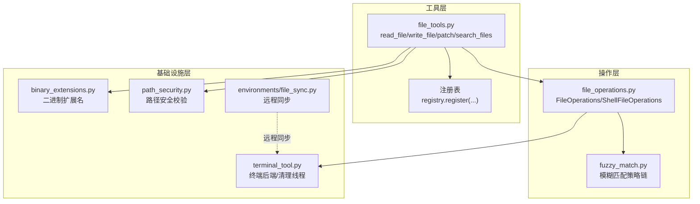
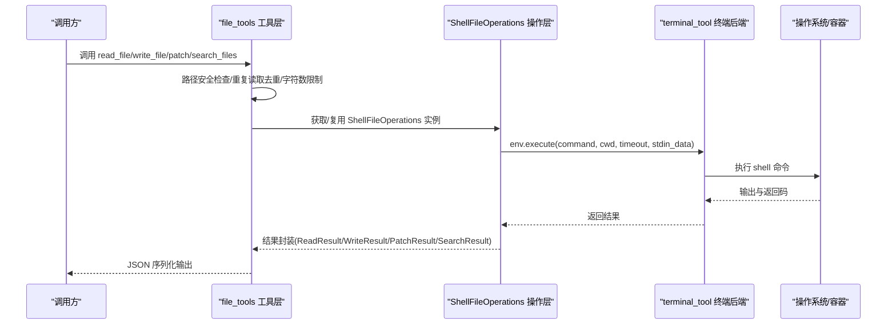
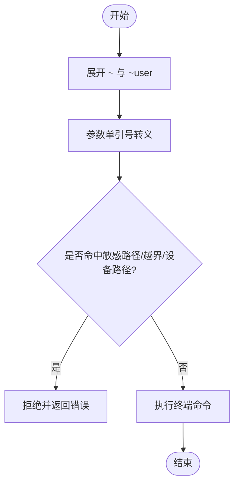
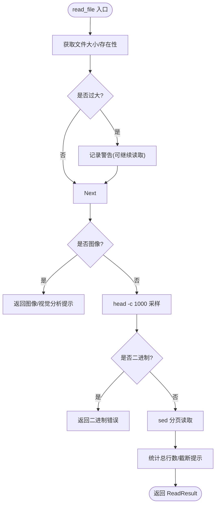
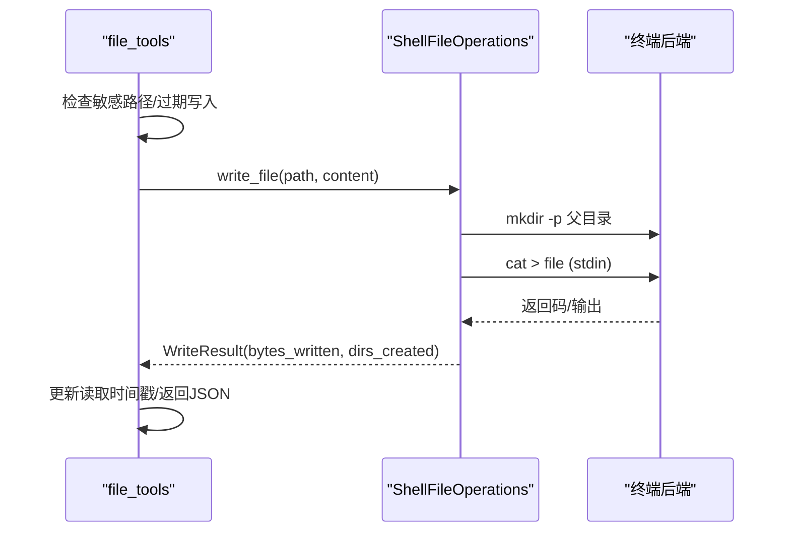
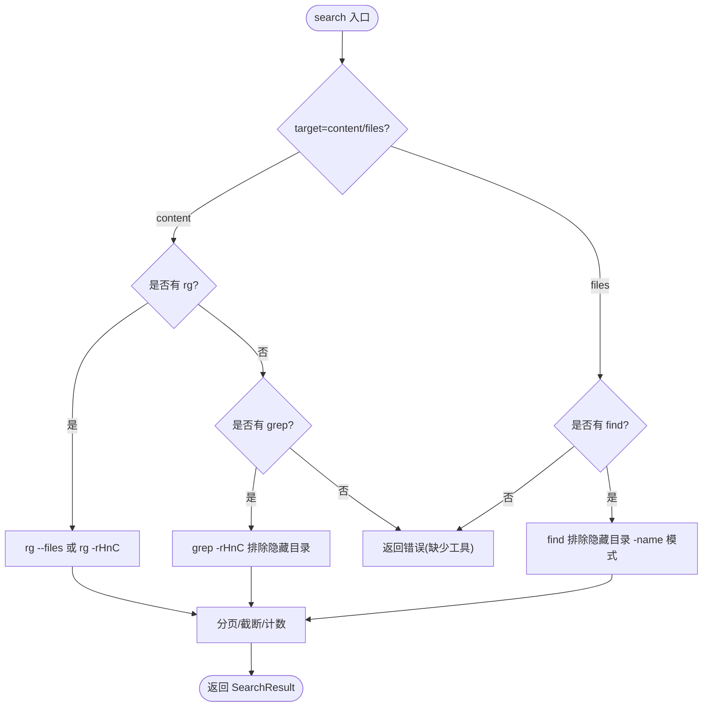
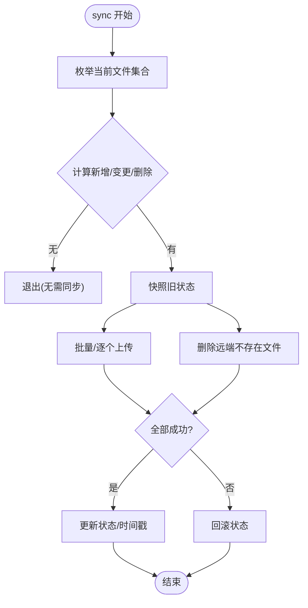
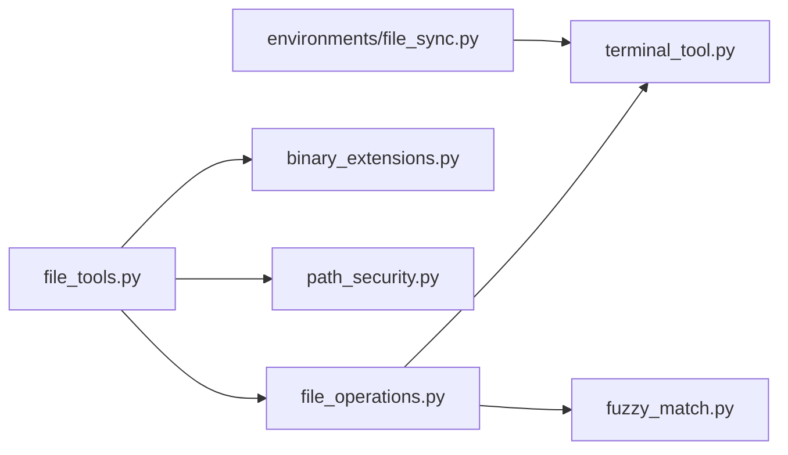

# 文件操作工具

<cite>
**本文引用的文件**
- [tools/file_operations.py](file://tools/file_operations.py)
- [tools/file_tools.py](file://tools/file_tools.py)
- [tools/binary_extensions.py](file://tools/binary_extensions.py)
- [tools/path_security.py](file://tools/path_security.py)
- [tools/environments/file_sync.py](file://tools/environments/file_sync.py)
- [tools/fuzzy_match.py](file://tools/fuzzy_match.py)
- [tools/terminal_tool.py](file://tools/terminal_tool.py)
- [tests/tools/test_file_operations.py](file://tests/tools/test_file_operations.py)
- [tests/tools/test_file_operations_edge_cases.py](file://tests/tools/test_file_operations_edge_cases.py)
- [tests/tools/test_file_staleness.py](file://tests/tools/test_file_staleness.py)
- [tests/tools/test_file_tools.py](file://tests/tools/test_file_tools.py)
- [tests/tools/test_file_tools_live.py](file://tests/tools/test_file_tools_live.py)
- [tests/tools/test_credential_files.py](file://tests/tools/test_credential_files.py)
- [tests/gateway/test_document_cache.py](file://tests/gateway/test_document_cache.py)
</cite>

## 目录
1. [简介](#简介)
2. [项目结构](#项目结构)
3. [核心组件](#核心组件)
4. [架构总览](#架构总览)
5. [详细组件分析](#详细组件分析)
6. [依赖分析](#依赖分析)
7. [性能考量](#性能考量)
8. [故障排查指南](#故障排查指南)
9. [结论](#结论)
10. [附录](#附录)

## 简介
本文件面向Hermes Agent的文件操作工具，系统性阐述其安全机制（路径验证、权限控制）、文件读写与批量处理、递归遍历、文件监控与同步、格式与编码处理策略、性能优化与缓存、以及错误处理与最佳实践。文档以代码为依据，结合测试用例与实际实现，帮助开发者与使用者在多后端（本地、容器、云沙箱）环境中安全、高效地进行文件操作。

## 项目结构
文件操作工具由三层协作构成：
- 工具层：对外暴露read_file、write_file、patch、search_files等工具接口，并执行路径安全检查、重复读取去重、过量内容限制、敏感路径拦截、过期写入警告等。
- 操作层：统一抽象FileOperations接口，ShellFileOperations通过终端后端执行shell命令，屏蔽不同环境差异。
- 基础设施层：二进制文件识别、路径安全校验、文件同步管理、模糊匹配引擎、终端工具与清理线程。

图示来源
- [tools/file_tools.py:282-800](file://tools/file_tools.py#L282-L800)
- [tools/file_operations.py:248-1140](file://tools/file_operations.py#L248-L1140)
- [tools/fuzzy_match.py:50-102](file://tools/fuzzy_match.py#L50-L102)
- [tools/terminal_tool.py:1-200](file://tools/terminal_tool.py#L1-L200)
- [tools/binary_extensions.py:1-43](file://tools/binary_extensions.py#L1-L43)
- [tools/path_security.py:1-44](file://tools/path_security.py#L1-L44)
- [tools/environments/file_sync.py:74-169](file://tools/environments/file_sync.py#L74-L169)

章节来源
- [tools/file_tools.py:1-800](file://tools/file_tools.py#L1-L800)
- [tools/file_operations.py:1-1217](file://tools/file_operations.py#L1-L1217)
- [tools/terminal_tool.py:1-200](file://tools/terminal_tool.py#L1-L200)

## 核心组件
- ShellFileOperations：统一的文件操作实现，封装读取、写入、补丁、搜索、移动/删除等能力，所有操作通过终端后端execute执行，确保跨后端一致性。
- file_tools工具集：对外工具函数，负责路径安全检查、重复读取去重、字符数上限、敏感路径拦截、过期写入警告、并发缓存与清理、注册表导出。
- 二进制扩展名库：基于扩展名快速判断是否为二进制文件，避免对大体积或不可文本化的文件进行读取。
- 路径安全模块：提供相对路径解析与目录越界校验，防止路径遍历攻击。
- 文件同步器：在非绑定挂载后端中，基于mtime+size检测变更并事务式上传/删除。
- 模糊匹配引擎：多策略匹配链，提升文本替换的鲁棒性。

章节来源
- [tools/file_operations.py:248-1140](file://tools/file_operations.py#L248-L1140)
- [tools/file_tools.py:282-800](file://tools/file_tools.py#L282-L800)
- [tools/binary_extensions.py:1-43](file://tools/binary_extensions.py#L1-L43)
- [tools/path_security.py:15-44](file://tools/path_security.py#L15-L44)
- [tools/environments/file_sync.py:74-169](file://tools/environments/file_sync.py#L74-L169)
- [tools/fuzzy_match.py:50-102](file://tools/fuzzy_match.py#L50-L102)

## 架构总览
文件操作从“工具层”进入，经过“安全与上下文控制”，调用“操作层”的ShellFileOperations，最终通过“终端后端”执行shell命令；同时配合“基础设施层”的二进制识别、路径校验、同步与模糊匹配。

图示来源
- [tools/file_tools.py:282-800](file://tools/file_tools.py#L282-L800)
- [tools/file_operations.py:322-447](file://tools/file_operations.py#L322-L447)
- [tools/terminal_tool.py:1-200](file://tools/terminal_tool.py#L1-L200)

## 详细组件分析

### 安全机制：路径验证与权限控制
- 路径展开与转义：先展开~与~user，再对参数进行单引号转义，避免shell注入。
- 敏感路径拦截：内置静态拒绝列表（如~/.ssh、/etc、~/.aws等）与可选safe-root沙箱约束，阻止写入受保护系统/凭证路径。
- 设备路径阻断：禁止读取/dev/zero、/dev/stdin等会阻塞或产生无限输出的设备文件。
- 路径越界校验：使用resolve()与relative_to()确保路径位于允许根目录内，防止../遍历。
- 写入异常预期化：对特定权限/只读错误进行预期化处理，避免噪声日志。

图示来源
- [tools/file_operations.py:411-452](file://tools/file_operations.py#L411-L452)
- [tools/file_operations.py:99-117](file://tools/file_operations.py#L99-L117)
- [tools/file_tools.py:74-91](file://tools/file_tools.py#L74-L91)
- [tools/file_tools.py:102-118](file://tools/file_tools.py#L102-L118)
- [tools/path_security.py:15-44](file://tools/path_security.py#L15-L44)

章节来源
- [tools/file_operations.py:99-117](file://tools/file_operations.py#L99-L117)
- [tools/file_tools.py:74-118](file://tools/file_tools.py#L74-L118)
- [tools/path_security.py:15-44](file://tools/path_security.py#L15-L44)

### 文件读取：分页、二进制与图像处理
- 分页读取：使用sed按行范围读取，统计总行数与截断提示；支持原始读取（cat）。
- 二进制检测：先按扩展名判断，再采样内容分析非打印字符比例；图像文件直接引导至视觉分析工具。
- 行号前缀：为可读内容添加行号前缀，长行截断显示。
- 字符数上限：根据配置限制单次读取字符数，避免上下文窗口溢出。
- 重复读取去重：基于mtime与键值缓存，避免重复发送相同内容；上下文压缩后清空去重缓存。
- 过量读取提示：对大文件且未分页读取时给出优化建议。

图示来源
- [tools/file_operations.py:468-555](file://tools/file_operations.py#L468-L555)
- [tools/file_operations.py:505-525](file://tools/file_operations.py#L505-L525)
- [tools/file_operations.py:400-410](file://tools/file_operations.py#L400-L410)
- [tools/file_tools.py:364-403](file://tools/file_tools.py#L364-L403)
- [tools/binary_extensions.py:37-43](file://tools/binary_extensions.py#L37-L43)

章节来源
- [tools/file_operations.py:468-555](file://tools/file_operations.py#L468-L555)
- [tools/file_tools.py:282-450](file://tools/file_tools.py#L282-L450)
- [tools/binary_extensions.py:1-43](file://tools/binary_extensions.py#L1-L43)

### 文件写入与补丁：原子性、差分与语法检查
- 写入流程：自动创建父目录，通过stdin管道写入，绕过ARG_MAX限制；统计字节数并返回结果。
- 补丁模式：支持精确替换与V4A多文件补丁；采用模糊匹配策略链，提升稳定性；生成统一差分；可选语法检查。
- 过期写入警告：若文件在读取后被外部修改，写入前发出警告，避免覆盖他人变更。
- 并发写入时间戳更新：成功写入后刷新读取时间戳，避免连续写入误报。

图示来源
- [tools/file_operations.py:665-717](file://tools/file_operations.py#L665-L717)
- [tools/file_tools.py:541-562](file://tools/file_tools.py#L541-L562)

章节来源
- [tools/file_operations.py:665-717](file://tools/file_operations.py#L665-L717)
- [tools/file_operations.py:723-782](file://tools/file_operations.py#L723-L782)
- [tools/file_tools.py:541-620](file://tools/file_tools.py#L541-L620)

### 搜索与遍历：内容与文件名
- 内容搜索：优先使用ripgrep（--files模式），支持.gitignore感知、隐藏目录排除、并行遍历；支持输出模式（完整匹配/仅文件/计数）与上下文行。
- 文件名搜索：当无ripgrep时回退到find，同样排除隐藏目录；结果按修改时间排序。
- 路径存在性与相似文件建议：找不到目标路径时，列出同级相似文件供选择。

图示来源
- [tools/file_operations.py:853-1140](file://tools/file_operations.py#L853-L1140)

章节来源
- [tools/file_operations.py:853-1140](file://tools/file_operations.py#L853-L1140)

### 文件监控、变更检测与同步
- 变更检测：基于mtime+size键值跟踪已同步文件；仅在有变更或删除时触发上传/删除。
- 事务式同步：全部成功才提交状态，失败则回滚，保证一致性。
- 同步频率：默认每5秒一次，可通过环境变量强制同步。
- 远程枚举：合并凭证、技能与缓存文件，统一生成(主机路径, 容器路径)对。

图示来源
- [tools/environments/file_sync.py:101-169](file://tools/environments/file_sync.py#L101-L169)

章节来源
- [tools/environments/file_sync.py:74-169](file://tools/environments/file_sync.py#L74-L169)

### 文件格式支持、编码与二进制处理
- 二进制扩展名：基于扩展名集合快速判定，避免对图片、视频、音频、可执行文件、数据库文件、字体、字节码等进行文本读取。
- 图像处理：检测到图像扩展名时，直接返回图像标志与提示，交由视觉分析工具处理。
- 编码与内容采样：读取时采用head采样与非打印字符比例判断二进制；写入通过stdin管道传递，避免命令行参数长度限制。
- 模糊匹配：针对LLM生成代码的差异（空白、缩进、转义、Unicode）提供多策略匹配，降低替换失败率。

章节来源
- [tools/binary_extensions.py:1-43](file://tools/binary_extensions.py#L1-L43)
- [tools/file_operations.py:377-398](file://tools/file_operations.py#L377-L398)
- [tools/file_operations.py:505-525](file://tools/file_operations.py#L505-L525)
- [tools/fuzzy_match.py:50-102](file://tools/fuzzy_match.py#L50-L102)

### 性能优化与缓存
- ARG_MAX规避：写入通过stdin管道，支持超大文件写入。
- 读取缓存：基于(mtime, 键)的去重缓存，避免重复传输；上下文压缩后清空。
- 命令可用性缓存：对后端命令可用性进行缓存，减少重复探测。
- 搜索加速：优先ripgrep，支持并行目录遍历；分页抓取避免一次性输出过多。
- 同步节流：默认5秒同步间隔，避免频繁IO；支持强制同步。

章节来源
- [tools/file_operations.py:697-700](file://tools/file_operations.py#L697-L700)
- [tools/file_tools.py:130-150](file://tools/file_tools.py#L130-L150)
- [tools/file_operations.py:370-376](file://tools/file_operations.py#L370-L376)
- [tools/environments/file_sync.py:101-114](file://tools/environments/file_sync.py#L101-L114)

### 错误处理与安全最佳实践
- 预期写入异常：对权限/只读错误进行预期化处理，避免噪声日志。
- 过量读取防护：超过字符上限直接拒绝，提示使用offset/limit分页。
- 过期写入警告：检测到外部修改时提示风险，避免覆盖他人变更。
- 路径越界与设备文件阻断：严格校验工作目录与设备路径，防止路径遍历与死循环。
- 最佳实践清单：
  - 优先使用search_files替代grep/ls，利用ripgrep提升性能。
  - 对大文件使用offset/limit分页读取，避免上下文溢出。
  - 使用patch进行精准替换，而非write_file覆盖整文件。
  - 在远程后端使用FileSyncManager进行周期性同步，避免手动维护。
  - 通过HERMES_WRITE_SAFE_ROOT限制写入范围，强化沙箱安全。

章节来源
- [tools/file_tools.py:121-128](file://tools/file_tools.py#L121-L128)
- [tools/file_tools.py:374-387](file://tools/file_tools.py#L374-L387)
- [tools/file_tools.py:547-556](file://tools/file_tools.py#L547-L556)
- [tools/file_tools.py:74-91](file://tools/file_tools.py#L74-L91)

## 依赖分析
- 工具层依赖操作层与基础设施层；操作层依赖终端后端；同步器依赖后端传输回调。
- 模糊匹配作为补丁子模块被操作层调用；二进制扩展名与路径安全模块被工具层调用。

图示来源
- [tools/file_tools.py:1-15](file://tools/file_tools.py#L1-L15)
- [tools/file_operations.py:1-36](file://tools/file_operations.py#L1-L36)
- [tools/fuzzy_match.py:1-34](file://tools/fuzzy_match.py#L1-L34)
- [tools/terminal_tool.py:1-46](file://tools/terminal_tool.py#L1-L46)
- [tools/environments/file_sync.py:1-28](file://tools/environments/file_sync.py#L1-L28)

章节来源
- [tools/file_tools.py:1-15](file://tools/file_tools.py#L1-L15)
- [tools/file_operations.py:1-36](file://tools/file_operations.py#L1-L36)

## 性能考量
- 大文件写入：stdin管道绕过ARG_MAX，适合超大内容写入。
- 搜索性能：ripgrep比grep/ripgrep --files快约200倍；隐藏目录排除与.gitignore感知减少无效扫描。
- 读取去重：对未变更文件跳过重复传输，显著节省带宽与上下文占用。
- 命令缓存：后端命令可用性缓存降低重复探测成本。
- 同步节流：默认5秒同步间隔，避免频繁IO；可强制同步满足实时需求。

章节来源
- [tools/file_operations.py:697-700](file://tools/file_operations.py#L697-L700)
- [tools/file_operations.py:922-923](file://tools/file_operations.py#L922-L923)
- [tools/file_tools.py:130-150](file://tools/file_tools.py#L130-L150)
- [tools/environments/file_sync.py:101-114](file://tools/environments/file_sync.py#L101-L114)

## 故障排查指南
- 无法读取设备文件：/dev/zero、/dev/stdin等会被阻断，需改用终端工具或特殊处理。
- 二进制文件无法显示：图片/音视频/可执行文件等会被识别为二进制，应使用视觉分析工具或终端查看。
- 写入被拒绝：命中敏感路径/越界/只读文件系统，检查路径与权限；必要时使用终端工具并授权。
- 过期写入警告：若文件在读取后被外部修改，写入前会有警告，建议重新读取确认。
- 搜索失败：若缺少ripgrep/grep/find，安装对应工具；或使用文件名搜索模式。
- 同步失败：检查网络与后端权限；启用强制同步或等待下次节流周期。

章节来源
- [tools/file_tools.py:286-308](file://tools/file_tools.py#L286-L308)
- [tools/file_tools.py:547-556](file://tools/file_tools.py#L547-L556)
- [tools/file_operations.py:922-931](file://tools/file_operations.py#L922-L931)
- [tools/environments/file_sync.py:165-169](file://tools/environments/file_sync.py#L165-L169)

## 结论
Hermes Agent的文件操作工具通过“工具层—操作层—基础设施层”的清晰分层，在多后端环境下实现了统一、安全、高效的文件读写与搜索能力。其安全机制覆盖路径验证、权限控制、设备文件阻断与越界校验；性能优化包含stdin写入、ripgrep搜索、读取去重与同步节流；配套的模糊匹配与同步器进一步提升了易用性与可靠性。遵循本文最佳实践，可在复杂环境中稳定地完成文件操作任务。

## 附录
- 测试参考
  - 二进制识别与图像判断：[tests/tools/test_file_operations.py:204-230](file://tests/tools/test_file_operations.py#L204-L230)
  - 边缘情况（内容分析分支）：[tests/tools/test_file_operations_edge_cases.py:19-34](file://tests/tools/test_file_operations_edge_cases.py#L19-L34)
  - 过期写入警告与读取去重：[tests/tools/test_file_staleness.py:98-121](file://tests/tools/test_file_staleness.py#L98-L121)
  - 工具层行为（异常、写入、权限错误）：[tests/tools/test_file_tools.py:44-74](file://tests/tools/test_file_tools.py#L44-L74)
  - 写入行为（大文件、嵌套目录、特殊字符）：[tests/tools/test_file_tools_live.py:243-268](file://tests/tools/test_file_tools_live.py#L243-L268)
  - 缓存文件枚举与符号链接跳过：[tests/tools/test_credential_files.py:427-457](file://tests/tools/test_credential_files.py#L427-L457)
  - 文档缓存路径穿越阻断与清理：[tests/gateway/test_document_cache.py:50-122](file://tests/gateway/test_document_cache.py#L50-L122)